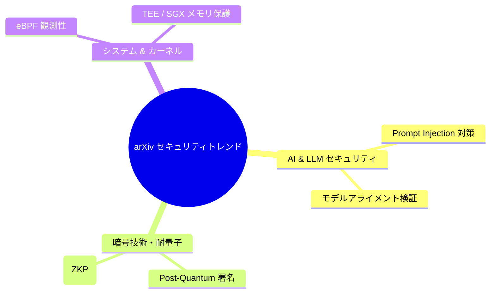

# paper-trend-analyzer

本スキルは、**「収集した arXiv セキュリティ論文群から最新の研究動向、主要技術キーワード、および脅威トレンドを抽出し、03_monthly / 04_quarterly / 05_annual サマリーに高度なエグゼクティブトレンドレポートおよび Mermaid 視覚化マップを動的に生成・挿入する」** ための標準プロシージャスキルです。

ITストラテジスト（STR）、情報検索（IR）、およびUI/UXデザイナー（UI）各エージェントの連携により、単なる論文一覧を超えた戦略的インサイトを提供します。

---

## 📈 トレンド分析 & 視覚化パイプライン

```
[1. 論文データテキストマイニング]
       ├── outputs/okf_papers/ および raw_data/ TXT から重要単語・複合フレーズ抽出
       └── 出現頻度 & 急上昇スコア (TF-IDF / キーワード共起度) の算出
       ↓
[2. セキュリティクラスタリング & カテゴリマッピング (STR / SC)]
       ├── 領域分類: Zero-Trust, LLM Safety, Cryptanalysis, EDR/XDR, IoT/Firmware, Quantum
       └── 主要研究テーマのサマリー文の生成
       ↓
[3. Mermaid トレンドダイアグラム生成 (UI)]
       └── サマリーレポート (03_monthly, 04_quarterly, 05_annual) へ自動挿入
```

---

## 📋 実行手順 (Instructions)

### Step 1: 分析対象データの選定
1. 分析対象期間（月次: 直近30日、四半期: 直近90日、通期: 直近365日）の OKF ドキュメント (`outputs/okf_papers/YYYY-MM-DD/*.md`) を特定する。

### Step 2: キーワード抽出 & トレンド集計
1. 以下の主要セキュリティドメインのキーワード出現率・相関度を集計：
   - AI & LLM Security (`Jailbreak`, `Prompt Injection`, `Alignment`, `Model Poisoning`)
   - Cryptography & Post-Quantum (`ZKP`, `Homomorphic Encryption`, `PQC`, `Lattice`)
   - System & OS Security (`eBPF`, `Kernel Exploit`, `Memory Safety`, `SGX/TEE`)
   - Network & Cloud (`Zero Trust`, `mTLS`, `BGP Hijacking`, `CASB`)

### Step 3: サマリーレポートへのトレンドセクション挿入
1. 対象のサマリーファイル（例: `outputs/executive_summaries/03_monthly/monthly_YYYY-MM-DD.md`）を開く。
2. 「## 1. 全体動向ハイライト」配下に **「### 今期の技術トレンド & 注目研究キーワード」** セクションと Mermaid 図を挿入する：



### Step 4: 品質検証 (`verify-quality-gates`)
1. 挿入後のマークダウン構文、Mermaid ダイアグラム描画エラー非存在、および相対パスの健全性を確認する。
