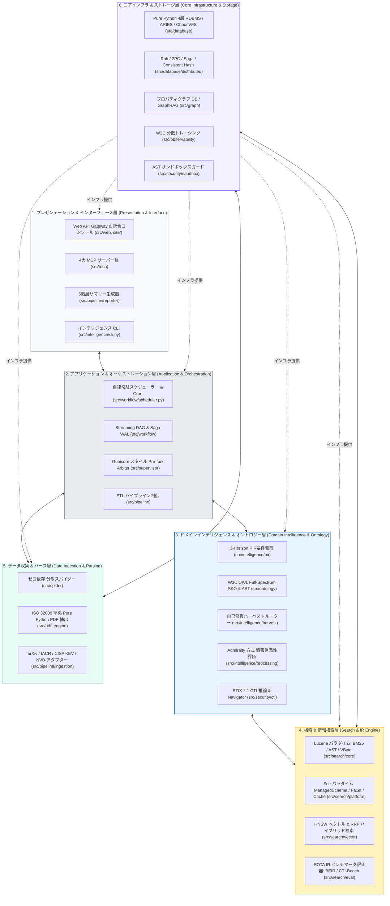
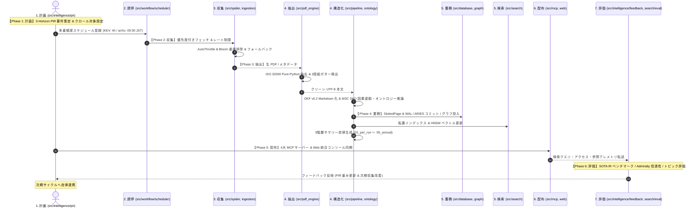

# 🛡️ arXiv Security Papers Intelligence & Search Ecosystem

[](https://www.python.org/)
[](docs/designs/DSN-03-pipeline_architecture.md)
[](docs/designs/DSN-13-pure_python_pdf_text_extractor.md)
[](docs/designs/DSN-11-universal_workflow_engine.md)
[](docs/designs/DSN-22-security_and_threat_ontology_w3c_specification.md)
[](src/mcp/)
[](docs/designs/DSN-04-search_engine_and_platform.md)
[](docs/designs/DSN-05-database_engine_architecture.md)
[](docs/designs/DSN-12-process_supervisor_and_arbiter.md)
[](Makefile)

arXiv のコンピュータサイエンス・暗号・セキュリティ分野（`cs.CR`）や IACR ePrint 等の学術・脅威論文データを自動収集・全文抽出・構造化し、**Google Open Knowledge Format (OKF) v0.2** 準拠のナレッジベース構築、**5階層エグゼクティブサマリー** 自律生成、**ISO 32000 準拠 Pure Python PDF 抽出基盤**、**2層分離検索エンジン基盤**（Apache Lucene / Solr パラダイム & SOTA IR 評価）、**純粋 Python 製 4層ベクトルデータベース**（カオス VFS & ARIES 電源断復元証明済）、**W3C OWL 準拠・全領域統合セキュリティ知識オントロジー (Full-Spectrum SKO)**、**エンタープライズ統合コンソール & Schema View**、**ゼロ外部依存 自律常駐型スケジューラー**（DSN-11 Rev 2.0）、**AI コーディングエージェント向け Model Context Protocol (MCP) サーバー群**、および **Gunicorn スタイル汎用プロセススーパーバイザー** を提供する統合インテリジェンスプラットフォームです。

---

## 🏢 1. 経営層・技術リーダー向け エグゼクティブサマリー（IT Strategist 監修）

> **「先端セキュリティ研究知見を迅速に構造化し、戦略的意思決定と開発・運用現場の防衛力強化へ直結させる自律型インテリジェンス基盤」**
> 
> *世界中から日々発表される膨大なセキュリティ論文・脅威フィードからノイズを排し、経営判断に資する動向サマリーと、AI エージェントが即座に利活用できる構造化ナレッジ・オントロジーグラフを自律生成します。*

### 🎯 本プロジェクトのコアバリュー：学術知見の構造化と利活用サイクルの短縮

サイバーセキュリティ領域では、学術論文や国際会議で新たな攻撃手法や脆弱性が発表されてから、現場のセキュリティ対策やコードベースに反映されるまでに大きなタイムラグが発生しがちです。
本プラットフォームは、最新のプレプリント・学術論文・外部脅威フィード（CISA KEV / NVD / MITRE ATT&CK）を自動取得し、全文抽出・ドメインタグ付与・オントロジー推論・要約生成を経て、**開発現場や AI エージェントが即座に検索・参照・検証可能なナレッジベースおよび検知ルール・パッチ検証テンプレート** を継続的に生成・供給します。

### 🌐 基盤アーキテクチャの汎用性と他ドメインへの適用可能性（拡張設計構想）

本システムの中核を構成するコアエンジン群（Pure-Python 分散スパイダー、2段組対応 PDF 抽出、内製 SQLite 互換/ベクトル DB、Admiralty 方式の情報信憑性評価、W3C OWL オントロジー、常駐型スケジューラー、MCP 連携）は、**ドメイン非依存（Domain-Agnostic）な疎結合アーキテクチャ** に基づいて設計されています。

セキュリティ論文（`cs.CR` / IACR）および CTI 脅威フィードをパイロットケースとして実証されたこれらの基盤は、データソースアダプターとスキーマ定義を追加することで、多様な学術・技術インテリジェンス領域への横展開が可能な設計となっています：

- 🧬 **学術・医学文献 (PubMed / bioRxiv 等)**: 論文メタデータ・本文抽出とトピック横断検索
- ⚛️ **物理・材料科学 (arXiv cond-mat / quant-ph 等)**: 先端研究知見の構造化と動向トラッキング
- 📈 **金融・規制・公報データ**: 公開ドキュメントの定期収集と構造化要約
- ⚖️ **特許・知財公報**: 技術文献の全文インデックス化と類似検索

### 💡 戦略的ハイライト (Strategic Highlights)

1. **情報収集・調査工数の削減と意思決定の迅速化**:
   - 継続的に収集される論文群から、**「今把握すべき重大な脅威動向と対策アプローチ」** を 100% 日本語で構造化サマリー（実行時・日次・月次・四半期・通期の 5 階層）として自動生成。文献リサーチにかかる定常的負荷を大幅に軽減します。
2. **ゼロ外部依存（Pure Python）による高い可搬性とインフラ運用の簡素化**:
   - 外部データベース（PostgreSQL / Elasticsearch / Redis / Neo4j）や OS 依存バイナリ（Poppler / pdftotext / Airflow）を必須とせず、**Python 3.14+ 標準ライブラリ主軸の Pure Python 実装** を採用。開発用端末、軽量コンテナ、閉域・エアギャップ環境でも容易にセットアップ・稼働可能です。
3. **自律常駐型オーケストレーション & 多重頻度調停 (DSN-11 Rev 2.0)**:
   - 外部オーケストレーターに頼らず、インプロセス 5 フィールド Cron パーサーとスケジューラーを内蔵。4時間毎の高頻度ストリーム（CISA KEV）と日次バッチ（arXiv / IACR）、定期サマリー生成、週次 SOTA / カオス監査を単一プロセスツリーで調停します。
4. **全領域統合セキュリティ知識オントロジー & グラフ可視化 (DSN-17, DSN-21, DSN-22)**:
   - W3C OWL 準拠の Full-Spectrum SKO により、論文・攻撃手法・脆弱性・防御コード・前提条件・実証エビデンスを因果関係連鎖としてモデル化。ブラウザ統合コンソール上の **Schema View** および **CTI Knowledge Graph** で直感的に探索可能です。
5. **AI コーディングエージェントとの標準プロトコル（MCP）連携**:
   - 業界標準の **Model Context Protocol (MCP)** サーバーを標準装備。Cursor、Claude Desktop、Antigravity IDE などの AI ツールから、論文知識・技術動向・脅威モデル・システム可観測性データへ直接アクセス可能です。
6. **科学的ベンチマークと極限耐障害性の実証**:
   - **SOTA IR ベンチマーク**: BEIR / CTI-Bench 評価基盤による定量的探索性能立証。
   - **カオス VFS & ARIES 復元**: 電源断・プロセス強制終了シミュレーション下でのデータ損失ゼロ（Zero Inconsistency）証明。

### 📊 特徴マトリクス

| 評価項目 | 従来の手動調査・個別ツール運用 | **本プラットフォーム (arxiv-security-papers)** |
| :--- | :--- | :--- |
| **収集・構造化** | 手動検索・個別ダウンロード | **完全自動収集・ISO 準拠 PDF 全文抽出・OKF v0.2 構造化** |
| **タスク管理** | cron や重量級 Airflow の個別運用 | **内製 Pure-Python スケジューラー (DSN-11 Rev 2.0) で常駐完結** |
| **サマリー生成** | 担当者ごとの断片的な共有 | **日次・月次・四半期・通期の体系的 5 階層日本語サマリー** |
| **オントロジー・因果探索** | テキスト検索のみ、関連性の見落とし | **W3C OWL Full-Spectrum SKO による因果連鎖・エビデンス探索** |
| **インフラ依存性** | 複数ミドルウェア（RDBMS, 検索, KVS, Graph）の構築が必要 | **外部依存ゼロ・Pure Python 軽量プロセスで完結** |
| **AI ツール連携** | 手動コピペや個別プロンプト入力 | **MCP (JSON-RPC 2.0) 経由で AI エージェントが直接参照** |
| **品質・解析基準** | スタイルや複雑度の基準がばらつきやすい | **Xenon Rank A (CC $\le 5$)・Flake8・mypy strict 自動検証** |
| **データ標準準拠** | ツール依存の独自フォーマット | **Google OKF v0.2 / ISO 32000 / W3C OWL 国際仕様準拠** |

---

## 📑 目次 (Table of Contents)

1. [経営層・技術リーダー向け エグゼクティブサマリー](#-1-経営層技術リーダー向け-エグゼクティブサマリーit-strategist-監修)
2. [6層モジュールアーキテクチャ (6-Layer Modular Architecture)](#-2-6層モジュールアーキテクチャ-6-layer-modular-architecture)
3. [閉ループ・インテリジェンス・ライフサイクル (Intelligence Lifecycle)](#-3-閉ループインテリジェンスライフサイクル-intelligence-lifecycle)
4. [主要機能とサブシステム (Key Features & Subsystems)](#-4-主要機能とサブシステム-key-features--subsystems)
5. [包括的設計書体系 (Design Specifications: DSN-01 〜 DSN-22)](#-5-包括的設計書体系-design-specifications-dsn-01--dsn-22)
6. [クイックスタート (Quick Start)](#-6-クイックスタート-quick-start)
7. [Makefile コマンド一覧 (Command Reference)](#-7-makefile-コマンド一覧-command-reference)
8. [ディレクトリ構成 (Directory Structure)](#-8-ディレクトリ構成-directory-structure)
9. [品質管理とガバナンス (Governance & Quality Gates)](#-9-品質管理とガバナンス-governance--quality-gates)

---

## 🏛 2. 6層モジュールアーキテクチャ (6-Layer Modular Architecture)

本システムは、[DSN-01](docs/designs/DSN-01-high_level_design.md) に規定された **6層分離クリーンアーキテクチャ** に基づき、高凝集・疎結合なモジュール設計を徹底しています。



---

## 🔄 3. 閉ループ・インテリジェンス・ライフサイクル (Intelligence Lifecycle)

情報収集・分析の閉ループサイクル ([DSN-11 Rev 2.0](docs/designs/DSN-11-universal_workflow_engine.md), [DSN-15](docs/designs/DSN-15-closed_loop_intelligence_system.md)) を通じて、計画から収集・構造化・配布・評価までを自律的に連携します。



---

## 🚀 4. 主要機能とサブシステム (Key Features & Subsystems)

- **自律常駐型スケジューラー & 多重頻度調停基盤 (`src/workflow/` / [DSN-11 Rev 2.0](docs/designs/DSN-11-universal_workflow_engine.md))**:
  - Apache Airflow 等を排したゼロ依存 Pure Python スケジューラー。5フィールド Cron 式パーサー内蔵、4時間毎の高頻度ストリーム（CISA KEV）と日次バッチ（arXiv/IACR）の衝突防止調停、レート制限（Full Jitter 指数バックオフ）、DSN-12 Supervisor 協調ホスティング (`WorkflowServiceHook`)、WAL 連携決定論的リカバリ。
- **全領域統合セキュリティ知識オントロジー & W3C OWL 仕様 (`src/ontology/` / [DSN-17](docs/designs/DSN-17-security_knowledge_ontology.md), [DSN-22](docs/designs/DSN-22-security_and_threat_ontology_w3c_specification.md))**:
  - 論文・攻撃手法・脆弱性・防御コード・前提条件・実証エビデンスを網羅する Full-Spectrum SKO。オントロジー宣言 DSL と AST インタプリタの完全分離、Pure-Python Turtle (.ttl) 生成、TBox グラフインジェスト。
- **エンタープライズ統合クラウドコンソール & Schema View (`site/`, `src/web/` / [DSN-21](docs/designs/DSN-21-enterprise_design_system_and_unified_console.md))**:
  - Glassmorphic デザインシステム準拠の SaaS 型統合ダッシュボード。CTI ナレッジグラフ可視化、オントロジースキーマエクスプローラー（Schema View: 二次ベジェ曲線・有向矢印・物理斥力レイアウト）、リアルタイムメトリクス監視。
- **ISO 32000 準拠 ゼロ依存 Pure Python PDF 抽出基盤 (`src/pdf_engine/` / [DSN-13](docs/designs/DSN-13-pure_python_pdf_text_extractor.md))**:
  - ISO 32000-1 (PDF 1.7) / ISO 32000-2 (PDF 2.0) 仕様準拠。外部バイナリ（Poppler / `pdftotext`）を使用せず、ゼロコピー字句解析、XRefStream / ObjStm 解凍、`/ToUnicode` CMap デコード、および **学術論文の 2段組（Two-Column）ガター境界自動検出 & 読書順序ソート** を Pure Python で実行。
- **極限耐障害性 4層データベース基盤 & カオス VFS (`src/database/` / [DSN-05](docs/designs/DSN-05-database_engine_architecture.md))**:
  - 4KB SlottedPage, 2Q Buffer Pool, WAL & ARIES 障害回復, B+Tree, LSM-Tree, PAX 列指向, 分散 Raft / Saga / 2PC。**カオス VFS による電源断シミュレーション・ミューテーションテスト下でのデータ完全復旧証明済**。（**全モジュール Xenon 100% Rank A 達成**）
- **2層分離検索エンジン基盤 & SOTA IR 評価 (`src/search/` / [DSN-04](docs/designs/DSN-04-search_engine_and_platform.md), [DSN-10](docs/designs/DSN-10-observability_and_eval_framework.md))**:
  - Lucene パラダイム（BM25, AST, VByte）と Solr パラダイム（ManagedSchema, Facet, LRU Cache）の分離。HNSW ベクトル RRF 融合。**BEIR / CTI-Bench 準拠 SOTA IR ベンチマークランナー** による定量的検索精度保証。
- **Gunicorn スタイル汎用プロセススーパーバイザー (`src/supervisor/` / [DSN-12](docs/designs/DSN-12-process_supervisor_and_arbiter.md))**:
  - Pre-fork ワーカーモデル、Erlang/OTP Supervisor ツリー構造、POSIX シグナル調停、Unix ドメインソケット IPC、ハートビート自己回復、`top` リアルタイムモニタリング CLI。Linux `PR_SET_PDEATHSIG` によるワーカー孤児化完全防止。
- **外部セキュリティ知識データセット統合インジェスト (`src/security/cti/` / [DSN-20](docs/designs/DSN-20-external_security_knowledge_ingestion_and_catalog_architecture.md))**:
  - CISA KEV (Known Exploited Vulnerabilities)、NVD CVE、MITRE ATT&CK / ATLAS、STIX 2.1 CTI 推論、および ATT&CK Navigator レイヤー自動生成。
- **AI エージェント向け Model Context Protocol (MCP) サーバー群 (`src/mcp/` / [DSN-08](docs/designs/DSN-08-mcp_strategic_ecosystem.md))**:
  - 論文インテリジェンス（`papers_server`）、技術動向レーダー（`tech_radar_server`）、脅威防御・パッチ検証（`threat_defense_server`）、可観測性プロファイラ（`observability_server`）の 4 大 JSON-RPC 2.0 サーバー。
- **共通セキュリティ基盤・AST ガード (`src/security/` / [DSN-07](docs/designs/DSN-07-security_guard_and_rbac.md))**:
  - 統一セキュリティ WSGI ミドルウェア、ゼロトラスト RBAC、レートリミット & DoS 防御、エージェント出力ガードレール、前方安全ハッシュ連鎖監査ログ。

---

## 📚 5. 包括的設計書体系 (Design Specifications: DSN-01 〜 DSN-22)

全 22 件の包括的アーキテクチャ設計書が策定・承認され、厳格なガバナンスの下で管理されています。

| DSN 番号 | 設計書ファイル | 対応パッケージ (`src/` / `site/`) | 領域 / サブシステム |
| :---: | :--- | :--- | :--- |
| **DSN-01** | [DSN-01-high_level_design.md](docs/designs/DSN-01-high_level_design.md) | システム全体 | 全体高位アーキテクチャ設計書 (HLD & 6層モジュール構造) |
| **DSN-02** | [DSN-02-low_level_design.md](docs/designs/DSN-02-low_level_design.md) | システム全体 | 全体低位アーキテクチャ設計書 (LLD & 共通規約) |
| **DSN-03** | [DSN-03-pipeline_architecture.md](docs/designs/DSN-03-pipeline_architecture.md) | `src/pipeline/` | ETL データパイプライン包括設計書 (`ingestion`, `transformer`, `reporter`) |
| **DSN-04** | [DSN-04-search_engine_and_platform.md](docs/designs/DSN-04-search_engine_and_platform.md) | `src/search/` | 2層検索エンジン & プラットフォーム設計書 (`core`, `platform`, `vector`) |
| **DSN-05** | [DSN-05-database_engine_architecture.md](docs/designs/DSN-05-database_engine_architecture.md) | `src/database/` | ゼロ依存 4層ベクトルデータベース & 分散合意・カオス耐性設計書 |
| **DSN-06** | [DSN-06-distributed_spider_and_crawler.md](docs/designs/DSN-06-distributed_spider_and_crawler.md) | `src/spider/` | 分散 Web クローラー & スパイダー基盤アーキテクチャ設計書 |
| **DSN-07** | [DSN-07-security_guard_and_rbac.md](docs/designs/DSN-07-security_guard_and_rbac.md) | `src/security/` | 共通セキュリティ基盤・AST ガード & RBAC エンジン設計書 |
| **DSN-08** | [DSN-08-mcp_strategic_ecosystem.md](docs/designs/DSN-08-mcp_strategic_ecosystem.md) | `src/mcp/` | Model Context Protocol (MCP) 戦略的エコシステム設計書 |
| **DSN-09** | [DSN-09-web_gateway_and_presentation.md](docs/designs/DSN-09-web_gateway_and_presentation.md) | `src/web/` | API Gateway & UI プレゼンテーション設計書 (`gateway`, `presentation`) |
| **DSN-10** | [DSN-10-observability_and_eval_framework.md](docs/designs/DSN-10-observability_and_eval_framework.md) | `src/observability/` | 可観測性 (Observability) & 情報検索評価 (IR Eval) 設計書 |
| **DSN-11** | [DSN-11-universal_workflow_engine.md](docs/designs/DSN-11-universal_workflow_engine.md) | `src/workflow/` | 自律常駐型スケジューラー・多重頻度調停・汎用ワークフロー包括設計書 (Rev 2.0) |
| **DSN-12** | [DSN-12-process_supervisor_and_arbiter.md](docs/designs/DSN-12-process_supervisor_and_arbiter.md) | `src/supervisor/` | 汎用プロセススーパーバイザー & 調停基盤設計書 |
| **DSN-13** | [DSN-13-pure_python_pdf_text_extractor.md](docs/designs/DSN-13-pure_python_pdf_text_extractor.md) | `src/pdf_engine/` | ISO 32000 準拠 Pure Python PDF 抽出 & 空間レイアウト再構築エンジン設計書 |
| **DSN-14** | [DSN-14-graph_engineering_dashboard.md](docs/designs/DSN-14-graph_engineering_dashboard.md) | `src/web/presentation/` | 論文・脅威ナレッジグラフ & エンジニアリングダッシュボード設計書 |
| **DSN-15** | [DSN-15-closed_loop_intelligence_system.md](docs/designs/DSN-15-closed_loop_intelligence_system.md) | `src/intelligence/` | 閉ループ・自律型インテリジェンス・オーケストレーション設計書 |
| **DSN-16** | [DSN-16-nextgen_security_knowledge_platform_proposal.md](docs/designs/DSN-16-nextgen_security_knowledge_platform_proposal.md) | プラットフォーム全体 | 次世代セキュリティ・ナレッジプラットフォーム包括的設計提言書 |
| **DSN-17** | [DSN-17-security_knowledge_ontology.md](docs/designs/DSN-17-security_knowledge_ontology.md) | `src/ontology/` | セキュリティ知識オントロジー (SKO) 規格設計書 |
| **DSN-18** | [DSN-18-property_graph_database_engine.md](docs/designs/DSN-18-property_graph_database_engine.md) | `src/graph/` | ゼロ侵襲型プロパティグラフデータベース基盤設計書 |
| **DSN-19** | [DSN-19-nlp_keyphrase_extraction_and_structured_synthesis.md](docs/designs/DSN-19-nlp_keyphrase_extraction_and_structured_synthesis.md) | `src/pipeline/` | NLP キーフレーズ抽出 & 構造化要約合成エンジン設計書 |
| **DSN-20** | [DSN-20-external_security_knowledge_ingestion_and_catalog_architecture.md](docs/designs/DSN-20-external_security_knowledge_ingestion_and_catalog_architecture.md) | `src/security/cti/` | 外部セキュリティ知識データセット（CISA KEV / NVD / ATT&CK）統合インジェスト設計書 |
| **DSN-21** | [DSN-21-enterprise_design_system_and_unified_console.md](docs/designs/DSN-21-enterprise_design_system_and_unified_console.md) | `site/`, `src/web/` | エンタープライズ統合デザインシステム & クラウドコンソール UI 包括設計書 |
| **DSN-22** | [DSN-22-security_and_threat_ontology_w3c_specification.md](docs/designs/DSN-22-security_and_threat_ontology_w3c_specification.md) | `src/ontology/` | セキュリティ & 脅威オントロジー W3C 仕様書 (Full-Spectrum SKO / OWL DL) |

---

## ⚡ 6. クイックスタート (Quick Start)

### 1. 開発環境のセットアップ
```bash
make setup
```

### 2. パイプライン／インテリジェンスサイクルの実行 (収集・抽出・OKF変換・5層サマリー)
```bash
make run
# 実体: PYTHONPATH=src .venv/bin/python src/intelligence/cli.py
```

### 3. セマンティックベクトルデータベース & 検索インデックスのビルド
```bash
# 全論文のセマンティック埋め込みベクトル (vectors.vdb) および HNSW 近傍探索インデックスの構築
make build_vector_db
```

### 4. SOTA IR ベンチマーク & カオス障害耐性試験の実行
```bash
# BEIR / CTI-Bench 準拠 SOTA IR ベンチマーク (BM25 vs Dense Vector vs Hybrid)
make benchmark_ir

# カオス VFS による電源断・クラッシュシミュレーション & ARIES 復旧監査
make test_chaos
```

### 5. 外部 CTI (MITRE ATT&CK / CISA KEV) の同期 & バックフィル
```bash
# CTI 定義のローカルカタログ同期
make sync_cti

# 過去全 OKF 論文アーカイブに対する CTI 脅威タグ・攻撃手法アノテーション
make reannotate_cti
```

### 6. Web 統合コンソール & 検索ポータルの起動
```bash
make run_web
# ブラウザで http://localhost:8000 にアクセス
# 統合コンソール: http://localhost:8000/dashboard (Schema View / CTI Graph / Analytics)
```

### 7. MCP サーバーの起動 (自律型 AI エージェント連携)
```bash
# 論文インテリジェンス MCP サーバー
make run_mcp_server

# 可観測性・プロファイリング特化 MCP サーバー
make run_observability_mcp

# 技術動向レーダー MCP サーバー
make run_tech_radar_mcp

# 脅威防御・パッチ検証 MCP サーバー
make run_threat_defense_mcp
```

### 8. プロセススーパーバイザーの起動 & 監視
```bash
# Gunicorn スタイル Pre-fork プロセス監視起動
make run_supervisor

# ライブステータス確認 (IPC Unix ドメインソケット)
make status_supervisor

# top リアルタイムモニタリングダッシュボード
make top_supervisor
```

---

## 🛠 7. Makefile コマンド一覧 (Command Reference)

```bash
## セットアップ & 品質ゲート
make setup              ## 仮想環境の構築と依存パッケージのインストール
make format             ## isort / black / flake8 によるコードフォーマットと検査
make check_format       ## フォーマット検査 (変更なし)
make static_analysis    ## flake8, radon, xenon, mypy --strict 静的解析
make test               ## pytest テストスイート実行 (高速実行)
make test_all           ## 包括的 E2E シナリオを含む全テスト実行
make check              ## check_format, static_analysis, test を一括実行 (品質ゲート)
make verify_quality     ## check_format, static_analysis, test, build_js を一括実行 (厳格品質ゲート)

## インテリジェンス & パイプライン
make run                ## インテリジェンスサイクル / パイプライン実行
make pipeline           ## ETL パイプライン (arXiv 論文取得・OKF変換・サマリー生成) を直接実行
make backfill_160d      ## 過去 160 日間の学術論文一括バックフィル実行
make backfill_resume    ## 中断されたバックフィルをチェックポイントから安全再開
make orchestrate        ## 汎用自律インテリジェンス 6 フェーズサイクル実行
make orchestrate_daemon ## 常駐デーモンモードでのインテリジェンス駆動

## 検索・評価 & ベンチマーク
make build_vector_db    ## セマンティックベクトルインデックス構築 / 再構築
make rag_query Q="..."  ## セマンティック RAG 検索クエリ実行
make eval_search        ## 検索エンジン品質ベンチマーク (MAP, MRR, NDCG)
make benchmark_ir       ## SOTA IR ベンチマーク実行 (BM25 vs Vector vs Hybrid)
make ir_eval            ## IR ランキング評価メトリクス計測 & ベースライン更新
make check_ir_regression## CI 品質ゲート: IR メトリクス性能劣化検査 (劣化 <= 3%)

## 外部 CTI & ナレッジグラフ
make sync_cti           ## MITRE ATT&CK / CISA KEV 定義のローカルカタログ同期
make reannotate_cti     ## 全 OKF 論文アーカイブに対する CTI アノテーション適用
make build_knowledge_graph ## セキュリティナレッジグラフの構築
make graph_stats        ## ナレッジグラフのトポロジー統計表示
make aggregate_analytics   ## アナリティクス指標の事前集計バッチ実行

## データベース & カオス耐性試験
make test_scenarios     ## tests/database/scenarios/ の全シナリオテスト実行
make test_chaos         ## ChaosVFS 電源断シミュレーション & ARIES クラッシュ復元監査

## Web & MCP サーバー
make run_web            ## 統合コンソール & WSGI Gateway 起動 (http://localhost:8000)
make run_dashboard      ## Graph Engineering Dashboard 起動
make run_mcp_server     ## 論文インテリジェンス MCP サーバー起動
make run_observability_mcp ## 可観測性プロファイラ MCP サーバー起動
make run_tech_radar_mcp ## 技術動向レーダー MCP サーバー起動
make run_threat_defense_mcp ## 脅威防御・パッチ検証 MCP サーバー起動
make mcp_stats          ## MCP 利用状況・パフォーマンス統計のエクスポート

## プロセススーパーバイザー
make run_supervisor     ## Gunicorn スタイル Pre-fork プロセス監視起動 (フォアグラウンド)
make start_supervisor   ## プロセススーパーバイザーをデーモンモード (-D) で起動
make status_supervisor  ## ライブプロセスステータス確認 (Unix ソケット)
make stop_supervisor    ## スーパーバイザーおよびワーカーの正常停止
make reload_supervisor  ## 設定・ワーカーのローリングリロード
make top_supervisor     ## top リアルタイムモニタリングダッシュボード

## ビルド
make build_js           ## Google Closure Compiler による Web JS バンドルビルド
```

---

## 📁 8. ディレクトリ構成 (Directory Structure)

```text
.
├── .agents/                    # 13専門エージェント規約 (AGENTS.md) & スキル群
├── docs/
│   ├── audits/                 # 監査レポート (database_resilience_report.md 等)
│   ├── benchmarks/             # 性能評価レポート (sota_evaluation.md 等)
│   ├── designs/                # 22大包括設計書体系 (DSN-01 〜 DSN-22)
│   ├── issues/                 # Issue 台帳 & クローズ済み履歴 (closed/ — 001〜194)
│   ├── manuals/                # ユーザーマニュアル (USR-01)
│   ├── mcp/                    # MCP サーバ仕様書 (MCP-01)
│   ├── processes/              # 文書管理台帳 (MNG-01, MNG-02)
│   └── requirements/           # 要件定義書 (REQ-01〜REQ-03)
├── outputs/
│   ├── raw_data/               # 原本データ (YYYY-MM-DD/<id>.pdf, .txt, _meta.json)
│   ├── okf_papers/             # Google OKF v0.2 Markdown (YYYY-MM-DD/<id>.md)
│   ├── executive_summaries/    # 5階層サマリー (01_per_run 〜 05_annual)
│   ├── vector_db/              # 検索エンジンインデックス (index.json)
│   ├── database/               # データベースエンジン永続化データ
│   ├── evaluations/            # IR 評価結果 & ベンチマークレポート
│   ├── logs/                   # パイプライン実行ログ
│   ├── supervisor/             # プロセススーパーバイザー状態・ソケット
│   ├── wal/                    # ワークフロー・オーケストレーター WAL ログ
│   ├── index.md                # OKF 論文統合インデックス
│   └── log.md                  # パイプライン実行履歴ログ
├── src/
│   ├── pdf_engine/             # ISO 32000 準拠 Pure Python PDF 抽出 & 空間レイアウト (DSN-13)
│   ├── spider/                 # ゼロ依存 分散クローラー (DSN-06)
│   ├── pipeline/               # ETL パイプライン (ingestion, transformer, reporter) (DSN-03, DSN-19)
│   ├── database/               # 純粋 Python 4層ベクトル DB / ARIES / ChaosVFS (DSN-05)
│   ├── search/                 # 2層検索基盤 & SOTA IR ベンチマーク (DSN-04, DSN-10)
│   ├── graph/                  # プロパティグラフ DB / GraphRAG (DSN-18)
│   ├── ontology/               # W3C OWL セキュリティ知識オントロジー (SKO) (DSN-17, DSN-22)
│   ├── analytics/              # 事前集計アナリティクスエンジン
│   ├── security/               # 共通セキュリティ・AST ガード & CTI インジェスト (DSN-07, DSN-20)
│   ├── mcp/                    # 戦略的 MCP サーバー群 (DSN-08)
│   ├── web/                    # API Gateway & 統合クラウドコンソール (DSN-09, DSN-21)
│   ├── intelligence/           # 閉ループ・ドメインインテリジェンス (DSN-15)
│   ├── workflow/               # 自律常駐スケジューラー & Streaming DAG (DSN-11 Rev 2.0)
│   ├── supervisor/             # 汎用プロセススーパーバイザー & 調停基盤 (DSN-12)
│   └── observability/          # Pure-Python W3C OTel & OpenInference 分散トレーシング (DSN-10)
├── tests/                      # 包括的テストスイート (1:1 ミラーリング)
│   ├── pdf_engine/             # PDF エンジン単体・実証ベンチマークテスト
│   ├── spider/                 # クローラーテスト
│   ├── pipeline/               # パイプラインテスト
│   ├── database/               # データベーステスト (scenarios/, chaos/ 含む)
│   ├── search/                 # 2層検索エンジンテスト & SOTA 評価テスト
│   ├── graph/                  # グラフエンジンテスト
│   ├── ontology/               # オントロジー DSL & Turtle 生成テスト
│   ├── analytics/              # アナリティクステスト
│   ├── security/               # セキュリティ・AST・CTI テスト
│   ├── mcp/                    # MCP サーバーテスト
│   ├── web/                    # Web Gateway & 統合コンソールテスト
│   ├── intelligence/           # インテリジェンスエンジンテスト
│   ├── workflow/               # ワークフロー基盤・スケジューラーテスト
│   ├── supervisor/             # スーパーバイザーテスト
│   └── observability/          # OTel & OpenInference トレーシングテスト
├── config/                     # パイプライン設定ファイル群
├── templates/                  # サマリーレンダリングテンプレート
├── site/                       # Web UI 静的ファイル (HTML / CSS / JS / Dashboard)
├── tools/                      # 開発補助ツール (Closure Compiler 等)
├── Makefile                    # ビルド & 運用自動化ターゲット
├── pyproject.toml              # プロジェクトメタデータ & ツール設定
└── README.md                   # 本ドキュメント
```

---

## 🔒 9. 品質管理とガバナンス (Governance & Quality Gates)

本プロジェクトは **13専門エージェント・マルチエージェントガバナンス ([AGENTS.md](.agents/AGENTS.md))** の下、厳格な品質管理基準（DoD）を適用して開発・運用されています。

1. **トリプル品質ゲート (Triple Quality Gates)**:
   - 全コード変更は `make check` (`make check_format`, `make static_analysis`, `make test`) を 100% 通過する必要があります。
2. **Issue 駆動開発**:
   - すべての機能追加・改善は [docs/issues/](docs/issues/) の Issue 台帳で管理され、DoD 達成後に [docs/issues/closed/](docs/issues/closed/) へアーカイブされます（**Issue 001〜194 全194件完了**）。
3. **循環的複雑度（Cyclomatic Complexity）厳格管理**:
   - 全モジュールにおいて `xenon --max-absolute A --max-modules A --max-average A` および `radon cc -s -n B`（全関数 CC $\le 5$）を達成しています。
4. **相対パス厳守**:
   - リポジトリ内の全 Markdown ドキュメントにおいて実効絶対パスリンクは完全 0 件に保たれ、高い移植性と完全なトレーサビリティが保証されています。

---

## 📄 ライセンス (License)

This project is licensed under the Apache 2.0 License - see the LICENSE file for details.
