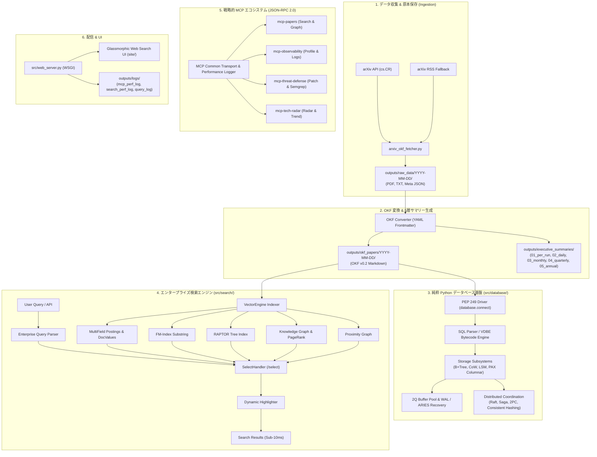

# 🛡️ arXiv Security Papers Intelligence & Search Ecosystem

[](https://www.python.org/)
[](docs/designs/DSN-01-pipeline-architecture.md)
[](src/mcp/)
[](src/search/)
[](src/database/)
[](Makefile)

arXiv のコンピュータサイエンス・暗号・セキュリティ分野（`cs.CR`）の最新論文を自動収集・解析・構造化し、**Google Open Knowledge Format (OKF) v0.2** 準拠のナレッジベース構築、**5階層エグゼクティブサマリー** 生成、**サブ10ms 超高速エンタープライズ検索エンジン**、**純粋 Python 製 SQLite 互換 & 分散ベクトルデータベース**、および **AI コーディングエージェント向け戦略的 MCP サーバー群** を提供する統合セキュリティインテリジェンス基盤です。

---

## 📑 目次 (Table of Contents)

1. [主要機能 (Key Features)](#-主要機能-key-features)
2. [システム全体アーキテクチャ (System Architecture)](#-システム全体アーキテクチャ-system-architecture)
3. [純粋 Python SQLite 互換 & 分散ベクトルデータベース基盤 (Database Engine)](#-純粋-python-sqlite-互換--分散ベクトルデータベース基盤-database-engine)
4. [Google OKF v0.2 仕様準拠 (OKF Specification)](#-google-okf-v02-仕様準拠-okf-specification)
5. [5階層エグゼクティブサマリー (5-Tier Executive Summaries)](#-5階層エグゼクティブサマリー-5-tier-executive-summaries)
6. [超高速ハイブリッド検索エンジン (Enterprise Search Engine)](#-超高速ハイブリッド検索エンジン-enterprise-search-engine)
7. [戦略的 MCP サーバーエコシステム (Model Context Protocol)](#-戦略的-mcp-サーバーエコシステム-model-context-protocol)
8. [可観測性・プロファイリング基盤 (Observability & Profiling)](#-可観測性プロファイリング基盤-observability--profiling)
9. [クイックスタート (Quick Start)](#-クイックスタート-quick-start)
10. [Makefile コマンド一覧 (Command Reference)](#-makefile-コマンド一覧-command-reference)
11. [ディレクトリ構成 (Directory Structure)](#-ディレクトリ構成-directory-structure)
12. [品質管理とガバナンス (Governance & Quality Gates)](#-品質管理とガバナンス-governance--quality-gates)

---

## 🚀 主要機能 (Key Features)

- **自動インテリジェンスパイプライン**:
  - arXiv API からの論文フェッチ、160日間過去データさかのぼり取得、RSS 自動フォールバック。
  - `pdftotext` による PDF 全文抽出と、原本（PDF/TXT/JSON）の完全保存（`outputs/raw_data/`）。
- **Google OKF v0.2 準拠ナレッジ化**:
  - 全論文を構造化 YAML フロントマター付き Markdown ドキュメントに変換（`outputs/okf_papers/`）。
  - MITRE ATT&CK、STRIDE 脅威モデル、CWE/CVE 分類、暗号技術タグを自動付与。
- **完全日本語 5階層エグゼクティブサマリー**:
  - `01_per_run`（実行時 1日4回）、`02_daily`（日次）、`03_monthly`（月次）、`04_quarterly`（四半期）、`05_annual`（通期）の順序付きディレクトリ構成。
- **純粋 Python SQLite 互換 & 分散ベクトルデータベース**:
  - ゼロ外部依存で実装された 4KB Slotted Page, 2Q Buffer Pool, WAL & ARIES 障害回復, B+Tree, CoW B-Tree, LSM-Tree, PAX 列指向, CBO オプティマイザ, 分散 Raft / Saga / 2PC / Consistent Hashing, PEP 249 DB-API 互換ドライバ。
- **Apache Lucene / Solr パラダイム検索エンジン**:
  - 転置インデックス（Postings）、DocValues（列指向）、FM-Index、RAPTOR 階層ツリー、ナレッジグラフ、PageRank 引用ネットワーク、近傍グラフによるサブ10ms ハイブリッド検索。
- **AI コーディングエージェント向け MCP サーバー (JSON-RPC 2.0)**:
  - 論文検索・探索、可観測性・プロファイリング、脅威防御・パッチ生成、技術レーダー・動向予測の 4 サーバーを提供。
- **ゼロ依存可観測性 & ログダンプ**:
  - Python 標準ライブラリ（`time`, `tracemalloc`）のみを用いたリアルタイム処理速度・メモリ消費計測と、`outputs/logs/` への構造化 JSONL ダンプ。

---

## 🏛 システム全体アーキテクチャ (System Architecture)



---

## 🗄 純粋 Python SQLite 互換 & 分散ベクトルデータベース基盤 (Database Engine)

外部 C ライブラリやサードパーティパッケージに依存せず、純粋 Python のみで構築されたモジュラー型データベースエンジン（`src/database/`）を提供します。

### 主要コンポーネントとアーキテクチャ

| レイヤ / サブパッケージ | 主要クラス / モジュール | 機能・特徴 |
| :--- | :--- | :--- |
| **ストレージ & バッファ** | `SlottedPage`, `BufferPool2Q`, `Pager`, `MemoryVFS`, `PosixVFS` | 4KB スロッテッドページ構造、スキャン汚染耐性 2Q キャッシュ、Steal/No-Force バッファポリシー、インメモリ / POSIX 抽象 VFS |
| **耐久性 & 障害回復** | `WALWriter`, `WALReader`, `ARIESRecoveryManager` | Write-Ahead Logging (WAL)、ARIES 3フェーズ（Analysis, Redo, Undo）クラッシュリカバリ |
| **主キー & B+Tree** | `BPlusTree`, `BTreeNode` (`src/database/btree/`) | $O(\log N)$ ポイント検索、リーフ双方向リンクによる範囲スキャン（`range_scan`）、ページ分割・マージ |
| **CoW B-Tree** | `CoWBTreeEngine`, `MetaPage` (`src/database/cow/`) | LMDB スタイルの Copy-on-Write B-Tree、Ping-Pong メタページコミット、SWMR ロックフリー完全スナップショット分離 |
| **LSM-Tree** | `LSMTreeEngine`, `BloomFilter`, `MemTable`, `SSTable` (`src/database/lsm/`) | 高速書込最適化、MurmurHash3 Bloom Filter、サイズ階層 Compaction |
| **PAX 列指向ストレージ** | `PAXPage`, `PAXScanner` (`src/database/pax/`) | ページ内列指向配置（Partition Attributes Across）、RLE / Dictionary 圧縮、高速 OLAP ベクトル集計 |
| **実行エンジン** | `VolcanoIterator`, `VectorizedBatchExecutor` (`src/database/engine/`) | プル型ストリーミングイテレータ（SeqScan, IndexScan, NestedLoop, HashJoin, Filter, Project, Limit）および SIMD ライクなカラムバッチ処理 |
| **CBO 最適化** | `QueryPlanner`, `DPJoinOptimizer`, `HyperLogLog`, `EquiDepthHistogram` (`src/database/planner/`) | 動的計画法（DP）による多表結合順序最適化、CBO コスト見積もり、HLL 基数推定、等深ヒストグラム選択度計算 |
| **分散合意 & 整合性** | `RaftCluster`, `SagaOrchestrator`, `TwoPhaseCoordinator`, `ConsistentHashRing` (`src/database/distributed/`) | Raft 分散合意、補償トランザクション Saga、分散 2相コミット (2PC)、仮想ノード付きコンシステントハッシュ、Merkle Tree Anti-Entropy、CRDTs (ORSet, PNCounter)、Vector Clock 因果性管理 |
| **SQL & VDBE** | `SQLParser`, `SQLCompiler`, `VDBEEngine`, `SQLExecutor` (`src/database/sql/`) | SQL 字句・構文解析、SQLite 風スタックマシンバイトコード仮想マシン（VDBE）、EXPLAIN 逆アセンブル |
| **トランザクション & セキュリティ** | `TransactionManager`, `LockManager`, `AccessController` | MVCC スナップショット分離、Strict 2PL、Wait-For Graph デッドロック検知、RBAC ロール権限制御 |
| **PEP 249 ドライバ** | `driver.connect`, `Connection`, `Cursor` | Python 標準 DB-API 2.0 準拠インターフェース、パラメータバインディング（`?`）、トランザクション制御 |

### 使用例 (PEP 249 DB-API 2.0)

```python
from database import connect

# データベース接続
conn = connect("outputs/database/papers.vdb", dim=4)
cur = conn.cursor()

# データ挿入
cur.execute(
    "INSERT INTO papers (id, title, category, vector) VALUES (?, ?, ?, ?)",
    ["p1", "Quantum Cryptography", "Cryptography", [1.0, 0.0, 0.0, 0.0]],
)
conn.commit()

# KNN ベクトル検索
cur.execute(
    "SELECT id, title, score FROM papers WHERE KNN(vector, ?, 5)",
    [[1.0, 0.0, 0.0, 0.0]],
)
results = cur.fetchall()
for row in results:
    print(row)

cur.close()
conn.close()
```

---

## 📋 Google OKF v0.2 仕様準拠 (OKF Specification)

変換された全論文 Markdown（`outputs/okf_papers/YYYY-MM-DD/<clean_id>.md`）は、Google Open Knowledge Format (OKF) v0.2 に準拠した構造化 YAML フロントマターを持ちます。

```yaml
---
type: "security-paper"
title: "Paper Title in English"
description: "日本語による1文のエグゼクティブサマリー"
resource: "https://arxiv.org/abs/2501.XXXXX"
tags:
  - "cryptography"
  - "zero-trust"
  - "llm-security"
timestamp: "2026-08-17T00:00:00Z"
provenance:
  origin: "arxiv.org"
  raw_metadata: "../../../outputs/raw_data/YYYY-MM-DD/2501.XXXXX_meta.json"
  pdf_source: "../../../outputs/raw_data/YYYY-MM-DD/2501.XXXXX.pdf"
  published_date: "2026-08-17"
  authors:
    - "Author One"
    - "Author Two"
trust:
  attestation: "verified"
  verifier: "arxiv-okf-fetcher-v2.0"
---
```

---

## 📚 5階層エグゼクティブサマリー (5-Tier Executive Summaries)

すべてのサマリーは完全日本語で執筆され、視認性の高いマークダウン表形式および動向分析を含みます。

| 階層ディレクトリ | 対象スパン | ファイル命名規則 | 特徴 |
| :--- | :--- | :--- | :--- |
| **`01_per_run/`** | 実行バッチごと (1日4回) | `run_HHMM.md` | 新着論文の即時速報 |
| **`02_daily/`** | 日次集計 | `YYYY-MM-DD.md` | 1日分のカテゴリ別集計 |
| **`03_monthly/`** | 月次集計 | `monthly_YYYY-MM-DD.md` | 月間技術動向・Mermaid マインドマップ |
| **`04_quarterly/`** | 四半期集計 | `quarterly_YYYY-MM-DD.md` | 四半期脅威ランドスケープ |
| **`05_annual/`** | 年次集計 | `annual_YYYY-MM-DD.md` | 年間セキュリティ技術総括 |

---

## ⚡ 超高速ハイブリッド検索エンジン (Enterprise Search Engine)

[Apache Lucene / Solr パラダイム](docs/designs/DSN-06-lucene-core-engine.md) に基づき、ゼロ依存の高速検索パイプラインを実装しています。

- **多層インデックス構造**:
  - `MultiFieldPostingsIndex`: タイトル、著者、本文、カテゴリ、タグごとの BM25 スコアリング。
  - `DocValues`: 列指向フィールドストレージによる高速ファセット集計（カテゴリ、年代）。
  - `FM-Index`: 全文の圧縮接尾辞配列による超高速部分一致検索。
  - `RAPTORTreeIndex`: 階層的クラスタリング木による長文文脈検索。
  - `KnowledgeGraphIndex` & `CitationNetworkIndex`: 論文間引用関係と PageRank スコア。
  - `ProximityGraphIndex`: 局所埋め込み近傍グラフによる類似論文探索。
- **クエリパーサー & ハイライター**:
  - フィールド指定クエリ（`author:Smith`, `category:cs.CR`, `tag:zero-trust`）、ブール論理（`AND`/`OR`/`NOT`）、フレーズ完全一致（`"phrase"`）、あいまい検索（`fuzzy~1`）。
  - `DynamicHighlighter`: 検索キーワードの前後に `<mark class="highlight">` タグを付与したコンテキストスニペット生成。

---

## 🤖 戦略的 MCP サーバーエコシステム (Model Context Protocol)

Claude Desktop、Antigravity、その他の AI コーディングエージェントと標準 stdio JSON-RPC 2.0 で連携可能な 4 つの特化型 MCP サーバーを提供します。

| サーバー名 | コマンド / エントリポイント | 主なツール / リソース / プロンプト |
| :--- | :--- | :--- |
| **`mcp-papers`** | `make run_mcp_server`<br/>(`src/mcp/papers_server.py`) | - `compact_search_papers`: トークン消費削減型検索<br/>- `get_paper_details`: 原本・メタデータ取得<br/>- `get_citation_graph`: 引用関係グラフ探索<br/>- `traverse_knowledge_graph`: セキュリティ概念グラフ探索 |
| **`mcp-observability`** | `make run_observability_mcp`<br/>(`src/mcp/observability_server.py`) | - `profile_code_performance`: cProfile + pstats ボトルネック解析<br/>- `track_memory_allocations`: tracemalloc RAM 追跡<br/>- `benchmark_alternatives`: timeit マイクロベンチマーク<br/>- `inspect_bytecode`: dis バイトコード逆アセンブル<br/>- `get_performance_logs`: 速度・メモリログ取得<br/>- `dump_performance_metrics`: 総合レポート出力 |
| **`mcp-threat-defense`** | `make run_threat_defense_mcp`<br/>(`src/mcp/threat_defense_server.py`) | - `generate_semgrep_rule`: 論文知見からの Semgrep ルール生成<br/>- `synthesize_secure_patch`: 脆弱性自動修正パッチ合成<br/>- `check_threat_coverage`: ATT&CK / STRIDE カバレッジ採点 |
| **`mcp-tech-radar`** | `make run_tech_radar_mcp`<br/>(`src/mcp/tech_radar_server.py`) | - `get_technology_radar`: Adopt / Trial / Assess / Hold 分類<br/>- `predict_emerging_threats`: 萌芽的脅威・攻撃手法予測 |

---

## 📊 可観測性・プロファイリング基盤 (Observability & Profiling)

パイプラインおよび MCP / 検索エンジンの全リクエストについて、リアルタイムかつゼロ依存で処理速度とメモリ消費を計測します。

- **計測指標**:
  - `wall_time_ms` (Wall-Clock 経過時間)
  - `cpu_time_ms` (CPU 消費時間)
  - `peak_memory_kb` (tracemalloc ピークメモリ)
  - `memory_delta_kb` (処理前後のメモリ増分)
  - `throughput_docs_per_sec` (1秒あたりの評価論文数)
- **ログダンプ先**:
  - `outputs/logs/mcp_perf_log.jsonl`: MCP サーバーツール・リソース実行ログ
  - `outputs/logs/search_perf_log.jsonl`: 検索エンジンクエリ実行ログ
  - `outputs/logs/query_log.jsonl`: Web サーバークエリログ

---

## 🏁 クイックスタート (Quick Start)

### 1. 必要環境
- Python 3.10+ (推奨: Python 3.14)
- `poppler-utils` (`pdftotext` コマンド用)
- Java JRE (Google Closure Compiler による JS ビルド用)

### 2. セットアップ
```bash
# 仮想環境の構築と依存関係のインストール
make setup
```

### 3. パイプライン実行（論文フェッチ & サマリー生成）
```bash
# 新着論文のフェッチ、PDF抽出、OKF変換、サマリー更新を一括実行
make run
```

### 4. Web 検索 UI の起動
```bash
# Web サーバーをポート 8000 で起動
make run_web
# ブラウザで http://localhost:8000 を開く
```

### 5. CLI でのセマンティック検索
```bash
# コマンドラインからの直接検索
make rag_query Q="Zero Trust Architecture"
```

---

## 🛠 Makefile コマンド一覧 (Command Reference)

```text
help                 ## 利用可能な make ターゲット一覧を表示
setup                ## 仮想環境作成、依存関係インストール、Git フック設定
clean                ## 一時ファイル、キャッシュ、ビルド成果物のクリーンアップ
format               ## isort, black, flake8 によるコードフォーマット
static_analysis      ## radon, xenon, mypy, py_compile による静的コード解析
test                 ## pytest による全単体・結合・互換性テスト実行 (170件 100% PASS)
check                ## format, static_analysis, test の必須品質ゲート一括実行
verify_quality       ## Python および JS の総合品質検証
build_js             ## Google Closure Compiler による JS ミニファイビルド
build_vector_db      ## 検索エンジンのインデックス構築・再構築
run                  ## arXiv 論文フェッチ・変換・サマリー生成パイプライン実行
run_web              ## Glassmorphic Web 検索 UI サーバー起動
run_mcp_server       ## 標準 MCP 論文サーバー起動
run_observability_mcp## 可観測性・プロファイリング特化 MCP サーバー起動
run_threat_defense_mcp## 脅威防御・パッチ生成 MCP サーバー起動
run_tech_radar_mcp   ## 技術レーダー MCP サーバー起動
eval_search          ## 検索エンジン精度ベンチマーク (Precision, Recall, MAP, NDCG) 実行
```

---

## 📁 ディレクトリ構成 (Directory Structure)

```text
.
├── .agents/                    # 13エージェント規約 (AGENTS.md) & スキル群
├── docs/
│   ├── designs/                # 機能設計書 (DSN-01 〜 DSN-12)
│   └── issues/                 # Issue 台帳 & クローズ済み履歴 (closed/)
├── outputs/
│   ├── raw_data/               # 原本データ (YYYY-MM-DD/<id>.pdf, .txt, _meta.json)
│   ├── okf_papers/             # Google OKF v0.2 Markdown (YYYY-MM-DD/<id>.md)
│   ├── executive_summaries/    # 5階層サマリー (01_per_run 〜 05_annual)
│   ├── vector_db/              # 検索エンジンインデックス (index.json)
│   ├── logs/                   # 構造化パフォーマンスログ (JSONL)
│   ├── index.md                # OKF 論文統合インデックス
│   └── log.md                  # パイプライン実行履歴ログ
├── site/                       # Glassmorphic Web Search UI (HTML/CSS/JS)
├── src/
│   ├── arxiv_okf_fetcher.py    # 論文収集 & OKF 変換メインパイプライン
│   ├── web_server.py           # WSGI Web サーバー & REST API
│   ├── database/               # 純粋 Python SQLite 互換 & 分散ベクトル DB
│   │   ├── btree/              # B+Tree インデックス (node.py, tree.py)
│   │   ├── cow/                # CoW B-Tree (mmap_file.py, meta_page.py, cow_btree.py, engine.py)
│   │   ├── distributed/        # 分散合意・整合性 (raft/, saga/, sharding/, two_pc/, crdt, gossip)
│   │   ├── engine/             # 実行エンジン (volcano.py, vectorized.py)
│   │   ├── lsm/                # LSM-Tree (memtable.py, sstable.py, bloom_filter.py, engine.py)
│   │   ├── pax/                # PAX 列指向ストレージ (encoding.py, pax_page.py, scanner.py)
│   │   ├── planner/            # CBO オプティマイザ (cost.py, histogram.py, hll.py, join_optimizer.py)
│   │   ├── sql/                # SQL パーサー & 仮想マシン (ast.py, parser.py, compiler.py, executor.py)
│   │   ├── driver.py           # PEP 249 Python DB-API 2.0 ドライバ (connect, Cursor, Connection)
│   │   ├── pager.py            # 4KB スロッテッドページ & 2Q バッファプール
│   │   ├── wal.py              # Write-Ahead Logging
│   │   ├── recovery.py         # ARIES 3-phase クラッシュリカバリ
│   │   └── vfs.py              # POSIX & インメモリ仮想ファイルシステム
│   ├── mcp/                    # 戦略的 MCP サーバーパッケージ群
│   │   ├── base.py             # 共通 JSON-RPC トランスポート & ログ基盤
│   │   ├── papers_server.py    # 論文検索・探索 MCP
│   │   ├── observability_server.py # 可観測性 MCP
│   │   ├── threat_defense_server.py # 脅威防御 MCP
│   │   └── tech_radar_server.py     # 技術レーダー MCP
│   └── search/                 # Apache Lucene / Solr パラダイム検索エンジン
│       ├── core/               # Tokenizer, Segment, Postings, DocValues
│       ├── server/             # Schema, FacetEngine, Highlighter, SelectHandler
│       ├── query/              # QueryParser, SynonymExpander, QueryCache
│       ├── ranking/            # KnowledgeGraph, CitationNetwork, ProximityGraph
│       └── utils/              # ExecutionProfiler, Metrics, Tokenizer
├── tests/                      # テストスイート (pytest / 170件 100% PASS)
│   ├── database/               # データベーステスト (src/database と同一階層構成)
│   │   ├── btree/              # B+Tree テスト
│   │   ├── compatibility/      # SQLite 互換 US-01 〜 US-12 ユーザーストーリー検証
│   │   ├── cow/                # CoW B-Tree テスト
│   │   ├── distributed/        # 分散合意・Saga・2PC・Sharding テスト
│   │   ├── engine/             # Volcano & Vectorized テスト
│   │   ├── lsm/                # LSM-Tree テスト
│   │   ├── pax/                # PAX 列指向テスト
│   │   ├── planner/            # CBO オプティマイザテスト
│   │   └── sql/                # SQL パーサー・実行エンジンテスト
│   ├── fetcher/                # フェッチャーテスト
│   ├── gateway/                # ゲートウェイテスト
│   ├── mcp/                    # MCP サーバーテスト
│   ├── presentation/           # プレゼンテーションテスト
│   ├── search/                 # 検索エンジンテスト
│   ├── security/               # セキュリティ・サンドボックステスト
│   └── web/                    # Web サーバーテスト
├── Makefile                    # ビルド & 運用自動化ターゲット
├── pyproject.toml              # プロジェクトメタデータ & ツール設定
└── README.md                   # 本ドキュメント
```

---

## 🔒 品質管理とガバナンス (Governance & Quality Gates)

本プロジェクトは **13専門エージェント・マルチエージェントガバナンス ([AGENTS.md](.agents/AGENTS.md))** の下、厳格な品質管理基準（DoD）を適用して開発・運用されています。

1. **トリプル品質ゲート (Triple Quality Gates)**:
   - 全コード変更は `make check` (`make format`, `make static_analysis`, `make test`) を 100% 通過する必要があります。
   - `git commit` 時には Git プリコミットフックにより品質検証が自動強制されます。
2. **Issue 駆動開発**:
   - すべての機能追加・改善は [docs/issues/](docs/issues/) の Issue 台帳で管理され、DoD 達成後に [docs/issues/closed/](docs/issues/closed/) へアーカイブされます。
3. **相対パス厳守**:
   - リポジトリ内の全 Markdown ドキュメントにおいて実効絶対パスリンクは完全 0 件に保たれ、移植性と完全なトレーサビリティが保証されています。

---

## 📄 ライセンス (License)

This project is licensed under the Apache 2.0 License - see the LICENSE file for details.
