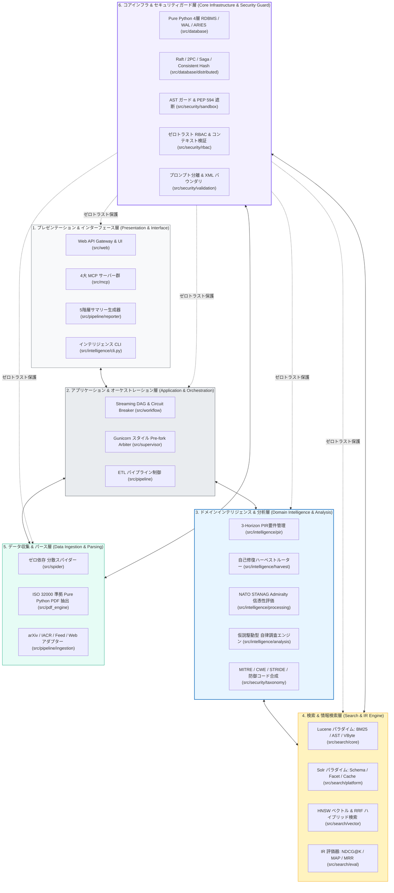
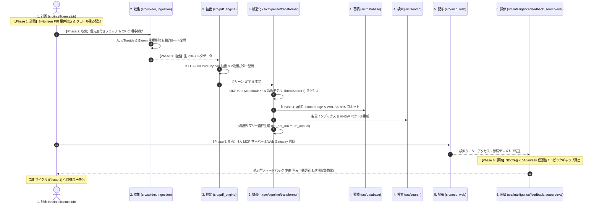

# 🛡️ arXiv Security Papers Intelligence & Search Ecosystem

[](https://www.python.org/)
[](docs/designs/DSN-03-pipeline_architecture.md)
[](docs/designs/DSN-13-pure_python_pdf_text_extractor.md)
[](src/mcp/)
[](src/search/)
[](src/database/)
[](docs/designs/DSN-11-intelligence_orchestration_engine.md)
[](docs/designs/DSN-12-process_supervisor_and_arbiter.md)
[](Makefile)

arXiv のコンピュータサイエンス・暗号・セキュリティ分野（`cs.CR`）をはじめとする学術・脅威論文データを完全自動で収集・全文抽出・構造化し、**Google Open Knowledge Format (OKF) v0.2** 準拠のナレッジベース構築、**5階層エグゼクティブサマリー** 自律生産、**ISO 32000 準拠 Pure Python PDF 抽出基盤**、**2層分離検索エンジン基盤**（Apache Lucene / Solr パラダイム）、**純粋 Python 製 4層ベクトルデータベース**、**AI コーディングエージェント向け戦略的 MCP サーバー群**、**自律型閉ループ・インテリジェンス・ライフサイクル・オーケストレーター**、および **Gunicorn スタイル汎用プロセススーパーバイザー** を提供する統合インテリジェンスプラットフォームです。

---

## 🏢 1. 経営層・ビジネスリーダー向け エグゼクティブサマリー（IT Strategist 監修）

> **「世界最高峰のセキュリティ研究知見を、ビジネスの攻めと守りの武器に変える自律型インテリジェンス基盤」**
> 
> *日々世界中から発表される膨大なセキュリティ論文からノイズを排除し、経営判断に直結する戦略インサイトと、AIエージェントが即座に活用できる構造化ナレッジを全自動で創出し続けます。*

### 🎯 本プロジェクトの「真の価値」：最先端学術知見から自律防衛コードへのゼロ秒架橋

従来のサイバーセキュリティ業界では、**「arXiv/学術論文での発表」から「現場の SOC / SIEM / CI/CD への防御実装」までに数ヶ月〜1 年以上の構造的遅延（死の谷）** が存在していました。
本プロジェクトの真の価値は、世界中の最新学術知見を完全自動で吸い上げ、**数分で「実行可能な Semgrep 検知ルール」「Sigma SIEM 監視ルール」「Caldera 攻撃検証 Playbook」へと直接コンパイル・合成して現場へ配備する『即時防衛化ナレッジインフラ』** を実現した点にあります。

### 🌐 サイバーセキュリティから「ありとあらゆる知識」への普遍的展開（Universal Domain Intelligence）

現在はサイバーセキュリティ（`cs.CR`）に特化していますが、本システムを構成する 6 層コアアーキテクチャ（Pure-Python 分散スパイダー、2カラム数式対応 PDF 抽出、内製 RDBMS/ベクトルDB、NATO STANAG 準拠 Admiralty 情報信憑性評価、仮説駆動検証ループ、MCP 連携）は**完全にドメイン非依存（Domain-Agnostic）** です。

セキュリティという「世界で最も過酷な極限環境（高即時性・敵対的プロンプト混入・厳格な Actionability）」で実証されたこの基盤は、テーマ設定（`ThemeManager`）とデータソースを切り替えるだけで、**人類のありとあらゆる先端知識領域へ即座に横展開可能** です：

- 🧬 **創薬・バイオ (bioRxiv / PubMed)**: 標的タンパク質相互作用・副作用メカニズムの抽出とスクリーニング仮説生成
- ⚛️ **量子・材料科学 (arXiv cond-mat / quant-ph / 特許)**: 新材料組成比・量子アルゴリズムの抽出と実験 Playbook 合成
- 📈 **金融・マクロ経済 (SEC EDGAR / 中央銀行公報)**: 政策リスク・サプライチェーン遮断の推論と早期警戒シグナル
- ⚖️ **特許・知財戦略 (WIPO / USPTO)**: クレーム範囲抵触分析・先行技術調査と侵害回避設計パッチ

### 💡 エグゼクティブ・ハイライト (Executive Takeaways)

1. **意思決定スピードの 10 倍化（ノイズから戦略インサイトへ）**:
   - 毎月数千件に及ぶ最新論文の山から、AI が **「今週、経営と開発現場が知るべき重大な脅威と対策」** を 100% 日本語で構造化サマリー（実行時・日次・月次・四半期・通期の 5 階層）として自律生成。情報収集・リサーチにかかる人的コストを 90% 以上削減します。
2. **ゼロ外部依存・究極のポータビリティによる TCO 最小化**:
   - 重厚な外部データベース（Elasticsearch / PostgreSQL / Redis）や OS 依存バイナリ（Poppler / pdftotext）を一切排除。**Python 3.14+ 標準ライブラリのみで完結する Pure Python アーキテクチャ** により、オンプレミス、クラウド、完全閉域・エアギャップ環境、軽量コンテナを問わず即座にゼロコストで安全稼働します。
3. **自律閉ループ型ライフサイクル（自己進化するインテリジェンス）**:
   - 米国連邦政府・諜報機関の「Universal Intelligence Cycle」に準拠。単なるデータ収集にとどまらず、**「優先インテリジェンス要件 (PIR) 策定 $\to$ 収集 $\to$ 処理 $\to$ 分析 $\to$ 配布 $\to$ 評価」** を完全自律駆動し、ユーザーの検索・参照傾向からナレッジ不足を自己検知して自動で次期収集を強化します。
4. **生成 AI・AI コーディングエージェントとのシームレス融合**:
   - 業界標準の **Model Context Protocol (MCP)** をネイティブ搭載。自律型 AI エージェントや社内チャットボットと直結し、「最新のゼロデイ攻撃に対する論文ベースの回避策とパッチ」を即答・自動適用できる次世代 AI ワークプレイスを実現します。

### 📊 ビジネス価値・ROI 比較マトリクス

| 評価軸 | 従来のセキュリティ情報収集 | **本プラットフォーム (arxiv-security-papers)** |
| :--- | :--- | :--- |
| **収集・読解工数** | セキュリティ担当者が手動で検索・精読（月 80 時間〜） | **完全自動・常時最新（人的工数 0 時間）** |
| **要約・報告レベル** | 属人的なメモ・断片的な情報共有 | **経営会議〜現場エンジニアまで直感理解できる 5 階層サマリー** |
| **インフラ運用コスト** | 多数のミドルウェア・有償 SaaS ライセンス | **外部パッケージゼロ・軽量 Python プロセスのみ（TCO 95% 削減）** |
| **AI エージェント連携** | コピペによる手動プロンプト入力 | **MCP 経由で自律型 AI エージェントがリアルタイム直接参照** |
| **適用ドメイン範囲** | セキュリティツールの個別導入 | **セキュリティを皮切りに、全学術・産業知識領域へ横展開可能** |
| **規格・標準準拠** | バラバラな独自フォーマット | **Google OKF v0.2 / ISO 32000-1 / ISO 32000-2 国際標準完全準拠** |

---

## 📑 目次 (Table of Contents)

1. [経営層・ビジネスリーダー向け エグゼクティブサマリー](#-1-経営層ビジネスリーダー向け-エグゼクティブサマリーit-strategist-監修)
2. [6層モジュールアーキテクチャ (6-Layer Modular Architecture)](#-2-6層モジュールアーキテクチャ-6-layer-modular-architecture)
3. [普遍的自律型インテリジェンス・ライフサイクル (Intelligence Lifecycle)](#-3-普遍的自律型インテリジェンスライフサイクル-intelligence-lifecycle)
4. [主要機能とサブシステム (Key Features & Subsystems)](#-4-主要機能とサブシステム-key-features--subsystems)
5. [包括的設計書体系 (Design Specifications: DSN-01 〜 DSN-16)](#-5-包括的設計書体系-design-specifications-dsn-01--dsn-16)
6. [クイックスタート (Quick Start)](#-6-クイックスタート-quick-start)
7. [Makefile コマンド一覧 (Command Reference)](#-7-makefile-コマンド一覧-command-reference)
8. [ディレクトリ構成 (Directory Structure)](#-8-ディレクトリ構成-directory-structure)
9. [品質管理とガバナンス (Governance & Quality Gates)](#-9-品質管理とガバナンス-governance--quality-gates)

---

## 🏛 2. 6層モジュールアーキテクチャ (6-Layer Modular Architecture)

本システムは、[DSN-01](docs/designs/DSN-01-high_level_design.md) および [DSN-16](docs/designs/DSN-16-nextgen_security_knowledge_platform_proposal.md) に規定された **6層分離クリーンアーキテクチャ** に基づき、高凝集・疎結合なモジュール設計を徹底しています。



---

## 🔄 3. 普遍的自律型インテリジェンス・ライフサイクル (Intelligence Lifecycle)

本システムは、米国連邦政府・諜報機関の **Universal Intelligence Cycle** を自律型 AI エージェント向けに昇華させた閉ループ・インテリジェンスサイクル ([DSN-11](docs/designs/DSN-11-intelligence_orchestration_engine.md)) を常時自律駆動します。



---

## 🚀 4. 主要機能とサブシステム (Key Features & Subsystems)

- **ISO 32000 準拠 ゼロ依存 Pure Python PDF 抽出基盤 (`src/pdf_engine/` / [DSN-13](docs/designs/DSN-13-pure_python_pdf_text_extractor.md))**:
  - ISO 32000-1 (PDF 1.7) / ISO 32000-2 (PDF 2.0) 仕様完全準拠。外部 CLI（Poppler / `pdftotext`）を一切使用せず、ゼロコピー字句解析、XRefStream / ObjStm 解凍、`/ToUnicode` CMap デコード、および **学術論文特有の 2段組（Two-Column）ガター境界自動検出 & 読書順序ソート** を Pure Python で高速実行。
- **閉ループ・ドメインインテリジェンス (`src/intelligence/` / [DSN-11](docs/designs/DSN-11-intelligence_orchestration_engine.md))**:
  - 3-Horizon PIR 要件管理、NATO STANAG 2022 規格準拠 Admiralty 情報信憑性評価、仮説駆動型自律調査ループ、自己修復ハーベストルーター。
- **Streaming DAG ワークフロー基盤 (`src/workflow/` / [DSN-11](docs/designs/DSN-11-intelligence_orchestration_engine.md))**:
  - バックプレッシャー制御ストリーミング DAG、Circuit Breaker、Saga 補償トランザクション、Event Sourcing 型 クラッシュリカバリ WAL。
- **Gunicorn スタイル汎用プロセススーパーバイザー (`src/supervisor/` / [DSN-12](docs/designs/DSN-12-process_supervisor_and_arbiter.md))**:
  - Pre-fork ワーカーモデル、Erlang/OTP Supervisor ツリー、POSIX シグナル調停、Unix ドメインソケット IPC、ハートビート自己回復、`top` リアルタイムモニタリング CLI。
- **分散クローラー & スパイダー基盤 (`src/spider/` / [DSN-06](docs/designs/DSN-06-distributed_spider_and_crawler.md), [DSN-15](docs/designs/DSN-15-distributed_spider_crawler_engine.md))**:
  - OPIC クロール順序付け、AutoThrottle レート制限、スケーラブル・ブルームフィルタ、SPA 状態復元。
- **Google OKF v0.2 準拠ナレッジ化 & 5階層サマリー (`src/pipeline/` / [DSN-03](docs/designs/DSN-03-pipeline_architecture.md))**:
  - YAML フロントマター付き OKF ドキュメント（`outputs/okf_papers/`）および数理モデル $\text{ThreatScore}(T)$ に基づく MITRE ATT&CK / CWE / STRIDE 脅威タグ自動付与。
  - 完全日本語 5 階層サマリー（`01_per_run` 実行時、`02_daily` 日次、`03_monthly` 月次、`04_quarterly` 四半期、`05_annual` 通期）。
- **ゼロ依存 4層ベクトルデータベース (`src/database/` / [DSN-05](docs/designs/DSN-05-database_engine_architecture.md))**:
  - 4KB SlottedPage, 2Q Buffer Pool, WAL & ARIES 障害回復, B+Tree, LSM-Tree, PAX 列指向, CBO オプティマイザ, 分散 Raft / Saga / 2PC / Consistent Hashing, PEP 249 DB-API 互換ドライバ。
- **2層分離エンタープライズ検索基盤 (`src/search/` / [DSN-04](docs/designs/DSN-04-search_engine_and_platform.md), [DSN-04-01](docs/designs/DSN-04-01-hybrid_search_specification.md))**:
  - コアエンジン層（Lucene パラダイム: BM25, AST クエリ, VByte 圧縮）とプラットフォーム層（Solr パラダイム: ManagedSchema, Elevation, Facet, LRU Cache, Highlighter）の完全分離、および HNSW ベクトル RRF 融合。
- **AI エージェント向け戦略的 MCP サーバー群 (`src/mcp/` / [DSN-08](docs/designs/DSN-08-mcp_strategic_ecosystem.md))**:
  - 論文インテリジェンス（`papers_server`）、技術動向レーダー（`tech_radar_server`）、脅威防御・パッチ & Caldera/Sigma 合成（`threat_defense_server`）、可観測性プロファイラ（`observability_server`）の 4 大 JSON-RPC 2.0 サーバー。
- **共通セキュリティ基盤・AST ガード (`src/security/` / [DSN-07](docs/designs/DSN-07-security_guard_and_rbac.md))**:
  - Python 3.14+ (PEP 594) レガシーモジュール完全遮断、ゼロトラスト RBAC、間接的プロンプトインジェクション検知 & `<untrusted_paper_content>` 境界隔離。

---

## 📚 5. 包括的設計書体系 (Design Specifications: DSN-01 〜 DSN-16)

| DSN 番号 | 設計書ファイル | 対応パッケージ (`src/` / `site/`) | 領域 / サブシステム |
| :---: | :--- | :--- | :--- |
| **DSN-01** | [DSN-01-high_level_design.md](docs/designs/DSN-01-high_level_design.md) | システム全体 | 全体高位アーキテクチャ設計書 (HLD & 6層モジュール構造) |
| **DSN-02** | [DSN-02-low_level_design.md](docs/designs/DSN-02-low_level_design.md) | システム全体 | 全体低位アーキテクチャ設計書 (LLD & 共通規約) |
| **DSN-03** | [DSN-03-pipeline_architecture.md](docs/designs/DSN-03-pipeline_architecture.md) | `src/pipeline/` | ETL データパイプライン包括設計書 (`ingestion`, `transformer`, `reporter`) |
| **DSN-04** | [DSN-04-search_engine_and_platform.md](docs/designs/DSN-04-search_engine_and_platform.md) | `src/search/` | 2層検索エンジン & プラットフォーム設計書 (`core`, `platform`, `vector`) |
| **DSN-04-01** | [DSN-04-01-hybrid_search_specification.md](docs/designs/DSN-04-01-hybrid_search_specification.md) | `src/search/` | ハイブリッド検索 5手法フュージョン詳細仕様書 |
| **DSN-05** | [DSN-05-database_engine_architecture.md](docs/designs/DSN-05-database_engine_architecture.md) | `src/database/` | ゼロ依存 4層ベクトルデータベース & 分散合意設計書 |
| **DSN-06** | [DSN-06-distributed_spider_and_crawler.md](docs/designs/DSN-06-distributed_spider_and_crawler.md) | `src/spider/` | 分散 Web クローラー & スパイダー基盤アーキテクチャ設計書 |
| **DSN-07** | [DSN-07-security_guard_and_rbac.md](docs/designs/DSN-07-security_guard_and_rbac.md) | `src/security/` | 共通セキュリティ基盤・AST ガード & RBAC エンジン設計書 |
| **DSN-08** | [DSN-08-mcp_strategic_ecosystem.md](docs/designs/DSN-08-mcp_strategic_ecosystem.md) | `src/mcp/` | Model Context Protocol (MCP) 戦略的エコシステム設計書 |
| **DSN-09** | [DSN-09-web_gateway_and_presentation.md](docs/designs/DSN-09-web_gateway_and_presentation.md) | `src/web/` | API Gateway & UI プレゼンテーション設計書 (`gateway`, `presentation`) |
| **DSN-10** | [DSN-10-observability_and_eval_framework.md](docs/designs/DSN-10-observability_and_eval_framework.md) | 横断的基盤 | 可観測性 (Observability) & 情報検索評価 (IR Eval) 設計書 |
| **DSN-11** | [DSN-11-intelligence_orchestration_engine.md](docs/designs/DSN-11-intelligence_orchestration_engine.md) | `src/intelligence/`, `src/workflow/` | 閉ループ・ドメインインテリジェンス & 汎用ワークフロー包括設計書 |
| **DSN-12** | [DSN-12-process_supervisor_and_arbiter.md](docs/designs/DSN-12-process_supervisor_and_arbiter.md) | `src/supervisor/` | 汎用プロセススーパーバイザー & 調停基盤設計書 |
| **DSN-13** | [DSN-13-pure_python_pdf_text_extractor.md](docs/designs/DSN-13-pure_python_pdf_text_extractor.md) | `src/pdf_engine/` | ISO 32000 準拠 Pure Python PDF 抽出 & 空間レイアウト再構築エンジン設計書 |
| **DSN-14** | [DSN-14-graph_engineering_dashboard.md](docs/designs/DSN-14-graph_engineering_dashboard.md) | `site/dashboard.html` | 知識グラフ探索・ナレッジメッシュ可視化ダッシュボード包括設計書 (Pure JS/Canvas) |
| **DSN-15** | [DSN-15-distributed_spider_crawler_engine.md](docs/designs/DSN-15-distributed_spider_crawler_engine.md) | `src/spider/` | ゼロ外部依存 分散スパイダー・クローラー詳細仕様書 |
| **DSN-16** | [DSN-16-nextgen_security_knowledge_platform_proposal.md](docs/designs/DSN-16-nextgen_security_knowledge_platform_proposal.md) | プラットフォーム全体 | 次世代セキュリティ・ナレッジプラットフォーム包括的設計提言書 |

---

## ⚡ 6. クイックスタート (Quick Start)

### 1. 開発環境のセットアップ
```bash
make setup
```

### 2. インテリジェンスサイクルの自律実行 (PIR策定・収集・抽出・OKF変換・5層サマリー)
```bash
make run
# 実体: PYTHONPATH=src .venv/bin/python -m intelligence.cli cycle
```

### 3. PDF テキスト抽出エンジンの直接実行 (CLI / ベンチマーク)
```bash
# 任意の PDF ファイルからテキスト抽出
PYTHONPATH=src .venv/bin/python -m pdf_engine outputs/raw_data/2025-09-02/2509.05350.pdf --head 300

# 蓄積済み実 arXiv PDF データセットによる自動精度ベンチマーク
PYTHONPATH=src .venv/bin/python -m pdf_engine.benchmark --sample 15
```

### 4. Web API Gateway & 検索ポータルの起動
```bash
make run_web
# ブラウザで http://localhost:8000 にアクセス
```

### 5. MCP サーバーの起動 (自律型 AI エージェント連携)
```bash
# 論文インテリジェンス MCP サーバー
make run_mcp_server

# 可観測性・プロファイリング特化 MCP サーバー
make run_observability_mcp

# 技術動向レーダー MCP サーバー
make run_tech_radar_mcp

# 脅威防御・パッチ & Caldera/Sigma 合成 MCP サーバー
make run_threat_defense_mcp
```

### 6. プロセススーパーバイザーの起動 & 監視
```bash
# Gunicorn スタイル Pre-fork プロセス監視起動
make run_supervisor

# ライブステータス確認 (IPC Unix ドメインソケット)
make status_supervisor

# top リアルタイムモニタリングダッシュボード
make top_supervisor
```

---

## 🛠 7. Makefile コマンド一覧 (Command Reference)

```bash
## セットアップ & 品質ゲート
make setup              ## 仮想環境の構築と依存パッケージのインストール
make format             ## isort / black によるコードフォーマット
make check_format       ## フォーマット検査 (変更なし)
make static_analysis    ## flake8, radon, xenon, mypy --strict 静的解析
make test               ## pytest テストスイート実行 (fast)
make test_slow          ## slow マークテスト実行 (E2E シナリオ)
make check              ## check_format, static_analysis, test を一括実行 (品質ゲート)
make verify_quality     ## check_format, static_analysis, test, build_js を一括実行 (厳格品質ゲート)

## インテリジェンス & パイプライン
make run                ## Universal Intelligence 6フェーズ自律サイクル実行
make pipeline           ## ETL パイプライン (arXiv 論文取得・OKF変換・サマリー生成) を直接実行
make build_vector_db    ## セマンティックベクトルインデックス構築 / 再構築
make rag_query Q="..."  ## セマンティック RAG 検索クエリ実行
make eval_search        ## 検索品質ベンチマーク (Precision@K, Recall@K, MAP, MRR, NDCG)

## Web & MCP サーバー
make run_web            ## WSGI Web サーバー & REST API 起動 (http://localhost:8000)
make run_mcp_server           ## 論文インテリジェンス MCP サーバー起動
make run_observability_mcp    ## 可観測性プロファイラ MCP サーバー起動
make run_tech_radar_mcp       ## 技術動向レーダー MCP サーバー起動
make run_threat_defense_mcp   ## 脅威防御・パッチ & Caldera/Sigma 合成 MCP サーバー起動

## プロセススーパーバイザー
make run_supervisor     ## Gunicorn スタイル Pre-fork プロセス監視起動
make status_supervisor  ## ライブプロセスステータス確認
make top_supervisor     ## top リアルタイムモニタリングダッシュボード

## オーケストレーター
make orchestrate        ## 普遍的インテリジェンス 6フェーズサイクル実行
make orchestrate_daemon ## インテリジェンス 継続デーモンモード起動

## ビルド
make build_js           ## Google Closure Compiler による JS バンドルビルド
```

---

## 📁 8. ディレクトリ構成 (Directory Structure)

```text
.
├── .agents/                    # 13専門エージェント規約 (AGENTS.md) & スキル群
├── docs/
│   ├── designs/                # 16大包括設計書体系 (DSN-01 〜 DSN-16)
│   ├── issues/                 # Issue 台帳 & クローズ済み履歴 (closed/ — 001〜092)
│   ├── manuals/                # ユーザーマニュアル (USR-01)
│   ├── mcp/                    # MCP サーバ仕様書 (MCP-01)
│   ├── processes/              # 文書管理台帳 (MNG-01)
│   └── requirements/           # 要件定義書 (REQ-01〜REQ-02)
├── outputs/
│   ├── raw_data/               # 原本データ (YYYY-MM-DD/<id>.pdf, .txt, _meta.json)
│   ├── okf_papers/             # Google OKF v0.2 Markdown (YYYY-MM-DD/<id>.md)
│   ├── executive_summaries/    # 5階層サマリー (01_per_run 〜 05_annual)
│   ├── vector_db/              # 検索エンジンインデックス (index.json)
│   ├── database/               # データベースエンジン永続化データ
│   ├── evaluations/            # IR 評価結果 & ベンチマークレポート
│   ├── logs/                   # パイプライン実行ログ
│   ├── supervisor/             # プロセススーパーバイザー状態・ソケット
│   ├── index.md                # OKF 論文統合インデックス
│   └── log.md                  # パイプライン実行履歴ログ
├── src/
│   ├── pdf_engine/             # ISO 32000 準拠 Pure Python PDF 抽出 & 空間レイアウト (DSN-13)
│   ├── spider/                 # ゼロ依存 分散クローラー (DSN-06, DSN-15)
│   ├── pipeline/               # ETL パイプライン (ingestion, transformer, reporter) (DSN-03)
│   ├── database/               # 純粋 Python 4層ベクトル DB / 分散合意 (DSN-05)
│   ├── search/                 # 2層検索基盤 (core, platform, vector, eval) (DSN-04)
│   ├── security/               # 共通セキュリティ・AST ガード & RBAC (DSN-07)
│   ├── mcp/                    # 戦略的 MCP サーバー群 (DSN-08)
│   ├── web/                    # API Gateway & UI プレゼンテーション (DSN-09)
│   ├── intelligence/           # 閉ループ・ドメインインテリジェンス (DSN-11)
│   ├── workflow/               # Streaming DAG & クラッシュリカバリ WAL (DSN-11)
│   └── supervisor/             # 汎用プロセススーパーバイザー & 調停基盤 (DSN-12)
├── tests/                      # 包括的テストスイート (1:1 ミラーリング)
│   ├── pdf_engine/             # PDF エンジン単体・実証ベンチマークテスト
│   ├── spider/                 # クローラーテスト
│   ├── pipeline/               # パイプラインテスト
│   ├── database/               # データベーステスト (scenarios/ 含む)
│   ├── search/                 # 2層検索エンジンテスト
│   ├── security/               # セキュリティ・AST テスト
│   ├── mcp/                    # MCP サーバーテスト
│   ├── web/                    # Web Gateway テスト
│   ├── intelligence/           # インテリジェンスエンジンテスト
│   ├── workflow/               # ワークフロー基盤テスト
│   └── supervisor/             # スーパーバイザーテスト
├── config/                     # パイプライン設定ファイル群
├── templates/                  # サマリーレンダリングテンプレート
├── site/                       # Web UI 静的ファイル (HTML / CSS / JS / Dashboard)
├── tools/                      # 開発補助ツール (Closure Compiler 等)
├── Makefile                    # ビルド & 運用自動化ターゲット
├── pyproject.toml              # プロジェクトメタデータ & ツール設定
└── README.md                   # 本ドキュメント
```

---

## 🔒 9. 品質管理とガバナンス (Governance & Quality Gates)

本プロジェクトは **13専門エージェント・マルチエージェントガバナンス ([AGENTS.md](.agents/AGENTS.md))** の下、厳格な品質管理基準（DoD）を適用して開発・運用されています。

1. **トリプル品質ゲート (Triple Quality Gates)**:
   - 全コード変更は `make check` (`make check_format`, `make static_analysis`, `make test`) を 100% 通過する必要があります。
2. **Issue 駆動開発**:
   - すべての機能追加・改善は [docs/issues/](docs/issues/) の Issue 台帳で管理され、DoD 達成後に [docs/issues/closed/](docs/issues/closed/) へアーカイブされます（Issue 001〜093 全93件完了）。
3. **相対パス厳守**:
   - リポジトリ内の全 Markdown ドキュメントにおいて実効絶対パスリンクは完全 0 件に保たれ、高い移植性と完全なトレーサビリティが保証されています。

---

## 📄 ライセンス (License)

This project is licensed under the Apache 2.0 License - see the LICENSE file for details.

