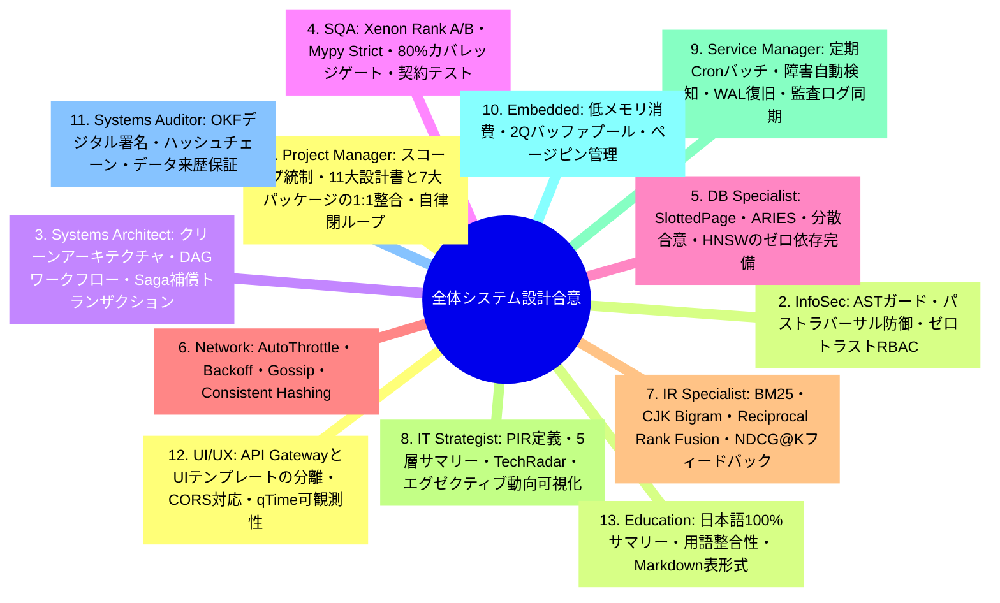
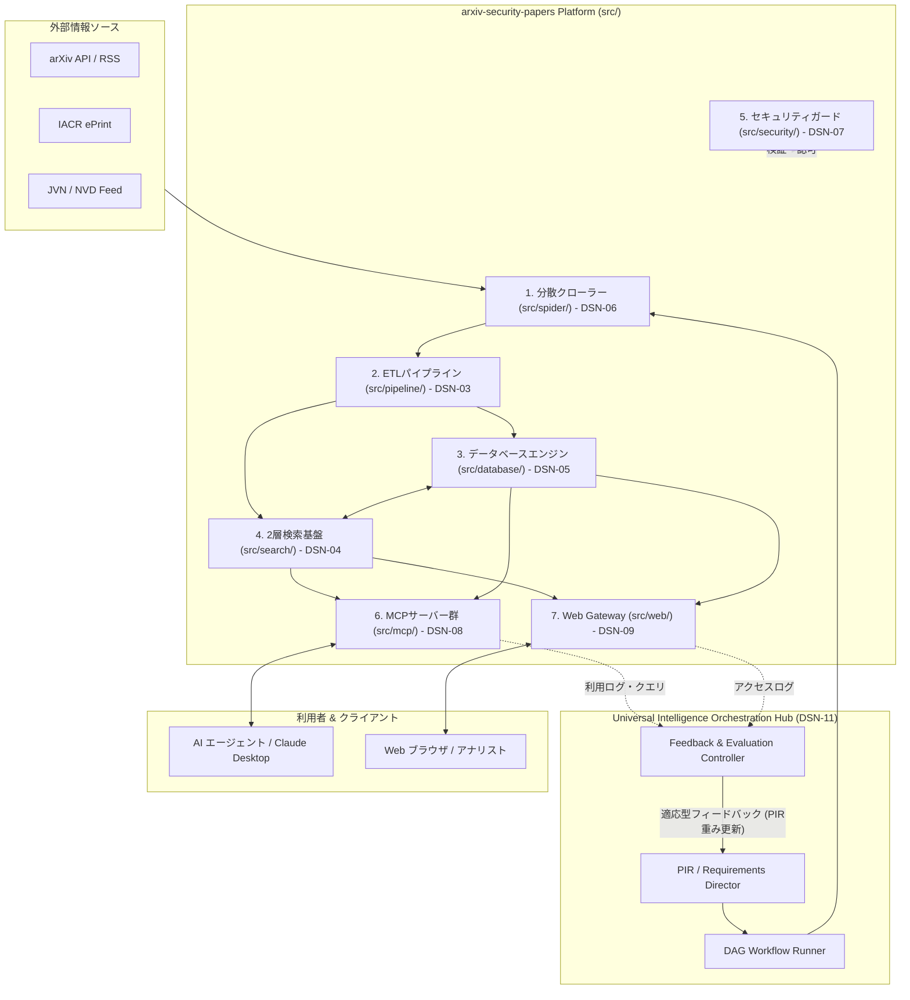
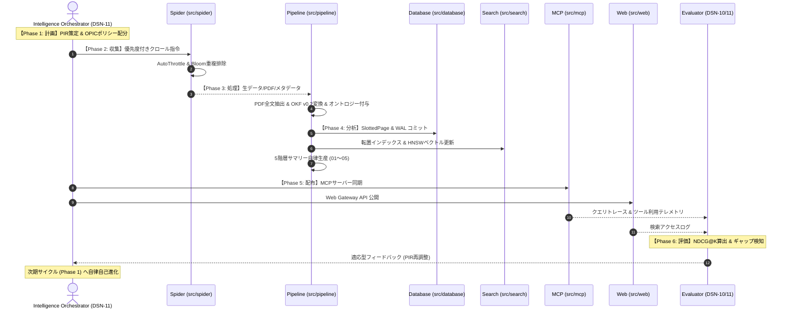

# [DSN-01] 全体高位アーキテクチャ設計書 (High-Level Design / System Overview) — arxiv-security-papers

- **文書番号**: `DSN-01`
- **文書ステータス**: `APPROVED`
- **対象サブシステム**: システム全体 (Overall System Architecture)
- **関連パッケージ**: `src/spider/`, `src/pipeline/`, `src/database/`, `src/search/`, `src/security/`, `src/mcp/`, `src/web/`
- **作成日**: 2026-08-22
- **最終更新日**: 2026-08-22
- **主幹エージェント**: Project Manager (PM) & Systems Architect

---

## 体系目次

- [1. アーキテクチャ概要・設計思想・スコープ](#1-アーキテクチャ概要設計思想スコープ)
  - [1.1 背景とシステムミッション](#11-背景とシステムミッション)
  - [1.2 4大設計原則](#12-4大設計原則)
  - [1.3 普遍的インテリジェンス・オーケストレーション中枢 (DSN-11)](#13-普遍的インテリジェンスオーケストレーション中枢-dsn-11)
- [2. 全13大専門エージェント多角的多面協議議事録](#2-全13大専門エージェント多角的多面協議議事録)
- [3. サブシステム間データフロー & C4 アーキテクチャ](#3-サブシステム間データフロー--c4-アーキテクチャ)
  - [3.1 C4 コンテナダイアグラム](#31-c4-コンテナダイアグラム)
  - [3.2 7大主要サブシステムの責務](#32-7大主要サブシステムの責務)
- [4. コア数理モデル & 共通アルゴリズム基盤](#4-コア数理モデル--共通アルゴリズム基盤)
- [5. 公開インターフェース & システム共通プロトコル](#5-公開インターフェース--システム共通プロトコル)
- [6. シーケンス図 & 6大フェーズ自律閉ループ E2E ライフサイクル](#6-シーケンス図--6大フェーズ自律閉ループ-e2e-ライフサイクル)
- [7. セキュリティ堅牢化・脅威防御・耐障害性設計 (Saga)](#7-セキュリティ堅牢化脅威防御耐障害性設計-saga)
- [8. 性能特性・メモリ制約・可観測性設計](#8-性能特性メモリ制約可観測性設計)
- [9. 包括的テスト戦略 & 検証スイート](#9-包括的テスト戦略--検証スイート)
- [10. 完了定義 (DoD) & 11大包括設計書体系](#10-完了定義-dod--11大包括設計書体系)

---

# 1. アーキテクチャ概要・設計思想・スコープ

### 1.1 背景とシステムミッション
`arxiv-security-papers` は、arXiv (cs.CR / Computer Science - Cryptography and Security) をはじめとする最新のサイバーセキュリティ論文・脅威インテリジェンス・暗号学研究データを完全自動で収集・全文抽出・構造化 (Google OKF v0.2) し、ゼロ外部依存の組込みデータベース・2層分離検索基盤・分散クローラー・共通セキュリティガード・Model Context Protocol (MCP) サーバー・Web ポータルを通じて多角的に提供する統合インテリジェンスプラットフォームである。

```
+---------------------------------------------------------------------------------------------------+
|                                  arxiv-security-papers Platform                                   |
+---------------------------------------------------------------------------------------------------+
|  [External Intelligence Sources]                                                                  |
|   arXiv API (cs.CR) | IACR ePrint | JVN/NVD/CISA Advisories | PDF Repositories                    |
+---------------------------------------------------------------------------------------------------+
                                            | (HTTP / REST / RSS)
                                            v
+---------------------------------------------------------------------------------------------------+
|  1. Distributed Spider & Crawler Subsystem (src/spider/) - DSN-06                                 |
|   - OPIC Crawl Ordering | Scalable Bloom Filter | AutoThrottle | SPA State Hydration              |
+---------------------------------------------------------------------------------------------------+
                                            | (Raw Papers & Metadata)
                                            v
+---------------------------------------------------------------------------------------------------+
|  2. Multi-Theme ETL Pipeline Subsystem (src/pipeline/) - DSN-03                                   |
|   - Ingestion (Adapters) | Transformer (OKF v0.2 & Threat Tagging) | Reporter (5-Tier Summaries)  |
+---------------------------------------------------------------------------------------------------+
                                            | (OKF Markdown / SQLite / Vector Store)
                                            v
+------------------------------------+------------------------------------+-------------------------+
| 3. Storage & Vector DB Engine      | 4. Two-Tier Search Engine & Server | 5. Common Security      |
|    (src/database/) - DSN-05        |    (src/search/) - DSN-04          |    (src/security/) - 07 |
| - SlottedPage & 2Q Buffer Pool     | - Core Engine (Lucene Paradigm):   | - AST Guard & Sandbox   |
| - Persistent WAL & ARIES Recovery  |   BM25, AST Queries, VByte, DocVal | - Path Traversal Shield |
| - B+Tree, LSM-Tree, PAX Columnar   | - Search Platform (Solr Paradigm): | - Multi-Tenant RBAC     |
| - MVCC & SS2PL Lock Manager        |   Schema, Elevation, Facet, Cache  | - MITRE / CWE / STRIDE  |
| - Distributed 2PC, Raft, Saga, HNSW| - Vector RAG Hybrid (RRF Ranking)  |                         |
+------------------------------------+------------------------------------+-------------------------+
                                            |
                                            v
+---------------------------------------------------------------------------------------------------+
|  6. Integration & Interface Subsystems                                                            |
|   - Model Context Protocol Servers (src/mcp/) - DSN-08: Papers, Radar, Threat, Observability      |
|   - API Gateway & UI Presentation (src/web/) - DSN-09: PEP 3333 WSGI, REST API, HTML Rendering    |
+---------------------------------------------------------------------------------------------------+
                                            |
                                            v
+---------------------------------------------------------------------------------------------------+
|  7. Universal Autonomous Intelligence Orchestration & Closed-Loop Feedback (DSN-11)               |
|   - 6-Phase Lifecycle: Planning -> Collection -> Processing -> Analysis -> Disseminate -> Eval  |
|   - Universal PIR/SIR Engine | DAG Workflow | Saga Recovery | Adaptive Feedback Self-Evolution   |
+---------------------------------------------------------------------------------------------------+
```

### 1.2 4大設計原則
1. **Zero External Dependencies (ゼロ外部依存)**: Python 標準ライブラリのみで完結し、外部バイナリ・クラウドDB・重量級フレームワークに依存せず完全な可搬性を担保。
2. **Clean Architecture & 1:1 Domain Separation (クリーンアーキテクチャ・1:1 領域分離)**: `src/` の各サブシステムが単一責任原則 (SRP) を遵守し、疎結合かつ高凝集に独立動作。
3. **Google OKF v0.2 Strict Compliance (OKF 仕様完全準拠)**: 全論文データを YAML フロントマター付きのイミュータブルなナレッジドキュメントとして正規化。
4. **Extreme Observability & Closed-Loop Quality Governance (極限の可観測性と閉ループ品質統制)**: Radon / Xenon (循環的複雑度 Rank A/B) / Mypy --strict / テストカバレッジ 80% 以上の品質ゲートと、IR 評価（NDCG/MAP）に基づく自律適応。

### 1.3 普遍的インテリジェンス・オーケストレーション中枢 (DSN-11)
プラットフォーム全体は、[DSN-11-intelligence_orchestration_engine.md](DSN-11-intelligence_orchestration_engine.md) で規定される **Universal Autonomous Intelligence Orchestrator** によって統制される。意思決定者の優先情報要件（PIR）を起点とし、収集、構造化、相関分析、多層配布、そして利用評価結果を次期 PIR へ自動フィードバックする自律的閉ループ（Closed-Loop Adaptive Engine）を駆動する。

---

# 2. 全13大専門エージェント多角的多面協議議事録



---

# 3. サブシステム間データフロー & C4 アーキテクチャ

### 3.1 C4 コンテナダイアグラム



---

# 4. コア数理モデル & 共通アルゴリズム基盤

システム全体で統一的に適用される主要数理モデル一覧：

1. **動的 PIR 重みベクトル更新モデル (DSN-11)**:
   $$\mathbf{w}_{k+1} = \alpha \cdot \mathbf{w}_k + (1 - \alpha) \cdot \left( \beta \cdot \mathbf{u}_{\text{usage}} + \gamma \cdot \mathbf{g}_{\text{gap}} + \delta \cdot \mathbf{d}_{\text{drift}} \right)$$

2. **情報ギャップ（Knowledge Gap）検出数理 (DSN-11)**:
   $$G(t) = \sum_{q \in Q_t} \left( 1.0 - \text{NDCG}@K(q) \right) \cdot \ln(1 + \text{Count}(q))$$

3. **適応型 OPIC クロールリソース配分 (DSN-06 / DSN-11)**:
   $$C_0(s) = C_{\text{base}} \cdot \left( 1.0 + \sum_{t_i \in \text{DomainTopics}(s)} w_{k, i} \right)$$
   $$C_{t+1}(p) = C_t(p) - \Delta C + \sum_{q \in In(p)} \frac{\Delta C}{|Out(q)|}$$

4. **Reciprocal Rank Fusion (RRF) ハイブリッド統合 (DSN-04)**:
   $$RRF(d) = \sum_{m \in M} \frac{w_m}{k + r_m(d)} \quad (k = 60)$$

5. **BM25 関連度スコアリング (DSN-04)**:
   $$Score(D, Q) = \sum_{i=1}^{n} IDF(q_i) \cdot \frac{f(q_i, D) \cdot (k_1 + 1)}{f(q_i, D) + k_1 \cdot \left(1 - b + b \cdot \frac{|D|}{avgdl}\right)}$$

6. **Consistent Hashing 分散トークンリング (DSN-05 / DSN-06)**:
   $$Node(k) = \arg\min_{n \in N} \{ H(n) \mid H(n) \ge H(k) \}$$

---

# 5. 公開インターフェース & システム共通プロトコル

### 5.1 サブシステム間連携プロトコル
- **Intelligence Phase Protocol (DSN-11)**: `IntelligencePhaseExecutor.execute(context) -> Dict[str, Any]`
- **Data Ingestion Protocol (DSN-03)**: `SourceAdapter.fetch_records(since: datetime) -> List[RawRecord]`
- **Transformation Protocol (DSN-03)**: `Transformer.transform_to_okf(record: RawRecord) -> OKFDocument`
- **Storage Protocol (DSN-05)**: `StorageEngine.execute_sql(sql: str, params: tuple) -> DBResult`
- **Search Protocol (DSN-04)**: `SearchPlatform.handle_request(params: Dict[str, Any]) -> SolrResponse`
- **MCP Protocol (DSN-08)**: JSON-RPC 2.0 (`tools/call`, `resources/read`, `prompts/get`)

---

# 6. シーケンス図 & 6大フェーズ自律閉ループ E2E ライフサイクル



---

# 7. セキュリティ堅牢化・脅威防御・耐障害性設計 (Saga)

1. **AST セキュリティサンドボックス (DSN-07)**: 危険な Python モジュール (`os.system`, `subprocess`, `socket`) の動的実行を構文木レベルで即時遮断。
2. **パストラバーサル防御 (DSN-07)**: `..` や絶対パス参照を検知・正規化し、ワークスペース外アクセスの完全遮断。
3. **マルチテナント RBAC (DSN-07)**: `admin`, `analyst`, `guest` のロールベースアクセス制御。
4. **ARIES & Saga 耐障害リカバリ (DSN-05 / DSN-11)**:
   - Write-Ahead Logging (WAL) と CLR (Compensation Log Record) による DB クラッシュリカバリ。
   - オーケストレーション障害時の Saga 補償トランザクションによる逆順ロールバック。

---

# 8. 性能特性・メモリ制約・可観測性設計

- **検索応答レイテンシ**: サブセカンド（$p95 \le 100\text{ms}$）
- **メモリ制約**: 2Q バッファプールおよびストリーミング処理によるメモリ上限管理（RSS $\le 256\text{MB}$）
- **可観測性 (DSN-10)**: `ExecutionProfiler` による wall_time / cpu_time / tracemalloc メモリピーク計測と `outputs/log.md` への構造化ダンプ。

---

# 9. 包括的テスト戦略 & 検証スイート

- **単体テスト**: 各パッケージごとの 1:1 ミラーリングテスト (`tests/`)
- **統合テスト**: パイプライン・検索・DB・MCP・Web・Orchestrator の E2E シナリオ
- **品質ゲート**: `make check_format && make static_analysis && make test` (カバレッジ $\ge 80\%$)

---

# 10. 完了定義 (DoD) & 11大包括設計書体系

全サブシステムは、以下の **11 大包括設計書体系 (DSN-01 〜 DSN-11)** に基づき整合・運用される：

| DSN 番号 | 設計書ファイル | 対応パッケージ (`src/`) | 領域 / サブシステム |
| :---: | :--- | :--- | :--- |
| **DSN-01** | [DSN-01-high_level_design.md](DSN-01-high_level_design.md) | システム全体 | 全体高位アーキテクチャ設計書 (HLD) |
| **DSN-02** | [DSN-02-low_level_design.md](DSN-02-low_level_design.md) | システム全体 | 全体低位アーキテクチャ設計書 (LLD / Common Protocols) |
| **DSN-03** | [DSN-03-pipeline_architecture.md](DSN-03-pipeline_architecture.md) | `src/pipeline/` | ETL データパイプライン設計書 (`ingestion`, `transformer`, `reporter`) |
| **DSN-04** | [DSN-04-search_engine_and_platform.md](DSN-04-search_engine_and_platform.md) | `src/search/` | 2層検索エンジン & プラットフォーム設計書 (`engine`, `platform`, `vector`) |
| **DSN-05** | [DSN-05-database_engine_architecture.md](DSN-05-database_engine_architecture.md) | `src/database/` | ゼロ依存 4層ベクトルデータベース & 分散合意設計書 |
| **DSN-06** | [DSN-06-distributed_spider_and_crawler.md](DSN-06-distributed_spider_and_crawler.md) | `src/spider/` | ゼロ外部依存 分散 Web クローラー & スパイダー基盤設計書 |
| **DSN-07** | [DSN-07-security_guard_and_rbac.md](DSN-07-security_guard_and_rbac.md) | `src/security/` | 共通セキュリティ基盤・AST ガード & RBAC エンジン設計書 |
| **DSN-08** | [DSN-08-mcp_strategic_ecosystem.md](DSN-08-mcp_strategic_ecosystem.md) | `src/mcp/` | Model Context Protocol (MCP) 戦略的エコシステム設計書 |
| **DSN-09** | [DSN-09-web_gateway_and_presentation.md](DSN-09-web_gateway_and_presentation.md) | `src/web/` | API Gateway & UI プレゼンテーション設計書 (`gateway`, `presentation`) |
| **DSN-10** | [DSN-10-observability_and_eval_framework.md](DSN-10-observability_and_eval_framework.md) | 横断的基盤 | 可観測性 (Observability) & 情報検索評価 (IR Eval) 設計書 |
| **DSN-11** | [DSN-11-intelligence_orchestration_engine.md](DSN-11-intelligence_orchestration_engine.md) | 統合統制中枢 | 普遍的自律型インテリジェンス・ライフサイクル・オーケストレーション包括設計書 |
