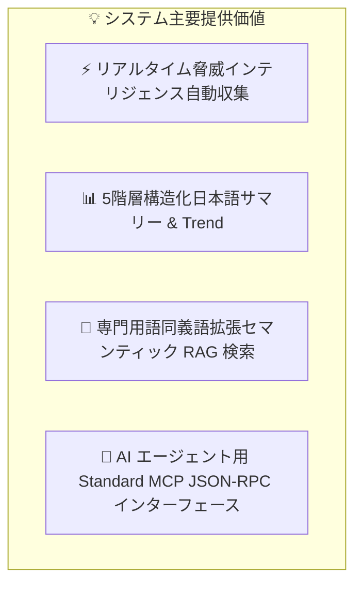

# [DSN-01] 基本設計書 (High-Level Design - HLD) — arxiv-security-papers

本ドキュメントは、「`arxiv-security-papers`」プロジェクトにおける全体システム構造、統合アーキテクチャ、4大ピラー、データガバナンス、および運用方針を体系化した基本設計書 (High-Level Design) です。

---

## 1. システム目的と主要価値 (System Purpose & Core Value)

本システムは、世界中の研究機関が arXiv に公表するセキュリティ論文（`cs.CR` 分野・14,000 件超）をリアルタイムに自動追跡し、**「知識の標準化」「高度 AI エージェント連携」「即応型インテリジェンス可視化」** を統合実現する自律型サイバーセキュリティ・インテリジェンスプラットフォームです。



---

## 2. 全体システムアーキテクチャ (Overall System Architecture)

本システムは、高い堅牢性・耐久性・拡張性を備えた 4 大サブシステム（ピラー）によって構成され、データ収集から成果物配信・AI 連動までを自動化します。


---

## 3. コア・アーキテクチャピラー (Core Architecture Pillars)

### 🏛️ ピラー 1: データ収集・OKF ナレッジ標準化基盤
- **自動化・堅牢性**: 1日4回 (00:00, 06:00, 12:00, 18:00 UTC/JST) のバックグラウンド Cron バッチ (`schedule` ツール) による自律運用。Primary (arXiv API) / Fallback (arXiv RSS) の二重通信冗長化を標準装備。
- **知識標準化**: **Google Open Knowledge Format (OKF) v0.2** 仕様に準拠した YAML フロントマター付きナレッジ構造化。

### 🧠 ピラー 2: 5 手法統合ハイブリッド検索基盤 (Multi-Engine Search)
- **5 大インデックス検索エンジンの統合フュージョン**:
  1. **ベクトル概念 TF-IDF スコア**: Title(3.5), Keywords(4.0), Tags(3.0), Desc(2.5), Content(1.0) の多重フィールド加重概念スコアリング。
  2. **Okapi BM25 確率ランクスコア**: TF 飽和 ($k_1=1.5$) および文書長正規化 ($b=0.75$) による高確信度スコアリング。
  3. **転置インデックス (Inverted Index)**: トークン/ドメインキーワードから文書 ID への高速逆引きインデックス。
  4. **FM-Index (Full-text Substring Index)**: Burrows-Wheeler 変換 (BWT) / Suffix Array による日本語任意部分文字列高速検索。
  5. **論文最新性ブースト (Recency Decay Factor)**: 経過日数に応じた時間減衰重み付け。
- **セキュリティ同義語拡張**: 「ペンテスト ⇄ penetration testing」「自動運転 ⇄ autonomous vehicle」「LLM ⇄ 脱獄 ⇄ prompt injection」「マルウェア ⇄ ransomware」等の高度専門用語辞書による再現率（Recall）の飛躍的向上。

### 🔌 ピラー 3: AI エージェント連動基盤 (Model Context Protocol)
- **標準オープン規格**: Model Context Protocol (MCP) JSON-RPC 2.0 インターフェースを完全実装。
- **エコシステム直接接続**: LLM や自律型 Security Agent が直接呼出可能な 4 大ツール（類似論文検索、OKF 構造化要約取得、トレンドレポート取得、MITRE ATT&CK 逆引き）を公開。

### 🎨 ピラー 4: 視覚化 Web ポータル ＆ コンパイラ基盤
- **Glassmorphic Web Portal**: 深みのあるダークテーマ (`#0b0f19`) と最新 Web 標準による直感型ダッシュボード。
- **Markdown Compiler Engine**: Lexer, Parser, AST, Evaluator, Renderer 5 層トランスパイルによる、表形式データおよび Mermaid トレンド図のブラウザ上動的インタラクティブ描画。
- **Google Closure Compiler**: `yuzora` 仕様に準拠した静的コード最適化・ミニファイ (`site/app-min.js`) によるロード特性の高速化。

---

## 4. 全体物理構成方針 (High-Level Physical Layout)

```
/workspace/arxiv-security-papers/
├── docs/                               # ドキュメント管理体系 (MNG-01 準拠)
│   ├── processes/                      # 管理プロセス (MNG-01-document_ledger.md)
│   ├── requirements/                   # 要件定義 spec (REQ-01-system_requirements.md)
│   ├── designs/                        # HLD/LLD 設計書 (DSN-01, DSN-02)
│   ├── mcp/                            # MCP 仕様書 (MCP-01-mcp_server_specification.md)
│   └── issues/                         # Issue 管理台帳 (README.md, closed/)
├── outputs/                            # ナレッジ・ストレージ
│   ├── raw_data/                       # 原論文データ (JSON, Abstract, PDF, Full TXT)
│   ├── okf_papers/                     # OKF v0.2 構造化マークダウン論文
│   ├── executive_summaries/            # 01_per_run 〜 05_annual 5階層サマリー
│   └── vector_db/                      # セマンティック VectorDB インデックス
├── site/                               # Web Application (Glassmorphic SPA)
│   ├── js/                             # コンパイラモジュール群 (lexer, parser, evaluator, renderer, compiler)
│   ├── app-min.js                      # Closure Compiler 最適化 JS バンドル
│   ├── externs.js                      # 外部シンボル保護定義
│   └── index.html                      # Web Portal メイン画面
├── tools/                              # ビルド・最適化ツール
│   └── closure-compiler/               # Google Closure Compiler ツールチェーン
├── src/                                # バックエンドコアエンジン (Python 3.14.7)
│   ├── arxiv_okf_fetcher.py            # データ自動収集・サマリー生成
│   ├── mcp_server.py                   # MCP JSON-RPC 2.0 サーバー
│   ├── web_server.py                   # HTTP API ＆ 静的ポータルサーバー (WSGI)
│   └── search/                         # 【Lucene/Solr 2層分離検索アーキテクチャ (DSN-08)】
│       ├── __init__.py                 # 統合ファサード & エクスポート
│       ├── vector_engine.py            # 検索オーケストレーター
│       ├── core/                       # 【Lucene層】コア検索ライブラリ (Analysis, Index, Search)
│       │   ├── analysis/               # CharFilter, Tokenizer, TokenFilter
│       │   ├── store/                  # Directory, Segment, SegmentMerger
│       │   ├── index/                  # Postings, DocValues, StoredFields, HNSW
│       │   └── search/                 # Query, QueryParser, Similarity, Collector
│       └── server/                     # 【Solr層】エンタープライズ検索サーバー
│           ├── schema/                 # ManagedIndexSchema
│           ├── handler/                # SelectHandler, SuggestHandler, UpdateHandler
│           ├── facet/                  # FacetEngine
│           ├── highlight/              # FastVectorHighlighter
│           └── cache/                  # FilterCache, QueryResultCache
```

---

## 5. ガバナンス・品質保証・SLA (Governance & Quality Assurance)

1. **パスバウンダリ検証**: すべてのファイル・データアクセスにおいて `os.path.realpath` による境界検証を強制し、機密ファイル (`.env`, `.ssh`) へのアクセスを防止。
2. **品質管理ゲート (Quality Gates)**: `make py_compile`, `make static_analysis`, `make test` により、Python / JS 構文エラー 0 件、絶対パスリンク 0 件、テスト全件 PASS を遵守。
3. **連続稼働性と冪等性**: `processed_papers.json` による重複処理防止および障害時リカバリ設計。

---

## 6. 要求事項トレーサビリティ・マトリクス (Requirements Traceability Matrix)

| 要求 ID (REQ-01) | 要求事項 (WHAT / WHY) | HLD 基本設計コンポーネント (HOW) |
| :---: | --- | --- |
| **REQ-FR-01** | セキュリティ論文の連続追跡と原本保存 | ピラー 1: `src/arxiv_okf_fetcher.py` (API/RSS Fallback, PDF Fetcher) |
| **REQ-FR-02** | 構造化ナレッジ標準化 | ピラー 1: Google OKF v0.2 Converter (`outputs/okf_papers/`) |
| **REQ-FR-03** | 5階層エグゼクティブサマリー生成 | ピラー 1: Summary Generator (`outputs/executive_summaries/01_〜05_`) |
| **REQ-FR-04** | 高精度セマンティック検索 ＆ 専門用語拡張 | ピラー 2: `src/vector_engine.py` + `src/synonym_expander.py` |
| **REQ-FR-05** | AI エージェント相互運用プロトコル | ピラー 3: `src/mcp_server.py` (MCP JSON-RPC 2.0 4大ツール) |
| **REQ-FR-06** | 直感型 Web ポータル ＆ ブックマーク可能 URL | ピラー 4: `src/web_server.py` + `site/index.html` + `app.js` (?q=, ?tag=) |
| **REQ-FR-07** | リッチドキュメント・動的図表レンダリング | ピラー 4: `site/js/` Markdown Compiler Engine + Mermaid.js |
| **REQ-NFR-01〜06** | 信頼性・セキュリティ・性能・品質保証 | 各サブシステムガード, Google Closure Compiler (`site/app-min.js`), Quality Gates |
