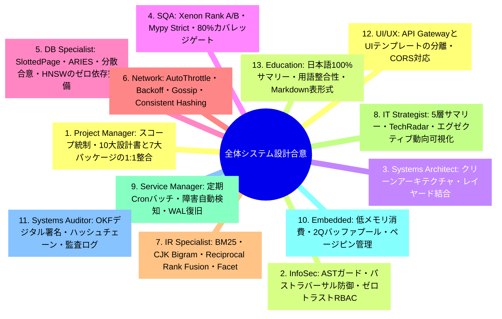
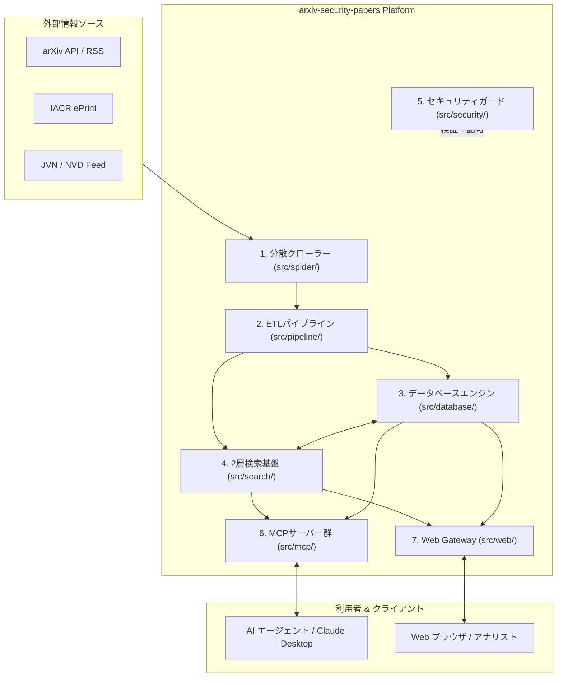
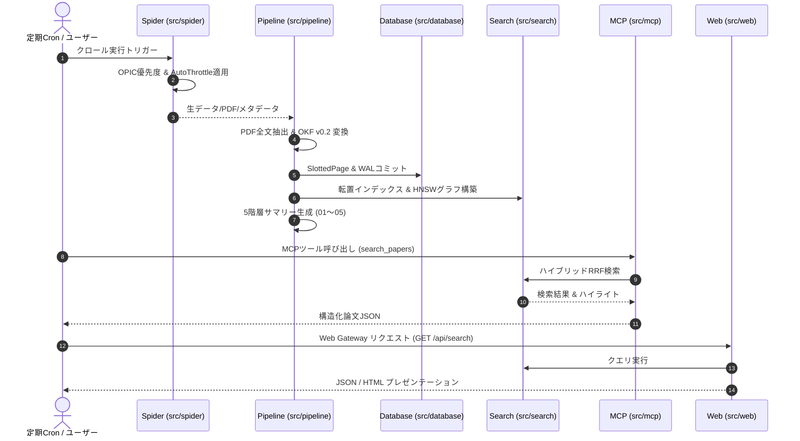

# [DSN-01] 全体高位アーキテクチャ設計書 (High-Level Design / System Overview) — arxiv-security-papers

- **文書番号**: `DSN-01`
- **文書ステータス**: `APPROVED`
- **対象サブシステム**: システム全体 (Overall System Architecture)
- **関連パッケージ**: `src/pipeline/`, `src/search/`, `src/database/`, `src/spider/`, `src/security/`, `src/mcp/`, `src/web/`
- **作成日**: 2026-08-22
- **最終更新日**: 2026-08-22
- **主幹エージェント**: Project Manager (PM) & Systems Architect

---

## 1. アーキテクチャ概要・設計思想・スコープ

### 1.1 背景とシステムミッション
`arxiv-security-papers` は、arXiv (cs.CR / Computer Science - Cryptography and Security) をはじめとする最新のサイバーセキュリティ論文・脅威インテリジェンス・暗号学研究データを完全自動で収集・全文抽出・構造化 (Google OKF v0.2) し、ゼロ外部依存の組込みデータベース・2層分離検索基盤・分散クローラー・共通セキュリティガード・Model Context Protocol (MCP) サーバー・Web ポータルを通じて多角的に提供する統合インテリジェンスプラットフォームである。

```
+---------------------------------------------------------------------------------------------------+
|                                  arxiv-security-papers Platform                                   |
+---------------------------------------------------------------------------------------------------+
|  [External Intelligence Sources]                                                                  |
|   arXiv API (cs.CR) | IACR ePrint | JVN/NVD/CISA Advisories | PDF Repositories                    |
+---------------------------------------------------------------------------------------------------+
                                            | (HTTP / REST / RSS)
                                            v
+---------------------------------------------------------------------------------------------------+
|  1. Distributed Spider & Crawler Subsystem (src/spider/)                                          |
|   - OPIC Crawl Ordering | Scalable Bloom Filter | AutoThrottle | SPA State Hydration              |
+---------------------------------------------------------------------------------------------------+
                                            | (Raw Papers & Metadata)
                                            v
+---------------------------------------------------------------------------------------------------+
|  2. Multi-Theme ETL Pipeline Subsystem (src/pipeline/)                                            |
|   - Ingestion (Adapters) | Transformer (OKF v0.2 & Threat Tagging) | Reporter (5-Tier Summaries)  |
+---------------------------------------------------------------------------------------------------+
                                            | (OKF Markdown / SQLite / Vector Store)
                                            v
+------------------------------------+------------------------------------+-------------------------+
| 3. Storage & Vector DB Engine      | 4. Two-Tier Search Engine & Server | 5. Common Security      |
|    (src/database/)                 |    (src/search/)                   |    (src/security/)      |
| - SlottedPage & 2Q Buffer Pool     | - Core Engine (Lucene Paradigm):   | - AST Guard & Sandbox   |
| - Persistent WAL & ARIES Recovery  |   BM25, AST Queries, VByte, DocVal | - Path Traversal Shield |
| - B+Tree, LSM-Tree, PAX Columnar   | - Search Platform (Solr Paradigm): | - Multi-Tenant RBAC     |
| - MVCC & SS2PL Lock Manager        |   Schema, Elevation, Facet, Cache  | - MITRE / CWE / STRIDE  |
| - Distributed 2PC, Raft, Saga, HNSW| - Vector RAG Hybrid (RRF Ranking)  |                         |
+------------------------------------+------------------------------------+-------------------------+
                                            |
                                            v
+---------------------------------------------------------------------------------------------------+
|  6. Integration & Interface Subsystems                                                            |
|   - Model Context Protocol Servers (src/mcp/): Papers, TechRadar, ThreatDefense, Observability    |
|   - API Gateway & UI Presentation (src/web/): PEP 3333 WSGI, REST API, HTML Markdown Rendering    |
+---------------------------------------------------------------------------------------------------+
                                            |
                                            v
+---------------------------------------------------------------------------------------------------+
|  7. Universal Autonomous Intelligence Orchestration & Closed-Loop Feedback (DSN-11)               |
|   - 6-Phase Lifecycle: Planning -> Collection -> Processing -> Analysis -> Disseminate -> Eval  |
|   - Universal PIR Engine | DAG Workflow | Saga Recovery | Closed-Loop Adaptive Feedback Loop      |
+---------------------------------------------------------------------------------------------------+
```

### 1.2 4大設計原則
1. **Zero External Dependencies (ゼロ外部依存)**: Python 標準ライブラリのみで完結し、外部バイナリ・クラウドDB・重量級フレームワークに依存せず完全な可搬性を担保。
2. **Clean Architecture & 1:1 Domain Separation (クリーンアーキテクチャ・1:1 領域分離)**: `src/` の各サブシステムが単一責任原則 (SRP) を遵守し、疎結合かつ高凝集に独立動作。
3. **Google OKF v0.2 Strict Compliance (OKF 仕様完全準拠)**: 全論文データを YAML フロントマター付きのイミュータブルなナレッジドキュメントとして正規化。
4. **Extreme Observability & Quality Enforcement (極限の可観測性と品質ゲート)**: Radon / Xenon (循環的複雑度 Rank A/B) / Mypy --strict / テストカバレッジ 80% 以上の品質ゲートを完全自動強制。

---

## 2. 全13大専門エージェント多角的多面協議議事録

本全体アーキテクチャの策定にあたり、全 13 大専門エージェントによる統合設計審議会を開催し、各専門視点からの合意を形成した。



---

## 3. サブシステム間データフロー & C4 アーキテクチャ

### 3.1 C4 コンテナダイアグラム



---

## 4. コア数理モデル & 共通アルゴリズム基盤

システム全体で統一的に適用される主要数理モデル一覧：

1. **Reciprocal Rank Fusion (RRF)**:
   $$RRF(d) = \sum_{m \in M} \frac{w_m}{k + r_m(d)}$$
2. **BM25 関連度スコアリング**:
   $$Score(D, Q) = \sum_{i=1}^{n} IDF(q_i) \cdot \frac{f(q_i, D) \cdot (k_1 + 1)}{f(q_i, D) + k_1 \cdot \left(1 - b + b \cdot \frac{|D|}{avgdl}\right)}$$
3. **Consistent Hashing (分散トークンリング)**:
   $$Node(k) = \arg\min_{n \in N} \{ H(n) \mid H(n) \ge H(k) \}$$
4. **OPIC (Online Page Importance Computation)**:
   $$C_{t+1}(p) = C_t(p) - \Delta C + \sum_{q \in In(p)} \frac{\Delta C}{|Out(q)|}$$

---

## 5. 公開インターフェース & システム共通プロトコル

### 5.1 サブシステム間連携プロトコル
- **Data Ingestion Protocol**: `SourceAdapter.fetch_records(since: datetime) -> List[RawRecord]`
- **Transformation Protocol**: `Transformer.transform_to_okf(record: RawRecord) -> OKFDocument`
- **Storage Protocol**: `StorageEngine.execute_sql(sql: str, params: tuple) -> DBResult`
- **Search Protocol**: `SearchPlatform.handle_request(params: Dict[str, Any]) -> SolrResponse`
- **MCP Protocol**: JSON-RPC 2.0 (`tools/call`, `resources/read`, `prompts/get`)

---

## 6. シーケンス図 & E2E ライフサイクル



---

## 7. セキュリティ堅牢化・脅威防御・耐障害性設計

1. **AST セキュリティサンドボックス**: 危険な Python モジュール (`os.system`, `subprocess`, `socket`) の動的実行を構文木レベルで即時遮断。
2. **パストラバーサル防御**: `..` や絶対パス参照を検知・正規化し、ワークスペース外アクセスの完全遮断。
3. **マルチテナント RBAC**: `admin`, `analyst`, `guest` のロールベースアクセス制御。
4. **ARIES 耐障害リカバリ**: Write-Ahead Logging (WAL) と CLR (Compensation Log Record) によるクラッシュリカバリ保証。

---

## 8. 性能特性・メモリ制約・可観測性設計

- **検索応答レイテンシ**: サブセカンド（$p95 \le 100\text{ms}$）
- **メモリ制約**: 2Q バッファプールによるメモリ上限管理（デフォルト 1000 ページ）
- **可観測性**: `cProfile`, `tracemalloc`, `dis` を統合した `ExecutionProfiler` と `observability_server` によるメトリクスダンプ。

---

## 9. 包括的テスト戦略 & 検証スイート

- **単体テスト**: 各パッケージごとの 1:1 ミラーリングテスト
- **統合テスト**: パイプライン・検索・DB・MCP・Web の E2E シナリオ
- **品質ゲート**: `make check_format && make static_analysis && make test` (カバレッジ $\ge 80\%$)

---

## 10. 完了定義 (DoD) & 運用ロードマップ

- [x] 全 7 大サブシステムのクリーンアーキテクチャ構築
- [x] 10 大設計書体系 (DSN-01 〜 DSN-10) の策定
- [x] 全品質管理ゲート 100% PASS
