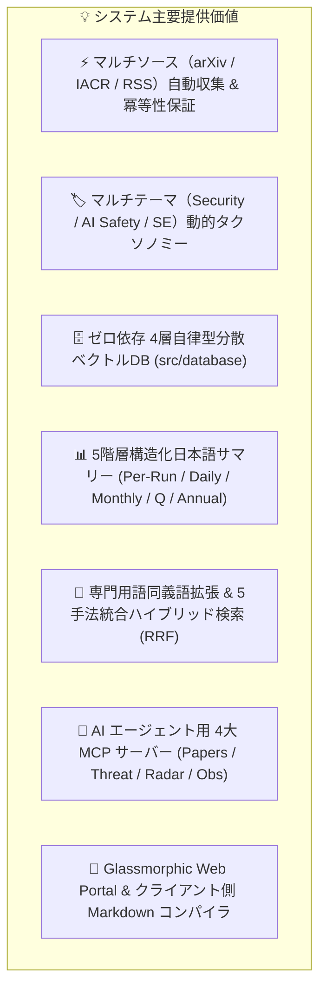
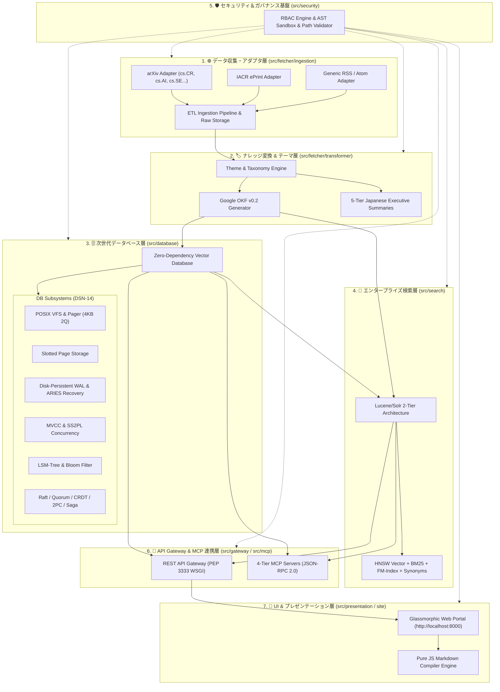

# [DSN-01] 基本設計書 (High-Level Design - HLD) — arxiv-security-papers

本ドキュメントは、「`arxiv-security-papers`」プロジェクトにおける全体システム構造、統合アーキテクチャ、7大サブシステム、マルチソース・マルチテーマ拡張、データガバナンス、および運用方針を体系化した基本設計書 (High-Level Design) です。

---

## 1. システム目的と主要価値 (System Purpose & Core Value)

本システムは、世界中の研究機関・オープンソースコミュニティが公表するセキュリティ・AI・計算機科学の学術論文や技術レポートをリアルタイムに自動追跡し、**「知識の標準化 (OKF v0.2)」「自律分散データベース (DSN-14)」「多層ハイブリッド検索 (Lucene/Solr)」「AI エージェント連携 (MCP)」「マルチテーマ動的レポーティング」** を統合実現する自律型インテリジェンスプラットフォームです。



---

## 2. 全体システムアーキテクチャ (Overall System Architecture)

本システムは、高い疎結合性・堅牢性・拡張性を備えた 7 大サブシステムによって構成され、データ収集から変換・蓄積・検索・AI 連動・可視化までをエンドツーエンドで自動化します。



---

## 3. コア・アーキテクチャサブシステム (Core Subsystems)

### 🏛️ 1. プラガブル・データ収集・アダプタ基盤 (`src/fetcher/ingestion/`)
- **Pluggable Source Adapters**: `BaseSourceAdapter` 抽象基底クラスに基づくプラグイン構造。
  - `ArxivSourceAdapter`: arXiv API（レート制限指数バックオフ）および RSS 自動フォールバックを統合し、`cs.CR`（セキュリティ）、`cs.AI`（人工知能）、`cs.LG`（機械学習）、`cs.SE`（ソフトウェア工学）など複数カテゴリを動的取得。
  - `IacrEprintSourceAdapter`: IACR ePrint から最新の暗号学プレプリントを自動収集。
  - `FeedSourceAdapter`: セキュリティベンダーや国際会議の RSS 2.0 / Atom フィードを取得。
- **原本保存 & 冪等性**: `outputs/raw_data/YYYY-MM-DD/` にメタデータ JSON、原文 Abstract、PDF、および `pdftotext` 全文抽出テキストを完全保存。`processed_papers.json` による重複排除。

### 🏷️ 2. テーマ・オントロジー＆5階層エグゼクティブサマリー (`src/fetcher/transformer/`, `src/fetcher/reporter/`)
- **動的テーマ管理 (`ThemeManager`)**:
  - `security`: MITRE ATT&CK, STRIDE, CWE タクソノミー自動タグ付け。
  - `ai_safety`: OWASP Top 10 for LLM, MITRE ATLAS 脅威モデル。
  - `software_engineering`: セキュアプログラミング・品質・静的解析タクソノミー。
- **Google OKF v0.2 標準化**: YAML フロントマター付き構造化 Markdown（タイトル、日本語要約、タグ、出典、来歴、署名検証）。
- **5階層エグゼクティブサマリー**:
  - `01_per_run`: 実行バッチ毎の差分要約
  - `02_daily`: 日次統合レポート（完全日本語マークダウン表形式）
  - `02_daily`: 日次統合レポート
  - `03_monthly`: 月次動向・技術トレンドレポート
  - `04_quarterly`: 四半期戦略サマリー
  - `05_annual`: 年次総括サマリー

### 🗄️ 3. ゼロ依存・自律分散型データベースエンジン (`src/database/` - DSN-14)
- **ストレージ・バッファ**: 4KB 固定長スロット化ページ（`SlottedPage`）、2Q / CLOCK ページ置換バッファプール。
- **トランザクション & リカバリ**: 追記型 WAL（`.vdb-wal`）、ARIES アルゴリズム。
- **分散協調 & 合意**: Raft SMR、Vector Clock、Gossip プロトコル、Strict Quorum。

### 🕷️ 4. 大規模分散スパイダー＆クローラー基盤 (`src/spider/` - DSN-15)
- **Engine/Frontier**: URL フロンティア、優先度付きキュー（Priority Queue）。
- **Politeness**: ドメイン毎の動的クロール間隔制御。
- **AutoThrottle/OPIC**: ターゲットの負荷状況に基づく動的レート制御。

### 🧠 5. エンタープライズ検索エンジン (`src/search/` - DSN-08)
- **Lucene / Solr 2層分離アーキテクチャ**: HNSW 密ベクトルインデックスと転置インデックス（BM25）の統合。
- **RRF (Reciprocal Rank Fusion)**: ベクトル類似度、全文検索、時間減衰ブーストを統合。

### 🛡️ 6. セキュリティ＆コンプライアンス基盤 (`src/security/` - DSN-11/12)
- **RBAC エンジン**: ロールベースアクセス制御。
- **AST サンドボックス**: Python AST 解析による危険コード（`eval` 等）の事前検証。

### 🔌 7. API Gateway & AI エージェント連動基盤 (`src/gateway/`, `src/mcp/`)
- **4大 MCP サーバー**: `papers_server`, `threat_defense_server`, `tech_radar_server`, `observability_server`。

### 🎨 8. 視覚化 Web ポータル (`src/presentation/`, `site/`)
- **Glassmorphic Web Portal**: ダークテーマとクライアントサイド Markdown Compiler。

---

## 4. ディレクトリ構成体系 (System Directory Layout)

```
arxiv-security-papers/
├── docs/                               # ドキュメント管理体系 (MNG-01 準拠)
│   ├── processes/                      # プロセス管理基準書
│   ├── requirements/                   # 要件定義書 (REQ-01)
│   ├── designs/                        # アーキテクチャ設計書 (DSN-01 〜 DSN-15)
│   ├── mcp/                            # MCP サーバー仕様書
│   └── issues/                         # Issue 管理台帳 (README.md, closed/)
├── outputs/                            # ナレッジ・ストレージ
├── site/                               # Web Application (Glassmorphic SPA)
├── src/                                # バックエンドコアエンジン (Python 3.14.7)
│   ├── database/                       # 【DSN-14 次世代データベースエンジン】
│   │   ├── btree/                      # B+Tree インデックス
│   │   ├── cow/                        # Copy-on-Write & mmap ゼロコピー
│   │   ├── distributed/                # 分散合意 (Raft, Quorum, 2PC, Saga, Sharding)
│   │   ├── engine/                     # Volcano イテレータ & ベクトル化実行
│   ├── fetcher/                        # 【ETL 3層論文収集・変換パイプライン】
│   │   ├── ingestion/                  # 【Ingestion層】
│   │   │   ├── adapters/               # Pluggable Source Adapters (arXiv, IACR, RSS)
│   │   │   ├── arxiv_client.py         # arXiv API & RSS フォールバック
│   │   │   └── pdf_extractor.py        # PDF ダウンロード & pdftotext 抽出
│   │   ├── transformer/                # 【Transformer層】
│   │   │   ├── theme.py                # テーマ・タクソノミー設定マネージャ
│   │   │   ├── okf_serializer.py       # Google OKF v0.2 シリアライザ
│   │   │   ├── tagger.py               # MITRE / STRIDE / CWE 自動タグ付け
│   │   │   └── translator.py           # 日本語タイトル・要約生成
│   │   ├── reporter/                   # 【Reporter層】
│   │   │   ├── summary_generator.py    # 5階層エグゼクティブサマリー生成
│   │   │   ├── diagram_generator.py    # Mermaid マインドマップ動的生成
│   │   │   └── index_updater.py        # index.md / log.md 更新
│   │   └── arxiv_okf_fetcher.py        # パイプラインオーケストレータ CLI
│   ├── gateway/                        # 【API Gateway 層】WSGI, ルーティング, CORS
│   ├── mcp/                            # 【MCP サーバー群】Papers, Threat, Radar, Obs
│   ├── presentation/                   # 【プレゼンテーション層】テンプレートエンジン
│   ├── search/                         # 【Lucene/Solr 2層分離検索エンジン】
│   ├── security/                       # 【共通セキュリティ基盤】RBAC, AST Guard, 検証
│   ├── vector_engine.py                # 検索エンジン後方互換シム
│   └── web_server.py                   # Web サーバー後方互換シム
└── tests/                              # 【1:1 完全対応テストスイート】
    ├── database/                       # DB テスト (BTree, LSM, PAX, ARIES, Raft, E2E等)
    ├── fetcher/                        # Fetcher / Adapter / Transformer テスト
    ├── gateway/                        # Gateway API テスト
    ├── mcp/                            # MCP サーバーテスト
    ├── presentation/                   # プレゼンテーション層テスト
    ├── search/                         # 検索エンジンテスト
    ├── security/                       # セキュリティ・サンドボックステスト
    └── web/                            # Web サーバーテスト
```

---

## 5. ガバナンス・品質保証・オブザーバビリティ (Governance & Observability)

1. **多角的エージェント統治 (PM-Led Governance)**: 13大専門エージェント（PM, Sec, SA, QA, DB, Net, IR, Strat, SM, Emb, Aud, UI, Edu）の合意形成に基づく設計・実装。
2. **三位一体の品質管理ゲート (Quality Gates)**:
   - `make check_format`: isort, black, flake8 準拠。
   - `make static_analysis`: radon (循環的複雑度 A/B), xenon (コード品質), mypy --strict (静的型検査), py_compile (構文検証)。
   - `make test`: pytest による全 250+ テストケースの 100% PASS。
3. **パスバウンダリ検証 & サンドボックス**: 全ファイルアクセスで `os.path.realpath` 検証を強制。動的コード実行は `ast_guard.py` でホワイトリスト監査。
4. **標準ライブラリによる可観測性 (Observability)**: `time.perf_counter`, `tracemalloc`, `cProfile` を活用した常時計測・プロファイリング基盤。

---

## 6. 要求事項トレーサビリティ・マトリクス (Requirements Traceability Matrix)

| 要求 ID (REQ-01) | 要求事項 (WHAT / WHY) | HLD 基本設計コンポーネント (HOW) |
| :---: | --- | --- |
| **REQ-FR-01** | マルチソース論文・記事の連続追跡と原本保存 | `src/fetcher/ingestion/adapters/` (arXiv, IACR, RSS) + `pdf_extractor.py` |
| **REQ-FR-02** | 構造化ナレッジ標準化 | `src/fetcher/transformer/okf_serializer.py` (Google OKF v0.2) |
| **REQ-FR-03** | 5階層エグゼクティブサマリー生成 | `src/fetcher/reporter/summary_generator.py` (`01_` 〜 `05_`) |
| **REQ-FR-04** | 高精度セマンティック検索 ＆ 専門用語拡張 | `src/search/` (Lucene/Solr 2層, RRF, 専門用語シノニム辞書) |
| **REQ-FR-05** | 自律型ベクトルデータベース | `src/database/` (4KB Slotted Page, ARIES WAL, MVCC, Raft, Consistent Hash) |
| **REQ-FR-06** | AI エージェント相互運用プロトコル | `src/mcp/` (Papers, Threat Defense, Tech Radar, Observability サーバー) |
| **REQ-FR-07** | 直感型 Web ポータル ＆ ブックマーク可能 URL | `src/gateway/` + `src/presentation/` + `site/` (Glassmorphic SPA) |
| **REQ-FR-08** | リッチドキュメント・動的図表レンダリング | `site/js/` Markdown Compiler Engine + Mermaid.js |
| **REQ-FR-09** | マルチテーマ・動的タクソノミー分類 | `src/fetcher/transformer/theme.py` (Security, AI Safety, Software Eng) |
| **REQ-FR-10** | 大規模分散Webスパイダー＆クローラー基盤 | `src/spider/` (DSN-15: Engine, Frontier, Politeness, AutoThrottle, OPIC) |
| **REQ-NFR-01〜06** | 信頼性・セキュリティ・性能・品質保証 | `src/security/` (RBAC, AST Guard), Google Closure Compiler, Strict Quality Gates |
