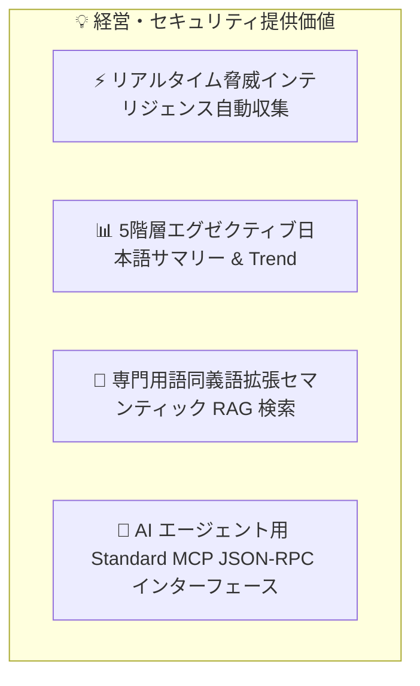
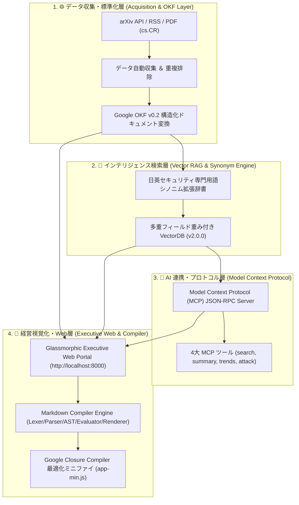

# [DSN-01] 基本設計書 (High-Level Design - HLD) — arxiv-security-papers

本ドキュメントは、「`arxiv-security-papers`」プロジェクトにおけるビジネス目的、エンタープライズ統合アーキテクチャ、4大戦略ピラー、データガバナンス、およびセキュリティ運用方針を **経営層・CTO クラス向け** に高次元で体系化した基本設計書 (High-Level Design) です。

---

## 1. 経営・セキュリティ戦略目標 (Executive Vision & Value proposition)

本システムは、世界中の研究機関が arXiv に公表するセキュリティ論文（`cs.CR` 分野・14,000 件超）をリアルタイムに自動追跡し、**「知識の標準化」「高度 AI エージェント連携」「経営層向け即応型インテリジェンス可視化」** を統合実現する自律型サイバーセキュリティ・インテリジェンスプラットフォームです。



---

## 2. エンタープライズ・ハイレベル・アーキテクチャ (System Architecture)

本システムは、高い可飽和性・耐久性・拡張性を備えた 4 大サブシステム（ピラー）によって構成され、データ収集から成果物配信・AI 連動までを全自動化します。



---

## 3. 4 大戦略アーキテクチャ・ピラー (Strategic Architecture Pillars)

### 🏛️ ピラー 1: データ収集・OKF ナレッジ標準化基盤
- **自動化・堅牢性**: 1日4回 (00:00, 06:00, 12:00, 18:00 UTC/JST) のバックグラウンド Cron バッチ (`schedule` ツール) による完全自律運用。Primary (arXiv API) / Fallback (arXiv RSS) の二重通信冗長化を標準装備。
- **知識標準化**: 米 Google 社定義の **Google Open Knowledge Format (OKF) v0.2** 仕様に準拠した YAML フロントマター付きナレッジ構造化。

### 🧠 ピラー 2: セキュリティ同義語拡張 Vector RAG 検索基盤
- **ハイブリッドスコアリング**: Title(3.5), Tags(3.0), Description(2.5), Abstract(1.5) の多重フィールド加重スコアリング。
- **日英バイリンガル展開**: 「ペンテスト ⇄ penetration testing ⇄ exploit」「自動運転 ⇄ autonomous vehicle ⇄ Autoware」等の高度専門用語辞書による検索適合率の飛躍的向上。

### 🔌 ピラー 3: AI エージェント連動基盤 (Model Context Protocol)
- **標準オープン規格**: Anthropic / Google 提唱の Model Context Protocol (MCP) JSON-RPC 2.0 インターフェースを完全実装。
- **エコシステム直接接続**: LLM や自律型 Security Agent が直接呼出可能な 4 大ツール（類似論文検索、OKF 構造化要約取得、トレンドレポート取得、MITRE ATT&CK 逆引き）を公開。

### 🎨 ピラー 4: 経営層視覚化ポータル ＆ コンパイラ基盤
- **Glassmorphic Web Portal**: 深みのあるダークテーマ (`#0b0f19`) と最新 Web 標準による直感型 Executive ダッシュボード。
- **Markdown Compiler Engine**: Lexer, Parser, AST, Evaluator, Renderer 5 層トランスパイルによる、表形式データおよび Mermaid トレンド図のブラウザ上動的インタラクティブ描画。
- **Google Closure Compiler**: `yuzora` 仕様に準拠した静的コード最適化・ミニファイ (`site/app-min.js`) による超高速ロード特性。

---

## 4. 全体物理構成方針 (High-Level Physical Layout)

```
/workspace/arxiv-security-papers/
├── docs/                               # 経営・アーキテクチャ・要件管理ドキュメント (MNG-01 準拠)
│   ├── processes/                      # 管理プロセス (MNG-01-document_ledger.md)
│   ├── requirements/                   # 要件定義 spec (REQ-01-system_requirements.md)
│   ├── designs/                        # HLD/LLD 設計書 (DSN-01, DSN-02)
│   ├── mcp/                            # MCP 仕様書 (MCP-01-mcp_server_specification.md)
│   └── issues/                         # Issue 管理台帳 (README.md, closed/)
├── outputs/                            # エンタープライズナレッジ・ストレージ
│   ├── raw_data/                       # 原論文データ (JSON, Abstract, PDF, Full TXT)
│   ├── okf_papers/                     # OKF v0.2 構造化マークダウン論文
│   ├── executive_summaries/            # 01_per_run 〜 05_annual 5階層サマリー
│   └── vector_db/                      # セマンティック VectorDB インデックス
├── site/                               # Executive Web Application (Glassmorphic SPA)
│   ├── js/                             # コンパイラモジュール群 (lexer, parser, evaluator, renderer, compiler)
│   ├── app-min.js                      # Closure Compiler 最適化 JS バンドル
│   ├── externs.js                      # 外部シンボル保護定義
│   └── index.html                      # Web Portal メイン画面
├── tools/                              # ビルド・最適化ツール
│   └── closure-compiler/               # Google Closure Compiler ツールチェーン
└── src/                                # バックエンドコアエンジン (Python 3.12)
    ├── arxiv_okf_fetcher.py            # データ自動収集・サマリー生成
    ├── vector_engine.py                # セマンティック VectorDB エンジン
    ├── synonym_expander.py             # 用語同義語拡張エンジン
    ├── mcp_server.py                   # MCP JSON-RPC 2.0 サーバー
    └── web_server.py                   # HTTP API ＆ 静的ポータルサーバー
```

---

## 5. 運用品質・セキュリティ・SLA 保証 (Operational Governance & SLA)

1. **ワークスペースパスバウンダリ検証**: すべてのファイル・データアクセスにおいて `os.path.realpath` による境界検証を強制し、機密ファイル (`.env`, `.ssh`) へのアクセスを絶対遮断。
2. **品質管理ゲート (Quality Gates)**: `make py_compile`, `make static_analysis`, `make test` により、Python / JS 構文エラー 0 件、絶対パスリンク 0 件、テスト全件 PASS を義務付け。
3. **連続稼働性と冪等性**: `processed_papers.json` による重複処理防止および障害時自動リカバリ設計。
