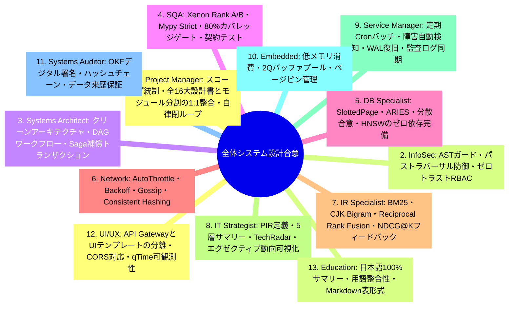
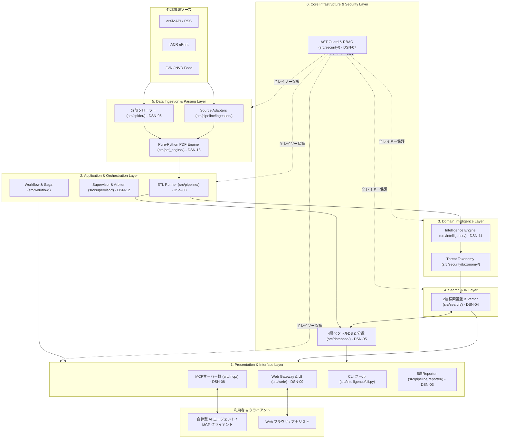
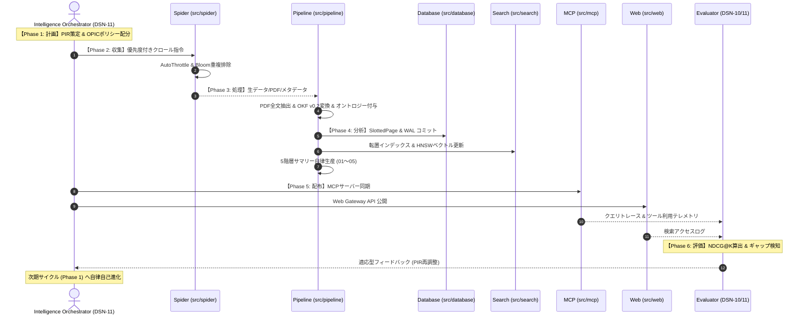

# [DSN-01] 全体高位アーキテクチャ設計書 (High-Level Design / System Overview) — arxiv-security-papers

- **文書番号**: `DSN-01`
- **文書ステータス**: `APPROVED`
- **対象サブシステム**: システム全体 (Overall System Architecture)
- **関連パッケージ**: `src/` 配下全モジュール (`spider`, `pipeline`, `database`, `search`, `security`, `mcp`, `web`, `pdf_engine`, `supervisor`, `intelligence`, `workflow`)
- **作成日**: 2026-08-22
- **最終更新日**: 2026-08-28
- **【主査・報告】 Project Manager (PM) & Systems Architect (SA)**  
- **【参画】 全13大専門エージェント (PM, Sec, SA, QA, DB, Net, IR, ST, SM, IoT, Aud, UI, Edu)**

---

## 体系目次

- [1. アーキテクチャ概要・設計思想・スコープ](#1-アーキテクチャ概要設計思想スコープ)
  - [1.1 背景とシステムミッション](#11-背景とシステムミッション)
  - [1.2 全体モジュール分割アーキテクチャ（6層レイヤード＆ドメイン境界）](#12-全体モジュール分割アーキテクチャ6層レイヤードドメイン境界)
  - [1.3 4大設計原則と Python 3.14+ 原則](#13-4大設計原則と-python-314-原則)
  - [1.4 普遍的インテリジェンス・オーケストレーション中枢 (DSN-11)](#14-普遍的インテリジェンスオーケストレーション中枢-dsn-11)
- [2. 全13大専門エージェント多角的多面協議議事録](#2-全13大専門エージェント多角的多面協議議事録)
- [3. サブシステム間データフロー & C4 アーキテクチャ](#3-サブシステム間データフロー--c4-アーキテクチャ)
  - [3.1 C4 コンテナダイアグラム](#31-c4-コンテナダイアグラム)
  - [3.2 6大レイヤー・主要サブシステムの責務マトリクス](#32-6大レイヤー主要サブシステムの責務マトリクス)
- [4. コア数理モデル & 共通アルゴリズム基盤](#4-コア数理モデル--共通アルゴリズム基盤)
- [5. 公開インターフェース & システム共通プロトコル](#5-公開インターフェース--システム共通プロトコル)
- [6. シーケンス図 & 6大フェーズ自律閉ループ E2E ライフサイクル](#6-シーケンス図--6大フェーズ自律閉ループ-e2e-ライフサイクル)
- [7. セキュリティ堅牢化・脅威防御・耐障害性設計 (Saga)](#7-セキュリティ堅牢化脅威防御耐障害性設計-saga)
- [8. 性能特性・メモリ制約・可観測性設計](#8-性能特性メモリ制約可観測性設計)
- [9. 包括的テスト戦略 & 検証スイート](#9-包括的テスト戦略--検証スイート)
- [10. 完了定義 (DoD) & 包括設計書体系 (DSN-01 〜 DSN-16)](#10-完了定義-dod--包括設計書体系-dsn-01--dsn-16)

---

# 1. アーキテクチャ概要・設計思想・スコープ

### 1.1 背景とシステムミッション
`arxiv-security-papers` は、arXiv (cs.CR / Computer Science - Cryptography and Security, cs.LG, cs.AI) をはじめとする最新のサイバーセキュリティ論文・脅威インテリジェンス・暗号学研究データを完全自動で収集・全文抽出・構造化 (Google OKF v0.2) し、ゼロ外部依存の組込みデータベース・2層分離検索基盤・分散クローラー・共通セキュリティガード・Model Context Protocol (MCP) サーバー・Web ポータルを通じて多角的に提供する次世代統合セキュリティ・ナレッジプラットフォームである。

### 1.2 全体モジュール分割アーキテクチャ（6層レイヤード＆ドメイン境界）
システム全体は、依存性の単方向流（クリーンアーキテクチャ）と関心の分離（SoC）を徹底した以下の **6層レイヤード構造** にてモジュール分割される：

```
+---------------------------------------------------------------------------------------------------+
|                        1. [Presentation & Interface Layer] (外部境界・利用インターフェース)         |
|  - src/web/ (PEP 3333 WSGI / Glassmorphism UI)   - src/mcp/ (4大 MCP サーバー / JSON-RPC 2.0)    |
|  - src/intelligence/cli.py (CLI 管理コマンド)    - src/pipeline/reporter/ (5層エグゼクティブサマリー) |
+---------------------------------------------------------------------------------------------------+
                                            | 呼出 / ディスパッチ
                                            v
+---------------------------------------------------------------------------------------------------+
|                        2. [Application & Orchestration Layer] (業務フロー制御・協調)                |
|  - src/workflow/ (DAG / Streaming DAG / Saga / サーキットブレーカー)                              |
|  - src/supervisor/ (Arbiter / マルチプロセスワーカー管理 / ヘルスチェック)                         |
|  - src/pipeline/ (ETL オーケストレーション: Ingestion -> Transformer -> Reporter)                  |
+---------------------------------------------------------------------------------------------------+
                                            | 駆動
                                            v
+---------------------------------------------------------------------------------------------------+
|                        3. [Domain Intelligence & Analysis Layer] (セキュリティ中核頭脳)            |
|  - src/intelligence/ (PIR要件管理 / 多段階LLM要約 / 脅威仮説生成 / 信頼度スコアリング)             |
|  - src/security/taxonomy/ (MITRE ATT&CK / CWE / STRIDE マッピング / Caldera プレイブック生成)     |
+---------------------------------------------------------------------------------------------------+
                                            | 知識探索 / 検索
                                            v
+---------------------------------------------------------------------------------------------------+
|                        4. [Search & Information Retrieval Layer] (検索・インデックス基盤)           |
|  - src/search/ (ハイブリッド検索: BM25 + HNSW ベクトル + RAPTOR ツリー + FM-Index / RRF 統合)      |
+---------------------------------------------------------------------------------------------------+
                                            | 永続化 / データ入出力
                                            v
+---------------------------------------------------------------------------------------------------+
|                        5. [Data Ingestion & Parsing Layer] (収集・生データ解析)                     |
|  - src/spider/ (分散 Web クローラー / AutoThrottle / SPA ハンドラー)                              |
|  - src/pdf_engine/ (内製 Pure-Python PDF 構文解析 / フォントデコード / テキスト抽出)               |
|  - src/pipeline/ingestion/adapters/ (arXiv API / RSS / IACR / アドバイザリ)                       |
+---------------------------------------------------------------------------------------------------+
                                            | 低レイヤ永続化
                                            v
+---------------------------------------------------------------------------------------------------+
|                        6. [Core Infrastructure & Security Guard Layer] (共通基盤・防御シールド)     |
|  - src/database/ (4層 Pure-Python DB: SlottedPage / BTree / LSM / PAX / Raft 分散)                 |
|  - src/security/ (AST ガード / RBAC / パストラバーサル防止 / 入力サニタイザー)                      |
+---------------------------------------------------------------------------------------------------+
```

### 1.3 4大設計原則と Python 3.14+ 原則
1. **Zero External Dependencies (ゼロ外部依存 & Python 3.14+)**: Python 3.14+ 標準ライブラリのみで完結し、外部バイナリ（Poppler/pdftotext）やクラウドDB（PostgreSQL/Elasticsearch/Redis）に依存せず完全な可搬性とセキュリティを担保。
2. **Clean Architecture & 1:1 Domain Separation (クリーンアーキテクチャ・1:1 領域分離)**: `src/` の各モジュールが単一責任原則 (SRP) を遵守し、疎結合かつ高凝集に独立動作。
3. **Google OKF v0.2 Strict Compliance (OKF 仕様完全準拠)**: 全論文データを YAML フロントマター付きのイミュータブルなナレッジドキュメントとして正規化。
4. **Extreme Observability & Closed-Loop Quality Governance (極限の可観測性と閉ループ品質統制)**: Radon / Xenon (循環的複雑度 Rank A/B) / Mypy --strict / テストカバレッジ 80% 以上の品質ゲートと、IR 評価（NDCG/MAP）に基づく自律適応。

### 1.4 普遍的インテリジェンス・オーケストレーション中枢 (DSN-11)
プラットフォーム全体は、[DSN-11-intelligence_orchestration_engine.md](DSN-11-intelligence_orchestration_engine.md) で規定される **Universal Autonomous Intelligence Orchestrator** によって統制される。意思決定者の優先情報要件（PIR）を起点とし、収集、構造化、相関分析、多層配布、そして利用評価結果を次期 PIR へ自動フィードバックする自律的閉ループ（Closed-Loop Adaptive Engine）を駆動する。

---

# 2. 全13大専門エージェント多角的多面協議議事録



---

# 3. サブシステム間データフロー & C4 アーキテクチャ

### 3.1 C4 コンテナダイアグラム



### 3.2 6大レイヤー・主要サブシステムの責務マトリクス

| レイヤー | 主要モジュール (`src/`) | 責務と提供機能 | 関連設計書 |
| :--- | :--- | :--- | :--- |
| **1. Presentation & Interface** | `web/`, `mcp/`, `pipeline/reporter/` | 人間・AI・外部システム向けインターフェース、WSGI、JSON-RPC、5層サマリー | DSN-03, DSN-08, DSN-09 |
| **2. Orchestration & Flow** | `workflow/`, `supervisor/`, `pipeline/` | DAG ワークフロー、プロセス監視、Saga 補償トランザクション | DSN-03, DSN-11, DSN-12 |
| **3. Domain Intelligence** | `intelligence/`, `security/taxonomy/` | PIR 要件管理、多段階要約、ATT&CK / TTPs マッピング、Caldera 生成 | DSN-07, DSN-11, DSN-16 |
| **4. Search & IR** | `search/` | BM25、HNSW ベクトル、RAPTOR ツリー、FM-Index、RRF 統合検索 | DSN-04 |
| **5. Ingestion & Parsing** | `spider/`, `pdf_engine/`, `pipeline/ingestion/` | 分散クローリング、Pure-Python PDF 抽出、arXiv API / RSS 収集 | DSN-03, DSN-06, DSN-13 |
| **6. Core Infrastructure & Security** | `database/`, `security/` | SlottedPage / 4層ストレージ、Raft 合意、AST ガード、RBAC、パス検証 | DSN-05, DSN-07 |

---

# 4. コア数理モデル & 共通アルゴリズム基盤

システム全体で統一的に適用される主要数理モデル一覧：

1. **動的 PIR 重みベクトル更新モデル (DSN-11)**:
   $$\mathbf{w}_{k+1} = \alpha \cdot \mathbf{w}_k + (1 - \alpha) \cdot \left( \beta \cdot \mathbf{u}_{\text{usage}} + \gamma \cdot \mathbf{g}_{\text{gap}} + \delta \cdot \mathbf{d}_{\text{drift}} \right)$$

2. **情報ギャップ（Knowledge Gap）検出数理 (DSN-11)**:
   $$G(t) = \sum_{q \in Q_t} \left( 1.0 - \text{NDCG}@K(q) \right) \cdot \ln(1 + \text{Count}(q))$$

3. **適応型 OPIC クロールリソース配分 (DSN-06 / DSN-11)**:
   $$C_0(s) = C_{\text{base}} \cdot \left( 1.0 + \sum_{t_i \in \text{DomainTopics}(s)} w_{k, i} \right)$$
   $$C_{t+1}(p) = C_t(p) - \Delta C + \sum_{q \in In(p)} \frac{\Delta C}{|Out(q)|}$$

4. **Reciprocal Rank Fusion (RRF) ハイブリッド統合 (DSN-04)**:
   $$RRF(d) = \sum_{m \in M} \frac{w_m}{k + r_m(d)} \quad (k = 60)$$

5. **BM25 関連度スコアリング (DSN-04)**:
   $$Score(D, Q) = \sum_{i=1}^{n} IDF(q_i) \cdot \frac{f(q_i, D) \cdot (k_1 + 1)}{f(q_i, D) + k_1 \cdot \left(1 - b + b \cdot \frac{|D|}{avgdl}\right)}$$

6. **Consistent Hashing 分散トークンリング (DSN-05 / DSN-06)**:
   $$Node(k) = \arg\min_{n \in N} \{ H(n) \mid H(n) \ge H(k) \}$$

---

# 5. 公開インターフェース & システム共通プロトコル

### 5.1 サブシステム間連携プロトコル
- **Intelligence Phase Protocol (DSN-11)**: `IntelligencePhaseExecutor.execute(context) -> Dict[str, Any]`
- **Data Ingestion Protocol (DSN-03)**: `SourceAdapter.fetch_records(since: datetime) -> List[RawRecord]`
- **Transformation Protocol (DSN-03)**: `Transformer.transform_to_okf(record: RawRecord) -> OKFDocument`
- **Storage Protocol (DSN-05)**: `StorageEngine.execute_sql(sql: str, params: tuple) -> DBResult`
- **Search Protocol (DSN-04)**: `SearchPlatform.handle_request(params: Dict[str, Any]) -> SolrResponse`
- **MCP Protocol (DSN-08)**: JSON-RPC 2.0 (`tools/call`, `resources/read`, `prompts/get`)

---

# 6. シーケンス図 & 6大フェーズ自律閉ループ E2E ライフサイクル



---

# 7. セキュリティ堅牢化・脅威防御・耐障害性設計 (Saga)

1. **AST セキュリティサンドボックス (DSN-07)**: 危険な Python モジュール (`os.system`, `subprocess`, `socket`) の動的実行を構文木レベルで即時遮断。
2. **パストラバーサル防御 (DSN-07)**: `..` や絶対パス参照を検知・正規化し、ワークスペース外アクセスの完全遮断。
3. **マルチテナント RBAC (DSN-07)**: `admin`, `analyst`, `guest` のロールベースアクセス制御。
4. **ARIES & Saga 耐障害リカバリ (DSN-05 / DSN-11)**:
   - Write-Ahead Logging (WAL) と CLR (Compensation Log Record) による DB クラッシュリカバリ。
   - オーケストレーション障害時の Saga 補償トランザクションによる逆順ロールバック。

---

# 8. 性能特性・メモリ制約・可観測性設計

- **検索応答レイテンシ**: サブセカンド（$p95 \le 100\text{ms}$）
- **メモリ制約**: 2Q バッファプールおよびストリーミング処理によるメモリ上限管理（RSS $\le 256\text{MB}$）
- **可観測性 (DSN-10)**: `ExecutionProfiler` による wall_time / cpu_time / tracemalloc メモリピーク計測と `outputs/log.md` への構造化ダンプ。

---

# 9. 包括的テスト戦略 & 検証スイート

- **単体テスト**: 各パッケージごとの 1:1 ミラーリングテスト (`tests/`)
- **統合テスト**: パイプライン・検索・DB・MCP・Web・Orchestrator の E2E シナリオ
- **品質ゲート**: `make check_format && make static_analysis && make test` (カバレッジ $\ge 80\%$)

---

# 10. 完了定義 (DoD) & 包括設計書体系 (DSN-01 〜 DSN-16)

全サブシステムは、以下の **18 大包括設計書体系 (DSN-01 〜 DSN-18)** に基づき整合・運用される：

| DSN 番号 | 設計書ファイル | 対応パッケージ (`src/`) | 領域 / サブシステム |
| :---: | :--- | :--- | :--- |
| **DSN-01** | [DSN-01-high_level_design.md](DSN-01-high_level_design.md) | システム全体 | 全体高位アーキテクチャ設計書 (HLD) |
| **DSN-02** | [DSN-02-low_level_design.md](DSN-02-low_level_design.md) | システム全体 | 全体低位アーキテクチャ設計書 (LLD / Common Protocols) |
| **DSN-03** | [DSN-03-pipeline_architecture.md](DSN-03-pipeline_architecture.md) | `src/pipeline/` | ETL データパイプライン設計書 (`ingestion`, `transformer`, `reporter`) |
| **DSN-04** | [DSN-04-search_engine_and_platform.md](DSN-04-search_engine_and_platform.md) | `src/search/` | 2層検索エンジン & プラットフォーム設計書 (`engine`, `platform`, `vector`) |
| **DSN-05** | [DSN-05-database_engine_architecture.md](DSN-05-database_engine_architecture.md) | `src/database/` | ゼロ依存 4層ベクトルデータベース & 分散合意設計書 |
| **DSN-06** | [DSN-06-distributed_spider_and_crawler.md](DSN-06-distributed_spider_and_crawler.md) | `src/spider/` | ゼロ外部依存 分散 Web クローラー & スパイダー基盤設計書 |
| **DSN-07** | [DSN-07-security_guard_and_rbac.md](DSN-07-security_guard_and_rbac.md) | `src/security/` | 共通セキュリティ基盤・AST ガード & RBAC エンジン設計書 |
| **DSN-08** | [DSN-08-mcp_strategic_ecosystem.md](DSN-08-mcp_strategic_ecosystem.md) | `src/mcp/` | Model Context Protocol (MCP) 戦略的エコシステム設計書 |
| **DSN-09** | [DSN-09-web_gateway_and_presentation.md](DSN-09-web_gateway_and_presentation.md) | `src/web/` | API Gateway & UI プレゼンテーション設計書 (`gateway`, `presentation`) |
| **DSN-10** | [DSN-10-observability_and_eval_framework.md](DSN-10-observability_and_eval_framework.md) | 横断的基盤 | 可観測性 (Observability) & 情報検索評価 (IR Eval) 設計書 |
| **DSN-11** | [DSN-11-universal_workflow_engine.md](DSN-11-universal_workflow_engine.md) | `src/workflow/` | 汎用ワークフロー基盤・DAG & Saga 補償トランザクション包括設計書 |
| **DSN-12** | [DSN-12-process_supervisor_and_arbiter.md](DSN-12-process_supervisor_and_arbiter.md) | `src/supervisor/` | 汎用プロセススーパーバイザー & 調停基盤包括設計書 |
| **DSN-13** | [DSN-13-pure_python_pdf_text_extractor.md](DSN-13-pure_python_pdf_text_extractor.md) | `src/pdf_engine/` | Pure-Python PDF 全文抽出エンジン包括設計書 |
| **DSN-14** | [DSN-14-graph_engineering_dashboard.md](DSN-14-graph_engineering_dashboard.md) | `src/web/presentation/` | 論文・脅威ナレッジグラフ & エンジニアリングダッシュボード設計書 |
| **DSN-15** | [DSN-15-closed_loop_intelligence_system.md](DSN-15-closed_loop_intelligence_system.md) | `src/intelligence/` | 閉ループ・自律型インテリジェンス・オーケストレーション設計書 |
| **DSN-16** | [DSN-16-nextgen_security_knowledge_platform_proposal.md](DSN-16-nextgen_security_knowledge_platform_proposal.md) | 次世代統合 | 次世代セキュリティ・ナレッジプラットフォーム包括的設計提言書 |
| **DSN-17** | [DSN-17-security_knowledge_ontology.md](DSN-17-security_knowledge_ontology.md) | `src/ontology/` | セキュリティ知識オントロジー (SKO) 規格設計書 |
| **DSN-18** | [DSN-18-property_graph_database_engine.md](DSN-18-property_graph_database_engine.md) | `src/graph/` | ゼロ侵襲型プロパティグラフデータベース基盤設計書 |
| **DSN-19** | [DSN-19-nlp_keyphrase_extraction_and_structured_synthesis.md](DSN-19-nlp_keyphrase_extraction_and_structured_synthesis.md) | `src/pipeline/transformer/` (`src/nlp/`) | 自然言語処理（NLP）重要キーワード抽出・3点構造化要約・動向シンセシス包括的アーキテクチャ設計書 |
