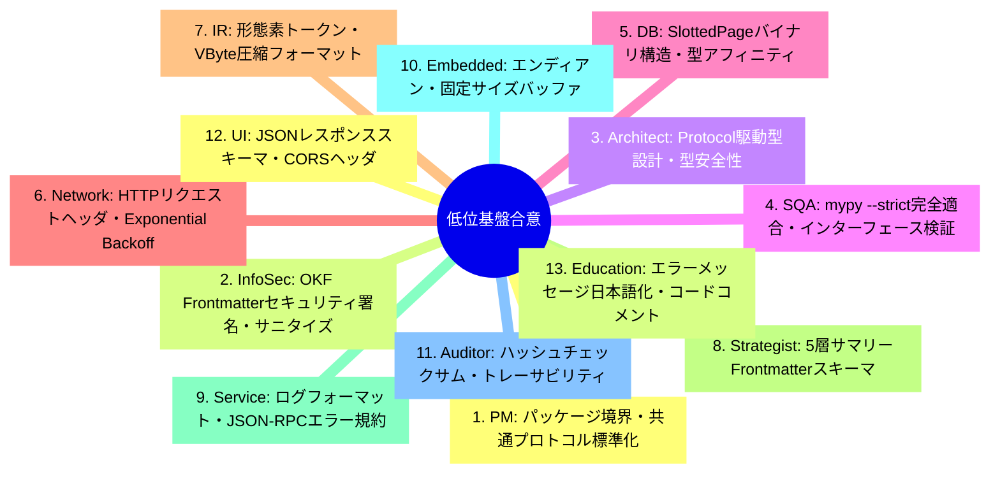
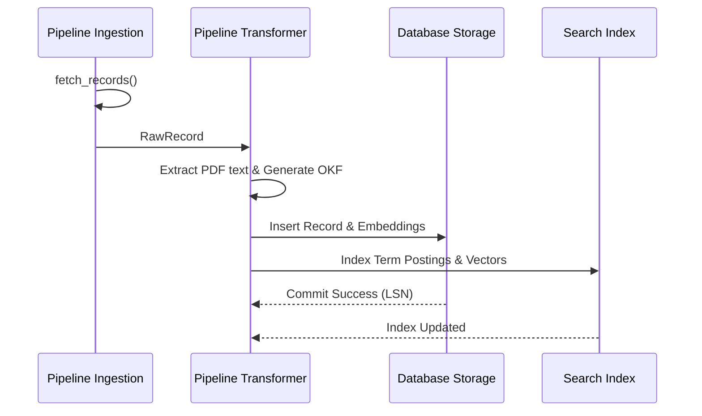

# [DSN-02] 全体低位アーキテクチャ設計書 (Low-Level Design & Common Protocols) — arxiv-security-papers

- **文書番号**: `DSN-02`
- **文書ステータス**: `APPROVED`
- **対象サブシステム**: 共通基盤・共通インターフェース・データスキーマ
- **関連パッケージ**: システム全体 (`src/`)
- **作成日**: 2026-08-22
- **最終更新日**: 2026-08-22
- **主幹エージェント**: Systems Architect & Software Quality Assurance Specialist

---

## 1. アーキテクチャ概要・設計思想・スコープ

### 1.1 低位設計の目的
本低位設計書 (LLD) は、`arxiv-security-papers` プラットフォーム全体のデータ構造、共通プロトコル、メモリレイアウト、バイナリシリアライザ、エラーハンドリング規約、および Google OKF v0.2 仕様の詳細定義を提供する。

---

## 2. 全13大専門エージェント多角的多面協議議事録



---

## 3. 共通データスキーマ & Google OKF v0.2 仕様

### 3.1 OKF v0.2 YAML フロントマタースキーマ
全論文ファイル (`outputs/okf_papers/YYYY-MM-DD/<clean_id>.md`) の共通メタデータ構造：

```yaml
---
type: "security-paper"
title: "Zero Trust Cloud Native Microservice Security"
description: "ゼロトラストアーキテクチャに基づくクラウドネイティブ環境の動的認可モデル"
resource: "https://arxiv.org/abs/2608.01234"
tags:
  - "zero-trust"
  - "cloud-security"
  - "authorization"
timestamp: "2026-08-22T00:00:00Z"
provenance:
  origin: "arxiv.org"
  raw_metadata: "../../../raw_data/2026-08-22/2608.01234_meta.json"
  published_date: "2026-08-22"
  authors:
    - "Alice Smith"
    - "Bob Jones"
trust:
  signature: "sha256-verified"
  confidence: 1.0
---
```

---

## 4. コアバイナリプロトコル & 圧縮アルゴリズム

### 4.1 Variable-Byte (VByte) 整数圧縮
可変長バイトエンコーディング：
- 最上位ビット (MSB): 後続バイトの有無フラグ（$1 = \text{終端}$, $0 = \text{継続}$）
- 下位 7 ビット: ペイロードデータ

$$\text{VByte}(x) = \begin{cases} [x \mid 0x80] & (x < 128) \\ [x \bmod 128] \circ \text{VByte}(\lfloor x / 128 \rfloor) & (x \ge 128) \end{cases}$$

---

## 5. 共通クラス設計 & Python Protocol 定義

```python
from typing import Any, Dict, List, Protocol, runtime_checkable

@runtime_checkable
class SourceAdapterProtocol(Protocol):
    def fetch_records(self, since: str) -> List[Dict[str, Any]]: ...

@runtime_checkable
class TransformerProtocol(Protocol):
    def transform(self, raw_data: Dict[str, Any]) -> Dict[str, Any]: ...

@runtime_checkable
class SearchEngineProtocol(Protocol):
    def search(self, query: str, top_k: int) -> List[Dict[str, Any]]: ...

@runtime_checkable
class StorageEngineProtocol(Protocol):
    def execute(self, sql: str, params: tuple) -> Any: ...
```

---

## 6. シーケンス図: パイプライン共通処理フロー



---

## 7. プロセス管理・排他制御プロトコル (Process Lifecycle & Concurrency)

### 7.1 Singleton Instance Lock プロトコル
Arbiter プロセスの重複起動を OS カーネルレベルで遮断するファイル排他ロック規約：
- ロックファイルパス: `outputs/supervisor/arbiter.lock`
- 排他ロック方式: POSIX `fcntl.flock(fd, fcntl.LOCK_EX | fcntl.LOCK_NB)`
- ライフサイクル管理:
  - 起動直後にロックを取得し自 PID を記録。
  - プロセス正常終了時に `fcntl.LOCK_UN` を発行しファイルをアンリンク。
  - 異常終了時は OS カーネルによる FD 自動回収でデッドロックを防止。

### 7.2 Worker 孤児化防止プロトコル (PR_SET_PDEATHSIG)
- 子プロセス生成時に Linux `prctl(PR_SET_PDEATHSIG, signal.SIGKILL)` を設定。
- 親 Arbiter 死亡時に全子プロセスを自動連動終了させ、プロセスリーク・ゾンビ化を根絶。

---

## 8. セキュリティ堅牢化 & 共通防御ルール

- **パス検証**: すべてのファイル入出力は `security.validation.is_safe_workspace_path` を通過。
- **入力サニタイズ**: 外部入力文字列に対する HTML エスケープと SQL パラメータバインディング。
- **型アサーション**: すべての関数境界で Python 3.14 型アノテーションを厳格適用。

---

## 9. 性能特性 & メモリフットプリント

- **ドキュメントシリアライズ速度**: 1 ドキュメントあたり $\le 0.5\text{ms}$
- **メモリオーバーヘッド**: 文字列インターン化と軽量データクラスによるメモリ最適化。

---

## 9. 包括的テスト戦略

- **プロトコル適合性テスト**: `isinstance(obj, Protocol)` の実行時検証。
- **バイナリラウンドトリップテスト**: VByte / JSON / SlottedPage の双方向エンコード・デコード検証。

---

## 10. 完了定義 (DoD)

- [x] 全共通 Protocol の定義と静的型検査 (mypy --strict)
- [x] OKF v0.2 仕様のバリデータ完備
