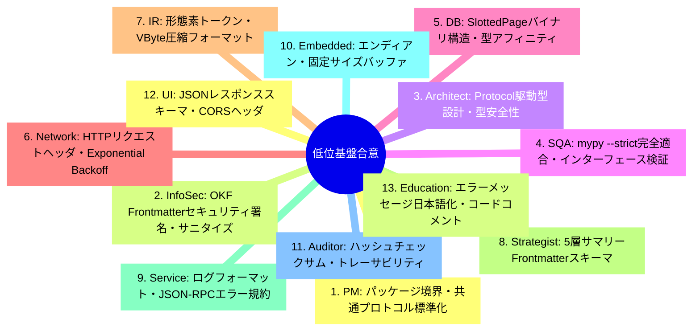
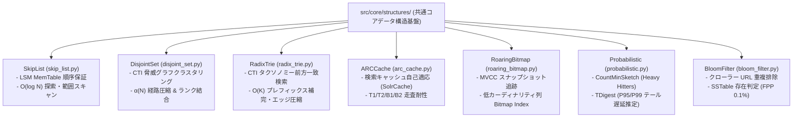
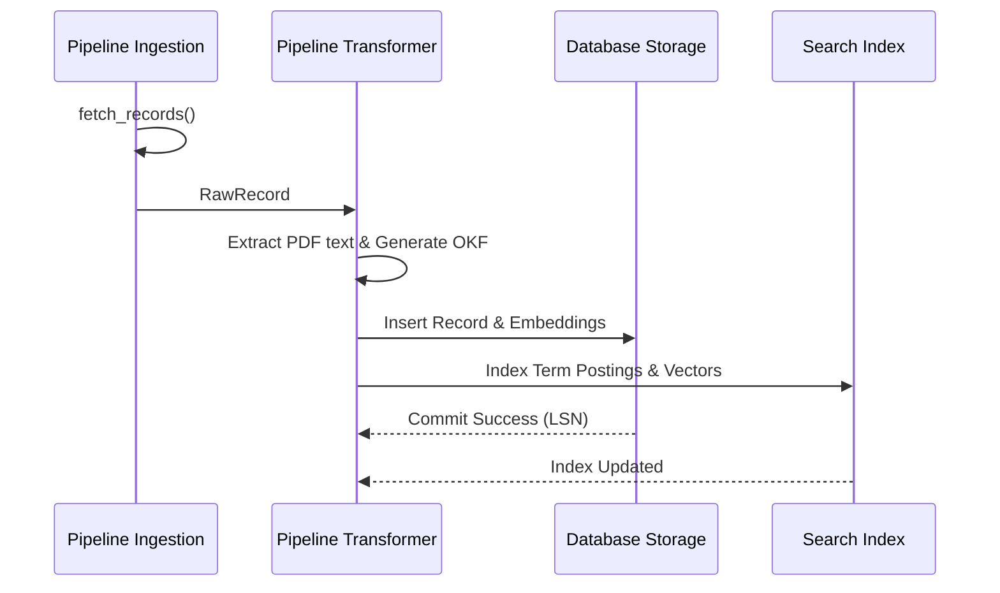

# [DSN-02] 全体低位アーキテクチャ設計書 (Low-Level Design & Common Protocols) — arxiv-security-papers

- **文書番号**: `DSN-02`
- **文書ステータス**: `APPROVED`
- **対象サブシステム**: 共通基盤・共通インターフェース・データスキーマ
- **関連パッケージ**: システム全体 (`src/`)
- **作成日**: 2026-08-22
- **最終更新日**: 2026-09-12
- **主幹エージェント**: Systems Architect & Software Quality Assurance Specialist

---

## 目次 (Table of Contents)
- [1. アーキテクチャ概要・設計思想・スコープ](#1-アーキテクチャ概要設計思想スコープ)
- [2. 全13大専門エージェント多角的多面協議議事録](#2-全13大専門エージェント多角的多面協議議事録)
- [3. 共通データスキーマ & Google OKF v0.2 仕様](#3-共通データスキーマ--google-okf-v02-仕様)
- [4. コアバイナリプロトコル & 圧縮アルゴリズム](#4-コアバイナリプロトコル--圧縮アルゴリズム)
- [5. 共通コアデータ構造・アルゴリズム基盤 (`src/core/structures/`)](#5-共通コアデータ構造アルゴリズム基盤-srccorestructures)
- [6. 共通クラス設計 & Python Protocol 定義](#6-共通クラス設計--python-protocol-定義)
- [7. シーケンス図: パイプライン共通処理フロー](#7-シーケンス図-パイプライン共通処理フロー)
- [8. プロセス管理・排他制御プロトコル (Process Lifecycle & Concurrency)](#8-プロセス管理排他制御プロトコル-process-lifecycle--concurrency)
- [9. セキュリティ堅牢化 & 共通防御ルール](#9-セキュリティ堅牢化--共通防御ルール)
- [10. 性能特性 & メモリフットプリント](#10-性能特性--メモリフットプリント)
- [11. 包括的テスト戦略](#11-包括的テスト戦略)
- [12. 完了定義 (DoD)](#12-完了定義-dod)

---

## 1. アーキテクチャ概要・設計思想・スコープ

### 1.1 低位設計の目的
本低位設計書 (LLD) は、`arxiv-security-papers` プラットフォーム全体のデータ構造、共通プロトコル、メモリレイアウト、バイナリシリアライザ、エラーハンドリング規約、および Google OKF v0.2 仕様の詳細定義を提供する。特に共通コアデータ構造基盤（`src/core/structures/`）により、外部ライブラリに一切依存することなく高信頼・高性能な計算アルゴリズムを提供する。

---

## 2. 全13大専門エージェント多角的多面協議議事録



---

## 3. 共通データスキーマ & Google OKF v0.2 仕様

### 3.1 OKF v0.2 YAML フロントマタースキーマ
全論文ファイル (`outputs/okf_papers/YYYY-MM-DD/<clean_id>.md`) の共通メタデータ構造：

```yaml
---
type: "security-paper"
title: "Zero Trust Cloud Native Microservice Security"
description: "ゼロトラストアーキテクチャに基づくクラウドネイティブ環境の動的認可モデル"
resource: "https://arxiv.org/abs/2608.01234"
tags:
  - "zero-trust"
  - "cloud-security"
  - "authorization"
timestamp: "2026-08-22T00:00:00Z"
provenance:
  origin: "arxiv.org"
  raw_metadata: "../../../raw_data/2026-08-22/2608.01234_meta.json"
  published_date: "2026-08-22"
  authors:
    - "Alice Smith"
    - "Bob Jones"
trust:
  signature: "sha256-verified"
  confidence: 1.0
---
```

---

## 4. コアバイナリプロトコル & 圧縮アルゴリズム

### 4.1 Variable-Byte (VByte) 整数圧縮
可変長バイトエンコーディング：
- 最上位ビット (MSB): 後続バイトの有無フラグ（$1 = \text{終端}$, $0 = \text{継続}$）
- 下位 7 ビット: ペイロードデータ

$$\text{VByte}(x) = \begin{cases} [x \mid 0x80] & (x < 128) \\ [x \bmod 128] \circ \text{VByte}(\lfloor x / 128 \rfloor) & (x \ge 128) \end{cases}$$

---

## 5. 共通コアデータ構造・アルゴリズム基盤 (`src/core/structures/`)

本プラットフォームでは、DBMS、検索エンジン、クローラー、グラフDB、可観測性基盤の性能と信頼性を極限まで高めるため、外部依存ゼロ（Pure Python 3.14 標準ライブラリのみ）で実装された共通コアデータ構造群（`src/core/structures/`）を一元提供する。全データ構造は **Xenon Rank A (循環的複雑度 CC $\le 4$)** および **`mypy --strict`** に完全適合している。



### 5.1 SkipList (スキップリスト: `skip_list.py`)
- **目的**: LSM ツリーの `MemTable` およびソート済みインデックス走査において、赤黒木のようなツリー回転ロック競合を排した確率的階層インデックスを提供する。
- **データ構造**:
  - `SkipListNode[K, V]`: `key`, `value`, `forward: List[Optional[SkipListNode[K, V]]]`（最大レベル 16、昇格確率 $p=0.5$）。
  - `SkipList[K, V]`: `insert(key, value)`, `search(key) -> Optional[V]`, `delete(key) -> bool`, `range_scan(start, end) -> List[Tuple[K, V]]`。
- **計算量**: 探索・挿入・削除すべて $O(\log N)$（平均）。範囲走査 $O(\log N + K)$。
- **統合先**: `src/database/lsm/memtable.py` (`MemTable` 内部ストレージ)。

### 5.2 DisjointSet (素集合データ構造 / Union-Find: `disjoint_set.py`)
- **目的**: 多数の侵害指標（IoC）、攻撃経路、関連論文から構成される CTI 知識グラフにおいて、連結成分および脅威クラスタを超高速にグルーピングする。
- **データ構造**:
  - `DisjointSet[T]`: `parent: Dict[T, T]`, `rank: Dict[T, int]`, `cluster_sizes: Dict[T, int]`。
  - 最適化アルゴリズム: **経路圧縮（Path Compression）** および **ランクによる統合（Union by Rank）**。
- **計算量**: 1 操作あたり $O(\alpha(N))$（アッカーマン逆関数、実用上 $\le 4$ の準定数時間）。
- **統合先**: `src/graph/traversal.py` (`find_connected_threat_clusters()`)。

### 5.3 RadixTrie (PATRICIA Tree / 基数木: `radix_trie.py`)
- **目的**: MITRE ATT&CK テクニック ID（`T1059.001` 等）、CWE 脆弱性識別子、および検索クエリのリアルタイム前方一致検索・オートコンプリートを省メモリで実現。
- **データ構造**:
  - `RadixNode[V]`: 共通プレフィックスを持つエッジの動的分割・マージアルゴリズムを実装。単一子ノードの連結によるメモリフットプリント圧縮。
  - `RadixTrie[V]`: `insert(key, value)`, `search(key)`, `starts_with(prefix) -> bool`, `suggest(prefix, limit=10) -> List[Tuple[str, V]]`, `longest_common_prefix(key) -> str`。
- **計算量**: キー長 $K$ に対して $O(K)$ で探索・補完可能（格納ノード数 $N$ に非依存）。
- **統合先**: `src/domain/security/taxonomy/mitre.py`, `src/domain/security/taxonomy/cwe.py`, `src/search/platform/`。

### 5.4 ARCCache (Adaptive Replacement Cache: `arc_cache.py`)
- **目的**: 検索プラットフォーム層（`SolrCache`）において、大規模な全件スキャンや一括バッチ検索による「キャッシュ汚染」を防ぎ、最新性（Recency）と頻出度（Frequency）の自己調整適応を行う。
- **データ構造**:
  - Megiddo & Modha (FAST '03) 準拠。
  - $T_1$ (最新ヒット), $T_2$ (頻出ヒット), $B_1$ (最新ゴースト履歴), $B_2$ (頻出ゴースト履歴)。
  - 目標サイズパラメータ $p \in [0, c]$ の動的学習チューニング。
  - `ARCCache[K, V]`: `get(key)`, `put(key, value)`, `delete(key)`, `clear()`, `hit_ratio`。
- **統合先**: `src/search/platform/cache/__init__.py` (`ARCCacheAdapter`, `ARCFilterCache`, `SolrCache(use_arc=True)`)。

### 5.5 RoaringBitmap (`roaring_bitmap.py`)
- **目的**: 低カーディナリティ列向け Bitmap Index、MVCC トランザクションスナップショット、および検索フィルタキャッシュをバイト単位で高圧縮保持・高速ビット積計算する。
- **データ構造**:
  - 32-bit 整数を上位 16-bit（Chunk Key）と下位 16-bit（Container Offset）に分割。
  - `ArrayContainer` (基数 $< 4096$, ソート済み配列), `BitmapContainer` (基数 $\ge 4096$, 1024 ワード/8192 バイト固定長), `RunContainer` (連続値の RLE 圧縮)。
  - `&` (AND), `|` (OR), `-` (XOR/DIFF) の高速ビット並列演算とバイナリラウンドトリップシリアライザ。
- **統合先**: `src/database/transaction/mvcc.py`, `src/database/storage/bitmap_index.py`, `src/search/platform/cache/`。

### 5.6 Probabilistic Observability: Count-Min Sketch & t-digest (`probabilistic.py`)
- **目的**: リアルタイム可観測性ストリームおよび攻撃イベント集計において、固定サイズメモリで大規模ストリームの統計値を要約。
  - **CountMinSketch**: 独立ハッシュ関数群（Murmur-style）による 2 次元カウンタテーブル。誤差 $\epsilon$、信頼度 $1-\delta$ で任意の頻度推定および Heavy Hitters（頻出攻撃元・多発クエリ）を検出。
  - **TDigest**: 動的セントロイドクラスタリングによる連続データストリームのオンライン分位数要約。P95, P99, P99.9 等のテールレイテンシを極小誤差で推定。
- **統合先**: `src/observability/`, `src/pipeline/reporter/`, `src/intelligence/`。

### 5.7 Scalable Bloom Filter (`bloom_filter.py`)
- **目的**: 分散クローラーの訪問済み URL 重複排除（数千万 URL 規模）および LSM SSTable の不要ディスク I/O 99% スキップ。
- **データ構造**:
  - 最適ハッシュ関数数 $k = \lceil (m/n) \ln 2 \rceil$、最適ビット長 $m = \lceil -n \ln p / (\ln 2)^2 \rceil$。
  - 容量上限到達時にスライスを自動拡張し目標誤検知率 $P_{\text{target}}$ を維持する `ScalableBloomFilter`。
- **統合先**: `src/spider/`, `src/database/lsm/sstable.py`。

---

## 6. 共通クラス設計 & Python Protocol 定義

```python
from typing import Any, Dict, List, Protocol, runtime_checkable

@runtime_checkable
class SourceAdapterProtocol(Protocol):
    def fetch_records(self, since: str) -> List[Dict[str, Any]]: ...

@runtime_checkable
class TransformerProtocol(Protocol):
    def transform(self, raw_data: Dict[str, Any]) -> Dict[str, Any]: ...

@runtime_checkable
class SearchEngineProtocol(Protocol):
    def search(self, query: str, top_k: int) -> List[Dict[str, Any]]: ...

@runtime_checkable
class StorageEngineProtocol(Protocol):
    def execute(self, sql: str, params: tuple) -> Any: ...
```

---

## 7. シーケンス図: パイプライン共通処理フロー



---

## 8. プロセス管理・排他制御プロトコル (Process Lifecycle & Concurrency)

### 8.1 Singleton Instance Lock プロトコル
Arbiter プロセスの重複起動を OS カーネルレベルで遮断するファイル排他ロック規約：
- ロックファイルパス: `outputs/supervisor/arbiter.lock`
- 排他ロック方式: POSIX `fcntl.flock(fd, fcntl.LOCK_EX | fcntl.LOCK_NB)`
- ライフサイクル管理:
  - 起動直後にロックを取得し自 PID を記録。
  - プロセス正常終了時に `fcntl.LOCK_UN` を発行しファイルをアンリンク。
  - 異常終了時は OS カーネルによる FD 自動回収でデッドロックを防止。

### 8.2 Worker 孤児化防止プロトコル (PR_SET_PDEATHSIG)
- 子プロセス生成時に Linux `prctl(PR_SET_PDEATHSIG, signal.SIGKILL)` を設定。
- 親 Arbiter 死亡時に全子プロセスを自動連動終了させ、プロセスリーク・ゾンビ化を根絶。

---

## 9. セキュリティ堅牢化 & 共通防御ルール

- **パス検証**: すべてのファイル入出力は `security.validation.is_safe_workspace_path` を通過。
- **入力サニタイズ**: 外部入力文字列に対する HTML エスケープと SQL パラメータバインディング。
- **型アサーション**: すべての関数境界で Python 3.14 型アノテーションを厳格適用。

---

## 10. 性能特性 & メモリフットプリント

- **ドキュメントシリアライズ速度**: 1 ドキュメントあたり $\le 0.5\text{ms}$
- **コアデータ構造計算量**:
  - SkipList: $O(\log N)$（探索・挿入・削除）
  - DisjointSet: $O(\alpha(N))$（素集合結合・代表元探索）
  - RadixTrie: $O(K)$（キー長 $K$ の前方一致補完）
  - ARCCache: $O(1)$（参照・自己調整置換）
  - RoaringBitmap: $O(1)$（ビット判定）、ビット並列集合演算
- **メモリオーバーヘッド**: 文字列インターン化と軽量データクラスによるメモリ最適化。

---

## 11. 包括的テスト戦略

- **プロトコル適合性テスト**: `isinstance(obj, Protocol)` の実行時検証。
- **バイナリラウンドトリップテスト**: VByte / JSON / SlottedPage / RoaringBitmap / BloomFilter の双方向エンコード・デコード検証。
- **コアアルゴリズム単体テスト**: `tests/core/` における全データ構造の 100% カバレッジ・ストレステスト。

---

## 12. 完了定義 (DoD)

- [x] 全共通 Protocol の定義と静的型検査 (mypy --strict)
- [x] OKF v0.2 仕様のバリデータ完備
- [x] 共通コアデータ構造基盤 (`src/core/structures/`) の完全実装と Xenon Rank A (CC $\le 4$) 達成
