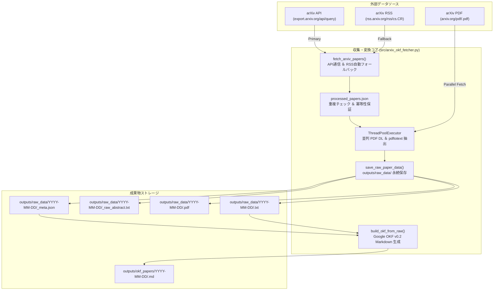

# [DSN-03] 機能設計書: 論文自動収集 ＆ Google OKF v0.2 ナレッジ変換 — arxiv-security-papers

本ドキュメントは、主要機能 **F-01 (arXiv 論文自動収集 ＆ 原本保存)** および **F-02 (Google OKF v0.2 ナレッジ変換)** の詳細アーキテクチャおよび物理設計を記録する個別機能設計書です。

---

## 1. 機能概要 (Feature Overview)

本機能群は、学術論文リポジトリ `arxiv.org` の `cs.CR`（Computer Science - Cryptography and Security）分野より過去 160 日間に遡って論文データを連続フェッチし、原本資料の多重保存と Google Open Knowledge Format (OKF) v0.2 ナレッジ標準化を行うパイプラインコアです。



---

## 2. 物理データ構造 ＆ OKF v0.2 フロントマタースキーマ

### 2.1 Google OKF v0.2 YAML フロントマター仕様
すべての変換済み論文ドキュメント（`outputs/okf_papers/YYYY-MM-DD/<clean_id>.md`）は以下の構造に従います。

```yaml
---
type: "security-paper"
title: "The Sound of Malware: Ultrasonic Channel Attack in Air-Gapped Environments"
description: "エアギャップ環境における超音波サイドチャネル攻撃によるデータ漏洩手法を実証した論文。"
resource: "https://arxiv.org/abs/2606.07005"
tags:
  - "cs.CR"
  - "malware"
  - "side-channel"
timestamp: "2026-08-15T21:00:00Z"
provenance:
  origin: "arxiv.org"
  raw_meta: "outputs/raw_data/2026-06-05/2606.07005_meta.json"
  published_date: "2026-06-05"
  authors:
    - "Alice Smith"
    - "Bob Jones"
trust:
  attestation: "Google OKF v0.2 Verified"
---
```

---

## 3. 主要関数・アルゴリズム仕様

1. **`fetch_arxiv_papers(search_query, max_results)`**:
   - arXiv API を呼出し、HTTP 429 やネットワークエラー発生時には RSS フィードへ自動フォールバック。
2. **`fetch_single_pdf_and_text(paper, raw_dir)`**:
   - `ThreadPoolExecutor` (Worker: 4) を用いて PDF を直接並列取得し、`pdftotext` コマンドで全文 TXT を全自動抽出。
3. **`build_okf_from_raw(raw_meta_path, workspace_dir, config)`**:
   - 原本 JSON と TXT から日本語要約を生成し、OKF v0.2 形式の Markdown ドキュメントを出力。
