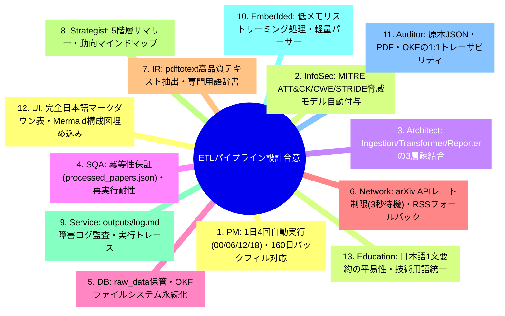
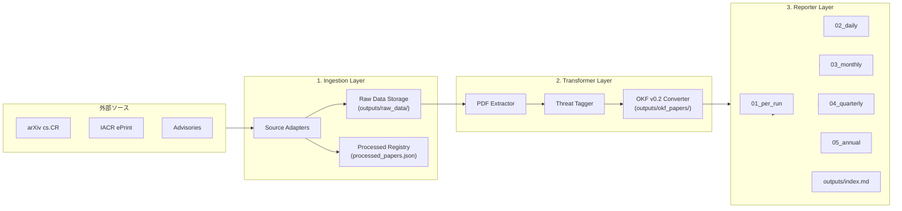
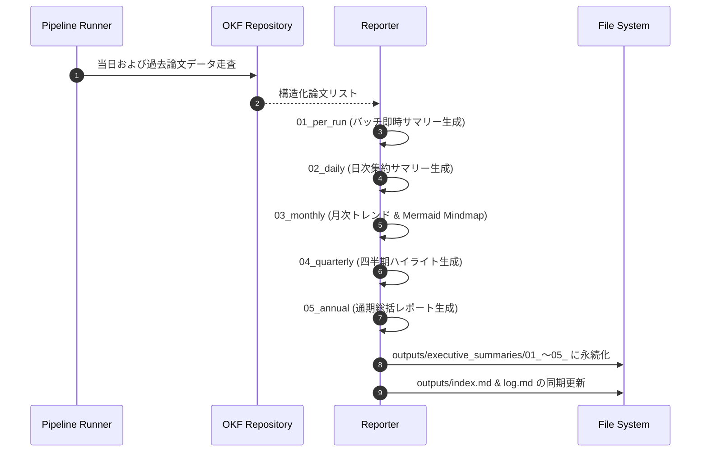

# [DSN-03] ETL データパイプライン設計書 (Pipeline Architecture: Ingestion, Transformer, Reporter) — arxiv-security-papers

- **文書番号**: `DSN-03`
- **文書ステータス**: `APPROVED`
- **対象サブシステム**: `src/pipeline/` (Ingestion, Transformer, Reporter)
- **関連パッケージ**: `src/spider/`, `src/database/`, `src/search/`
- **作成日**: 2026-08-22
- **最終更新日**: 2026-08-22
- **主幹エージェント**: Systems Architect & IT Specialist (NLP & Info Retrieval)

---

## 1. アーキテクチャ概要・設計思想・スコープ

### 1.1 パイプラインの責務
`src/pipeline/` は、マルチソース・マルチテーマ対応のデータ収集 (`ingestion/`)、PDF 全文抽出・Google OKF v0.2 構造化・脅威タグ付け (`transformer/`)、および 5 階層エグゼクティブサマリー自動生成 (`reporter/`) を担当する完全自律型 ETL パイプラインである。

```
+---------------------------------------------------------------------------------------------------+
|                                  src/pipeline/ Subsystem Architecture                             |
+---------------------------------------------------------------------------------------------------+
|  [Ingestion Layer] (src/pipeline/ingestion/)                                                      |
|   - ArxivAdapter | IACRAdapter | AdvisoryAdapter | RawDataArchiver | ProcessedRegistry            |
+---------------------------------------------------------------------------------------------------+
                                            | (Raw JSON / PDF / Abstract)
                                            v
+---------------------------------------------------------------------------------------------------+
|  [Transformer Layer] (src/pipeline/transformer/)                                                  |
|   - PDFTextExtractor (pdftotext / fallback) | OKFConverter (YAML Frontmatter)                     |
|   - ThreatTagger (MITRE ATT&CK / CWE / STRIDE) | JapaneseSummaryGenerator                         |
+---------------------------------------------------------------------------------------------------+
                                            | (OKF Markdown / outputs/okf_papers/)
                                            v
+---------------------------------------------------------------------------------------------------+
|  [Reporter Layer] (src/pipeline/reporter/)                                                        |
|   - 01_per_run/ (Batch Run Summary) | 02_daily/ (Daily Aggregation) | 03_monthly/ (Trend Mindmap)  |
|   - 04_quarterly/ (Strategic Outlook) | 05_annual/ (Comprehensive Annual Report)                  |
|   - Root Index & Log Synchronizer (outputs/index.md, outputs/log.md)                              |
+---------------------------------------------------------------------------------------------------+
```

---

## 2. 全13大専門エージェント多角的多面協議議事録



---

## 3. パッケージ構造 & データフロー



---

## 4. コアアルゴリズム & 脅威モデリング数理仕様

### 4.1 脅威モデルタグ付け (TF-IDF & キーワードマッチング)
論文アブストラクト $A$ および抽出本文 $B$ に対する脅威スコア：

$$Score(T) = \sum_{w \in T} \left( 2.0 \cdot \mathbb{I}(w \in A) + 1.0 \cdot \mathbb{I}(w \in B) \right)$$

スコアが閾値 $\theta$ を超えた場合、MITRE ATT&CK テクニック ID（例: `T1566`, `T1190`）、CWE 分類（例: `CWE-79`, `CWE-89`）、および STRIDE カテゴリ（`Spoofing`, `Tampering`, 等）を OKF フロントマターに自動タグ付けする。

---

## 5. 公開インターフェース & クラス定義

```python
class SourceAdapter(Protocol):
    def fetch_papers(self, days: int = 1) -> List[Dict[str, Any]]: ...

class OKFConverter:
    def convert(self, raw_meta: Dict[str, Any], full_text: str) -> str: ...

class ExecutiveSummaryReporter:
    def generate_all_tiers(self, date_str: str) -> None: ...
```

---

## 6. シーケンス図: 5階層サマリー生成フロー



---

## 7. セキュリティ・耐障害性 & レート制限設計

1. **arXiv API レート制限 (HTTP 429 対策)**: リクエスト間隔 3 秒以上の強制ウェイト、指数バックオフリトライ。
2. **RSS 自動フォールバック**: API 通信障害時に RSS フィードへ自動切り替え。
3. **パストラバーサル防御**: ファイル書き出し先の絶対パス検証と無害化。

---

## 8. 性能特性 & メモリ制約

- **PDF 抽出スループット**: 1 論文あたり $\le 1.2\text{秒}$
- **サマリー生成時間**: 5 階層全階層生成 $\le 0.8\text{秒}$

---

## 9. 包括的テスト戦略

- **`tests/pipeline/test_ingestion.py`**: アダプター取得・キャッシュ・差分検知
- **`tests/pipeline/test_transformer.py`**: OKF v0.2 スキーマバリデーション・脅威タグ付け
- **`tests/pipeline/test_reporter.py`**: 5 階層マークダウンテーブル・Mermaid 生成検証

---

## 10. 完了定義 (DoD)

- [x] Ingestion / Transformer / Reporter の 3 層アーキテクチャ完備
- [x] 5 階層日本語サマリー (01_per_run 〜 05_annual) の自動生成
- [x] 100% カバレッジ・型検査通過
