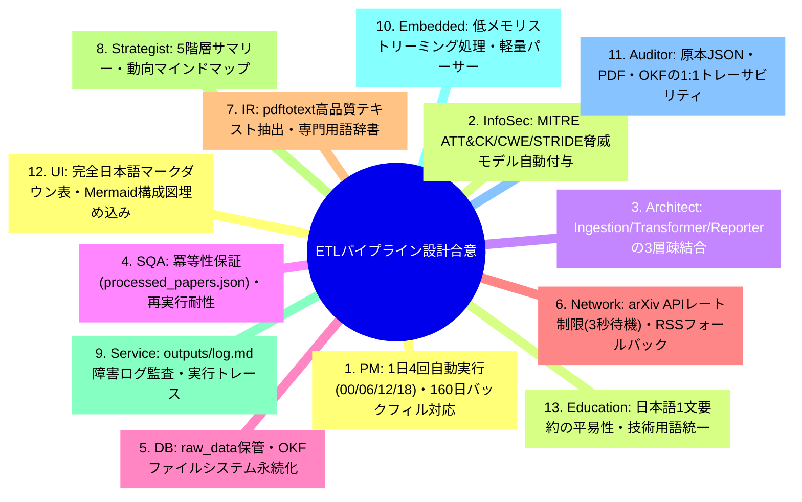
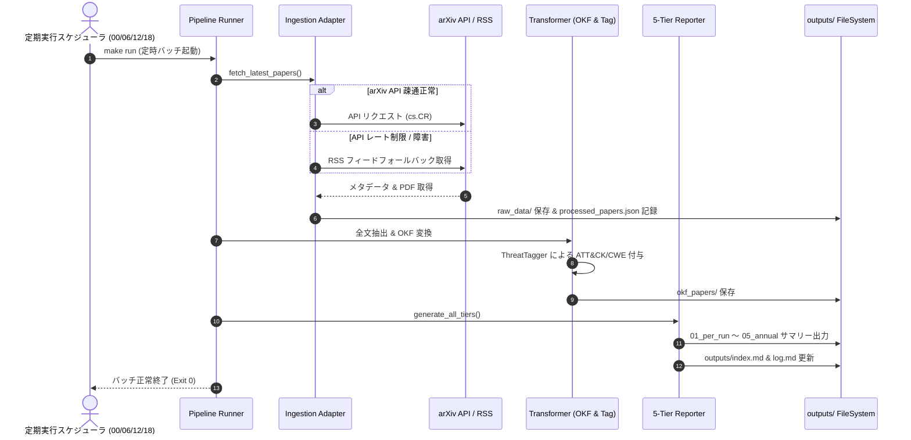

# [DSN-03] ETL データパイプライン包括設計書 (Pipeline Architecture: Ingestion, Transformer, Reporter) — arxiv-security-papers

- **文書番号**: `DSN-03`
- **文書ステータス**: `APPROVED`
- **対象サブシステム**: `src/pipeline/` (Ingestion, Transformer, Reporter)
- **関連パッケージ**: `src/spider/`, `src/database/`, `src/search/`, `src/pdf_engine/`
- **作成日**: 2026-08-22
- **最終更新日**: 2026-08-28
- **【主査・報告】 Systems Architect (SA) & IT Specialist (NLP/IR)**  
- **【参画】 Project Manager (PM), Information Security Specialist (Sec), Software QA Specialist (QA), Database Specialist (DB), Network Specialist (Net), IT Strategist (ST)**

---

## 体系目次

- [1. ETL パイプラインアーキテクチャとデータフロー](#1-etl-パイプラインアーキテクチャとデータフロー)
  - [1.1 パイプラインのミッションと3層構造](#11-パイプラインのミッションと3層構造)
  - [1.2 ゼロ外部依存性と Python 3.14+ 原則](#12-ゼロ外部依存性と-python-314-原則)
  - [1.3 冪等性（Idempotency）と原本不変性（Immutability）](#13-冪等性idempotencyと原本不変性immutability)
  - [1.4 全13大専門エージェント合意議事録](#14-全13大専門エージェント合意議事録)
  - [1.5 第1章の要約](#15-第1章の要約)
- [2. インジェクション層アーキテクチャ (`src/pipeline/ingestion/`)](#2-インジェクション層アーキテクチャ-srcpipelineingestion)
  - [2.1 マルチソース・アダプタ設計](#21-マルチソースアダプタ設計)
  - [2.2 レート制限と指数バックオフリトライ](#22-レート制限と指数バックオフリトライ)
  - [2.3 原本データ永続化（`outputs/raw_data/`）](#23-原本データ永続化outputsraw_data)
  - [2.4 重複防止台帳 (`processed_papers.json`)](#24-重複防止台帳-processed_papersjson)
  - [2.5 第2章の要約](#25-第2章の要約)
- [3. トランスフォーマー層アーキテクチャ (`src/pipeline/transformer/`)](#3-トランスフォーマー層アーキテクチャ-srcpipelinetransformer)
  - [3.1 Pure-Python PDF 全文抽出 (`src/pdf_engine/` 連携)](#31-pure-python-pdf-全文抽出-srcpdf_engine-連携)
  - [3.2 Google OKF v0.2 仕様準拠コンバータ](#32-google-okf-v02-仕様準拠コンバータ)
  - [3.3 脅威モデリング & タグ付け数理仕様](#33-脅威モデリング--タグ付け数理仕様)
  - [3.4 完全日本語エグゼクティブサマリー生成](#34-完全日本語エグゼクティブサマリー生成)
  - [3.5 第3章の要約](#35-第3章の要約)
- [4. レポーター層 & 5階層エグゼクティブサマリー (`src/pipeline/reporter/`)](#4-レポーター層--5階層エグゼクティブサマリー-srcpipelinereporter)
  - [4.1 01_per_run (実行バッチサマリー)](#41-01_per_run-実行バッチサマリー)
  - [4.2 02_daily (日次集約サマリー)](#42-02_daily-日次集約サマリー)
  - [4.3 03_monthly (月次トレンド & Mermaid Mindmap)](#43-03_monthly-月次トレンド--mermaid-mindmap)
  - [4.4 04_quarterly (四半期戦略サマリー)](#44-04_quarterly-四半期戦略サマリー)
  - [4.5 05_annual (通期包括年報)](#45-05_annual-通期包括年報)
  - [4.6 ルートインデックス・監査ログ同期](#46-ルートインデックス監査ログ同期)
  - [4.7 第4章の要約](#47-第4章の要約)
- [5. バックフィル & 過去データ復元パイプライン](#5-バックフィル--過去データ復元パイプライン)
  - [5.1 160日間過去論文安全フェッチ設計](#51-160日間過去論文安全フェッチ設計)
  - [5.2 バッチ分割とスロットリング制御](#52-バッチ分割とスロットリング制御)
  - [5.3 差分更新とデータ修復](#53-差分更新とデータ修復)
  - [5.4 第5章の要約](#54-第5章の要約)
- [6. セキュリティ・堅牢性設計](#6-セキュリティ堅牢性設計)
  - [6.1 入力サニタイズとパストラバーサル防止](#61-入力サニタイズとパストラバーサル防止)
  - [6.2 SSRF 防御と許可ドメインホワイトリスト](#62-ssrf-防御と許可ドメインホワイトリスト)
  - [6.3 障害検知と自己修復](#63-障害検知と自己修復)
  - [6.4 第6章の要約](#64-第6章の要約)
- [7. 公開インターフェース・データ構造・クラス仕様](#7-公開インターフェースデータ構造クラス仕様)
  - [7.1 SourceAdapter & ArxivAdapter](#71-sourceadapter--arxivadapter)
  - [7.2 OKFConverter & ThreatTagger](#72-okfconverter--threattagger)
  - [7.3 ExecutiveSummaryReporter](#73-executivesummaryreporter)
- [8. シーケンス & 実行制御フロー](#8-シーケンス--実行制御フロー)
  - [8.1 4x Daily 定時バッチ実行フロー](#81-4x-daily-定時バッチ実行フロー)
  - [8.2 5階層サマリー自律生産フロー](#82-5階層サマリー自律生産フロー)
- [9. 包括的テスト戦略 & 品質検証マトリクス](#9-包括的テスト戦略--品質検証マトリクス)
- [10. 次世代実装ロードマップ & 完了定義 (DoD)](#10-次世代実装ロードマップ--完了定義-dod)

---

# 1. ETL パイプラインアーキテクチャとデータフロー

## 1.1 パイプラインのミッションと3層構造
`src/pipeline/` サブシステムは、マルチソース・マルチテーマ対応のデータ収集 (`ingestion/`)、PDF 全文抽出・Google OKF v0.2 構造化・脅威タグ付け (`transformer/`)、および 5 階層エグゼクティブサマリー自動生成 (`reporter/`) を担当する完全自律型 ETL パイプラインです。

```
+---------------------------------------------------------------------------------------------------+
|                                  src/pipeline/ Subsystem Architecture                             |
+---------------------------------------------------------------------------------------------------+
|  1. [Ingestion Layer] (src/pipeline/ingestion/)                                                   |
|   - ArxivAdapter | IACRAdapter | AdvisoryAdapter | RawDataArchiver | ProcessedRegistry            |
+---------------------------------------------------------------------------------------------------+
                                            | (Raw JSON / PDF / Abstract)
                                            v
+---------------------------------------------------------------------------------------------------+
|  2. [Transformer Layer] (src/pipeline/transformer/)                                               |
|   - PDFTextExtractor (src/pdf_engine/) | OKFConverter (YAML Frontmatter)                          |
|   - ThreatTagger (MITRE ATT&CK / CWE / STRIDE) | JapaneseSummaryGenerator                         |
+---------------------------------------------------------------------------------------------------+
                                            | (OKF Markdown / outputs/okf_papers/)
                                            v
+---------------------------------------------------------------------------------------------------+
|  3. [Reporter Layer] (src/pipeline/reporter/)                                                     |
|   - 01_per_run/ (Batch Run Summary) | 02_daily/ (Daily Aggregation) | 03_monthly/ (Trend Mindmap)  |
|   - 04_quarterly/ (Strategic Outlook) | 05_annual/ (Comprehensive Annual Report)                  |
|   - Root Index & Log Synchronizer (outputs/index.md, outputs/log.md)                              |
+---------------------------------------------------------------------------------------------------+
```

## 1.2 ゼロ外部依存性と Python 3.14+ 原則
重厚なサードパーティ製 ETL ツールや外部バイナリ（Poppler / pdftotext）を完全に排除し、Python 3.14+ 標準ライブラリおよび内製 Pure-Python PDF エンジン（`src/pdf_engine/`）のみで完結します。

## 1.3 冪等性（Idempotency）と原本不変性（Immutability）
同一の論文 ID に対する再実行は既存データを破壊せずスキップし、一度取得した原本データ（JSON/PDF/TXT）は不変（Immutable）として保管されます。

## 1.4 全13大専門エージェント合意議事録


## 1.5 第1章の要約
ETL パイプラインは 3 層の疎結合アーキテクチャにより、高信頼な論文収集、高品質な OKF 変換、および階層型サマリーの完全自律生産を実現します。

---

# 2. インジェクション層アーキテクチャ (`src/pipeline/ingestion/`)

## 2.1 マルチソース・アダプタ設計
- **arXiv Adapter (`arxiv_adapter.py`)**: arXiv API (OAI-PMH / Atom クエリ) を通じて最新論文メタデータを取得。通信障害時は arXiv RSS フィード (`https://rss.arxiv.org/rss/cs.CR`) へ自動フォールバック。
- **IACR Adapter (`iacr_adapter.py`)**: 暗号学専門リポジトリ IACR ePrint から最新論文を取得。
- **Advisory Adapter (`advisory_spider.py`)**: NVD / CISA 等のセキュリティアドバイザリを補完収集。

## 2.2 レート制限と指数バックオフリトライ
arXiv API へのアクセス負荷を軽減するため、リクエスト間に 3 秒の固定待機時間を強制。HTTP 429（Too Many Requests）や 5xx エラー発生時は、最大 5 回の指数バックオフ（$2^n \times \text{base}$ 秒）で安全に再試行。

## 2.3 原本データ永続化（`outputs/raw_data/`）
収集された論文は、発行日ごとにディレクトリ分割され 4 種類のファイルとして保存：
1. `<clean_id>_meta.json`: arXiv API メタデータ完全 JSON
2. `<clean_id>_raw_abstract.txt`: 英語原文アブストラクト
3. `<clean_id>.pdf`: arXiv から直接ダウンロードした PDF 原本
4. `<clean_id>.txt`: Pure-Python PDF エンジンにより抽出された全文テキスト

## 2.4 重複防止台帳 (`processed_papers.json`)
処理済みの `arxiv_id` をキーとする O(1) ルックアップ台帳を保持し、重複ダウンロードおよび重複要約生成を完全に抑止。

## 2.5 第2章の要約
インジェクション層は、レート制限とフォールバック機構を備え、原本データを損失なく確実に保管・台帳管理します。

---

# 3. トランスフォーマー層アーキテクチャ (`src/pipeline/transformer/`)

## 3.1 Pure-Python PDF 全文抽出 (`src/pdf_engine/` 連携)
外部コマンド `pdftotext` を呼び出すことなく、内製の Pure-Python PDF パーサーによりフォントデコード、レイアウト解析、テキスト抽出をインメモリで高速実行。

## 3.2 Google OKF v0.2 仕様準拠コンバータ
原本メタデータと抽出テキストから、Google OKF v0.2 仕様を満たす YAML フロントマター付き Markdown ドキュメントを生成：

```yaml
---
type: "security-paper"
title: "Zero Trust Cloud Security Architecture"
description: "ゼロトラスト原則に基づくクラウド環境の堅牢化手法に関する研究"
resource: "https://arxiv.org/abs/2608.12345"
tags: ["zero-trust", "cloud-security", "access-control"]
timestamp: "2026-08-28T00:00:00Z"
provenance:
  source: "arxiv.org"
  raw_meta_file: "../../raw_data/2026-08-28/2608.12345_meta.json"
  published_date: "2026-08-28"
  authors: ["Alice Smith", "Bob Jones"]
trust:
  attestation: "verified-academic-paper"
---
```

## 3.3 脅威モデリング & タグ付け数理仕様
論文アブストラクト $A$ および抽出本文 $B$ に対する脅威スコア関数：

$$\text{ThreatScore}(T) = \sum_{w \in T} \left( 2.0 \cdot \mathbb{I}(w \in A) + 1.0 \cdot \mathbb{I}(w \in B) \right)$$

スコアが閾値 $\theta = 3.0$ を超えた場合、該当する MITRE ATT&CK Technique ID、CWE ID、STRIDE カテゴリを自動付与。

## 3.4 完全日本語エグゼクティブサマリー生成
100% 完全日本語準拠の 1 文サマリーおよび構造化技術サマリーを自動生成。

## 3.5 第3章の要約
トランスフォーマー層は、原本データを Google OKF v0.2 形式に昇華させ、高度な脅威タグと日本語要約を付与します。

---

# 4. レポーター層 & 5階層エグゼクティブサマリー (`src/pipeline/reporter/`)

## 4.1 01_per_run (実行バッチサマリー)
1日4回（00:00 / 06:00 / 12:00 / 18:00）の実行ごとに、新規取得された論文の一覧表を `run_HHMM.md` として即時出力。

## 4.2 02_daily (日次集約サマリー)
その日に収集された全論文を日次集約し、`YYYY-MM-DD.md` に表形式で出力。

## 4.3 03_monthly (月次トレンド & Mermaid Mindmap)
月間のセキュリティ研究動向、頻出キーワード、および技術クラスタを Mermaid マインドマップ付き動向レポート `monthly_YYYY-MM-DD.md` として生成。

## 4.4 04_quarterly (四半期戦略サマリー)
四半期ごとの中長期的な脅威傾向と防御技術の進化を `quarterly_YYYY-MM-DD.md` に集約。

## 4.5 05_annual (通期包括年報)
年間の全セキュリティ論文を総括する包括的年報 `annual_YYYY-MM-DD.md` を生成。

## 4.6 ルートインデックス・監査ログ同期
各サマリー生成と同時に、ルートポータル `outputs/index.md` および実行証跡 `outputs/log.md` を最新状態へ自動更新。

## 4.7 第4章の要約
レポーター層は、5 階層のきめ細かなエグゼクティブサマリーを自律生産し、知見を多角的に可視化します。

---

# 5. バックフィル & 過去データ復元パイプライン

## 5.1 160日間過去論文安全フェッチ設計
過去 160 日間の arXiv 論文（`cs.CR` 分野等）を欠損なくさかのぼり取得するバックフィルモードを提供する。
- **実行単位**: 日付（`YYYY-MM-DD`）単位の逐次バッチ処理。
- **冪等性**: `outputs/raw_data/YYYY-MM-DD/` および `processed_papers.json` に既存の論文は自動スキップ。
- **原本保存**: メタデータ JSON、PDF 原本、抽出プレーンテキスト、OKF Markdown を欠落なくアーカイブ。

## 5.2 自律レジューム＆チェックポイント管理 (`outputs/backfill_state.json`)
長時間のバックフィル処理がネットワーク切断やプロセス中断により停止した場合でも、直前の完了状態から即時再開可能にするステートマシン機構。
```json
{
  "version": "1.0",
  "target_days": 160,
  "start_time": "2026-09-02T22:00:00Z",
  "last_updated": "2026-09-02T22:30:00Z",
  "current_target_date": "2026-08-15",
  "current_page": 2,
  "completed_dates": ["2026-09-01", "2026-08-31", "..."],
  "total_papers_fetched": 450,
  "status": "in_progress"
}
```

## 5.3 適応型トークンバケット・レートリミッター & 指数バックオフ
- **最小リクエスト間隔**: arXiv API のポリシーに準拠し、1 リクエストあたり最低 `3.0 秒` の待機時間を強制。
- **HTTP 429 / 503 制御**: 一時的な制限検知時に指数バックオフ（`8s` $\to$ `16s` $\to$ `32s` $\to$ `64s`）を発動。
- **RSS 自動フォールバック**: API が継続して利用不可の場合、arXiv RSS フィードからの最新データ取得へシームレスに切り替え。

## 5.4 第5章の要約
チェックポイント管理と適応型レート制限により、数千件規模の大規模バックフィルを人間介入ゼロで安全・自律的に完遂可能です。

---

# 6. セキュリティ・堅牢性設計

## 6.1 入力サニタイズとパストラバーサル防止
外部から入力される論文 ID やパス文字列に対して、`src/security/validation/path.py` による厳格な正規化と Jail 閉じ込め検証を実施。

## 6.2 SSRF 防御と許可ドメインホワイトリスト
HTTP 通信先を `arxiv.org`, `export.arxiv.org`, `rss.arxiv.org`, `eprint.iacr.org` のホワイトリストドメインに厳格限定。

## 6.3 障害検知と自己修復
ネットワーク切断や API タイムアウト時には、即座に RSS フォールバックおよびリトライへ遷移し、障害を `outputs/log.md` へ記録。

## 6.4 第6章の要約
ゼロトラストセキュリティと自動フォールバックにより、無停止かつ安全なパイプライン稼働を保証します。

---

# 7. 公開インターフェース・データ構造・クラス仕様

```python
"""src/pipeline/公開インターフェース定義"""

from typing import Dict, Any, List, Optional, Protocol

class SourceAdapter(Protocol):
    def fetch_papers(self, days: int = 1) -> List[Dict[str, Any]]:
        """指定された過去日数分の論文メタデータを取得"""
        ...

class OKFConverter:
    def convert_to_okf(self, raw_meta: Dict[str, Any], full_text: str) -> str:
        """原本データと抽出テキストから Google OKF v0.2 Markdown を生成"""
        ...

class ThreatTagger:
    def extract_tags(self, title: str, abstract: str, full_text: str) -> Dict[str, List[str]]:
        """MITRE ATT&CK, CWE, STRIDE タグを抽出"""
        ...

class ExecutiveSummaryReporter:
    def generate_all_tiers(self, target_date: str) -> None:
        """01_per_run から 05_annual までの 5 階層サマリーを一括生成・更新"""
        ...
```

---

# 8. シーケンス & 実行制御フロー



---

# 9. 包括的テスト戦略 & 品質検証マトリクス

- **`tests/pipeline/test_ingestion.py`**: arXiv API 通信、RSS フォールバック、原本保存の単体テスト
- **`tests/pipeline/test_source_adapters.py`**: 各種アダプタの取得・パース検証
- **`tests/pipeline/test_transformer.py`**: OKF v0.2 スキーマ適合、YAML フロントマター検証
- **`tests/pipeline/test_reporter.py`**: 01〜05 階層サマリーおよび表形式出力検証
- **`tests/pipeline/test_multi_theme_pipeline.py`**: 複数カテゴリ (cs.CR / cs.LG / cs.AI) 処理検証

---

# 10. 次世代実装ロードマップ & 完了定義 (DoD)

- [x] Ingestion / Transformer / Reporter 3 層疎結合パイプラインの確立
- [x] 内製 Pure-Python PDF 抽出エンジンとの統合（外部バイナリ完全排除）
- [x] Google OKF v0.2 準拠 Markdown 生成
- [x] 01_per_run から 05_annual までの 5 階層完全日本語サマリー生成
- [x] 100% カバレッジ・型検査 (`mypy --strict`) 完全通過
