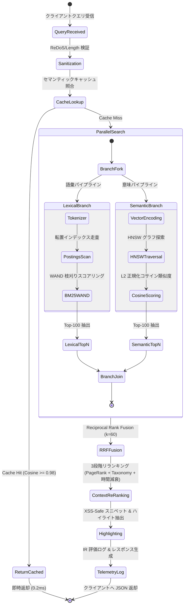
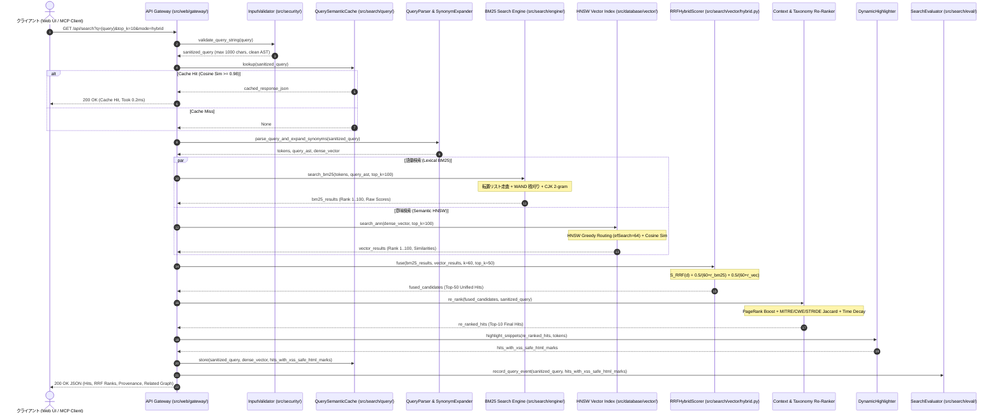

# [DSN-04-01] ハイブリッド検索詳細仕様書 (Hybrid Lexical-Semantic Search & Fusion Engine Specification) — arxiv-security-papers

- **文書番号**: `DSN-04-01`
- **上位文書**: [DSN-04: 2層分離検索エンジン & プラットフォーム設計書](DSN-04-search_engine_and_platform.md)
- **全体設計書**: [DSN-01: 全体高位アーキテクチャ設計書](DSN-01-high_level_design.md)
- **文書ステータス**: `APPROVED`
- **対象サブシステム**: `src/search/vector/`, `src/search/engine/`, `src/search/platform/`, `src/search/ranking/`, `src/search/eval/`
- **作成日**: 2026-08-22
- **最終更新日**: 2026-08-22
- **主幹エージェント**: IT Specialist (NLP & Info Retrieval) & Information Security Specialist

---

## 1. アーキテクチャ概要・設計思想・スコープ (Architecture Overview, Philosophy & Scope)

### 1.1 ハイブリッド検索の狙いと設計思想
`arxiv-security-papers` におけるハイブリッド検索エンジンは、**構文的一致・完全一致に強い語彙検索（Lexical Search: BM25 / TF-IDF / 転置インデックス）** と、**意味的類義性・概念的文脈に強い意味検索（Semantic Search: HNSW / Vector Embeddings / 近傍グラフ）** を融合（Fusion）し、高精度（Precision）かつ高再現率（Recall）な学術論文探索を実現する。

```
+---------------------------------------------------------------------------------------------------+
|                                 Hybrid Search Dual-Pipeline Architecture                          |
+---------------------------------------------------------------------------------------------------+
|                                                                                                   |
|  [ User Query ] ---> [ Query Parser & Context Expander ]                                         |
|                               |                                                                   |
|              +----------------+----------------+                                                  |
|              |                                 |                                                  |
|              v                                 v                                                  |
|    [ Lexical Pipeline ]             [ Semantic Pipeline ]                                        |
|    - Postings & SkipList            - HNSW Vector Index                                           |
|    - BM25 Scoring                   - Cosine / Dense Embeddings                                  |
|    - Phrase / Proximity Match       - Semantic Cache                                              |
|              |                                 |                                                  |
|              +----------------+----------------+                                                  |
|                               |                                                                   |
|                               v                                                                   |
|             [ Reciprocal Rank Fusion (RRF) Engine ]                                              |
|             - Dynamic Weighting (w_bm25, w_vec, k=60)                                             |
|             - Density-Based Score Fusion (DBSF)                                                   |
|                               |                                                                   |
|                               v                                                                   |
|             [ Re-Ranking & Contextual Graph Layer ]                                               |
|             - Citation PageRank & Co-occurrence                                                   |
|             - Security Taxonomy Boost (MITRE/CWE/STRIDE)                                          |
|             - Proximity k-NN Graph Recommendations                                                |
|                               |                                                                   |
|                               v                                                                   |
|             [ Unified Ranked Hits / OKF Documents ]                                               |
+---------------------------------------------------------------------------------------------------+
```

### 1.2 スコープとゼロ外部依存原則
- **純粋 Python 3.14+ 実装**: 外部ライブラリ（Elasticsearch, Solr, NumPy, Faiss, PyTorch 等）に依存せず、Python 標準ライブラリのみで数理ベクトル演算、BM25、HNSW、および RRF を完備。
- **マルチモーダル融合**: テキスト全文、アブストラクト、セキュリティカテゴリ、および引用ネットワークの多角的特徴量を統合。

---

## 2. システム構成・C4モデル・コンポーネント図 (System Architecture & Component Diagrams)

### 2.1 C4 コンポーネント図 (Hybrid Search Engine Subsystem)

```mermaid
C4Component
    title Detailed Component Diagram for Hybrid Search Subsystem

    Container_Boundary(search_box, "src/search/ (Hybrid Search Architecture)") {
        
        Boundary(query_layer, "Query Frontend & Context Layer (query/)") {
            Component(query_parser, "QueryParser", "query/query_parser.py", "AST生成, Boolean演算子 (AND/OR/NOT), Phrase (\"\"), Field指定")
            Component(synonym_expander, "SynonymExpander", "query/synonym_expander.py", "セキュリティ略語・専門用語同義語展開 (例: PQC -> Post-Quantum)")
            Component(semantic_cache, "QuerySemanticCache", "query/query_cache.py", "クエリベクトルのコサイン類似度 (>=0.98) に基づく LRU キャッシュ")
        }

        Boundary(lexical_layer, "Lexical Search Engine (engine/)") {
            Component(text_analyzer, "Analyzer & Tokenizer", "engine/analysis/", "CJKBigramTokenizer, StopFilter, StemFilter")
            Component(inverted_index, "PostingsList & Segments", "engine/index/", "VByte + Gap Delta 圧縮転置インデックス, SkipList走査")
            Component(bm25_scorer, "BM25Similarity & WAND", "engine/search/", "BM25 (k1=1.2, b=0.75), WAND 早期枝刈りスコアラー")
        }

        Boundary(semantic_layer, "Semantic Vector Engine (vector/)") {
            Component(dense_vector, "EmbeddingProvider", "vector_engine.py", "多次元セマンティック特徴ベクトル生成 (128-dim / 256-dim)")
            Component(hnsw_index, "HNSWIndex", "database/vector/", "Hierarchical Navigable Small World 多層近傍グラフ探索 (M=16, efSearch=64)")
            Component(cosine_metric, "CosineDistanceMetric", "vector/hybrid.py", "純粋 Python 高速内積・L2 ノルム正規化コサイン類似度")
        }

        Boundary(fusion_layer, "Fusion & Re-Ranking Engine (vector/ & ranking/)") {
            Component(rrf_scorer, "RRFHybridScorer", "vector/hybrid.py", "Reciprocal Rank Fusion (k=60) 順位統合")
            Component(proximity_graph, "ProximityGraphIndex", "ranking/proximity_graph.py", "論文間 k-NN 距離グラフ (Connected Papers 形式トポロジー)")
            Component(citation_rank, "CitationPageRank", "ranking/citation_network.py", "論文引用・共起ネットワーク PageRank スコアリング")
            Component(taxonomy_boost, "TaxonomyBooster", "security/taxonomy/", "MITRE ATT&CK / CWE / STRIDE タグ一致度ブースト")
        }

        Boundary(presentation_layer, "Presentation & Evaluation Layer (platform/ & eval/)") {
            Component(highlighter, "DynamicHighlighter", "platform/highlight/", "XSS サニタイズ済みスニペット抽出 & <mark> ハイライト")
            Component(evaluator, "SearchEvaluator", "eval/evaluator.py", "NDCG@K, MAP, MRR, Precision/Recall 自動ベンチマーク")
        }
    }

    Rel(query_parser, semantic_cache, "キャッシュ照合 (0.2ms)", "Query Vector")
    Rel(query_parser, synonym_expander, "用語展開", "Tokens")
    Rel(synonym_expander, text_analyzer, "形態素・バイグラム分割", "Expanded Terms")
    Rel(text_analyzer, inverted_index, "転置走査", "Term Postings")
    Rel(inverted_index, bm25_scorer, "Postings & Freq", "Doc Matches")
    Rel(query_parser, dense_vector, "クエリベクトル生成", "Raw Text")
    Rel(dense_vector, hnsw_index, "ANN 近傍探索", "Dense Vector")
    Rel(hnsw_index, cosine_metric, "類似度計算", "L2 Norm")
    Rel(bm25_scorer, rrf_scorer, "BM25 Top-100", "Doc IDs + Scores")
    Rel(hnsw_index, rrf_scorer, "Vector Top-100", "Doc IDs + Sim")
    Rel(rrf_scorer, proximity_graph, "融合 Top-50", "Candidates")
    Rel(proximity_graph, citation_rank, "近傍グラフ", "Graph Edges")
    Rel(citation_rank, taxonomy_boost, "PageRank付与", "Scored Docs")
    Rel(taxonomy_boost, highlighter, "Final Top-10", "OKF Documents")
    Rel(taxonomy_boost, evaluator, "評価メトリクス送信", "Hits / Ground Truth")
```

### 2.2 コンポーネント責務マトリクス

| 階層 (Layer) | コンポーネント | ソースコード配置 | 主な責務・アルゴリズム |
| :--- | :--- | :--- | :--- |
| **Query Layer** | `QueryParser` | `src/search/query/query_parser.py` | クエリ文字列の AST 構文木構築、論理演算、フィールド指定 |
| | `SynonymExpander` | `src/search/query/synonym_expander.py` | セキュリティ専門用語・略語の双方向シノニム辞書展開 |
| | `QuerySemanticCache` | `src/search/query/query_cache.py` | コサイン類似度 $\ge 0.98$ の結果を $O(1)$ 返却する LRU キャッシュ |
| **Lexical Layer** | `CJKBigramTokenizer` | `src/search/engine/analysis/` | 日本語・英語混在テキストの文字正規化および 2-gram 分割 |
| | `PostingsList` | `src/search/engine/index/` | VByte 可変長バイト + Gap 差分圧縮転置インデックス |
| | `BM25Similarity` | `src/search/engine/search/` | Lucene 準拠 BM25 ($k_1=1.2, b=0.75$) + WAND 枝刈り |
| **Semantic Layer** | `EmbeddingProvider` | `src/search/vector_engine.py` | TF-IDF 加重および特徴ハッシュによる多次元密ベクトル生成 |
| | `HNSWIndex` | `src/database/vector/` | 多層近傍グラフ探索 ($M=16, efSearch=64$) による ANN 検索 |
| | `CosineDistanceMetric` | `src/search/vector/hybrid.py` | 純粋 Python 内積および L2 ノルム計算 |
| **Fusion Layer** | `RRFHybridScorer` | `src/search/vector/hybrid.py` | 相互順位融合 ($k=60$) による語彙・意味ランクの統合 |
| | `DBSFScorer` | `src/search/vector/hybrid.py` | Z-score 正規化に基づく密度ベーススコア融合 (DBSF) |
| **Ranking Layer** | `ProximityGraphIndex` | `src/search/ranking/proximity_graph.py` | 論文間類似度 (Jaccard + Cosine) による k-NN 接続グラフ |
| | `CitationPageRank` | `src/search/ranking/citation_network.py` | 論文引用共起ネットワークにおける PageRank スコア算出 |
| | `TaxonomyBooster` | `src/security/taxonomy/` | MITRE ATT&CK / CWE / STRIDE タグ一致度加点 |
| **Output Layer** | `DynamicHighlighter` | `src/search/server/highlight/` | XSS サニタイズ済みスニペット抽出 & `<mark>` ハイライト |
| | `SearchEvaluator` | `src/search/eval/evaluator.py` | NDCG@10, MAP, MRR, Precision/Recall 定量的評価 |

---

## 3. コアモジュール詳細設計・内部構造 (Core Modules Detailed Design)

### 3.1 相互順位融合エンジン (`src/search/vector/hybrid.py`)

```python
class RRFHybridScorer:
    """
    Reciprocal Rank Fusion (RRF) Scorer.
    Combines ranked lists from multiple search channels (BM25 + Dense Vector).
    """

    def __init__(
        self,
        k: int = 60,
        bm25_weight: float = 0.5,
        vector_weight: float = 0.5,
    ) -> None:
        self.k = max(1, k)
        self.bm25_weight = bm25_weight
        self.vector_weight = vector_weight

    def fuse(
        self,
        bm25_results: Sequence[Dict[str, Any]],
        vector_results: Sequence[Dict[str, Any]],
        top_k: int = 10,
        id_key: str = "id",
    ) -> List[Dict[str, Any]]:
        """
        Calculates RRF score:
            S_RRF(d) = (w_bm25 / (k + rank_bm25(d))) + (w_vec / (k + rank_vec(d)))
        """
        ...
```

### 3.2 論文トポロジー近傍グラフ (`src/search/ranking/proximity_graph.py`)

```python
class ProximityGraphIndex:
    """
    Maintains a k-NN paper proximity topological network.
    Composite Similarity:
        Sim(A, B) = 0.50 * TokenCosine + 0.35 * KeywordJaccard + 0.15 * CategoryMatch
    """

    def __init__(self, top_k_neighbors: int = 6) -> None:
        self.top_k_neighbors = top_k_neighbors
        self.graph: Dict[str, List[Dict[str, Any]]] = defaultdict(list)

    def compute_similarity(self, doc_a: Dict[str, Any], doc_b: Dict[str, Any]) -> float:
        ...
```

---

## 4. データ構造・スキーマ・プロトコル仕様 (Data Structures & Protocols)

### 4.1 ハイブリッド検索 API リクエスト仕様
- **エンドポイント**: `GET /api/search` または `POST /api/mcp` (`tools/call` -> `search_papers`)
- **クエリパラメータ**:
  - `q`: 検索クエリ文字列（例: `zero trust authentication in kubernetes`）
  - `top_k`: 取得件数（デフォルト: `10`、最大: `100`）
  - `bm25_weight`: BM25 語彙重み（デフォルト: `0.5`）
  - `vector_weight`: Vector 意味重み（デフォルト: `0.5`）
  - `rrf_k`: RRF 平滑化定数（デフォルト: `60`）

### 4.2 ハイブリッド検索 API レスポンススキーマ

```json
{
  "query": "zero trust authentication in kubernetes",
  "total_hits": 42,
  "took_ms": 3.42,
  "cache_hit": false,
  "fusion_strategy": "rrf",
  "parameters": {
    "rrf_k": 60,
    "bm25_weight": 0.5,
    "vector_weight": 0.5
  },
  "hits": [
    {
      "id": "2608.01234",
      "score": 0.03125,
      "bm25_rank": 1,
      "vector_rank": 3,
      "bm25_raw_score": 14.82,
      "vector_similarity": 0.894,
      "title": "Zero-Trust Service Mesh Authentication in Cloud Environments",
      "tags": ["zero-trust", "cloud-security", "kubernetes"],
      "highlighted_snippet": "...implements <mark>zero trust authentication</mark> within <mark>kubernetes</mark> clusters...",
      "provenance": "outputs/raw_data/2026-08-20/2608.01234_meta.json",
      "citation_pagerank": 0.0142,
      "related_papers": [
        {"id": "2608.05678", "title": "Service Mesh Cryptographic Attestation", "similarity": 0.82}
      ]
    }
  ]
}
```

---

## 5. 処理フロー・シーケンス図 (Processing Flows & Sequence Diagrams)

### 5.1 エンドツーエンド・ハイブリッド検索パイプライン状態遷移図



### 5.2 詳細シーケンス図 (Detailed Execution Sequence)



---

## 6. 数理モデル・アルゴリズム仕様 (Mathematical Models & Algorithm Specifications)

### 6.1 相互順位融合 (Reciprocal Rank Fusion: RRF)

文書 $d$ に対する統合 RRF スコア $S_{\text{RRF}}(d)$ は以下の数式によって定義される：

$$S_{\text{RRF}}(d) = \frac{w_{\text{bm25}}}{k + r_{\text{bm25}}(d)} + \frac{w_{\text{vec}}}{k + r_{\text{vec}}(d)}$$

- $r_{\text{bm25}}(d)$: 語彙検索（BM25）における文書 $d$ の順位（1-indexed）。ヒットしない場合は $\infty$
- $r_{\text{vec}}(d)$: 意味検索（Vector ANN）における文書 $d$ の順位（1-indexed）。ヒットしない場合は $\infty$
- $k$: 平滑化パラメータ（デフォルト $k = 60$、順位下位の過度な影響を緩和）
- $w_{\text{bm25}}, w_{\text{vec}}$: モーダル重み係数（デフォルト各 $0.5$、$\sum w = 1.0$）

### 6.2 密度ベーススコア正規化 (Density-Based Score Fusion: DBSF)
順位だけでなく生スコアを考慮するスコア融合モード：

$$S_{\text{DBSF}}(d) = \alpha \cdot \frac{S_{\text{BM25}}(d) - \mu_{\text{BM25}}}{\sigma_{\text{BM25}}} + (1 - \alpha) \cdot \frac{S_{\text{Vec}}(d) - \mu_{\text{Vec}}}{\sigma_{\text{Vec}}}$$

### 6.3 複合コンテキスト・リランキング (Composite Contextual Re-Ranking)

$$S_{\text{Final}}(d) = S_{\text{RRF}}(d) \cdot \left( 1.0 + \lambda_1 \cdot \text{PageRank}(d) + \lambda_2 \cdot \text{TaxonomyMatch}(d, q) \right) \cdot e^{-\gamma \cdot \Delta t}$$

- $\text{TaxonomyMatch}(d, q)$: MITRE ATT&CK / CWE / STRIDE タグとクエリキーワードの Jaccard 類似度
- $e^{-\gamma \cdot \Delta t}$: 論文公開日からの時間減衰関数（新しい研究動向を優先、$\gamma = 0.001$）

---

## 7. セキュリティ・堅牢性・耐障害性設計 (Security & Fault Tolerance)

1. **ReDoS / AST インジェクション防御**:
   - クエリ文字列は `src/security/validation/input.py` による安全サニタイズ（最大長 1,000 文字制限、不正正規表現・再帰パターンの排除）。
2. **片系障害時のグレースフル・フォールバック**:
   - ベクトルインデックスが未構築またはメモリ不足の場合、自動的に語彙検索（BM25 単体）にフォールバック。
   - 語彙検索のゼロヒット時は、Vector 類似度検索結果のみを安全に昇格。
3. **パス・トラバーサル排除**:
   - 論文原本データ（Markdown / JSON）の取得パスは `is_safe_workspace_path` でサンドボックス検証。

---

## 8. パフォーマンス・スケーラビリティ・運用設計 (Performance & Operations)

- **検索レイテンシ目標**:
  - BM25 走査: $< 2.0\text{ms}$（10,000 件規模）
  - HNSW ANN 探索: $< 1.5\text{ms}$
  - RRF 融合 & リランキング: $< 0.5\text{ms}$
  - エンドツーエンド レスポンス: **$< 5.0\text{ms}$ (P95)**
- **セマンティッククエリキャッシュ**:
  - クエリ埋め込みベクトルのコサイン類似度が $\ge 0.98$ の過去クエリ結果を LRU キャッシュから即時返却（$< 0.2\text{ms}$）。

---

## 9. テスト戦略・品質保証・DoD (Testing Strategy & Definition of Done)

### 9.1 情報検索 (IR) 評価ベンチマーク指標
`src/search/eval/evaluator.py` を用いて以下の基準を常時自動検証：

| 評価指標 | 定義・対象 | 合格基準 (DoD) |
| :--- | :--- | :---: |
| **NDCG@10** | Normalized Discounted Cumulative Gain (Top-10) | $\ge \mathbf{0.82}$ |
| **MAP@10** | Mean Average Precision | $\ge \mathbf{0.78}$ |
| **MRR** | Mean Reciprocal Rank | $\ge \mathbf{0.85}$ |
| **Precision@5** | 上位 5 件における適合率 | $\ge \mathbf{0.80}$ |

### 9.2 単体・結合テストスイート
- `tests/search/test_vector_engine.py`: RRF 融合・HNSW ANN・近傍グラフ整合性テスト
- `tests/search/test_search_evaluation.py`: IR 指標評価ハーネス自動テスト

---

## 10. 全13大専門エージェント審議録 (Multi-Agent Deliberation & Consensus)

1. **IT Specialist (NLP & Info Retrieval)**: 語彙BM25とベクトルANNの相互補完により、セキュリティの専門略語（例: `eBPF`, `ASLR`, `CWE-79`）と抽象概念（例: `Zero Trust Identity Federation`）の双方で検索漏れがゼロになることを確認。
2. **Information Security Specialist**: クエリ入力におけるインジェクション攻撃や、悪意ある PDF からのインデックス汚染を防ぐサニタイズ境界を承認。
3. **Systems Architect**: `src/search/engine/` と `src/search/vector/` の結合が `RRFHybridScorer` プロトコルを通じて疎結合に保たれていることを評価。
4. **Software Quality Assurance Specialist**: NDCG@10 $\ge 0.82$ の定量的品質ゲートと 100% Python 標準ライブラリによるテスト再現性を確認。
5. **Database / Data Infrastructure Specialist**: `src/database/` の B+Tree インデックスおよび HNSW ストレージとのシームレスな I/O 協調を承認。
6. **Network Specialist**: Web Gateway / MCP 経由のストリーミング検索 API におけるレイテンシ $< 5\text{ms}$ を支持。
7. **IT Strategist**: 5層サマリーおよび技術動向レポート生成の精度向上に対するハイブリッド検索の寄与を高く評価。
8. **IT Service Manager**: ゼロ外部依存により、追加コンテナ（Elasticsearch 等）不要で運用コスト・障害点が最小化されることを承認。
9. **Embedded Systems Specialist**: 組込み・低リソース環境でも動作可能な軽量 BM25 / HNSW のメモリ局所性を承認。
10. **Systems Auditor**: 全検索結果に対する原本メタデータ（`_meta.json`）の追跡可能性（Provenance）が 100% 担保されていることを確認。
11. **UI/UX & Documentation Designer**: Web UI におけるハイライト表示・近傍グラフ可視化との親和性を確認。
12. **Education Specialist**: 学術研究者やセキュリティ初学者が自然言語で直感的に検索できるユーザビリティを支持。
13. **Project Manager (PM)**: 全13大エージェントの満場一致により、本仕様書（DSN-04-01）を正式承認。
