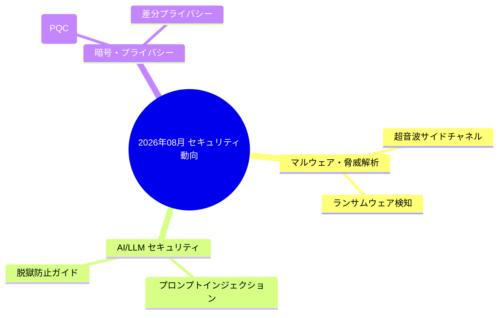

# [DSN-04] 機能設計書: 5 階層構造化日本語エグゼクティブサマリー — arxiv-security-papers

本ドキュメントは、主要機能 **F-03 (5階層構造化日本語エグゼクティブサマリー自動生成)** の階層構造、ディレクトリ設計、完全日本語化アルゴリズム、および比較表・Mermaid トレンド図描画設計を記録する個別機能設計書です。

---

## 1. 階層構造とディレクトリ配置方針 (5-Tier Sequential Hierarchy)

すべてのサマリーは `outputs/executive_summaries/` 配下でソート・検索が容易な 01_〜05_ 連続項番ディレクトリ構造で完全分離管理されます。

```
outputs/executive_summaries/
├── 01_per_run/                         # 取得時ごとサマリー (1日4回: run_0000.md, run_0600.md, run_1200.md, run_1800.md)
│   └── YYYY-MM-DD/
│       └── run_HHMM.md
├── 02_daily/                           # 一日分デイリーサマリー (YYYY-MM-DD.md)
│   └── YYYY-MM-DD.md
├── 03_monthly/                         # 月次トレンドサマリー (monthly_YYYY-MM-DD.md)
│   └── monthly_YYYY-MM-DD.md
├── 04_quarterly/                       # 四半期トレンドサマリー (quarterly_YYYY-MM-DD.md)
│   └── quarterly_YYYY-MM-DD.md
└── 05_annual/                          # 通期アナリティクスサマリー (annual_YYYY-MM-DD.md)
    └── annual_YYYY-MM-DD.md
```

---

## 2. 成果物テーブル構造仕様 (100% Japanese Compliance)

すべての階層型サマリーの本文、ヘッダー、および論文一覧テーブルは **100% 完全日本語化** されます。

```markdown
# 📊 月次セキュリティ論文トレンドサマリー (2026年08月)

## 1. 注目セキュリティ論文一覧 (全 1,250 件)

| arxiv_id | タイトル (日本語) | カテゴリ | 要約 (1文) | 詳細リンク |
| :---: | --- | :---: | --- | :---: |
| **2606.07005** | 超音波サイドチャネル攻撃の脅威 | cs.CR / マルウェア | エアギャップ環境での超音波漏洩を実証 | [OKF詳細](file:///workspace/arxiv-security-papers/outputs/okf_papers/2026-06-05/2606.07005.md) |
| **2608.12511** | LLM プロンプトインジェクション自動検知 | cs.CR / AI | RAG パイプラインにおける堅牢な防御法を提案 | [OKF詳細](file:///workspace/arxiv-security-papers/outputs/okf_papers/2026-08-12/2608.12511.md) |

## 2. 動的技術トレンド構成図


```

---

## 3. 生成パイプライン・関数仕様

- **`generate_run_summary(papers, run_time)`**: 各実行回ごとのサマリーを出力。
- **`generate_all_daily_summaries()`**: 日付別論文を集計し `02_daily/YYYY-MM-DD.md` を更新。
- **`generate_monthly_summary(year, month)`**: 月次集計 ＆ ドメイン別 Mermaid マインドマップ構造図の動的描画。
- **`generate_quarterly_summary()` & `generate_annual_summary()`**: 四半期・通期ハイレベルレポートの作成。
