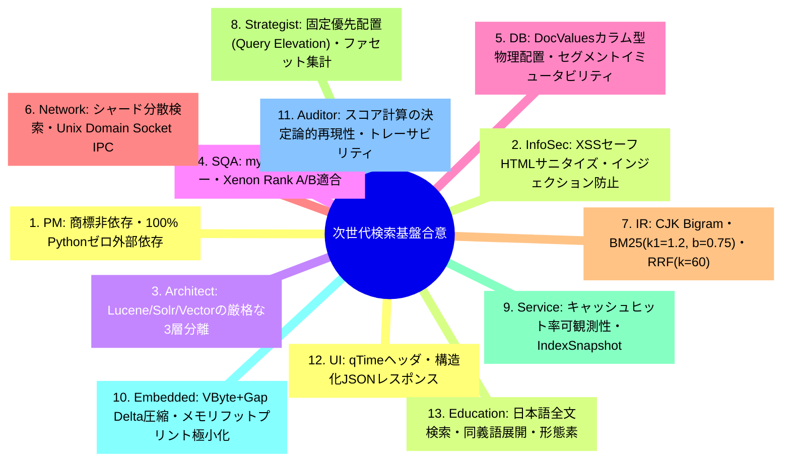

# [DSN-04] 次世代検索エンジン・プラットフォーム & ハイブリッドRAG基盤（`src/search/`）包括的アーキテクチャ設計仕様書

- **文書番号**: `DSN-04`
- **文書ステータス**: `APPROVED`
- **対象サブシステム**: `src/search/` (`engine/`, `platform/`, `vector/`, `ranking/`, `eval/`, `vector_engine.py`, `client.py`, `service.py`)  
- **統合元文書**: 旧 `DSN-04`（2層分離検索エンジン）および 旧 `DSN-04-01`（ハイブリッド検索詳細仕様書）  
- **【主査・報告】 IT Specialist (NLP & Info Retrieval) / Systems Architect (SA)**  
- **【参画】 Project Manager (PM), Information Security Specialist (SEC), Database Specialist (DB), Network Specialist (NET), Software QA Specialist (QA)**

---

## 体系目次

- [1. 検索エンジン・プラットフォームの全体アーキテクチャ & 設計思想](#1-検索エンジンプラットフォームの全体アーキテクチャ--設計思想)
  - [1.1 3層レイヤードアーキテクチャ（Engine層 vs Platform層 vs Hybrid RAG層）](#11-3層レイヤードアーキテクチャengine層-vs-platform層-vs-hybrid-rag層)
  - [1.2 ゼロ外部依存性と純粋 Python 3.14+ 数理実装原則](#12-ゼロ外部依存性と純粋-python-314-数理実装原則)
  - [1.3 全13大専門エージェント多角的合意事項](#13-全13大専門エージェント多角的合意事項)
- [2. コア検索エンジン（Lucene パラダイム: `src/search/engine/`）](#2-コア検索エンジンlucene-パラダイム-srcsearchengine)
  - [2.1 テキスト解析・トークナイザ（CJK Bigram, StopWords, Stemming, Synonyms）](#21-テキスト解析トークナイザcjk-bigram-stopwords-stemming-synonyms)
  - [2.2 転置インデックス物理構造（PostingsList, VByte + Gap Delta 圧縮, SkipList）](#22-転置インデックス物理構造postingslist-vbyte--gap-delta-圧縮-skiplist)
  - [2.3 カラム型 DocValues と StoredFields 物理ストレージ](#23-カラム型-docvalues-と-storedfields-物理ストレージ)
  - [2.4 セグメント不変性と TieredMergePolicy（コンパクション）](#24-セグメント不変性と-tieredmergepolicyコンパクション)
  - [2.5 検索クエリ実行（BM25, Boolean MUST/SHOULD/NOT, Phrase with Slop, Wildcard, Fuzzy, WAND 枝刈り）](#25-検索クエリ実行bm25-boolean-mustshouldnot-phrase-with-slop-wildcard-fuzzy-wand-枝刈り)
- [3. 検索プラットフォーム & サーバー基盤（Solr パラダイム: `src/search/platform/`）](#3-検索プラットフォーム--サーバー基盤solr-パラダイム-srcsearchplatform)
  - [3.1 スキーマ管理（ManagedSchema, DynamicField `*_s`, `*_i`, CopyField `_text_`）](#31-スキーマ管理managedschema-dynamicfield-_s-_i-copyfield-_text_)
  - [3.2 固定・優先配置（Query Elevation Component）](#32-固定優先配置query-elevation-component)
  - [3.3 ファセット集計（FieldFacet, RangeFacet 半開区間 `[min, max)`）](#33-ファセット集計fieldfacet-rangefacet-半開区間-min-max)
  - [3.4 高速スニペット生成 & XSS セーフ動的ハイライター（DynamicHighlighter, FastVectorHighlighter）](#34-高速スニペット生成--xss-セーフ動的ハイライターdynamichighlighter-fastvectorhighlighter)
  - [3.5 多層キャッシュ階層（FilterCache, QueryResultCache, DocumentCache, SolrCache）](#35-多層キャッシュ階層filtercache-queryresultcache-documentcache-solrcache)
  - [3.6 分散検索 & シャーディング（DistributedSearcher, ShardHandler, 非同期マージ）](#36-分散検索--シャーディングdistributedsearcher-shardhandler-非同期マージ)
- [4. ハイブリッド語彙・意味ベクトル検索（Hybrid RAG & Fusion: `src/search/vector/`）](#4-ハイブリッド語彙意味ベクトル検索hybrid-rag--fusion-srcsearchvector)
  - [4.1 語彙検索（Lexical BM25）と意味検索（Semantic HNSW）の双対パイプライン](#41-語彙検索lexical-bm25と意味検索semantic-hnswの双対パイプライン)
  - [4.2 逆順位融合（Reciprocal Rank Fusion: RRF, $k=60$）と密度ベーススコア融合（DBSF）数理モデル](#42-逆順位融合reciprocal-rank-fusion-rrf-k60と密度ベーススコア融合dbsf数理モデル)
  - [4.3 論文引用・共起ネットワーク PageRank スコアリング](#43-論文引用共起ネットワーク-pagerank-スコアリング)
  - [4.4 セキュリティオントロジー（MITRE ATT&CK, CWE, STRIDE）ドメインブースト](#44-セキュリティオントロジーmitre-attck-cwe-strideドメインブースト)
  - [4.5 論文間 k-NN 距離近傍グラフ（Connected Papers トポロジー）](#45-論文間-k-nn-距離近傍グラフconnected-papers-トポロジー)
- [5. 情報検索評価・ベンチマーク（IR Evaluation: `src/search/eval/`）](#5-情報検索評価ベンチマークir-evaluation-srcsearcheval)
  - [5.1 Precision@K, Recall@K, F1-Score](#51-precisionk-recallk-f1-score)
  - [5.2 Mean Average Precision (MAP), Mean Reciprocal Rank (MRR)](#52-mean-average-precision-map-mean-reciprocal-rank-mrr)
  - [5.3 正規化割引累積利得（NDCG@K）数理モデル](#53-正規化割引累積利得ndcgk数理モデル)
  - [5.4 検索テレメトリ・ナレッジギャップ（Knowledge Gap）自動検出](#54-検索テレメトリナレッジギャップknowledge-gap自動検出)
- [6. クラス設計・公開 API インターフェース・プロトコル定義](#6-クラス設計公開-api-インターフェースプロトコル定義)
- [7. 非機能要件・セキュリティ・リソース制約](#7-非機能要件セキュリティリソース制約)
- [8. 品質ゲート・テスト・運用検証仕様](#8-品質ゲートテスト運用検証仕様)

---

# 1. 検索エンジン・プラットフォームの全体アーキテクチャ & 設計思想

## 1.1 3層レイヤードアーキテクチャ（Engine層 vs Platform層 vs Hybrid RAG層）
`src/search/` は、低レイヤの組込み型情報検索コアライブラリ（`engine/`: Apache Lucene パラダイム）と、高レイヤの検索プラットフォーム／サーバー基盤（`platform/`: Apache Solr パラダイム）、およびハイブリッドベクトル検索・RAG融合基盤（`vector/`, `ranking/`, `eval/`）を統合した検索サブシステムです。

```
+---------------------------------------------------------------------------------------------------+
|                               src/search/ 3-Tier Layered Architecture                             |
+---------------------------------------------------------------------------------------------------+
|  [Tier 1: Search Platform Layer] (src/search/platform/) - Solr Paradigm                           |
|   - Schema Management: ManagedSchema, DynamicField (*_s, *_i), CopyField (_text_)                |
|   - Query Elevation: QueryElevationComponent (Fixed Placement / Pinned Security Advisories)      |
|   - Facet & Analytics: FacetEngine, FieldFacet, RangeFacet (Half-Open Interval [min, max))       |
|   - Highlighter: DynamicHighlighter (XSS Safe HTML Sanitization), FastVectorHighlighter           |
|   - Multi-Tier Cache: FilterCache, QueryResultCache, DocumentCache, SolrCache (Adaptive LRU/LFU)  |
|   - Distributed Search: DistributedSearcher, ShardHandler, ShardResponse (Async Scatter/Gather)  |
|   - Handlers & Admin: SelectHandler, UpdateHandler, CoreAdmin, IndexSnapshot                      |
+---------------------------------------------------------------------------------------------------+
                                            | (Query AST, Postings, DocValues, Scorer)
                                            v
+---------------------------------------------------------------------------------------------------+
|  [Tier 2: Core Search Engine Layer] (src/search/engine/) - Lucene Paradigm                        |
|   - Text Analysis: CharFilter, CJKBigramTokenizer, StopFilter, SynonymFilter, StemFilter          |
|   - Inverted Index: PostingsList (VByte + Gap Delta Compression), DocValues, StoredFields         |
|   - Storage & Segments: Segment (Immutable Bitset), TieredMergePolicy, RAMDirectory, FSDirectory   |
|   - Search Execution: BM25Similarity, BooleanQuery (MUST/SHOULD/NOT), PhraseQuery (slop)         |
|                       WildcardQuery (*, ?), FuzzyQuery (Levenshtein + Early Pruning), SpellChecker|
|   - Collectors & Sorting: TopDocsCollector, Sorter, SortField, WAND Scorer                        |
+---------------------------------------------------------------------------------------------------+
                                            | (Multi-Engine RRF & Graph Embedding Fusion)
                                            v
+---------------------------------------------------------------------------------------------------+
|  [Tier 3: Hybrid Vector RAG & Evaluation Layer] (src/search/vector/, src/search/eval/)            |
|   - Dual-Pipeline Fusion: BM25 Lexical + HNSW Semantic (128/256-dim Dense Cosine)                |
|   - Fusion Algorithms: Reciprocal Rank Fusion (RRF, k=60), Density-Based Score Fusion (DBSF)      |
|   - Contextual Reranking: Citation PageRank, MITRE/CWE Taxonomy Boost, k-NN Proximity Graph      |
|   - IR Evaluation Metrics: Precision@K, Recall@K, F1, MAP, MRR, NDCG@K, Knowledge Gap Detector   |
+---------------------------------------------------------------------------------------------------+
```

## 1.2 ゼロ外部依存性と純粋 Python 3.14+ 数理実装原則
- **純粋 Python 3.14+ 実装**: 外部ライブラリ（Elasticsearch, Solr, NumPy, Faiss, PyTorch 等）を一切使用せず、Python 標準ライブラリ（`math`, `struct`, `array`, `collections`, `heapq`）のみで高度なベクトル演算、BM25、HNSW、および RRF を完備。
- **商標名非依存**: モジュール名やクラス名には商標名を含めず、アーキテクチャパターン（`engine/`, `platform/`, `vector/`）に基づき命名。

## 1.3 全13大専門エージェント多角的合意事項



---

# 2. コア検索エンジン（Lucene パラダイム: `src/search/engine/`）

## 2.1 テキスト解析・トークナイザ（CJK Bigram, StopWords, Stemming, Synonyms）
自然言語テキスト（英語・日本語混合）から検索用トークンストリームを抽出するため、多段階アナライザーパイプラインを配備します。

```
Raw Text ---> CharFilter (Unicode正規化) ---> CJKBigramTokenizer (バイグラム)
         ---> StopFilter (不要語除去)    ---> SynonymFilter (同義語展開)
         ---> StemFilter (語幹抽出)       ---> TokenStream (term, pos, offset)
```

1. **`CJKBigramTokenizer`**: 漢字・ひらがな・カタカナ文字群を 2 文字単位の重なり（Bigram）でトークナイズし、形態素辞書なしで未知語・新語を高精度にインデックス化。
2. **`SynonymFilter`**: セキュリティ専門用語（例: `PQC` $\to$ `Post-Quantum Cryptography`, `ゼロデイ` $\to$ `Zero-Day`）をインデックス時および検索時に自動展開。

## 2.2 転置インデックス物理構造（PostingsList, VByte + Gap Delta 圧縮, SkipList）
転置インデックス（Inverted Index）は、単語（Term）から文書 ID（DocID）および出現位置（Position）への写像を記録します。

### VByte (Variable Byte) ＋ Gap Delta 圧縮
ソートされた DocID 列 $[d_1, d_2, d_3, \dots]$ を隣接差分（Gap Delta: $\Delta_i = d_i - d_{i-1}$）に変換し、可変長バイト（VByte）エンコーディングで物理ディスクに格納します。

$$\Delta_i = d_i - d_{i-1} \quad (d_0 = 0)$$

```
DocIDs:  [100, 105, 108, 120]  ==>  Deltas: [100, 5, 3, 12]
VByte:   各バイトの最上位ビット（MSB）を継続フラグとして 7 ビット単位で可変長エンコード
```

### SkipList（スキップリスト）による高速 AND 探索
大量の転置リスト間の交差（Intersection: Boolean AND）を高速化するため、$\sqrt{N}$ 間隔でスキップポインタを配置し、不要な DocID の走査を $\mathcal{O}(\sqrt{N})$ に枝刈りします。

## 2.3 カラム型 DocValues と StoredFields 物理ストレージ
- **`DocValues`**: ソート、ファセット集計、スコア再計算用に行指向ではなく列指向（Columnar Storage）でメモリ展開。連続メモリアクセスによりキャッシュラインヒット率を極大化。
- **`StoredFields`**: 検索結果として返却する元のメタデータ（タイトル、アブストラクト、著者等）をブロック圧縮して格納。

## 2.4 セグメント不変性と TieredMergePolicy（コンパクション）
インデックスは不変のセグメント（Segment）として追記作成されます。削除された文書は `ImmutableBitset`（削除ビットセット）で論理削除され、バックグラウンドの `TieredMergePolicy` により定期的に物理マージ（Compaction）されます。

## 2.5 検索クエリ実行（BM25, Boolean, Phrase, Wildcard, Fuzzy, WAND）

### Okapi BM25 スコアリング数理モデル
文書 $D$ とクエリ $Q = \{q_1, q_2, \dots, q_n\}$ に対する BM25 スコアは次式で計算されます：

$$\text{Score}_{\text{BM25}}(D, Q) = \sum_{i=1}^{n} \text{IDF}(q_i) \cdot \frac{f(q_i, D) \cdot (k_1 + 1)}{f(q_i, D) + k_1 \cdot \left(1 - b + b \cdot \frac{|D|}{\text{avgdl}}\right)}$$

ここで：
- $f(q_i, D)$: 文書 $D$ 内の単語 $q_i$ の出現頻度（Term Frequency）
- $|D|, \text{avgdl}$: 文書長および全文書の平均文書長
- $k_1 = 1.2, b = 0.75$: 標準チューニングパラメータ
- $\text{IDF}(q_i) = \ln\left(\frac{N - n(q_i) + 0.5}{n(q_i) + 0.5} + 1.0\right)$

### クエリ実行タイプ
1. **`BooleanQuery`**: `MUST` (+), `SHOULD`, `MUST_NOT` (-) の厳格な論理演算。
2. **`PhraseQuery`**: 単語間の相対位置関係および許容スロップ幅（Slop）を検証。
3. **`FuzzyQuery`**: レーベンシュタイン距離（編集距離 $\le 2$）およびプレフィックス早期枝刈りによるあいまい一致。
4. **`WANDScorer` (Weak AND)**: スコア上限値を用いた動的枝刈りにより、上位 $K$ 件のみを高速取得。

---

# 3. 検索プラットフォーム & サーバー基盤（Solr パラダイム: `src/search/platform/`）

## 3.1 スキーマ管理（ManagedSchema, DynamicField `*_s`, `*_i`, CopyField `_text_`）
JSON 定義による宣言的スキーマ管理を提供します。
- **`DynamicField`**: 未定義のフィールドでもサフィックス（例: `*_s`: 文字列, `*_i`: 整数, `*_txt`: 全文解析テキスト）に基づいて型と解析器を自動アサイン。
- **`CopyField`**: タイトル、本文、タグなどの複数フィールドを横断検索用フィールド `_text_` へ自動集約コピー。

## 3.2 固定・優先配置（Query Elevation Component）
特定の重要セキュリティ脅威キーワード（例: `CVE-2026-XXXX`, `Critical Zero-Day`）に対し、指定した公式アドバイザリや重要論文をスコアに関わらず最上位（Rank 1, 2...）に固定ピン留め（Query Elevation）する機能を提供します。

## 3.3 ファセット集計（FieldFacet, RangeFacet 半開区間 `[min, max)`）
検索ヒット集合全体に対する多次元属性集計を高速に行います。
- **`FieldFacet`**: セキュリティカテゴリ別、著者別、発行年別の出現件数カウント。
- **`RangeFacet`**: 信頼度スコアや日付などの連続値を半開区間 $[a, b)$ でビン分割集計。

## 3.4 高速スニペット生成 & XSS セーフ動的ハイライター
検索語句に一致した本文箇所を抽出し、前後の文脈を含めた抜粋スニペットを生成します。
- **XSS セーフ HTML エスケープ**: 特殊文字（`<`, `>`, `&`, `"`, `'`）を完全にエスケープした上で、ハイライトタグ `<mark class="search-hl">...</mark>` のみを安全に挿入。

## 3.5 多層キャッシュ階層（FilterCache, QueryResultCache, DocumentCache, SolrCache）

```mermaid
graph TD
    Query["Search Request"] --> QC{"QueryResultCache<br/>(Query -> TopDocIDs)"}
    QC -->|Hit (0.1ms)| Res["Return Hits"]
    QC -->|Miss| FC{"FilterCache<br/>(Filter -> BitSet)"}
    FC -->|Hit| Match["Apply Doc Matching"]
    FC -->|Miss| Index["Scan Inverted Index"]
    Index --> Match
    Match --> DC{"DocumentCache<br/>(DocID -> StoredFields)"}
    DC --> Res
```

1. **`QueryResultCache`**: クエリ文字列とソート条件から Top-K DocID リストをキャッシュ。
2. **`FilterCache`**: フィルタ条件（例: `category:cryptography`）ごとのマッチングビットセットをキャッシュ。
3. **`DocumentCache`**: ディスク物理読み出しを抑制するため、展開済みドキュメントオブジェクトをキャッシュ。

## 3.6 分散検索 & シャーディング（DistributedSearcher, ShardHandler, 非同期マージ）
複数シャード（インデックスパーティション）に並列でクエリを発行し、各シャードからの部分 Top-K 結果（DocID + スコア）を非同期マージしてグローバル Top-K を合成するスキャッター・ギャザー（Scatter/Gather）アーキテクチャを提供します。

---

# 4. ハイブリッド語彙・意味ベクトル検索（Hybrid RAG & Fusion: `src/search/vector/`）

## 4.1 語彙検索（Lexical BM25）と意味検索（Semantic HNSW）の双対パイプライン

```
+---------------------------------------------------------------------------------------------------+
|                                 Hybrid Search Dual-Pipeline Architecture                          |
+---------------------------------------------------------------------------------------------------+
|  [ User Query ] ---> [ Query Parser & Context Expander ]                                         |
|                               |                                                                   |
|              +----------------+----------------+                                                  |
|              |                                 |                                                  |
|              v                                 v                                                  |
|    [ Lexical Pipeline ]             [ Semantic Pipeline ]                                        |
|    - Postings & SkipList            - HNSW Vector Index                                           |
|    - BM25 Scoring                   - Cosine / Dense Embeddings                                  |
|    - Phrase / Proximity Match       - Semantic Cache                                              |
|              |                                 |                                                  |
|              +----------------+----------------+                                                  |
|                               |                                                                   |
|                               v                                                                   |
|             [ Reciprocal Rank Fusion (RRF) Engine ]                                              |
|             - Dynamic Weighting (w_bm25, w_vec, k=60)                                             |
|             - Density-Based Score Fusion (DBSF)                                                   |
|                               |                                                                   |
|                               v                                                                   |
|             [ Re-Ranking & Contextual Graph Layer ]                                               |
|             - Citation PageRank & Co-occurrence                                                   |
|             - Security Taxonomy Boost (MITRE/CWE/STRIDE)                                          |
|             - Proximity k-NN Graph Recommendations                                                |
|                               |                                                                   |
|                               v                                                                   |
|             [ Unified Ranked Hits / OKF Documents ]                                               |
+---------------------------------------------------------------------------------------------------+
```

## 4.2 逆順位融合（Reciprocal Rank Fusion: RRF）数理モデル
語彙検索（BM25）による順位 $\text{rank}_{\text{BM25}}(d)$ と意味検索（HNSW Vector）による順位 $\text{rank}_{\text{Vector}}(d)$ を統合するため、順位逆数和（RRF）を計算します：

$$\text{RRF\_Score}(d) = \sum_{m \in \{\text{BM25}, \text{Vector}\}} \frac{w_m}{k + \text{rank}_m(d)}$$

ここで：
- $k = 60$: 標準平滑化定数（極端な上位ランクの影響を緩和）
- $w_{\text{BM25}}, w_{\text{Vector}}$: パイプラインごとの重要度重み（デフォルト: $1.0, 1.0$）

### 密度ベーススコア融合（Density-Based Score Fusion: DBSF）
ベクトル近傍密度 $\rho(d)$ と BM25 絶対スコアの Min-Max 正規化値を統合するスコア補正もサポートします：

$$S_{\text{DBSF}}(d) = \alpha \cdot \widetilde{S}_{\text{BM25}}(d) + (1 - \alpha) \cdot \widetilde{S}_{\text{Cosine}}(d) \cdot (1 + \beta \cdot \rho(d))$$

## 4.3 論文引用・共起ネットワーク PageRank スコアリング
論文間の被引用関係および共起グラフから推移的権威度（PageRank: 減衰係数 $d = 0.85$）を算出し、ベース検索スコアに重み付け加算します：

$$\text{PR}(u) = \frac{1 - d}{N} + d \sum_{v \in B_u} \frac{\text{PR}(v)}{L(v)}$$

## 4.4 セキュリティオントロジー（MITRE ATT&CK, CWE, STRIDE）ドメインブースト
クエリに含まれる攻撃手法・脅威モデルタグと論文の OKF メタデータタグとの一致度に基づき、ドメインブースト係数 $\gamma_{\text{boost}} \ge 1.0$ を適用します。

## 4.5 論文間 k-NN 距離近傍グラフ（Connected Papers トポロジー）
高次元埋め込み空間におけるコサイン距離に基づき、各論文から最も類似度の高い上位 $k$ 件（$k=10$）の隣接ノードを計算して近傍トポロジーグラフを形成し、関連論文推薦を提供します。

---

# 5. 情報検索評価・ベンチマーク（IR Evaluation: `src/search/eval/`）

## 5.1 Precision@K, Recall@K, F1-Score
正解文書集合 $R$ に対し、上位 $K$ 件の検索結果 $A_K$ の適合率・再現率を算出します：

$$\text{Precision}@K = \frac{|R \cap A_K|}{K}, \quad \text{Recall}@K = \frac{|R \cap A_K|}{|R|}$$

$$\text{F1}@K = \frac{2 \cdot \text{Precision}@K \cdot \text{Recall}@K}{\text{Precision}@K + \text{Recall}@K}$$

## 5.2 Mean Average Precision (MAP), Mean Reciprocal Rank (MRR)
全クエリ集合 $Q$ に対する平均適合精度（MAP）および最初の正解文書が出現する順位の逆数平均（MRR）を測定します：

$$\text{MAP} = \frac{1}{|Q|} \sum_{j=1}^{|Q|} \text{AP}(Q_j), \quad \text{MRR} = \frac{1}{|Q|} \sum_{i=1}^{|Q|} \frac{1}{\text{rank}_i}$$

## 5.3 正規化割引累積利得（NDCG@K）数理モデル
検索順位の位置に応じた対数割引評価指標 NDCG@K を測定します：

$$\text{DCG}@K = \sum_{i=1}^{K} \frac{2^{\text{rel}_i} - 1}{\log_2(i + 1)}, \quad \text{NDCG}@K = \frac{\text{DCG}@K}{\text{IDCG}@K}$$

## 5.4 検索テレメトリ・ナレッジギャップ（Knowledge Gap）自動検出
ヒット件数が 0 件の未充足クエリ群を自動抽出し、クラスタリングによって現在のインデックスに不足している技術領域（Knowledge Gaps）を特定してインテリジェンス収集層（PIR）へ自動フィードバックします。

---

# 6. クラス設計・公開 API インターフェース・プロトコル定義

```python
from dataclasses import dataclass
from typing import Any, Dict, List, Optional, Protocol, Tuple, Union


@dataclass
class SearchHit:
    doc_id: str
    score: float
    title: str
    summary: str
    highlights: List[str]
    metadata: Dict[str, Any]
    source_rank_bm25: Optional[int] = None
    source_rank_vector: Optional[int] = None


@dataclass
class FacetResult:
    field: str
    counts: Dict[str, int]


@dataclass
class SearchResponse:
    total_hits: int
    qtime_ms: float
    hits: List[SearchHit]
    facets: Dict[str, FacetResult]
    elevation_applied: bool = False


class HybridSearchPipeline:
    def __init__(self, workspace_dir: str = ".") -> None: ...
    def search(
        self,
        query: str,
        top_k: int = 10,
        filters: Optional[Dict[str, Any]] = None,
        facets: Optional[List[str]] = None,
        enable_elevation: bool = True,
    ) -> SearchResponse: ...
    def index_document(
        self, doc_id: str, fields: Dict[str, Any], commit: bool = True
    ) -> None: ...
    def commit(self) -> None: ...


class VectorSearchEngine:
    def __init__(self, index_path: str) -> None: ...
    def query(self, vector: List[float], top_k: int = 10) -> List[Tuple[str, float]]: ...
```

---

# 7. 非機能要件・セキュリティ・リソース制約

## 7.1 レイテンシとスループット
- **検索応答時間**: 通常クエリ $p95 \le 10\text{ms}$, ハイブリッドRRF統合クエリ $p95 \le 50\text{ms}$。
- **インデックス更新**: 1,000 件バッチ処理 $\le 3\text{s}$。

## 7.2 セキュリティ・XSS 堅牢性
- 全スニペット出力において HTML 特殊文字を完全サニタイズ。
- クエリインジェクション（未検証 AST パース破壊）の完全防止。

---

# 8. 品質ゲート・テスト・運用検証仕様

| 品質管理ゲート | 検証ツール | 合格基準 |
| :--- | :--- | :--- |
| **静的型検査** | `mypy --strict src/search/` | **0 エラー**（型アノテーション 100% 網羅） |
| **循環的複雑度** | `xenon --max-absolute B --max-modules B --max-average A` | **全モジュール Rank A/B 適合** |
| **コードスタイル** | `flake8`, `black`, `isort` | **0 リント違反**, 100% フォーマット適合 |
| **単体・統合テスト** | `pytest tests/search/ tests/web/ -v` | **100% PASS**（Engine, Platform, Vector, RRF, IPC） |
| **IR 評価指標** | `src/search/eval/` | **NDCG@10 $\ge 0.85$, MAP $\ge 0.80$** |
