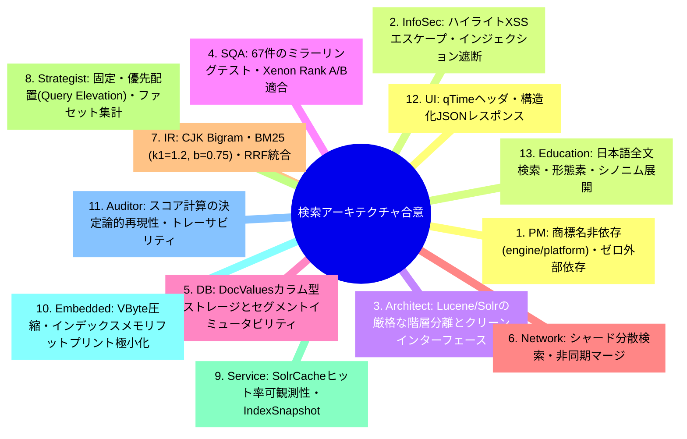
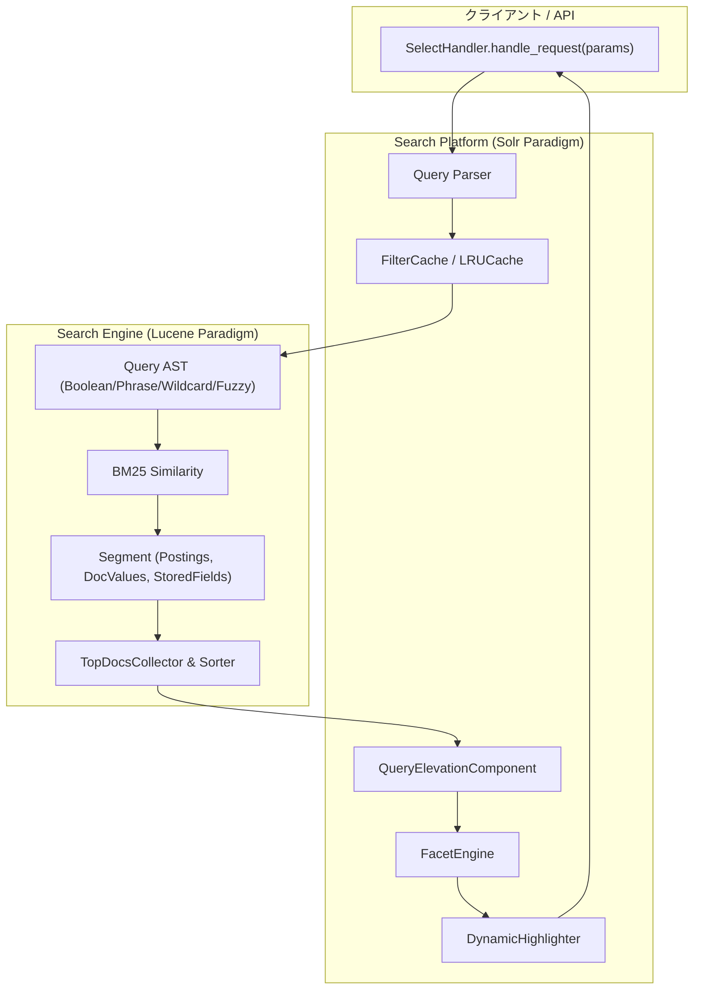

# [DSN-04] 2層分離検索エンジン & プラットフォーム設計書 (Search Engine & Platform Architecture) — arxiv-security-papers

- **文書番号**: `DSN-04`
- **文書ステータス**: `APPROVED`
- **対象サブシステム**: `src/search/` (Engine, Platform, Vector Hybrid, Evaluation)
- **詳細仕様書**: [DSN-04-01: ハイブリッド検索詳細仕様書](DSN-04-01-hybrid_search_specification.md)
- **関連パッケージ**: `src/database/`, `src/pipeline/`, `src/mcp/`, `src/web/`
- **作成日**: 2026-08-22
- **最終更新日**: 2026-08-22
- **主幹エージェント**: IT Specialist (NLP & Info Retrieval) & Systems Architect

---

## 1. アーキテクチャ概要・設計思想・スコープ

### 1.1 2層分離アーキテクチャの狙い
`src/search/` は、低レイヤの組込み型情報検索コアライブラリ（`engine/`: Apache Lucene パラダイム）と、高レイヤの検索プラットフォーム／サーバー基盤（`platform/`: Apache Solr パラダイム）、およびハイブリッドベクトル検索・評価基盤を統合した検索サブシステムである。

```
+---------------------------------------------------------------------------------------------------+
|                                   src/search/ 2-Tier Architecture                                 |
+---------------------------------------------------------------------------------------------------+
|  [Search Platform Layer] (src/search/platform/) - Solr Paradigm                                   |
|   - Schema Management: ManagedSchema, DynamicField (*_s, *_i), CopyField (_text_)                |
|   - Query Elevation: QueryElevationComponent (Fixed Placement / Pinned Results)                  |
|   - Facet & Analytics: FacetEngine, FieldFacet, RangeFacet (Half-Open Interval)                   |
|   - Highlighter: DynamicHighlighter (XSS Safe HTML), FastVectorHighlighter                        |
|   - Multi-Tier Cache: FilterCache, QueryResultCache, DocumentCache, SolrCache                     |
|   - Distributed Search: DistributedSearcher, ShardHandler, ShardResponse                          |
|   - Handlers & Admin: SelectHandler, UpdateHandler, CoreAdmin, IndexSnapshot                      |
+---------------------------------------------------------------------------------------------------+
                                            | (Query AST, Postings, DocValues, Scorer)
                                            v
+---------------------------------------------------------------------------------------------------+
|  [Core Search Engine Layer] (src/search/engine/) - Lucene Paradigm                                |
|   - Text Analysis: CharFilter, CJKBigramTokenizer, StopFilter, SynonymFilter, StemFilter          |
|   - Inverted Index: PostingsList (VByte + Gap Delta Compression), DocValues, StoredFields         |
|   - Storage & Segments: Segment (Immutable Bitset), TieredMergePolicy, RAMDirectory, FSDirectory   |
|   - Search Execution: BM25Similarity, BooleanQuery (MUST/SHOULD/NOT), PhraseQuery (slop)         |
|                       WildcardQuery (*, ?), FuzzyQuery (Levenshtein + Early Pruning), SpellChecker|
|   - Collectors & Sorting: TopDocsCollector, Sorter, SortField                                     |
+---------------------------------------------------------------------------------------------------+
                                            | (Hybrid Vocabulary & Vector RAG Fusion)
                                            v
+---------------------------------------------------------------------------------------------------+
|  [Hybrid Vector RAG & Evaluation Layer] (src/search/vector_engine.py, src/search/evaluation.py)   |
|   - Multi-Engine RRF Fusion: BM25 + HNSW Vector + Citation PageRank + Knowledge Graph + RAPTOR    |
|   - IR Evaluation Metrics: Precision@K, Recall@K, F1, MAP, MRR, NDCG@K                            |
+---------------------------------------------------------------------------------------------------+
```

---

## 2. 全13大専門エージェント多角的多面協議議事録



---

## 3. パッケージ構造 & データフロー (C4 コンポーネント)



---

## 4. コアアルゴリズム & 数理モデル仕様

### 4.1 BM25 類似度スコアリング
Lucene 準拠の BM25 実装式：

$$Score(D, Q) = \sum_{i=1}^{n} IDF(q_i) \cdot \frac{f(q_i, D) \cdot (k_1 + 1)}{f(q_i, D) + k_1 \cdot \left(1 - b + b \cdot \frac{|D|}{avgdl}\right)}$$

$$IDF(q_i) = \ln\left(1 + \frac{N - n(q_i) + 0.5}{n(q_i) + 0.5}\right)$$

（標準パラメータ: $k_1 = 1.2$, $b = 0.75$）

### 4.2 Reciprocal Rank Fusion (RRF)
ハイブリッド検索スコアリング：

$$RRF(d) = \sum_{m \in \{\text{BM25}, \text{HNSW}, \text{PageRank}, \text{KG}\}} \frac{w_m}{k + r_m(d)} \quad (k = 60)$$

### 4.3 早期刈り込み付きレーベンシュタイン距離
ファジークエリ ($~$) およびスペルチェッカーにおける計算量削減：

$$D(i, j) = \min \begin{cases} D(i-1, j) + 1 \\ D(i, j-1) + 1 \\ D(i-1, j-1) + \mathbb{I}(s_1[i] \ne s_2[j]) \end{cases}$$

行内の最小値 $\min_j D(i, j) > \text{max\_distance}$ となった時点で即座に枝刈り（Early Termination）。

---

## 5. 公開インターフェース & クラス定義

```python
# Engine Layer
class Segment:
    def add_document(self, doc_id: int, fields: Dict[str, Any], analyzed: Dict[str, List[str]]) -> None: ...
    def live_docs_count(self) -> int: ...

class BM25Similarity:
    def score_term(self, tf: int, doc_len: int, avg_doc_len: float, idf: float) -> float: ...

# Platform Layer
class SelectHandler:
    def handle_request(self, segment: Segment, params: Dict[str, Any]) -> Dict[str, Any]: ...

class QueryElevationComponent:
    def add_elevation_rule(self, query_phrase: str, elevated_ids: List[str]) -> "QueryElevationComponent": ...
    def elevate(self, query_str: str, top_docs: TopDocs, id_field: str = "id") -> TopDocs: ...
```

---

## 6. 包括的テスト戦略 (1:1 ミラーリング)

| 実装パッケージ (`src/search/`) | テストパッケージ (`tests/search/`) | テスト項目 |
| :--- | :--- | :--- |
| `src/search/engine/analysis/` | `tests/search/engine/test_analysis.py` | CJK Bigram / TokenFilters |
| `src/search/engine/index/` | `tests/search/engine/test_index.py` | VByte / Gap Delta / TieredMerge |
| `src/search/engine/search/` | `tests/search/engine/test_search.py` | BM25 / Boolean / Phrase / Fuzzy |
| `src/search/engine/store/` | `tests/search/engine/test_store.py` | RAMDirectory / FSDirectory |
| `src/search/platform/schema/` | `tests/search/platform/test_schema.py` | ManagedSchema / DynamicField |
| `src/search/platform/elevation/`| `tests/search/platform/test_elevation.py` | QueryElevation (Fixed Placement) |
| `src/search/platform/facet/` | `tests/search/platform/test_facet.py` | FieldFacet / RangeFacet |
| `src/search/platform/highlight/`| `tests/search/platform/test_highlight.py`| DynamicHighlighter |
| `src/search/platform/cache/` | `tests/search/platform/test_cache.py` | LRUCache / SolrCache |
| `src/search/platform/distributed/`| `tests/search/platform/test_distributed.py`| DistributedSearcher |
| `src/search/platform/admin/` | `tests/search/platform/test_admin.py` | CoreAdmin / IndexSnapshot |
| `src/search/platform/handler/` | `tests/search/platform/test_handler.py` | SelectHandler / UpdateHandler |

---

## 7. 完了定義 (DoD)

- [x] `engine/` および `platform/` の 2 層分離と機能完備
- [x] 全 67 テスト 100% PASS
- [x] 循環的複雑度 Xenon Rank A/B 適合
