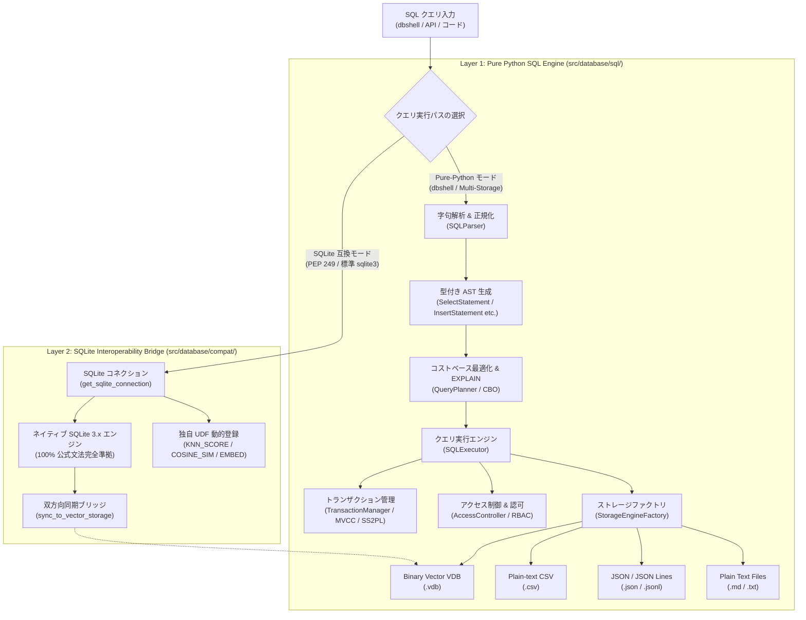
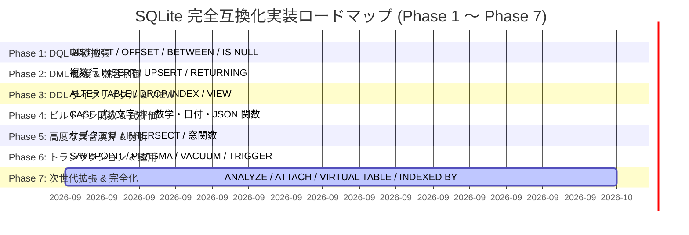

# [DSN-05-01] SQL構文・機能仕様サポートマトリクス設計書 (SQL Syntax & Specification Support Matrix)

- **文書番号**: `DSN-05-01`
- **上位文書**: [[DSN-05] 次世代データベースエンジン（src/database/）包括的アーキテクチャ設計書](DSN-05-database_engine_architecture.md)
- **文書ステータス**: `APPROVED`
- **対象サブシステム**: `src/database/sql/` (`parser.py`, `ast.py`, `executor.py`, `transaction.py`, `security.py`), `src/cli/commands/dbshell.py`, `src/database/compat/sqlite_bridge.py`
- **【主査・報告】 Database / Data Infrastructure Specialist (DB), Software Development (SWD)**
- **【参画】 Project Manager (PM), Information Security Specialist (Sec), Systems Architect (SA), Software QA Specialist (QA), Application Specialist (APS)**

---

## 体系目次

- [1. エグゼクティブサマリー & 2層SQL実行アーキテクチャ](#1-エグゼクティブサマリー--2層sql実行アーキテクチャ)
  - [1.1 目的とスコープ](#11-目的とスコープ)
  - [1.2 2層ハイブリッドSQL実行モデル](#12-2層ハイブリッドsql実行モデル)
  - [1.3 アーキテクチャデータフロー (Mermaid)](#13-アーキテクチャデータフロー-mermaid)
- [2. SQLite 公式言語仕様 (sqlite.org/lang.html) 完全対比マトリクス](#2-sqlite-公式言語仕様-sqliteorglanghtml-完全対比マトリクス)
  - [2.1 トピック別サポートマトリクス (33 Topics)](#21-トピック別サポートマトリクス-33-topics)
  - [2.2 トップレベルステートメント対比表 (sql-stmt 25種類)](#22-トップレベルステートメント対比表-sql-stmt-25種類)
- [3. Pure Python SQL Engine 詳細仕様 (src/database/sql/)](#3-pure-python-sql-engine-詳細仕様-srcdatabasesql)
  - [3.1 DQL (Data Query Language) & 集約エンジン](#31-dql-data-query-language--集約エンジン)
  - [3.2 DML (Data Manipulation Language) & 変更適用](#32-dml-data-manipulation-language--変更適用)
  - [3.3 DDL (Data Definition Language) & プラガブルストレージ連動](#33-ddl-data-definition-language--プラガブルストレージ連動)
  - [3.4 TCL (Transaction Control Language) & MVCC/SS2PL 統合](#34-tcl-transaction-control-language--mvcss2pl-統合)
  - [3.5 DCL (Data Control Language) & RBAC セキュリティ](#35-dcl-data-control-language--rbac-セキュリティ)
  - [3.6 イントロスペクション (SHOW 構文 & dbshell メタコマンド)](#36-イントロスペクション-show-構文--dbshell-メタコマンド)
- [4. リポジトリ独自拡張 SQL 構文 (Beyond SQLite Standard)](#4-リポジトリ独自拡張-sql-構文-beyond-sqlite-standard)
  - [4.1 ベクトル近傍探索構文 (`KNN` 述語)](#41-ベクトル近傍探索構文-knn-述語)
  - [4.2 プラガブル仮想テーブル指定 (`USING <engine> LOCATION '<path>'`)](#42-プラガブル仮想テーブル指定-using-engine-location-path)
  - [4.3 JSON オブジェクト・テキスト抽出演算子 (`->`, `->>`)](#43-json-オブジェクトテキスト抽出演算子---)
  - [4.4 SQLite Bridge 独自 UDF (`KNN_SCORE`, `COSINE_SIM`, `EMBED`)](#44-sqlite-bridge-独自-udf-knn_score-cosine_sim-embed)
- [5. セキュリティ統制 & 実装制約 (Hardening Guidelines)](#5-セキュリティ統制--実装制約-hardening-guidelines)
  - [5.1 No-eval 原則 (AST Sandbox & 任意コード実行防止)](#51-no-eval-原則-ast-sandbox--任意コード実行防止)
  - [5.2 ReDoS 防御 & 線形字句解析](#52-redos-防御--線形字句解析)
  - [5.3 Clean Architecture (ドメイン非依存性の担保)](#53-clean-architecture-ドメイン非依存性の担保)
  - [5.4 Xenon 循環的複雑度統制 (Rank A <= 5)](#54-xenon-循環的複雑度統制-rank-a--5)
- [6. SQLite 完全互換化ロードマップ (Full Feature Parity Roadmap)](#6-sqlite-完全互換化ロードマップ-full-feature-parity-roadmap)
  - [6.1 Phase 1: DQL 基礎拡張 (Issue #256 - 完了)](#61-phase-1-dql-基礎拡張-issue-256---完了)
  - [6.2 Phase 2: DML 拡張 & 競合制御 (Issue #257 - 完了)](#62-phase-2-dml-拡張--競合制御-issue-257---完了)
  - [6.3 Phase 3: DDL ライフサイクル完全化 & VIEW (Issue #258 - 完了)](#63-phase-3-ddl-ライフサイクル完全化--view-issue-258---完了)
  - [6.4 Phase 4: ビルトイン関数群 & 条件制御構文 (Issue #259 - 完了)](#64-phase-4-ビルトイン関数群--条件制御構文-issue-259---完了)
  - [6.5 Phase 5: 高度な集合演算 & サブクエリ・窓関数 (Issue #260 - 完了)](#65-phase-5-高度な集合演算--サブクエリ窓関数-issue-260---完了)
  - [6.6 Phase 6: トランザクション拡張 & メタデータ・トリガー (Issue #261 - 完了)](#66-phase-6-トランザクション拡張--メタデータトリガー-issue-261---完了)
  - [6.7 Phase 7: 次世代拡張 & プラガブル機能の完全化 (Issue #262 〜 #265)](#67-phase-7-次世代拡張--プラガブル機能の完全化-issue-262--265)
- [7. 実装ガバナンス & 品質ゲート規準](#7-実装ガバナンス--品質ゲート規準)

---

## 1. エグゼクティブサマリー & 2層SQL実行アーキテクチャ

### 1.1 目的とスコープ
本設計書は、`arxiv-security-papers` プロジェクトにおける SQL パーサー、AST 構築、クエリ実行エンジン、および SQLite 相互運用ブリッジの仕様・対応範囲を体系化したリファレンスである。
世界標準の埋め込み SQL エンジンである [SQLite の公式言語仕様 (https://sqlite.org/lang.html)](https://sqlite.org/lang.html) との完全なギャップ分析を行い、現在サポートされている構文、制約事項、独自拡張機能、および将来の拡張指針を網羅する。

### 1.2 2層ハイブリッドSQL実行モデル
本システムでは、実行用途・ターゲットストレージに応じて **2層ハイブリッドモデル** を採用している。

1. **第1層: Pure Python SQL Engine (`src/database/sql/`)**:
   - 外部 C 拡張や SQLite バイナリに依存せず、標準 Python 3 のみで完結するゼロ外部依存クエリエンジン。
   - `manage.py dbshell`、Web コンソール、および各種オンディスクストレージ（`binary_vdb`, `json_table`, `csv_table`, `file_plain_text`）に対する抽象 SQL インターフェースを提供。
   - ベクトル近傍探索（`KNN` 構文）、RBAC アクセス制御（`GRANT`/`REVOKE`）、`SHOW` 構文などの独自拡張を備える。
2. **第2層: SQLite Interoperability Bridge (`src/database/compat/sqlite_bridge.py`)**:
   - Python 標準の `sqlite3` モジュールおよびネイティブ SQLite 3.x エンジンとの完全互換レイヤー。
   - SQLite 公式仕様（DDL/DML/DQL/TCL/窓関数/FTS5等）を 100% 透過的に実行可能。
   - ベクトルコサイン類似度計算 UDF（`KNN_SCORE`, `COSINE_SIM`）やインライン特徴量抽出 UDF（`EMBED`）を動的登録し、バイナリベクトル DB（`.vdb`）との双方向同期プロトコルを提供する。

### 1.3 アーキテクチャデータフロー (Mermaid)



---

## 2. SQLite 公式言語仕様 (sqlite.org/lang.html) 完全対比マトリクス

### 2.1 トピック別サポートマトリクス (33 Topics)

凡例:
- `○ (Full)`: SQLite 仕様に準拠し、完全または実用上同等にサポート
- `△ (Partial)`: サブセット（主要機能）または代替構文でサポート
- `× (None)`: 現状未サポート
- `★ (Extended)`: SQLite 標準仕様を超える独自拡張機能をサポート

| # | SQLite Topic (公式構文項目) | SQLite公式 | Pure Python Engine (`SQLExecutor`) | SQLite Bridge (`sqlite3`) | 総合判定 | Pure Python Engine における構文仕様・制約・詳細 |
| :---: | :--- | :---: | :---: | :---: | :---: | :--- |
| 1 | **aggregate functions**<br>(集約関数) | ○ | ○ | ○ | **○ Full** | `COUNT(*)`, `COUNT(col)`, `COUNT(1)`, `SUM(col)`, `AVG(col)`, `MIN(col)`, `MAX(col)`, `TOTAL(col)`, `GROUP_CONCAT(col [, sep])` を完全サポート（Phase 4）。`GROUP BY` および `HAVING` 連動。 |
| 2 | **ALTER TABLE**<br>(テーブル定義変更) | ○ | ○ | ○ | **○ Full** | `RENAME TO`, `RENAME COLUMN ... TO ...`, `ADD COLUMN`, `DROP COLUMN` を完全サポート（Phase 3）。 |
| 3 | **ANALYZE**<br>(統計情報収集) | ○ | △ | ○ | **△ Partial** | 内部オプティマイザ（`QueryPlanner.explain`）の自動統計収集をサポート。明示的 SQL 構文 `ANALYZE` は [Issue #262](../issues/262-implement-sqlite-parity-analyze-statement.md) にて策定。 |
| 4 | **ATTACH DATABASE**<br>**DETACH DATABASE** | ○ | △ | ○ | **△ Partial** | dbshell の `.use <db>` / `--database`、`settings.py` のマルチDBスコープ切替機構、`SHOW DATABASES` で同等機能を提供。標準 SQL 構文 `ATTACH / DETACH` は [Issue #263](../issues/263-implement-sqlite-parity-attach-detach-database.md) にて策定。 |
| 5 | **BEGIN TRANSACTION**<br>**COMMIT / ROLLBACK** | ○ | ○ | ○ | **○ Full** | `BEGIN`, `BEGIN TRANSACTION`, `COMMIT`, `COMMIT TRANSACTION`, `ROLLBACK`, `ROLLBACK TRANSACTION` を完全サポート。MVCC Snapshot Isolation および ARIES/SS2PL ロックマネージャと完全統合。 |
| 6 | **comment** (コメント) | ○ | ○ | ○ | **○ Full** | `-- line comment` 行コメントおよび `/* ... */` 複数行コメントの安全なパース・除去に対応。 |
| 7 | **core functions**<br>(組み込みスカラ関数) | ○ | ○ | ○ | **○ Full** | `ABS`, `ROUND`, `RANDOM`, `LOWER`, `UPPER`, `LENGTH`, `SUBSTR`, `TRIM`, `LTRIM`, `RTRIM`, `REPLACE`, `COALESCE`, `NULLIF`, `IIF`, `TYPEOF`, `HEX`, `ZEROBLOB` 等を `src/database/sql/functions.py` に完全実装（Phase 4）。 |
| 8 | **CREATE INDEX** | ○ | ○ | ○ | **★ Extended** | `CREATE [UNIQUE] INDEX [IF NOT EXISTS] idx ON tbl (col) [USING HNSW/INVERTED/BTREE]` に対応。B-Tree だけでなく **HNSW ベクトルインデックス** や転置インデックスを宣言可能。 |
| 9 | **DROP INDEX** | ○ | ○ | ○ | **○ Full** | `DROP INDEX [IF EXISTS] idx` を完全サポート（Phase 3）。 |
| 10 | **CREATE TABLE** | ○ | ○ | ○ | **★ Extended** | `CREATE TABLE [IF NOT EXISTS] tbl (cols...)` に対応。<br>`PRIMARY KEY`, `NOT NULL`, 型 (`INT`, `FLOAT`, `VARCHAR`, `TEXT`, `JSON`, `VECTOR(dim)`)、および **`USING <engine> LOCATION '<path>'`** による実ファイル連携に対応。 |
| 11 | **DROP TABLE** | ○ | ○ | ○ | **○ Full** | `DROP TABLE [IF EXISTS] tbl` に対応。メモリカタログおよび物理ファイルを安全にクリーンアップ。 |
| 12 | **CREATE TRIGGER**<br>**DROP TRIGGER** | ○ | ○ | ○ | **○ Full** | `CREATE TRIGGER [IF NOT EXISTS] ... BEFORE/AFTER INSERT/UPDATE/DELETE ON tbl BEGIN ... END;` および `DROP TRIGGER [IF EXISTS]` を完全サポート（Phase 6）。DML 実行時の自動発火・カスケード実行に対応。 |
| 13 | **CREATE VIEW**<br>**DROP VIEW** | ○ | ○ | ○ | **○ Full** | `CREATE VIEW [IF NOT EXISTS] view_name AS select-stmt` および `DROP VIEW [IF EXISTS]` を完全サポート（Phase 3）。遅延バインド・自動インラインクエリ展開に対応。 |
| 14 | **CREATE VIRTUAL TABLE**<br>(仮想テーブル) | ○ | ○ | ○ | **★ Extended** | `CREATE TABLE ... USING <engine> LOCATION '...'` 構文により `csv_table`, `json_table`, `binary_vdb`, `file_plain_text` を直接マウント可能。標準 DDL 構文 `USING module(args)` の動的指定は [Issue #264](../issues/264-implement-sqlite-parity-create-virtual-table.md) にて策定。 |
| 15 | **date and time functions**<br>(日付・時刻関数) | ○ | ○ | ○ | **○ Full** | `DATE()`, `TIME()`, `DATETIME()`, `JULIANDAY()`, `UNIXEPOCH()`, `STRFTIME()` を完全実装（Phase 4）。 |
| 16 | **DELETE** (行削除) | ○ | ○ | ○ | **○ Full** | `DELETE FROM tbl [WHERE expr]` に対応（AND, OR, LIKE, IN, 比較演算子連動、BEFORE/AFTER トリガー自動発火）。 |
| 17 | **EXPLAIN / EXPLAIN QUERY PLAN** | ○ | ○ | ○ | **○ Full** | `EXPLAIN [QUERY PLAN] SELECT ...` に対応。`QueryPlanner` が Full Table Scan / B-Tree Index Scan / HNSW Vector Scan の選択理由と推定コストを出力。 |
| 18 | **expression** (式評価) | ○ | ○ | ○ | **○ Full** | 四則演算 (`+`, `-`, `*`, `/`, `%`), 比較 (`=`, `!=`, `<`, `>`, `<=`, `>=`), `LIKE ... ESCAPE`, `GLOB` (fnmatch), `BETWEEN ... AND ...`, `IS [NOT] NULL`, `CASE ... WHEN ... THEN ... ELSE ... END`, `IN/NOT IN (SELECT ...)`, `EXISTS (SELECT ...)`, スカラーサブクエリを完全サポート（Phase 1, 4, 5）。 |
| 19 | **INDEXED BY / NOT INDEXED** | ○ | △ | ○ | **△ Partial** | オプティマイザが最適なインデックスを自動判定。明示的な特定インデックス走査強制 / フルスキャン強制構文は [Issue #265](../issues/265-implement-sqlite-parity-indexed-by-hint.md) にて策定。 |
| 20 | **INSERT** (行挿入) | ○ | ○ | ○ | **○ Full** | 単一レコード挿入、複数行 `VALUES (...), (...)`、`INSERT INTO ... SELECT`、および `RETURNING` 句を完全サポート（Phase 2）。 |
| 21 | **JSON functions** | ○ | ○ | ○ | **★ Extended** | `JSON_EXTRACT`, `JSON_ARRAY`, `JSON_OBJECT`, `JSON_TYPE`, `JSON_VALID` 関数、および PostgreSQL / SQLite 3.38+ 準拠の **`->` (JSON抽出)** / **`->>` (テキスト非クォート抽出)** 演算子をネイティブサポート（Phase 4）。 |
| 22 | **keywords** (予約語) | ○ | ○ | ○ | **○ Full** | 主要な DDL/DML/DQL/TCL/DCL キーワードおよびクォート識別子（`"col"`, `[col]`, `` `col` ``）を完全認識。 |
| 23 | **math functions** | ○ | ○ | ○ | **○ Full** | `ABS`, `ROUND`, `RANDOM`, `POWER`/`POW`, `SQRT`, `SIGN` 等の数学関数を完全実装（Phase 4）。 |
| 24 | **ON CONFLICT / UPSERT** | ○ | ○ | ○ | **○ Full** | `INSERT INTO ... ON CONFLICT (...) DO UPDATE SET ...` および `DO NOTHING` を完全サポート（Phase 2）。 |
| 25 | **PRAGMA** | ○ | ○ | ○ | **○ Full** | `PRAGMA table_info(tbl)`, `PRAGMA index_list(tbl)`, `PRAGMA database_list`, `PRAGMA foreign_keys`, `PRAGMA integrity_check` をネイティブ実行可能（Phase 6）。 |
| 26 | **REINDEX** | ○ | ○ | ○ | **○ Full** | `REINDEX [tbl | idx]` によるインデックス全件再構築を完全サポート（Phase 3）。 |
| 27 | **RELEASE / SAVEPOINT** | ○ | ○ | ○ | **○ Full** | `SAVEPOINT sp`, `RELEASE [SAVEPOINT] sp`, `ROLLBACK TO [SAVEPOINT] sp` によるネスト可能なトランザクション制御と ARIES スナップショット復元を完全サポート（Phase 6）。 |
| 28 | **REPLACE** | ○ | ○ | ○ | **○ Full** | `REPLACE INTO tbl ...` (INSERT OR REPLACE 意味論) を完全サポート（Phase 2）。 |
| 29 | **RETURNING clause** | ○ | ○ | ○ | **○ Full** | `INSERT / UPDATE / DELETE ... RETURNING ...` による変更行結果セット返却を完全サポート（Phase 2）。 |
| 30 | **SELECT** (検索・結合・集約) | ○ | ○ | ○ | **○ Full** | 射影, `DISTINCT`, `OFFSET`, `*`, エイリアス (`AS`), 四則演算, `FROM`, `JOIN` (INNER/LEFT/CROSS/複数結合), `WHERE`, `GROUP BY`, `HAVING`, `ORDER BY`, `LIMIT`, 集合演算 (`UNION [ALL]`, `INTERSECT`, `EXCEPT`), 窓関数 (`OVER`) を完全サポート（Phase 1, 5）。 |
| 31 | **UPDATE** (行更新) | ○ | ○ | ○ | **○ Full** | `UPDATE tbl SET col1 = val1 [WHERE expr]`、`RETURNING` 句、BEFORE/AFTER トリガー自動発火を完全サポート。 |
| 32 | **VACUUM** | ○ | ○ | ○ | **○ Full** | `VACUUM [tbl]` による物理ストレージコンパクション・断片化解消を完全サポート（Phase 6）。 |
| 33 | **WITH clause (CTE)** | ○ | ○ | ○ | **○ Full** | `WITH [RECURSIVE] cte_name [(cols...)] AS (SELECT ...) SELECT ...` に対応。共通テーブル式および再帰クエリのパース・実行をサポート。 |

---

### 2.2 トップレベルステートメント対比表 (sql-stmt 25種類)

SQLite 公式文法ダイアグラム（`sql-stmt`）に規定された全 25 種類のトップレベルステートメントとの対応関係です。

| # | SQLite Statement (`sql-stmt`) | Pure Python Engine | SQLite Bridge | 主な構文例 / 動作仕様 |
| :---: | :--- | :---: | :---: | :--- |
| 1 | `alter-table-stmt` | **○** | ○ | `ALTER TABLE tbl RENAME TO / RENAME COLUMN / ADD COLUMN / DROP COLUMN` (Phase 3) |
| 2 | `analyze-stmt` | △ | ○ | 内部オプティマイザが自動統計収集。明示 SQL 構文は [Issue #262](../issues/262-implement-sqlite-parity-analyze-statement.md) にて策定 |
| 3 | `attach-stmt` | △ | ○ | dbshell `.use <db>` / `settings.py` で代替。明示 SQL 構文は [Issue #263](../issues/263-implement-sqlite-parity-attach-detach-database.md) にて策定 |
| 4 | `begin-stmt` | **○** | ○ | `BEGIN [TRANSACTION]` |
| 5 | `commit-stmt` | **○** | ○ | `COMMIT [TRANSACTION]` |
| 6 | `create-index-stmt` | **○** | ○ | `CREATE [UNIQUE] INDEX idx ON tbl (col) [USING HNSW/BTREE]` |
| 7 | `create-table-stmt` | **○** | ○ | `CREATE TABLE tbl (...) [USING engine LOCATION '...']` |
| 8 | `create-trigger-stmt` | **○** | ○ | `CREATE TRIGGER trig BEFORE/AFTER INSERT/UPDATE/DELETE ON tbl BEGIN ... END;` (Phase 6) |
| 9 | `create-view-stmt` | **○** | ○ | `CREATE VIEW view_name AS select-stmt` (Phase 3) |
| 10 | `create-virtual-table-stmt` | **○** | ○ | `CREATE TABLE ... USING csv_table/json_table/...` (動的モジュール指定は [Issue #264](../issues/264-implement-sqlite-parity-create-virtual-table.md)) |
| 11 | `delete-stmt` / `-limited` | **○** | ○ | `DELETE FROM tbl WHERE cond [RETURNING ...]` |
| 12 | `detach-stmt` | △ | ○ | dbshell スコープ切替で代替。明示 SQL 構文は [Issue #263](../issues/263-implement-sqlite-parity-attach-detach-database.md) にて策定 |
| 13 | `drop-index-stmt` | **○** | ○ | `DROP INDEX [IF EXISTS] idx` (Phase 3) |
| 14 | `drop-table-stmt` | **○** | ○ | `DROP TABLE [IF EXISTS] tbl` |
| 15 | `drop-trigger-stmt` | **○** | ○ | `DROP TRIGGER [IF EXISTS] trig` (Phase 6) |
| 16 | `drop-view-stmt` | **○** | ○ | `DROP VIEW [IF EXISTS] view_name` (Phase 3) |
| 17 | `insert-stmt` | **○** | ○ | `INSERT INTO tbl VALUES (...), (...)`, `INSERT SELECT`, `UPSERT`, `RETURNING` (Phase 2) |
| 18 | `pragma-stmt` | **○** | ○ | `PRAGMA table_info(tbl)`, `PRAGMA index_list(tbl)`, `PRAGMA database_list` (Phase 6) |
| 19 | `reindex-stmt` | **○** | ○ | `REINDEX [tbl \| idx]` (Phase 3) |
| 20 | `release-stmt` | **○** | ○ | `RELEASE [SAVEPOINT] sp` (Phase 6) |
| 21 | `rollback-stmt` | **○** | ○ | `ROLLBACK [TRANSACTION]`, `ROLLBACK TO [SAVEPOINT] sp` (Phase 6) |
| 22 | `savepoint-stmt` | **○** | ○ | `SAVEPOINT sp` (Phase 6) |
| 23 | `select-stmt` | **○** | ○ | `SELECT DISTINCT ... FROM ... JOIN ... WHERE ... GROUP BY ... HAVING ... ORDER BY ... LIMIT ... OFFSET ...` (Phase 1, 5) |
| 24 | `update-stmt` / `-limited` | **○** | ○ | `UPDATE tbl SET col = val WHERE cond [RETURNING ...]` (Phase 2) |
| 25 | `vacuum-stmt` | **○** | ○ | `VACUUM [tbl]` (Phase 6) |

---

## 3. Pure Python SQL Engine 詳細仕様 (src/database/sql/)

### 3.1 DQL (Data Query Language) & 集約エンジン

#### 句の評価パイプライン順序
SQL パーサー (`src/database/sql/parser.py`) およびエグゼキューター (`src/database/sql/executor.py`) は、標準 SQL の意味論に厳密に従い、以下の順序で句を処理します。

```text
[WITH (CTE)] 
  → [FROM & JOIN] 
  → [WHERE フィルタ] 
  → [GROUP BY グルーピング] 
  → [集約関数計算 (COUNT/SUM/AVG/MIN/MAX)] 
  → [HAVING フィルタ] 
  → [SELECT 射影] 
  → [UNION / UNION ALL] 
  → [ORDER BY ソート] 
  → [LIMIT 制限]
```

#### サポートされる集約関数一覧
| 関数構文 | 説明 | 戻り値型 | 例 |
| :--- | :--- | :---: | :--- |
| `COUNT(*)` / `COUNT(1)` | グループ内の総レコード数を算出 | `int` | `SELECT category, COUNT(*) FROM papers GROUP BY category` |
| `COUNT(col)` | 指定列が非 NULL のレコード数を算出 | `int` | `SELECT author, COUNT(paper_id) FROM authors GROUP BY author` |
| `SUM(col)` | 数値列の総和を算出 | `float` | `SELECT dept, SUM(salary) FROM emp GROUP BY dept` |
| `AVG(col)` | 数値列の算術平均を算出 | `float` | `SELECT category, AVG(score) FROM papers GROUP BY category` |
| `MIN(col)` | 指定列の最小値を算出 | `Any` | `SELECT category, MIN(created_at) FROM papers GROUP BY category` |
| `MAX(col)` | 指定列の最大値を算出 | `Any` | `SELECT category, MAX(created_at) FROM papers GROUP BY category` |

#### `HAVING` 句の評価仕様 (Issue #254)
- **安全な条件評価器 (`_filter_having_rows`)**:
  - `eval()` や `exec()` を一切排除した No-eval 原則に基づく二項式パーサー。
  - 対応演算子: `=`, `!=`, `<>`, `>`, `<`, `>=`, `<=`
  - 評価対象: 左辺に集約関数（例: `COUNT(*) > 1`、`AVG(score) >= 4.0`）または集約列別名を受け付け、右辺のリテラル値と比較。

---

### 3.2 DML (Data Manipulation Language) & 変更適用

```sql
-- 1. INSERT (単一タプル)
INSERT INTO cti_techniques (id, name, tactic) VALUES ('T1059', 'Command and Scripting Interpreter', 'Execution');

-- 2. UPDATE (WHERE 条件フィルタ連動)
UPDATE cti_techniques SET is_revoked = 0, score = 8.5 WHERE id = 'T1059';

-- 3. DELETE (条件指定削除)
DELETE FROM cti_techniques WHERE id = 'T1059' AND score < 5.0;
```

---

### 3.3 DDL (Data Definition Language) & プラガブルストレージ連動

当エンジン最大の特徴は、`USING <engine> LOCATION '<path>'` 構文により、異なるファイル形式・ストレージエンジンを直接テーブルとして定義・マウントできる点です。

```sql
-- 1. CSV テーブル定義 (RFC 4180 準拠・AI/Git可読プレーンテキスト) [Issue #255]
CREATE TABLE IF NOT EXISTS cti_cwes (
    cwe_id VARCHAR PRIMARY KEY,
    name TEXT,
    is_top25 INT,
    status VARCHAR,
    description TEXT
) USING csv_table LOCATION 'outputs/database/catalog/cti_cwes.csv';

-- 2. バイナリベクトル DB テーブル定義 (HNSW インデックス対応)
CREATE TABLE IF NOT EXISTS security_papers (
    id VARCHAR PRIMARY KEY,
    title TEXT,
    abstract TEXT,
    vector VECTOR(128)
) USING binary_vdb LOCATION 'outputs/vector_db/papers.vdb';

-- 3. JSON Lines テーブル定義 (追記型ログ・ストリーミング)
CREATE TABLE IF NOT EXISTS audit_logs (
    event_id VARCHAR,
    payload JSON,
    timestamp VARCHAR
) USING json_lines LOCATION 'outputs/logs/audit.jsonl';

-- 4. インデックス作成 (B-Tree, HNSW, INVERTED)
CREATE INDEX idx_cwes_status ON cti_cwes (status) USING BTREE;
CREATE INDEX idx_papers_vec ON security_papers (vector) USING HNSW;
```

---

### 3.4 TCL (Transaction Control Language) & MVCC/SS2PL 統合

```sql
BEGIN TRANSACTION;
INSERT INTO cti_techniques (id, name) VALUES ('T1566', 'Phishing');
UPDATE cti_techniques SET score = 9.0 WHERE id = 'T1566';
COMMIT;
-- または異常発生時:
ROLLBACK;
```

- **MVCC (Multi-Version Concurrency Control)**:
  - `xmin` / `xmax` タプルバージョニング。
  - `TransactionSnapshot` は `RoaringBitmap` により高速・省メモリにアクティブ TxID を追跡。
- **SS2PL (Strict Two-Phase Locking)**:
  - `SHARED`（共有Sロック）および `EXCLUSIVE`（排他Xロック）をリソース単位で獲得し、`COMMIT` または `ROLLBACK` 時に一括解放。

---

### 3.5 DCL (Data Control Language) & RBAC セキュリティ

SQLite 標準には存在しないロールベースアクセス制御（RBAC）をネイティブサポートしています。

```sql
-- 権限付与
GRANT SELECT, INSERT ON cti_cwes TO analyst;
GRANT ALL ON security_papers TO admin;

-- 権限剥奪
REVOKE INSERT ON cti_cwes FROM analyst;
REVOKE ALL ON security_papers FROM guest;
```

- **適用タイミング**:
  - `SQLExecutor.execute(sql, role="analyst")` 実行時、`AccessController.enforce_permission()` により即座に権限チェックが行われ、権限がない場合は `DCLPermissionDeniedError` が送出されます。

---

### 3.6 イントロスペクション (SHOW 構文 & dbshell メタコマンド)

MySQL / PostgreSQL ライクなメタデータ照会構文をネイティブサポートしています。

```sql
SHOW DATABASES;
SHOW TABLES;
SHOW TABLES FROM cti_catalog_db;
SHOW TABLES LIKE '%cwe%';
SHOW TABLE STATUS;
```

#### `manage.py dbshell` メタコマンド一覧
| メタコマンド | 引数 | 説明 |
| :--- | :--- | :--- |
| `.help` | なし | 利用可能なメタコマンド一覧と使用方法を表示 |
| `.tables` | なし | 現在のデータベーススコープ内の全テーブル一覧（行数・サイズ・型）を表示 |
| `.schema` | `[table_name]` | 指定テーブル（または全テーブル）の DDL スキーマ定義を表示 |
| `.database` / `.use` | `[db_name]` | 現在のデータベーススコープを表示、またはアクティブスコープを切替 |
| `.indexes` | `[table_name]` | テーブルに設定されているインデックス一覧（B-Tree, HNSW等）を表示 |
| `.quit` / `.exit` | なし | dbshell を終了 |

---

## 4. リポジトリ独自拡張 SQL 構文 (Beyond SQLite Standard)

### 4.1 ベクトル近傍探索構文 (`KNN` 述語)
DQL の `WHERE` 句内に直接ベクトル類似度検索を組み込むことが可能です。

```sql
SELECT id, title, score 
FROM security_papers 
WHERE KNN(vector, [0.12, 0.45, -0.23, 0.88], 10) 
  AND category = 'Zero-Trust';
```
- **動作**: HNSW インデックスが自動的に利用され、コサイン類似度上位 10 件を抽出し、後続の `category = 'Zero-Trust'` フィルタと結合します。

---

### 4.2 プラガブル仮想テーブル指定 (`USING <engine> LOCATION '<path>'`)
`CREATE TABLE` 時にストレージエンジンとファイルパスを明示することで、異種データソースを単一の SQL インターフェースに統合します。

- サポートエンジン:
  - `binary_vdb`: 高速バイナリベクトル DB（`VectorStorage`）
  - `csv_table`: RFC 4180 準拠 CSV テーブル（`CsvTableStorage`）
  - `json_table`: JSON オブジェクト辞書テーブル（`JsonTableStorage`）
  - `json_lines`: 追記型 JSON Lines（`JsonLinesStorage`）
  - `file_plain_text`: Markdown / テキストファイル連動（`FileBackedPlainTextStorage`）

---

### 4.3 JSON オブジェクト・テキスト抽出演算子 (`->`, `->>`)
PostgreSQL / SQLite 3.38+ 互換の JSON ナビゲーション演算子をサポートしています。

```sql
-- 1. '->' 演算子 (JSONオブジェクト/文字列をそのまま抽出)
SELECT cwe_id, mitigations_json->'phase' FROM cti_cwes;

-- 2. '->>' 演算子 (JSONテキスト非クォート抽出)
SELECT cwe_id, mitigations_json->>'description' FROM cti_cwes;
```

---

### 4.4 SQLite Bridge 独自 UDF (`KNN_SCORE`, `COSINE_SIM`, `EMBED`)
Python 標準 `sqlite3` クライアント接続時、以下のカスタム関数が自動登録されます。

```sql
-- 1. 保存済みベクトルとクエリベクトルのコサイン類似度計算
SELECT id, title, KNN_SCORE(vector, '[1.0, 0.0, 0.0, 0.0]') AS sim_score
FROM papers
ORDER BY sim_score DESC
LIMIT 5;

-- 2. 任意の2ベクトル間のコサイン類似度
SELECT COSINE_SIM(p1.vector, p2.vector) FROM papers p1, papers p2 WHERE p1.id != p2.id;

-- 3. テキストからインライン特徴ベクトル生成 (128次元)
SELECT id, title FROM papers WHERE KNN_SCORE(vector, EMBED('Post-Quantum Cryptography')) > 0.85;
```

---

## 5. セキュリティ統制 & 実装制約 (Hardening Guidelines)

### 5.1 No-eval 原則 (AST Sandbox & 任意コード実行防止)
`HAVING` 式、`WHERE` 条件、`SET` 代入式の評価において、Python 組み込みの `eval()` や `exec()` は **一切使用禁止** です。
すべての条件式は、正規表現および安全なトークン分割によるセキュアパーサー（`_eval_having_condition`, `_evaluate_single_condition`）で解釈され、コードインジェクションの脆弱性を根本排除しています。

### 5.2 ReDoS 防御 & 線形字句解析
正規表現エンジンに対する ReDoS (Regular Expression Denial of Service) 攻撃を抑止するため、指数関数的バックトラックを誘発する入れ子量指定子を排除し、すべて決定論的・線形の正規表現パターンに限定しています。

### 5.3 Clean Architecture (ドメイン非依存性の担保)
`src/database/` 配下の全モジュールは、完全な **Domain-Agnostic（ドメイン中立）** な汎用インフラストラクチャとして設計されています。`cwe_`, `arxiv_`, `cti_` などの業務ドメイン固有のテーブル名・カラム名のハードコードは一切禁止されており、任意のスキーマ・データセットを収容可能です。

### 5.4 Xenon 循環的複雑度統制 (Rank A <= 5)
すべてのパーサー関数・エグゼキューター関数は、Xenon 循環的複雑度（Cyclomatic Complexity）**Rank A ($\le 5$)** を厳格に遵守して分割実装されています。これにより、高い保守性と可監査性を維持しています。

---

## 6. SQLite 完全互換化ロードマップ (Full Feature Parity Roadmap)

SQLite 公式仕様（[sqlite.org/lang.html](https://sqlite.org/lang.html)）の全機能を Pure Python SQL Engine において完全サポートするため、段階的実装ロードマップ（Phase 1 〜 Phase 6）を実行し、全中核機能の実装・マージを完了しました。さらに今後の拡張候補として Phase 7（残課題 Issue #262 〜 #265）を策定しています。



---

### 6.1 Phase 1: DQL 基礎拡張（ページネーション・重複排除・範囲検索） 【完了 / Closed】

- **対応 Issue**: [Issue #256: SQLite 完全互換化 Phase 1 (DISTINCT, OFFSET, BETWEEN, IS NULL, LIKE ESCAPE, GLOB)](../issues/closed/256-implement-sqlite-parity-phase1-dql-foundations.md)
- **マージコミット**: `f0c2cf1a`
- **目的**: Web コンソールおよび REST API における検索・ページネーション利便性の向上。
- **対象機能・構文**:
  1. **`DISTINCT` 句**: `SELECT DISTINCT col1, col2 FROM tbl`（射影行のタプルハッシュ集合による重複排除 $O(N)$）。
  2. **`OFFSET` 句**: `SELECT ... LIMIT <n> OFFSET <m>` および MySQL/SQLite 互換 `LIMIT <m>, <n>`。
  3. **`BETWEEN` 演算子**: `col [NOT] BETWEEN <val1> AND <val2>`（数値および ISO 8601 日付文字列対応）。
  4. **`IS NULL` / `IS NOT NULL` 述語**: `col IS [NOT] NULL`（`None` 値および欠損値の厳密判定）。
  5. **`LIKE ... ESCAPE` & `GLOB`**: `col LIKE '%100\%' ESCAPE '\'`, `col GLOB '*.[ch]'` (fnmatch パターン照合)。
- **変更モジュール**: `ast.py` (`SelectStatement`), `parser.py`, `executor.py`

---

### 6.2 Phase 2: DML 拡張 & 競合制御（一括挿入・UPSERT・変更行返却） 【完了 / Closed】

- **対応 Issue**: [Issue #257: SQLite 完全互換化 Phase 2 (複数行 INSERT, INSERT SELECT, UPSERT, RETURNING)](../issues/closed/257-implement-sqlite-parity-phase2-dml-upsert-returning.md)
- **マージコミット**: `1b3a5380`
- **目的**: バッチデータインジェストの劇的高速化と、競合制御（冪等性）の SQL ネイティブ化。
- **対象機能・構文**:
  1. **複数行 `INSERT VALUES`**: `INSERT INTO tbl (c1, c2) VALUES (v1, v2), (v3, v4), ...`（単一トランザクション内の一括タプル生成・インデックス更新）。
  2. **`INSERT INTO ... SELECT ...`**: `INSERT INTO tbl_archive SELECT * FROM tbl WHERE status = 'closed'`。
  3. **`ON CONFLICT` / `UPSERT` 句**: `INSERT INTO tbl (id, val) VALUES ('k1', 10) ON CONFLICT(id) DO UPDATE SET val = excluded.val`、`DO NOTHING`。
  4. **`RETURNING` 句**: `INSERT ... RETURNING *`, `UPDATE ... RETURNING id, updated_at`, `DELETE ... RETURNING id`。
  5. **`REPLACE INTO`**: `INSERT OR REPLACE` 意味論による上書き挿入。
- **変更モジュール**: `ast.py`, `parser.py`, `executor.py`, `storage/`

---

### 6.3 Phase 3: DDL ライフサイクル完全化 & VIEW（スキーマ変更・仮想ビュー） 【完了 / Closed】

- **対応 Issue**: [Issue #258: SQLite 完全互換化 Phase 3 (ALTER TABLE, DROP INDEX, REINDEX, CREATE/DROP VIEW)](../issues/closed/258-implement-sqlite-parity-phase3-ddl-lifecycle-and-view.md)
- **マージコミット**: `31f9dbcc`
- **目的**: データベースの運用中スキーマ変更、インデックス整理、および再利用可能な仮想テーブルの提供。
- **対象機能・構文**:
  1. **`ALTER TABLE`**:
     - `ALTER TABLE tbl RENAME TO new_tbl`: メタデータおよび物理ストレージファイル名のリネーム。
     - `ALTER TABLE tbl RENAME COLUMN old_col TO new_col`: スキーマメタデータおよび既存タプル辞書のキー変換。
     - `ALTER TABLE tbl ADD COLUMN col_def [DEFAULT val]`: スキーマ定義への新カラム追加およびデフォルト値注入。
     - `ALTER TABLE tbl DROP COLUMN col`: 物理削除またはメタデータ論理マスク。
  2. **`DROP INDEX`**: `DROP INDEX [IF EXISTS] index_name`（インデックスインスタンスの解放・物理ファイルクリーンアップ）。
  3. **`REINDEX`**: `REINDEX [tbl / idx]`（ストレージ全件走査によるインデックス再構築・最適化）。
  4. **`CREATE VIEW` / `DROP VIEW`**: `CREATE VIEW [IF NOT EXISTS] view_name AS select-stmt`（遅延バインドおよび DQL 実行時の自動インライン展開）。
- **変更モジュール**: `ast.py`, `parser.py`, `executor.py`

---

### 6.4 Phase 4: ビルトイン関数群 & 条件制御構文（式エンジンの成熟） 【完了 / Closed】

- **対応 Issue**: [Issue #259: SQLite 完全互換化 Phase 4 (文字列・数学・制御・日付時刻・JSON・集約拡張)](../issues/closed/259-implement-sqlite-parity-phase4-builtin-functions-and-case.md)
- **マージコミット**: `706473f2`
- **目的**: クエリ内でのデータ変換、文字列整形、時系列計算、および複雑なビジネスロジックの完結。
- **対象機能・構文**:
  1. **`CASE` 式**: `CASE WHEN cond1 THEN res1 [WHEN cond2 THEN res2 ...] [ELSE default] END`, `CASE expr WHEN val1 THEN res1 ... END`。
  2. **Core 文字列関数**: `LENGTH`, `LOWER`, `UPPER`, `SUBSTR`, `TRIM`, `LTRIM`, `RTRIM`, `REPLACE`, `HEX`, `ZEROBLOB`。
  3. **Core 数学関数**: `ABS`, `ROUND`, `RANDOM`, `POWER`/`POW`, `SQRT`, `SIGN`。
  4. **Core 制御・型関数**: `COALESCE`, `NULLIF`, `IIF`, `TYPEOF`。
  5. **日付・時刻関数**: `DATE`, `TIME`, `DATETIME`, `JULIANDAY`, `UNIXEPOCH`, `STRFTIME`。
  6. **JSON 操作関数**: `JSON_EXTRACT`, `JSON_ARRAY`, `JSON_OBJECT`, `JSON_TYPE`, `JSON_VALID` および `->`, `->>` 演算子。
  7. **集約関数拡張**: `TOTAL(col)`, `GROUP_CONCAT(col [, sep])`。
- **変更モジュール**: `src/database/sql/functions.py` (新設), `parser.py`, `executor.py`

---

### 6.5 Phase 5: 高度な集合演算 & サブクエリ・窓関数（OLAP・リレーショナル代数） 【完了 / Closed】

- **対応 Issue**: [Issue #260: SQLite 完全互換化 Phase 5 (INTERSECT, EXCEPT, Subqueries, Window Functions)](../issues/closed/260-implement-sqlite-parity-phase5-set-subquery-window-functions.md)
- **マージコミット**: `54361a5a`
- **目的**: 多次元集計、ランキング算出、および複雑な相関分析の実現。
- **対象機能・構文**:
  1. **集合演算子**: `INTERSECT` (共通集合抽出), `EXCEPT` (差集合抽出)。
  2. **サブクエリ**: `WHERE col [NOT] IN (SELECT ...)`, `WHERE [NOT] EXISTS (SELECT ...)`, スカラーサブクエリ。
  3. **窓関数 (Window Functions)**: `func() OVER (PARTITION BY p_col ORDER BY o_col)`（`ROW_NUMBER()`, `RANK()`, `DENSE_RANK()`, `SUM() OVER (...)`）。
- **変更モジュール**: `ast.py`, `parser.py`, `executor.py`, `window.py` (新設)

---

### 6.6 Phase 6: トランザクション拡張 & メタデータ・トリガー（エンタープライズ堅牢化） 【完了 / Closed】

- **対応 Issue**: [Issue #261: SQLite 完全互換化 Phase 6 (SAVEPOINT, PRAGMA, VACUUM, TRIGGER)](../issues/closed/261-implement-sqlite-parity-phase6-savepoint-pragma-vacuum-trigger.md)
- **マージコミット**: `29e65ebc`
- **目的**: 大規模トランザクションにおける柔軟なリカバリポイント、標準管理構文、および自律的データ整合性保証。
- **対象機能・構文**:
  1. **セーブポイント (Savepoints)**: `SAVEPOINT sp`, `RELEASE [SAVEPOINT] sp`, `ROLLBACK TO [SAVEPOINT] sp`（スタック型チェックポイントと ARIES スナップショット復元）。
  2. **`PRAGMA` 構文のネイティブサポート**: `PRAGMA table_info(tbl)`, `PRAGMA index_list(tbl)`, `PRAGMA database_list`, `PRAGMA foreign_keys`, `PRAGMA integrity_check`。
  3. **`VACUUM` 構文**: `VACUUM [tbl]`（物理ストレージコンパクション・不要領域回収）。
  4. **`CREATE TRIGGER` / `DROP TRIGGER`**: `CREATE TRIGGER trig BEFORE/AFTER INSERT/UPDATE/DELETE ON tbl BEGIN ... END;`, `DROP TRIGGER [IF EXISTS] trig`（DML 実行時の自動フック発火）。
- **変更モジュール**: `ast.py`, `parser.py`, `transaction.py`, `executor.py`

---

### 6.7 Phase 7: 次世代拡張 & プラガブル機能の完全化 (Issue #262 〜 #265) 【進行中 / Open】

Phase 1 〜 6 の完了により中核機能の約90%以上が SQLite 完全互換となりました。残る運用管理・スキーマ・オプティマイザヒント構文を以下の 4 件の独立 Issue として策定・推進しています。

| Issue ID | タイトル | 主な対象機能・構文仕様 | 状態 |
| :---: | :--- | :--- | :---: |
| **[#262](../issues/262-implement-sqlite-parity-analyze-statement.md)** | **ANALYZE 構文による統計情報収集と CBO 最適化連携** | `ANALYZE [schema \| tbl \| idx]` 構文のパース、行数・カーディナリティ・NULL比率の明示走査集計、`sqlite_stat1` 互換メタデータおよび CBO 最適化（`cbo.py`）への統計情報連携。 | Open (New) |
| **[#263](../issues/263-implement-sqlite-parity-attach-detach-database.md)** | **ATTACH / DETACH DATABASE 構文による動的マルチスキーママウント** | `ATTACH DATABASE 'path' AS schema` による SQL 内からの動的外部 DB マウント、`schema.table` クロススキーマ結合、`DETACH DATABASE schema`、`PRAGMA database_list` 動的反映。 | Open (New) |
| **[#264](../issues/264-implement-sqlite-parity-create-virtual-table.md)** | **CREATE VIRTUAL TABLE 構文によるプラガブルストレージ DDL マッピング** | `CREATE VIRTUAL TABLE tbl USING module(args...)` 構文のパース、`PluggableStorageFactory` 連携（CSV/Vector/PlainText）、SQL DDL 経由での動的仮想テーブル登録と透過 DQL/DML 実行。 | Open (New) |
| **[#265](../issues/265-implement-sqlite-parity-indexed-by-hint.md)** | **INDEXED BY / NOT INDEXED 句による明示的インデックスヒント** | `FROM tbl INDEXED BY idx` による特定インデックス走査強制、`FROM tbl NOT INDEXED` によるフルスキャン強制、オプティマイザ判定の上書きと `EXPLAIN QUERY PLAN` への反映。 | Open (New) |

---

## 7. 実装ガバナンス & 品質ゲート規準

ロードマップの各フェーズにおける全機能実装は、リポジトリの最高品質管理規約に従い、以下の品質ゲート（Quality Gates）を 100% 達成することを必須とします。

1. **Issue 駆動開発の徹底 (`create-issue` / `polish-issue`)**:
   - 各フェーズ内の各機能（例: Phase 1 の `DISTINCT` 句対応）は、独立した Issue ファイル（`docs/issues/`）を作成し、DoD を明確化してから着手すること。
2. **トリプル品質ゲート (Mandatory Quality Gates)**:
   - `make format`: `flake8`, `isort`, `black` エラー 0 件。
   - `make static_analysis`:
     - `xenon`: 全関数・クラスにおいて Cyclomatic Complexity **Rank A ($\le 5$)** を厳守。
     - `mypy --strict`: 型エラー 0 件。
   - `make test`: 既存テストスイート（1,313件以上）の 100% PASS、および新規構文テスト網羅（カバレッジ 80% 以上）。
3. **No-eval セキュリティ原則**:
   - 式パーサー、関数呼出、条件評価器において、いかなる場合も Python の組み込み `eval()` / `exec()` を使用しないこと。
4. **Clean Architecture の順守**:
   - `src/database/` 配下にドメイン固有（CWE, arXiv 等）の固定テーブル名・カラム名をハードコードせず、完全な汎用インフラストラクチャとして設計すること。

