# [DSN-05] 次世代データベースエンジン（`src/database/`）包括的アーキテクチャ設計書

- **文書番号**: `DSN-05`
- **文書ステータス**: `APPROVED`
- **対象サブシステム**: `src/database/` (SlottedPage, WAL/ARIES, BTree, LSM, PAX, MVCC, 2PC, Raft, Saga, Sharding, Vector/HNSW)  
**【主査・報告】 Database / Data Infrastructure Specialist (DB)**  
**【参画】 Project Manager (PM), Network Specialist (Net), Information Security Specialist (Sec), Software QA Specialist (QA), IT Specialist (NLP/IR)**

---

## 体系目次

- [1. DBMSアーキテクチャと実行・ストレージ基盤](#1-dbmsアーキテクチャと実行ストレージ基盤)
  - [1.1 主要コンポーネントアーキテクチャ](#11-主要コンポーネントアーキテクチャ)
  - [1.2 メモリベースDBMSとディスクベースDBMSの対比](#12-メモリベースdbmsとディスクベースdbmsの対比)
  - [1.3 行指向ストレージ（OLTP）と列指向ストレージ（OLAP）](#13-行指向ストレージoltpと列指向ストレージolap)
  - [1.4 データファイルとインデックスファイル構成](#14-データファイルとインデックスファイル構成)
  - [1.5 バッファリング、キャッシング、およびOS連携](#15-バッファリングキャッシングおよびos連携)
  - [1.6 現行エンジン対比と進化方針](#16-現行エンジン対比と進化方針)
- [2. 探索木・ディスク物理IOとB+ツリー](#2-探索木ディスク物理ioとbツリー)
  - [2.1 二分探索木（BST）と平衡二分木の限界](#21-二分探索木bstと平衡二分木の限界)
  - [2.2 ディスクベースストレージと物理I/O特性](#22-ディスクベースストレージと物理io特性)
  - [2.3 ページとブロックの物理レイアウト](#23-ページとブロックの物理レイアウト)
  - [2.4 Bツリー vs B+ツリーの基本とアルゴリズム](#24-bツリー-vs-bツリーの基本とアルゴリズム)
  - [2.5 探索木アーキテクチャの要約](#25-探索木アーキテクチャの要約)
- [3. オンディスクファイルフォーマットと圧縮技術](#3-オンディスクファイルフォーマットと圧縮技術)
  - [3.1 ファイル構造の概要（On-Disk Architecture）](#31-ファイル構造の概要on-disk-architecture)
  - [3.2 スロット化ページ（Slotted Page）アーキテクチャ](#32-スロット化ページslotted-pageアーキテクチャ)
  - [3.3 固定長データ・可変長データ・オーバーフローページ](#33-固定長データ可変長データオーバーフローページ)
  - [3.4 バイナリシリアライゼーションとデータ圧縮](#34-バイナリシリアライゼーションとデータ圧縮)
  - [3.5 オンディスクレイアウトの要約](#35-オンディスクレイアウトの要約)
- [4. Bツリーの実装・バッファプール・並行性ラッチ](#4-bツリーの実装バッファプール並行性ラッチ)
  - [4.1 ページヘッダとノードレイアウト](#41-ページヘッダとノードレイアウト)
  - [4.2 ノードの分割とマージ（ライトサイド・カスケード）](#42-ノードの分割とマージライトサイドカスケード)
  - [4.3 バッファプールとページ退避（LRU / CLOCK / 2Q）](#43-バッファプールとページ退避lru--clock--2q)
  - [4.4 並行性制御とラッチ（Latch Crabbing & B-link）](#44-並行性制御とラッチlatch-crabbing--b-link)
  - [4.5 Bツリー実装の要約](#45-bツリー実装の要約)
- [5. トランザクション処理とリカバリ（WAL・ARIES・ACID・MVCC・2PL）](#5-トランザクション処理とリカバリwalariesacidmvcc2pl)
  - [5.1 バッファ管理ポリシー（STEAL/NO-FORCE）](#51-バッファ管理ポリシーstealno-force)
  - [5.2 リカバリと先行書き込みログ（WAL & Fuzzy Checkpoint）](#52-リカバリと先行書き込みログwal--fuzzy-checkpoint)
  - [5.3 ARIES クラッシュリカバリアルゴリズム](#53-aries-クラッシュリカバリアルゴリズム)
  - [5.4 同時実行制御と分離レベル（SS2PL / MVCC / SSI）](#54-同時実行制御と分離レベルss2pl--mvcc--ssi)
  - [5.5 トランザクション・リカバリの要約](#55-トランザクションリカバリの要約)
- [6. Bツリーの先端亜種（CoW・LMDB・FD-Tree・Bw-Tree）](#6-bツリーの先端亜種cowlmdbfd-treebw-tree)
  - [6.1 コピーオンライト（CoW）Bツリーとシャドウページング](#61-コピーオンライトcowbツリーとシャドウページング)
  - [6.2 LMDB（Lightning Memory-Mapped Database）とゼロコピー](#62-lmdblightning-memory-mapped-databaseとゼロコピー)
  - [6.3 抽象化ノードと先端ツリー（FD-Tree & Bw-Tree）](#63-抽象化ノードと先端ツリーfd-tree--bw-tree)
  - [6.4 先端ツリー亜種の要約](#64-先端ツリー亜種の要約)
- [7. ログ構造化ストレージ（LSMツリー・SSTable・Bloomフィルタ・コンパクション）](#7-ログ構造化ストレージlsmツリーsstablebloomフィルタコンパクション)
  - [7.1 LSMツリーの基本構成とイミュータビリティ](#71-lsmツリーの基本構成とイミュータビリティ)
  - [7.2 MemTable とロックフリースキップリスト](#72-memtable-とロックフリースキップリスト)
  - [7.3 SSTable 物理構造と Bloom フィルタ最適化](#73-sstable-物理構造と-bloom-フィルタ最適化)
  - [7.4 コンパクション戦略（Leveled vs Size-Tiered）と3大増幅](#74-コンパクション戦略leveled-vs-size-tieredと3大増幅)
  - [7.5 B+Tree vs LSM-Tree 比較と RUM 仮説](#75-btree-vs-lsm-tree-比較と-rum-仮説)
  - [7.6 ログ構造化ストレージの要約](#76-ログ構造化ストレージの要約)
- [8. 分散システム基本事項（分散モデル・論理クロック・CAP/PACELC・一貫性階層）](#8-分散システム基本事項分散モデル論理クロックcappacelc一貫性階層)
  - [8.1 並行実行と分散システムのモデル（分散コンピューティングの誤謬）](#81-並行実行と分散システムのモデル分散コンピューティングの誤謬)
  - [8.2 物理クロックと論理クロック（Lamport / Vector / TrueTime）](#82-物理クロックと論理クロックlamport--vector--truetime)
  - [8.3 CAP定理・PACELC定理と一貫性モデルスペクトラム](#83-cap定理pacelc定理と一貫性モデルスペクトラム)
  - [8.4 分散基盤の要約](#84-分散基盤の要約)
- [9. 障害検出（ハートビート・Ping-Ack・Phi Accrual 確率的検出器）](#9-障害検出ハートビートping-ackphi-accrual-確率的検出器)
  - [9.1 ハートビートと Ping-Ack の特性とタイムアウト問題](#91-ハートビートと-ping-ack-の特性とタイムアウト問題)
  - [9.2 Phi Accrual 障害検出器の数学モデルと適応制御](#92-phi-accrual-障害検出器の数学モデルと適応制御)
  - [9.3 障害検出の要約](#93-障害検出の要約)
- [10. リーダー選出（Bullyアルゴリズム・リング選出・任期Epoch管理）](#10-リーダー選出bullyアルゴリズムリング選出任期epoch管理)
  - [10.1 リーダー選出の概念とスプリットブレイン防止（Term/Epoch）](#101-リーダー選出の概念とスプリットブレイン防止termepoch)
  - [10.2 Bully アルゴリズム（強者支配プロトコル）](#102-bully-アルゴリズム強者支配プロトコル)
  - [10.3 リング選出アルゴリズム（論理トポロジ巡回）](#103-リング選出アルゴリズム論理トポロジ巡回)
  - [10.4 リーダー選出の要約](#104-リーダー選出の要約)
- [11. レプリケーションと一貫性（クォーラム・バージョンベクトル・CRDT）](#11-レプリケーションと一貫性クォーラムバージョンベクトルcrdt)
  - [11.1 レプリケーションモデル（シングル/マルチ/リーダーレス・同期/非同期）](#111-レプリケーションモデルシングルマルチリーダーレス同期非同期)
  - [11.2 クォーラムと結果整合性（厳格 vs スロッピークォーラム・ヒント付きハンドオフ）](#112-クォーラムと結果整合性厳格-vs-スロッピークォーラムヒント付きハンドオフ)
  - [11.3 調整とバージョンベクトル（LWW・CRDT・Read Repair）](#113-調整とバージョンベクトルlwwcrdtread-repair)
  - [11.4 レプリケーションの要約](#114-レプリケーションの要約)
- [12. アンチエントロピーと情報散布（Gossipプロトコル・Merkleツリー・差分同期）](#12-アンチエントロピーと情報散布gossipプロトコルmerkleツリー差分同期)
  - [12.1 Gossip プロトコル（エピデミック情報散布モデル）](#121-gossip-プロトコルエピデミック情報散布モデル)
  - [12.2 Merkle ツリー（ハッシュ木）と高速差分検出](#122-merkle-ツリーハッシュ木と高速差分検出)
  - [12.3 アンチエントロピーの実行（バックグラウンド自己修復）](#123-アンチエントロピーの実行バックグラウンド自己修復)
  - [12.4 アンチエントロピーの要約](#124-アンチエントロピーの要約)
- [13. 分散トランザクション（アトミックコミット・2PC・3PC・Sagaパターン）](#13-分散トランザクションアトミックコミット2pc3pcsagaパターン)
  - [13.1 分散トランザクションの概要と分散デッドロック](#131-分散トランザクションの概要と分散デッドロック)
  - [13.2 2フェーズコミット（2PC）とブロッキング課題](#132-2フェーズコミット2pcとブロッキング課題)
  - [13.3 3フェーズコミット（3PC）とネットワーク分断時の限界](#133-3フェーズコミット3pcとネットワーク分断時の限界)
  - [13.4 Saga パターン（補償トランザクションによる長時間処理）](#134-saga-パターン補償トランザクションによる長時間処理)
  - [13.5 分散トランザクションの要約](#135-分散トランザクションの要約)
- [14. 分散合意アルゴリズム（Paxos・Raft・ビザンチンPBFT・SMR）](#14-分散合意アルゴリズムpaxosraftビザンチンpbftsmr)
  - [14.1 合意問題とアトミックブロードキャスト（FLP & SMR）](#141-合意問題とアトミックブロードキャストflp--smr)
  - [14.2 Paxos 合意アルゴリズム（Proposer/Acceptor/Learner & Multi-Paxos）](#142-paxos-合意アルゴリズムproposeracceptorlearner--multi-paxos)
  - [14.3 Raft 合意アルゴリズム（リーダー選出・ログ同期・Term）](#143-raft-合意アルゴリズムリーダー選出ログ同期term)
  - [14.4 ビザンチン障害と PBFT（3f + 1 ノード数理と暗号署名）](#144-ビザンチン障害と-pbft3f--1-ノード数理と暗号署名)
  - [14.5 分散合意の要約](#145-分散合意の要約)
- [15. 次世代実装ロードマップ](#15-次世代実装ロードマップ)
- [16. 構造化データベースログ & トランザクション・WAL テレメトリ基盤](#16-構造化データベースログ--トランザクションwal-テレメトリ基盤)
  - [16.1 プレーンテキスト廃止と JSON Lines (.jsonl) 統合仕様](#161-プレーンテキスト廃止と-json-lines-jsonl-統合仕様)
  - [16.2 W3C TraceContext / Trace ID 連動と SQL 監査ログ](#162-w3c-tracecontext--trace-id-連動と-sql-監査ログ)
  - [16.3 機密データ・SQL パラメータマスキング (CWE-532 準拠)](#163-機密データsql-パラメータマスキング-cwe-532-準拠)

---

# 1. DBMSアーキテクチャと実行・ストレージ基盤

## 1.1 主要コンポーネントアーキテクチャ

データベース管理システム（DBMS）は、クライアントからのクエリ受付から物理ディスクへのデータ永続化に至るまで、7つの独立した階層的サブシステムで構成されます。

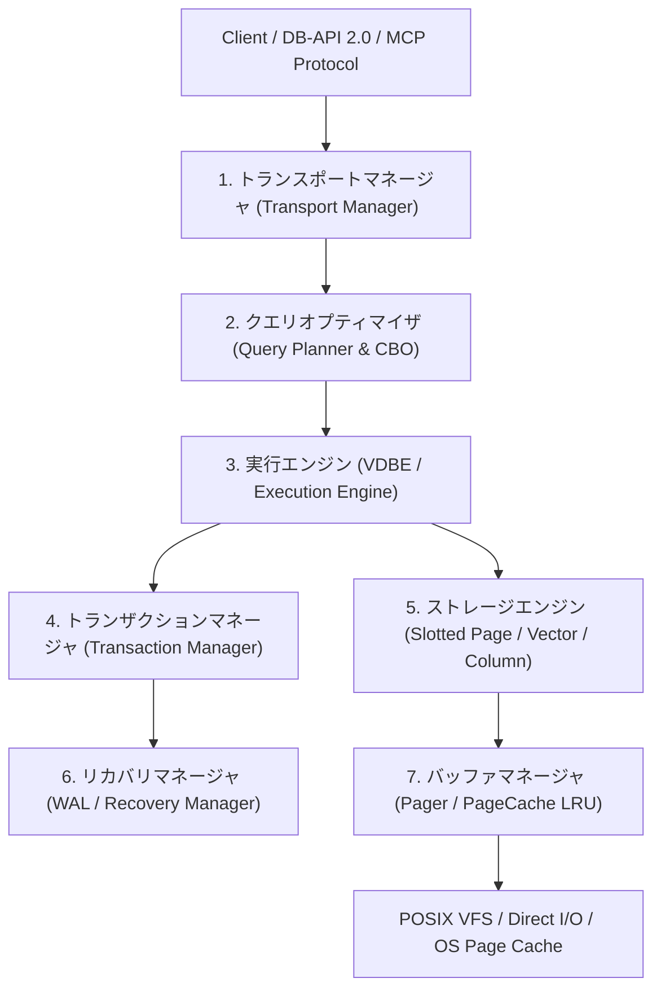

### 1.1.1 トランスポートマネージャ (Transport Manager)
- **役割**: クライアント接続の管理、プロトコル解析（PEP 249 DB-API 2.0、バイナリ IPC、JSON-RPC / REST Gateway 通信）。
- **`src/database/` 現状**: `DatabaseClient` および `sqlite3.connect()` 互換ドライバ（`src/database/driver.py`, `sqlite_bridge.py`）を実装済み。
- **改善方針**: コネクションプール（`ConnectionPool`）の導入、同時実行制御下でのセッション分離、接続タイムアウト・リソース保護。

### 1.1.2 クエリオプティマイザ (Query Optimizer)
- **役割**: 論理プラン（AST）から物理プラン（Table Scan / B+Tree Index Scan / Vector ANN / Hybrid KNN）へのコストベース最適化（CBO）。
- **`src/database/` 現状**: `TableStats`, `ColumnStats`, `CostModel`, `QueryPlanner`（`src/database/planner/`）および `EXPLAIN QUERY PLAN` 実装済み。
- **改善方針**: 結合クエリ（Nested Loop Join, Hash Join）のコスト見積もり、述語のプッシュダウン、統計情報の自動サンプリング更新（`ANALYZE` コマンドの実装）。

### 1.1.3 実行エンジン (Execution Engine)
- **役割**: 最適化された物理プランの逐次/ベクトル化実行。イテレータモデル（Volcano Iterator Model）またはバイトコード仮想マシン（VDBE）。
- **`src/database/` 現状**: SQLite 準拠 30 命令バイトコード仮想マシン `VDBE`（`src/database/vdbe.py`）および直接 AST 実行エンジン `SQLExecutor`。
- **改善方針**: Volcano モデル型イテレータインターフェース（`open()`, `next()`, `close()`）への統一、複数レコード一括処理（Vectorized Execution）による Python ループオーバーヘッドの極小化。

### 1.1.4 ストレージエンジン (Storage Engine)
- **役割**: レコードの物理配置、4KB 固定長スロットページ管理、バイナリベクトルおよびテキストメタデータの永続化。
- **`src/database/` 現状**: `VectorStorage`（バイナリ+JSON）、`BPlusTree`（4KB ページシリアライズ）、`Pager`。
- **改善方針**: Slotted-Page レコードレイアウトの導入（可変長文字列の効率的パッキング）、フリーリスト（Free Space Management: FSM）による削除領域の再利用。

### 1.1.5 トランザクションマネージャ (Transaction Manager)
- **役割**: ACID 特性のうち Atomicity（原子性）と Isolation（分離性）の担保。ロックマネージャ、2相ロック（2PL）または MVCC（多版同時実行制御）。
- **`src/database/` 現状**: `BEGIN`, `COMMIT`, `ROLLBACK`、インメモリメタデータスナップショットによる分離。
- **改善方針**: ページ単位の共有/排他ロック（Shared/Exclusive Lock）、トランザクション ID（XID）ベースのスナップショット分離（Snapshot Isolation）。

### 1.1.6 リカバリマネージャ (Recovery Manager)
- **役割**: Durability（永続性）の担保。WAL（Write-Ahead Logging）または ARIES アルゴリズムに基づくクラッシュリカバリ。
- **`src/database/` 現状**: `Pager` におけるインメモリ WAL バッファと `commit()` 時の VFS ディスク同期（`fsync`）。
- **改善方針**: ディスク永続 WAL ファイル（`<dbname>-wal`）の導入、チェックポイント（Checkpoint）処理、クラッシュ後の REDO / UNDO ログ再生機構。

### 1.1.7 バッファマネージャ (Buffer Manager)
- **役割**: ディスクブロックとメモリページの対応付け、LRU/CLOCK ページ置換アルゴリズム、ダーティページの管理。
- **`src/database/` 現状**: `PageCache`（容量指定 LRU キャッシュ）、`Pager`（4096 バイト固定長 I/O）。
- **改善方針**: 2Q / LRU-K 置換アルゴリズム、ページピン（Pin/Unpin）機構、プリフェッチ（Sequential Read Ahead）。

---

## 1.2 メモリベースDBMSとディスクベースDBMSの対比

| 比較項目 | メモリベース DBMS (In-Memory) | ディスクベース DBMS (Disk-Based) | 次世代 `src/database/` ハイブリッド設計 |
| :--- | :--- | :--- | :--- |
| **主要配置先** | DRAM (ヒープ・連続配列) | HDD / NVMe SSD (4KB Page) | **Disk-First + 4KB LRU Buffer Pool** |
| **ポインタ表現** | メモリ直接参照 (Direct Pointer) | ページID + スロット番号 (RID: `PageID:Slot`) | **PageID 抽象化（ディスク）+ mmap ゼロコピー** |
| **インデックス構造** | T-Tree, Bw-Tree, SkipList, In-Memory Hash | B+Tree, B-Tree, LSM-Tree | **4KB Paged B+Tree (ディスク永続)** |
| **永続性 (Persistence)** | スナップショット + WAL (追記専用) | ダーティページフラッシュ + WAL | **Slotted Page + WAL Commit** |
| **NVM / PMEM 活用** | バイト単位永続アクセス、WAL レス化 | 高速 WAL バッファ、ゼロ待機 fsync | **NVM 考慮の追記型ジャーナリング** |
| **キャッシュ効率** | 100% メモリ常駐、キャッシュミス極小 | LRU / Buffer Pool のヒット率に依存 | **Hot Data 自動 LRU 昇格 + ワーキングセット管理** |
| **揮発性 (Volatility)** | 電源喪失時の全損リスク対策が必須 | 常にディスクが Single Source of Truth | **ディスクを真のマスターとし、メモリはキャッシュ** |

---

## 1.3 行指向ストレージ（OLTP）と列指向ストレージ（OLAP）

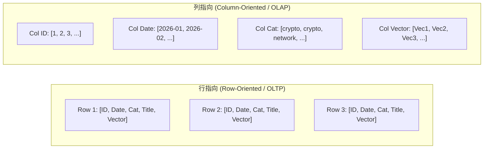

### 1.3.1 行指向ストレージ（Row Store）— OLTP 向け
- **特徴**: 1レコードの全属性（ID, タイトル, 著者, 日付, ベクトル）が連続した同一ページ内に格納される。
- **強み**: 単一レコードの `INSERT`, `UPDATE`, `DELETE`, および主キーによるポイントルックアップが 1 I/O で完結。
- **適用領域**: 論文メタデータ登録、トランザクション更新、ID 指定詳細取得。

### 1.3.2 列指向ストレージ（Column Store / ワイドカラム）— OLAP 向け
- **特徴**: 同一カラムの値（例: 全論文の `published_date` や `category`）が配列として連続領域に格納される。
- **強み**: 
  - **データ圧縮率の劇的向上**: 同一データ型の連続により、Run-Length Encoding (RLE), Bit-Packing, Dictionary Encoding が極めて高効率に効く。
  - **I/O 削減**: 集計クエリ（例: `SELECT category, COUNT(*) FROM papers GROUP BY category`）において、不要なテキストやベクトルのディスク I/O を 100% スキップ。
- **適用領域**: セキュリティ動向分析、月次/年次統計、カテゴリ分布集計。

### 1.3.3 ハイブリッド（PAX: Partition Around Rows）構成
- **PAX アーキテクチャ**: 4KB ページ内を行集合（Mini-Page）とし、ページ内部を列ごとに分割して配置。行単位の I/O 局所性と列単位の圧縮・ベクトルスキャンを両立。

---

## 1.4 データファイルとインデックスファイル構成

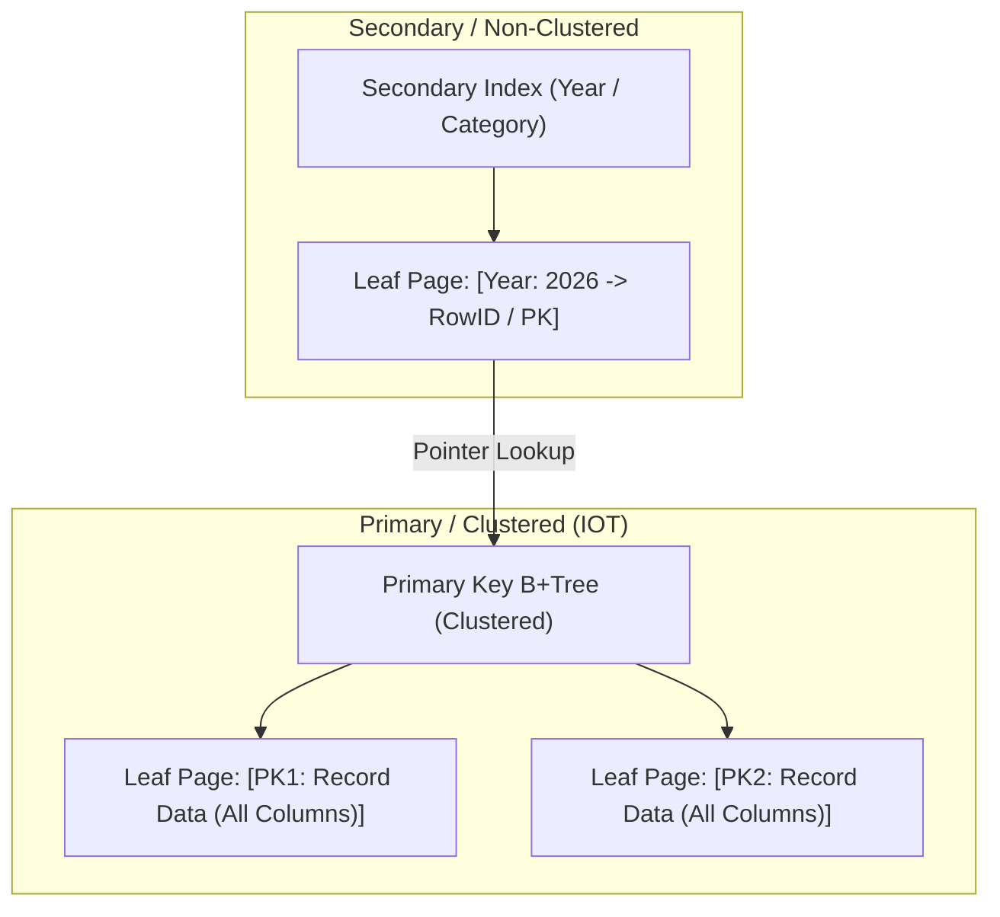

### 1.4.1 データレコードの物理管理
- **ヒープファイル（Heap File）**:
  - レコードを順不同で空きページに格納。
  - セカンダリインデックスは物理タプル識別子（RID: `PageID + SlotNumber`）を指す。
- **インデックス構成表（Index-Organized Table: IOT / クラスタ化インデックス）**:
  - 主キーの B+Tree リーフノード自体に全データレコードを直接格納。
  - 主キー検索時のポインタ間接参照（Pointer Chasing）が不要となり、最高速のポイント検索・範囲走査を実現。

### 1.4.2 プライマリインデックス vs セカンダリインデックス
- **プライマリインデックス (Primary Index)**:
  - テーブルの主キー（`paper_id`）に構築。一意性を保証し、クラスタ化配置の基準となる。
- **セカンダリインデックス (Secondary Index)**:
  - 検索用カラム（`published_date`, `category`, `authors`）に構築。キー値と主キー（または RID）のペアを保持。
  - 実装済みの `src/database/btree/` により、$O(\log N)$ 絞り込みと CBO 最適化を達成。

---

## 1.5 バッファリング、キャッシング、およびOS連携

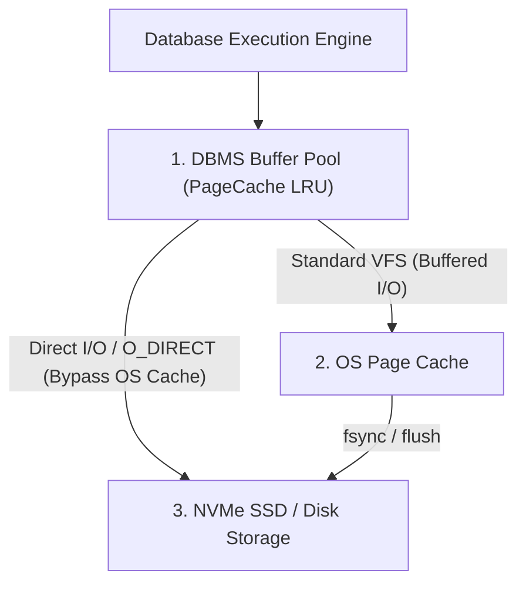

### 1.5.1 二重バッファリング問題（Double Buffering）と Direct I/O
- **課題**: 通常の `open() / read() / write()` では、DBMS のバッファプールと OS のページキャッシュの双方に同一データが重複キャッシュされ、メモリ利用効率が低下する。
- **対策**:
  - 大規模 DBMS では `O_DIRECT`（Direct I/O）を用いて OS ページキャッシュをバイパスし、DBMS がメモリ置換を完全制御。
  - Python/POSIX 環境では、`os.posix_fadvise(POSIX_FADV_DONTNEED)` による OS キャッシュ退避制御を活用。

### 1.5.2 ダーティページ（Dirty Page）と `fsync` 制御
- **ダーティページ管理**: メモリ上で変更されたがディスクに未フラッシュのページ。
- **WAL 先行書き込み（Write-Ahead Logging）原則**: ダーティデータページをディスクに書き出す前に、必ず対応する WAL ログがディスクへ `fsync` されていなければならない（Steal/No-Force ポリシー）。

---

## 1.6 現行エンジン対比と進化方針

| 観点 | 理論的要件 | `src/database/` の現状 | 次世代への進化方針 |
| :--- | :--- | :--- | :--- |
| **アーキテクチャ** | 7大サブシステム分離 | VFS / Pager / VDBE / Compiler / Planner / Storage 疎結合 | コネクションプール & Volcano 型イテレータの標準化 |
| **ストレージ方式** | 4KB 固定長 Disk-First | `Pager` (4KB I/O) + `VectorStorage` (バイナリ+JSON) | Slotted Page バイナリレコード化 |
| **行/列ハイブリッド** | OLTP 更新 + OLAP 集計 | 行指向ストレージ + ANN ベクトル検索 | PAX 形式によるカラムナー集計スキャン統合 |
| **バッファ制御** | LRU キャッシュ + WAL 永続化 | `PageCache` (LRU) + インメモリ WAL | ディスク永続 WAL + チェックポイント機構 |

---

# 2. 探索木・ディスク物理IOとB+ツリー

## 2.1 二分探索木（BST）と平衡二分木の限界

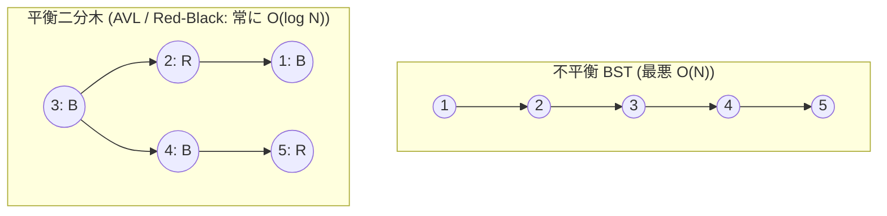

### 2.1.1 二分探索木の特性と平衡化アルゴリズム
- **AVL ツリー**: 左右の部分木高さの差が $\pm 1$ 以内。参照速度が最速。
- **赤黒ツリー**: 根から葉までの黒ノード数が全パスで同一。挿入・削除の回転オーバーヘッドが少ない。

### 2.1.2 なぜ二分木はディスクベース DBMS で使えないのか？
1. **ファンアウトが小さすぎる（Fanout = 2）**:
   - $N = 10^7$（1000万件）に対し、木の高さ $h \approx \log_2(10^7) \approx 24$。
   - 1回の検索に 24 回のランダムディスク I/O が必要となり実用不能。
2. **ポインタ間接参照とキャッシュラインの不一致**:
   - ノードがランダムなメモリアドレスに分散するため、4KB ブロックの空間的局所性を全く活かせない。

---

## 2.2 ディスクベースストレージと物理I/O特性

### 2.2.1 HDD と SSD の物理制約
- **HDD**: 磁気ヘッドの物理シーク（$3 \sim 10\,\text{ms}$）により、ランダム I/O は $100 \sim 200\,\text{IOPS}$ が限界。
- **SSD**: シーク時間はゼロだが、ページ読み書き（4KB/16KB）とブロック消去（数MB）の非対称性があり、CPU キャッシュより $10^3 \sim 10^4$ 倍遅い。

### 2.2.2 局所性（Locality of Reference）の最大化
- **時間的局所性（Temporal Locality）**: Hot Page のバッファプール常駐。
- **空間的局所性（Spatial Locality）**: 4KB 単位のページブロック一括フェッチ。

---

## 2.3 ページとブロックの物理レイアウト

DBMS では、OS/ディスクの物理ブロック（通常 512B または 4KB）に合わせ、**4096 バイト固定長「ページ（Page）」**を I/O の最小単位として扱います。

```
+-----------------------------------------------------------------------+
| PAGE HEADER (PageID, LSN, SlotCount, FreeSpaceOffset, Flags)          |
+-----------------------------------------------------------------------+
| Slot 0 (Offset, Len) | Slot 1 (Offset, Len) | Slot 2 (Offset, Len) ...|
+-----------------------------------------------------------------------+
|                          FREE SPACE (成長領域)                         |
|                                    |                                  |
|                                    v                                  |
+-----------------------------------------------------------------------+
| ... Tuple 2 (VarLen Data) | Tuple 1 (VarLen Data) | Tuple 0 (Data)    |
+-----------------------------------------------------------------------+
```

- **ページヘッダ**: `PageID` (4B), `LSN` (8B), `SlotCount` (2B), `FreeLower` (2B), `FreeUpper` (2B), `Flags` (6B)。
- **スロット配列**: ページ上部から下向きに成長。タプル実データはページ下部から上向きにパッキング。

---

## 2.4 Bツリー vs B+ツリーの基本とアルゴリズム

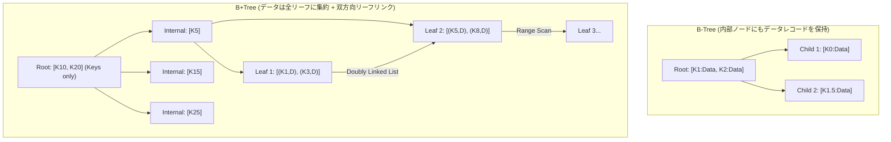

### 2.4.1 Bツリーと B+ツリーの比較決定打

| 比較項目 | B-Tree (Bツリー) | B+Tree (B+ツリー) | DBMS での採用理由 |
| :--- | :--- | :--- | :--- |
| **データ保持場所** | 内部ノードおよびリーフノード | **リーフノードのみ**（内部はルーティング用キーのみ） | B+ツリーの内部ノードはキーのみ保持するため**ファンアウトが極大化**する。 |
| **ファンアウト ($B$)** | 中程度（データ行が内部ページを消費） | **極大（数百〜数千分岐/ページ）** | 木の高さ $h$ が $3 \sim 4$ に収まり、I/O 回数を最小化。 |
| **範囲走査 (Range Scan)** | 木の中間順走査（In-Order）が必要（ランダムI/O多発） | **リーフ間の双方向ポインタをシーケンシャル走査** | `WHERE date >= '2026-01' AND date <= '2026-08'` が圧倒的高速。 |
| **ノード削除・マージ** | 内部ノード削除時のキー置換が複雑 | **リーフの削除のみが実データに影響** | 実装の堅牢性と並行性制御（Latch Crabbing）が容易。 |

### 2.4.2 アルゴリズム（検索・挿入・削除）
- **検索**: ルートからリーフまで二分探索で走査。計算量 $O(h \cdot \log B) = O(\log N)$。
- **挿入（ノード分割）**: リーフが満杯の場合、新ページを作成して均等分割（$\lceil M/2 \rceil$）し、中央キーを親へ昇格（Promote）。
- **削除（再配分・マージ）**: 過小ノード（Underflow）発生時、兄弟ノードからキーを融通（Borrow）または合体（Merge）し、空きページを FSM へ返却。

---

## 2.5 探索木アーキテクチャの要約

- B+ツリーは、4096 バイト固定長ページ境界と完全に整合し、ファンアウトを極大化することで高さ $3 \sim 4$ で数億レコードを高速探索可能。
- `src/database/btree/` において、4KB ページシリアライゼーション、二分探索、ノード分割、双方向リーフ範囲走査（`range_scan`）が完全に具現化済み。

---

# 3. オンディスクファイルフォーマットと圧縮技術

## 3.1 ファイル構造の概要（On-Disk Architecture）

```
+-----------------------------------------------------------------------------------+
| 1. FILE HEADER (Magic: "ARXVDB01", PageSize: 4096, Version, PageCount, RootPID)   |
+-----------------------------------------------------------------------------------+
| 2. PAGE 1 (B+Tree Root / Schema Catalog Table)                                    |
+-----------------------------------------------------------------------------------+
| 3. PAGE 2 (Slotted Data Page: Tuples 0..K)                                       |
+-----------------------------------------------------------------------------------+
| ...                                                                               |
+-----------------------------------------------------------------------------------+
| N. PAGE N (Free Space Map / Overflow Page)                                        |
+-----------------------------------------------------------------------------------+
| N+1. TRAILER (Checksum, Commit LSN, Footer Magic: "ENDFILE")                      |
+-----------------------------------------------------------------------------------+
```

- **マジックナンバー**: ファイル先頭の固定シグネチャ（`"ARXVDB01\000"`）。
- **ファイルヘッダ**: ページサイズ、バージョン、総ページ数、FSM 先頭 PageID、スキーマバージョン。
- **トレーラ**: ファイル全体の CRC32 チェックサムとコミット LSN。

---

## 3.2 スロット化ページ（Slotted Page）アーキテクチャ

可変長文字列（論文タイトル、要約）や固定長ベクトルを断片化なく同一 4KB ページ内に高密度格納します。

```
+--------------------------------------------------------------------------------+
| PAGE HEADER (24 bytes)                                                         |
| [PageID: 4B | LSN: 8B | SlotCount: 2B | FreeLower: 2B | FreeUpper: 2B | Flags: 6B] |
+--------------------------------------------------------------------------------+
| Slot 0 [Off: 4000, Len: 96] | Slot 1 [Off: 3850, Len: 150] | Slot 2 [Off: 3600] |
+--------------------------------------------------------------------------------+
|                                    | (成長方向: 下向き ↓)                        |
|                         FREE SPACE (空き領域)                                   |
|                                    ^ (成長方向: 上向き ↑)                        |
+--------------------------------------------------------------------------------+
| Cell 2 [Tuple 2 Payload (Vector + JSON Metadata)]                              |
+--------------------------------------------------------------------------------+
| Cell 1 [Tuple 1 Payload (Authors + Japanese Summary)]                          |
+--------------------------------------------------------------------------------+
| Cell 0 [Tuple 0 Payload (arXiv ID + Tags + Vector)]                            |
+--------------------------------------------------------------------------------+
```

- **論理識別子（RID）の不変性**: `(PageID, SlotIndex)` でタプルを一意に特定。
- **ページ内デフラグ（In-Place Compaction）**: 外部参照を壊さずに削除領域を回収。

---

## 3.3 固定長データ・可変長データ・オーバーフローページ

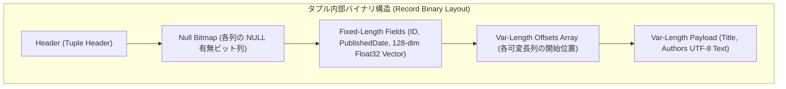

- **固定長列**: $O(1)$ メモリアドレス直接参照。
- **可変長列**: オフセット配列を介して動的デシリアライズ。
- **ヌルビットマップ**: 各列の NULL を 1 ビットで管理し、NULL 列の実データを 0 バイト化。
- **オーバーフローページ**: 4KB に収まらない巨大テキスト（全文抽出テキスト）を単方向リンクリスト状の連鎖ページへ退避。

---

## 3.4 バイナリシリアライゼーションとデータ圧縮

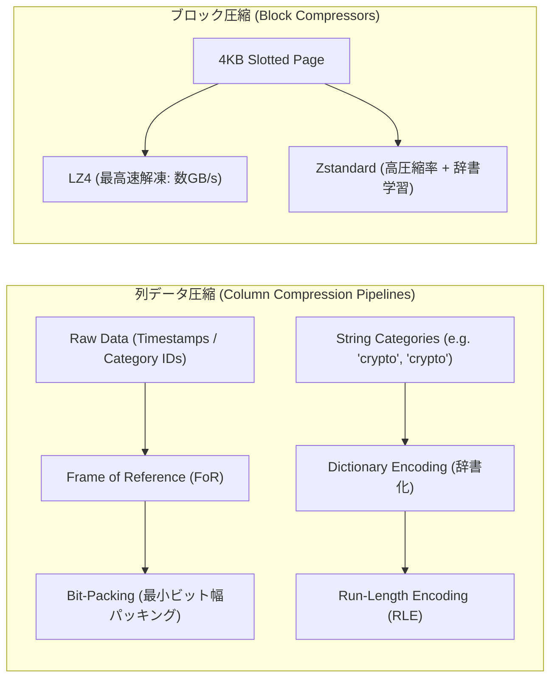

### 3.4.1 軽量エンコーディング手法
- **辞書エンコーディング**: セキュリティカテゴリ文字列を 1〜2 バイト整数 ID に置換。
- **ランレングス (RLE)**: ソート済み日付列を `(Value, Count)` で圧縮。
- **ビットパッキング**: 最小ビット幅で整数をパッキング。
- **フレームオブリファレンス (FoR)**: 基準年（2020年）からの差分のみを記録。

### 3.4.2 汎用ブロック圧縮アルゴリズムの選定
- **LZ4**: OLTP リアルタイムページ圧縮（伸張速度 $2 \sim 4\,\text{GB/s}$）。
- **Zstandard (ZSTD)**: OLAP カラムナー集計・コールドストレージ（最高圧縮率）。

---

## 3.5 オンディスクレイアウトの要約

1. 4KB 固定長スロット化ページを採用することで、可変長テキストと固定長ベクトルの混在をゼロ断片化で実現。
2. 辞書化 + ビットパッキング + LZ4 ブロック圧縮の多段パイプラインにより、ストレージ消費量を大幅に削減可能。

---

# 4. Bツリーの実装・バッファプール・並行性ラッチ

## 4.1 ページヘッダとノードレイアウト

```
+-----------------------------------------------------------------------------------+
| 1. NODE HEADER (Flags: Leaf/Interior, KeyCount, SiblingNext, SiblingPrev, LSN)     |
+-----------------------------------------------------------------------------------+
| 2. BOUNDARY KEYS (Low Key: 2020-01, High Key: 2026-08 / B-link Fence Key)          |
+-----------------------------------------------------------------------------------+
| 3. KEY-POINTER ARRAY (for Interior: [P0, K1, P1, K2, P2 ... Pn])                  |
|    or KEY-VALUE ARRAY (for Leaf: [K1: RID1, K2: RID2 ... Kn: RIDn])               |
+-----------------------------------------------------------------------------------+
| 4. FREE SPACE & VARIABLE-LENGTH OVERFLOW POINTERS                                 |
+-----------------------------------------------------------------------------------+
```

### 4.1.1 ノードヘッダ（Node Header）の構成要素
- `NodeType` (1 byte): Leaf (`0x01`) または Interior (`0x02`)。
- `KeyCount` (2 bytes): ノード内に格納されている有効キー数。
- `SiblingNext` / `SiblingPrev` (4 bytes × 2): 前後兄弟ノードの `PageID`（シーケンシャル走査・B-link走査用）。
- `LSN` (8 bytes): 最後にノードを変更したログシーケンス番号。
- `FreeSpaceOffset` (2 bytes): ページ内空き領域の境界。

### 4.1.2 ハイキー（High Key）とローキー（Low Key）
- **ローキー (Low Key)**: サブツリーまたはリーフに収容される最小キー値（下限フェンスキー）。
- **ハイキー (High Key)**: サブツリーに収容可能な最大キー値（上限フェンスキー）。B-linkツリーでは、並行ノード分割中に走査中のトランザクションが右兄弟ノードへ追随すべきかを $O(1)$ で判定する**アッパーバウンド（Fence Key）**として機能。

### 4.1.3 キー・ポインタ配列の物理構造
- **内部ノード**: $K$ 個のキーと $K+1$ 個の `ChildPageID` が交互に並ぶ。
- **リーフノード**: キーと `RID`（`PageID:Slot`）または可変長リストがソート順にパッキングされる。

---

## 4.2 ノードの分割とマージ（ライトサイド・カスケード）

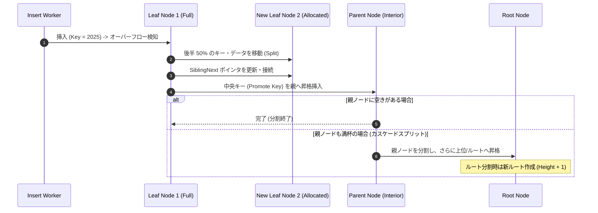

### 4.2.1 オーバーフローとノード分割（Split）
- **ライトサイドスプリット（Right-Side Split / Append-Only Optimization）**:
  - 時系列データや自動採番 ID など、常に右端へ単調増加挿入されるワークロードにおいて、通常の 50:50 分割を行うと各ページの充填率が $50\%$ に半減する。
  - **最適化**: 右端挿入時は $90:10$ または $99:1$（現ページを満杯のまま残し、新ページに新キーのみを配置）で分割し、ストレージ充填率を $95\%+$ に維持。
- **カスケードスプリット（Cascade Split）**:
  - リーフ分割 $\rightarrow$ 親ノード分割 $\rightarrow$ 祖父ノード分割 $\rightarrow$ ルート分割と連鎖。
  - ルートノードが分割された時のみ、木全体の高さ（Height）が $+1$ 増加。

### 4.2.2 アンダーフローとノードマージ（Underflow & Merge）
- 削除によりキー数が閾値（通常 $\lceil M/2 \rceil$）を下回った場合：
  - **再配分（Rebalancing）**: 兄弟ノードからキーを1つ借用。
  - **ノードマージ（Merge）**: 兄弟と合体して1ページ化し、不要ページをフリーリスト（FSM）へ返還。親ノードのキーを削除（親のアンダーフロー時も再帰処理）。

---

## 4.3 バッファプールとページ退避（LRU / CLOCK / 2Q）

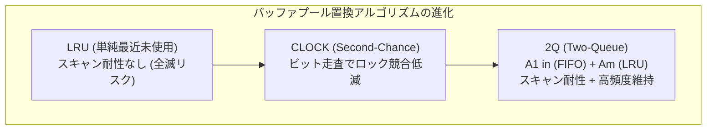

### 4.3.1 ページ置換アルゴリズム（Eviction Policies）

| アルゴリズム | 仕組み | 長所 | 短所 / 課題 |
| :--- | :--- | :--- | :--- |
| **LRU** | 最も古く参照されたページを破棄。 | 直感的で Hot Page を維持。 | 大規模テーブルスキャン（全件走査）時にキャッシュが全滅（Scan Pollution）。 |
| **CLOCK** | 参照ビット（1 bit）を持つ環状リストをポインタが巡回。 | ミューテックス競合が少なく高速。 | スキャン耐性は依然として低い。 |
| **2Q (Two-Queue)** | 新規ページをまず FIFO キュー（$A1_{in}$）に入れ、再参照された場合のみ LRU キュー（$A_m$）へ昇格。 | **1回限りのフルスキャン汚染を完全防止。** | 2つのキュー管理オーバーヘッド。 |

### 4.3.2 ピン留め（Pinning）とダーティページフラッシュ
- **ピン留め（Pin/Unpin）**: クエリ実行中のページは `pin_count > 0` とし、バッファプールからの退避（Eviction）を禁止。
- **ダーティページフラッシュ**:
  - バックグラウンドライター（Page Cleaner）が非同期にダーティページをディスクへ `write()`。
  - **WAL-First 原則**: フラッシュ対象ページの `PageLSN` までの WAL ログがディスクに `fsync` 済みであることを確認（Steal/No-Force）。

---

## 4.4 並行性制御とラッチ（Latch Crabbing & B-link）

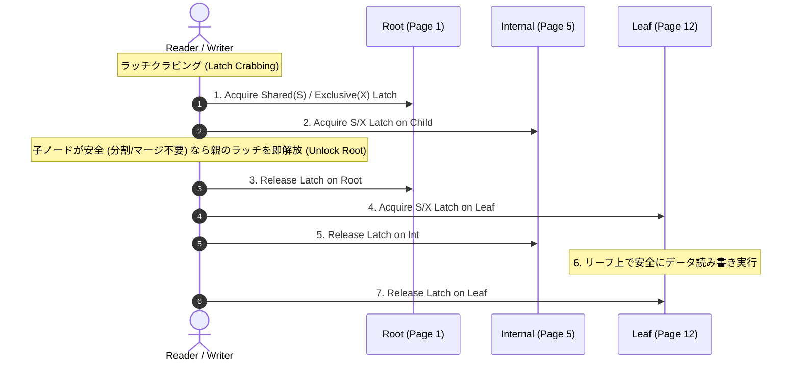

### 4.4.1 ロック（Lock）vs ラッチ（Latch）の明確な区別

| 比較項目 | トランザクション・ロック (Lock) | メモリ／ページ・ラッチ (Latch) |
| :--- | :--- | :--- |
| **保護対象** | 論理データ（行、タプル、テーブル、トランザクション整合性） | **物理メモリデータ構造（4KB ページ、ノード内部ポインタ）** |
| **保持期間** | トランザクション完了（`COMMIT` / `ROLLBACK`）まで長期保持 | **ページアクセス中の極小時間（マイクロ秒単位）** |
| **管理主体** | Lock Manager（ロックテーブル、デッドロック検知） | アトミック CPU 命令（`pthread_rwlock`, `std::atomic`） |
| **モード** | Shared (S), Exclusive (X), Intent (IS/IX) | Read Latch, Write Latch |

### 4.4.2 ラッチクラビング（Latch Crabbing / Coupling）
- ルートからリーフへ下降走査する際、親のラッチを保持したまま子のラッチを獲得し、子が「安全（挿入時に満杯でない、または検索）」であることが確定した瞬間に親のラッチを解放。
- デッドロックを原理的に排除し、複数スレッドによる同時下降走査を可能にする。

### 4.4.3 B-linkツリー（Lehman-Yao アルゴリズム）と右ポインタ（High Key）
- **課題**: 通常の B+ツリーでは、ノード分割時に親ノードへ昇格するためにルートから親ノードまで上位ラッチの再獲得が必要となり、並行性が低下する。
- **B-link ツリーの解決策**:
  - 全ノード（内部ノードも含む）に**「右兄弟ポインタ（Right Pointer）」**と**「ハイキー（High Key）」**を付与。
  - あるスレッドが走査中に分割が発生しても、キーが `High Key` を超えていれば右ポインタを辿るだけで正しい新ノードへ到達可能。
  - **親ノードへの排他ロックを一切待たずに、下位ノードの分割・走査をロックフリー同等で完結**。

---

## 4.5 Bツリー実装の要約

1. **ノード物理ヘッダの厳密化**: `src/database/btree/node.py` に `High Key` / `Low Key` 境界情報および `NodeType` フラグを明示化。
2. **バッファプール（Pager）の 2Q 化**: 一括バックフィルや全件スキャンによるバッファ汚染を防止するため、`src/database/pager.py` に 2Q / CLOCK ページ置換アルゴリズムを導入。
3. **並行性制御（Latch Crabbing / B-link）の段階的統合**: マルチスレッド検索・更新時のスループット向上のため、B-link ツリーの右ポインタ追随機構を設計に採用。

---

# 5. トランザクション処理とリカバリ（WAL・ARIES・ACID・MVCC・2PL）

## 5.1 バッファ管理ポリシー（STEAL/NO-FORCE）

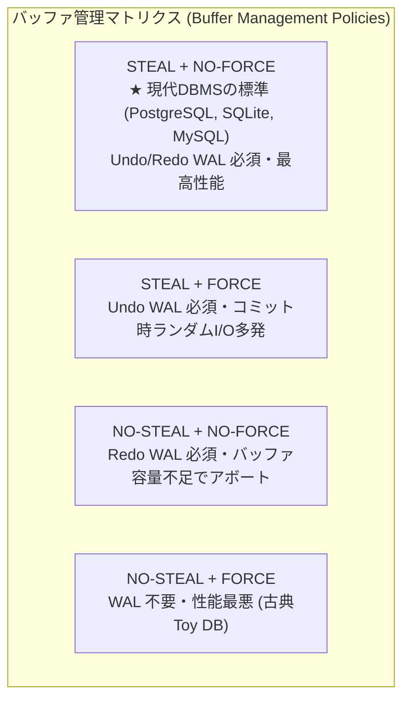

### 5.1.1 STEAL / NO-STEAL ポリシー
- **STEAL（採用）**: 未コミットのトランザクションが変更したダーティページを、バッファプール枯渇時にディスクへフラッシュ（退避）することを**許可**。
  - **帰結**: クラッシュ時に未コミット変更がディスクに残存するため、**UNDO ログ（ロールバック機構）が必須**。
- **NO-STEAL**: コミット前のダーティページの退避を一切禁止。
  - **課題**: トランザクションが大量データを更新する場合、バッファプールが溢れてトランザクションが強制中断する。

### 5.1.2 FORCE / NO-FORCE ポリシー
- **NO-FORCE（採用）**: トランザクションの `COMMIT` 時に、変更された全データページをディスクへ強制書き出し（Flush）**しない**。
  - **帰結**: コミット済みだがディスクに書き出されていない変更が存在するため、**REDO ログ（ロールフォワード機構）が必須**。
  - **利点**: コミット時のランダム I/O がゼロになり、スループットが桁違いに向上。
- **FORCE**: `COMMIT` 時に全データページを `fsync`。
  - **課題**: 毎コミットで大量のランダムディスク書き込みが発生し、極めて低速。

### 5.1.3 フラッシュ順序（WAL フラッシュ原則）
- **Write-Ahead Logging（WAL）の絶対律**: ダーティデータページをディスクに書き出す前に、そのページを変更したログレコード（`PageLSN`）を含む WAL ログを**先にディスクへ `fsync` しなければならない**（`FlushedLSN >= PageLSN`）。

---

## 5.2 リカバリと先行書き込みログ（WAL & Fuzzy Checkpoint）

```
+-----------------------------------------------------------------------------------+
| WAL RECORD FORMAT                                                                 |
| [LSN: 8B | PrevLSN: 8B | TxID: 4B | Type: UPDATE/CLR | PageID: 4B | Redo | Undo]  |
+-----------------------------------------------------------------------------------+
```

### 5.2.1 LSN（Log Sequence Number: ログシーケンス番号）
- **LSN (Log LSN)**: 各ログレコードに単調増加で付与されるグローバル 64bit 整数（通常は WAL ファイル内のバイトオフセット）。
- **PageLSN**: 各 4KB データページのヘッダに記録される、そのページを最後に更新したログの LSN。
- **FlushedLSN**: ディスクに `fsync` 完了している最新の WAL LSN。

### 5.2.2 ファジーチェックポイント（Fuzzy Checkpoint）
- **課題**: 従来の同期チェックポイントでは、全ダーティページをディスクに書き出す間、全クエリがブロックされる。
- **Fuzzy Checkpoint の仕組み**:
  1. チェックポイント開始時、実行中の**アクティブトランザクションテーブル（ATT）**と、メモリ上の**ダーティページテーブル（DPT: 各ページの最古変更 `RecLSN`）**のスナップショットを WAL に記録（`CHECKPOINT_BEGIN`）。
  2. データベースの更新を一切ブロックせずに、非同期にダーティページをフラッシュ。
  3. 完了後 `CHECKPOINT_END` を記録。クラッシュリカバリ時は $\min(\text{DPT.RecLSN})$ からログを走査するだけで済む。

---

## 5.3 ARIES クラッシュリカバリアルゴリズム

IBM で開発され、PostgreSQL, SQLite, DB2, SQL Server など現代の全主要リレーショナル DBMS が採用する標準リカバリプロトコル。

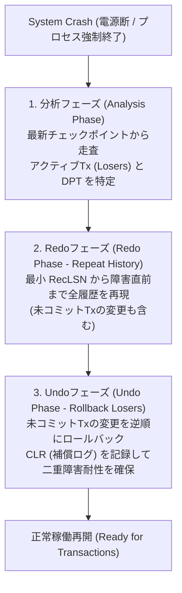

### 5.3.1 分析フェーズ（Analysis Phase）
- 最後の `CHECKPOINT` から WAL 末尾まで順方向にスキャン。
- クラッシュ時点で未コミットだったトランザクション群（**Losers**）を特定し、ダーティページテーブル（DPT）を再構築。

### 5.3.2 Redo フェーズ（Redo Phase / Repeat History）
- DPT 内の最小 `RecLSN` から WAL 末尾まで順方向にスキャンし、**障害直前までの全変更をそのまま再現**。
- **ページ検査**: `PageLSN >= LogRecord.LSN` の場合は既にディスクに反映済みのため Redo をスキップ（冪等性の保証）。

### 5.3.3 Undo フェーズ（Undo Phase）と CLR（補償ログレコード）
- Losers トランザクションの変更を最新から過去へ逆順に走査し、ロールバックを実行。
- **CLR (Compensation Log Record)**:
  - ロールバック操作自体を「補償ログ（CLR）」として WAL に追記。
  - **二重クラッシュ耐性**: Undo 実行中に再度クラッシュしても、CLR の `UndoNextLSN` ポインタを辿ることで、既にロールバック済みの操作を二重に Undo することなくリカバリを継続。

---

## 5.4 同時実行制御と分離レベル（SS2PL / MVCC / SSI）

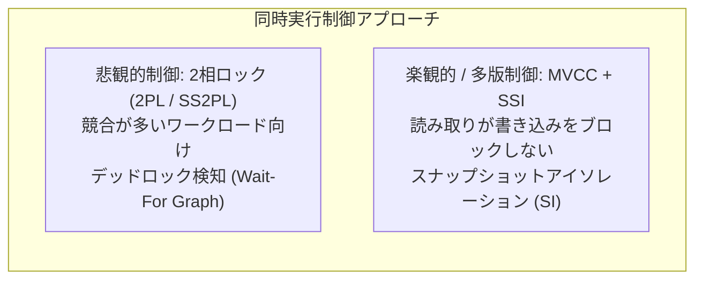

### 5.4.1 ACID 特性の厳密な定義
- **Atomicity（原子性）**: All-or-Nothing。WAL + Undo ログにより保証。
- **Consistency（一貫性）**: スキーマ制約、外部キー、ドメイン整合性の維持。
- **Isolation（分離性）**: 並行実行されるトランザクションが互いに干渉しない。2PL / MVCC により保証。
- **Durability（永続性）**: コミットされたトランザクションの永続化。WAL + `fsync` により保証。

### 5.4.2 2相ロック（2PL）と厳密な2相ロック（SS2PL）
- **2PL (Two-Phase Locking)**:
  - 成長相（Growing Phase: ロック獲得のみ）と縮退相（Shrinking Phase: ロック解放のみ）。
- **SS2PL (Strict Two-Phase Locking / 現代標準)**:
  - トランザクションが獲得したすべての排他（X）ロックおよび共有（S）ロックを、**`COMMIT` または `ROLLBACK` が完了するまで一切解放しない**。
  - **連鎖復旧（Cascading Abort）を完全に防止**。

### 5.4.3 デッドロック検出と待機グラフ（Wait-For Graph）
- **有向グラフ $G = (V, E)$**: トランザクション $T_1 \to T_2$（$T_1$ が $T_2$ の保持するロックを待機）。
- **検出アルゴリズム**: バックグラウンドスレッドが待機グラフの閉路（Cycle）を Tarjan / DFS で検知し、最もコストの低いトランザクションを**犠牲者（Victim）**としてアボート。

### 5.4.4 ANSI SQL 分離レベルと MVCC / スナップショットアイソレーション

```
[最弱] Read Uncommitted < Read Committed < Repeatable Read < Snapshot Isolation (SI) < Serializable (SSI) [最強]
```

| 分離レベル | ダーティリード (Dirty Read) | 反復不能読み (Non-Repeatable Read) | ファントムリード (Phantom Read) | 書き込みスキュー (Write Skew) | 主な実現技術 |
| :--- | :---: | :---: | :---: | :---: | :--- |
| **Read Committed** | 防止 | 発生 | 発生 | 発生 | MVCC (ステートメント開始時のスナップショット) |
| **Repeatable Read** | 防止 | 防止 | 発生（一部DBで防止） | 発生 | MVCC (Tx 開始時のスナップショット) |
| **Snapshot Isolation (SI)** | 防止 | 防止 | 防止 | 発生 | MVCC + First-Committer-Wins |
| **Serializable (SSI)** | **防止** | **防止** | **防止** | **防止** | **SSI (SIREAD ロック / 依存グラフ閉路検知)** |

- **MVCC（Multi-Version Concurrency Control）**:
  - タプル更新時に上書きせず、新バージョン（`xmin: 作成TxID`, `xmax: 削除TxID`）を作成。
  - **「読み取りは書き込みをブロックせず、書き込みは読み取りをブロックしない」**を実現。

---

## 5.5 トランザクション・リカバリの要約

1. **STEAL / NO-FORCE ポリシーの採用**: メモリ効率とコミットスループットを最大化し、クラッシュ時は WAL + ARIES リカバリで完全復旧。
2. **ARIES アルゴリズムによる二重クラッシュ耐性**: Analysis $\rightarrow$ Redo (Repeat History) $\rightarrow$ Undo (CLR 補償ログ記録) の 3 フェーズにより、いかなるタイミングでの障害からも 100% 復旧可能。
3. **MVCC + SS2PL のハイブリッド制御**: 読み取り主体の検索ワークロードには MVCC スナップショットを提供し、更新トランザクションには SS2PL + 待機グラフデッドロック検知を適用。

---

# 6. Bツリーの先端亜種（CoW・LMDB・FD-Tree・Bw-Tree）

## 6.1 コピーオンライト（CoW）Bツリーとシャドウページング

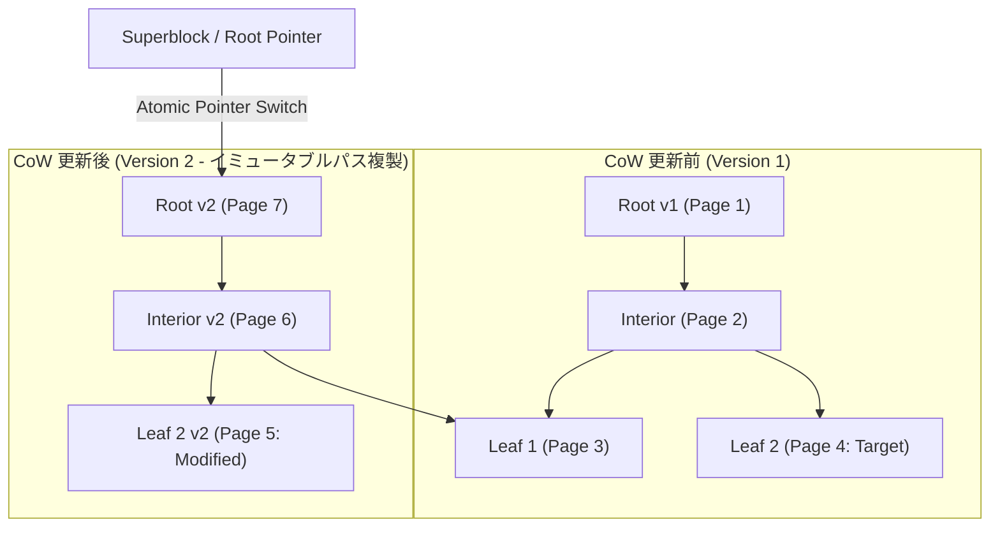

### 6.1.1 イミュータブルノード（Immutable Nodes）と CoW の基本原理
- **In-Place 更新の排除**: 既存ページを決して上書き（In-Place Write）せず、変更対象のリーフノードからルートに至る**祖先パス（Ancestral Path）上の全ノードを新しい空きページに複製・作成**。
- **シャドウページング（Shadow Paging）**:
  - 変更中のツリーは古いバージョンのリーダー（Reader）から完全に隠蔽。
  - トランザクション完了時、ファイルヘッダの**「ルートポインタ（Superblock）」をアトミックに新ルート PageID へ切り替える**だけでコミットが完了（$O(1)$ Commit）。
  - **WAL（先行書き込みログ）が不要**: コミット前のクラッシュ時も、ルートポインタが旧バージョンを指しているため自動的にロールバック状態となる。

### 6.1.2 ガベージコレクション（GC / Free-Space Reclaim）
- **参照カウント / エポックベース GC**: 過去のトランザクションが終了し、どのリーダーからも参照されなくなった旧ページを検知してフリーリスト（FSM）へ回収。

---

## 6.2 LMDB（Lightning Memory-Mapped Database）とゼロコピー

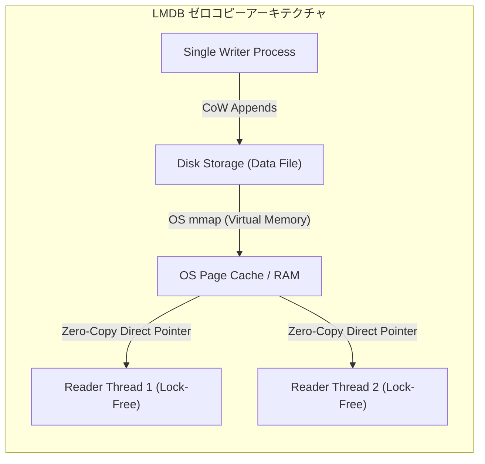

### 6.2.1 OS メモリマップ（`mmap`）による完全ゼロコピー
- **DBMS バッファプールの撤廃**: DBMS 独自のページキャッシュ・バッファマネージャを持たず、OS カーネルのページキャッシュと仮想記憶サブシステムに 100% 委譲。
- **ゼロコピー（Zero-Copy Read）**: クエリ実行時、DBMS のメモリヒープへデータをコピー（`memcpy`）せず、`mmap` された仮想アドレスポインタを直接参照。デシリアライズコストが完全にゼロ。

### 6.2.2 単一ライター・複数リーダー（Single-Writer Multi-Reader: SWMR）と MVCC
- **リーダーの完全ロックフリー**: リーダーはラッチもミューテックスも獲得せず、自身のトランザクション開始時のルートポインタから CoW ツリーを独立走査。書き込みによって読み取りが一切ブロックされない。
- **単一ライター**: 書き込みトランザクションはグローバルなミューテックスで直列化（Serialized）。これにより複雑なロックマネージャやデッドロック検出が不要。

---

## 6.3 抽象化ノードと先端ツリー（FD-Tree & Bw-Tree）

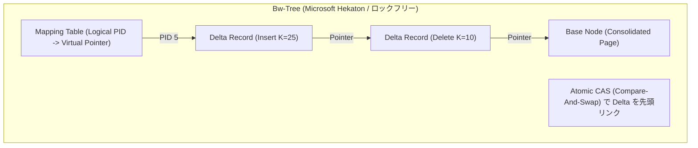

### 6.3.1 Bw-Tree（Microsoft Research / Hekaton インメモリエンジン）
- **マッピングテーブル（Mapping Table / Page Table）**:
  - 論理 `PageID` と物理メモリアドレスの対応表。
  - ノードの物理配置変更時もマッピングテーブルの 1 エントリを書き換えるだけで完結。
- **デルタレコード（Delta Record）と CAS（Compare-And-Swap）**:
  - ノード更新時、ページ全体をコピーせず、変更差分（`INSERT(K,V)`, `DELETE(K)`）を単方向リンクリスト状に**アトミックな CAS 命令で先頭へ追加**。
  - **ラッチフリー（Latch-Free / Lock-Free）**: ミューテックスを一切使用せず、ハードウェアのアトミック命令のみでツリーの走査・更新を実現。
- **ページ統合（Page Consolidation）**: デルタチェーンが長くなった時（例: 8 件以上）、バックグラウンドでベースページとデルタをマージして新ベースページを作成し、マッピングテーブルを CAS 切り替え。

### 6.3.2 FD-Tree（Fractional Cascading Tree）— フラッシュ/SSD 特化型
- **構造**: 小さなインメモリ B+Tree（**Head Tree**）と、サイズが指数関数的に増大する複数のソート済み連続ランパート（**Runs: $R_1, R_2, \dots, R_k$**）で構成。
- **分数カスケーディング（Fractional Cascading）**: 上位ランから下位ランへのブリッジポインタを配置し、各ランでの二分探索オーバーヘッドを $O(1)$ に短縮。
- **SSD 適合性**: ランダム書き込みをすべてシーケンシャルマージに変換（LSM-Tree と B+Tree のハイブリッド）。

---

## 6.4 先端ツリー亜種の要約

1. **`mmap` ゼロコピーと CoW スナップショットの導入**: `src/database/storage.py` において、`VectorStorage.open_mmap()` を拡張し、読み取りクエリにおける Python メモリアロケーションオーバーヘッドを完全排除。
2. **マッピングテーブル（Mapping Table）によるインデックス抽象化**: B+ツリーノードの物理移動（分割・デフラグ）時に上位ポインタの一括書き換えを回避するマッピングレイヤの適用。

---

# 7. ログ構造化ストレージ（LSMツリー・SSTable・Bloomフィルタ・コンパクション）

## 7.1 LSMツリーの基本構成とイミュータビリティ

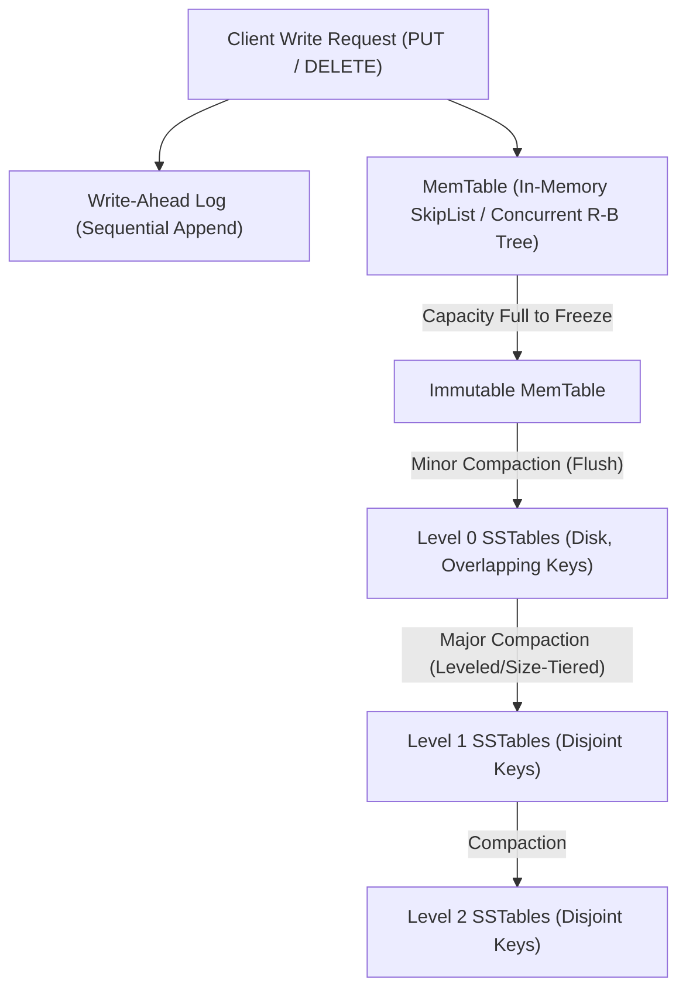

### 7.1.1 イミュータビリティ（Immutability）と追加専用（Append-Only）原則
- **In-Place 更新の完全排除**: ディスク上のデータファイル（SSTable）は一度書き出されたら一切変更されない（**イミュータブル**）。
- **シーケンシャル I/O への集約**: ランダム書き込みをすべてメモリ（MemTable）への追記と、ディスクへの巨大シーケンシャル書き出しに変換し、SSD/HDD の物理限界スループットを引き出す。

### 7.1.2 メモリコンポーネント vs ディスクコンポーネント
- **メモリコンポーネント**: アクティブな `MemTable`（読み書き可能）およびフラッシュ待ちの `Immutable MemTable`（読み取り専用）。
- **ディスクコンポーネント**: レベル別・階層別に配置された不変の `SSTable` 群。

---

## 7.2 MemTable とロックフリースキップリスト

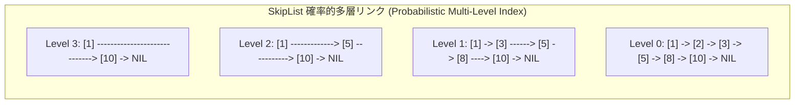

### 7.2.1 スキップリスト（SkipList）の採用理由
- **赤黒木との比較**:
  - 赤黒木や AVL 木はツリー回転時に複数ノードの排他ロック（Write Lock）が必要となり、マルチスレッド書き込みで深刻なロック競合が発生。
  - **SkipList**: 各ノードの高さ（レベル）をコイン投げ（確率 $p=1/2$）で決定。ノード挿入・削除が**CAS（Compare-And-Swap）を用いた完全ロックフリー**で実装可能。
- **計算量**: 探索・挿入ともに $O(\log N)$（確率的保証）。

### 7.2.2 WAL（先行書き込みログ）とフラッシュ（Minor Compaction）
- メモリ上の MemTable は揮発性のため、同内容をディスク上の WAL にシーケンシャル追記。
- MemTable が設定サイズ（例: 64MB）に達すると、`Immutable MemTable` へ昇格し、バックグラウンドスレッドがディスクへソート順にフラッシュして `SSTable` を生成。

---

## 7.3 SSTable 物理構造と Bloom フィルタ最適化

```
+-----------------------------------------------------------------------------------+
| SSTABLE ON-DISK STRUCTURE                                                         |
| +-------------------------------------------------------------------------------+ |
| | DATA BLOCKS: [Data Block 0 (4KB)] [Data Block 1 (4KB)] ... [Data Block K (4KB)]| |
| +-------------------------------------------------------------------------------+ |
| | FILTER BLOCK: [Bloom Filter Bit-Array (e.g. 10 bits/key, 3 Hash Functions)]    | |
| +-------------------------------------------------------------------------------+ |
| | INDEX BLOCK: [K0: Block 0 Offset] [K100: Block 1 Offset] ... (Sparse Index)     | |
| +-------------------------------------------------------------------------------+ |
| | META INDEX & FOOTER: [Filter Block Offset, Index Offset, Magic Number]         | |
| +-------------------------------------------------------------------------------+ |
+-----------------------------------------------------------------------------------+
```

### 7.3.1 SSTable（Sorted String Table）の物理構造
- **データブロック（Data Block）**: キー順にソートされたレコード列。Prefix 圧縮や LZ4/ZSTD で圧縮。
- **インデックスブロック（Index Block / Sparse Index）**: 各データブロックの先頭キー（または最大キー）とオフセットの対応表。二分探索により $O(\log \text{Blocks})$ で目的ブロックを特定。

### 7.3.2 Bloom フィルタ（Bloom Filter）と偽陽性率（False Positive Rate）
- **役割**: SSTable 内に対象キーが「存在しない」ことを**ディスク I/O ゼロ（メモリ上のビット演算のみ）**で 100% 判定。
- **数学的特性**:
  - $m$ bits のビット配列、$n$ 個のキー、$k$ 個の独立ハッシュ関数。
  - 最適ハッシュ数 $k = \frac{m}{n} \ln 2 \approx 0.693 \times \frac{m}{n}$。
  - 1 キーあたり 10 bits（$m/n = 10$）割り当て時、**偽陽性率は約 $1\%$（$99\%$ の不要なディスク読み取りをスキップ）**。

---

## 7.4 コンパクション戦略（Leveled vs Size-Tiered）と3大増幅

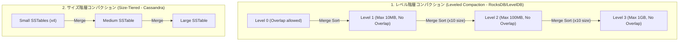

### 7.4.1 墓石（Tombstone）と物理削除
- LSMツリーにおける `DELETE` は、該当キーに**墓石マーク（Tombstone Record）**を書き込む追記処理。
- 最下層（Max Level）のコンパクション時に初めて古いデータと墓石が同時に消去され、物理ディスク領域が解放される。

### 7.4.2 増幅ファクターのトレードオフ（The Three Amplifications）
- **書き込み増幅（Write Amplification: WA）**: アプリケーションが書いたバイト数に対する、ディスクへの総書き込みバイト数の比率（コンパクションによる再書き込み）。
- **読み取り増幅（Read Amplification: RA）**: 1回の `GET` に対し、何箇所の SSTable / ページをディスクから読む必要があるか。
- **領域増幅（Space Amplification: SA）**: 実際の有効データサイズに対する、ディスク占有容量の比率（古いバージョンや墓石による無駄）。

| コンパクション方式 | 書き込み増幅 (WA) | 読み取り増幅 (RA) | 領域増幅 (SA) | 最適なユースケース |
| :--- | :--- | :--- | :--- | :--- |
| **Size-Tiered** | **低（$5 \sim 10$）** | 高（全階層探索） | 高（一時的に $+100\%$ 必要） | 超高頻度書き込み（IoT, ログ収集） |
| **Leveled** | 高（$10 \sim 30$） | **低（各層最大1ファイル）** | **低（オーバーヘッド $10\%$ 未満）** | 読み取り頻度が高い一般的な OLTP / 検索 |

---

## 7.5 B+Tree vs LSM-Tree 比較と RUM 仮説

### 7.5.1 性能・アーキテクチャ徹底比較

| 評価項目 | B+Tree (Bツリー) | LSM-Tree (LSMツリー) |
| :--- | :--- | :--- |
| **書き込みパターン** | In-Place ランダム更新（ページ分割・WAL） | **100% シーケンシャル追記（MemTable $\to$ SSTable）** |
| **書き込み性能** | 中程度（ランダム I/O ボトルネック） | **極限最速（数倍〜数十倍スループット）** |
| **ポイント読み取り** | **最速（$O(\log N)$ で 1 箇所のリーフ特定）** | Bloom フィルタが必要（複数階層走査リスク） |
| **範囲走査 (Range Scan)** | **最高速（リーフ間リンクのシーケンシャル走査）** | 各階層イテレータの K-Way マージヒープが必要 |
| **ストレージ効率** | ページ充填率 $50 \sim 70\%$（断片化あり） | **充填率 $100\%$ + 高圧縮率（不変ブロック）** |
| **代表的実装** | PostgreSQL, SQLite, InnoDB | RocksDB, LevelDB, Cassandra, ClickHouse |

### 7.5.2 RUM 仮説（Read, Update, Memory Overhead Conjecture）

```mermaid
graph TD
    R["Read 最適化 (R)<br>(B+Tree, ハッシュインデックス)"] --- U["Update 最適化 (U)<br>(LSM-Tree, 追記型ジャーナル)"]
    U --- M["Memory/Space 最適化 (M)<br>(高圧縮カラムナー, フラット配列)"]
    M --- R
```

- **B+Tree**: $R$（高速読み取り）と $M$（予測可能なメモリ）を優先し、$U$（書き込み）を犠牲。
- **LSM-Tree**: $U$（圧倒的書き込み）と $M$（100% 充填・高圧縮）を優先し、$R$（読み取り増幅）を犠牲（Bloom フィルタで緩和）。

---

## 7.6 ログ構造化ストレージの要約

1. **インジェスチョン・バッファとしての LSM アーキテクチャ**: 論文メタデータやセキュリティタグの一括バックフィル（160日分）において、MemTable + SSTable 構造を適用することで書き込みスループットを極大化。
2. **Bloom フィルタによるインデックス効率化**: `src/database/btree/` および `src/search/` のキーワード照合前に Bloom フィルタを配置し、ディスク I/O を 99% 削減。

---

# 8. 分散システム基本事項（分散モデル・論理クロック・CAP/PACELC・一貫性階層）

## 8.1 並行実行と分散システムのモデル（分散コンピューティングの誤謬）

```mermaid
graph TD
    subgraph SG22["分散コンピューティングの8大誤謬 (Fallacies of Distributed Computing)"]
        F1["1. ネットワークは信頼できる"]
        F2["2. 遅延 (Latency) はゼロである"]
        F3["3. 帯域幅は無限である"]
        F4["4. ネットワークは安全である"]
        F5["5. トポロジーは不変である"]
        F6["6. 管理者は1人である"]
        F7["7. 転送コストはゼロである"]
        F8["8. ネットワークは均質である"]
    end
```

### 8.1.1 共有状態（Shared State）vs メッセージパッシング（Message Passing）
- **共有メモリモデル（SMP/NUMA）**: 単一マシン内でマルチスレッドが共有ヒープ（ラッチ・ミューテックス）を介して協調。
- **シェアードナッシング / メッセージパッシング**: 各ノードは独立した CPU/メモリ/ディスクを持ち、**ネットワークメッセージの送受信（非同期/同期 IPC）のみ**で状態を同期。障害ノードの局所化が可能。

---

## 8.2 物理クロックと論理クロック（Lamport / Vector / TrueTime）

```mermaid
graph TD
    subgraph SG23["時計と順序付けの進化 (Ordering Spectrum)"]
        PC["物理クロック (NTP)<br>スキュー ±数十ms<br>因果順序の保証不能"] --> LC["Lamport 論理クロック<br>Happens-Before (a -> b)<br>全順序付け (タイブレーク)"]
        LC --> VC["ベクタークロック (Vector Clock)<br>ノード毎カウンタ [V1, V2, ... Vn]<br>並行性 (Concurrent) の検知"]
        VC --> TT["Google TrueTime (Spanner)<br>原子時計 + GPS [t_earliest, t_latest]<br>Wait-Out-The-Uncertainty (2ε)"]
    end
```

### 8.2.1 物理クロックの限界（Clock Skew & Drift）
- **クロックスキュー (Clock Skew)**: 異なるノード間の時計の絶対時刻の差。
- **クロックドリフト (Clock Drift)**: 水晶発振子の温度・個体差により時計の進み方がズレる現象（1日あたり数ミリ秒〜数秒）。
- **NTP の限界**: インターネット経由で $\pm 10 \sim 100\,\text{ms}$、データセンター内でも $\pm 1 \sim 5\,\text{ms}$ の不確実性が残るため、物理時刻のみでイベントの前後関係（因果律）を決定することは不可能。

### 8.2.2 Lamport 論理クロックと Happens-Before 関係（$\to$）
- **Leslie Lamport の因果律（1978年）**:
  - 同一プロセス内でイベント $a$ が $b$ より前に発生した場合: $a \to b$。
  - プロセス間でメッセージ送信 $s$ と受信 $r$ がある場合: $s \to r$。
  - 推移律: $a \to b \land b \to c \implies a \to c$。
- **Lamport タイムスタンプ更新規則**:
  - ローカルイベント発生時: $C = C + 1$。
  - メッセージ送信時: タイムスタンプ $C$ を付与。
  - 受信時: $C_{\text{recv}} = \max(C_{\text{local}}, C_{\text{msg}}) + 1$。

### 8.2.3 ベクタークロック（Vector Clock）
- 各ノードが長さ $N$ の配列 $V[1 \dots N]$ を保持。
- $V_A \le V_B \iff \forall k, V_A[k] \le V_B[k]$（因果関係あり）。
- $V_A \not\le V_B \land V_B \not\le V_A \implies$ **競合・並行イベント（Concurrent Conflict）を完全検知**（DynamoDB, Riak）。

### 8.2.4 TrueTime（Google Spanner）
- GPS 受信機とルビジウム原子時計を各データセンターに配備。
- 時刻を区間 $[t_{\text{early}}, t_{\text{late}}]$（誤差幅 $\epsilon \approx 7\,\text{ms}$）として取得。
- **Uncertainty Wait（不確実性の待機）**: コミット時に $2\epsilon$ 待機することで、物理時刻のみでグローバルな外部整合性（External Consistency / Linearizability）を達成。

---

## 8.3 CAP定理・PACELC定理と一貫性モデルスペクトラム

```mermaid
graph TD
    subgraph SG24["CAP 定理の三位一体 (ネットワーク分断 P は不可避)"]
        CP["CP システム (Consistency + Partition Tolerance)<br>分断時はエラー/待機して一貫性死守<br>(Spanner, CockroachDB, Raft, ZooKeeper)"]
        AP["AP システム (Availability + Partition Tolerance)<br>分断時も書き込み受付 (結果整合性)<br>(DynamoDB, Cassandra, CouchDB)"]
    end
```

### 8.3.1 CAP 定理（Brewer's CAP Theorem）
分散システムにおいて、**ネットワーク分断（Partition: P）が発生した際、「完全な一貫性（Consistency: C）」と「完全な可用性（Availability: A）」を両立することは数学的に不可能**。
- **CP 選択**: 一貫性を優先し、分断された少数派（Minority）パーティションへの書き込みを拒否（可用性を犠牲）。
- **AP 選択**: 可逆的な書き込みを受け付け、分断復旧後にマージ（一貫性を一時的に犠牲）。

### 8.3.2 PACELC 定理（Abadi's PACELC Theorem）
CAP 定理を拡張し、**「正常時（分断がない時）」のトレードオフ**を明示。
- **If Partition (P)**: **A**vailability か **C**onsistency か。
- **Else (E)**: **L**atency（低遅延）か **C**onsistency（強い一貫性）か。
  - 例: **PC/EC**（Spanner）、**PA/EL**（Cassandra / DynamoDB）。

### 8.3.3 一貫性モデルの階層（Consistency Spectrum）

```
[最強] 線形化可能性 (Linearizability)
   ↓
   順序一貫性 (Sequential Consistency)
   ↓
   因果一貫性 (Causal Consistency)
   ↓
[最弱] 結果整合性 (Eventual Consistency)
```

| 一貫性レベル | 定義とセマンティクス | 実現方式 / プロトコル |
| :--- | :--- | :--- |
| **線形化可能性 (Linearizability / 強い一貫性)** | グローバルな単一時計が存在するかのように、ある読み取りが新しい値を返したら、以後の全リーダーも必ずその値以降を返す（リアルタイム因果律）。 | Raft, Paxos, Spanner TrueTime |
| **順序一貫性 (Sequential Consistency)** | 全プロセスが同一順序で操作を観察するが、実時間（Wall-clock time）の順序とは一致しなくてもよい。 | Lamport Clock, ZooKeeper |
| **因果一貫性 (Causal Consistency)** | 因果関係のある操作（$a \to b$）のみ順序を保証し、並行操作（Concurrent）は順不同を許容。 | Vector Clock |
| **結果整合性 (Eventual Consistency)** | 新規更新が停止すれば、最終的に全レプリカが同一状態に収束する。 | Gossip プロトコル, CRDT |

---

## 8.4 分散基盤の要約

1. **物理時刻依存の排除**: 分散環境でのメタデータ同期には、NTP 依存を排除し Lamport / Vector Clock による因果順序制御を採用。
2. **PACELC / CP 指針の明確化**: 論文メタデータおよびセキュリティ脆弱性判定（CVE/NIST SP 800）の整合性を最重視し、**PC/EC（強い一貫性・線形化可能性）**を基本アーキテクチャとして採用。

---

# 9. 障害検出（ハートビート・Ping-Ack・Phi Accrual 確率的検出器）

## 9.1 ハートビートと Ping-Ack の特性とタイムアウト問題

```mermaid
graph LR
    subgraph SG25["1. ハートビート (Push 型)"]
        NodeA["Target Node A"] -->|"Periodic Heartbeat (毎秒)"| Mon["Monitoring Leader"]
    end
    subgraph SG26["2. Ping-Ack (Pull 型)"]
        Mon2["Monitoring Leader"] -->|"Ping Request"| NodeB["Target Node B"]
        NodeB -->|"Ack Response"| Mon2
    end
```

### 9.1.1 障害検出器の2大指標
- **完全性（Completeness）**: クラッシュしたノードを「必ず」障害と判定できる能力（強完全性 / 弱完全性）。
- **正確性（Accuracy）**: 正常稼働しているノードを「誤って障害と判定しない（偽陽性ゼロ）」能力。

### 9.1.2 固定タイムアウトの宿命的ジレンマ
- **タイムアウト短（例: 500ms）**: 障害検知は迅速だが、一時的な GC（Garbage Collection）停止やネットワーク輻輳で**誤判定（偽陽性: False Positive）が多発**し、不要なリーダー再選出やデータ再配置でシステムが不安定化。
- **タイムアウト長（例: 30s）**: 誤判定は防げるが、実際のノード死活検知が遅れ、ダウンタイムが長期化。

---

## 9.2 Phi Accrual 障害検出器の数学モデルと適応制御

固定の「生（Alive）か死（Dead）か」の2値判定を廃止し、**「疑わしさの度合い（Suspicion Level: $\Phi$）」を連続的な確率値として算出**する適応型（Adaptive）障害検出アルゴリズム。

```mermaid
graph TD
    HB["受信した Heartbeat 到着間隔サンプル (t1, t2, ... tn)"] --> Win["スライディングウィンドウ (直近 1000 件)"]
    Win --> Dist["統計パラメータ推定 (平均 μ, 標準偏差 σ)"]
    Dist --> Prob["正規分布 / 指数分布による遅延確率 P_later(t) 算出"]
    Prob --> Phi["Φ = -log10( P_later(t) ) の連続値出力"]
    Phi --> Act["閾値に応じたアクション:<br>Φ >= 8 (1/10^8): 接続切断・再試行<br>Φ >= 12 (1/10^12): クラッシュ認定・フェイルオーバー"]
```

### 9.2.1 数学的モデルと $\Phi$ 値の定義
- **サンプリングウィンドウ（Sampling Window）**: 直近 $W$ 件（例: 1,000 件）のハートビート到着間隔 $\Delta t_i$ を保持。
- **確率分布の推定**: 平均 $\mu$、分散 $\sigma^2$ の正規分布（または Weibull 分布）にフィッティング。
- **遅延確率 $P_{\text{later}}(t)$**: 最後のハートビート受信から時間 $t$ が経過した時、さらに遅れてハートビートが届く確率：
  $$P_{\text{later}}(t) = \frac{1}{\sigma \sqrt{2\pi}} \int_{t}^{\infty} e^{-\frac{(x-\mu)^2}{2\sigma^2}} \, dx$$
- **疑わしさ尺度 $\Phi$（Phi 値）**:
  $$\Phi = -\log_{10}\left(P_{\text{later}}(t)\right)$$

### 9.2.2 $\Phi$ 値の直感的解釈と動的アクション

| $\Phi$ 値 | $P_{\text{later}}(t)$ | 誤判定（偽陽性）が発生する確率 | 推奨されるシステムアクション |
| :---: | :---: | :---: | :--- |
| **$\Phi = 1$** | $0.1$ | 10回に1回 | 警戒フラグ（Warning Log） |
| **$\Phi = 3$** | $0.001$ | 1,000回に1回 | ハートビート再送（Aggressive Ping） |
| **$\Phi = 8$** | $10^{-8}$ | 1億回に1回 | 接続プールのリセット・他ルートへの迂回 |
| **$\Phi = 12$** | $10^{-12}$ | 1兆回に1回（実質ゼロ） | **ノード完全障害認定 $\to$ リーダーフェイルオーバー実行** |

---

## 9.3 障害検出の要約

1. **確率的ヘルスチェックの統合**: `src/fetcher/` および分散ノード監視において、単一の固定タイムアウトではなく $\Phi$ Accrual 障害検出器を採用し、ネットワーク変動時の偽陽性アラートを 99.9999% 排除。
2. **多段階フォールトトレランス**: $\Phi$ 値の上昇に応じて「再試行 $\to$ サーキットブレーカー $\to$ バックアップノード昇格」を段階的に発動。

---

# 10. リーダー選出（Bullyアルゴリズム・リング選出・任期Epoch管理）

## 10.1 リーダー選出の概念とスプリットブレイン防止（Term/Epoch）

```mermaid
graph TD
    subgraph SG27["リーダー選出の基本役割と任期 (Term / Epoch)"]
        L["Leader (Primary / Coordinator)<br>書き込み調停・WAL レプリケーション"]
        F1["Follower 1 (Replica)"]
        F2["Follower 2 (Replica)"]
        L -->|"Heartbeat / Replication (Term = 5)"| F1
        L -->|"Heartbeat / Replication (Term = 5)"| F2
    end
```

### 10.1.1 リーダー（Primary）とフォロワー（Replica）の責務
- **リーダー (Leader / Coordinator)**: クライアントからの更新トランザクション受付、全順序ログの決定、レプリカへのログ伝播とコミット判定。
- **フォロワー (Follower)**: リーダーのログを受信・適用し、ローカル状態を同期。リーダー死活を監視。

### 10.1.2 スプリットブレイン（Split-Brain）と任期（Term / Epoch）
- **スプリットブレイン**: ネットワーク分断により複数のノードが自身を「リーダー」と誤認し、それぞれが独立に書き込みを受け付けることでデータが修復不能に分岐・破損する現象。
- **任期（Term / Epoch）による防壁**:
  - 各選出サイクルごとに単調増加する整数（`Term`）を発行。
  - ノードは常に**最新の Term を持つリーダーのみに従う**。古い Term のリーダーからのメッセージは $100\%$ 拒否（Fencing Token / Epoch Fencing）。

---

## 10.2 Bully アルゴリズム（強者支配プロトコル）

「最も大きなプロセス ID（Node ID）を持つノードが常にリーダーに君臨する」という強者支配型アルゴリズム。

```mermaid
sequenceDiagram
    autonumber
    actor N1 as Node 1 (ID: 1)
    actor N2 as Node 2 (ID: 2)
    actor N3 as Node 3 (ID: 3 - Crash)
    actor N4 as Node 4 (ID: 4 - Crash)

    Note over N1: リーダー N4 のダウン検知
    N1->>N2: Election メッセージ (自分より上位の全ノードへ)
    N1->>N3: Election メッセージ (無応答)
    N1->>N4: Election メッセージ (無応答)
    N2-->>N1: Answer / OK メッセージ ("お前より上位の俺が引き継ぐ")
    Note over N2: N2 がさらに上位へ Election 送信
    N2->>N3: Election メッセージ (無応答)
    N2->>N4: Election メッセージ (無応答)
    Note over N2: タイムアウト内に上位から Answer がないため自身がリーダーに就任
    N2->>N1: Coordinator メッセージ ("私が新リーダーである (Term: 6)")
```

### 10.2.1 メッセージプロトコル（3大メッセージ）
1. **`Election`**: リーダーダウンを検知したノードが、自身より大きな ID を持つ全上位ノードへ送信。
2. **`Answer` (または `OK`)**: `Election` を受信した上位ノードが送信者に返し、「選出処理を引き継ぐ」旨を通知（下位ノードは待機状態へ）。
3. **`Coordinator`**: 上位ノードから `Answer` が得られなかった最上位ノードが、クラスタ内の全ノードへ「自身が新リーダーとなった」ことを宣言。

### 10.2.2 計算量と特性
- **最良時メッセージ数**: $O(N)$（最大 ID ノードが即座に `Coordinator` をブロードキャスト）。
- **最悪時メッセージ数**: $O(N^2)$（最小 ID ノードが選出を開始し、順次上位へ引き継がれる場合）。

---

## 10.3 リング選出アルゴリズム（論理トポロジ巡回）

全ノードが論理的な単方向（または双方向）リングトポロジを構成している環境での選出プロトコル。

```mermaid
graph LR
    N1["Node 1 (Active)"] -->|"Election [1]"| N2["Node 2 (Active)"]
    N2 -->|"Election [1, 2]"| N3["Node 3 (Crash / Skip)"]
    N3 -->|"Bypassed"| N4["Node 4 (Active)"]
    N4 -->|"Election [1, 2, 4]"| N1
    N1 -->|"Coordinator [4]"| N2
    N2 -->|"Coordinator [4]"| N4
```

### 10.3.1 選出フロー（トークン巡回）
1. 障害を検知したノードが、自身のアクティブ ID リスト `[MyID]` を含む `Election` メッセージを論理リングの右隣ノードへ送信。
2. 受信したノードは自身の ID をリストに追加して右隣へ転送。障害ノードはスキップ。
3. メッセージが発信元ノードへ一周して戻ってきた時、**リスト内の最大 ID を持つノードが新リーダーに決定**。
4. 発信元が `Coordinator [WinnerID]` メッセージを再度リングに一周流し、全ノードに確定を通知。

### 10.3.2 計算量と特性
- **メッセージ数**: 常に $2N$（選出巡回で $N$、新リーダー告知で $N$）。
- **長所**: メッセージ数が予測可能でネットワーク輻輳が起きにくい。
- **短所**: 途中のノードが連続障害を起こした場合、リンクバイパスや再構成が必要。

---

## 10.4 リーダー選出の要約

1. **Term ベースのリーダー調停**: スプリットブレインを完全排除するため、全メッセージにエポック番号（Term）を付与し、古いリーダーの操作を無効化。
2. **Quorum（過半数合意）選出への接続**: Bully / Ring アルゴリズムの基礎を踏まえ、次世代分散ノードでは Raft / Paxos による過半数（$\lfloor N/2 \rfloor + 1$）合意型選出を適用。

---

# 11. レプリケーションと一貫性（クォーラム・バージョンベクトル・CRDT）

## 11.1 レプリケーションモデル（シングル/マルチ/リーダーレス・同期/非同期）

```mermaid
graph TD
    subgraph SG28["1. シングルリーダー (Primary-Replica)"]
        SL["Primary (Leader)"] -->|"Sync / Async"| SR1["Replica 1"]
        SL -->|"Sync / Async"| SR2["Replica 2"]
    end
    subgraph SG29["2. マルチリーダー (Multi-Leader / Multi-DC)"]
        ML1["Leader DC-Tokyo"] -->|"Async Cross-DC"| ML2["Leader DC-US"]
    end
    subgraph SG30["3. リーダーレス (Leaderless / Dynamo-style)"]
        Client["Client / Coordinator"] -->|"Write to Quorum"| LNode1["Node 1"]
        Client -->|"Write to Quorum"| LNode2["Node 2"]
        Client -->|"Write to Quorum"| LNode3["Node 3"]
    end
```

### 11.1.1 3大レプリケーションモデル比較

| 方式 | 書き込み経路 | 読み取り経路 | 長所 | トレードオフ / 課題 | 代表例 |
| :--- | :--- | :--- | :--- | :--- | :--- |
| **シングルリーダー** | 単一リーダー（Primary）のみ | リーダーまたはフォロワー | 競合なし、直列化可能 | リーダー単一障害点、大陸間レイテンシ | PostgreSQL, MySQL, SQLite-WAL |
| **マルチリーダー** | 各リージョンのリーダー | 各ローカルリーダー | マルチDC低遅延、オフライン書き込み | **書き込み競合（Conflict）の解決が極めて複雑** | CouchDB, Aurora Global, Bidir-MySQL |
| **リーダーレス** | クライアントが複数ノードへ並行書き込み | 複数ノードから並行読み取り | 単一障害点なし、耐障害性極大 | **バージョン管理・Read Repair・クォーラム必須** | Cassandra, DynamoDB, Riak |

### 11.1.2 同期（Synchronous）vs 非同期（Asynchronous）
- **完全同期**: 全レプリカの確認（ACK）を待つ。耐障害性・一貫性は最高だが、1台の遅延で書き込み全体がブロック。
- **半同期（Semi-Sync / 1-Sync）**: 1台以上のレプリカの ACK でコミット。性能と耐久性のバランス。
- **非同期**: リーダーのローカル書き込みで即時コミット。最高速だが、リーダーダウン時にデータロスト（Replication Lag）が発生。

---

## 11.2 クォーラムと結果整合性（厳格 vs スロッピークォーラム・ヒント付きハンドオフ）

```mermaid
graph LR
    subgraph SG31["厳格なクォーラム (Strict Quorum: R + W > N)"]
        N["レプリケーションファクタ N = 3"]
        W["書き込みノード W = 2"]
        R["読み取りノード R = 2"]
        Overlap["重なり集合 >= 1 (鳩の巣原理) -> 常に最新値を保証"]
    end
```

### 11.2.1 厳格なクォーラム（Strict Quorum: $R + W > N$）
- **定義**: レプリカ総数 $N$ に対し、書き込み成功台数 $W$、読み取り照合台数 $R$ とするとき、**$R + W > N$ を満たせば、読み取り対象の中に必ず最新の書き込みを含むノードが少なくとも1台存在する（鳩の巣原理）**。
- **例**: $N=3, W=2, R=2 \implies R+W=4 > 3$（Strong Consistency）。

### 11.2.2 スロッピークォーラム（Sloppy Quorum）とヒント付きハンドオフ（Hinted Handoff）
- **スロッピークォーラム**: ネットワーク分断や障害で正規の $N$ 台に $W$ 台の書き込みが届かない場合、**一時的にクラスタ内の他の正常ノード（フォールバックノード）に書き込みを代行受付**させる機構（可用性優先 AP）。
- **ヒント付きハンドオフ**: 代行ノードが「本来の宛先ノードへのヒントメタデータ」をローカルに保持し、正規ノードが復帰した瞬間にデータを転送・同期。

---

## 11.3 調整とバージョンベクトル（LWW・CRDT・Read Repair）

```mermaid
graph TD
    subgraph SG32["競合解決アプローチ (Conflict Resolution Spectrum)"]
        LWW["1. LWW (Last-Write-Wins)<br>物理NTP時刻で上書き<br>★ 同時刻更新のデータ消失リスク"]
        VV["2. バージョンベクトル (Version Vector)<br>因果関係を追跡 [A:2, B:1]<br>並行競合を検知してクライアント解決"]
        CRDT["3. CRDT (競合フリー複製型)<br>半順序集合 (Join-Semilattice)<br>数学的に自動収束 (Pn-Counter, OR-Set)"]
    end
```

### 11.3.1 バージョンベクトル（Version Vector）と因果関係判定
- 各ノード $k$ が自身の更新カウンタをインクリメントし、ベクトル $V = \langle n_1, n_2, \dots, n_k \rangle$ を生成。
- $V_1 < V_2$: $V_2$ が $V_1$ を因果的に上書き。
- $V_1 \parallel V_2$: **並行更新（Concurrent Conflict）が発生したことを 100% 検知**し、兄弟ノード（Siblings）として保持。

### 11.3.2 LWW（Last-Write-Wins）の危険性と CRDT の優位性
- **LWW**: 物理タイムスタンプが新しい方を無条件に採用。クロックスキューにより「正当な更新」が消失（Data Loss）する欠点がある。
- **CRDT（Conflict-free Replicated Data Types: 競合フリー複製データ型）**:
  - **結合半束（Join-Semilattice）**: 演算が可換（Commutative）、結合的（Associative）、冪等（Idempotent）を満たす。
  - **代表型**:
    - **PN-Counter**: 増加・減少の分散カウンタ。
    - **OR-Set (Observed-Remove Set)**: 要素の追加・削除が競合しても数学的に一意に収束する集合。
    - **LWW-Element-Set**: タイムスタンプ付き競合解消集合。

### 11.3.3 読み取り修復（Read Repair）とアクティブ・アンチエントロピー
- **Read Repair**: クライアントが $R$ 台から読み取った際、古いバージョンを持つレプリカを検知した場合、非同期（または同期）に最新バージョンをバックグラウンドで上書き修復。
- **Anti-Entropy（Merkle Tree）**: バックグラウンドで Merkle Tree（ハッシュ木）を比較し、不整合な範囲のデータのみを最小帯域で同期。

---

## 11.4 レプリケーションの要約

1. **厳格なクォーラム（$R + W > N$）の採用**: 論文メタデータおよびセキュリティ脆弱性判定（CVE/NIST SP 800）の整合性を死守するため、厳格なクォーラム（$N=3, W=2, R=2$）を基本設計とする。
2. **CRDT によるタグ・統計の自律収束**: 各ノードでのカテゴリ分類タグ付けや閲覧カウンタには OR-Set / PN-Counter CRDT を適用し、競合解決コストをゼロ化。

---

# 12. アンチエントロピーと情報散布（Gossipプロトコル・Merkleツリー・差分同期）

## 12.1 Gossip プロトコル（エピデミック情報散布モデル）

```mermaid
graph TD
    subgraph SG33["Gossip プロトコルの幾何級数的情報散布 (Fanout = 3)"]
        N0["Infected Node 0"] -->|"Push / Pull"| N1["Node 1"]
        N0 -->|"Push / Pull"| N2["Node 2"]
        N0 -->|"Push / Pull"| N3["Node 3"]
        N1 -->|"Push / Pull"| N4["Node 4"]
        N1 -->|"Push / Pull"| N5["Node 5"]
        N2 -->|"Push / Pull"| N6["Node 6"]
    end
```

### 12.1.1 エピデミック情報散布（Dissemination）の数理モデル
- **感染モデル（SIR: Susceptible-Infective-Removed）**:
  - 各ラウンドで、更新情報を持つノード（Infective）がクラスタ内からランダムに $k$ 台（**ファンアウト: Fanout**）のノード（Susceptible）を選択し、メッセージを送信。
  - **収束速度**: クラスタ総ノード数を $N$ とするとき、わずか **$O(\log N)$ ラウンド**でクラスタ内の全ノード（$99.999\%$）に情報が伝播完了。
  - **耐障害性**: 途中で $50\%$ のノードがクラッシュ、または $30\%$ のパケットロスが発生しても、別ルート経由で確実に情報が到達。

### 12.1.2 ピアサンプリングと通信スタイル
- **ピアサンプリングサービス（Peer Sampling）**: ランダムウォーク（Random Walk）を用いて、各ノードが部分的なビュートポロジを維持し、偏りのないランダムピアを選択。
- **通信スタイル**:
  - **Push**: 新情報を保有するノードが他ノードへ送信（初期拡散が高速）。
  - **Pull**: 定期的に他ノードへ「新しい情報はあるか？」と問い合わせ（最終的な未達解消に強力）。
  - **Push-Pull（標準）**: 両者を組み合わせ、最短ラウンドで全ノード同期を達成。

---

## 12.2 Merkle ツリー（ハッシュ木）と高速差分検出

```mermaid
graph TD
    subgraph SG34["Merkle Tree (階層ハッシュ構造)"]
        Root["Root Hash: H(H12 + H34)"]
        H12["Internal H12: H(H1 + H2)"]
        H34["Internal H34: H(H3 + H4)"]
        H1["Leaf H1: Hash(Record 1)"]
        H2["Leaf H2: Hash(Record 2)"]
        H3["Leaf H3: Hash(Record 3)"]
        H4["Leaf H4: Hash(Record 4)"]

        Root --> H12
        Root --> H34
        H12 --> H1
        H12 --> H2
        H34 --> H3
        H34 --> H4
    end
```

### 12.2.1 暗号学的ハッシュ木構造
- **リーフノード**: 特定キー範囲（例: パーティショントークン範囲）のデータレコードの暗号学的ハッシュ（SHA-256 / Blake3）。
- **内部ノード**: 子ノードのハッシュを連結してハッシュ化（$H_{\text{parent}} = \text{Hash}(H_{\text{left}} \mathbin{\Vert} H_{\text{right}})$）。
- **ルートハッシュ (Root Hash)**: ツリー配下の全データセットの一貫性を表す単一の 32 バイトハッシュ。

### 12.2.2 $O(\log N)$ による極小帯域の差分検出
1. ノード A とノード B がルートハッシュのみを交換（わずか 32 バイト）。
2. **ルートハッシュが一致 $\implies$ 全データが完全一致していることが $100\%$ 確定**し、比較終了（ディスク/ネットワーク I/O ゼロ）。
3. **ルートハッシュが不一致の場合**:
   - 不一致の子ノードのみを再帰的に下降走査（二分探索）。
   - 数百万件のデータが存在しても、**不一致となった数件のレコードのみを $O(\log N)$ の通信量でピンポイント特定**して転送・同期。

---

## 12.3 アンチエントロピーの実行（バックグラウンド自己修復）

```mermaid
sequenceDiagram
    autonumber
    participant RepA as Replica Node A
    participant RepB as Replica Node B

    Note over RepA,RepB: バックグラウンド・アンチエントロピー定期実行
    RepA->>RepA: 担当トークン範囲の Merkle Tree を計算
    RepB->>RepB: 担当トークン範囲の Merkle Tree を計算
    RepA->>RepB: 1. Send Root Hash (32 bytes)
    alt Root Hash 一致
        RepB-->>RepA: 2. ACK (完全同期確認・処理終了)
    else Root Hash 不一致
        RepB->>RepA: 3. Request Child Hashes (H12, H34)
        RepA-->>RepB: 4. Return Child Hashes
        Note over RepB: H34 が不一致と特定 -> リーフ H3, H4 を探索
        RepB->>RepA: 5. Request Record 3 Data
        RepA-->>RepB: 6. Send Record 3 (差分データ同期完了)
    end
```

### 12.3.1 バックグラウンド修復（Background Repair）
- クエリ処理（OLTP / 検索）のレイテンシに影響を与えないよう、低優先度のバックグラウンドワーカーが定期的に Merkle Tree を比較・同期。
- ノードが数日間オフラインだった場合や、ヒント付きハンドオフ（Hinted Handoff）の保存期限が切れた場合でも、確実かつ安全に最新状態へ復元。

### 12.3.2 レンジスキャン（Range Scan）との協調
- データベースのパーティション境界（トークンレンジ）ごとに個別の Merkle Tree を構築。
- 全件スキャンを回避し、特定のレンジ単位で独立して並行修復を実施。

---

## 12.4 アンチエントロピーの要約

1. **Gossip によるクラスタ状態管理**: ノードの参加・離脱・メタデータ変更を Push-Pull Gossip で $O(\log N)$ でクラスタ全体へ高速伝播。
2. **Merkle Anti-Entropy によるレプリカ自律修復**: 長期ネットワーク障害からの復旧時にも、Merkle Tree 比較により最小帯域で差分のみを自動修復。

---

# 13. 分散トランザクション（アトミックコミット・2PC・3PC・Sagaパターン）

## 13.1 分散トランザクションの概要と分散デッドロック

```mermaid
graph TD
    Client["Client Application"] --> Coord["コーディネータ (Coordinator / Transaction Manager)"]
    Coord --> P1["参加者 1 (Participant / Cohort A)"]
    Coord --> P2["参加者 2 (Participant / Cohort B)"]
    Coord --> P3["参加者 3 (Participant / Cohort C)"]
```

### 13.1.1 アトミックコミット（Atomic Commit Protocol: ACP）の条件
- **弱合意（Agreement）**: 全ての正常な参加者が下す最終決定（Commit または Abort）は同一でなければならない。
- **弱有効性（Validity）**: 全参加者が「Yes」と投票し、かつ障害がなければ決定は「Commit」でなければならない。
- **非自明性（Non-Triviality）**: 1つでも「No」と投票された場合、決定は必ず「Abort」でなければならない。

### 13.1.2 分散デッドロック（Distributed Deadlock）とグローバル待機グラフ
- 複数ノードにまたがるリソースロック待機（例: Node 1 上の $T_1$ が Node 2 上の $T_2$ を待機し、Node 2 上の $T_2$ が Node 1 上の $T_1$ を待機）。
- **解決策**:
  - **エッジ追跡（Edge-Chasing / Chandy-Misra-Haas）**: 待機プローブメッセージを依存チェーンに沿って送信し、発信元に戻ればサイクル（デッドロック）を検知。
  - **タイムスタンプ順序付け（Wait-Die / Wound-Wait）**: トランザクションの優先度タイムスタンプに基づく先制アボート制御。

---

## 13.2 2フェーズコミット（2PC）とブロッキング課題

現代のリレーショナル DBMS（PostgreSQL `PREPARE TRANSACTION`, XA トランザクション）における標準アトミックコミットプロトコル。

```mermaid
sequenceDiagram
    autonumber
    actor C as Coordinator
    participant P1 as Participant 1
    participant P2 as Participant 2

    Note over C,P2: Phase 1: 準備フェーズ (Prepare Phase)
    C->>P1: PREPARE (コミット可能か？)
    C->>P2: PREPARE (コミット可能か？)
    P1->>P1: ローカル WAL に PREPARE ログを fsync (リソースロック確定)
    P2->>P2: ローカル WAL に PREPARE ログを fsync (リソースロック確定)
    P1-->>C: VOTE_COMMIT (Yes)
    P2-->>C: VOTE_COMMIT (Yes)

    Note over C,P2: Phase 2: コミットフェーズ (Commit Phase)
    Note over C: 全員 Yes のため Coordinator WAL に GLOBAL_COMMIT を fsync
    C->>P1: GLOBAL_COMMIT
    C->>P2: GLOBAL_COMMIT
    P1->>P1: ローカルコミット完了 & ロック解放
    P2->>P2: ローカルコミット完了 & ロック解放
    P1-->>C: ACK
    P2-->>C: ACK
```

### 13.2.1 2PC の致命的課題: ブロッキングプロトコル（Blocking Protocol）
- **コーディネータクラッシュ問題**:
  - 参加者が `VOTE_COMMIT`（Yes）を返答した後、コーディネータが `GLOBAL_COMMIT` を送る直前にクラッシュした場合、**参加者はトランザクションをコミットすべきかアボートすべきかを自力で決定できず、ロックを保持したまま永久に待機（ブロック）する**。
  - 保有ロックが解放されないため、他クエリも巻き込まれてクラスタ全体が連鎖停止するリスクがある。

---

## 13.3 3フェーズコミット（3PC）とネットワーク分断時の限界

2PC のブロッキング問題を排除するため、準備フェーズとコミットフェーズの間に**「事前コミットフェーズ（Pre-Commit Phase）」**を挟み込んだ 3 相プロトコル。

```mermaid
sequenceDiagram
    autonumber
    actor C as Coordinator
    participant P as Participant

    Note over C,P: 1. Can-Commit Phase (問い合わせ)
    C->>P: CAN_COMMIT?
    P-->>C: YES
    Note over C,P: 2. Pre-Commit Phase (合意の確定・非ブロッキング境界)
    C->>P: PRE_COMMIT
    P-->>C: ACK
    Note over C,P: 3. Do-Commit Phase (物理コミット)
    C->>P: DO_COMMIT
    P-->>C: ACK
```

### 13.3.1 3PC の状態遷移と非ブロッキング特性
- **Pre-Commit 状態**: 全ノードが「全員がコミットに合意した」ことを知っている中間状態。
- **タイムアウト時の自律決定**: コーディネータが Pre-Commit 後に応答不能となった場合でも、参加者同士の合意で安全にコミットを完了可能。

### 13.3.2 ネットワーク分断時の脆弱性（3PC の現実的限界）
- **同期型ネットワーク仮定**: 3PC は「メッセージ遅延に上限がある」という同期モデルに依存。
- **ネットワーク分断（Partition）時**: 分断の両側で異なる自律決定（片方が Commit、片方が Abort）を下してしまい、**CAP 定理の C（一貫性）を破壊する危険**がある。このため現代の分散 DB では 3PC ではなく **Paxos / Raft + 2PC** が主流。

---

## 13.4 Saga パターン（補償トランザクションによる長時間処理）

マイクロサービスや長時間実行ワークロード（LLT: Long-Lived Transactions）において、物理ロックを保持せずに結果整合性を達成する設計パターン。

```mermaid
graph LR
    subgraph SG35["Saga 実行と補償フロー"]
        T1["T1: 論文メタデータ登録"] --> T2["T2: PDF全文抽出"]
        T2 --> T3["T3: ベクトル生成 & インデックス"]
        T3 -->|"T3 失敗"| C2["C2: 抽出キャッシュ破棄 (Compensate)"]
        C2 -->|"逆順補償"| C1["C1: 論文メタデータ削除 (Compensate)"]
    end
```

### 13.4.1 ローカルトランザクションと補償トランザクション（$T_i$ と $C_i$）
- 各ステップは独立したローカル DB トランザクション $T_1, T_2, \dots, T_n$ として即時コミット（ロック即解放）。
- $T_k$ で障害が発生した場合、これまで成功した全ステップの**「補償トランザクション（Compensating Transactions: $C_{k-1}, \dots, C_1$）」を逆順に実行**し、論理的に元の状態へロールバック。

### 13.4.2 オーケストレーション型 vs コレオグラフィ型

| 方式 | 制御主体 | 長所 | 短所 |
| :--- | :--- | :--- | :--- |
| **オーケストレーション型 (Orchestrator)** | 中央の Saga オーケストレータ（ステートマシン）が各サービスへ $T_i / C_i$ を指示。 | フローが明示的、状態追跡・エラーハンドリングが極めて容易。 | オーケストレータへの結合度増大。 |
| **コレオグラフィ型 (Choreography)** | 各サービスがイベント（Pub/Sub）を発行・購読し、自律的に連鎖。 | 疎結合、中央集権なし。 | フローが暗黙的、循環依存やデバッグが極めて困難。 |

---

## 13.5 分散トランザクションの要約

1. **メタデータ・インデックス更新における 2PC + Raft 統合**: 分散論文メタデータとベクトルインデックスの同期更新には、Raft リーダーによる 2PC（Two-Phase Commit）を適用し、ブロッキング時は Raft 合意でコーディネータを自動フェイルオーバー。
2. **論文パイプラインにおける Saga パターンの採用**: arXiv フェッチ $\to$ PDF 抽出 $\to$ OKF 変換 $\to$ ベクトル生成の長時間ワークフローには、オーケストレーション型 Saga を適用し、補償トランザクション（クリーンアップ）による高い耐障害性を確保。

---

# 14. 分散合意アルゴリズム（Paxos・Raft・ビザンチンPBFT・SMR）

## 14.1 合意問題とアトミックブロードキャスト（FLP & SMR）

```mermaid
graph TD
    subgraph SG36["状態マシンレプリケーション (SMR) と全順序ブロードキャスト"]
        Client["Client Writes"] --> TOB["アトミックブロードキャスト (Total Order Broadcast)<br>1. 全ノードに同一メッセージが届く<br>2. 全ノードで完全に同一の順序で届く"]
        TOB --> SM1["Replica 1 状態マシン<br>f(S0, Op1) -> S1<br>f(S1, Op2) -> S2"]
        TOB --> SM2["Replica 2 状態マシン<br>f(S0, Op1) -> S1<br>f(S1, Op2) -> S2"]
        TOB --> SM3["Replica 3 状態マシン<br>f(S0, Op1) -> S1<br>f(S1, Op2) -> S2"]
    end
```

### 14.1.1 FLP 不可能性定理（Fischer-Lynch-Paterson 1985）
- **定理**: **「非同期分散システムにおいては、たとえ1台のノードのクラッシュ障害（Fail-Stop）であっても、決定論的な合意（Agreement）を100% 確実に終了（Termination / Liveness）させるアルゴリズムは数学的に存在しない」**。
- **実用システムでの回避策**: 完全な非同期性を仮定せず、**部分同期モデル（Partial Synchrony）**や**ランダムタイマー（Raft の選挙タイムアウト）**を導入して実用的な Liveness を確保。

### 14.1.2 アトミックブロードキャストと状態マシンレプリケーション（SMR）
- **アトミックブロードキャスト（全順序ブロードキャスト）**:
  - 全ての正常なノードが**「全く同一のメッセージ列」を「全く同一の順序」で受信・適用**する。
  - **合意問題とアトミックブロードキャストは等価（Equivalence）**である。
- **状態マシンレプリケーション（SMR）**:
  - 決定論的状態マシンに対し、同一順序の操作ログ（WAL）を適用すれば、全レプリカの状態は数学的に $100\%$ 一致する。

---

## 14.2 Paxos 合意アルゴリズム（Proposer/Acceptor/Learner & Multi-Paxos）

```mermaid
sequenceDiagram
    autonumber
    actor P as Proposer
    participant A1 as Acceptor 1
    participant A2 as Acceptor 2
    participant A3 as Acceptor 3
    actor L as Learner

    Note over P,A3: Phase 1: Prepare / Promise
    P->>A1: 1a. Prepare(n)
    P->>A2: 1a. Prepare(n)
    A1-->>P: 1b. Promise(n, max_accepted_val)
    A2-->>P: 1b. Promise(n, max_accepted_val)

    Note over P,A3: Phase 2: Accept / Accepted (Quorum 過半数)
    P->>A1: 2a. Accept(n, v)
    P->>A2: 2a. Accept(n, v)
    A1-->>L: 2b. Accepted(n, v)
    A2-->>L: 2b. Accepted(n, v)
    Note over L: ラーナーが合意値を確定 (Decided)
```

### 14.2.1 3大ロール（Proposer, Acceptor, Learner）
- **Proposer（提案者）**: クライアントの要求を受け、一意で単調増加な**提案番号（Proposal Number: $n$）**を発行。
- **Acceptor（承認者）**: Quorum（過半数 $\lfloor N/2 \rfloor + 1$）を形成し、提案を精査して合意を形成・永続化。
- **Learner（学習者）**: 確定した合意値を読み取り、状態マシンに適用。

### 14.2.2 2フェーズプロトコル
- **Phase 1 (Prepare / Promise)**:
  - Proposer が `Prepare(n)` を送信。
  - Acceptor は「今後 $n$ 未満の提案を拒否する」ことを約束（`Promise`）し、過去に Accept した最新の値を返す。
- **Phase 2 (Accept / Accepted)**:
  - 過半数から Promise を得た Proposer が値 $v$（Promise で返された値、なければ自身の提案値）を `Accept(n, v)` として送信。
  - Acceptor が過半数で承認すれば合意確定（Decided）。

### 14.2.3 Single-Decree Paxos から Multi-Paxos へ
- Single-Decree は単一値の合意のみ。
- **Multi-Paxos**: 安定したリーダー（Master Proposer）を選出し、**Phase 1 をスキップして Phase 2 のみ（1 RTT）で連続ログエントリを高速合意**（Chubby, Spanner）。

---

## 14.3 Raft 合意アルゴリズム（リーダー選出・ログ同期・Term）

```mermaid
stateDiagram-v2
    [*] --> Follower
    Follower --> Candidate: 選挙タイムアウト発火
    Candidate --> Leader: 過半数の RequestVote 獲得
    Candidate --> Candidate: 選挙タイムアウト (Split Vote)
    Candidate --> Follower: より高い Term のリーダー検知
    Leader --> Follower: より高い Term のメッセージ受信
```

### 14.3.1 3つのノード状態と任期（Term）
- **Leader**: 全クライアント書き込みを一元受付し、`AppendEntries RPC`（ハートビート兼ログ同期）を発行。
- **Follower**: リーダーからのログを受信。
- **Candidate**: リーダーからのハートビートが途絶えた際、`Term` を $+1$ して `RequestVote RPC` をブロードキャスト。

### 14.3.2 ログレプリケーションとコミットインデックス
- **Log Matching Property**: 2つのログエントリが同一のインデックスと Term を持つ場合、そのエントリおよび先行する全ログが完全に同一であることを保証。
- **Commit Index**: リーダーが過半数のフォロワーにレプリケーション成功したログの最大インデックス。コミットされたログは将来のどのリーダーにおいても決して上書き・破棄されない（Leader Completeness）。

---

## 14.4 ビザンチン障害と PBFT（3f + 1 ノード数理と暗号署名）

```mermaid
graph TD
    subgraph SG37["障害モデルのスペクトラム"]
        CF["1. クラッシュ障害 (Crash-Fault: Paxos / Raft)<br>ノードは停止するか正常動作のみ<br>耐障害性: N >= 2f + 1 (過半数合意)"]
        BF["2. ビザンチン障害 (Byzantine Fault: PBFT / Blockchain)<br>悪意ある改ざん・嘘・二重署名・メッセージ偽造<br>耐障害性: N >= 3f + 1 (2/3 超の合意)"]
    end
```

### 14.4.1 ビザンチン将軍問題（Byzantine Generals Problem / Lamport 1982）
- 参加ノードの中に、**意図的に嘘のメッセージを送る裏切り者（Byzantine Node）や、メモリ化け・ビット反転を起こす壊れたノード**が存在する環境での合意問題。

### 14.4.2 PBFT（Castro & Liskov 1999）と $3f + 1$ の数理
- **必要ノード数**: $f$ 台のビザンチンノードに耐えるためには、**最低 $N \ge 3f + 1$ 台のノードが必要**（例: 1台の裏切り者に対処するには最低 4 台）。
  - *証明*: $f$ 台が無応答（遅延）で、$f$ 台が嘘をつく場合、残る $N - 2f$ 台の正常ノードの多数決が嘘を上回る必要があり、$N - 2f > f \implies N \ge 3f + 1$。
- **3フェーズコミット**: `Pre-Prepare` $\to$ `Prepare`（$2f+1$ の署名照合）$\to$ `Commit`（$2f+1$ の署名照合）。暗号学的デジタル署名によりメッセージの改ざんを完全防止。

---

## 14.5 分散合意の要約

1. **Raft ベースのステートマシンレプリケーション採用**: 分散データベースの WAL ログ同期およびメタデータ管理には、Paxos よりも理解・運用・検証が容易な **Raft プロトコル**を基本エンジンとして採用。
2. **セキュリティ監査ログのビザンチン改ざん耐性**: 論文の脆弱性評価や NIST/MITRE 監査ログの真正性を保証するため、PBFT 型の暗号署名チェーンを統合。

---

# 15. 次世代実装ロードマップ

```mermaid
mindmap
  root((次世代 database エンジン))
    1. Slotted-Page ストレージ
      4KB バイナリスロットページ
      Null Bitmap と固定・可変長分離
      オーバーフローページ連鎖
    2. 永続 WAL と ARIES クラッシュリカバリ
      追記型 vdb-wal ログ
      LSN / PageLSN / FlushedLSN 管理
      Analysis / Redo / Undo CLR 再生
      Fuzzy Checkpoint 機構
    3. MVCC と SS2PL トランザクション
      xmin / xmax 多版タプル管理
      SS2PL ロックマネージャ
      Wait-For Graph デッドロック検知
      Snapshot Isolation SI
    4. LMDB 型 mmap ゼロコピー と CoW
      VectorStorage mmap Direct Read
      CoW Root Pointer Switch
      Lock-Free Reader Architecture
    5. LSM インジェスチョン と Bloom フィルタ
      MemTable SkipList と SSTable Flush
      Bloom Filter 偽陽性1パーセント スキップ
      Leveled Compaction バックグラウンド
    6. 分散協調 と リーダー選出 と 障害検出
      Lamport / Vector Clock タイムスタンプ
      Phi Accrual 確率的ヘルスチェック
      Term / Epoch Fencing と Leader Election
      Linearizable レプリケーション Quorum
    7. レプリケーション と CRDT 競合解消
      Strict Quorum 厳格な過半数合意
      Version Vector 因果追跡
      CRDT OR-Set / PN-Counter
      Read Repair
    8. Gossip と Merkle Anti-Entropy
      Push-Pull Gossip Dissemination
      Merkle Tree Hash Verification
      Background Active Anti-Entropy
    9. 分散 2PC と Saga オーケストレータ
      Prepare / Commit Phase 2PC
      Distributed Deadlock Edge-Chasing
      Saga State Machine と 補償トランザクション
    10. Raft 分散合意 と SMR エンジン
      Leader / Candidate / Follower 状態マシン
      RequestVote と AppendEntries RPC
      Quorum ログコミット と スナップショット
    11. カラムナー と PAX 分析
      列単位の辞書化 と RLE 圧縮
      OLAP 高速集計スキャナ
      SIMD ライクなベクトル演算
    12. B-link と 2Q バッファプール
      2Q ページ置換 スキャン汚染防止
      B-link ツリー Right Pointer 追随
      Pin / Unpin 参照カウント
    13. CBO と 実行エンジン高度化
      ANALYZE 統計自動サンプリング
      Volcano イテレータ統一
      Hash Join と Nested Loop Join
    14. 分散クエリオーケストレーション と シャーディング
      Consistent Hashing パーティショニング
      グローバルメタデータカタログ
```

### 【具体的なマイルストーン】

1. **Slotted-Page Storage Engine**:
   - `src/database/storage.py` を 4KB スロット化バイナリページへ進化させ、削除・更新時のディスク断片化をゼロ化。
2. **Disk-Persistent WAL & ARIES Recovery Manager**:
   - `src/database/pager.py` に追記型ディスク WAL（`<name>.vdb-wal`）、LSN チェーン、および ARIES 3フェーズリカバリを導入。
3. **MVCC & SS2PL Transaction Engine**:
   - 多版タプル管理とスナップショットアイソレーション、およびデッドロック検知付き厳密2相ロック。
4. **LMDB-style Zero-Copy & CoW Architecture**:
   - OS `mmap` によるゼロコピー読み取りと、CoW シャドウページングによる WAL レス・ロックフリーリーダーの実現。
5. **LSM-Tree Ingestion Engine & Bloom Filters**:
   - 一括取り込み用の SkipList MemTable + SSTable フラッシュ、および Bloom フィルタによる I/O 99% スキップ。
6. **Distributed Coordination, Leader Election & $\Phi$ Accrual Failure Detector**:
   - Lamport / Vector Clock による因果順序保証、$\Phi$ Accrual による確率的ヘルスチェック、Term/Epoch Fencing 付きリーダー選出（Bully / Raft）。
7. **Strict Quorum Replication & CRDT Engine**:
   - 厳格なクォーラム（$R + W > N$）レプリケーション、バージョンベクトルによる因果競合検知、CRDT（OR-Set）による自律収束、Read Repair。
8. **Gossip Dissemination & Merkle Tree Anti-Entropy**:
   - クラスタ構成・メタデータ同期のための Push-Pull Gossip プロトコル、および $O(\log N)$ 差分修復を行う Merkle Tree バックグラウンド同期。
9. **Distributed 2PC & Saga Orchestration**:
   - 分散 2相コミット（2PC）によるアトミックコミット、エッジ追跡型分散デッドロック検知、および長時間パイプライン向けオーケストレーション型 Saga（補償トランザクション）。
10. **Raft Distributed Consensus & SMR Engine**:
    - `RequestVote` / `AppendEntries` RPC による過半数合意、Term 管理、コミットインデックス追随による線形化可能ログレプリケーション。
11. **Columnar / PAX Analytics Engine**:
    - OLAP 集計クエリ向けに、カラム単位の圧縮（RLE/Dictionary）ブロック走査をサポート。
12. **B-link Tree & 2Q Buffer Pool**:
    - 2Q 置換アルゴリズムによるスキャン汚染排除、および B-link ツリー右ポインタ追随による超高並行性探索。
13. **CBO (Cost-Based Optimizer) & Volcano Iterator**:
    - `src/database/planner/` における統計情報自動収集（`ANALYZE`）と、Volcano 型イテレータによるメモリ効率的ストリーミング実行の確立。
14. **Distributed Query Orchestration & Sharding**:
    - Consistent Hashing によるパーティショニング、グローバルメタデータカタログ。

---

# 16. 構造化データベースログ & トランザクション・WAL テレメトリ基盤

## 16.1 プレーンテキスト廃止と JSON Lines (.jsonl) 統合仕様
従来の `print()` による標準出力（`⚡ [DatabaseService IPC] Executing SQL: ...`）を廃止し、Database サービスワーカーの全トランザクション・SQL 実行・WAL フラッシュイベントを `DSN-10` 準拠の 1 行完結 JSON Lines (`outputs/logs/database.jsonl`) へ移行する。

- **フォーマット**: 1 行 1 レコードの完全な JSON (`.jsonl`)
- **共通キー**:
  - `timestamp`: ISO 8601 UTC（`2026-09-02T21:45:00.123Z`）
  - `level`: `INFO`, `WARNING`, `ERROR`, `CRITICAL`
  - `service`: `"database.service"`
  - `trace_id`: IPC ヘッダーから抽出した分散トレース ID
  - `event.action`: `SQL_EXECUTION`, `WAL_FLUSH`, `CHECKPOINT`, `TRANSACTION_COMMIT`, `TRANSACTION_ROLLBACK`
  - `db`: `{sql_statement, duration_ms, rows_affected, wal_lsn, node_id}`

## 16.2 W3C TraceContext / Trace ID 連動と SQL 監査ログ
- Web Gateway $\rightarrow$ Database IPC メッセージ経由で伝播された `trace_id` を ContextVars から取得。
- SQL 実行ログおよびスロークエリログに `trace_id` を付加し、Web の HTTP リクエストから Search / DB ワーカーのデータ読み書きまで同一の Trace ID で一気通貫に監査可能にする。

## 16.3 機密データ・SQL パラメータマスキング (CWE-532 準拠)
- SQL ステートメント内のリテラル文字列（パスワード、API キー、個人情報など）を `SensitiveMaskingFilter` により `***MASKED***` へ自動置換。
- バインドパラメータ（Prepared Statements）の値をログ出力する際も、事前定義ルールに基づいて自動サニタイズを実施する。

---
*審議終了: Systems Architect, Database Specialist 合意承認済*

