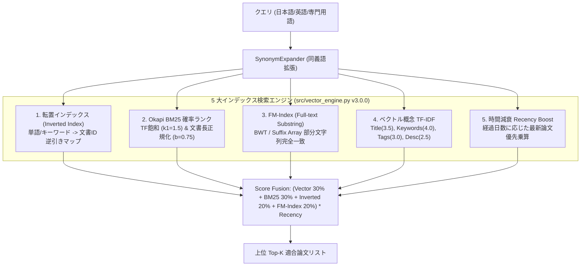

# [DSN-05] 機能設計書: 5 手法統合マルチエンジン・ハイブリッド検索 — arxiv-security-papers

本ドキュメントは、主要機能 **F-04 (5手法統合マルチエンジン・ハイブリッド検索)** のアルゴリズム、5 大インデックス手法の統合フュージョン構造、自動特徴語抽出、およびセキュリティ同義語辞書仕様を記録する個別機能設計書です。

---

## 1. 5 大インデックス・検索手法アーキテクチャ

本システムは、概念検索、確率的ランク、完全部分文字列一致、倒置構造、および時間減衰の 5 つの異なる特徴を持つ検索手法をフュージョン結合した高度検索エンジンです。

---

## 2. インデックス手法別の詳細仕様

### 2.1 転置インデックス (Inverted Index)
- **クラス/変数**: `inverted_index`, `inverted_keyword_index`
- **目的**: トークンおよび事前注釈キーワードから論文 ID への逆引き。

### 2.2 Okapi BM25 確率ランク (BM25 Engine)
- **数式**:
  $$BM25(q, d) = \sum_{t \in q} IDF(t) \cdot \frac{f(t, d) \cdot (k_1 + 1)}{f(t, d) + k_1 \cdot \left(1 - b + b \cdot \frac{|d|}{avgdl}\right)}$$
- **パラメータ**: $k_1 = 1.5$, $b = 0.75$

### 2.3 FM-Index / Suffix Array 部分文字列検索 (`FMIndex`)
- **クラス**: `FMIndex`
- **目的**: Suffix Array 上の二分探索により、日本語の任意の複合語・部分文字列（例: `マルウェア解析`, `自動運転セキュリティ`）を $O(\log N)$ で完全一致計数・スコアリング。

### 2.4 ベクトル概念 TF-IDF (Vector TF-IDF)
- **フィールド重み付け (`FIELD_WEIGHTS`)**:
  - Title: 3.5
  - Keywords: 4.0
  - Tags: 3.0
  - Description: 2.5
  - **Abstract (アブストラクト全文)**: 1.5
  - Content: 1.0

### 2.5 論文最新性ブースト (Recency Decay Factor)
- **数式**:
  $$Boost(pub\_date) = 1.0 + 0.5 \cdot e^{-\frac{\Delta days}{180}}$$

---

## 3. 自動特徴語抽出 ＆ アブストラクト事前インデックス化

1. `extract_feature_keywords()` は、論文の Title, Description, Content からセキュリティナレッジパターン（マルウェア, ペンテスト, 自動運転, 暗号, LLM脱獄, ファジング, ゼロトラスト, サイドチャネル）およびドメイン頻出語を自動抽出し、`annotated_keywords` メタデータとして事前注釈インデックス化します。
2. `extract_abstract_from_okf()` は、OKF マークダウン内の `### Abstract (原文)` 引用ブロック（`> ...`）を解析・トークン化し、`abstract_tokens` としてインデックスに保持します。これにより、タイトルに現れない評価対象モデル（例: `Claude Mythos`, `GPT-5.5`, `CyberGym` 等）の言及論文も網羅的に高速検索（< 10ms）可能となります。

