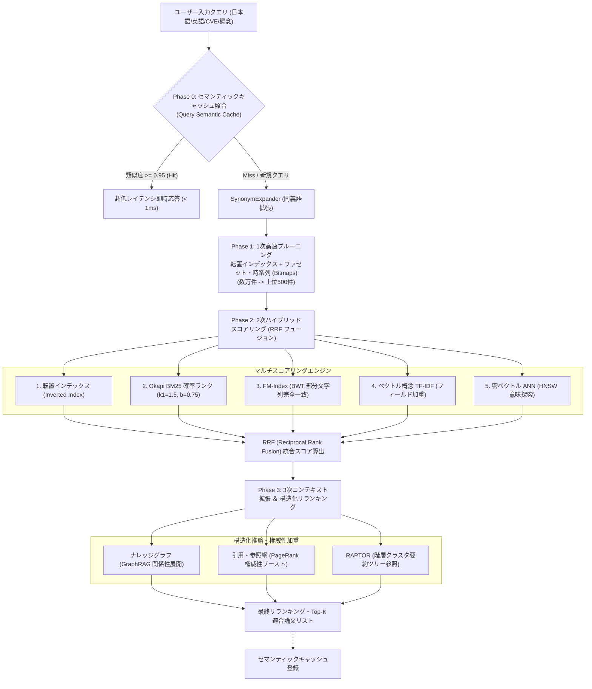

# [DSN-05] 機能設計書: 5 手法統合マルチエンジン ＆ 高度多段階 RAG ハイブリッド検索 — arxiv-security-papers

本ドキュメントは、主要機能 **F-04 (5手法統合マルチエンジン・ハイブリッド検索および高度多段階 RAG パイプライン)** のアルゴリズム、6 大拡張インデックスデータモデル、4 フェーズ連携アーキテクチャ、自動特徴語抽出、およびセキュリティ同義語辞書仕様を記録する個別機能設計書です。

---

## 1. 検索・推論エンジン全体の多段階アーキテクチャ

本システムは、即応性・語彙一致を担う軽量疎インデックスと、意味理解・グラフ推論・階層要約を担う高度インデックスを有機的に結合した **4 フェーズ多段階ハイブリッド検索・推論パイプライン** を採用しています。

---

## 2. 6 大拡張インデックスデータモデル仕様

### 2.1 密ベクトル ANN インデックス (Dense Vector / ANN)
- **データ構造**: `embeddings` (Float32/16 配列), `hnsw_graph`, `ivf_centroids`
- **目的**: 語彙の完全一致に依存せず、文脈・意図が類似する論文を近似最近傍探索（$k$-NN）により高速取得。

### 2.2 ナレッジグラフ・関係性インデックス (Entity Graph Index)
- **データ構造**: `adjacency_list`, `nodes` (CVE, 攻撃手法, ツール名, 対策技術), `edges` (exploits, mitigates, detects, targets)
- **目的**: セキュリティ概念間の有向グラフを保持し、GraphRAG や「X攻撃の対策Yを採用している論文」といったマルチホップ推論を実現。

### 2.3 階層型・要約ツリーインデックス (RAPTOR / Hierarchical Tree)
- **データ構造**: `cluster_tree`, `summary_vectors`, `level_nodes` (クラスタ要約)
- **目的**: 論文群をボトムアップにクラスタリングし段階的要約を構築。「近年の脱獄攻撃のトレンド」等の包括的クエリに対し高次ノードから俯瞰的回答を提供。

### 2.4 属性・ファセット・時系列インデックス (Faceted / Temporal Index)
- **データ構造**: `bitmaps` (Roaring Bitmaps / Python `set`), `b_tree_time` (公開日・年), `category_sets`
- **目的**: 公開期間、カテゴリ（`cs.CR` 等）、査読/プレプリント区分等の高速論理演算（AND/OR/NOT）フィルタリング。

### 2.5 引用・参照ネットワークインデックス (Citation / Authority Index)
- **データ構造**: `inbound_citations`, `outbound_references`, `pagerank_scores`, `h_index`
- **目的**: 論文間の被引用有向ネットワークを保持。べき乗法（Power Iteration）により PageRank スコアを事前計算し、検索スコアの権威性加重ブーストに利用。

### 2.6 セマンティックキャッシュインデックス (Query Semantic Cache)
- **データ構造**: `query_embeddings`, `cached_result_ids`, `ttl`, `hit_count`
- **目的**: 過去クエリの埋め込みベクトルと検索結果をキャッシュし、類似度 $\ge 0.95$ の同一・類似問い合わせを超低レイテンシ（$< 1\text{ms}$）で即時返却。

---

## 3. 4 フェーズ検索・推論パイプラインの詳細

### 3.1 Phase 0: セマンティックキャッシュ照合
入力クエリの埋め込みベクトル $e_q$ とキャッシュ内の過去クエリベクトル $e_c$ のコサイン類似度 $\text{sim}(e_q, e_c)$ を計算。
$$\text{sim}(e_q, e_c) \ge 0.95 \implies \text{Cache Hit (即時返却)}$$

### 3.2 Phase 1: 1次高速プルーニング (候補絞り込み)
ファセット（公開日、カテゴリ）と転置インデックス（Inverted Index）の積集合により、数万件の文書から上位 500 件程度の評価対象候補集合 $D_{\text{cand}}$ を瞬時に抽出。

### 3.3 Phase 2: 2次ハイブリッドスコアリング (RRF フュージョン)
各エンジン $m \in M$ における候補文書 $d \in D_{\text{cand}}$ の順位 $r_m(d)$ に対し、平滑化定数 $k=60$ を用いた Reciprocal Rank Fusion (RRF) スコアを算出：
$$RRF(d) = \sum_{m \in M} \frac{w_m}{k + r_m(d)}$$
- 重み配分: Dense ANN (0.30), BM25 (0.25), TF-IDF (0.20), FM-Index (0.15), Inverted (0.10)

### 3.4 Phase 3: 3次コンテキスト拡張 ＆ 構造化リランキング
RRF スコアに対し、時間減衰および論文権威性を乗算し、ナレッジグラフおよび RAPTOR 要約コンテキストを結合：
$$\text{FinalScore}(d) = RRF(d) \times \text{RecencyBoost}(d) \times (1.0 + \alpha \cdot \text{PageRank}(d))$$
- $\text{RecencyBoost}(d) = 1.0 + 0.5 \cdot e^{-\frac{\Delta \text{days}}{180}}$
- $\alpha = 0.5$（権威性係数）

---

## 4. 自動特徴語抽出 ＆ アブストラクト事前インデックス化

1. `extract_feature_keywords()` は、論文の Title, Description, Content からセキュリティナレッジパターン（マルウェア, ペンテスト, 自動運転, 暗号, LLM脱獄, ファジング, ゼロトラスト, サイドチャネル）およびドメイン頻出語を自動抽出し、`annotated_keywords` メタデータとして事前注釈インデックス化します。
2. `extract_abstract_from_okf()` は、OKF マークダウン内の `### Abstract (原文)` 引用ブロック（`> ...`）を解析・トークン化し、`abstract_tokens` としてインデックスに保持します。これにより、タイトルに現れない評価対象モデル（例: `Claude Mythos`, `GPT-5.5`, `CyberGym` 等）の言及論文も網羅的に高速検索（< 10ms）可能となります。
