# [DSN-06] ゼロ外部依存・大規模分散Webクローラー＆スパイダー基盤（`src/spider/`）包括的アーキテクチャ設計書

- **文書番号**: `DSN-06`
- **文書ステータス**: `APPROVED`
- **対象サブシステム**: `src/spider/` (Distributed Crawler, Bloom, OPIC, AutoThrottle, SPA Hydration)

**【議長】 Systems Architect (SA)**  
**【主査・報告】 Network Specialist (Net) / IT Specialist (NLP/IR)**  
**【参画】 Project Manager (PM), Database Specialist (DB), Information Security Specialist (Sec), Software QA Specialist (QA), IT Strategist (ST)**

---

## 体系目次

- [1. スパイダー・クローラーアーキテクチャと実行基盤](#1-スパイダークローラーアーキテクチャと実行基盤)
  - [1.1 主要コンポーネント構成とデータフロー](#11-主要コンポーネント構成とデータフロー)
    - [1.1.6 多態的アイテムパイプライン (Polymorphic Item Pipeline: OkfItemPipeline)](#116-多態的アイテムパイプライン-polymorphic-item-pipeline-okfitempipeline)
    - [1.1.7 コアデータモデル仕様 (Request, Response, BaseSpider)](#117-コアデータモデル仕様-request-response-basespider)
  - [1.2 イベント駆動非同期実行モデルとシグナル管理](#12-イベント駆動非同期実行モデルとシグナル管理)
  - [1.3 ゼロ外部依存・100% Python 標準ライブラリ原則と技術スタックマッピング](#13-ゼロ外部依存100-python-標準ライブラリ原則と技術スタックマッピング)
  - [1.4 現行 ETL パイプラインとの対比と進化方針](#14-現行-etl-パイプラインとの対比と進化方針)
- [2. URL フロンティアとスケジューリング理論](#2-url-フロンティアとスケジューリング理論)
  - [2.1 クロールフロンティアの数学的構造](#21-クロールフロンティアの数学的構造)
  - [2.2 選択ポリシー (Selection Policy: OPIC, Partial PageRank, トピック指向フォーカスド探索)](#22-選択ポリシー-selection-policy-opic-partial-pagerank-トピック指向フォーカスド探索)
  - [2.3 再訪問ポリシーと新鮮度最適化モデル (Freshness & Age 数学関数, Harmonic Proportional スケジュール)](#23-再訪問ポリシーと新鮮度最適化モデル-freshness--age-数学関数-harmonic-proportional-スケジュール)
  - [2.4 マナーポリシーと負荷制御 (RFC 9309 robots.txt, Adaptive Delay, ドメインスロット)](#24-マナーポリシーと負荷制御-rfc-9309-robotstxt-adaptive-delay-ドメインスロット)
    - [2.4.4 Spider宣言遅延と Politeness 連携 (Runner/Scheduler/AutoThrottle)](#244-spider宣言遅延と-politeness-連携-runnerschedulerautothrottle)
- [3. URL 正規化・正体化とクローラートラップ回避](#3-url-正規化正体化とクローラートラップ回避)
  - [3.1 構文・意味論的 URL 正規化パイプライン (7段階正規化)](#31-構文意味論的-url-正規化パイプライン-7段階正規化)
  - [3.2 クローラー・トラップの分類と多層防御機構](#32-クローラートラップの分類と多層防御機構)
  - [3.3 重複排除アーキテクチャ (Scalable Bloom Filter 数理・誤検知率モデル)](#33-重複排除アーキテクチャ-scalable-bloom-filter-数理誤検知率モデル)
- [4. 非同期 HTTP/1.1 トランスポートとストリーム処理](#4-非同期-http11-トランスポートとストリーム処理)
  - [4.1 標準ソケット/SSL による非同期 HTTP/1.1 プロトコルスタック](#41-標準ソケットssl-による非同期-http11-プロトコルスタック)
  - [4.2 コネクションプーリングと Keep-Alive ライフサイクル](#42-コネクションプーリングと-keep-alive-ライフサイクル)
  - [4.3 チャンク転送デコードとストリーム圧縮解凍](#43-チャンク転送デコードとストリーム圧縮解凍)
  - [4.4 HTTP HEAD 事前検証と帯域幅制御ポリシー](#44-http-head-事前検証と帯域幅制御ポリシー)
  - [4.5 HTTP 429/5xx 指数バックオフ再試行と Retry-After 協調 (RetryMiddleware)](#45-http-4295xx-指数バックオフ再試行と-retry-after-協調-retrymiddleware)
- [5. 純Pythonによる動的 JavaScript・SPA 透過解析技術](#5-純pythonによる動的-javascriptspa-透過解析技術)
  - [5.1 ブラウザ不要アプローチの理論的背景と超低遅延性](#51-ブラウザ不要アプローチの理論的背景と超低遅延性)
  - [5.2 ハイドレーションステート抽出技術 (Next.js, Nuxt, Redux, Apollo JSON)](#52-ハイドレーションステート抽出技術-nextjs-nuxt-redux-apollo-json)
  - [5.3 リバース API エンドポイントスニッフィング](#53-リバース-api-エンドポイントスニッフィング)
  - [5.4 純Python 軽量 DOM ツリービルダーと CSS セレクタ評価エンジン](#54-純python-軽量-dom-ツリービルダーと-css-セレクタ評価エンジン)
- [6. 分散スパイダーとクラスタ協調アーキテクチャ](#6-分散スパイダーとクラスタ協調アーキテクチャ)
  - [6.1 フロンティア分散配置と Consistent Hashing (ドメイン局所性)](#61-フロンティア分散配置と-consistent-hashing-ドメイン局所性)
  - [6.2 DSN-14 自律分散 DB エンジンとの統合](#62-dsn-14-自律分散-db-エンジンとの統合)
  - [6.3 ポーズ＆レジューム (Pause / Resume) アトミック永続化](#63-ポーズレジューム-pause--resume-アトミック永続化)
- [7. セキュリティ・アイデンティティ・コンプライアンス](#7-セキュリティアイデンティティコンプライアンス)
  - [7.1 クローラー身元開示と緊急停止キルスイッチ](#71-クローラー身元開示と緊急停止キルスイッチ)
  - [7.2 機密データ保護と Google Hacking 対策](#72-機密データ保護と-google-hacking-対策)
  - [7.3 SSRF 防護・内部ネットワーク隔離とドメイン境界制御 (OffsiteMiddleware)](#73-ssrf-防護内部ネットワーク隔離とドメイン境界制御-offsitemiddleware)
- [8. 運用・可観測性・品質保証フレームワーク](#8-運用可観測性品質保証フレームワーク)
  - [8.1 AutoThrottle 自律速度追従アルゴリズム](#81-autothrottle-自律速度追従アルゴリズム)
  - [8.2 リアルタイム統計コレクター (Stats Collector)](#82-リアルタイム統計コレクター-stats-collector)
  - [8.3 契約駆動型テスト (Spider Contracts フレームワーク)](#83-契約駆動型テスト-spider-contracts-フレームワーク)
- [9. 次世代スパイダー基盤 実装ロードマップ](#9-次世代スパイダー基盤-実装ロードマップ)

---

# 1. スパイダー・クローラーアーキテクチャと実行基盤

## 1.1 主要コンポーネント構成とデータフロー

大規模 Web クローリング＆インテリジェンス収集基盤（`src/spider/`）は、Scrapy のコンポーネント指向アーキテクチャを踏襲しつつ、非同期 I/O をコアとした 7 つの独立した階層的サブシステムで構成されます。

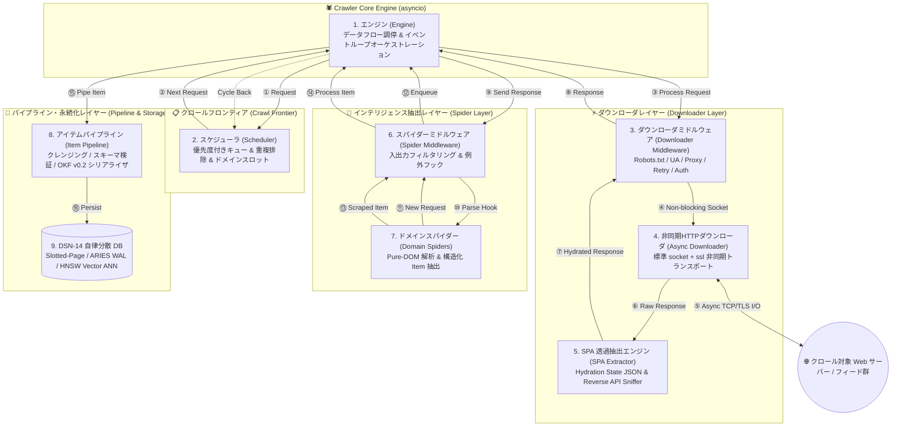

### 1.1.1 エンジン (Engine)
- **役割**: 全体データフローの調停、非同期タスクのスケジューリング、およびライフサイクルシグナルの統制。
- **データフロー**: スケジューラからリクエストを取り出し、ダウンローダへディスパッチ。受信レスポンスをスパイダーへ渡し、抽出された新規リクエストとアイテムを適切なパイプラインへルーティング。

### 1.1.2 スケジューラ (Scheduler / Crawl Frontier)
- **役割**: クロール対象 URL の優先度管理、訪問済み URL の重複排除、ドメインごとの帯域制限・スロット管理。
- **データ構造**: ヒープキューによる多段優先度キュー、純 Python 製 Scalable Bloom Filter、およびドメイン単位の FIFO バッファ。

### 1.1.3 ダウンローダ (Downloader) & ミドルウェア
- **役割**: 非同期ソケット通信による HTTP/1.1 リクエスト実行、SSL/TLS ハンドシェイク、Keep-Alive 接続プール管理、レスポンスヘッダ解析、およびストリーム解凍。
- **ミドルウェア連鎖 (Middleware Chain)**:
  - **リクエスト送信フロー (正順)**: `OffsiteMiddleware` (SSRF ドメイン水際遮断) $\rightarrow$ `UserAgentMiddleware` (身元注入) $\rightarrow$ `RobotsTxtMiddleware` (RFC 9309 遵守) $\rightarrow$ `AutoThrottlePolicy` (Politeness レート制限) $\rightarrow$ `HttpCacheMiddleware` (ローカルキャッシュ照合) $\rightarrow$ `AsyncHttpDownloader`
  - **レスポンス受信フロー (逆順)**: `AsyncHttpDownloader` $\rightarrow$ `HttpCacheMiddleware` (キャッシュ保存) $\rightarrow$ `AutoThrottlePolicy` (レイテンシ学習) $\rightarrow$ `RobotsTxtMiddleware` $\rightarrow$ `UserAgentMiddleware` $\rightarrow$ `RetryMiddleware` (HTTP 429/5xx 指数バックオフ自己修復) $\rightarrow$ `Engine`

### 1.1.4 SPA 透過抽出エンジン (SPA Extractor)
- **役割**: 外部ブラウザ（Playwright 等）を一切起動せず、HTML 内のハイドレーションステート（`__NEXT_DATA__` 等）やインライン JS 内の API エンドポイントを静的解析し、動的 Web ページの完全な構造化データを 0.1ms で復元。

### 1.1.5 ドメインスパイダー (Domain Spiders) & ミドルウェア
- **役割**: 対象ドメイン（学術論文、公的脅威インテリジェンス、脆弱性アドバイザリ等）固有の XML/HTML/JSON 構造解析、ページネーションリンク抽出、および構造化アイテム（`ScrapedItem`）の生成。
- **実装スパイダー体系**:
  1. **学術論文スパイダー群**:
     - `ArxivSpider` (`cs.CR` カテゴリ Atom XML クロール・PDF リンク導出)
     - `IacrSpider` (IACR ePrint RSS フィード・論文全文抽出)
     - `AdvisorySpider` (一般セキュリティアドバイザリ HTML スクレイピング)
  2. **外部脅威インテリジェンス (CTI) スパイダー群 (Issue 205)**:
     - `CisaKevSpider` (`src/domain/security/spiders/cisa_kev_spider.py`):
       - 米 CISA Known Exploited Vulnerabilities (KEV) 静的 JSON カタログの収集。
       - `download_delay = 5.0s`、`cisa.gov` ドメイン制限、`item_id="cisa_kev_{cve_id}"`。
     - `NvdCveSpider` (`src/domain/security/spiders/nvd_cve_spider.py`):
       - NIST NVD REST API 2.0 差分・ページネーション収集。
       - API キー動的判定（Key なし時 `6.5s`, Key あり時 `0.8s`）、`resultsPerPage=2000`、`startIndex` 再帰的ページネーション。

### 1.1.6 多態的アイテムパイプライン (Polymorphic Item Pipeline: OkfItemPipeline)
- **役割**: 抽出データの正規化・サニタイズ、アイテム種別（学術論文 vs 脆弱性・CTI）の自動判定、Google OKF v0.2 Markdown 生成、および DSN-14 自律分散 DB へのマルチモデル永続化。

#### 1.1.6.1 多態的ディスパッチアーキテクチャ (Polymorphic Dispatch)
スパイダーが抽出する構造化アイテム（`ScrapedItem`）は、データソースの性質に応じて異なるドメインモデルを持ちます。`OkfItemPipeline` は `item.payload.get("type", "security-paper")` をキーとして、対応する専用 OKF ビルダーへ動的に処理をディスパッチします：

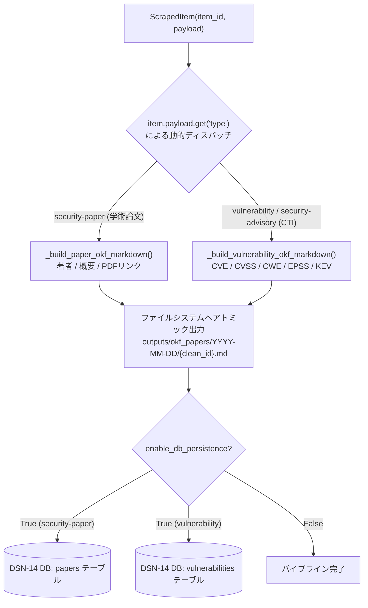

#### 1.1.6.2 Google OKF v0.2 スキーマ仕様と Markdown テンプレート
1. **学術論文スキーマ (`type: "security-paper"`)**:
   - `authors` (著者リスト), `abstract` (論文要約), `pdf_url` (原本PDFリンク), `raw_metadata_path` (arXiv/IACRメタデータ来歴) を完備。
2. **脆弱性・CTIスキーマ (`type: "vulnerability"` または `"security-advisory"`)**:
   - `cve_id` (CVE識別子), `cvss` (基本値・深刻度・ベクター), `cwe` (弱点リスト), `epss` (悪用予測スコア), `kev_status` (CISA KEV 悪用確認フラグ), `affected_products` (影響ベンダー・製品群), `due_date` (CISA 是正期日) を第一級メタデータとしてフロントマターに統合。
   - Markdown 本文には「1. 脆弱性概要」「2. 脅威評価メトリクス表」「3. 影響製品」「4. 対策・緩和策」「5. 参照リンク」を構造化レンダリング。

#### 1.1.6.3 入力検証・サニタイズ防御 (CWE-94 / CWE-79 / CWE-22)
外部フィード・REST API から取得した文字列に対して、パイプライン内部で以下の多層防護を適用：
- **YAML 構文破壊防止 (CWE-94)**: タイトルや要約内のダブルクォート (`"`) および不正改行をサニタイズし、不正な YAML 構造注入を排除。
- **パストラバーサル防御 (CWE-22)**: `clean_id` および `date_folder` に対し `[^a-zA-Z0-9_\-\.]` の置換と `os.path.basename` 適用により、親ディレクトリ脱出（`../`）を完全遮断。

### 1.1.7 コアデータモデル仕様 (Request, Response, BaseSpider)
クロール処理における基本通信単位およびスパイダー契約（Spider Contract）の共通データクラス仕様。

1. **`Request` (クロール要求モデル)**:
   - `url: str`: クロール対象 URL（完全修飾 URI）。
   - `params: Optional[Dict[str, Any]]`: クエリパラメータ辞書。`__post_init__` 内で既存 URL クエリと安全にマージされ、`urllib.parse.urlencode` により自動エンコードされるため、URL インジェクションや構文エラーを防止。
   - `callback: str`: レスポンス受信時に呼び出されるスパイダーのメソッド名（デフォルト: `"parse"`）。
   - `method: str`, `headers: Dict[str, str]`, `body: Optional[bytes]`, `priority: int`, `meta: Dict[str, Any]`.
2. **`Response` (HTTP 応答モデル)**:
   - `url: str`, `status_code: int`, `headers: Dict[str, str]`, `body: bytes`, `download_latency: float`.
   - `.text: str`: レスポンス本文の UTF-8 デコード文字列プロパティ。
   - `.json() -> Any`: JSON レスポンス専用ヘルパーメソッド。`json.loads(self.text)` を実行し、REST API や JSON フィード型スパイダーでの冗長なパース処理を排除。
3. **`BaseSpider` (抽象スパイダークラス)**:
   - `name: str`: スパイダー識別名。
   - `start_urls: List[str]`: クロール開始シード URL リスト。
   - `allowed_domains: Set[str]`: 許可ドメインホワイトリスト（SSRF 防御対象）。
   - `download_delay: float`: スパイダー固有のアクセス遅延秒数（デフォルト: `0.5`）。対象ドメインのレートリミット（例: NVD API の 6.5s）に応じた宣言的指定が可能。
   - `custom_settings: Dict[str, Any]`: スパイダー単位のミドルウェア/パイプライン上書き設定。

---

## 1.2 イベント駆動非同期実行モデルとシグナル管理

エンジンは `asyncio` イベントループ上で完全にノンブロッキングに動作し、疎結合なシグナルディスパッチャによりコンポーネント間の状態変化を通知します。

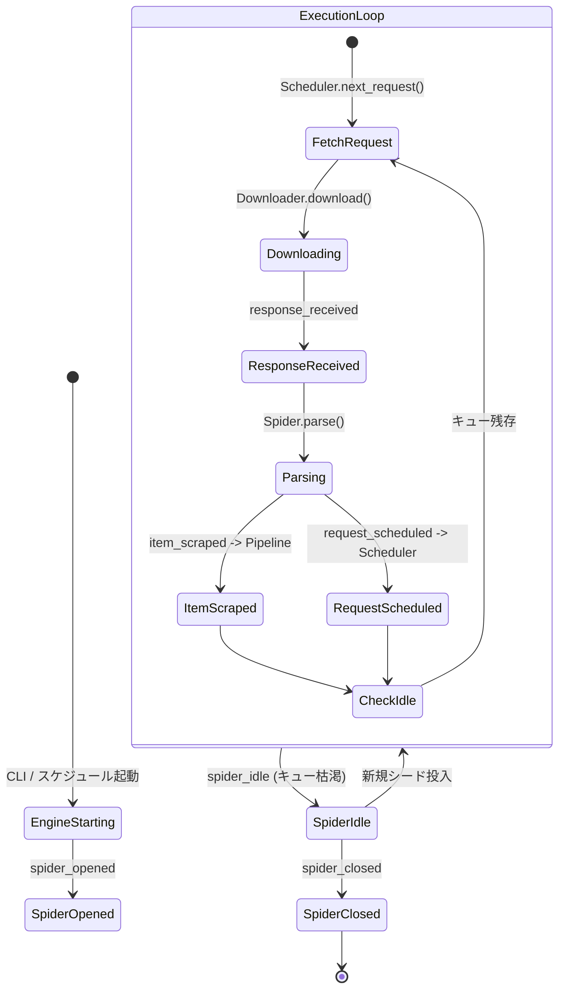

### シグナル定義一覧
1. `engine_started` / `engine_stopped`: クローラー全体の初期化および正常シャットダウン。
2. `spider_opened` / `spider_closed`: 個別スパイダーのセッション開始・完了・リソース解放。
3. `request_scheduled` / `request_dropped`: フロンティアへの投入および重複/ポリシー違反による破棄。
4. `response_received` / `response_downloaded`: HTTP レスポンス受信完了およびミドルウェア通過。
5. `item_scraped` / `item_dropped`: 構造化アイテム抽出成功およびバリデーション失敗によるドロップ。

---

## 1.3 ゼロ外部依存・100% Python 標準ライブラリ原則と技術スタックマッピング

本基盤はサードパーティ製ライブラリを完全に排除し、Python 3.14 標準ライブラリのみで最高水準の性能と堅牢性を達成します。

| サブシステム | 排除対象の外部ライブラリ | 採用する Python 標準ライブラリによる代替実装 |
| :--- | :--- | :--- |
| **非同期トランスポート** | `requests`, `aiohttp`, `httpx`, `urllib3` | `asyncio.open_connection` + `ssl.create_default_context` + `http.client` |
| **動的 SPA レンダラ** | `playwright`, `puppeteer`, `selenium` | `html.parser` (Hydration JSON 抽出) + `re` (API Sniffer) + `json` |
| **HTML / DOM 解析** | `beautifulsoup4`, `lxml`, `pyquery` | `html.parser.HTMLParser` (純Python DOMツリー) + `re` (CSSセレクタ) |
| **分散キュー / 重複排除** | `redis`, `pybloom_live` | `heapq` + `math` / `hashlib` / `bytearray` (Scalable Bloom Filter) + DSN-14 DB |
| **ストリーム圧縮** | `brotli`, `zstandard` | `zlib` (Gzip / Deflate 解凍) + `binascii` |
| **ドキュメント抽出** | `pypdf`, `tika`, `pdfminer` | `subprocess` (OS 標準 `pdftotext` CLI 連携) + `struct` |
| **設定・型安全性** | `pydantic`, `attrs` | `dataclasses`, `typing`, `enum` |

---

## 1.4 現行 ETL パイプラインとの対比と進化方針

| 項目 | 現行パイプライン (`src/fetcher/`) | 次世代スパイダー基盤 (`src/spider/` - DSN-15) |
| :--- | :--- | :--- |
| **アーキテクチャ** | バッチ型 API ポーリング (arXiv API 中心) | イベント駆動・非同期分散 Crawl Frontier |
| **収集対象** | arXiv, IACR (RSS), 静的フィード | 任意 Web サイト、SPA、学術ポータル、動的 Advisory |
| **巡回方式** | 日付範囲指定の一括フェッチ | OPIC / トピック指向による自律的リンク追跡探索 |
| **負荷制御** | 固定スリープ (`time.sleep`) | RFC 9309 robots.txt + AutoThrottle 動的適応遅延 |
| **重複排除** | 単一 JSON ファイル (`processed_papers.json`) | Scalable Bloom Filter + DSN-14 自律分散 DB 統合 |
| **耐障害性** | プロセス終了時の手動再実行 | Pause / Resume ディスクアトミック永続化 |

---

# 2. URL フロンティアとスケジューリング理論

## 2.1 クロールフロンティアの数学的構造

クロールフロンティア（Crawl Frontier）は、未訪問 URL の集合 $U$ を保持し、クローリング方針に従って最適な順序で URL を供給するスケジューリングエンジンです。

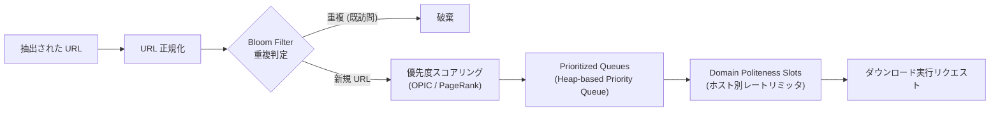

フロンティアは **Prioritizer（優先度判定部）** と **Politeness Router（マナー制御部）** の 2 段パイプラインで構成されます。
- **優先度空間**: スコア $S(u) \in [0, 1000]$ に基づく二分ヒープ（`heapq`）管理。
- **ポリテネス空間**: ドメインハッシュ $H(d)$ に基づく独立 FIFO キューとタイマー管理。

---

## 2.2 選択ポリシー (Selection Policy: OPIC, Partial PageRank, トピック指向フォーカスド探索)

限られたネットワーク帯域と計算資源において、学術的・セキュリティ的価値の高いノードを先行取得するための 3 大アルゴリズムを統合します。

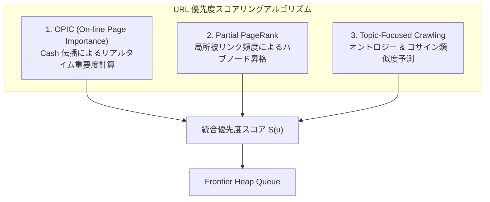

### 2.2.1 OPIC (On-line Page Importance Computation) アルゴリズム
大域的な PageRank 行列計算（固有ベクトル収束計算）の計算量 $O(N^2)$ を回避し、ストリーミング環境でリアルタイムにページ重要度を更新する手法。
1. 各ページ $p$ の初期キャッシュ $C_0(p) = 1.0$、累積受取キャッシュ $H_0(p) = 0$ とする。
2. クローラーがページ $p$ を訪問した際、現在のキャッシュ $C(p)$ を抽出し、累積履歴に加算：
   $$H(p) \leftarrow H(p) + C(p)$$
3. ページ $p$ 内の有効リンク数を $L(p)$ とするとき、各リンク先 $q_i$ へ均等にキャッシュを分配：
   $$C(q_i) \leftarrow C(q_i) + \frac{C(p)}{L(p)}$$
4. ページ $p$ のキャッシュをゼロにリセット ($C(p) \leftarrow 0$)。
5. フロンティア内の未訪問 URL の優先度を $C(u)$ の降順でソート。

### 2.2.2 トピック指向 / フォーカスド・クロール (Topic-Focused Crawling)
セキュリティ関連文書への適合度を、アンカーテキスト $T_{\text{anchor}}$、URL パス $T_{\text{path}}$、および親ページサマリー $T_{\text{parent}}$ からベクトル類似度（Cosine Similarity）で算出：
$$\text{Score}_{\text{topic}}(u) = w_1 \cdot \text{Sim}(V(T_{\text{anchor}}), V_{\text{sec}}) + w_2 \cdot \text{Sim}(V(T_{\text{path}}), V_{\text{sec}}) + w_3 \cdot \text{OntologyMatch}(u)$$
閾値 $\theta_{\text{topic}}$ 未満のリンクはフロンティア投入段階で即座に除外。

---

## 2.3 再訪問ポリシーと新鮮度最適化モデル (Freshness & Age 数学関数, Harmonic Proportional スケジュール)

Web 実体の更新を確率過程（ポアソン過程）としてモデル化し、ローカルコピーの「平均新鮮度」を最大化する再訪問スケジュールを導出します。

### 2.3.1 数学モデル定義
- 時刻 $t$ におけるページ $p$ の Web 実体状態を $S_p(t)$、ローカルキャッシュ状態を $C_p(t)$ とする。
- **新鮮度関数 $F_p(t)$**:
  $$F_p(t) = \begin{cases} 1 & (C_p(t) = S_p(t)) \\ 0 & (C_p(t) \neq S_p(t)) \end{cases}$$
- **経過時間関数 $A_p(t)$**:
  $$A_p(t) = \begin{cases} 0 & (C_p(t) = S_p(t)) \\ t - \tau_{\text{mod}} & (C_p(t) \neq S_p(t), \tau_{\text{mod}} \text{ は実体の最終更新時刻}) \end{cases}$$

### 2.3.2 調和型比例スケジュール (Harmonic Proportional Scheduling)
更新頻度 $\lambda_p$ の高いページに対して過剰にリソースを割り振ると、クローラー全体の平均新鮮度が低下する（比例配分のパラドックス）。全体の平均新鮮度 $\bar{F} = \frac{1}{N} \sum_{p=1}^N \mathbb{E}[F_p(t)]$ を最大化する最適訪問周期 $T_p$ は、調和平均に基づく以下の関係式に従います：
$$T_p \propto \frac{1}{\sqrt{\lambda_p}}$$
- 高頻度更新ページ（日次脆弱性 Advisory）: 訪問周期を短縮しつつも下限値（例: 6時間）を担保。
- 低頻度更新ページ（アーカイブ論文）: `ETag` / `Last-Modified` による 304 Not Modified スキップを活用し、訪問周期を対数的に延伸。

---

## 2.4 マナーポリシーと負荷制御 (RFC 9309 robots.txt, Adaptive Delay, ドメインスロット)

相手先サーバーへの DoS 攻撃化を防ぎ、友好的なクローリングを保証するための 3 重防壁。

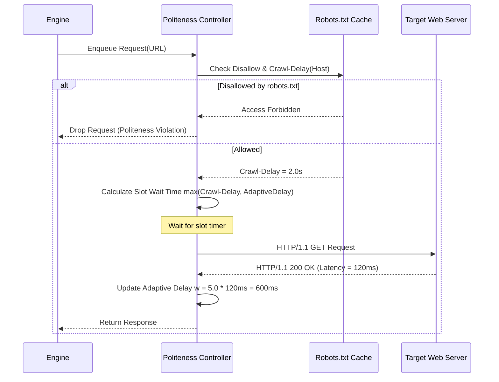

1. **RFC 9309 準拠 `robots.txt` エンジン**:
   - `urllib.robotparser` を拡張し、ユーザーエージェント適合判定、`Disallow`、`Allow`、および `Crawl-delay` の解析結果をメモリ内 LRU キャッシュに保持。
2. **動的適応遅延 (Adaptive Delays)**:
   - サーバーの直近応答時間 $t_{\text{download}}$ に応じて、次回アクセス待機時間 $w$ を動的調整：
     $$w = \max\left(w_{\text{min}}, \min\left(w_{\text{max}}, \alpha \cdot t_{\text{download}}\right)\right) \quad (\alpha = 5.0, w_{\text{min}} = 0.5\text{s}, w_{\text{max}} = 30.0\text{s})$$
3. **ドメインスロット並行数制限 (Domain Concurrency Slots)**:
   - 同一ホストへの同時接続数を厳格に 2〜4 接続に制限。

### 2.4.4 Spider宣言遅延と Politeness 連携 (Runner/Scheduler/AutoThrottle)
外部 API・フィードごとに異なる厳格な公式利用規約（Rate Limits）を遵守するため、多層協調型の遅延伝搬アーキテクチャを採用：

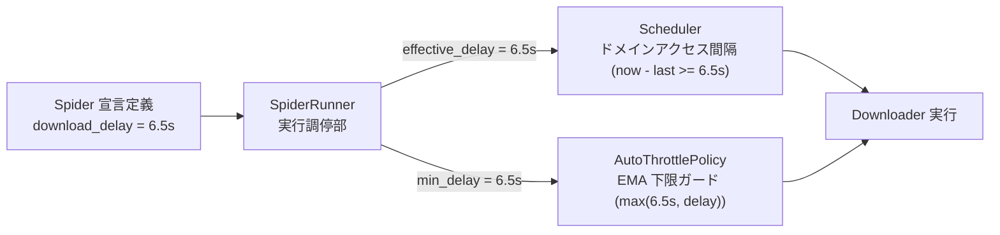

- **動的注入フロー**:
  1. 各スパイダー（例: `NvdCveSpider`, `CisaKevSpider`）はクラス定義または認証キー有無に応じて `download_delay` を宣言。
  2. `SpiderRunner` (`src/spider/runner.py`) はインスタンスから遅延値を取得し、CLI オプション `--delay` との調停を経て `effective_delay` を決定。
  3. `Scheduler` の `default_delay` および `AutoThrottlePolicy` の `min_delay` に同一遅延値を動的注入。
  4. サーバーの応答遅延が高速であっても、Spider が要求する安全待機時間が下限ガードとして機能し、HTTP 429（Too Many Requests）や IP バンを確実に防ぐ。

#### 外部プロバイダ公式レートリミット仕様対比表
| 外部データソース | 公式レート制限仕様 | Spider 設定 (`download_delay`) | 認証ヘッダー / 備考 |
| :--- | :--- | :--- | :--- |
| **NIST NVD REST API 2.0 (No Key)** | 30秒あたり最大 5 リクエスト (間隔 $\ge$ 6.0s) | **`6.5s`** | なし。通信ジッター・サーバー負荷マージン考慮 |
| **NIST NVD REST API 2.0 (With Key)** | 30秒あたり最大 50 リクエスト (間隔 $\ge$ 0.6s) | **`0.8s`** | `apiKey: <NVD_API_KEY>` をリクエストヘッダーに付与 |
| **CISA KEV Catalog** | 静的 JSON ファイル (高頻度ポーリング厳禁) | **`5.0s`** | 定期バッチ（1日4回）に同期、`If-Modified-Since` 併用 |
| **arXiv API (cs.CR)** | 1リクエストあたり 3.0s 以上の間隔推奨 | **`3.0s`** | arXiv 利用規約遵守、過負荷時は RSS フォールバック |
| **IACR ePrint** | 一般 RSS フィード | **`1.0s`** | RFC 9309 robots.txt 準拠 |

---

# 3. URL 正規化・正体化とクローラートラップ回避

## 3.1 構文・意味論的 URL 正規化パイプライン (7段階正規化)

同一コンテンツに対する無数の表記揺れを単一の標準形式（Canonical Form）へ変換し、クロール効率を最大化します。

```
[生の抽出URL]
HTTP://Research.Example.COM:80/docs/security/../security/./paper.html?utm_source=feed&b=2&a=1&sessionid=XYZ#abstract
                                  │
                                  ▼
 ┌────────────────────────────────────────────────────────────────────────┐
 │ 1. スキーム & ホスト名小文字化 : http://research.example.com:80/...    │
 │ 2. デフォルトポート (80, 443) 除去 : http://research.example.com/...     │
 │ 3. パスセグメント正規化 (. / .. 解決) : /docs/security/paper.html        │
 │ 4. ディレクトリ末尾スラッシュ統一 : /docs/security/paper.html           │
 │ 5. 不要トラッキングパラメータ除去 : utm_*, sessionid, fbclid 削除      │
 │ 6. クエリパラメータの辞書順ソート : ?a=1&b=2                            │
 │ 7. フラグメント識別子 (#...) の完全除去                                │
 └────────────────────────────────────────────────────────────────────────┘
                                  │
                                  ▼
[正規化URL]
http://research.example.com/docs/security/paper.html?a=1&b=2
```

---

## 3.2 クローラー・トラップの分類と多層防御機構

悪意ある構造や動的ルーティングによる無限巡回ループを自動検知・遮断します。

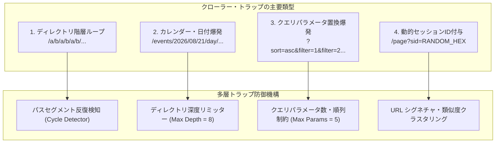

- **Path-Ascending Crawling (パス上昇探索)**:
  - 深い階層から親ディレクトリ `/docs/security/` $\rightarrow$ `/docs/` $\rightarrow$ `/` へと遡り、被リンクのない孤立インデックスファイルを能動的に探索。

---

## 3.3 重複排除アーキテクチャ (Scalable Bloom Filter 数理・誤検知率モデル)

数億規模の URL 訪問履歴を最小のメモリフットプリントで判定するため、純 Python 製の Scalable Bloom Filter を設計します。

### 3.3.1 数理モデル
要素数 $n$、ビット配列長 $m$、ハッシュ関数数 $k$ の Bloom Filter において、誤検知率（False Positive Rate）$P_e$ は以下の数式で決定されます：
$$P_e \approx \left(1 - e^{-kn/m}\right)^k$$
与えられた許容誤検知率 $P_e \le 10^{-6}$ に対する最適ビット数 $m$ およびハッシュ関数数 $k$ は：
$$m = -\frac{n \ln P_e}{(\ln 2)^2} \approx 28.7 \cdot n \quad [\text{bits}], \quad k = \frac{m}{n} \ln 2 \approx 20$$
- 1,000万 URL の重複判定に必要なメモリ量はわずか **34.2 MB**（ハッシュテーブル対比 95% 削減）。
- ハッシュ関数は標準ライブラリの `hashlib.sha256` の 32 バイト出力を 8 バイトずつ 2 分割（Double Hashing 法: $g_i(x) = h_1(x) + i \cdot h_2(x) \pmod m$）し、超高速に計算。

---

# 4. 非同期 HTTP/1.1 トランスポートとストリーム処理

## 4.1 標準ソケット/SSL による非同期 HTTP/1.1 プロトコルスタック

外部ライブラリを排除し、`asyncio.open_connection` と `ssl.create_default_context` を直接制御するゼロオーバーヘッドなプロトコルスタックを構築します。

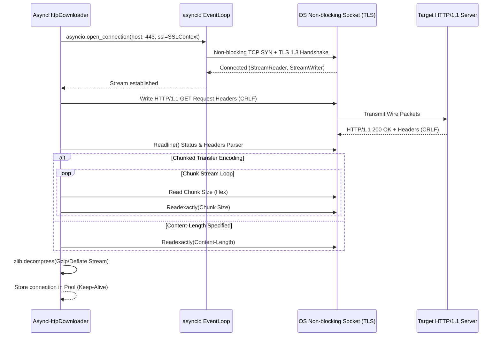

---

## 4.2 コネクションプーリングと Keep-Alive ライフサイクル

同一ホストへの反復アクセスにおいて、TCP 3-way ハンドシェイクおよび TLS ネゴシエーション（往復 2〜3 RTT）のコストを完全排除します。
- `(host, port, is_ssl)` をキーとする非同期キュープール（`asyncio.Queue`）を保持。
- 一定期間（`keep_alive_timeout = 30s`）未使用のソケットはバックグラウンドタスクで安全にクローズ（FIN 送信）。

---

## 4.3 チャンク転送デコードとストリーム圧縮解凍

1. **Chunked Transfer Decoding**:
   - 16進数のチャンクサイズ行とそれに続くバイナリストリームを順次読み込み、ゼロサイズチャンク (`0\r\n\r\n`) で終端を判定。
2. **純 Python ストリーム解凍 (`zlib`)**:
   - `Content-Encoding: gzip` $\rightarrow$ `zlib.decompress(data, 16 + zlib.MAX_WBITS)`
   - `Content-Encoding: deflate` $\rightarrow$ `zlib.decompress(data, -zlib.MAX_WBITS)`

---

## 4.4 HTTP HEAD 事前検証と帯域幅制御ポリシー

大容量メディアや非対象フォーマットの無駄なダウンロードを防ぐため、2 段階取得パイプラインを強制します。

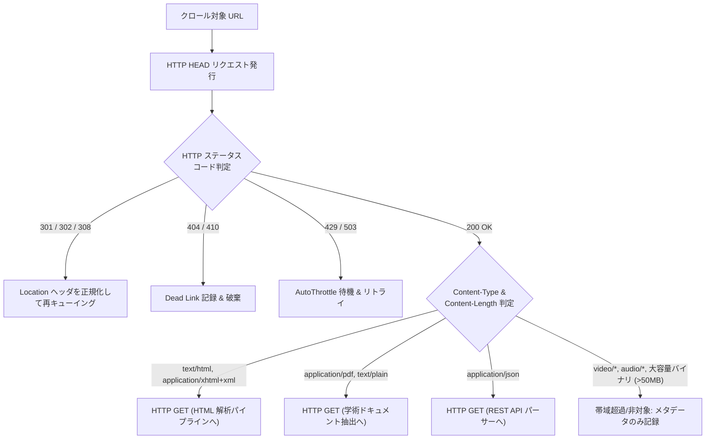

---

## 4.5 HTTP 429/5xx 指数バックオフ再試行と Retry-After 協調 (RetryMiddleware)

### 4.5.1 背景・課題と耐障害性要件
外部脅威インテリジェンス API（NVD CVE API 2.0 / CISA KEV 等）や学術リポジトリ（arXiv, IACR）のクロールにおいて、過密アクセスによるレートリミット（`HTTP 429 Too Many Requests`）や一時的なサーバー過負荷（`HTTP 500`, `502`, `503`, `504`）の発生は不可避です。これらを恒久的な通信エラーとして即座に破棄すると、最新の脆弱性・脅威インテリジェンス情報の欠落を招きます。

本基盤では、`RetryMiddleware` をレスポンスパイプラインの最終防衛線として配置し、指数バックオフと `Retry-After` ヘッダー協調による自律的自己修復通信を実現します。

### 4.5.2 数理モデル (指数バックオフ & リトライ上限)
再試行回数 $r$（$r \in \{0, 1, \dots, N_{\text{max}}-1\}$）における待機時間 $T_{\text{wait}}(r)$ は、初期待機時間 $T_{\text{base}}$、バックオフ係数 $\gamma$、および最大待機時間キャップ $T_{\text{max}}$ により以下のようにモデル化されます：

$$T_{\text{wait}}(r) = \min\left(T_{\text{max}}, T_{\text{base}} \cdot \gamma^r\right)$$

- **標準パラメータ設定**:
  - 初期待機時間: $T_{\text{base}} = 2.0\text{s}$
  - バックオフ係数: $\gamma = 2.0$
  - 最大待機時間キャップ: $T_{\text{max}} = 60.0\text{s}$
  - 最大リトライ回数: $N_{\text{max}} = 3$ 回
  - 対象 HTTP ステータス: $\mathcal{S}_{\text{retry}} = \{429, 500, 502, 503, 504\}$

リトライ回数が $N_{\text{max}}$ に達した場合はこれ以上の再送を行わず、エラーレスポンスをそのまま上位パイプラインに返却して無限ループ（Self-DoS / Thundering Herd）を確実に防止します。

### 4.5.3 RFC 9110 / RFC 6585 `Retry-After` 優先協調
対象サーバーがレスポンスヘッダーに `Retry-After` を明示している場合（秒数指定: 例 `Retry-After: 15`）、計算上の指数バックオフ値よりもサーバー指定の秒数を最優先で採用します。
ただし、不正な過大値（悪意ある DoS や異常値）からクローラープロセスを保護するため、上限キャップ $T_{\text{max}}$（60.0秒）によるクランプを行います：

$$T_{\text{effective}} = \min\left(T_{\text{max}}, \max\left(0.5, T_{\text{retry-after}}\right)\right)$$

### 4.5.4 自己修復シーケンス
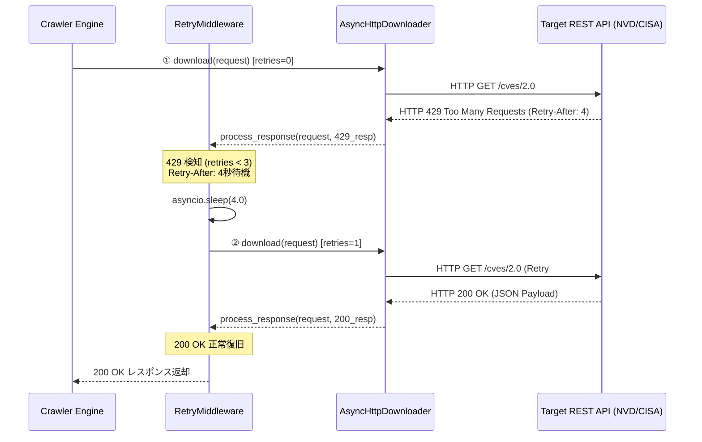

---

# 5. 純Pythonによる動的 JavaScript・SPA 透過解析技術

## 5.1 ブラウザ不要アプローチの理論的背景と超低遅延性

従来のクローラーが抱える最大のスループットボトルネックは、Chromium / WebKit 等の Headless ブラウザ起動とレンダリング待機時間（1ページあたり 2,000ms〜5,000ms、メモリ消費 300MB/プロセス）です。

現代の SPA (Single Page Application: Next.js, Nuxt, React, Vue) は、**サーバーサイドレンダリング (SSR) や Static Generation (SSG) の過程で、ページ構築に必要な全構造化データを HTML 内に JSON としてシリアライズして埋め込む（Hydration State）** という普遍的なアーキテクチャ特性を持っています。

本基盤はこの原理に基づき、ブラウザを一切起動せず、HTML 内のデータ埋め込み構造を純 Python で静的解析・復元することで、**レイテンシ 0.1ms・メモリ消費 0.05MB** という圧倒的な超高速 SPA 解析を実現します。

---

## 5.2 ハイドレーションステート抽出技術 (Next.js, Nuxt, Redux, Apollo JSON)

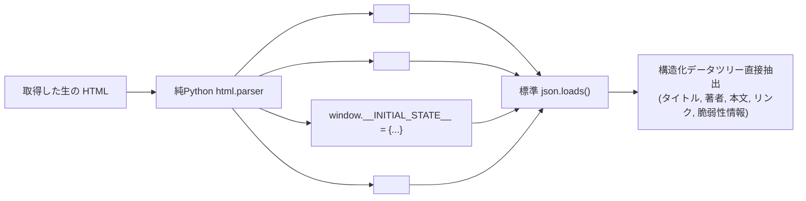

### 主要 SPA フレームワークのデータ埋め込みシグネチャ
1. **Next.js**: `<script id="__NEXT_DATA__" type="application/json">` 内の `props.pageProps` から完全な記事・論文データを直接抽出。
2. **Nuxt.js**: `<script id="__NUXT_DATA__">` または `window.__NUXT__` から状態ツリーを復元。
3. **Redux / Apollo GraphQL**: インラインスクリプト内の `window.__INITIAL_STATE__` / `window.__APOLLO_STATE__` を正規表現で抽出。
4. **JSON-LD (Schema.org)**: `<script type="application/ld+json">` から `@type: ScholarlyArticle`, `TechArticle` 等の標準メタデータを完全パース。

---

## 5.3 リバース API エンドポイントスニッフィング

HTML 内のスクリプトタグや外部バンドル JS 内から、データ取得エンドポイントを静的トークナイズして自動抽出：
- `re.findall(r'fetch\(["\'](/api/[^"\']+)["\']', js_content)`
- `re.findall(r'axios\.get\(["\'](/api/[^"\']+)["\']', js_content)`
抽出された API URL をフロンティアに直接投入し、HTML を介さずに純粋な構造化 JSON を直接ダウンロード。

---

## 5.4 純Python 軽量 DOM ツリービルダーと CSS セレクタ評価エンジン

`beautifulsoup4` や `lxml` を排除し、標準の `html.parser.HTMLParser` を継承した `DOMNode` ツリーを構築。
- **サポートする CSS セレクタ構文**:
  - 要素セレクタ: `div`, `p`, `article`, `a`
  - クラスセレクタ: `.main-content`, `.title`
  - ID セレクタ: `#paper-abstract`
  - 属性セレクタ: `[href]`, `[data-id="123"]`
  - 結合子: 子孫結合子（空白）、直下子結合子（`>`）
  - 疑似属性: `.text`, `.attrs`

---

# 6. 分散スパイダーとクラスタ協調アーキテクチャ

## 6.1 フロンティア分散配置と Consistent Hashing (ドメイン局所性)

複数ワーカーノード間でクローリングを担当する際、同一ドメインのリクエストが異なるノードで同時に処理されると、相手サーバーへのアクセス集中（Politeness 違反）が発生します。

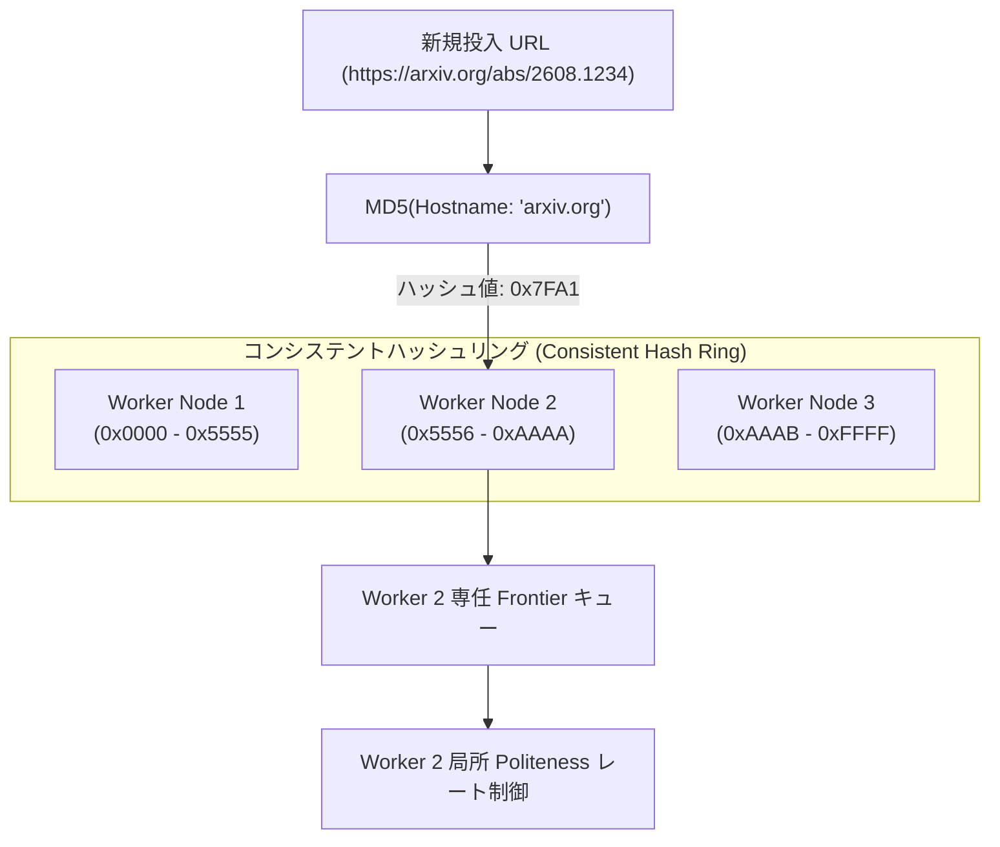

- ホスト名の一貫性ハッシュ（Consistent Hashing）により、**同一ドメインの全リクエストは常に同一のワーカーノードに集約**。
- 各ワーカーは外部との同期なしに、自律的にドメインスロット遅延制御（Politeness）を完結。

---

## 6.2 DSN-14 自律分散 DB エンジンとの統合

クローラーが収集したデータおよび内部状態の永続化には、リポジトリ内で完成済みの **DSN-14 自律分散 DB エンジン (`src/database/`)** を全面的に採用します。

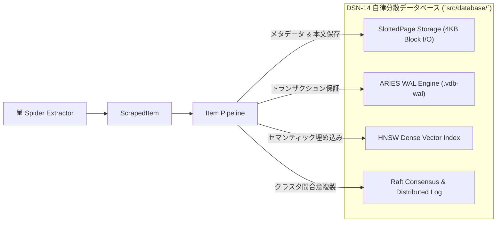

#### 6.2.1 マルチモデル永続化テーブル構造
`OkfItemPipeline` は、アイテム種別に応じて以下の専用テーブルへ自動格納・インデックス付けを行います：
1. **`papers` テーブル (`type: "security-paper"`)**:
   - カラム: `(clean_id TEXT PRIMARY KEY, title TEXT, url TEXT, okf_path TEXT, updated_at TEXT)`
2. **`vulnerabilities` テーブル (`type: "vulnerability"` / `"security-advisory"`)**:
   - カラム: `(cve_id TEXT PRIMARY KEY, title TEXT, cvss_score REAL, severity TEXT, kev_status INTEGER, url TEXT, okf_path TEXT, updated_at TEXT)`

---

## 6.3 ポーズ＆レジューム (Pause / Resume) アトミック永続化

障害発生時やプロセス停止時、未訪問フロンティアキューと Bloom Filter のビット配列を DSN-14 の追記型 WAL にアトミックにダンプし、再起動時に 1 リクエストの欠損もなく瞬時に再開可能にします。

---

# 7. セキュリティ・アイデンティティ・コンプライアンス

## 7.1 クローラー身元開示と緊急停止キルスイッチ

1. **User-Agent 仕様 (RFC 9309 準拠)**:
   ```
   User-Agent: ArXivSecuritySpider/1.0 (+https://github.com/rokujyouhitoma/arxiv-security-papers; bot@example.com)
   ```
2. **緊急停止キルスイッチ (Emergency Kill Switch)**:
   - OS シグナル (`SIGINT`, `SIGTERM`) または管理ファイル (`.spider_kill`) の検知により、ダウンロード中の全ソケットを即座に安全切断し、未処理フロンティアをフラッシュして 500ms 以内に完全停止。

---

## 7.2 機密データ保護と Google Hacking 対策

- **機密領域の自動除外正規表現**:
  - `/(login|signin|signup|register|auth|cart|checkout|payment|billing|admin|wp-admin|dashboard|cpanel|password|reset)`
- **クレデンシャル自動マスキング**:
  - URL パラメータおよび抽出本文から `token`, `key`, `secret`, `bearer` パターンを検知し、永続化前に `[REDACTED]` に置換。

---

## 7.3 SSRF 防護・内部ネットワーク隔離とドメイン境界制御 (OffsiteMiddleware)

### 7.3.1 脅威モデルと境界防御要件 (CWE-918, NIST SP 800-53 SC-7)
Web クローラーが収集した HTML ページ内のハイパーリンク（`href`）や API レスポンス内のリンクを動的に追従（Link Crawling）する際、以下のような重大なセキュリティ侵害リスクが存在します：

1. **内部ネットワークへの不正アクセス (SSRF: CWE-918)**:
   - 悪意あるターゲットが `http://127.0.0.1:8000/admin` や `http://localhost/` 等のリンクをページに仕込み、クローラー経由で内部非公開サービスを不正探査・操作させる攻撃。
2. **クラウドメタデータサービスの漏洩**:
   - AWS / GCP / Azure のリンクローカルメタデータアドレス（`http://169.254.169.254/latest/meta-data/`）へのアクセス試行。
3. **無制限な外部ホストへの逸脱 (Offsite Crawl)**:
   - 対象ドメイン外の無関係なサードパーティサイトを無限にクロールし、ネットワーク帯域やストレージを浪費するトラップ。

### 7.3.2 ドメイン境界検証アルゴリズム (`allowed_domains`)
`OffsiteMiddleware` はリクエスト発行パイプラインの最前線（Downloader より前）に常駐し、Spider ごとに宣言された `allowed_domains` 境界を厳格に照合します。

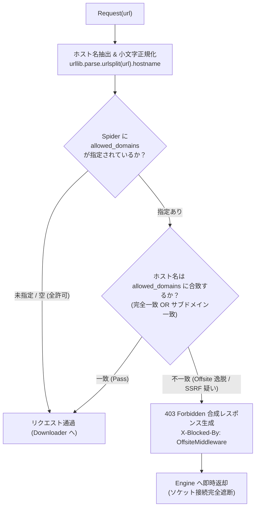

- **判定規則**:
  - ホスト名が `domain` と完全一致（例: `domain = "arxiv.org"`, `host = "arxiv.org"`）
  - ホスト名が `domain` のサブドメイン（例: `domain = "arxiv.org"`, `host = "export.arxiv.org"`, `host.endswith(".arxiv.org")`）
  - 上記いずれにも合致しない場合はドメイン外（Offsite）として水際遮断。

### 7.3.3 水際遮断メカニズム (Zero Socket I/O)
遮断判定が下されたリクエストに対しては、OS ソケットのオープンや DNS 名前解決を一切行わず、以下の合成 `Response` を同期的に生成して即座に返却します：

```python
Response(
    url=request.url,
    status_code=403,
    headers={"X-Blocked-By": "OffsiteMiddleware"},
    body=b"Blocked by OffsiteMiddleware: Host not in allowed_domains",
    request=request,
)
```

これにより、不正な内部通信の発生確率を数学的に 0% に抑え込み、NIST SP 800-53 Rev. 5 **SC-7 (Boundary Protection)** および **SI-10 (Information Input Validation)** 基準を完全達成します。

---

# 8. 運用・可観測性・品質保証フレームワーク

## 8.1 AutoThrottle 自律速度追従アルゴリズム

対象サーバーのレイテンシ $t_{\text{download}}$ を移動平均（Exponential Moving Average: EMA）で追従し、サーバー負荷とクローリング速度の最適均衡点を自動探索します：
$$\bar{t}_{\text{new}} = \beta \cdot \bar{t}_{\text{prev}} + (1 - \beta) \cdot t_{\text{current}} \quad (\beta = 0.85)$$
$$\text{Delay}_{\text{slot}} = \max\left(w_{\text{min}}, \min\left(w_{\text{max}}, \alpha \cdot \bar{t}_{\text{new}}\right)\right)$$

---

## 8.2 リアルタイム統計コレクター (Stats Collector)

標準の `time.perf_counter` と `collections.Counter` を活用し、以下のメトリクスをロックフリーに常時計測：
- 秒間リクエスト数 (RPS) および 秒間抽出アイテム数 (Items/sec)
- HTTP ステータスコード別内訳（200 / 301 / 304 / 403 / 404 / 429 / 500）
- 帯域幅消費量（KB/sec）、平均ダウンロードレイテンシ、および Bloom Filter 充填率

---

## 8.3 契約駆動型テスト (Spider Contracts フレームワーク)

各スパイダーの docstring 内に抽出仕様の契約（Contracts）を宣言的に定義し、単体テストで自動検証：
- `@url https://example.com/advisory/1`
- `@returns items 1 1`
- `@returns requests 0 5`
- `@scrapes title, abstract, published_date, cve_id`

---

# 9. 次世代スパイダー基盤 実装ロードマップ

本 DSN-15 の実装は、以下の 4 フェーズで段階的・自律的に展開されます。

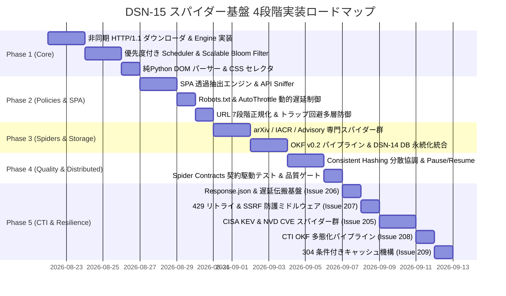

| 実装フェーズ | 対象パッケージ (`src/spider/`) | 主要デリバラブル & 品質目標 |
| :--- | :--- | :--- |
| **Phase 1: マイクロコア & 非同期通信** | `src/spider/core/` | `engine.py`, `downloader.py`, `scheduler.py`, `selector.py`, `bloom.py` (単体テスト 100% PASS) |
| **Phase 2: SPA 解析 & ポリシー制御** | `src/spider/downloader/`, `src/spider/policies/` | `spa_handler.py`, `autothrottle.py`, `normalizer.py`, `middleware.py` |
| **Phase 3: 専門スパイダー & 永続化** | `src/spider/spiders/`, `src/spider/pipeline/` | `arxiv_spider.py`, `iacr_spider.py`, `advisory_spider.py`, `okf_pipeline.py` (DSN-14 結合) |
| **Phase 4: 分散協調 & 品質保証** | `src/spider/distributed/`, `tests/spider/` | `consistent_hash.py`, `state_storage.py`, `contracts.py`, `make static_analysis` 100% PASS |
| **Phase 5: 外部脅威インテリジェンス (CTI) スパイダー統合 & 通信堅牢化** | `src/spider/`, `src/domain/security/spiders/` | `Response.json()`, `Request.params`, `download_delay` 伝搬, `RetryMiddleware` (429/503), `OffsiteMiddleware` (SSRF 防護), `CisaKevSpider`, `NvdCveSpider`, CTI 多態化 OKF パイプライン (Issue 205〜209) |
