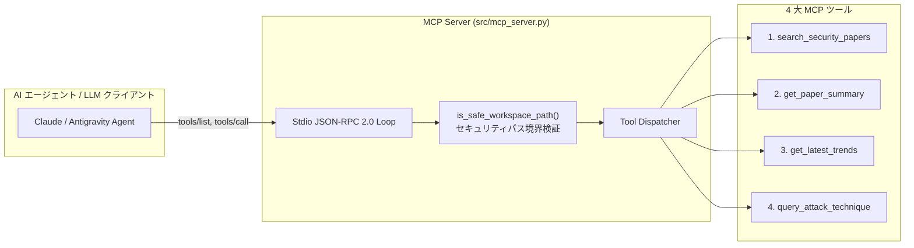

# [DSN-06] 機能設計書: Model Context Protocol (MCP) サーバ — arxiv-security-papers

本ドキュメントは、主要機能 **F-05 (Model Context Protocol JSON-RPC 2.0 サーバ ＆ AI ツール連携)** の通信プロトコル、4 大 MCP ツール仕様、およびワークスペースパス境界セキュリティガードを記録する個別機能設計書です。

---

## 1. 通信アーキテクチャ (Stdio JSON-RPC 2.0 Protocol)

本 MCP サーバ ([`src/mcp_server.py`](../../src/mcp_server.py)) は、Anthropic / Google 提唱の Model Context Protocol (MCP) JSON-RPC 2.0 規格に準拠し、Stdio (標準入出力) 経由で自律型 AI エージェントや LLM クライアントと通信します。



---

## 2. 4 大 MCP ツール詳細仕様

| ツール名 (Tool Name) | 入力引数 (Schema) | 出力フォーマット | 処理内容 |
| :--- | :--- | :--- | :--- |
| **`search_security_papers`** | `query`: string<br/>`top_k`: int<br/>`category`: string | JSON Array (id, title, desc, score, tags) | 5手法統合マルチエンジンによる類似論文検索 |
| **`get_paper_summary`** | `arxiv_id`: string | JSON (arxiv_id, okf_content, summary) | 指定 `arxiv_id` の OKF v0.2 ドキュメントおよび日本語要約返却 |
| **`get_latest_trends`** | `period`: string (`monthly`, `quarterly`, `annual`) | JSON (period, trend_markdown, mindmap) | 期間指定での動的トレンド情報および Mermaid マインドマップ返却 |
| **`query_attack_technique`**| `attack_id`: string (例: `T1059`) | JSON (attack_id, matching_papers) | MITRE ATT&CK テクニック ID に紐づく対策論文の逆引き |

---

## 3. セキュリティパス境界検証機能 (`is_safe_workspace_path`)

ワークスペース外のファイル参照や機密情報（`.env`, `.ssh`, `etc/passwd`）へのアクセスを物理的に遮断するため、すべてのツール実行前に以下の検証を実施します。

```python
def is_safe_workspace_path(file_path: str) -> bool:
    real_path = os.path.realpath(file_path)
    real_workspace = os.path.realpath(WORKSPACE_DIR)
    if not real_path.startswith(real_workspace):
        return False
    forbidden = [".ssh", ".env", "etc/passwd", "config.json"]
    if any(f in real_path for f in forbidden):
        return False
    return True
```
