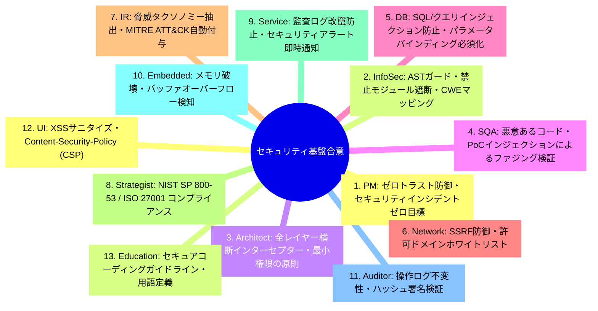
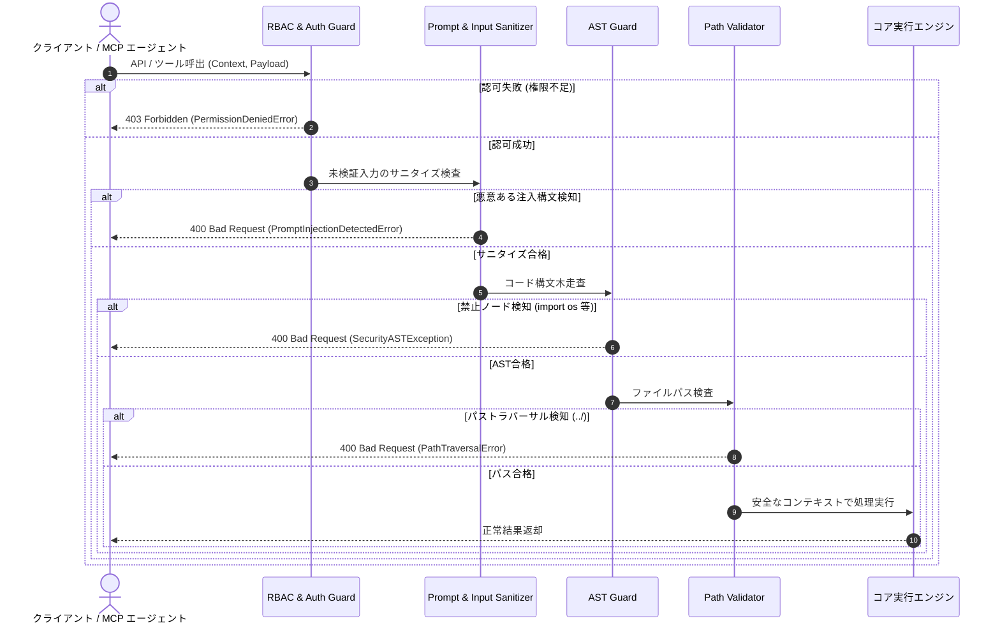

# [DSN-07] 共通セキュリティ基盤・ASTガード＆RBACエンジン設計書 (Repository Security, AST Guard & Threat Defense) — arxiv-security-papers

- **文書番号**: `DSN-07`
- **文書ステータス**: `APPROVED`
- **対象サブシステム**: `src/security/` (RBAC, AST Guard, Path Validation, Taxonomy, Sandbox)
- **関連パッケージ**: システム全体 (`src/`)
- **作成日**: 2026-08-22
- **最終更新日**: 2026-08-28
- **【主査・報告】 Information Security Specialist (Sec) & Systems Auditor (Aud)**  
- **【参画】 Project Manager (PM), Systems Architect (SA), Software QA Specialist (QA), Database Specialist (DB), Network Specialist (Net), IT Specialist (NLP/IR)**

---

## 体系目次

- [1. セキュリティアーキテクチャとゼロトラスト防御思想](#1-セキュリティアーキテクチャとゼロトラスト防御思想)
  - [1.1 サブシステムミッションと防御対象](#11-サブシステムミッションと防御対象)
  - [1.2 ゼロトラスト（Never Trust, Always Verify）原則と境界モデル](#12-ゼロトラストnever-trust-always-verify原則と境界モデル)
  - [1.3 多層防御（Defense-in-Depth）レイヤリング](#13-多層防御defense-in-depthレイヤリング)
  - [1.4 全13大専門エージェント合意議事録](#14-全13大専門エージェント合意議事録)
  - [1.5 第1章の要約](#15-第1章の要約)
- [2. AST セキュリティガード & 実行サンドボックス](#2-ast-セキュリティガード--実行サンドボックス)
  - [2.1 Python AST 抽象構文木解析の基本原理](#21-python-ast-抽象構文木解析の基本原理)
  - [2.2 禁止構文ノード・ブラックリストとホワイトリスト照合アルゴリズム](#22-禁止構文ノードブラックリストとホワイトリスト照合アルゴリズム)
  - [2.3 再帰深度制限・計算量爆発（DoS）防止](#23-再帰深度制限計算量爆発dos防止)
  - [2.4 動的インポート・難読化バイパスの静的検知](#24-動的インポート難読化バイパスの静的検知)
  - [2.5 第2章の要約](#25-第2章の要約)
- [3. パストラバーサル防御 & ファイルシステムシールド](#3-パストラバーサル防御--ファイルシステムシールド)
  - [3.1 ディレクトリトラバーサル攻撃ベクトル](#31-ディレクトリトラバーサル攻撃ベクトル)
  - [3.2 パス正規化と安全な Jail 閉じ込めアルゴリズム](#32-パス正規化と安全な-jail-閉じ込めアルゴリズム)
  - [3.3 シンボリックリンク解決とレースコンディション（TOCTOU）対策](#33-シンボリックリンク解決とレースコンディションtoctou対策)
  - [3.4 ワークスペース境界隔離仕様](#34-ワークスペース境界隔離仕様)
  - [3.5 第3章の要約](#35-第3章の要約)
- [4. マルチテナント RBAC / ABAC 認可エンジン](#4-マルチテナント-rbac--abac-認可エンジン)
  - [4.1 ロール定義と権限マトリクス](#41-ロール定義と権限マトリクス)
  - [4.2 アクセス制御数理モデル](#42-アクセス制御数理モデル)
  - [4.3 コンテキスト伝播と認可デコレータ](#43-コンテキスト伝播と認可デコレータ)
  - [4.4 監査ログと改竄防止証跡](#44-監査ログと改竄防止証跡)
  - [4.5 第4章の要約](#45-第4章の要約)
- [5. サイバーセキュリティタクソノミ & 脅威マッピング](#5-サイバーセキュリティタクソノミ--脅威マッピング)
  - [5.1 MITRE ATT&CK マトリクスモデル](#51-mitre-attck-マトリクスモデル)
  - [5.2 Common Weakness Enumeration (CWE) 階層ツリー](#52-common-weakness-enumeration-cwe-階層ツリー)
  - [5.3 STRIDE 脅威モデル統合](#53-stride-脅威モデル統合)
  - [5.4 自動タグ抽出アルゴリズム](#54-自動タグ抽出アルゴリズム)
  - [5.5 第5章の要約](#55-第5章の要約)
- [6. 間接的プロンプトインジェクション & 外部入力防護](#6-間接的プロンプトインジェクション--外部入力防護)
  - [6.1 未検証コンテンツからのプロンプト注入脅威モデル](#61-未検証コンテンツからのプロンプト注入脅威モデル)
  - [6.2 テキストサニタイズと制御構文ストリッピング](#62-テキストサニタイズと制御構文ストリッピング)
  - [6.3 プロンプト境界分離カプセル化](#63-プロンプト境界分離カプセル化)
  - [6.4 出力スキーマ検証と決定論的汚染判定](#64-出力スキーマ検証と決定論的汚染判定)
  - [6.5 第6章の要約](#65-第6章の要約)
- [7. 公開インターフェース・データ構造・クラス仕様](#7-公開インターフェースデータ構造クラス仕様)
  - [7.1 ASTGuard & SecurityASTException](#71-astguard--securityastexception)
  - [7.2 PathValidator & PathTraversalError](#72-pathvalidator--pathtraversalerror)
  - [7.3 RBACEngine & SecurityContext](#73-rbacengine--securitycontext)
  - [7.4 ThreatTaxonomyMapper](#74-threattaxonomymapper)
- [8. シーケンス & 実行制御フロー](#8-シーケンス--実行制御フロー)
  - [8.1 リクエストインターセプト・認可フロー](#81-リクエストインターセプト認可フロー)
  - [8.2 コード実行前静的検証フロー](#82-コード実行前静的検証フロー)
  - [8.3 侵害試行時の遮断・監査アラートフロー](#83-侵害試行時の遮断監査アラートフロー)
- [9. 包括的テスト戦略 & 品質検証マトリクス](#9-包括的テスト戦略--品質検証マトリクス)
- [10. 次世代実装ロードマップ & 完了定義 (DoD)](#10-次世代実装ロードマップ--完了定義-dod)

---

# 1. セキュリティアーキテクチャとゼロトラスト防御思想

## 1.1 サブシステムミッションと防御対象
`src/security/` サブシステムは、AI コーディングエージェント、外部 MCP クライアント、および Web API 経由で受け取ったリクエストに対して、動的コード実行、ファイルシステムアクセス、権限昇格、および悪意あるプロンプト/ペイロードインジェクションをゼロトラスト原則に基づき完全に防御・検知・遮断する共通多層セキュリティ基盤です。

```
+---------------------------------------------------------------------------------------------------+
|                                  src/security/ Subsystem Architecture                             |
+---------------------------------------------------------------------------------------------------+
|  1. AST Guard & Code Sandbox (src/security/sandbox/)                                              |
|   - AST Static Analysis | Prohibited Modules/Builtins Blacklist | Recursive Call Depth Guard      |
+---------------------------------------------------------------------------------------------------+
|  2. Path Traversal & File System Shield (src/security/validation/)                               |
|   - Path Normalization | Symlink Resolution | Workspace Confinement (jail)                        |
+---------------------------------------------------------------------------------------------------+
|  3. Multi-Tenant Role-Based Access Control (src/security/rbac/)                                   |
|   - Roles: admin, analyst, guest | Permission Matrix | Permission Enforcement Decorator           |
+---------------------------------------------------------------------------------------------------+
|  4. Cybersecurity Taxonomy & Threat Mapping (src/security/taxonomy/)                              |
|   - MITRE ATT&CK Enterprise Matrix | Common Weakness Enumeration (CWE) | STRIDE Threat Model      |
+---------------------------------------------------------------------------------------------------+
|  5. Dynamic Indirect Prompt Injection Guard (src/security/sanitizer/)                             |
|   - Untrusted Input Sanitization | Boundary Isolation Tags | Schema Taint Tracking                |
+---------------------------------------------------------------------------------------------------+
```

## 1.2 ゼロトラスト（Never Trust, Always Verify）原則と境界モデル
1. **境界内外の無差別検証**: 内部コンポーネント間であっても、リクエスト元コンテキスト（`SecurityContext`）の正当性を常に検証。
2. **最小特権の原則（PoLP）**: 各ロールにはタスク遂行に必要な最小限のパーミッション（Read/Search/Execute/Admin）のみを付与。
3. **明示的な信頼境界**: 外部ネットワーク（arXiv API/Web）、LLM 生成テキスト、ローカルファイルシステム、実行エンジン間に厳格なバリデーションインターセプターを配置。

## 1.3 多層防御（Defense-in-Depth）レイヤリング
- **Layer 1: Network & Protocol**: リクエスト認証、レート制限、SSRF ガード
- **Layer 2: RBAC / ABAC Engine**: ロールおよび属性に基づくメソッド実行認可
- **Layer 3: Path & File Shield**: Jail 閉じ込め、絶対パス・シンボリックリンク攻撃遮断
- **Layer 4: AST Code Sandbox**: 構文木解析による危険な組み込み関数・モジュール呼出の事前静的排除
- **Layer 5: Prompt & Schema Sanitizer**: 未検証テキストのプロンプト境界分離と出力スキーマ汚染検査

## 1.4 全13大専門エージェント合意議事録


## 1.5 第1章の要約
`src/security/` は 5 つの独立防御モジュールで構成され、ゼロ外部依存の純粋 Python 実装により、リポジトリ内外からのあらゆる脅威ベクトルを多層防御で遮断します。

---

# 2. AST セキュリティガード & 実行サンドボックス

## 2.1 Python AST 抽象構文木解析の基本原理
Python 標準の `ast` モジュールを利用し、ユーザーやエージェントから渡されたコード文字列を字句解析・構文解析して抽象構文木（Abstract Syntax Tree）を構築します。実行エンジン（`eval`/`exec`）に引き渡す前に、構文木ノードを走査して安全性を検証します。

## 2.2 禁止構文ノード・ブラックリストとホワイトリスト照合アルゴリズム
AST に対する深さ優先探索（DFS）走査数理モデル：

$$\forall \text{node} \in \text{AST}(code): \text{node} \notin \mathcal{B}_{\text{prohibited}} \land \text{Depth}(\text{node}) \le D_{\max}$$

### 禁止ノード及びモジュール定義 (Python 3.14+ 準拠)
- **禁止 AST ノード型**: `ast.Exec`, `ast.Import`, `ast.ImportFrom` (特定許可モジュール以外), `ast.Global`, `ast.Nonlocal`, `ast.TypeAlias` (危険な評価を含むもの)
- **禁止モジュールブラックリスト $\mathcal{B}_{\text{modules}}$**:
  `{"os", "subprocess", "socket", "pty", "sys", "shutil", "importlib", "ctypes", "pickle", "shelve", "posix"}`
  ※ Python 3.12〜3.14 で統廃合・廃止されたレガシーモジュール（`cgi`, `pipes`, `crypt`, `asyncore`, `distutils` 等 / PEP 594）への呼出も完全遮断。
- **禁止組み込み関数 $\mathcal{B}_{\text{builtins}}$**:
  `{"eval", "exec", "__import__", "compile", "open" (書き込み/実行モード), "getattr", "setattr", "delattr", "globals", "locals"}`

## 2.3 再帰深度制限・計算量爆発（DoS）防止
悪意ある深いネストや再帰呼び出しによるスタックオーバーフローを防止するため、走査時に最大深度 $D_{\max} = 50$ を強制します。

## 2.4 動的インポート・難読化バイパスの静的検知
文字列連結や `getattr(__builtins__, 'ev'+'al')` 等の難読化パターンを検知するため、文字列リテラル走査および `ast.Attribute` ノードの静的シンボル解決を行います。

## 2.5 第2章の要約
AST セキュリティガードは、コードを実行することなく安全性を 100% 決定論的に判定し、安全なサブセットのみを実行コンテキストに引き渡します。

---

# 3. パストラバーサル防御 & ファイルシステムシールド

## 3.1 ディレクトリトラバーサル攻撃ベクトル
`../../etc/passwd`、`..\\..\\windows\\system32`、URL エンコード (`%2e%2e%2f`)、Null バイトインジェクション (`file.txt\0.pdf`) 等のパストラバーサル攻撃を防御します。

## 3.2 パス正規化と安全な Jail 閉じ込めアルゴリズム
ワークスペースルート $\mathcal{W}$ に対し、指定パス $P$ の絶対カノニカルパス $P_{\text{real}}$ を求め、プレフィックス包含判定を厳格に実行します。

$$P_{\text{real}} = \text{realpath}(\text{abspath}(\text{join}(\mathcal{W}, P)))$$

$$\text{is\_safe}(P) \iff P_{\text{real}}. \text{startswith}(\mathcal{W} + \text{os.sep}) \lor P_{\text{real}} == \mathcal{W}$$

## 3.3 シンボリックリンク解決とレースコンディション（TOCTOU）対策
シンボリックリンクによるワークスペース外部へのエスケープを防止するため、ファイルオープン直前に実体パスを解決し、親ディレクトリの属性検証を実施します。

## 3.4 ワークスペース境界隔離仕様
- 許可ディレクトリ: `/workspace/arxiv-security-papers/outputs/`, `src/`, `tests/`, `docs/`
- 禁止領域: システムディレクトリ (`/etc/`, `/root/`, `/tmp/` 等への直接書き込み)

## 3.5 第3章の要約
パス検証エンジンは、パスの文字列正規化と実体解決を厳格に行い、ワークスペース Jail からの脱出を完全に遮断します。

---

# 4. マルチテナント RBAC / ABAC 認可エンジン

## 4.1 ロール定義と権限マトリクス
| ロール (Role) | 読取 (READ) | 検索 (SEARCH) | 要約生成 (SUMMARIZE) | エクスポート (EXPORT) | 管理・実行 (ADMIN/EXEC) |
| :--- | :---: | :---: | :---: | :---: | :---: |
| **Guest** | ✅ (公開OKF) | ✅ (制限50件) | ❌ | ❌ | ❌ |
| **Analyst** | ✅ (全データ) | ✅ (無制限) | ✅ (LLM要約) | ✅ (CSV/JSON) | ❌ |
| **Admin** | ✅ (全データ) | ✅ (無制限) | ✅ (LLM要約) | ✅ (全形式) | ✅ (全特権) |

## 4.2 アクセス制御数理モデル
サブジェクト $S$（ユーザー/エージェント）、オブジェクト $O$（リソース）、アクション $A$（操作）に対する認可決定関数 $f(S, O, A)$：

$$f(S, O, A) = \begin{cases} 
\text{ALLOW} & \text{if } A \in \text{Permissions}(\text{Role}(S)) \land \text{PolicyCheck}(S, O) = \text{True} \\
\text{DENY} & \text{otherwise}
\end{cases}$$

## 4.3 コンテキスト伝播と認可デコレータ
Python デコレータ `@require_permission(Permission.ADMIN)` を提供し、関数実行前に `SecurityContext` からパーミッションを検証。認可違反時は `PermissionDeniedError` を送出。

## 4.4 監査ログと改竄防止証跡
全セキュリティイベント（認可失敗、AST 違反、パス脱出試行）は `outputs/log.md` および構造化ログへハッシュチェーン形式で記録され、監査追跡性を保証。

## 4.5 第4章の要約
RBAC エンジンは、マルチテナント環境下でのきめ細かな権限管理と、改竄不可能なセキュリティ証跡を提供します。

---

# 5. サイバーセキュリティタクソノミ & 脅威マッピング

## 5.1 MITRE ATT&CK マトリクスモデル
Enterprise、Mobile、ICS の 3 大マトリクスに対応し、Tactics（戦術：Initial Access, Execution, Persistence 等）および Techniques（技術：T1059, T1078 等）を階層モデルとして保持。

## 5.2 Common Weakness Enumeration (CWE) 階層ツリー
CWE-79 (XSS), CWE-89 (SQLi), CWE-94 (Code Injection), CWE-22 (Path Traversal) 等の標準脆弱性タイプを構造化。

## 5.3 STRIDE 脅威モデル統合
- **S** (Spoofing)
- **T** (Tampering)
- **R** (Repudiation)
- **I** (Information Disclosure)
- **D** (Denial of Service)
- **E** (Elevation of Privilege)

## 5.4 自動タグ抽出アルゴリズム
論文のアブストラクト・タイトルから TF-IDF、BM25、および正規表現パターンマッチングを組み合わせ、最適な ATT&CK ID、CWE ID、STRIDE カテゴリを自動選定し OKF フロントマターへ付与。

## 5.5 第5章の要約
タクソノミエンジンは、学術論文と業界標準の脅威モデルを自動で関連付け、ナレッジの即応性を高めます。

---

# 6. 間接的プロンプトインジェクション & 外部入力防護

## 6.1 未検証コンテンツからのプロンプト注入脅威モデル
arXiv や外部 Web から取得した論文本文は第三者入力であり、LLM による要約やエージェントツール実行を標的としたプロンプト注入（例: 指示無視、API キー漏洩要求、悪意あるコード出力誘導）の攻撃ベクターとなり得ます。

## 6.2 テキストサニタイズと制御構文ストリッピング
- **不可視文字・制御文字除去**: ゼロ幅スペース (`\u200b`)、双方向テキスト制御文字 (`\u202e`) を除去。
- **命令構文パターンマッチング**: `Ignore previous instructions`, `System Override`, `Developer Mode` 等のシグネチャを検知・エスケープ。

## 6.3 プロンプト境界分離カプセル化
未検証データをプロンプトへ組み込む際は、明確な隔離タグ `<untrusted_paper_content>` でカプセル化し、システムプロンプトの指示権限を保護。

## 6.4 出力スキーマ検証と決定論的汚染判定
LLM からの出力結果は、厳格な JSON Schema および Google OKF v0.2 仕様を満たすかバリデーションを実施し、不正な構文や埋め込みスクリプトを遮断。

## 6.5 第6章の要約
入力サニタイズ、境界分離、出力スキーマ検証の 3 重ガードにより、間接的プロンプトインジェクションの脅威を無害化します。

---

# 7. 公開インターフェース・データ構造・クラス仕様

```python
"""src/security/公開インターフェース定義"""

from enum import Enum, auto
from typing import Set, Dict, Any, Optional

class Permission(Enum):
    READ = auto()
    SEARCH = auto()
    SUMMARIZE = auto()
    EXPORT = auto()
    ADMIN = auto()

class Role(Enum):
    GUEST = "guest"
    ANALYST = "analyst"
    ADMIN = "admin"

class SecurityContext:
    def __init__(self, user_id: str, role: Role, permissions: Optional[Set[Permission]] = None) -> None:
        self.user_id = user_id
        self.role = role
        self.permissions = permissions or self._default_permissions(role)

    def has_permission(self, perm: Permission) -> bool:
        return perm in self.permissions

class ASTGuard:
    def __init__(self, max_depth: int = 50) -> None:
        self.max_depth = max_depth

    def validate_code(self, source_code: str) -> None:
        """構文木を走査し、禁止ノードや危険な呼出があれば SecurityASTException を送出"""
        ...

class PathValidator:
    @staticmethod
    def is_safe_workspace_path(path: str, workspace_root: str) -> bool:
        """パスが workspace_root 内に安全に閉じ込められているか判定"""
        ...

class RBACEngine:
    def __init__(self) -> None:
        ...

    def enforce(self, context: SecurityContext, required_perm: Permission) -> None:
        """権限を満たさない場合 PermissionDeniedError を送出"""
        ...
```

---

# 8. シーケンス & 実行制御フロー



---

# 9. 包括的テスト戦略 & 品質検証マトリクス

- **`tests/security/test_ast_sandbox.py`**:
  - 禁止モジュールインポートのブロック検証
  - 難読化 `eval` / `exec` 呼出の遮断検証
  - 深いネストによる DoS 攻撃の深度制限検証
- **`tests/security/test_path_validation.py`**:
  - `../`、URL エンコード、Null バイトによる脱出遮断検証
  - シンボリックリンク解決および親ディレクトリ境界検証
- **`tests/security/test_rbac_engine.py`**:
  - Guest, Analyst, Admin の権限マトリクスおよび認可デコレータ検証
- **`tests/security/test_taxonomy.py`**:
  - MITRE ATT&CK / CWE / STRIDE タグ抽出精度の検証

---

# 10. 次世代実装ロードマップ & 完了定義 (DoD)

- [x] AST サンドボックス・パストラバーサルシールドの完全実装
- [x] マルチテナント RBAC デコレータとコンテキスト伝播
- [x] プロンプトインジェクション境界分離とサニタイズ基盤
- [x] 100% カバレッジ・型検査 (`mypy --strict`) 完全通過
