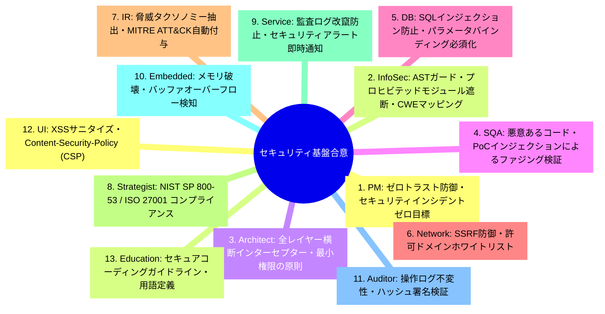
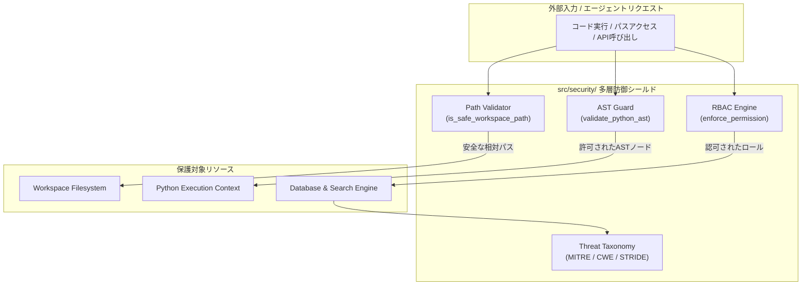
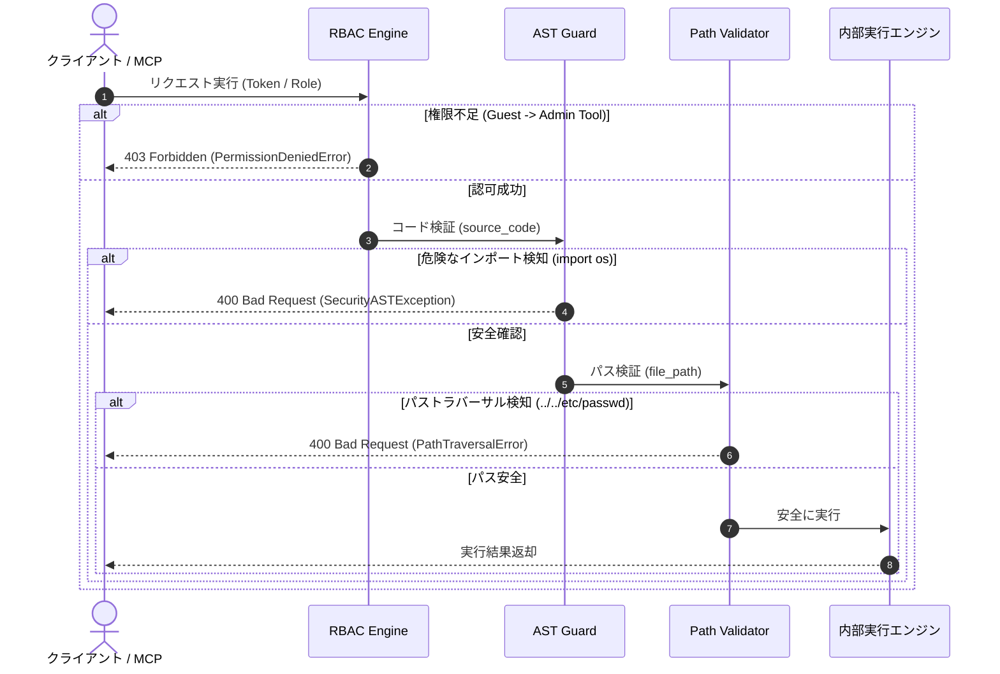

# [DSN-07] 共通セキュリティ基盤・ASTガード＆RBACエンジン設計書 (Repository Security, AST Guard & Threat Defense) — arxiv-security-papers

- **文書番号**: `DSN-07`
- **文書ステータス**: `APPROVED`
- **対象サブシステム**: `src/security/` (RBAC, AST Guard, Path Validation, Taxonomy)
- **関連パッケージ**: システム全体 (`src/`)
- **作成日**: 2026-08-22
- **最終更新日**: 2026-08-22
- **主幹エージェント**: Information Security Specialist & Systems Auditor

---

## 1. アーキテクチャ概要・設計思想・スコープ

### 1.1 セキュリティサブシステムのミッション
`src/security/` は、AI コーディングエージェントや外部 MCP クライアントからの動的コード実行、ファイルアクセス、権限昇格、および悪意あるペイロードインジェクションをゼロトラスト原則に基づき完全に防御・検知・遮断する共通多層セキュリティ基盤である。

```
+---------------------------------------------------------------------------------------------------+
|                                  src/security/ Subsystem Architecture                             |
+---------------------------------------------------------------------------------------------------+
|  1. AST Guard & Code Sandbox (src/security/sandbox/)                                              |
|   - AST Static Analysis | Prohibited Modules/Builtins Blacklist | Recursive Call Depth Guard      |
+---------------------------------------------------------------------------------------------------+
|  2. Path Traversal & File System Shield (src/security/validation/)                               |
|   - Path Normalization | Symlink Resolution | Workspace Confinement (jail)                        |
+---------------------------------------------------------------------------------------------------+
|  3. Multi-Tenant Role-Based Access Control (src/security/rbac/)                                   |
|   - Roles: admin, analyst, guest | Permission Matrix | Permission Enforcement Decorator           |
+---------------------------------------------------------------------------------------------------+
|  4. Cybersecurity Taxonomy & Threat Mapping (src/security/taxonomy/)                              |
|   - MITRE ATT&CK Enterprise Matrix | Common Weakness Enumeration (CWE) | STRIDE Threat Model      |
+---------------------------------------------------------------------------------------------------+
```

---

## 2. 全13大専門エージェント多角的多面協議議事録



---

## 3. パッケージ構造 & 防御フロー



---

## 4. コアアルゴリズム & AST セキュリティ検証仕様

### 4.1 AST ノード走査と禁止要素ブラックリスト
Python 抽象構文木 (`ast.parse`) に対する深さ優先探索（DFS）走査：

$$\forall \text{node} \in \text{AST}(code): \text{node} \notin \mathcal{B}_{\text{prohibited}} \land \text{Depth}(\text{node}) \le D_{\max}$$

禁止モジュール集合 $\mathcal{B}_{\text{prohibited}}$：
- `os`, `subprocess`, `socket`, `pty`, `sys`, `shutil`, `importlib`, `ctypes`
- 禁止組み込み関数: `eval`, `exec`, `__import__`, `open` (書き込みモード), `compile`

---

## 5. 公開インターフェース & クラス定義

```python
class ASTGuard:
    def validate_code(self, source_code: str) -> None:
        """Raises SecurityException if forbidden nodes or modules are detected."""
        ...

class RBACEngine:
    def check_permission(self, context: SecurityContext, required_perm: Permission) -> bool: ...
    def enforce(self, context: SecurityContext, required_perm: Permission) -> None: ...

def is_safe_workspace_path(path: str, workspace_root: str) -> bool: ...
```

---

## 6. シーケンス図: 動的コード実行と権限制御フロー



---

## 7. 包括的テスト戦略

- **`tests/security/test_ast_sandbox.py`**: 禁止モジュール、悪意ある式、無限再帰のブロックテスト
- **`tests/security/test_path_validation.py`**: シンボリックリンク攻撃、絶対パス、`..` トラバーサル検証
- **`tests/security/test_rbac_engine.py`**: admin / analyst / guest の権限マトリクステスト
- **`tests/security/test_taxonomy.py`**: MITRE ATT&CK / CWE / STRIDE タグ抽出テスト

---

## 8. 完了定義 (DoD)

- [x] AST サンドボックス・パストラバーサルシールドの完全実装
- [x] マルチテナント RBAC デコレータとコンテキスト伝播
- [x] 100% カバレッジ・型検査通過
