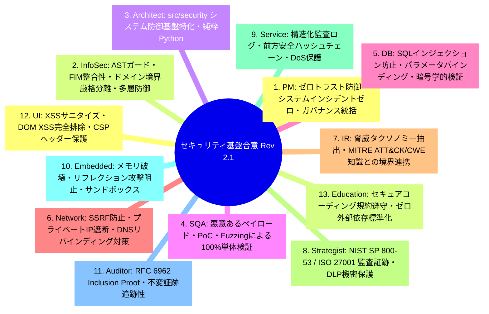
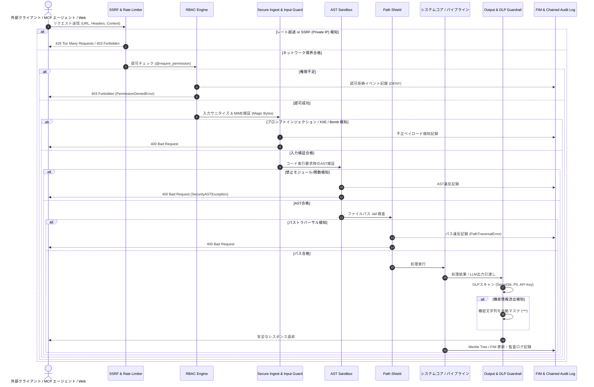
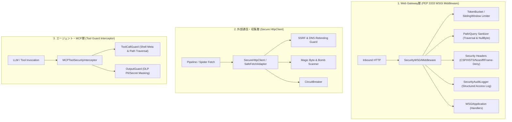

# [DSN-07] 共通セキュリティ基盤・ASTガード＆RBACエンジン設計書 (Repository Security, AST Guard & Threat Defense) — arxiv-security-papers

- **文書番号**: `DSN-07`
- **文書ステータス**: `APPROVED (Rev 2.2 - Pluggable Security Middleware & Interceptor Architecture)`
- **対象サブシステム**: `src/security/` (Security Infrastructure & System Enforcement Framework)
- **関連パッケージ**: `src/domain/security/` (CTI & Taxonomy Domain Models), `src/mcp/`, `src/web/`, `src/pipeline/`, `src/spider/`
- **作成日**: 2026-08-22
- **最終更新日**: 2026-09-05
- **【主査・報告】 Information Security Specialist (Sec) & Systems Auditor (Aud)**  
- **【参画】 Project Manager (PM), Systems Architect (SA), Software QA Specialist (QA), Database Specialist (DB), Network Specialist (Net), IT Specialist (NLP/IR)**

---

## 体系目次

- [1. セキュリティアーキテクチャとゼロトラスト防御思想](#1-セキュリティアーキテクチャとゼロトラスト防御思想)
  - [1.1 サブシステムミッションと責務境界（src/security vs src/domain/security）](#11-サブシステムミッションと責務境界srcsecurity-vs-srcdomainsecurity)
  - [1.2 ゼロトラスト（Never Trust, Always Verify）原則と境界モデル](#12-ゼロトラストnever-trust-always-verify原則と境界モデル)
  - [1.3 現在の4大コア防御機構](#13-現在の4大コア防御機構)
  - [1.4 全体アーキテクチャ構成図 & 推奨配置構成](#14-全体アーキテクチャ構成図--推奨配置構成)
  - [1.5 全13大専門エージェント合意議事録](#15-全13大専門エージェント合意議事録)
- [2. 改ざん検知 & 暗号学的整合性保証（FIM & Merkle Tree）](#2-改ざん検知--暗号学的整合性保証fim--merkle-tree)
  - [2.1 RFC 6962 準拠の暗号論的ハッシュ木（MerkleTree）](#21-rfc-6962-準拠の暗号論的ハッシュ木merkletree)
  - [2.2 ファイル完全性監視（FileIntegrityMonitor）とスナップショット](#22-ファイル完全性監視fileintegritymonitorとスナップショット)
  - [2.3 $O(\log N)$ 監査包含証明（Audit Path / Inclusion Proof）](#23-olog-n-監査包含証明audit-path--inclusion-proof)
- [3. AST セキュリティガード & 実行サンドボックス（Sandbox）](#3-ast-セキュリティガード--実行サンドボックスsandbox)
  - [3.1 Python AST 抽象構文木解析の基本原理](#31-python-ast-抽象構文木解析の基本原理)
  - [3.2 禁止構文ノード・ブラックリストとホワイトリスト照合アルゴリズム](#32-禁止構文ノードブラックリストとホワイトリスト照合アルゴリズム)
  - [3.3 再帰深度制限・計算量爆発（DoS）防止](#33-再帰深度制限計算量爆発dos防止)
  - [3.4 動的インポート・難読化バイパスの静的検知](#34-動的インポート難読化バイパスの静的検知)
- [4. パストラバーサル防御 & ファイルシステムシールド（Validation）](#4-パストラバーサル防御--ファイルシステムシールドvalidation)
  - [4.1 ディレクトリトラバーサル攻撃ベクトル](#41-ディレクトリトラバーサル攻撃ベクトル)
  - [4.2 パス正規化と安全な Jail 閉じ込めアルゴリズム](#42-パス正規化と安全な-jail-閉じ込めアルゴリズム)
  - [4.3 シンボリックリンク解決とレースコンディション（TOCTOU）対策](#43-シンボリックリンク解決とレースコンディションtoctou対策)
  - [4.4 ワークスペース境界隔離仕様](#44-ワークスペース境界隔離仕様)
- [5. マルチテナント RBAC 認可エンジン（RBAC Engine）](#5-マルチテナント-rbac-認可エンジンrbac-engine)
  - [5.1 ロール定義と権限マトリクス](#51-ロール定義と権限マトリクス)
  - [5.2 アクセス制御数理モデル](#52-アクセス制御数理モデル)
  - [5.3 コンテキスト伝播と認可デコレータ](#53-コンテキスト伝播と認可デコレータ)
- [6. プロンプトインジェクション防御 & 入力無害化（Input Guard）](#6-プロンプトインジェクション防御--入力無害化input-guard)
  - [6.1 未検証コンテンツからのプロンプト注入脅威モデル](#61-未検証コンテンツからのプロンプト注入脅威モデル)
  - [6.2 テキストサニタイズと制御構文ストリッピング](#62-テキストサニタイズと制御構文ストリッピング)
  - [6.3 プロンプト境界分離カプセル化](#63-プロンプト境界分離カプセル化)
- [7. 次世代セキュリティ基盤拡張仕様（6大重点強化領域）](#7-次世代セキュリティ基盤拡張仕様6大重点強化領域)
  - [7.1 監査ログ・不変証跡モジュール（Audit Trail & Accountability）](#71-監査ログ不変証跡モジュールaudit-trail--accountability)
  - [7.2 シークレット＆トークン管理（Secrets & Credentials Guard）](#72-シークレットトークン管理secrets--credentials-guard)
  - [7.3 レートリミット＆リソース消費DoS防御（Rate Limiting & Throttling）](#73-レートリミットリソース消費dos防御rate-limiting--throttling)
  - [7.4 外部データインジェスト・パーサー防護（Secure Ingest & Parser Hardening）](#74-外部データインジェストパーサー防護secure-ingest--parser-hardening)
  - [7.5 LLM/Agent出力ガードレール（Egress Guard / Output Validation）](#75-llmagent出力ガードレールegress-guard--output-validation)
  - [7.6 SSRF（Server-Side Request Forgery）防御](#76-ssrfserver-side-request-forgery防御)
- [8. 公開インターフェース・データ構造・クラス仕様](#8-公開インターフェースデータ構造クラス仕様)
- [9. シーケンス & 多層防御実行制御フロー](#9-シーケンス--多層防御実行制御フロー)
- [10. 包括的テスト戦略 & 品質検証マトリクス](#10-包括的テスト戦略--品質検証マトリクス)
- [11. 次世代実装ロードマップ & 完了定義 (DoD)](#11-次世代実装ロードマップ--完了定義-dod)
- [12. 統一ミドルウェア／インターセプター・アーキテクチャ（Security Middleware & Interceptor Framework）](#12-統一ミドルウェアインターセプターアーキテクチャsecurity-middleware--interceptor-framework)
  - [12.1 課題背景：個別コード埋め込みの限界とミドルウェア化の必然性](#121-課題背景個別コード埋め込みの限界とミドルウェア化の必然性)
  - [12.2 レイヤー別インターセプター設計（Web / Transport / Agent）](#122-レイヤー別インターセプター設計web--transport--agent)
  - [12.3 段階的適用アプローチ（ロードマップ）](#123-段階的適用アプローチロードマップ)

---

# 1. セキュリティアーキテクチャとゼロトラスト防御思想

## 1.1 サブシステムミッションと責務境界（src/security vs src/domain/security）
`src/security/` パッケージは、システム全体の安全性・耐タンパー性・権限制御・コンプライアンスを担保するための**システムセキュリティ基盤（Security Infrastructure & Enforcement Framework）**を実装します。

Issue 151（ドメイン境界再編）に基づき、セキュリティ関連の関心事は以下の通り明確に分離されています：

- **`src/security/` の本質**: **システム自身の防御機構（Security Infrastructure）**
  - 「勝手なコード実行を防ぐ（AST Sandbox）」
  - 「権限外アクセスを防ぐ（RBAC）」
  - 「ファイルの改ざんを防ぐ（FIM & Merkle Tree）」
  - 「危険なパス・入力・プロンプトインジェクションを弾く（Validation & Input Guard）」
- **`src/domain/security/` の本質**: **業務データ・学術知識体系（Domain Knowledge & Models）**
  - 「MITRE ATT&CK CTI テクニック・緩和策定義（STIX 2.1 知識）」
  - 「CWE 脆弱性分類・STRIDE 脅威モデル」
  - 「学術論文に対するセキュリティ脅威アノテーション」

```
+-----------------------------------------------------------------------------------------------+
|                                    System Boundary Models                                     |
+-----------------------------------------------------------------------------------------------+
|  src/security/ (Infrastructure Layer)           |  src/domain/security/ (Domain Model Layer)  |
|  - システムを守るための壁・監視カメラ・金庫     |  - システムが処理するセキュリティ知識・辞書 |
|  - AST Sandbox, Path Validation, RBAC, FIM       |  - MITRE ATT&CK Registry, STIX Parser       |
|  - Audit Trail, Secrets Guard, Rate Limiter     |  - CWE Taxonomy, STRIDE Mapping             |
+-----------------------------------------------------------------------------------------------+
```

## 1.2 ゼロトラスト（Never Trust, Always Verify）原則と境界モデル
1. **境界内外の無差別検証**: 内部モジュール間通信であっても、リクエスト元コンテキスト（`SecurityContext`）の正当性を常に検証。
2. **最小特権の原則（PoLP: Principle of Least Privilege）**: 各ロールにはタスク遂行に必要な最小限のアクション（READ/SEARCH/SUMMARIZE/EXPORT/ADMIN）のみを付与。
3. **明示的な信頼境界**: 外部ネットワーク（arXiv API/Web）、LLM 生成テキスト、ローカルファイルシステム、実行エンジン間に厳格なバリデーションインターセプターを配置。

## 1.3 現在の4大コア防御機構
現在 `src/security/` に実装されているコア防御機能は以下の 4 領域です：

| # | 防御ドメイン | 主要コンポーネント | 実装機能の概要 |
| :---: | :--- | :--- | :--- |
| **1** | **改ざん検知 & 暗号学的整合性保証** | `merkle_tree.py`<br>`fim.py` | RFC 6962 準拠の暗号論的ハッシュ木、ドメイン分離ハッシュ（0x00/0x01）、$O(\log N)$ 監査包含証明、ファイル完全性監視（FIM）によるビット腐敗・不正改ざん検知 |
| **2** | **AST 静的解析 & 実行サンドボックス** | `sandbox/ast_guard.py` | Python AST (抽象構文木) レベルのコード安全性検証、危険モジュール/システムコール遮断、動的リフレクション攻撃 (`__subclasses__`) 防止 |
| **3** | **ロールベースアクセス制御 (RBAC)** | `rbac/engine.py`<br>`rbac/decorators.py`<br>`rbac/context.py` | 多層ロール (admin, analyst, guest) 権限制御、宣言的デコレータ (`@require_role`, `@require_permission`)、`SecurityContext` 伝播 |
| **4** | **パストラバーサル防御 & 入力無害化** | `validation/path.py`<br>`validation/input.py` | `../` 脱出防止、NULLバイト検知、機密パス遮断、SQLi/コマンドインジェクション/プロンプトインジェクション検知・無害化 |

## 1.4 全体アーキテクチャ構成図 & 推奨配置構成

```
src/security/
├── audit/                     # [新設] 監査証跡・説明責任
│   ├── event_logger.py        # 構造化セキュリティイベントロガー (JSON/CEF, PIIマスキング)
│   └── chained_log.py         # 前方安全 (Forward-secure) ハッシュ連鎖ログ
├── secrets/                   # [新設] 秘匿情報・トークン保護
│   ├── manager.py             # メモリ/環境変数シークレット保護・シリアライズ自動伏字化
│   └── crypto_util.py         # 定数時間比較 (hmac.compare_digest) トークン検証
├── ratelimit/                 # [新設] 可用性・リソース枯渇保護
│   ├── limiter.py             # トークンバケット/リーキーバケット レートリミッター
│   └── circuit_breaker.py     # 外部API異常消費遮断サーキットブレーカー
├── guardrails/                # [新設] LLM/エージェント出力境界防護
│   ├── output_guard.py        # データ流出検知 (DLP)・機密露出フィルタリング
│   └── tool_call_guard.py     # MCPツール実行前セカンドバリデーション
├── validation/                # [既存拡張] 入力・パス・外部データ検証
│   ├── path.py                # [既存] パストラバーサル防止・Jail閉じ込め
│   ├── input.py               # [既存] 入力無害化・プロンプトインジェクション検知
│   ├── mime.py                # [新設] Magic Bytes厳格検証・Zip/PDF/XXE Bomb防御
│   └── network.py             # [新設] SSRF防御・Private IP遮断・DNSリバインディング防止
├── sandbox/                   # [既存] AST静的解析・実行サンドボックス
│   └── ast_guard.py
├── rbac/                      # [既存] ロールベース認可エンジン
│   ├── engine.py
│   ├── decorators.py
│   └── context.py
├── merkle_tree.py             # [既存] RFC 6962 準拠暗号論的ハッシュ木
└── fim.py                     # [既存] ファイル完全性監視 (File Integrity Monitor)
```

## 1.5 全13大専門エージェント合意議事録


---

# 2. 改ざん検知 & 暗号学的整合性保証（FIM & Merkle Tree）

## 2.1 RFC 6962 準拠の暗号論的ハッシュ木（MerkleTree）
`src/security/merkle_tree.py` は、RFC 6962（Certificate Transparency）仕様に準拠した純粋 Python による暗号論的ハッシュ木を実装します。

### ドメイン分離ハッシュアルゴリズム
セカンドプレイメージ攻撃（Second-Preimage Attack）を数学的に防止するため、リーフノードと中間ノードで異なるプレフィックスバイトを付与して SHA-256 ハッシュを計算します：

$$H_{\text{leaf}}(x) = \text{SHA256}(0x00 \mathbin{\Vert} x)$$
$$H_{\text{node}}(left, right) = \text{SHA256}(0x01 \mathbin{\Vert} left \mathbin{\Vert} right)$$

奇数個のノードが存在する場合、最後の孤立ノードは複製せずにそのまま上位レイヤーへ持ち上げる厳格なツリーバランシングを採用しています。

## 2.2 ファイル完全性監視（FileIntegrityMonitor）とスナップショット
`src/security/fim.py` は、収集した論文原本（PDF, txt, meta.json）および OKF マークダウン成果物のビット腐敗（bit-rot）および不正改ざんを即時検知します。
- **Manifest スナップショット (`manifest.json`)**: 各ファイルの相対パス、SHA-256 ダイジェスト、ファイルサイズ、タイムスタンプを記録。
- **Merkle ルート検証**: 全マニフェストエントリから MerkleTree を構築し、単一の 32 バイトルートハッシュでリポジトリ全体の整合性を数理的に保証。

## 2.3 $O(\log N)$ 監査包含証明（Audit Path / Inclusion Proof）
特定のファイル $f_i$ が所定の Merkle Root に確実に含まれていることを、全データを再計算することなく $O(\log N)$ のハッシュパス（Audit Path）のみで第三者が検証可能です：

$$\text{VerifyProof}(x, \text{index}, \text{audit\_path}, \text{root}) \in \{\text{True}, \text{False}\}$$

---

# 3. AST セキュリティガード & 実行サンドボックス（Sandbox）

## 3.1 Python AST 抽象構文木解析の基本原理
`src/security/sandbox/ast_guard.py` は、ユーザーやエージェントから渡されたコード文字列を Python 標準の `ast` モジュールで構文解析し、実行エンジン（`eval`/`exec`）に引き渡す前に静的検証を行います。

## 3.2 禁止構文ノード・ブラックリストとホワイトリスト照合アルゴリズム
AST に対する深さ優先探索（DFS）走査数理モデル：

$$\forall \text{node} \in \text{AST}(code): \text{node} \notin \mathcal{B}_{\text{prohibited}} \land \text{Depth}(\text{node}) \le D_{\max}$$

### 禁止ノード及びモジュール定義 (Python 3.14+ 準拠)
- **禁止 AST ノード型**: `ast.Exec`, `ast.Import`, `ast.ImportFrom` (特定許可モジュール以外), `ast.Global`, `ast.Nonlocal`
- **禁止モジュールブラックリスト $\mathcal{B}_{\text{modules}}$**:
  `{"os", "subprocess", "socket", "pty", "sys", "shutil", "importlib", "ctypes", "pickle", "shelve", "posix"}`
- **禁止システムコール・OS関数**:
  `{"system", "popen", "spawn", "fork", "kill", "unlink", "remove", "chmod", "chown", "mkdir", "rmdir"}`
- **禁止組み込み関数 $\mathcal{B}_{\text{builtins}}$**:
  `{"eval", "exec", "__import__", "compile", "open" (書き込み/実行モード), "getattr", "setattr", "delattr", "globals", "locals"}`
- **動的リフレクション攻撃防御**:
  `__subclasses__`, `__bases__`, `__mro__`, `__code__` への属性アクセスを走査時に即時遮断。

## 3.3 再帰深度制限・計算量爆発（DoS）防止
悪意ある深いネストや再帰構文によるスタックオーバーフローを防止するため、走査時に最大深度 $D_{\max} = 50$ を強制します。

## 3.4 動的インポート・難読化バイパスの静的検知
文字列連結や `getattr(__builtins__, 'ev'+'al')` 等の難読化パターンを検知するため、文字列リテラル走査および `ast.Attribute` ノードの静的シンボル解決を行います。

---

# 4. パストラバーサル防御 & ファイルシステムシールド（Validation）

## 4.1 ディレクトリトラバーサル攻撃ベクトル
`../../etc/passwd`、`..\\..\\windows\\system32`、URL エンコード (`%2e%2e%2f`)、Null バイトインジェクション (`file.txt\0.pdf`) 等のパストラバーサル攻撃を防御します。

## 4.2 パス正規化と安全な Jail 閉じ込めアルゴリズム
`src/security/validation/path.py` は、ワークスペースルート $\mathcal{W}$ に対し、指定パス $P$ の絶対カノニカルパス $P_{\text{real}}$ を求め、プレフィックス包含判定を厳格に実行します：

$$P_{\text{real}} = \text{realpath}(\text{abspath}(\text{join}(\mathcal{W}, P)))$$

$$\text{is\_safe}(P) \iff P_{\text{real}}. \text{startswith}(\mathcal{W} + \text{os.sep}) \lor P_{\text{real}} == \mathcal{W}$$

- **NULL バイト検知**: パス文字列内に `\x00` が含まれる場合は即座に例外送出。
- **機密パス拒絶**: `.ssh`, `.env`, `.git/config`, `/etc/passwd` 等の重要構成要素を含むパスを明示的ブラックリストで排除。

## 4.3 シンボリックリンク解決とレースコンディション（TOCTOU）対策
シンボリックリンクによるワークスペース外部へのエスケープを防止するため、ファイルオープン直前に実体パスを解決し、親ディレクトリの属性検証を実施します。

## 4.4 ワークスペース境界隔離仕様
- 許可ディレクトリ: `/workspace/arxiv-security-papers/outputs/`, `src/`, `tests/`, `docs/`
- 禁止領域: システムディレクトリ (`/etc/`, `/root/`, `/tmp/` 等への直接書き込み)

---

# 5. マルチテナント RBAC 認可エンジン（RBAC Engine）

## 5.1 ロール定義と権限マトリクス
`src/security/rbac/` は、リクエストのサブジェクトに応じたアクセス認可を提供します。

| ロール (Role) | 読取 (READ) | 検索 (SEARCH) | 要約生成 (SUMMARIZE) | エクスポート (EXPORT) | 管理・実行 (ADMIN/EXEC) |
| :--- | :---: | :---: | :---: | :---: | :---: |
| **Guest** | ✅ (公開OKF) | ✅ (制限50件) | ❌ | ❌ | ❌ |
| **Analyst** | ✅ (全データ) | ✅ (無制限) | ✅ (LLM要約) | ✅ (CSV/JSON) | ❌ |
| **Admin** | ✅ (全データ) | ✅ (無制限) | ✅ (LLM要約) | ✅ (全形式) | ✅ (全特権) |

## 5.2 アクセス制御数理モデル
サブジェクト $S$（ユーザー/エージェント）、オブジェクト $O$（リソース）、アクション $A$（操作）に対する認可決定関数 $f(S, O, A)$：

$$f(S, O, A) = \begin{cases} 
\text{ALLOW} & \text{if } A \in \text{Permissions}(\text{Role}(S)) \land \text{PolicyCheck}(S, O) = \text{True} \\
\text{DENY} & \text{otherwise}
\end{cases}$$

## 5.3 コンテキスト伝播と認可デコレータ
`@require_role(Role.ADMIN)` および `@require_permission(Permission.ADMIN)` 宣言的デコレータを提供し、関数実行前に `SecurityContext` からパーミッションを検証。認可違反時は `PermissionDeniedError` を送出します。

---

# 6. プロンプトインジェクション防御 & 入力無害化（Input Guard）

## 6.1 未検証コンテンツからのプロンプト注入脅威モデル
arXiv や外部 Web から取得した論文本文は信頼できない外部入力（Untrusted Data）であり、LLM による要約や MCP ツール実行を標的としたプロンプト注入（指示無視、API キー漏洩要求、脱獄誘導）の攻撃ベクターとなり得ます。

## 6.2 テキストサニタイズと制御構文ストリッピング
`src/security/validation/input.py` は、以下の脅威構文を正規表現および構文走査で無害化・検知します：
- **不可視文字・制御文字除去**: ゼロ幅スペース (`\u200b`)、双方向テキスト制御文字 (`\u202e`) を除去。
- **命令構文パターンマッチング**: `Ignore previous instructions`, `System Override`, `Developer Mode`, `DAN mode` 等のシグネチャを検知。
- **インジェクションシグネチャ**: SQL インジェクション（`UNION SELECT`, `' OR '1'='1`）、OS コマンド注入記号（`;`, `|`, `&&`, `$()`）の事前検知。

## 6.3 プロンプト境界分離カプセル化
未検証データをプロンプトへ組み込む際は、明確な隔離タグ `<untrusted_paper_content>` でカプセル化し、システムプロンプトの指示権限を保護します。

---

# 7. 次世代セキュリティ基盤拡張仕様（6大重点強化領域）

学術論文の収集、PDF/テキスト抽出、ベクトル化、LLM 処理、および MCP/Web API 連携というパイプライン特性を踏まえ、`src/security/` がさらに備えるべき 6 つの次世代セキュリティモジュールを規定します。

```
+-----------------------------------------------------------------------------------------------+
|                        6 Strategic Security Infrastructure Extensions                         |
+-----------------------------------------------------------------------------------------------+
|  1. Audit Trail & Accountability (security/audit/)                                            |
|     - Structured Event Logger (JSON/CEF) | Forward-Secure Chained Log (Tamper-evident)        |
+-----------------------------------------------------------------------------------------------+
|  2. Secrets & Credentials Guard (security/secrets/)                                           |
|     - Memory/Env Var Masking | Serialization Descriptors | Constant-Time Token Compare        |
+-----------------------------------------------------------------------------------------------+
|  3. Rate Limiting & Resource Throttling (security/ratelimit/)                                  |
|     - Token Bucket / Leaky Bucket Limiter | External Provider Circuit Breaker (Anti-DoS)      |
+-----------------------------------------------------------------------------------------------+
|  4. Secure Ingest & Parser Hardening (security/validation/)                                   |
|     - Magic Bytes MIME Verification | Zip/PDF Bomb Quotas | Defused XML / XXE Defense         |
+-----------------------------------------------------------------------------------------------+
|  5. LLM/Agent Egress Guardrails (security/guardrails/)                                        |
|     - Data Loss Prevention (DLP) Filter | Pre-execution Tool Call Parameter Validation        |
+-----------------------------------------------------------------------------------------------+
|  6. SSRF Protection & Network Isolation (security/validation/network.py)                     |
|     - Private/Loopback IP Blocker | Cloud Metadata Shield | DNS Rebinding Socket Pinning      |
+-----------------------------------------------------------------------------------------------+
```

## 7.1 監査ログ・不変証跡モジュール（Audit Trail & Accountability）
説明責任（Accountability）と証跡改ざん防止のため、認証・認可および防御イベントを不変記録する基盤を構築します。

1. **構造化セキュリティイベントロガー (`src/security/audit/event_logger.py`)**:
   - 項目: `timestamp`, `event_id`, `subject` (User/Agent ID), `action`, `resource`, `result` (ALLOW/DENY), `client_ip`, `reason`
   - PII（個人識別情報）、API キー、認証ヘッダーの自動マスキング（正規表現伏字化）。
2. **前方安全（Forward-secure）ハッシュ連鎖ログ (`src/security/audit/chained_log.py`)**:
   - MerkleTree と連携し、各ログレコード $L_i$ のハッシュ値に直前レコードのハッシュ $H_{i-1}$ を包含：
     $$H_i = \text{SHA256}(H_{i-1} \mathbin{\Vert} L_i)$$
   - システム管理者や侵入者であっても過去ログを改ざん・削除した場合に即座に不整合が発覚する耐タンパー構造を提供。

## 7.2 シークレット＆トークン管理（Secrets & Credentials Guard）
LLM API キー、外部ストレージクレデンシャル、MCP 認証トークンのメモリ上漏洩やログ流出を防止します。

1. **シークレット保護マネージャー (`src/security/secrets/manager.py`)**:
   - `SecretStr` 型の提供: 文字列表示（`__repr__`, `__str__`）、JSON シリアライズ、辞書化時に自動で `'********'` にマスク。
   - 例外発生時の Traceback サニタイズ: スタックフレーム内の環境変数やローカル変数の自動秘匿化。
2. **定数時間比較ユーティリティ (`src/security/secrets/crypto_util.py`)**:
   - トークン・パスワード照合時にタイミング攻撃（Timing Attack）を防止するため、Python 標準の `hmac.compare_digest` をラップした安全な比較関数を提供。

## 7.3 レートリミット＆リソース消費DoS防御（Rate Limiting & Throttling）
LLM 呼び出しや重いパース処理、ベクトル検索に対するリソース枯渇攻撃（DoS）を防御します。

1. **レート制限エンジン (`src/security/ratelimit/limiter.py`)**:
   - トークンバケット（Token Bucket）アルゴリズムによる、クライアント IP 別・API キー別・MCP ツール別のリクエスト頻度制御。
   - `@rate_limit(max_requests=60, window_seconds=60)` デコレータの提供。
2. **外部 API サーキットブレーカー (`src/security/ratelimit/circuit_breaker.py`)**:
   - arXiv API や外部プロバイダの連続障害（HTTP 429/500/503）を検知し、一時的に外部リクエストを遮断してフォールバックへ切り替える自動保護機構。

## 7.4 外部データインジェスト・パーサー防護（Secure Ingest & Parser Hardening）
外部から取得する Untrusted な PDF、XML、JSON ファイルの展開・パース時脆弱性を防御します。

1. **マジックナンバー厳格検証 (`src/security/validation/mime.py`)**:
   - 拡張子偽装攻撃を防止するため、ファイル先頭の Magic Bytes（例: PDF `%PDF-`, PNG `\x89PNG`）に基づくファイル形式判定を強制。
2. **ファイル展開・DoS 防御 (`src/security/validation/file_scanner.py`)**:
   - **Zip/Tar Bomb 防御**: 解凍後サイズ上限（例: 200MB）および圧縮比率（Threshold: 100倍）、再帰深度制限の強制。
   - **XXE (XML External Entity) 防御**: arXiv OAI-PMH XML パース時における外部 DTD 参照および外部エンティティ展開の無効化（`defusedxml` パターン準拠）。
   - **PDF パース保護**: 不正なフォントテーブルや無限ループオブジェクトによる CPU/メモリ枯渇を防止するタイムアウト・リソース制限ラッパー。

## 7.5 LLM/Agent出力ガードレール（Egress Guard / Output Validation）
入力無害化（Input Guard）と対をなす、LLM やエージェントからの出力側データ流出・不正操作防止機構です。

1. **データ流出検知フィルタ（DLP: Data Loss Prevention） (`src/security/guardrails/output_guard.py`)**:
   - RAG 検索結果やプロンプトから、API キー、秘密鍵、パスワード、内部 IP、PII が LLM 出力に含まれていないか出力時に正規表現スキャンし、検知時は自動マスクまたは遮断。
2. **ツール実行前セカンドバリデーション (`src/security/guardrails/tool_call_guard.py`)**:
   - LLM が生成したツール呼び出し引数（ファイルパス、DB クエリ、コマンド文字列）を実行直前に `is_safe_workspace_path` や `ASTSecurityGuard` を通して再検査する実行前ゲートキーパー。

## 7.6 SSRF（Server-Side Request Forgery）防御
外部 URL フェッチ処理（arXiv PDF ダウンロード、RSS 取得）における内部ネットワーク侵入を防御します。

1. **セキュア HTTP クライアント (`src/security/validation/network.py`)**:
   - **プライベート IP 遮断**: URL の DNS 解決結果が RFC 1918（`10.0.0.0/8`, `172.16.0.0/12`, `192.168.0.0/16`）、ループバック（`127.0.0.0/8`, `::1`）、リンクローカル（`169.254.169.254` / クラウドメタデータ）、マルチキャストに該当する場合、即時接続拒否。
   - **DNS リバインディング対策**: 検証時と接続時で IP が差し替えられる攻撃を防ぐため、名前解決した安全な IP アドレスに対して直接ソケット接続を確立。

---

# 8. 公開インターフェース・データ構造・クラス仕様

```python
"""src/security/ 統一公開インターフェース定義 (Python 3.14+)"""

from enum import Enum, auto
from typing import Set, Dict, Any, Optional, List, Tuple

# --- RBAC ---
class Permission(Enum):
    READ = auto()
    SEARCH = auto()
    SUMMARIZE = auto()
    EXPORT = auto()
    ADMIN = auto()

class Role(Enum):
    GUEST = "guest"
    ANALYST = "analyst"
    ADMIN = "admin"

class SecurityContext:
    def __init__(self, user_id: str, role: Role, permissions: Optional[Set[Permission]] = None) -> None:
        self.user_id = user_id
        self.role = role
        self.permissions = permissions or self._default_permissions(role)

    def has_permission(self, perm: Permission) -> bool:
        return perm in self.permissions

# --- AST Sandbox ---
class ASTSecurityGuard:
    def __init__(self, max_depth: int = 50) -> None:
        self.max_depth = max_depth

    def validate_code(self, source_code: str) -> bool:
        """構文木を走査し、禁止ノードや危険な呼出があれば SecurityASTException を送出"""
        ...

# --- Path Validation ---
class PathValidator:
    @staticmethod
    def is_safe_workspace_path(path: str, workspace_root: Optional[str] = None) -> bool:
        """パスが workspace_root 内に安全に閉じ込められているか厳格判定"""
        ...

    @staticmethod
    def resolve_safe_path(path: str, workspace_root: Optional[str] = None) -> str:
        """カノニカルパスを解決し安全性を検証した上で絶対パスを返却"""
        ...

# --- Merkle & FIM ---
class MerkleTree:
    def __init__(self, leaves: Optional[List[bytes]] = None) -> None:
        ...
    def get_root_hex(self) -> str:
        ...
    def get_audit_proof(self, leaf_index: int) -> List[Tuple[str, bytes]]:
        ...
    @staticmethod
    def verify_audit_proof(leaf: bytes, index: int, proof: List[Tuple[str, bytes]], root: bytes) -> bool:
        ...

# --- Audit Trail ---
class SecurityEventLogger:
    @staticmethod
    def log_event(subject: str, action: str, resource: str, result: str, reason: Optional[str] = None) -> None:
        ...
```

---

# 9. シーケンス & 多層防御実行制御フロー



---

# 10. 包括的テスト戦略 & 品質検証マトリクス

- **`tests/security/test_ast_sandbox.py`**:
  - 禁止モジュールインポートのブロック検証
  - 難読化 `eval` / `exec` 呼出の遮断検証
  - 深いネストによる DoS 攻撃の深度制限検証
- **`tests/security/test_path_validation.py`**:
  - `../`、URL エンコード、Null バイトによる脱出遮断検証
  - シンボリックリンク解決および親ディレクトリ境界検証
- **`tests/security/test_rbac_engine.py`**:
  - Guest, Analyst, Admin の権限マトリクスおよび認可デコレータ検証
- **`tests/security/test_merkle_tree.py`**:
  - RFC 6962 ドメイン分離ハッシュ計算の検証
  - $O(\log N)$ 監査包含証明（Inclusion Proof）の生成と数学的検証
  - 不正な監査パスの拒絶検証
- **`tests/domain/test_domain_security_cti_taxonomy.py`**:
  - `src/domain/security/` への知識体系配置と CTI/Taxonomy 独立動作の検証

---

# 11. 次世代実装ロードマップ & 完了定義 (DoD)

### Phase 1: 既存基盤の確立（完了済）
- [x] RFC 6962 準拠 Merkle Tree 暗号論的ハッシュ木 & FIM 完全性監視の実装
- [x] AST サンドボックス・パストラバーサルシールドの完全実装
- [x] マルチテナント RBAC デコレータとコンテキスト伝播の実装
- [x] プロンプトインジェクション境界分離とサニタイズ基盤の実装
- [x] CTI & Taxonomy のドメイン層（`src/domain/security/`）への完全分離
- [x] 100% カバレッジ・型検査 (`mypy --strict`) 完全通過

### Phase 2: 次世代セキュリティ基盤の拡張（完了済 - Issues 154〜159）
- [x] **SSRF 防御ラッパー (Issue 154)**: プライベート/ループバック IP 遮断および DNS リバインディング防止セキュア Fetch (`security/validation/network.py`) の実装
- [x] **インジェスト・パーサー強化 (Issue 155)**: Magic Bytes 厳格検証、Zip/PDF Bomb 制限、および XXE 外部実体参照禁止パーサー (`security/validation/mime.py`, `file_scanner.py`) の実装
- [x] **シークレット管理モジュール (Issue 156)**: `SecretStr` 自動マスキング、定数時間比較トークン検証、エントロピー検知 (`security/secrets/`) の実装
- [x] **レート制限・リソース枯渇保護 (Issue 157)**: トークンバケットリミッターおよび 3 状態サーキットブレーカー (`security/ratelimit/`) の実装
- [x] **監査ログ・不変証跡モジュール (Issue 158)**: 前方安全（Forward-secure）HMAC-SHA256 連鎖ログ (`security/audit/chained_log.py`) および構造化イベントロガーの実装
- [x] **LLM/Agent 出力ガードレール (Issue 159)**: DLP 機密情報流出検知および MCP ツール呼び出し前ポリシーバリデーター (`security/guardrails/`) の実装

### Phase 3: 統一ミドルウェア／インターセプター・アーキテクチャと各パッケージ適用（進行中）
- [ ] **共通ミドルウェア基盤 & Web Gateway パイロット適用 (Issue 161)**: `SecurityWSGIMiddleware` の実装と `src/web/gateway/app.py` への透過的適用
- [ ] **外部通信クライアントの統合 (Issue 162)**: `SecureHttpClient` の実装と `src/pipeline/` / `src/spider/` への適用
- [ ] **エージェント・MCPインターセプターの統合 (Issue 163)**: `MCPToolSecurityInterceptor` の実装と `src/mcp/` への適用

---

# 12. 統一ミドルウェア／インターセプター・アーキテクチャ（Security Middleware & Interceptor Framework）

## 12.1 課題背景：個別コード埋め込みの限界とミドルウェア化の必然性
`src/security` の強力な防御機能（SSRF・レートリミット・MIME検査・シークレットマスキング・監査ログ）を、業務パッケージ（`src/web`, `src/pipeline`, `src/mcp`, `src/spider`, `src/database`）へ組み込むにあたり、**「各関数の内部で個別に呼び出すアプローチ」**は以下の深刻な問題を引き起こす：
1. **コードの散乱と肥大化（Boilerplate Pollution）**: 各エンドポイントやフェッチャーに関数が重複して呼び出され、業務ロジックの可読性が著しく低下する。
2. **セキュリティ適用の抜け漏れ（Enforcement Gaps）**: 新規エンドポイントや新機能追加時に、チェックの呼び出し忘れが容易に発生する（Fail-Openのリスク）。
3. **横断的関心事（Cross-Cutting Concerns）の密結合**: 認可・監査・レート制限が業務処理と直結し、単体テスト時のモック化や振る舞い検証が困難になる。

この課題を解決するため、**「適用する側が1〜2行でラップ・適用でき、配下の全処理に漏れなく透過的に強制適用されるインターセプター／ミドルウェア方式」**へと設計を進化させる。

## 12.2 レイヤー別インターセプター設計（Web / Transport / Agent）



### (A) Web Gateway 層: `SecurityWSGIMiddleware` (PEP 3333 準拠)
`src/web/gateway/app.py` の `WSGIApplication` をラップするだけで、全 HTTP 通信に以下のポリシーを無条件に適用する：
- **適用インターフェース**:
  ```python
  app = SecurityWSGIMiddleware(
      app=WSGIApplication(),
      rate_limiter=TokenBucketRateLimiter(rate=50, capacity=100),
      audit_logger=audit_logger,
  )
  ```
- **自動提供機能**:
  1. **セキュリティレスポンスヘッダーの自動注入**:
     - `Strict-Transport-Security: max-age=31536000; includeSubDomains`
     - `X-Content-Type-Options: nosniff`
     - `X-Frame-Options: DENY`
     - `Content-Security-Policy: default-src 'self'`
  2. **クライアント IP 単位の自動レート制限**: 閾値超過時に即時 429 Too Many Requests を返却。
  3. **パス & クエリの危険構文遮断**: `../`、Null バイト、制御文字を含むリクエストを 400 Bad Request で遮断。
  4. **全アクセスの構造化監査ログ記録**: `SecurityAuditEvent` への自動出力。

### (B) 外部通信・インジェスト層: `SecureHttpClient` / `SafeFetchAdapter`
`src/pipeline` や `src/spider` の通信をラップし、低レイヤーで強制介入：
- **適用インターフェース**:
  ```python
  client = SecureHttpClient(circuit_breaker=CircuitBreaker(...))
  resp = client.get("https://arxiv.org/pdf/2401.00001.pdf", expected_mime="application/pdf")
  ```
- **自動提供機能**:
  1. **透過的 SSRF / DNS リバインディング防御**: プライベート IP / AWS・GCP メタデータ IP への接続を自動解決・遮断。
  2. **Magic Bytes 検証**: Content-Type ヘッダーの偽装をマジックバイト解析で検知。
  3. **解凍爆弾防止**: 最大サイズ・展開比率の自動クォータ制限。
  4. **サーキットブレーカー連携**: 外部 API 障害時のフェイルファストと自動フォールバック。

### (C) エージェント・MCP 層: `MCPToolSecurityInterceptor`
`src/mcp` の JSON-RPC ツール実行パイプラインの直前で介入：
- **適用インターフェース**:
  ```python
  @guard_tool(allowed_tools={"search_papers", "view_file"}, read_only=True)
  def handle_call_tool(tool_name: str, arguments: dict) -> dict: ...
  ```
- **自動提供機能**:
  1. **引数の自動検査**: シェルメタ文字（`;`, `&&`, `|`）、パストラバーサル（`../`）を自動検知・拒否。
  2. **Read-Only モード強制**: 書き込み・破壊的ツールの自動遮断。
  3. **レスポンスの自動 DLP マスキング**: 返却テキスト内の PII（メール/電話/カード）および API キーを自動置換。

## 12.3 段階的適用アプローチ（ロードマップ）
「個別コードの修正」による混乱とデグレを防ぐため、以下の 3 段階で安全に展開する：
1. **① 共通ミドルウェア基盤の構築 (`src/security/middleware/`)**:
   - `src/security/` 配下に `SecurityWSGIMiddleware` を実装。既存コードに一切影響を与えずに単体テストで完璧に品質保証。
2. **② Web 層への先行適用（パイロット: Issue 161）**:
   - `src/web/gateway/app.py` に `SecurityWSGIMiddleware` を接続し、`/dashboard`, `/search`, `/api` の全 HTTP トラフィックに一括防御を有効化。
3. **③ 外部通信・エージェント層への段階展開（Issue 162 & 163）**:
   - `SecureHttpClient` および `MCPToolSecurityInterceptor` を順次接続し、全システムのセキュリティ適応を完遂する。
