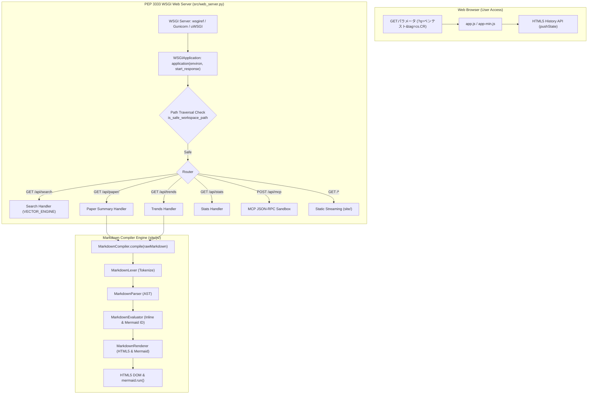

# [DSN-07] 機能設計書: Glassmorphic Web ポータル ＆ Markdown Compiler Engine — arxiv-security-papers

本ドキュメントは、主要機能 **F-06 (Glassmorphic Web 検索ポータル)**、**F-07 (Markdown Compiler Engine)**、および **F-08 (Google Closure Compiler 最適化体系)** のクライアント＆サーバ連携構造、5 層分割コンパイラアーキテクチャ、URL 状態同期、および最適化ビルド仕様を記録する個別機能設計書です。

---

## 1. Web ポータル ＆ クエリ連動アーキテクチャ

本ポータル画面 ([`site/index.html`](../../site/index.html)) は、深みのある Glassmorphism ダークテーマ (`#0b0f19`) を採用したシングルページアプリケーション (SPA) です。Google スタイルの URL GET クエリパラメータ (`?q=クエリ&tag=カテゴリ`) および HTML5 History API (`history.pushState`) に対応し、ダイレクトアクセスやブックマーク共有を完備しています。



### 1.1 PEP 3333 WSGI 仕様 ＆ サーバー構成

`src/web_server.py` は、Python 標準の Web サーバー規格 **PEP 3333 (WSGI v1.0.1)** に完全準拠しています。

- **WSGI Callable**: `application(environ, start_response)` / `app = application`
- **内蔵スタンドアロンサーバー**: `wsgiref.simple_server.make_server`（`make run_web` で起動）
- **マルチワーカー・コンテナ連携**:
  ```bash
  # Gunicorn による本番マルチワーカー起動
  gunicorn -w 4 -b 0.0.0.0:8000 src.web_server:app

  # uWSGI による起動
  uwsgi --http :8000 --wsgi-file src/web_server.py --callable application
  ```
- **セキュリティ制御**:
  - `is_safe_workspace_path` および `os.path.commonpath` によるパストラバーサル防御 (`403 Forbidden`)
  - `CONTENT_LENGTH` 上限 1MB 制限による DoS 防御 (`413 Payload Too Large`)
  - 全 API に対する標準 CORS ヘッダー（`Access-Control-Allow-Origin: *`）付与

---

## 2. 5 層分割 Markdown Compiler Engine アーキテクチャ ([`site/js/`](../../site/js/))

`site/js/` 配下の機能別モジュール群が高度に協調し、高速・安全なトランスパイルを実現します。

1. **[`site/js/lexer.js`](../../site/js/lexer.js)** (`MarkdownLexer`):
   - マークダウン文字列を `HEADING`, `TABLE`, `MERMAID`, `CODE_BLOCK`, `LIST`, `BLOCKQUOTE`, `HR`, `PARAGRAPH` トークンへ分割。
2. **[`site/js/parser.js`](../../site/js/parser.js)** (`MarkdownParser`):
   - トークンストリームから抽象構文木 (`DocumentNode` AST) を自動構築。
3. **[`site/js/evaluator.js`](../../site/js/evaluator.js)** (`MarkdownEvaluator`):
   - AST ノードを走査し、インライン装飾（`**太字**`, `` `コード` ``, `[リンク](url)`）のトランスフォームおよび Mermaid ID の割り当てを実施。
4. **[`site/js/renderer.js`](../../site/js/renderer.js)** (`MarkdownRenderer`):
   - AST から `.md-table`, `.md-h1`〜`.md-h3`, `.md-blockquote` 付き HTML5 エレメントを生成し `mermaid.run()` を実行。
5. **[`site/js/markdown_compiler.js`](../../site/js/markdown_compiler.js)** (`MarkdownCompilerEngine`):
   - オーケストレーターとして Lexer, Parser, Evaluator, Renderer を統一統合。

---

## 3. Google Closure Compiler 最適化 ＆ 型保護仕様

`yuzora` 仕様に準拠し、Google Closure Compiler ツールチェーンを配備しています。

- **ツール配置**: [`tools/closure-compiler/closure-compiler-v20240317.jar`](../../tools/closure-compiler/closure-compiler-v20240317.jar)
- **型保護定義**: [`site/externs.js`](../../site/externs.js)（`mermaid`, `MarkdownCompiler`, `fetch` などの外部シンボル改変を防止）
- **ビルドコマンド**:
  ```bash
  make build_js
  ```
  `site/js/` 配下の全モジュールおよび `site/app.js` を結合・最適化し、[`site/app-min.js`](../../site/app-min.js) を全自動生成。
