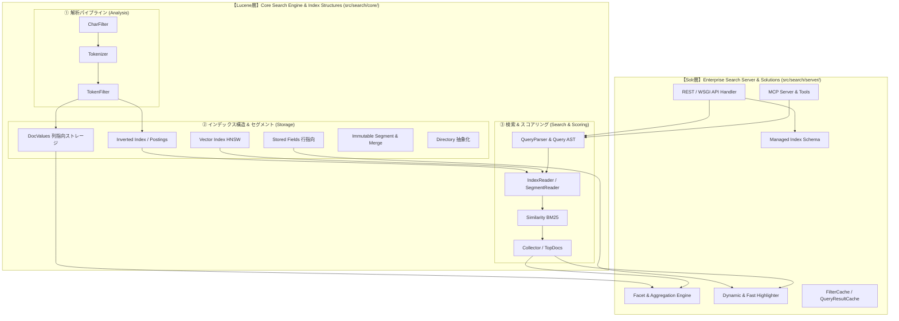

# [DSN-08] 機能設計書: Apache Lucene / Solr パラダイム分離検索アーキテクチャ — arxiv-security-papers

本ドキュメントは、検索エンジン基盤を低レベルコア（Lucene相当）とエンタープライズサーバー層（Solr相当）に完全分離した **Lucene/Solr 2層分離アーキテクチャ** の設計仕様書です。

---

## 1. 2層分離アーキテクチャ概要 (Lucene vs. Solr Paradigm)

---

## 2. 【Lucene層】コア検索ライブラリ仕様 (`src/search/core/`)

### 2.1 解析パイプライン (Analysis)
* **`CharFilter`**: HTMLタグ除去・Unicode 正規化・全角半角統一
* **`Tokenizer`**: 英語空白/記号分割・日本語形態素/バイグラム分割
* **`TokenFilter`**: 小文字化（Lowercase）、ステミング、ストップワード除去、同義語（Synonym）展開

### 2.2 インデックスストレージ (Index Storage)
* **`InvertedIndex` / `PostingsList`**: タームから `(doc_id, tf, positions)` を逆引きする転置インデックス
* **`DocValues`**: `doc_id -> field_value` の列指向ストレージ（ソート・ファセット集約を O(1) で高速化）
* **`StoredFields`**: 元のテキスト・メタデータを保持する行指向データ
* **`Directory` 抽象化**: `RAMDirectory`（インメモリ・高速テスト用）および `FSDirectory` / `MMapDirectory`（ディスク・OSページキャッシュ活用）
* **`Segment`**: 不変（Immutable）セグメント構造、Flush、バックグラウンド Merge / Compaction

### 2.3 検索・スコアリング (Search & Scoring)
* **`Query`**: `TermQuery`, `BooleanQuery`, `PhraseQuery`, `PrefixQuery`, `FuzzyQuery`
* **`QueryParser`**: `field:term`, `+`, `-`, `~`, `*` 構文の抽象構文木（AST）構築
* **`Similarity`**: Okapi BM25 確率的関連度スコア計算
* **`Collector` / `TopDocs`**: 上位 $N$ 件のスコアドキュメント抽出

---

## 3. 【Solr層】エンタープライズ検索サーバー仕様 (`src/search/server/`)

* **`ManagedIndexSchema`**: フィールド型（`text_ja`, `string`, `date`, `int`, `vector`）の定義と動的マッピング
* **`SelectHandler`**: REST API `/api/search` のリクエスト解析・ハイブリッド検索オーケストレーション
* **`FacetEngine`**: `DocValues` を用いた年次・セキュリティドメイン・カテゴリの多次元集約
* **`DynamicHighlighter`**: `StoredFields` とトークンオフセットを用いた XSS 対策済みスニペット抽出
* **`FilterCache` & `QueryResultCache`**: 検索結果およびフィルタビットマップの多層キャッシュ
* **`GraphRAG` / `MCP Integration`**: ナレッジグラフ・引用ネットワーク・MCP ツール連携
