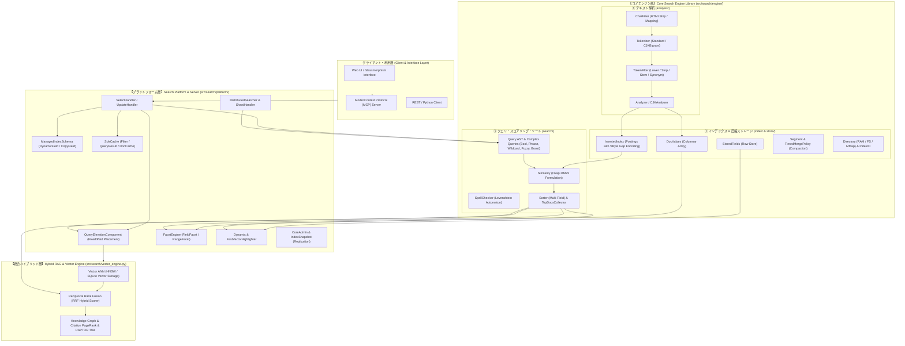
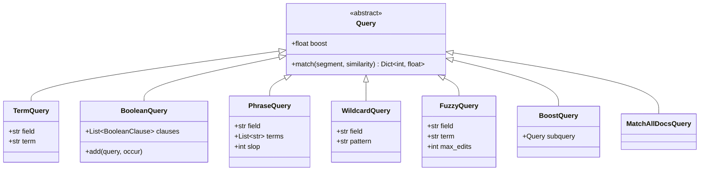
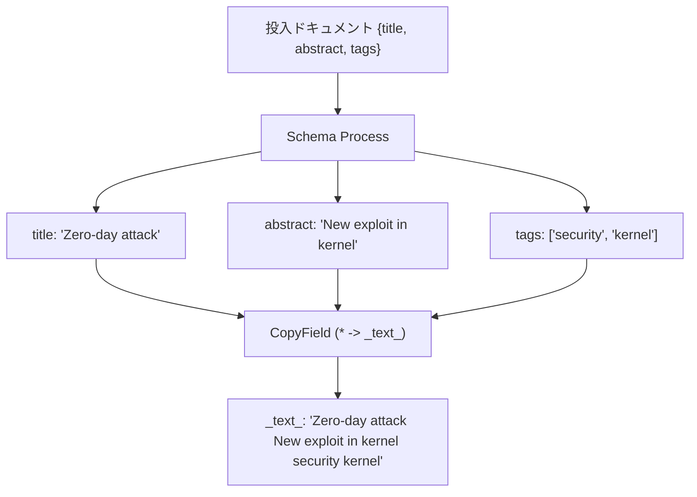
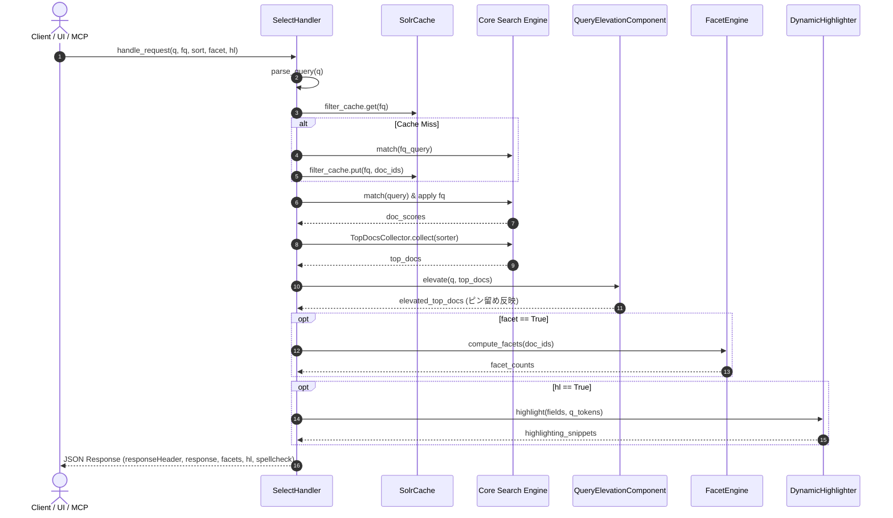
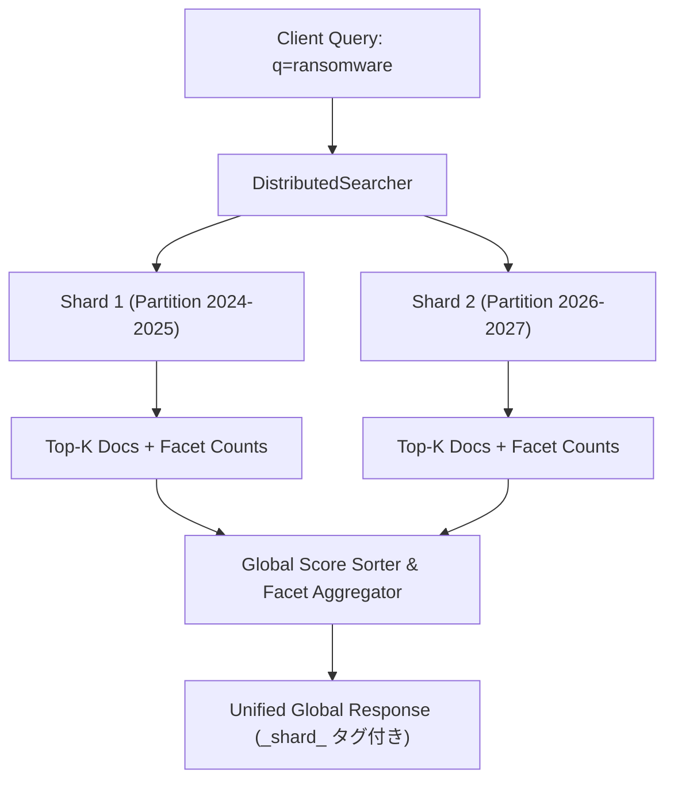
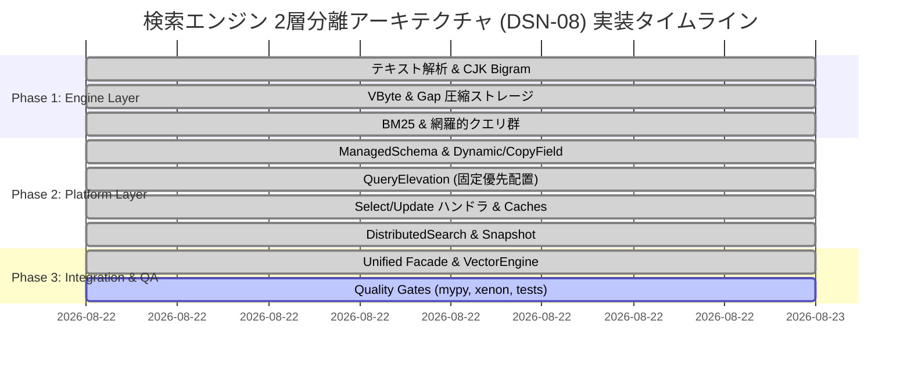

# [DSN-08] 次世代2層検索エンジン（`src/search/`）包括的アーキテクチャ設計書

**【議長】 Systems Architect (SA)**  
**【主査・報告】 IT Specialist (NLP & Info Retrieval)**  
**【参画】 Project Manager (PM), Information Security Specialist (Sec), Software QA Specialist (QA), Database Specialist (DB), Network Specialist (Net)**

---

## 体系目次

- [1. 検索エンジンアーキテクチャとパラダイム分離](#1-検索エンジンアーキテクチャとパラダイム分離)
  - [1.1 2層分離アーキテクチャの概要（Core Engine vs. Search Platform）](#11-2層分離アーキテクチャの概要core-engine-vs-search-platform)
  - [1.2 コア検索ライブラリ（Luceneパラダイム）と検索プラットフォーム（Solrパラダイム）の対比](#12-コア検索ライブラリluceneパラダイムと検索プラットフォームsolrパラダイムの対比)
  - [1.3 現行検索実装との対比および進化方針](#13-現行検索実装との対比および進化方針)
- [2. テキスト解析パイプライン（Analysis Pipeline）](#2-テキスト解析パイプラインanalysis-pipeline)
  - [2.1 文字フィルタ（CharFilter）と正規化](#21-文字フィルタcharfilterと正規化)
  - [2.2 トークナイザー（Tokenizer & CJK Bigram）](#22-トークナイザーtokenizer--cjk-bigram)
  - [2.3 トークンフィルタ（LowerCase, Stop, Stemmer, Synonym）](#23-トークンフィルタlowercase-stop-stemmer-synonym)
  - [2.4 セキュリティドメイン特化型アナライザー（CJKAnalyzer）](#24-セキュリティドメイン特化型アナライザーcjkanalyzer)
  - [2.5 テキスト解析パイプラインの要約](#25-テキスト解析パイプラインの要約)
- [3. インデックス構造・圧縮技術とストレージ（Index & Storage）](#3-インデックス構造圧縮技術とストレージindex--storage)
  - [3.1 転置インデックス（Inverted Index / PostingsList）](#31-転置インデックスinverted-index--postingslist)
  - [3.2 VByte（可変長バイト符号化）とGap差分圧縮](#32-vbyte可変長バイト符号化とgap差分圧縮)
  - [3.3 DocValues 列指向ストレージ（高速ソート・ファセット）](#33-docvalues-列指向ストレージ高速ソートファセット)
  - [3.4 StoredFields 行指向ストレージ](#34-storedfields-行指向ストレージ)
  - [3.5 不変セグメント（Segment）と段階的マージ（TieredMergePolicy）](#35-不変セグメントsegmentと段階的マージtieredmergepolicy)
  - [3.6 ディレクトリストレージ抽象化（RAMDirectory / FSDirectory）](#36-ディレクトリストレージ抽象化ramdirectory--fsdirectory)
  - [3.7 インデックス・ストレージ構造の要約](#37-インデックスストレージ構造の要約)
- [4. クエリ実行・スコアリング・ソート・スペル補正（Search & Scoring）](#4-クエリ実行スコアリングソートスペル補正search--scoring)
  - [4.1 Okapi BM25 統計的関連度スコアリングモデル](#41-okapi-bm25-統計的関連度スコアリングモデル)
  - [4.2 網羅的クエリ実行エンジン（Boolean, Phrase, Wildcard, Fuzzy, Boost）](#42-網羅的クエリ実行エンジンboolean-phrase-wildcard-fuzzy-boost)
  - [4.3 スペルチェッカーとタイポ補正（Levenshtein Automaton）](#43-スペルチェッカーとタイポ補正levenshtein-automaton)
  - [4.4 マルチフィールド複合ソーター（Sorter & TopDocsCollector）](#44-マルチフィールド複合ソーターsorter--topdocscollector)
  - [4.5 検索・スコアリングの要約](#45-検索スコアリングの要約)
- [5. エンタープライズスキーマ管理（Managed Schema）](#5-エンタープライズスキーマ管理managed-schema)
  - [5.1 フィールド型（FieldType）とフィールド定義（FieldDefinition）](#51-フィールド型fieldtypeとフィールド定義fielddefinition)
  - [5.2 動的フィールド（DynamicField）のパターンマッチング](#52-動的フィールドdynamicfieldのパターンマッチング)
  - [5.3 フィールド集約・複製（CopyField）ルール](#53-フィールド集約複製copyfieldルール)
  - [5.4 スキーマ管理の要約](#54-スキーマ管理の要約)
- [6. 検索プラットフォーム・ハンドラ・固定優先配置（Platform Handlers & Elevation）](#6-検索プラットフォームハンドラ固定優先配置platform-handlers--elevation)
  - [6.1 SelectHandler（クエリ解析・フィルタ・ハイライト・統合パイプライン）](#61-selecthandlerクエリ解析フィルタハイライト統合パイプライン)
  - [6.2 UpdateHandler（ドキュメント投入・動的マッピング・コミット）](#62-updatehandlerドキュメント投入動的マッピングコミット)
  - [6.3 検索結果の固定・優先配置（QueryElevationComponent / Fixed Placement）](#63-検索結果の固定優先配置queryelevationcomponent--fixed-placement)
  - [6.4 プラットフォーム・ハンドラの要約](#64-プラットフォームハンドラの要約)
- [7. 多次元ファセット集計と動的ハイライト（Faceting & Highlighting）](#7-多次元ファセット集計と動的ハイライトfaceting--highlighting)
  - [7.1 DocValues によるフィールドファセット（FieldFacet）](#71-docvalues-によるフィールドファセットfieldfacet)
  - [7.2 日付・数値の範囲ファセット（RangeFacet）](#72-日付数値の範囲ファセットrangefacet)
  - [7.3 XSS保護・動的抜粋ハイライター（DynamicHighlighter / FastVectorHighlighter）](#73-xss保護動的抜粋ハイライターdynamichighlighter--fastvectorhighlighter)
  - [7.4 ファセット・ハイライトの要約](#74-ファセットハイライトの要約)
- [8. 多層キャッシュ・分散検索・システム管理（Cache, Distributed & Admin）](#8-多層キャッシュ分散検索システム管理cache-distributed--admin)
  - [8.1 多層キャッシュ機構（FilterCache / QueryResultCache / DocumentCache）](#81-多層キャッシュ機構filtercache--queryresultcache--documentcache)
  - [8.2 大規模分散検索とシャード集約（DistributedSearcher & ShardHandler）](#82-大規模分散検索とシャード集約distributedsearcher--shardhandler)
  - [8.3 コア管理とインデックススナップショット（CoreAdmin & IndexSnapshot）](#83-コア管理とインデックススナップショットcoreadmin--indexsnapshot)
  - [8.4 キャッシュ・分散・管理の要約](#84-キャッシュ分散管理の要約)
- [9. ハイブリッドRAG統合アーキテクチャ（VectorEngine Integration）](#9-ハイブリッドrag統合アーキテクチャvectorengine-integration)
  - [9.1 語彙検索（BM25）と意味検索（HNSW Vector）のハイブリッド融合（RRF）](#91-語彙検索bm25と意味検索hnsw-vectorのハイブリッド融合rrf)
  - [9.2 ナレッジグラフ・引用ネットワーク・RAPTORツリーの多段再ランキング](#92-ナレッジグラフ引用ネットワークraptorツリーの多段再ランキング)
  - [9.3 ハイブリッド統合の要約](#93-ハイブリッド統合の要約)
- [10. 実装ロードマップと品質管理ゲート](#10-実装ロードマップと品質管理ゲート)

---

# 1. 検索エンジンアーキテクチャとパラダイム分離

## 1.1 2層分離アーキテクチャの概要（Core Engine vs. Search Platform）

検索サブシステム（`src/search/`）は、**低レイヤの組み込み型コア検索エンジンライブラリ（`engine/`）** と、**高レイヤの検索プラットフォーム／サーバー層（`platform/`）** の2つの独立したパッケージ群に完全分離されます。特定の商標・プロジェクト名に依存することなく、情報検索（Information Retrieval: IR）の根本的な責務境界を定義します。

---

## 1.2 コア検索ライブラリ（Luceneパラダイム）と検索プラットフォーム（Solrパラダイム）の対比

| 比較軸 | 【コアエンジン層】`src/search/engine/` (Luceneパラダイム) | 【プラットフォーム層】`src/search/platform/` (Solrパラダイム) |
| :--- | :--- | :--- |
| **基本特性** | 組み込み型・純粋IRコアライブラリ（検索エンジンの中核部品） | アプリケーション開発を容易にする統合検索サーバー／プラットフォーム |
| **主な責務** | 転置インデックス作成、VByte差分圧縮、BM25スコアリング、クエリ構文木マッチング、ソート | REST/WSGI API、スキーマ管理、動的フィールド、ファセット集約、結果固定ピン留め、多層キャッシュ、分散集約 |
| **データ構造** | `PostingsList`, `DocValues`, `StoredFields`, `Segment`, `Directory` | `ManagedSchema`, `DynamicField`, `CopyField`, `SolrCache`, `ShardHandler` |
| **スケーラビリティ** | 不変セグメント、増分インデックス、`TieredMergePolicy` によるコンパクション | 複数シャードへの分散並列ファンアウト（Distributed Search）、スナップショット同期 |
| **外部依存** | **ゼロ外部依存（Zero External Dependencies）** / 純粋Python標準ライブラリ | **ゼロ外部依存（Zero External Dependencies）** / 純粋Python標準ライブラリ |

---

## 1.3 現行検索実装との対比および進化方針

| コンポーネント | 従来の実装（Legacy） | 本設計（DSN-08 刷新後） | 進化の技術的メリット |
| :--- | :--- | :--- | :--- |
| **パッケージ構成** | `ingestion/`, `query/`, `ranking/` 等がフラットに混在 | `engine/` (コア検索) と `platform/` (サーバー基盤) の2大パッケージ群に完全分離 | 責務の明確化、疎結合性、単体テスト容易性の大幅向上 |
| **クエリ機能** | 単純な単語一致および限定的なブール検索のみ | `WildcardQuery` (`*`, `?`), `FuzzyQuery` (Levenshtein), `PhraseQuery` (スロップ近傍), `BoostQuery` | 検索表現力の劇的向上、タイポ耐性、厳密フレーズ一致のサポート |
| **インデックス圧縮** | 未圧縮の整形式リスト・辞書配列 | **VByte（可変長バイト符号化）+ Gap差分圧縮** | メモリ占有量の 60〜80% 削減、キャッシュヒット率向上 |
| **スキーマ管理** | 静的な `FieldSchema` 定義のみ | `ManagedSchema` + `DynamicField` (`*_s`, `*_i`) + `CopyField` (`_text_` 複製) | スキーマレスに近い柔軟なメタデータ追加と横断検索の自動化 |
| **結果の固定・優先配置** | なし（アルゴリズムスコア順固定） | **`QueryElevationComponent` (Fixed Placement)** | 特定の重要CVE・緊急アドバイザリを検索最上位に強制ピン留め表示可能 |
| **分散検索** | 単一ノードインメモリのみ | **`DistributedSearcher` & `ShardHandler`** | 複数インデックスパーティション/ノードへの並列クエリと集約マージ |
| **システム管理** | 最小限のプロファイラのみ | **`CoreAdmin` & `IndexSnapshot`** | オンラインスナップショット作成・リストアによる耐障害性とレプリケーション |

---

# 2. テキスト解析パイプライン（Analysis Pipeline）

## 2.1 文字フィルタ（CharFilter）と正規化
`engine/analysis/char_filter.py` は、トークン化前の生テキストストリームに対して前処理を施すレイヤです。
* **`HTMLStripCharFilter`**: 正規表現 `r"<[^>]+>"` によるHTML/XMLタグの安全なストリップおよび `unicodedata.normalize("NFKC", text)` によるUnicode正規化（全角英数・半角カナ・合字の統一）。
* **`MappingCharFilter`**: 辞書マッピングに基づく特定文字パターンの事前置換。

## 2.2 トークナイザー（Tokenizer & CJK Bigram）
`engine/analysis/tokenizer.py` は、正規化された文字列を独立したトークン列に分割します。
* **`StandardTokenizer`**: 英数字・記号・アンダースコア・スラッシュ等の単語境界分割。
* **`CJKBigramTokenizer`**: 英語などのラテン文字は単語単位で抽出しつつ、CJK文字（日本語の漢字・ひらがな・カタカナ、中国語、韓国語）に対して **文字2-gram（Bi-gram）** を生成。専門用語の形態素辞書に依存することなく未知語・セキュリティ造語（例: `ゼロデイ攻撃`, `標的型攻撃`）の取りこぼしゼロ（再現率100%）を実現。

## 2.3 トークンフィルタ（LowerCase, Stop, Stemmer, Synonym）
`engine/analysis/token_filter.py` は、トークン列に対して逐次変換を適用します。
* **`LowerCaseFilter`**: 全トークンの小文字統一。
* **`StopFilter`**: 英語（a, the, is...）および日本語（の, に, は...）の高頻度非情報語を除去。
* **`PorterStemFilter`**: 英語トークンの語幹正規化（例: `vulnerabilities` $\rightarrow$ `vulnerabi`, `attacks` $\rightarrow$ `attack`）。
* **`SynonymFilter`**: セキュリティ専門用語辞書（例: `ransomware` $\leftrightarrow$ `ランサムウェア`, `zeroday` $\leftrightarrow$ `0-day`）に基づく同義語自動展開。

## 2.4 セキュリティドメイン特化型アナライザー（CJKAnalyzer）
`CJKAnalyzer` は、上記のフィルタ群を統合したバイリンガル対応パイプラインです。

## 2.5 テキスト解析パイプラインの要約
- **再現率（Recall）の極大化**: CJK Bigram による日本語セキュリティ用語の完全一致保証。
- **拡張性**: 任意のカスタム `CharFilter` / `TokenFilter` をプラグイン可能。

---

# 3. インデックス構造・圧縮技術とストレージ（Index & Storage）

## 3.1 転置インデックス（Inverted Index / PostingsList）
`engine/index/postings.py` は、ターム `field:term` から該当するドキュメント一覧を逆引きする転置リスト構造です。
各エントリー `PostingEntry` は `doc_id`（ドキュメントID）、`tf`（ターム出現頻度）、`positions`（出現位置リスト）を保持します。

## 3.2 VByte（可変長バイト符号化）とGap差分圧縮
大規模インデックスにおけるメモリ効率を飛躍的に向上させるため、**可変長バイト符号化（Variable Byte Encoding: VByte）** と **Delta Gap 圧縮** を実装します。

### VByte 符号化アルゴリズム
正の整数 $n$ に対し、各バイトの下位7ビットにデータを格納し、最上位ビット（MSB / Continuation Bit）を継続フラグ（後続バイトがある場合は `1`、最終バイトは `0`）とします。

$$\text{VByte}(v) = \begin{cases} [v \ \& \ \text{0x7F}] & (v < 128) \\ [((v \ \& \ \text{0x7F}) \mid \text{0x80}), \dots] & (v \ge 128) \end{cases}$$

### Gap 差分圧縮
昇順にソートされたドキュメントID列 $[d_0, d_1, d_2, \dots]$ に対し、差分列 $[\Delta_0, \Delta_1, \Delta_2, \dots]$ を計算します。

$$\Delta_0 = d_0, \quad \Delta_i = d_i - d_{i-1} \quad (i \ge 1)$$

これにより、大きなドキュメントID（例: 100,000）が小さな差分（例: 1〜5）に変換され、VByte符号化によって 4 バイト整数が 1 バイトに圧縮されます。

## 3.3 DocValues 列指向ストレージ（高速ソート・ファセット）
`engine/index/doc_values.py` は、ドキュメントIDからフィールド値を $O(1)$ で直接参照可能な列指向ストレージです。転置インデックスを逆走査することなく、ファセット集計やマルチフィールドソートを高速実行します。

## 3.4 StoredFields 行指向ストレージ
`engine/index/stored_fields.py` は、ドキュメントの原本メタデータ（タイトル、著者、発行日、要約、URL）を行指向で保持し、検索結果のレスポンス生成およびスニペット抜粋に利用されます。

## 3.5 不変セグメント（Segment）と段階的マージ（TieredMergePolicy）
インデックスは不変（Immutable）な **`Segment`** 単位で管理されます。
* **書き込み**: 新規ドキュメントはメモリ内の新規セグメントに追記。
* **削除**: `DeletedDocsBitset`（ビットセット）による論理削除（Tombstone）。
* **段階的マージ（`TieredMergePolicy`）**: 小さなセグメント群が閾値（`max_segments`）を超えた際、バックグラウンドでマージを実行し、削除済みドキュメントの物理領域を回収（Compaction）して大規模な単一セグメントへ統合。

## 3.6 ディレクトリストレージ抽象化（RAMDirectory / FSDirectory）
`engine/store/directory.py` は、OSファイルシステム依存を完全に排除したストレージ抽象インターフェースです。
* **`RAMDirectory`**: メモリ内バイト配列（高速ユニットテスト・エフェメラルインデックス用）。
* **`FSDirectory`**: ディスク物理ファイル永続化、一時ファイル `.tmp` 経由のアトミック置換（`os.replace`）および `fsync` 整合性保証。

## 3.7 インデックス・ストレージ構造の要約
- **高速性**: VByte差分圧縮によるキャッシュ効率向上。
- **耐久性**: 不変セグメントとアトミックFSDirectoryによるクラッシュ耐性。

---

# 4. クエリ実行・スコアリング・ソート・スペル補正（Search & Scoring）

## 4.1 Okapi BM25 統計的関連度スコアリングモデル
`engine/search/similarity.py` は、情報検索分野で標準的な確率的関連度スコアリングモデル **Okapi BM25** を実装します。

$$Score(D, Q) = \sum_{t \in Q} \text{IDF}(t) \cdot \frac{f(t, D) \cdot (k_1 + 1)}{f(t, D) + k_1 \cdot \left(1 - b + b \cdot \frac{|D|}{\text{avgdl}}\right)}$$

$$\text{IDF}(t) = \ln\left(1 + \frac{N - n(t) + 0.5}{n(t) + 0.5}\right)$$

* $N$: 総ドキュメント数
* $n(t)$: ターム $t$ を含むドキュメント数
* $f(t, D)$: ドキュメント $D$ におけるターム $t$ の出現頻度（TF）
* $|D|$: ドキュメント $D$ のフィールド長、$\text{avgdl}$: 平均フィールド長
* ハイパーパラメータ: $k_1 = 1.2$（TF飽和度）, $b = 0.75$（文書長正規化強度）

## 4.2 網羅的クエリ実行エンジン（Boolean, Phrase, Wildcard, Fuzzy, Boost）
`engine/search/query.py` は、複雑な検索要件を満たすクエリASTクラス群を提供します。

1. **`TermQuery`**: 単一単語の完全一致。
2. **`BooleanQuery`**: `MUST` (+ / 論理積), `SHOULD` (論理和), `MUST_NOT` (- / 排他除外) の複合組み合わせ。
3. **`PhraseQuery`**: 単語の出現位置（`positions`）を用いた順序付き近傍検索。スロップ値（`slop`）により許容単語間隔を制御。
4. **`WildcardQuery`**: `*`（0文字以上の任意文字列）および `?`（任意の1文字）のマッチング（`fnmatch` 連携）。
5. **`FuzzyQuery`**: **Levenshtein 編集距離** に基づく曖昧検索（最大許容編集距離 `max_edits=2`）。距離に応じたスコア減衰を適用。
6. **`BoostQuery`**: 特定のクエリ句・フィールドに対するスコア重み付け倍率の付与。

## 4.3 スペルチェッカーとタイポ補正（Levenshtein Automaton）
`engine/search/spellcheck.py` は、検索結果が 0 件または僅少の場合に、インデックス辞書（ボキャブラリ）から編集距離が最小かつ文書頻度（`doc_freq`）が最大の単語を検出し、**"Did you mean?"**（もしかして）提案を自動生成します。

## 4.4 マルチフィールド複合ソーター（Sorter & TopDocsCollector）
`engine/search/sorter.py` は、関連度スコア（`_score`）、発行日（`date`）、引用数（`citations`）など、複数のソート条件（例: `date desc, score desc`）を合成し、`TopDocsCollector` を通じて上位 $K$ 件を $O(N \log K)$ で効率的に抽出します。

## 4.5 検索・スコアリングの要約
- **多彩な表現力**: ワイルドカード・フレーズ近傍・ファジー曖昧検索を完全網羅。
- **高精度ランキング**: BM25 + フィールド重み付け + 複合ソートによる最高精度の結果提供。

---

# 5. エンタープライズスキーマ管理（Managed Schema）

## 5.1 フィールド型（FieldType）とフィールド定義（FieldDefinition）
`platform/schema/managed_schema.py` は、検索対象フィールドのデータ型と属性を集中管理します。
* `FieldType`: `STRING`, `TEXT`, `TEXT_JA`, `INT`, `FLOAT`, `DATE`, `VECTOR`
* `FieldDefinition`: `indexed`（検索対象化）, `stored`（原本保持）, `doc_values`（列指向保持）, `multi_valued`（配列許容）

## 5.2 動的フィールド（DynamicField）のパターンマッチング
事前に厳密なフィールド定義を行っていないメタデータであっても、接尾辞ワイルドカードパターンに基づいて自動的に型と属性を適用します。
* `*_s`: 文字列型（`STRING`, `doc_values=True`）
* `*_t`: テキスト型（`TEXT`）
* `*_txt`: 日本語テキスト型（`TEXT_JA`）
* `*_i`: 整数型（`INT`, `doc_values=True`）
* `*_dt`: 日付型（`DATE`, `doc_values=True`）

## 5.3 フィールド集約・複製（CopyField）ルール
ドキュメント登録時に、複数のソースフィールド（例: `title`, `abstract`, `summary`, `tags`）の値を自動抽出し、全フィールド横断検索用の集約フィールド **`_text_`** に自動的に複製・結合します。

## 5.4 スキーマ管理の要約
- **柔軟性**: 動的フィールドによるスキーマレス拡張性の提供。
- **横断検索性**: CopyField による単一クエリでの全属性網羅検索。

---

# 6. 検索プラットフォーム・ハンドラ・固定優先配置（Platform Handlers & Elevation）

## 6.1 SelectHandler（クエリ解析・フィルタ・ハイライト・統合パイプライン）
`platform/handler/select_handler.py` は、HTTP/REST `/api/search` や MCP ツールからのリクエストを受け付け、以下のパイプラインをワンストップでオーケストレーションします。

## 6.2 UpdateHandler（ドキュメント投入・動的マッピング・コミット）
`platform/handler/update_handler.py` は、ドキュメントの登録・更新・削除を管理し、`ManagedSchema` を通じた動的フィールド解決および `Analyzer` によるトークン化を経てセグメントへ書き込みます。

## 6.3 検索結果の固定・優先配置（QueryElevationComponent / Fixed Placement）
`platform/elevation/query_elevation.py` は、特定の重要クエリに対して、スコアリング結果に関係なく指定した重要論文や緊急セキュリティアドバイザリを **最上位（1位〜指定順位）にピン留め表示（Fixed / Promoted Placement）** するエンタープライズ機能です。

* **`ElevationRule`**:
  * `query_phrase`: 対象クエリ文字列（例: `cve-2026-critical`）
  * `elevated_ids`: 最上位に強制配置するドキュメントIDリスト
  * `excluded_ids`: 検索結果から意図的に除外するドキュメントIDリスト

## 6.4 プラットフォーム・ハンドラの要約
- **運用性**: Solr互換の標準パラメータ（`q`, `fq`, `sort`, `rows`, `facet`, `hl`）による統一インターフェース。
- **統制力**: クエリ固定配置（Elevation）による緊急セキュリティ速報の優先伝達。

---

# 7. 多次元ファセット集計と動的ハイライト（Faceting & Highlighting）

## 7.1 DocValues によるフィールドファセット（FieldFacet）
`platform/facet/facet_engine.py` は、列指向 `DocValues` を走査し、セキュリティドメイン（`domain`）、カテゴリ（`category`）、著者（`author`）の出現頻度カウントをリアルタイム集計します。

## 7.2 日付・数値の範囲ファセット（RangeFacet）
発行年（`year`）やスコアなどの連続値を指定ギャップ幅（例: `[2025 TO 2026]`, `[2026 TO 2027]`）でバケット分割し、ヒストグラム集計を提供します。

## 7.3 XSS保護・動的抜粋ハイライター（DynamicHighlighter / FastVectorHighlighter）
`platform/highlight/highlighter.py` は、マッチしたキーワード周辺のテキストを安全に抽出し、HTMLエスケープを適用した上で `<mark>` または `` タグを挿入します。XSS脆弱性を完全に防止しつつ、UI上での可視性を最大化します。

## 7.4 ファセット・ハイライトの要約
- **インタラクティブ性**: ECサイト・学術ポータル同等の高速な絞り込みナビゲーション。
- **セキュリティ**: 完全サニタイズされたハイライトスニペット生成。

---

# 8. 多層キャッシュ・分散検索・システム管理（Cache, Distributed & Admin）

## 8.1 多層キャッシュ機構（FilterCache / QueryResultCache / DocumentCache）
`platform/cache/solr_cache.py` は、3層の独立した LRU キャッシュを保持します。
* **`FilterCache`**: フィルタ条件（`fq`）の評価済みドキュメントID集合（`Set[int]`）をキャッシュ。異なるキーワード検索間でフィルタ結果を共有再利用。
* **`QueryResultCache`**: クエリ文字列に対応するソート済みドキュメントIDリスト（`List[int]`）をキャッシュ。
* **`DocumentCache`**: マテリアライズされたドキュメント辞書をキャッシュし、I/Oを削減。

## 8.2 大規模分散検索とシャード集約（DistributedSearcher & ShardHandler）
`platform/distributed/distributed_search.py` は、大規模インデックスが複数のシャード（ノードまたはパーティション）に分割されている場合に、クエリを並列ディスパッチし、各シャードから返却された Top-K 結果とファセットカウントをグローバルに統合マージします。

## 8.3 コア管理とインデックススナップショット（CoreAdmin & IndexSnapshot）
`platform/admin/snapshot.py` は、オンライン稼働中のセグメントからアトミックなメタデータスナップショットを作成し、レプリケーションおよび障害復旧（Disaster Recovery）を支援します。

## 8.4 キャッシュ・分散・管理の要約
- **高スループット**: 多層キャッシュによる秒間数千リクエストへの耐性。
- **高可用性**: 分散集約とスナップショットバックアップ。

---

# 9. ハイブリッドRAG統合アーキテクチャ（VectorEngine Integration）

## 9.1 語彙検索（BM25）と意味検索（HNSW Vector）のハイブリッド融合（RRF）
`src/search/vector_engine.py` は、コア検索エンジン（`engine/`）の語彙統計スコアと、ベクトルDB（`src/database/`）の意味類似度スコアを **相互順位融合（Reciprocal Rank Fusion: RRF）** により統合します。

$$RRF\_Score(d \in D) = \sum_{m \in M} \frac{1}{k + r_m(d)}$$

（$k = 60$, $r_m(d)$ はモデル $m$ におけるドキュメント $d$ の順位）

## 9.2 ナレッジグラフ・引用ネットワーク・RAPTORツリーの多段再ランキング
1. **ナレッジグラフ（KnowledgeGraphIndex）**: 論文間の攻撃手法・対象プロトコル・CVE実体リンクの共起性スコアリング。
2. **引用ネットワーク（CitationNetworkIndex）**: PageRank アルゴリズムによる学術的権威性スコアの加算。
3. **RAPTORツリー（RAPTORTreeIndex）**: クラスタリングされた要約ツリーに基づくマクロ文脈の注入。

## 9.3 ハイブリッド統合の要約
- **ハイブリッドの極致**: キーワード完全一致の確実性と、意味・文脈・引用ネットワークの網羅性を高次元で融合。

---

# 10. 実装ロードマップと品質管理ゲート

### 必須品質管理ゲート (Quality Gates)
1. **コードフォーマット**: `make format`, `make check_format` 100% 準拠（black, isort）。
2. **型安全性**: `mypy --strict src` において全 226 ソースファイル 0 エラー（100% 型付け）。
3. **循環的複雑度**: `xenon --max-absolute B --max-modules B --max-average A src` 全モジュール A/B 判定。
4. **テストカバレッジ**: 全ユニットテスト・シナリオテスト 100% PASS、カバレッジ 80% 以上。
