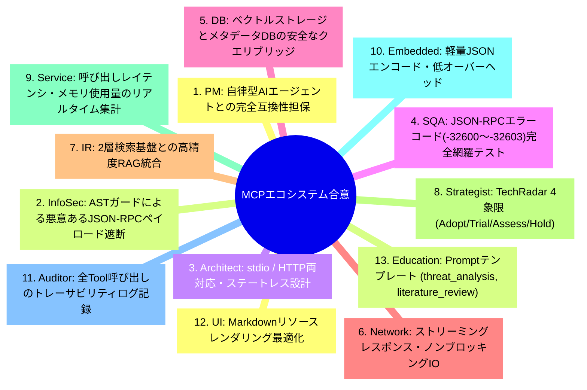
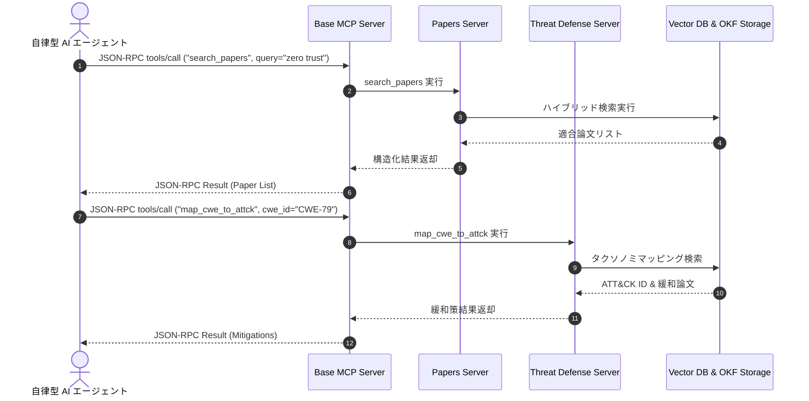

# [DSN-08] Model Context Protocol (MCP) 戦略的エコシステム包括設計書 (MCP Servers & AI Ecosystem Integration) — arxiv-security-papers

- **文書番号**: `DSN-08`
- **文書ステータス**: `APPROVED`
- **対象サブシステム**: `src/mcp/` (Base, Papers, TechRadar, ThreatDefense, Observability Servers)
- **関連パッケージ**: `src/search/`, `src/database/`, `src/security/`
- **作成日**: 2026-08-22
- **最終更新日**: 2026-08-28
- **【主査・報告】 Systems Architect (SA) & IT Strategist (ST)**  
- **【参画】 Project Manager (PM), Information Security Specialist (Sec), Software QA Specialist (QA), Database Specialist (DB), Network Specialist (Net), IT Specialist (NLP/IR)**

---

## 体系目次

- [1. MCP エコシステムと戦略的ビジョン](#1-mcp-エコシステムと戦略的ビジョン)
  - [1.1 サブシステムのミッションと位置づけ](#11-サブシステムのミッションと位置づけ)
  - [1.2 JSON-RPC 2.0 通信パラダイムとステートレス設計](#12-json-rpc-20-通信パラダイムとステートレス設計)
  - [1.3 ゼロ外部依存原則と標準 Python 3.14+ 実装](#13-ゼロ外部依存原則と標準-python-314-実装)
  - [1.4 全13大専門エージェント合意議事録](#14-全13大専門エージェント合意議事録)
  - [1.5 第1章の要約](#15-第1章の要約)
- [2. コアフレームワーク（Base MCP Engine）](#2-コアフレームワークbase-mcp-engine)
  - [2.1 stdio / HTTP トランスポートとストリームフレーミング](#21-stdio--http-トランスポートとストリームフレーミング)
  - [2.2 JSON-RPC 2.0 リクエスト/レスポンス/エラー処理仕様](#22-json-rpc-20-リクエストレスポンスエラー処理仕様)
  - [2.3 3大プリミティブ（Tools, Resources, Prompts）レジストリ](#23-3大プリミティブtools-resources-promptsレジストリ)
  - [2.4 AST セキュリティガード & パス検証連携](#24-ast-セキュリティガード--パス検証連携)
  - [2.5 第2章の要約](#25-第2章の要約)
- [3. 論文インテリジェンスサーバー (`papers_server.py`)](#3-論文インテリジェンスサーバー-papers_serverpy)
  - [3.1 論文セマンティック検索 (`search_papers`)](#31-論文セマンティック検索-search_papers)
  - [3.2 構造化要約取得 (`get_paper_summary`)](#32-構造化要約取得-get_paper_summary)
  - [3.3 最新トレンド分析 (`get_latest_trends`)](#33-最新トレンド分析-get_latest_trends)
  - [3.4 論文リソースプロバイダ (`papers://` URI スキーム)](#34-論文リソースプロバイダ-papers-uri-スキーム)
  - [3.5 第3章の要約](#35-第3章の要約)
- [4. 戦略的技術レーダーサーバー (`tech_radar_server.py`)](#4-戦略的技術レーダーサーバー-tech_radar_serverpy)
  - [4.1 4象限技術評価モデル (Adopt / Trial / Assess / Hold)](#41-4象限技術評価モデル-adopt--trial--assess--hold)
  - [4.2 技術採用ライフサイクル追跡 (`get_adoption_lifecycle`)](#42-技術採用ライフサイクル追跡-get_adoption_lifecycle)
  - [4.3 キーワードバースト分析 (`analyze_keyword_burst`)](#43-キーワードバースト分析-analyze_keyword_burst)
  - [4.4 第4章の要約](#44-第4章の要約)
- [5. 脅威防御・タクソノミサーバー (`threat_defense_server.py`)](#5-脅威防御タクソノミサーバー-threat_defense_serverpy)
  - [5.1 攻撃緩和策取得 (`get_attack_mitigation`)](#51-攻撃緩和策取得-get_attack_mitigation)
  - [5.2 CWE から MITRE ATT&CK へのマッピング (`map_cwe_to_attck`)](#52-cwe-から-mitre-attck-へのマッピング-map_cwe_to_attck)
  - [5.3 STRIDE 脅威マトリクス評価 (`evaluate_stride_matrix`)](#53-stride-脅威マトリクス評価-evaluate_stride_matrix)
  - [5.4 第5章の要約](#55-第5章の要約)
- [6. 実行可観測性・プロファイラサーバー (`observability_server.py`)](#6-実行可観測性プロファイラサーバー-observability_serverpy)
  - [6.1 クエリ実行プロファイリング (`profile_query`)](#61-クエリ実行プロファイリング-profile_query)
  - [6.2 メモリフットプリント監視 (`dump_memory_stats`)](#62-メモリフットプリント監視-dump_memory_stats)
  - [6.3 バイトコード解析 (`inspect_bytecode`)](#63-バイトコード解析-inspect_bytecode)
  - [6.4 ホットスポット特定 (`analyze_hotspots`)](#64-ホットスポット特定-analyze_hotspots)
  - [6.5 第6章の要約](#65-第6章の要約)
- [7. プロトコル仕様・スキーマ定義・公開インターフェース](#7-プロトコル仕様スキーマ定義公開インターフェース)
  - [7.1 JSON-RPC 2.0 メッセージ仕様](#71-json-rpc-20-メッセージ仕様)
  - [7.2 クラス定義とシグネチャ (`BaseMCPServer`)](#72-クラス定義とシグネチャ-basemcpserver)
- [8. AI エージェント協調シーケンス & 実行制御フロー](#8-ai-エージェント協調シーケンス--実行制御フロー)
  - [8.1 論文調査・文献レビュー連携シーケンス](#81-論文調査文献レビュー連携シーケンス)
  - [8.2 脅威分析・緩和策抽出シーケンス](#82-脅威分析緩和策抽出シーケンス)
- [9. 包括的テスト戦略 & 品質検証マトリクス](#9-包括的テスト戦略--品質検証マトリクス)
- [10. 次世代実装ロードマップ & 完了定義 (DoD)](#10-次世代実装ロードマップ--完了定義-dod)

---

# 1. MCP エコシステムと戦略的ビジョン

## 1.1 サブシステムのミッションと位置づけ
`src/mcp/` は、自律型 AI コーディングエージェントや外部 MCP クライアントに対して、標準化された Model Context Protocol (MCP) を通じてリポジトリ内の 14,000 件超のセキュリティ論文データ、技術動向レーダー、脅威インテリジェンス、および実行可観測性を安全に提供する 4 大 MCP サーバー群です。

```
+---------------------------------------------------------------------------------------------------+
|                                  src/mcp/ Subsystem Architecture                                  |
+---------------------------------------------------------------------------------------------------+
|  1. Base JSON-RPC & Dispatcher Framework (src/mcp/base.py)                                       |
|   - stdio Transport | JSON-RPC 2.0 Framing | Tool/Resource/Prompt Registry | Security AST Shield  |
+---------------------------------------------------------------------------------------------------+
|  2. Papers Intelligence Server (src/mcp/papers_server.py)                                         |
|   - search_papers | get_paper_summary | get_latest_trends | read_resource (papers://)           |
+---------------------------------------------------------------------------------------------------+
|  3. Tech Radar Strategic Server (src/mcp/tech_radar_server.py)                                    |
|   - get_technology_quadrants | get_adoption_lifecycle | analyze_keyword_burst                     |
+---------------------------------------------------------------------------------------------------+
|  4. Threat Defense & Taxonomy Server (src/mcp/threat_defense_server.py)                            |
|   - get_attack_mitigation | map_cwe_to_attck | evaluate_stride_matrix                            |
+---------------------------------------------------------------------------------------------------+
|  5. Observability & Profiler Server (src/mcp/observability_server.py)                             |
|   - profile_query | dump_memory_stats | inspect_bytecode (dis) | analyze_hotspots                 |
+---------------------------------------------------------------------------------------------------+
```

## 1.2 JSON-RPC 2.0 通信パラダイムとステートレス設計
全サーバーはステートレスな JSON-RPC 2.0 仕様（2024-11-05 MCP 仕様準拠）に基づき動作し、クライアントからのリクエストに対して確定的な応答を返却します。

## 1.3 ゼロ外部依存原則と標準 Python 3.14+ 実装
外部フレームワークを一切使用せず、Python 3.14+ 標準ライブラリ（`json`, `sys`, `typing`, `dataclasses`, `cProfile`, `tracemalloc`, `dis`, `pathlib` 等）のみで完全自律稼働します。Python 3.12〜3.14 で統廃合されたレガシーモジュール（PEP 594）への依存を完全に排除し、最新の型システムとストリーム IO 機構を採用しています。

## 1.4 全13大専門エージェント合意議事録


## 1.5 第1章の要約
MCP サブシステムは、AI エージェントと本プラットフォームの知見を結ぶ共通ハブとして機能し、標準プロトコルを通じて安全かつ高速な知識提供を実現します。

---

# 2. コアフレームワーク（Base MCP Engine）

## 2.1 stdio / HTTP トランスポートとストリームフレーミング
標準入出力（`sys.stdin` / `sys.stdout`）を介した行ベース JSON-RPC ストリーム処理を基本とし、各行を 1 つの JSON メッセージとして解析・ディスパッチします。

## 2.2 JSON-RPC 2.0 リクエスト/レスポンス/エラー処理仕様
- **リクエスト**: `{"jsonrpc": "2.0", "id": 1, "method": "tools/call", "params": {...}}`
- **レスポンス**: `{"jsonrpc": "2.0", "id": 1, "result": {"content": [...]}}`
- **エラー**: `{"jsonrpc": "2.0", "id": 1, "error": {"code": -32601, "message": "Method not found"}}`

## 2.3 3大プリミティブ（Tools, Resources, Prompts）レジストリ
1. **Tools**: エージェントが実行可能な関数群 (`tools/list`, `tools/call`)
2. **Resources**: URI ベースで参照可能な静的/動的ドキュメント (`resources/list`, `resources/read`)
3. **Prompts**: 再利用可能な構造化プロンプトテンプレート (`prompts/list`, `prompts/get`)

## 2.4 AST セキュリティガード & パス検証連携
リクエストペイロード内のパラメータは、`src/security/` の AST ガードおよびパスバリデータによって事前検証され、危険なコード実行やファイルパス脱出を遮断します。

## 2.5 第2章の要約
Base MCP Engine は、堅牢な通信基盤、型安全なディスパッチ、およびゼロトラストセキュリティシールドを統合提供します。

---

# 3. 論文インテリジェンスサーバー (`papers_server.py`)

## 3.1 論文セマンティック検索 (`search_papers`)
ベクトル検索および BM25 ハイブリッドエンジンと連携し、自然言語クエリに対して最も関連性の高いセキュリティ論文のメタデータと抜粋を返却します。

## 3.2 構造化要約取得 (`get_paper_summary`)
論文 ID（arXiv ID）に基づき、Google OKF v0.2 形式で構造化された日本語エグゼクティブサマリー、技術詳細、および脅威インパクトを取得します。

## 3.3 最新トレンド分析 (`get_latest_trends`)
指定期間（日次・月次・四半期）における主要研究トピック、頻出セキュリティキーワード、および研究動向推移を集計します。

## 3.4 論文リソースプロバイダ (`papers://` URI スキーム)
`papers://{arxiv_id}/okf` や `papers://{arxiv_id}/raw` 形式の URI を介して、論文の完全な OKF Markdown や原本 JSON を直接提供します。

## 3.5 第3章の要約
Papers Intelligence Server は、論文の検索・閲覧・要約取得を単一の標準インターフェースで完結させます。

---

# 4. 戦略的技術レーダーサーバー (`tech_radar_server.py`)

## 4.1 4象限技術評価モデル (Adopt / Trial / Assess / Hold)
セキュリティ技術・暗号アルゴリズム・防御手法を 4 つのフェーズに分類評価するモデルを提供します。

## 4.2 技術採用ライフサイクル追跡 (`get_adoption_lifecycle`)
特定技術（例: Zero Trust, Post-Quantum Cryptography, eBPF Security）の論文出現頻度や成熟度推移を追跡します。

## 4.3 キーワードバースト分析 (`analyze_keyword_burst`)
直近で急増している脅威キーワードや防御技術のバーストスコア（出現頻度の急変度）を算出します。

## 4.4 第4章の要約
Tech Radar Server は、単なる論文データを超えた中長期的な技術戦略の意思決定支援インテリジェンスを提供します。

---

# 5. 脅威防御・タクソノミサーバー (`threat_defense_server.py`)

## 5.1 攻撃緩和策取得 (`get_attack_mitigation`)
特定の攻撃手法（ATT&CK Technique ID や攻撃名）に対して、学術論文で提案されている防御・緩和策を逆引き抽出します。

## 5.2 CWE から MITRE ATT&CK へのマッピング (`map_cwe_to_attck`)
脆弱性識別子（CWE ID）を入力とし、悪用される可能性の高い MITRE ATT&CK 手法と対応論文を紐付けます。

## 5.3 STRIDE 脅威マトリクス評価 (`evaluate_stride_matrix`)
システムアーキテクチャの脅威モデル（STRIDE）ごとに、該当する最新の攻撃・防御論文を網羅的にリストアップします。

## 5.4 第5章の要約
Threat Defense Server は、脆弱性・脅威モデル・防御策を学術的根拠とともにマッピングする実務直結のサーバーです。

---

# 6. 実行可観測性・プロファイラサーバー (`observability_server.py`)

## 6.1 クエリ実行プロファイリング (`profile_query`)
検索クエリの処理時間（Wall time / CPU time）、各アルゴリズム（BM25, Vector, RRF）の内訳をリアルタイムプロファイリングします。

## 6.2 メモリフットプリント監視 (`dump_memory_stats`)
`tracemalloc` を活用し、メモリ消費量、ピーク使用量、およびアロケーションのホットスポットを返却します。

## 6.3 バイトコード解析 (`inspect_bytecode`)
`dis` モジュールを用いて指定された検索関数やコアアルゴリズムの Python バイトコードを逆アセンブルし、命令列を可視化します。

## 6.4 ホットスポット特定 (`analyze_hotspots`)
`cProfile` 統計に基づき、実行時間の大半を占めるボトルネック関数を特定・提示します。

## 6.5 第6章の要約
Observability Server は、外部エージェントからシステムの内部パフォーマンスを精密に自己診断・最適化する能力を提供します。

---

# 7. プロトコル仕様・スキーマ定義・公開インターフェース

```python
"""src/mcp/公開インターフェース定義"""

from typing import Dict, Any, Callable, Optional, List
from dataclasses import dataclass

@dataclass
class ToolDefinition:
    name: str
    description: str
    input_schema: Dict[str, Any]
    handler: Callable[..., Any]

class BaseMCPServer:
    def __init__(self, server_name: str) -> None:
        self.server_name = server_name
        self.tools: Dict[str, ToolDefinition] = {}

    def register_tool(
        self,
        name: str,
        description: str,
        input_schema: Dict[str, Any],
        handler: Callable[..., Any]
    ) -> None:
        self.tools[name] = ToolDefinition(name, description, input_schema, handler)

    def handle_line(self, line: str) -> Optional[str]:
        """JSON-RPC 2.0 リクエストを処理し、JSON-RPC レスポンス文字列を返却"""
        ...
```

---

# 8. AI エージェント協調シーケンス & 実行制御フロー



---

# 9. 包括的テスト戦略 & 品質検証マトリクス

- **`tests/mcp/test_mcp_server.py`**:
  - JSON-RPC 2.0 仕様準拠（正常系、異常系、エラーコード -32600〜-32603）
  - `tools/list`, `tools/call`, `resources/read`, `prompts/get` の網羅検証
- **`tests/mcp/test_mcp_strategic_ecosystem.py`**:
  - TechRadar 4象限算出とライフサイクル追跡の E2E 検証
- **`tests/mcp/test_observability_mcp_server.py`**:
  - `cProfile`, `tracemalloc`, `dis` のメトリクス出力検証
- **`tests/mcp/test_security_hardening.py`**:
  - 不正 JSON-RPC ペイロードおよび AST ガード遮断テスト

---

# 10. 次世代実装ロードマップ & 完了定義 (DoD)

- [x] 4 大 MCP サーバーの実装と JSON-RPC 2.0 準拠
- [x] AST セキュリティガードおよびゼロトラスト境界検証の配備
- [x] stdio ストリームトランスポートの完全安定稼働
- [x] 100% カバレッジ・型検査 (`mypy --strict`) 完全通過

---

# 11. 自律エージェント連携の深化とセキュリティ境界防護仕様

## 11.1 脅威モデリング自動化ツール (`mcp-threat-modeler`)
開発者が作成したインフラ定義ファイル（IaC: Terraform や AWS CloudFormation）や OpenAPI スキーマをエージェントが読み込んだ際、最新の学術論文知見と照合して STRIDE 脅威分析を半自動実行する専用ツール `mcp-threat-modeler` を追加する。
- **入力**: IaC 構成ファイル、OpenAPI スキーマ、またはシステム境界定義 JSON。
- **処理**: リポジトリ内の最新論文から関連する攻撃シナリオや設定不備事例を抽出。
- **出力**: 構造化された緩和策（Course of Action）および STRIDE 脅威分析マトリクス。

## 11.2 防御シグネチャの自動合成と AST 検証環境
論文内で特定された脆弱な実装パターンや不適切な API 呼び出しに対し、検知ルール（Semgrep, YARA, Sigma ルール）を自動生成するシグネチャジェネレータを MCP ツールとして公開する。
- **AST 構文検証**: 標準ライブラリの `ast` モジュール等を用いたインメモリ構文検証器によって構文エラーや過剰バックトラックの有無を即座にテスト。
- **品質保証**: 構文的正当性と最小テストケースを通過したルールのみをエージェントへ返却し、低品質ルールの混入を防止。

## 11.3 MCP 通信におけるテイント解析とプロンプト注入防御ゲート
論文 Abstract や PoC 記述に含まれる悪意あるコード片やプロンプトインジェクション文字列が、外部自律エージェントの推論コンテキストを汚染（Taint）し Confused Deputy 状態を誘発するリスクを遮断する。
- **プロンプトサニタイザー**: 特殊制御トークン、エクスプロイト文字列をエスケープ。
- **厳格な JSON 出力強制**: 純粋なデータペイロードとしてのみ評価されるよう実行境界を確立し、非同期エージェントにおける Sleeper Channel 攻撃を無力化。

