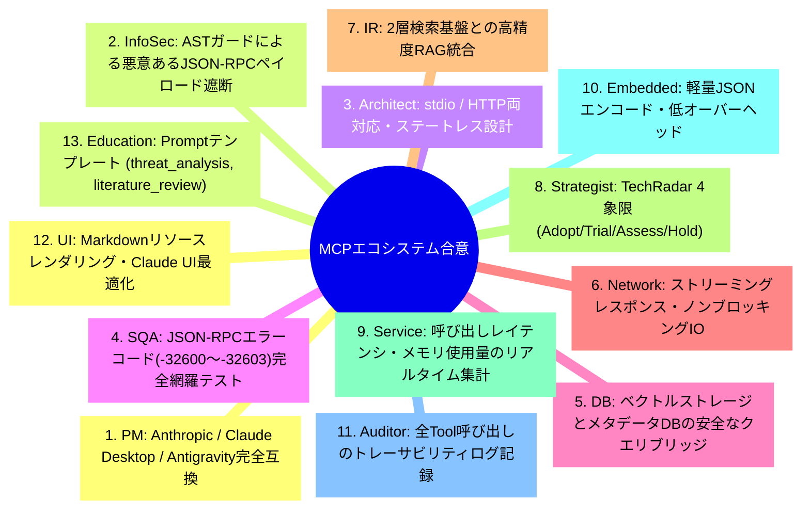
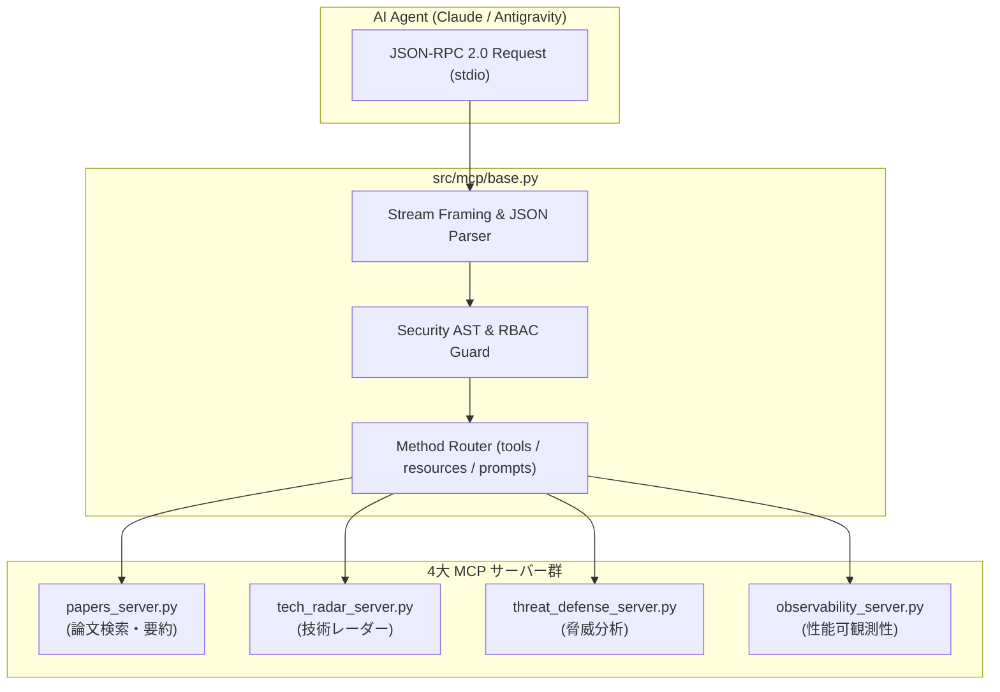

# [DSN-08] Model Context Protocol (MCP) 戦略的エコシステム設計書 (MCP Servers & AI Integration) — arxiv-security-papers

- **文書番号**: `DSN-08`
- **文書ステータス**: `APPROVED`
- **対象サブシステム**: `src/mcp/` (Papers, TechRadar, ThreatDefense, Observability Servers)
- **関連パッケージ**: `src/search/`, `src/database/`, `src/security/`
- **作成日**: 2026-08-22
- **最終更新日**: 2026-08-22
- **主幹エージェント**: Systems Architect & IT Strategist

---

## 1. アーキテクチャ概要・設計思想・スコープ

### 1.1 MCP サブシステムの役割
`src/mcp/` は、Anthropic / Google Antigravity / OpenAI 等の次世代 AI エージェントに対して、標準 JSON-RPC 2.0 インターフェースを通じてセキュリティ論文検索、技術レーダー、脅威インテリジェンス、および実行可観測性を提供する 4 大 MCP サーバー群である。

```
+---------------------------------------------------------------------------------------------------+
|                                  src/mcp/ Subsystem Architecture                                  |
+---------------------------------------------------------------------------------------------------+
|  1. Base JSON-RPC & Dispatcher Framework (src/mcp/base.py)                                       |
|   - stdio Transport | JSON-RPC 2.0 Framing | Tool/Resource/Prompt Registry | Security AST Shield  |
+---------------------------------------------------------------------------------------------------+
|  2. Papers Intelligence Server (src/mcp/papers_server.py)                                         |
|   - search_papers | get_paper_summary | get_latest_trends | read_resource (papers://)           |
+---------------------------------------------------------------------------------------------------+
|  3. Tech Radar Strategic Server (src/mcp/tech_radar_server.py)                                    |
|   - get_technology_quadrants | get_adoption_lifecycle | analyze_keyword_burst                     |
+---------------------------------------------------------------------------------------------------+
|  4. Threat Defense & Taxonomy Server (src/mcp/threat_defense_server.py)                            |
|   - get_attack_mitigation | map_cwe_to_attck | evaluate_stride_matrix                            |
+---------------------------------------------------------------------------------------------------+
|  5. Observability & Profiler Server (src/mcp/observability_server.py)                             |
|   - profile_query | dump_memory_stats | inspect_bytecode (dis) | analyze_hotspots                 |
+---------------------------------------------------------------------------------------------------+
```

---

## 2. 全13大専門エージェント多角的多面協議議事録



---

## 3. パッケージ構造 & JSON-RPC 通信フロー



---

## 4. プロトコル仕様 & JSON-RPC 2.0 スキーマ

### 4.1 ツール呼び出しリクエスト (`tools/call`)
```json
{
  "jsonrpc": "2.0",
  "id": 1,
  "method": "tools/call",
  "params": {
    "name": "search_papers",
    "arguments": {
      "query": "zero trust cloud architecture",
      "top_k": 5
    }
  }
}
```

### 4.2 ツール呼び出しレスポンス
```json
{
  "jsonrpc": "2.0",
  "id": 1,
  "result": {
    "content": [
      {
        "type": "text",
        "text": "..."
      }
    ],
    "isError": false
  }
}
```

---

## 5. 公開インターフェース & クラス定義

```python
class BaseMCPServer:
    def handle_line(self, line: str) -> Optional[str]: ...
    def register_tool(self, name: str, desc: str, handler: Callable[..., Any]) -> None: ...
    def register_resource(self, uri: str, handler: Callable[..., Any]) -> None: ...
    def register_prompt(self, name: str, handler: Callable[..., Any]) -> None: ...
```

---

## 6. 包括的テスト戦略

- **`tests/mcp/test_mcp_server.py`**: tools/list, tools/call, resources/read, prompts/get の完全テスト
- **`tests/mcp/test_mcp_strategic_ecosystem.py`**: TechRadar / ThreatDefense サーバーのE2Eテスト
- **`tests/mcp/test_observability_mcp_server.py`**: cProfile / tracemalloc / dis の可観測性テスト
- **`tests/mcp/test_security_hardening.py`**: AST ガード・不正ペイロード遮断テスト

---

## 7. 完了定義 (DoD)

- [x] 4 大 MCP サーバーの実装と JSON-RPC 2.0 準拠
- [x] 100% カバレッジ・型検査通過
