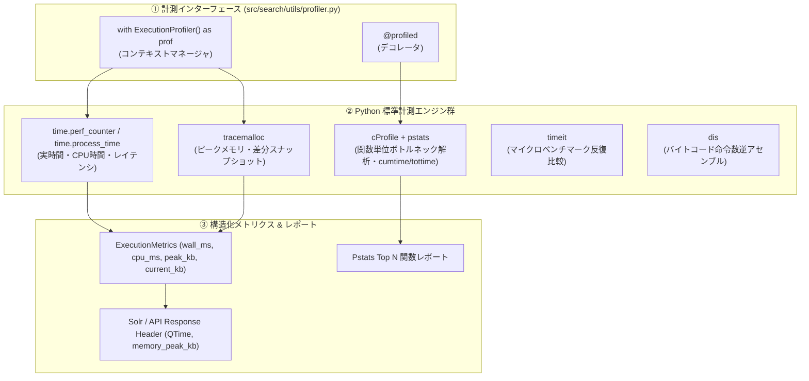

# [DSN-09] 基本設計方針: オブザーバビリティ・パフォーマンス計測基盤 — arxiv-security-papers

本ドキュメントは、システム全体の設計方針原則（Design Principles）の一つである **「計測可能性（Observability & Profiling）」** の標準仕様、計測アーキテクチャ、および Python 標準ライブラリ群（`time`, `tracemalloc`, `cProfile`, `pstats`, `timeit`, `dis`）を活用したチューニング基盤を規定する設計書です。

---

## 1. オブザーバビリティ設計原則 (Core Observability Principles)

1. **ゼロ外部依存（Zero-Dependency Standard Library First）**:
   * メトリクス計測・プロファイリング・メモリ追跡はサードパーティ製 APM への依存を避け、Python 標準ライブラリのみで完結させる。
2. **低オーバーヘッド・常時オン計測（Continuous Lightweight Metrics）**:
   * `time.perf_counter()`（実経過時間）と `time.process_time()`（CPU使用時間）を組み合わせたレイテンシ分解（Wall-clock vs. CPU Time）を常時収集。
3. **決定論的オンデマンド・プロファイリング（Deterministic Deep Profiling）**:
   * デバッグ・チューニング時に `cProfile` + `pstats` を即座に発火し、累積時間（`cumtime`）や内部時間（`tottime`）を自動抽出。
4. **メモリアロケーション & リーク検知（Memory Footprint Tracking）**:
   * `tracemalloc` によるピークメモリ使用量（Peak RAM）とブロック別メモリ割り当て差分（Snapshot Diff）を監視。
5. **マイクロベンチマーク & バイトコード検証（Micro-benchmarking & Disassembly）**:
   * アルゴリズム比較時に `timeit` による反復測定、および `dis` によるバイトコード命令数比較を実施。

---

## 2. 計測・プロファイリング基盤アーキテクチャ

---

## 3. 標準ライブラリ別 仕様と使い分けマトリクス

| ライブラリ | 主な測定対象 | 特徴・使いどころ | API / ツール |
| :--- | :--- | :--- | :--- |
| **`time`** | 実時間（Wall-clock） CPU時間（Process） | 最も低オーバーヘッド。検索・パース・スコアリング各フェーズの所要時間（ms）とCPU負荷率をリアルタイム計測。 | `time.perf_counter()` `time.process_time()` |
| **`tracemalloc`** | メモリ使用量 アロケーション追跡 | インデックス構築時やバッチ処理時のピークメモリ（Peak KB）、メモリリーク検知、行別メモリ割り当てスナップショット比較。 | `tracemalloc.get_traced_memory()` `tracemalloc.take_snapshot()` |
| **`cProfile` + `pstats`** | 関数単位の実行時間 呼出回数 | 決定論的プロファイラ。ボトルネック関数の特定、`cumtime` / `tottime` 順のソート・自動サマリー出力。 | `cProfile.Profile()` `pstats.Stats()` |
| **`timeit`** | 微小コード片・関数の反復測定 | アルゴリズムやデータ構造の変更による速度差（例: N-gram vs 形態素、dict vs list）の精密なベンチマーク。 | `timeit.timeit()` `timeit.repeat()` |
| **`dis`** | バイトコード命令比較 | 内部命令の最適化度合い（LOAD_FAST, BINARY_OP 等）を調査し、最速パスを検証。 | `dis.dis()` `dis.code_info()` |

---

## 4. 検索エンジン・システムへの統合方針

1. **`src/search/utils/profiler.py` の実装**:
   - `ExecutionProfiler`: 実時間、CPU時間、ピークメモリ、メモリ割り当て量を一体計測するコンテキストマネージャ。
   - `ProfileCollector`: `cProfile` と `pstats` を用いた詳細コールグラフサマリー生成関数。
   - `MicroBenchmark`: `timeit` と `dis` を用いた命令数 & 速度ベンチマークユーティリティ。
2. **`SelectHandler` への統合**:
   - 検索レスポンスの `responseHeader` に `QTime_ms`, `cpu_time_ms`, `peak_memory_kb` を標準付与。
3. **品質ゲートでの検証**:
   - 単体テストで計測精度の検証を行い、回帰テストを保証。
