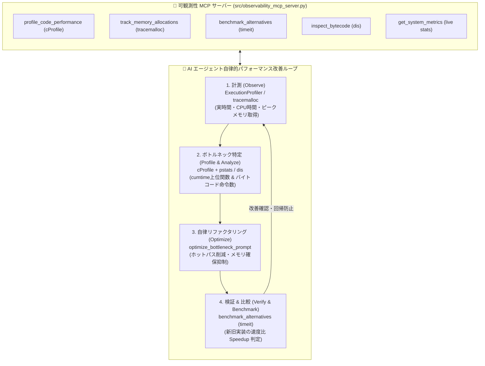

# [DSN-09] 基本設計方針・機能設計書: 可観測性（Observability）＆ AI エージェント自律改善ループ MCP 基盤 — arxiv-security-papers

本ドキュメントは、システム全体の設計方針原則である **「可観測性（Observability & Profiling）」** と、それを AI コーディングエージェント（Antigravity, Claude 等）へ提供して機能・性能を自律的に継続改善する **「可観測性特化型 MCP (Model Context Protocol) サーバー」** を統合した総合設計書です。

---

## 核心価値: 開発・ツール実行と一体化したインライン計測＆即時改善パラダイム

本設計の最大のポイントは、**「事後的な分析や本番監視にとどまらず、開発作業中・ツール実行中・AIペアプログラミング中のインタラクティブなワークフローの中で、リアルタイムに計測（Observe）し、即座に改善（Optimize）を適用してその場で検証（Verify）できる」** 点にあります。

* **日常の開発・実行フローへの溶け込み**: 単一コマンドや MCP ツール呼び出し1回で、コードの実行時間・メモリ・命令数を即座に可視化。
* **仮説検証の即時化**: 「内包表記にしたら速くなるか？」「キャッシュを入れたらメモリはどう変わるか？」を `benchmark_alternatives` や `track_memory_allocations` でその場ですぐに比較・実証。
* **AI エージェントの自律改善エンジン**: AI エージェントが自身の生成したコードのプロファイルを取得し、自律的にリファクタリングを完結。

---

## 1. 統合アーキテクチャ: 自律的パフォーマンス改善ループ (Autonomous Optimization Loop)

「開発・ツール実行（Work/Run）」「計測（Observe）」「改善（Optimize）」がシームレスに結合した閉ループを実現します。

---

## 2. 可観測性・計測コア基盤仕様 (`src/search/utils/profiler.py`)

Python 標準ライブラリのみを用い、外部 APM 依存ゼロで以下を提供します。

| 標準ライブラリ | 役割・用途 | 実装クラス / 関数 |
| :--- | :--- | :--- |
| **`time`** | 実時間（Wall-clock: `perf_counter`）と CPU時間（Process: `process_time`）の同時計測 | `ExecutionProfiler` |
| **`tracemalloc`** | ピークメモリ使用量（Peak KB）および行ごとのメモリ割り当て差分の追跡 | `ExecutionProfiler`, `handle_track_memory_allocations` |
| **`cProfile` + `pstats`** | 決定論的プロファイリング。累積時間（`cumtime`）や関数内部時間（`tottime`）の分析 | `profile_function()`, `handle_profile_code_performance` |
| **`timeit`** | 複数候補実装のマイクロ秒単位ベンチマーク比較 | `benchmark_function()`, `handle_benchmark_alternatives` |
| **`dis`** | バイトコード命令数・スタック命令列の逆アセンブル | `analyze_bytecode()`, `handle_inspect_bytecode` |

---

## 3. 可観測性 MCP サーバー仕様 (`src/observability_mcp_server.py`)

AI コーディングエージェントが JSON-RPC 2.0 プロトコル経由で利用する 5 大 Tool、Resource、および Prompt です。

### 3.1 5 大 MCP ツール仕様
1. **`profile_code_performance`**:
   - 入力 Python コードを実行し、最も時間を消費している上位関数・行番号・累積時間を特定。
2. **`track_memory_allocations`**:
   - `tracemalloc` による行ごとのメモリ確保量（Top Allocations）とピークメモリを抽出し、メモリリークを診断。
3. **`benchmark_alternatives`**:
   - 2つ以上の実装コード候補（例: リスト内包表記 vs ジェネレータ）を `timeit` で反復実行し、最速候補（`winner`）と速度倍率（`speedup_ratio`）を出力。
4. **`inspect_bytecode`**:
   - `dis` によりバイトコード命令列とオペコード出現頻度を解析し、低レベル最適化を検証。
5. **`get_system_metrics`**:
   - 検索エンジン（`SelectHandler`）や多層キャッシュ（`FilterCache`、`QueryResultCache`）の最新稼働統計を提供。

### 3.2 セキュリティ防御（AST セキュリティガード）
* `ast.parse()` により、入力コードに含まれる危険なモジュール（`subprocess`, `socket`, `pty`, `shutil`）やシステムコール（`os.system`, `eval`, `exec`）を静的検査し、安全性を担保。

### 3.3 リソース & プロンプト
* **Resource `observability://metrics/search_engine`**: リアルタイムな検索レイテンシとキャッシュ統計 JSON。
* **Prompt `optimize_bottleneck_prompt`**: プロファイル結果に基づき、AI エージェントがアルゴリズム改善・メモリ削減・ベンチマーク検証を行う標準プロンプト。

---

## 4. 検索エンジン・システム連携

1. **`SelectHandler` への常時メトリクス付与**:
   - 検索レスポンスの `responseHeader` に `QTime`（実時間 ms）、`cpu_time_ms`、`peak_memory_kb` を標準出力。
2. **AI エージェントによる自律的リファクタリング**:
   - エージェントは MCP ツールを通じて即座にボトルネックを特定し、改善前後の速度差を `benchmark_alternatives` で実証した上でコード修正を適用可能。
