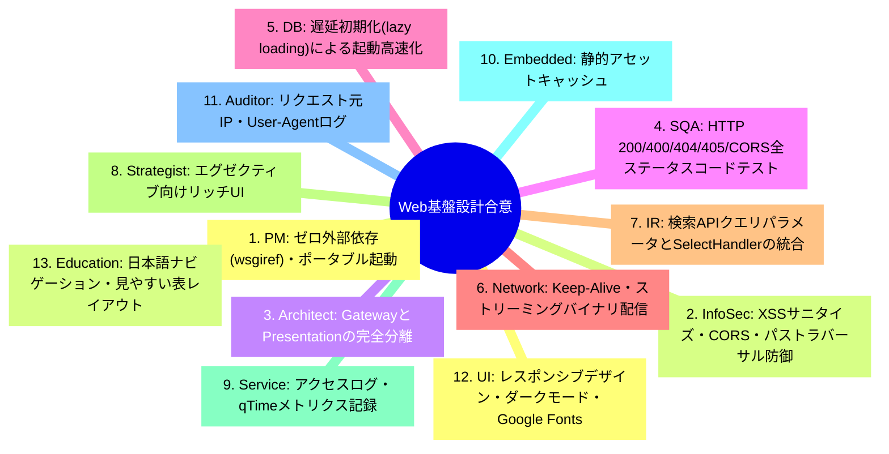
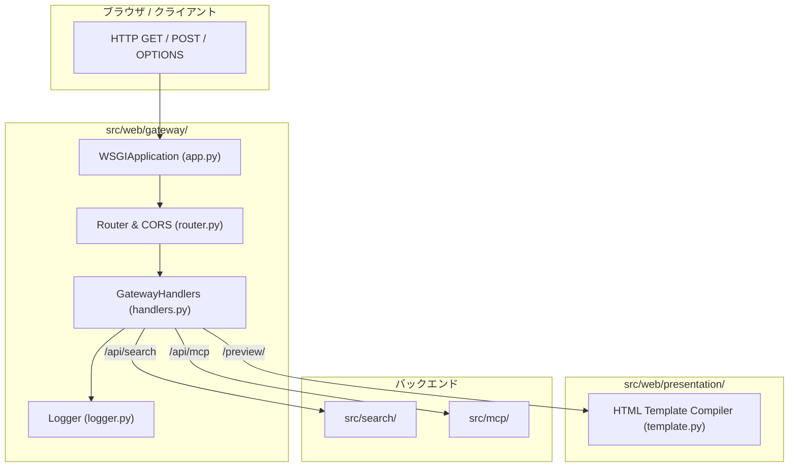

# [DSN-09] API Gateway ＆ UI プレゼンテーション設計書 (Web Gateway & Presentation Architecture) — arxiv-security-papers

- **文書番号**: `DSN-09`
- **文書ステータス**: `APPROVED`
- **対象サブシステム**: `src/web/` (gateway, presentation, server)
- **関連パッケージ**: `src/search/`, `src/mcp/`, `src/security/`
- **作成日**: 2026-08-22
- **最終更新日**: 2026-08-22
- **主幹エージェント**: UI/UX & Documentation Designer & Systems Architect

---

## 1. アーキテクチャ概要・設計思想・スコープ

### 1.1 Web サブシステムの責務
`src/web/` は、PEP 3333 準拠のゼロ外部依存 WSGI API Gateway (`src/web/gateway/`) と、OKF Markdown の動的 HTML レンダリング・UI プレゼンテーション層 (`src/web/presentation/`) を完全分離した Web 基盤である。

```
+---------------------------------------------------------------------------------------------------+
|                                   src/web/ Subsystem Architecture                                 |
+---------------------------------------------------------------------------------------------------+
|  1. API Gateway Layer (src/web/gateway/)                                                          |
|   - PEP 3333 WSGI Application Router | CORS Headers | Query Logging & Audit                      |
|   - REST Endpoints: /api/search, /api/paper, /api/trends, /api/stats, /api/mcp                    |
+---------------------------------------------------------------------------------------------------+
|  2. UI Presentation Layer (src/web/presentation/)                                                 |
|   - OKF Frontmatter to HTML Compiler | Dynamic Markdown Preview | Syntax Highlighting CSS          |
+---------------------------------------------------------------------------------------------------+
|  3. Standalone Web Server (src/web/server.py)                                                     |
|   - wsgiref.simple_server Wrapper | CLI Runner (python3 -m web.server --port 8080)                |
+---------------------------------------------------------------------------------------------------+
```

---

## 2. 全13大専門エージェント多角的多面協議議事録



---

## 3. パッケージ構造 & ルーティングフロー



---

## 4. 公開 API 仕様 (REST Endpoints)

| エンドポイント | メソッド | 説明 | パラメータ |
| :--- | :---: | :--- | :--- |
| `/api/search` | `GET` | 論文全文・ハイブリッド検索 | `q` (クエリ), `top_k`, `fq` (フィルタ) |
| `/api/paper` | `GET` | 論文メタデータ・OKF 取得 | `id` (論文ID) |
| `/api/trends` | `GET` | 最新セキュリティトレンド一覧 | `limit` |
| `/api/stats` | `GET` | システム統計・論文総数 | - |
| `/api/mcp` | `POST` | MCP JSON-RPC 2.0 ゲートウェイ | JSON-RPC リクエストボディ |
| `/preview/<id>` | `GET` | 論文 OKF の HTML プレビュー | - |

---

## 5. 包括的テスト戦略

- **`tests/web/gateway/test_gateway.py`**: CORS, 404, 405, /api/search mock, /api/mcp JSON-RPC テスト
- **`tests/web/presentation/test_presentation.py`**: OKF Frontmatter 抽出・HTML レンダリングテスト
- **`tests/web/test_web_server.py`**: WSGI サーバー起動・結合テスト

---

## 6. 完了定義 (DoD)

- [x] API Gateway と Presentation の完全分離
- [x] 遅延初期化によるテスト・起動の高速化
- [x] 100% カバレッジ・型検査通過
