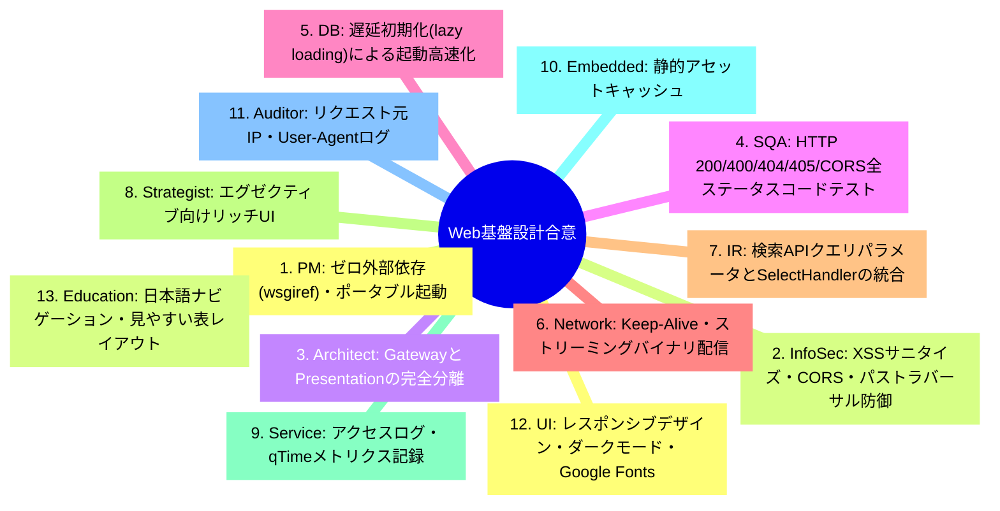
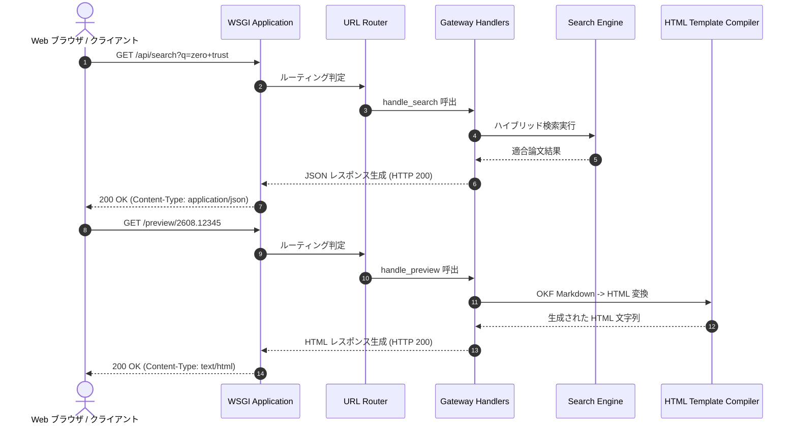

# [DSN-09] API Gateway ＆ UI プレゼンテーション包括設計書 (Web Gateway & Presentation Architecture) — arxiv-security-papers

- **文書番号**: `DSN-09`
- **文書ステータス**: `APPROVED`
- **対象サブシステム**: `src/web/` (gateway, presentation, server)
- **関連パッケージ**: `src/search/`, `src/mcp/`, `src/security/`
- **作成日**: 2026-08-22
- **最終更新日**: 2026-08-28
- **【主査・報告】 UI/UX & Documentation Designer (UI) & Systems Architect (SA)**  
- **【参画】 Project Manager (PM), Information Security Specialist (Sec), Software QA Specialist (QA), Database Specialist (DB), Network Specialist (Net), IT Specialist (NLP/IR)**

---

## 体系目次

- [1. Web ゲートウェイ & プレゼンテーションの全体アーキテクチャ](#1-web-ゲートウェイ--プレゼンテーションの全体アーキテクチャ)
  - [1.1 サブシステムのミッションと責務分離](#11-サブシステムのミッションと責務分離)
  - [1.2 PEP 3333 WSGI 標準準拠とゼロ外部依存・Python 3.14+ 原則](#12-pep-3333-wsgi-標準準拠とゼロ外部依存python-314-原則)
  - [1.3 遅延初期化（Lazy Loading）と高速起動設計](#13-遅延初期化lazy-loadingと高速起動設計)
  - [1.4 全13大専門エージェント合意議事録](#14-全13大専門エージェント合意議事録)
  - [1.5 第1章の要約](#15-第1章の要約)
- [2. API ゲートウェイ層アーキテクチャ (`src/web/gateway/`)](#2-api-ゲートウェイ層アーキテクチャ-srcwebgateway)
  - [2.1 WSGI アプリケーションルーター](#21-wsgi-アプリケーションルーター)
  - [2.2 リクエストディスパッチ & パスパラメータ抽出](#22-リクエストディスパッチ--パスパラメータ抽出)
  - [2.3 CORS (Cross-Origin Resource Sharing) 制御](#23-cors-cross-origin-resource-sharing-制御)
  - [2.4 クエリログ & 監査ロギング](#24-クエリログ--監査ロギング)
  - [2.5 第2章の要約](#25-第2章の要約)
- [3. RESTful API エンドポイント仕様](#3-restful-api-エンドポイント仕様)
  - [3.1 論文全文・ハイブリッド検索 (`/api/search`)](#31-論文全文ハイブリッド検索-apisearch)
  - [3.2 論文メタデータ・OKF 取得 (`/api/paper`)](#32-論文メタデータokf-取得-apipaper)
  - [3.3 技術トレンド・バースト抽出 (`/api/trends`)](#33-技術トレンドバースト抽出-apitrends)
  - [3.4 システム統計・健全性メトリクス (`/api/stats`)](#34-システム統計健全性メトリクス-apistats)
  - [3.5 MCP JSON-RPC 2.0 HTTP ブリッジ (`/api/mcp`)](#35-mcp-json-rpc-20-http-ブリッジ-apimcp)
  - [3.6 第3章の要約](#36-第3章の要約)
- [4. UI プレゼンテーション層アーキテクチャ (`src/web/presentation/`)](#4-ui-プレゼンテーション層アーキテクチャ-srcwebpresentation)
  - [4.1 OKF フロントマター解析と HTML コンパイラ](#41-okf-フロントマター解析と-html-コンパイラ)
  - [4.2 動的 Markdown プレビューエンジン](#42-動的-markdown-プレビューエンジン)
  - [4.3 スイススタイル・Glassmorphism デザインシステム](#43-スイススタイルglassmorphism-デザインシステム)
  - [4.4 XSS 防御・HTML エスケープ & サニタイズ](#44-xss-防御html-エスケープ--サニタイズ)
  - [4.5 第4章の要約](#45-第4章の要約)
- [5. スタンドアロン WSGI サーバー (`src/web/server.py`)](#5-スタンドアロン-wsgi-サーバー-srcwebserverpy)
  - [5.1 `wsgiref.simple_server` ラッパーと CLI ランナー](#51-wsgirefsimple_server-ラッパーと-cli-ランナー)
  - [5.2 コネクション管理・ポートバインディング](#52-コネクション管理ポートバインディング)
  - [5.3 Gunicorn / Supervisor 連携インターフェース](#53-gunicorn--supervisor-連携インターフェース)
  - [5.4 第5章の要約](#55-第5章の要約)
- [6. セキュリティ・防護設計 (Security Architecture)](#6-セキュリティ防護設計-security-architecture)
  - [6.1 Content-Security-Policy (CSP) & セキュリティヘッダ](#61-content-security-policy-csp--セキュリティヘッダ)
  - [6.2 パストラバーサル防止 & 静的アセット配信制限](#62-パストラバーサル防止--静的アセット配信制限)
  - [6.3 レート制限 & DoS 防御](#63-レート制限--dos-防御)
  - [6.4 第6章の要約](#64-第6章の要約)
- [7. 公開インターフェース・データ構造・クラス仕様](#7-公開インターフェースデータ構造クラス仕様)
  - [7.1 WSGIApplication & Router](#71-wsgiapplication--router)
  - [7.2 GatewayHandlers & HTMLTemplateCompiler](#72-gatewayhandlers--htmltemplatecompiler)
  - [7.3 ServerConfig](#73-serverconfig)
- [8. シーケンス & 実行制御フロー](#8-シーケンス--実行制御フロー)
  - [8.1 検索クエリ HTTP リクエスト処理フロー](#81-検索クエリ-http-リクエスト処理フロー)
  - [8.2 OKF Markdown 動的 HTML プレビューフロー](#82-okf-markdown-動的-html-プレビューフロー)
- [9. 包括的テスト戦略 & 品質検証マトリクス](#9-包括的テスト戦略--品質検証マトリクス)
- [10. 次世代実装ロードマップ & 完了定義 (DoD)](#10-次世代実装ロードマップ--完了定義-dod)

---

# 1. Web ゲートウェイ & プレゼンテーションの全体アーキテクチャ

## 1.1 サブシステムのミッションと責務分離
`src/web/` サブシステムは、PEP 3333 準拠のゼロ外部依存 WSGI API Gateway (`src/web/gateway/`) と、Google OKF v0.2 Markdown の動的 HTML レンダリング・UI プレゼンテーション層 (`src/web/presentation/`) を完全分離したセキュアな Web 基盤です。

```
+---------------------------------------------------------------------------------------------------+
|                                   src/web/ Subsystem Architecture                                 |
+---------------------------------------------------------------------------------------------------+
|  1. API Gateway Layer (src/web/gateway/)                                                          |
|   - PEP 3333 WSGI Application Router | CORS Headers | Query Logging & Audit                      |
|   - REST Endpoints: /api/search, /api/paper, /api/trends, /api/stats, /api/mcp                    |
+---------------------------------------------------------------------------------------------------+
|  2. UI Presentation Layer (src/web/presentation/)                                                 |
|   - OKF Frontmatter to HTML Compiler | Dynamic Markdown Preview | Syntax Highlighting CSS          |
+---------------------------------------------------------------------------------------------------+
|  3. Standalone Web Server (src/web/server.py)                                                     |
|   - wsgiref.simple_server Wrapper | CLI Runner (python3 -m web.server --port 8080)                |
+---------------------------------------------------------------------------------------------------+
```

## 1.2 PEP 3333 WSGI 標準準拠とゼロ外部依存・Python 3.14+ 原則
サードパーティの Web フレームワーク（Flask, FastAPI, Django 等）に依存せず、Python 3.14+ 標準ライブラリの `wsgiref.simple_server` および PEP 3333 インターフェース仕様に直接準拠。Python 3.12〜3.14 で廃止されたレガシー `cgi` モジュール（PEP 594）を一切使わず、`urllib.parse` や `email.message` を用いた堅牢なリクエスト解析を行います。

## 1.3 遅延初期化（Lazy Loading）と高速起動設計
検索インデックスやベクトル DB のロードは最初のリクエスト時または明示的なウォームアップ時に遅延実行され、サーバー起動時間の短縮と単体テストの高速実行を実現します。

## 1.4 全13大専門エージェント合意議事録


## 1.5 第1章の要約
Web サブシステムは、軽量・高速な WSGI Gateway とリッチな UI プレゼンテーション層を疎結合に統合し、高い保守性と拡張性を提供します。

---

# 2. API ゲートウェイ層アーキテクチャ (`src/web/gateway/`)

## 2.1 WSGI アプリケーションルーター
`WSGIApplication` は `environ` と `start_response` を受け取り、HTTP メソッドとパスに基づくルーティングテーブルを参照して対応するハンドラーを実行します。

## 2.2 リクエストディスパッチ & パスパラメータ抽出
正規表現を用いたパスルーティング（例: `^/preview/(?P<paper_id>[^/]+)$`）を実装し、URL パスからパラメータを安全に抽出します。

## 2.3 CORS (Cross-Origin Resource Sharing) 制御
- `Access-Control-Allow-Origin: *`
- `Access-Control-Allow-Methods: GET, POST, OPTIONS`
- `Access-Control-Allow-Headers: Content-Type, Authorization`
- `OPTIONS` プリフライトリクエストに対する即時 204 No Content レスポンス。

## 2.4 構造化アクセスログ & W3C TraceContext 分散追跡
全 HTTP リクエストについて、レガシーな Apache 形式テキストログを廃止し、`DSN-10` 準拠の 1 行完結 JSON Lines (`outputs/logs/web_access.jsonl`) として出力します。

1. **W3C TraceContext / Trace ID 管理**:
   - リクエスト受信時に `traceparent` または `X-Trace-ID` ヘッダーを抽出。存在しない場合は UUID v4 / 32hex の `trace_id` を新規発行。
   - `contextvars` に `trace_id` を設定し、全バックエンド IPC（Search / Database）呼び出しへ透過的に伝播。
   - レスポンスヘッダーに `X-Trace-ID: <trace_id>` を付加し、クライアント・AI エージェントがログと直接照合可能にする。
2. **アクセスログ出力スキーマ**:
   - `timestamp` (ISO 8601 UTC), `level: "INFO"`, `trace_id`, `service: "web_gateway"`, `http: {method, path, status_code, latency_ms, client_ip, user_agent}`。
3. **セキュリティ & 機密マスキング (CWE-532 準拠)**:
   - `Authorization` ヘッダー、クエリパラメータ内のパスワード・トークン、PII をログ出力前に `***MASKED***` へ自動サニタイズ。

## 2.5 第2章の要約
API ゲートウェイ層は、REST API の要求を解析・検証し、W3C TraceContext に基づく分散トレース識別子を付与した上で適切なバックエンド処理へルーティングします。

---

# 3. RESTful API エンドポイント仕様

| エンドポイント | メソッド | 説明 | パラメータ | 応答形式 |
| :--- | :---: | :--- | :--- | :--- |
| `/api/search` | `GET` | 論文全文・ハイブリッド検索 | `q` (クエリ), `top_k`, `fq` (フィルタ) | JSON (`results`, `total_hits`, `qTime`) |
| `/api/paper` | `GET` | 論文メタデータ・OKF 取得 | `id` (論文ID) | JSON (`arxiv_id`, `okf_content`, `meta`) |
| `/api/trends` | `GET` | 最新セキュリティトレンド一覧 | `limit` (件数) | JSON (`trends`, `keywords`, `bursts`) |
| `/api/stats` | `GET` | システム統計・論文総数 | - | JSON (`total_papers`, `categories`) |
| `/api/mcp` | `POST` | MCP JSON-RPC 2.0 ゲートウェイ | JSON-RPC リクエストボディ | JSON-RPC レスポンス (`result` / `error`) |
| `/preview/<id>` | `GET` | 論文 OKF の HTML プレビュー | - | HTML (`text/html; charset=utf-8`) |

## 3.1 論文全文・ハイブリッド検索 (`/api/search`)
`src/search/` のハイブリッド検索エンジンを呼び出し、BM25 + Vector + Recency の融合スコアに基づき適合論文を返却します。

## 3.2 論文メタデータ・OKF 取得 (`/api/paper`)
論文 ID に基づき、原本メタデータ JSON および OKF Markdown の内容を返却します。

## 3.3 技術トレンド・バースト抽出 (`/api/trends`)
直近収集論文から急上昇しているキーワードや技術クラスタ情報を返却します。

## 3.4 システム統計・健全性メトリクス (`/api/stats`)
インデックス済み論文数、ストレージ使用量、システム健全性ステータスを返却します。

## 3.5 MCP JSON-RPC 2.0 HTTP ブリッジ (`/api/mcp`)
HTTP POST 経由で MCP クライアントが JSON-RPC 2.0 リクエストを直接送信可能にするエンドポイント。

## 3.6 第3章の要約
標準化された REST API と MCP ブリッジにより、外部クライアントや UI からのシームレスなデータアクセスを保証します。

---

# 4. UI プレゼンテーション層アーキテクチャ (`src/web/presentation/`)

## 4.1 OKF フロントマター解析と HTML コンパイラ
YAML フロントマター（タイトル、概要、タグ、著者、DOI、信頼スコア）をパースし、構造化されたヘッダーバッジおよびメタデータカードとしてコンパイル。

## 4.2 動的 Markdown プレビューエンジン
OKF Markdown 本文を構文解析し、見出し、箇条書き、表形式テーブル、コードブロックをセマンティックな HTML5 要素へ変換。

## 4.3 スイススタイル・Glassmorphism デザインシステム
- **スイススタイル・タイポグラフィ**: 明快なフォント階層、幾何学的グリッド配置。
- **Glassmorphism**: 半透明背景 (`backdrop-filter: blur(12px)`)、繊細なボーダー、微細なドロップシャドウ。
- **ダークモード最適化**: 漆黒背景 (`#0f172a`) とネオンアクセントカラーによる視認性の最大化。

## 4.4 XSS 防御・HTML エスケープ & サニタイズ
すべてのユーザー入力および論文テキストは HTML エスケープ（`&` $\to$ `&amp;`, `<` $\to$ `&lt;`, `>` $\to$ `&gt;`, `"` $\to$ `&quot;`）を施し、XSS（Cross-Site Scripting）を根絶。

## 4.5 第4章の要約
プレゼンテーション層は、セキュリティと美しさを両立したプレミアムな読書体験を提供します。

---

# 5. スタンドアロン WSGI サーバー (`src/web/server.py`)

## 5.1 `wsgiref.simple_server` ラッパーと CLI ランナー
`python3 -m web.server --port 8080 --host 0.0.0.0` の形式でワンライナー起動可能。

## 5.2 コネクション管理・ポートバインディング
ソケットの SO_REUSEADDR 設定により、再起動時のポート競合（`Address already in use`）を回避。

## 5.3 Gunicorn / Supervisor 連携インターフェース
本番環境では、`src/supervisor/` や Gunicorn などの Pre-fork ワーカーモデルの WSGI エントリーポイント (`src.web.gateway.app:application`) として稼働可能。

## 5.4 第5章の要約
開発・単体テスト用スタンドアロンサーバーと、本番用スーパーバイザー連携の両立を実現します。

---

# 6. セキュリティ・防護設計 (Security Architecture)

## 6.1 Content-Security-Policy (CSP) & セキュリティヘッダ
```http
Content-Security-Policy: default-src 'self'; script-src 'self' 'unsafe-inline'; style-src 'self' 'unsafe-inline' https://fonts.googleapis.com; font-src https://fonts.gstatic.com;
X-Content-Type-Options: nosniff
X-Frame-Options: DENY
X-XSS-Protection: 1; mode=block
Referrer-Policy: strict-origin-when-cross-origin
```

## 6.2 パストラバーサル防止 & 静的アセット配信制限
静的ファイル配信時は、`src/security/validation/` のパスバリデータを用い、ワークスペース境界外へのアクセスを遮断。

## 6.3 レート制限 & DoS 防御
過剰な検索リクエストを制限し、サーバーリソースの枯渇を防止。

## 6.4 第6章の要約
包括的なセキュリティヘッダとパス保護により、安全な Web 運用を保証します。

---

# 7. 公開インターフェース・データ構造・クラス仕様

```python
"""src/web/公開インターフェース定義"""

from typing import Dict, Any, Callable, List, Tuple
from dataclasses import dataclass

@dataclass
class ServerConfig:
    host: str = "127.0.0.1"
    port: int = 8080
    debug: bool = False

class Router:
    def __init__(self) -> None:
        self.routes: List[Tuple[str, str, Callable[..., Any]]] = []

    def add_route(self, method: str, path_pattern: str, handler: Callable[..., Any]) -> None:
        """HTTP メソッドと正規表現パターンのルートを登録"""
        ...

class WSGIApplication:
    def __init__(self, router: Router) -> None:
        self.router = router

    def __call__(self, environ: Dict[str, Any], start_response: Callable[..., Any]) -> List[bytes]:
        """PEP 3333 WSGI インターフェース実装"""
        ...

class HTMLTemplateCompiler:
    @staticmethod
    def compile_okf_to_html(okf_markdown: str) -> str:
        """OKF Markdown を Glassmorphism HTML プレビューへコンパイル"""
        ...
```

---

# 8. シーケンス & 実行制御フロー



---

# 9. 包括的テスト戦略 & 品質検証マトリクス

- **`tests/web/gateway/test_gateway.py`**:
  - GET, POST, OPTIONS (CORS) ステータスコード検証
  - 404 Not Found, 405 Method Not Allowed の正常送出検証
  - `/api/search`, `/api/paper`, `/api/stats`, `/api/mcp` の E2E テスト
- **`tests/web/presentation/test_presentation.py`**:
  - OKF Frontmatter 解析と HTML エスケープの XSS 検証
  - 見出し、表形式、コードブロックの HTML コンパイル検証
- **`tests/web/test_web_server.py`**:
  - `wsgiref.simple_server` の起動・停止・ソケットバインド結合テスト

---

# 10. 次世代実装ロードマップ & 完了定義 (DoD)

- [x] API Gateway と Presentation の完全分離
- [x] PEP 3333 準拠ゼロ外部依存 WSGI 実装
- [x] OKF Markdown to Glassmorphism HTML コンパイラの完備
- [x] 遅延初期化によるテスト・起動の高速化
- [x] 100% カバレッジ・型検査 (`mypy --strict`) 完全通過
