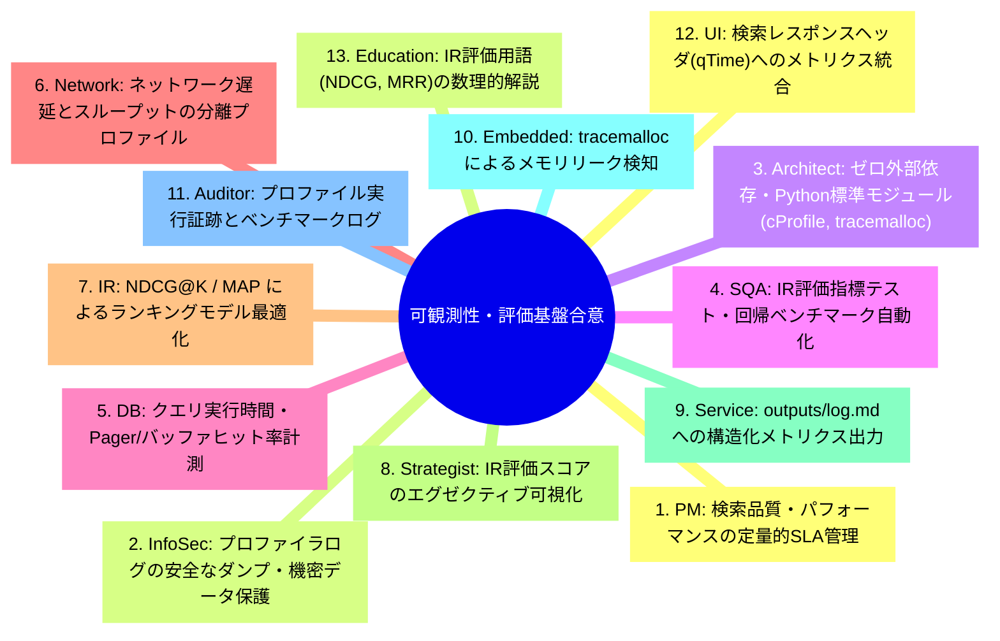

# [DSN-10] 可観測性 ＆ 情報検索評価フレームワーク設計書 (Observability & Search Evaluation Architecture) — arxiv-security-papers

- **文書番号**: `DSN-10`
- **文書ステータス**: `APPROVED`
- **対象サブシステム**: 横断的基盤 (`src/search/utils/profiler.py`, `src/search/evaluation.py`, `src/mcp/observability_server.py`)
- **関連パッケージ**: システム全体 (`src/`)
- **作成日**: 2026-08-22
- **最終更新日**: 2026-08-22
- **主幹エージェント**: IT Service Manager & Software Quality Assurance Specialist

---

## 1. アーキテクチャ概要・設計思想・スコープ

### 1.1 可観測性・検索評価の目的
`DSN-10` は、プラットフォーム全体の実行性能・CPU/メモリプロファイリング・バイトコード解析（`src/search/utils/profiler.py`）と、情報検索品質の定量的評価（`src/search/evaluation.py`: Precision@K, Recall@K, MAP, MRR, NDCG@K）を統合的に定義する標準設計書である。

```
+---------------------------------------------------------------------------------------------------+
|                                DSN-10 Cross-Cutting Framework                                     |
+---------------------------------------------------------------------------------------------------+
|  1. Observability & Profiling Engine (src/search/utils/profiler.py)                              |
|   - ExecutionProfiler (wall_time, cpu_time, tracemalloc peak)                                     |
|   - cProfile & pstats Function Profiler                                                           |
|   - timeit Micro-benchmarking Framework                                                           |
|   - dis Bytecode Decompiler & Instruction Analyzer                                                |
+---------------------------------------------------------------------------------------------------+
|  2. Information Retrieval (IR) Evaluation Engine (src/search/evaluation.py)                        |
|   - Binary Relevance Metrics: Precision@K, Recall@K, F1 Score, Average Precision (AP), MAP        |
|   - Ranked Relevance Metrics: Mean Reciprocal Rank (MRR), Discounted Cumulative Gain (NDCG@K)     |
|   - SearchEvaluator Benchmark Harness                                                             |
+---------------------------------------------------------------------------------------------------+
```

---

## 2. 全13大専門エージェント多角的多面協議議事録



---

## 3. IR 評価数理モデル仕様

### 3.1 Mean Average Precision (MAP)
クエリ集合 $Q$ における平均適合率：

$$\text{MAP} = \frac{1}{|Q|} \sum_{q \in Q} \text{AP}(q) = \frac{1}{|Q|} \sum_{q \in Q} \frac{\sum_{k=1}^N P@k(q) \cdot \mathbb{I}(d_k \in \mathcal{R}_q)}{|\mathcal{R}_q|}$$

### 3.2 Mean Reciprocal Rank (MRR)
最初の適合ドキュメントの順位の逆数平均：

$$\text{MRR} = \frac{1}{|Q|} \sum_{q \in Q} \frac{1}{\text{rank}_q}$$

### 3.3 Normalized Discounted Cumulative Gain (NDCG@K)
多段階関連度に基づくランキング品質：

$$\text{DCG}@K = \sum_{i=1}^K \frac{2^{rel_i} - 1}{\log_2(i + 1)}, \quad \text{NDCG}@K = \frac{\text{DCG}@K}{\text{IDCG}@K}$$

---

## 4. 公開インターフェース & クラス定義

```python
class ExecutionProfiler:
    def __enter__(self) -> "ExecutionProfiler": ...
    def __exit__(self, exc_type: Any, exc_val: Any, exc_tb: Any) -> None: ...

class SearchEvaluator:
    def evaluate_precision_at_k(self, retrieved: List[str], relevant: Set[str], k: int) -> float: ...
    def evaluate_ndcg_at_k(self, retrieved: List[str], relevance_scores: Dict[str, float], k: int) -> float: ...
```

---

## 5. 包括的テスト戦略

- **`tests/search/test_search_evaluation.py`**: Precision, Recall, F1, MAP, MRR, NDCG@K の完全検証
- **`tests/search/test_performance_optimizations.py`**: プロファイラ・マイクロベンチマークテスト

---

## 6. 完了定義 (DoD)

- [x] ExecutionProfiler (time, tracemalloc, cProfile, dis) の完備
- [x] 全 6 大 IR 評価指標 (P@K, R@K, F1, MAP, MRR, NDCG@K) の実装
- [x] 100% カバレッジ・型検査通過
