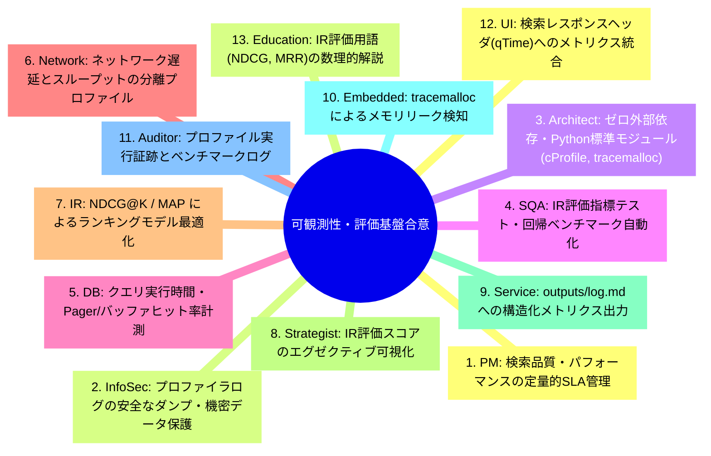
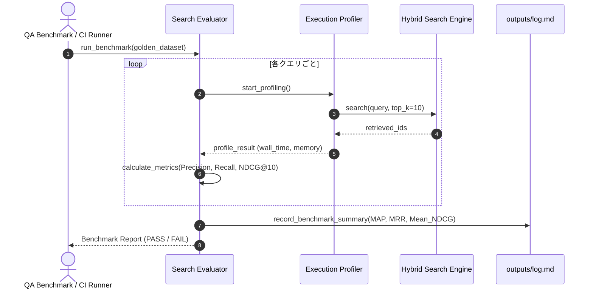
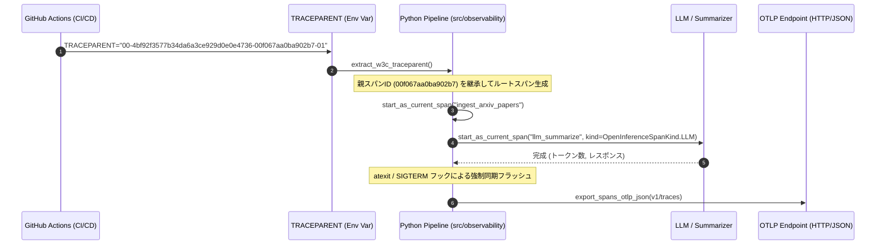

# [DSN-10] 可観測性 ＆ 情報検索評価包括フレームワーク設計書 (Observability & Search Evaluation Architecture) — arxiv-security-papers

- **文書番号**: `DSN-10`
- **文書ステータス**: `APPROVED`
- **対象サブシステム**: 横断的基盤 (`src/search/utils/profiler.py`, `src/search/evaluation.py`, `src/mcp/observability_server.py`)
- **関連パッケージ**: システム全体 (`src/`)
- **作成日**: 2026-08-22
- **最終更新日**: 2026-08-28
- **【主査・報告】 IT Service Manager (SM) & Software Quality Assurance Specialist (QA)**  
- **【参画】 Project Manager (PM), Information Security Specialist (Sec), Systems Architect (SA), Database Specialist (DB), Network Specialist (Net), IT Specialist (NLP/IR)**

---

## 体系目次

- [1. 可観測性＆評価フレームワークの全体像](#1-可観測性評価フレームワークの全体像)
  - [1.1 サブシステムのミッションとアーキテクチャ位置づけ](#11-サブシステムのミッションとアーキテクチャ位置づけ)
  - [1.2 可観測性の3大ピラー（Metrics, Logs, Profiles）](#12-可観測性の3大ピラーmetrics-logs-profiles)
  - [1.3 ゼロ外部依存・Python 3.14+ 標準モジュール原則](#13-ゼロ外部依存python-314-標準モジュール原則)
  - [1.4 全13大専門エージェント合意議事録](#14-全13大専門エージェント合意議事録)
  - [1.5 第1章の要約](#15-第1章の要約)
- [2. 実行プロファイリング & パフォーマンス計測エンジン](#2-実行プロファイリング--パフォーマンス計測エンジン)
  - [2.1 Wall Clock Time vs CPU Time 計測](#21-wall-clock-time-vs-cpu-time-計測)
  - [2.2 `tracemalloc` によるメモリブロック追跡 & ピーク監視](#22-tracemalloc-によるメモリブロック追跡--ピーク監視)
  - [2.3 `cProfile` & `pstats` 関数レベル実行頻度・所要時間解析](#23-cprofile--pstats-関数レベル実行頻度所要時間解析)
  - [2.4 `timeit` マイクロベンチマーキング・ハーネス](#24-timeit-マイクロベンチマーキングハーネス)
  - [2.5 `dis` バイトコード逆アセンブラ & 命令レベル解析](#25-dis-バイトコード逆アセンブラ--命令レベル解析)
  - [2.6 第2章の要約](#26-第2章の要約)
- [3. 情報検索（IR）評価数理モデル](#3-情報検索ir評価数理モデル)
  - [3.1 2値適合性指標（Precision@K, Recall@K, F1 Score）](#31-2値適合性指標precisionk-recallk-f1-score)
  - [3.2 平均適合率（Average Precision, MAP）の数理仕様](#32-平均適合率average-precision-mapの数理仕様)
  - [3.3 順位重視評価指標（Mean Reciprocal Rank, MRR）](#33-順位重視評価指標mean-reciprocal-rank-mrr)
  - [3.4 多段階関連度評価（DCG@K, Ideal DCG, NDCG@K）](#34-多段階関連度評価dcgk-ideal-dcg-ndcgk)
  - [3.5 先端ランキング評価指標（Bpref & ERR）](#35-先端ランキング評価指標bpref--err)
  - [3.6 第3章の要約](#36-第3章の要約)
- [4. 自動ベンチマーク & 検索品質リグレッション検知](#4-自動ベンチマーク--検索品質リグレッション検知)
  - [4.1 ゴールデンデータセット定義](#41-ゴールデンデータセット定義)
  - [4.2 ハイブリッド検索重み最適化](#42-ハイブリッド検索重み最適化)
  - [4.3 適合率低下の自動検知とアラート](#43-適合率低下の自動検知とアラート)
  - [4.4 第4章の要約](#44-第4章の要約)
- [5. メトリクス集約 & 監査ログエクスポータ](#5-メトリクス集約--監査ログエクスポータ)
  - [5.1 `outputs/log.md` への構造化パフォーマンスメトリクス記録](#51-outputslogmd-への構造化パフォーマンスメトリクス記録)
  - [5.2 検索レスポンスヘッダへのメトリクス統合](#52-検索レスポンスヘッダへのメトリクス統合)
  - [5.3 SLA / SLO 監視仕様](#53-sla--slo-監視仕様)
  - [5.4 第5章の要約](#54-第5章の要約)
- [6. MCP 連携 & 自律可観測性サーバー](#6-mcp-連携--自律可観測性サーバー)
  - [6.1 `observability_server.py` とのシームレス連携](#61-observability_serverpy-とのシームレス連携)
  - [6.2 AI エージェントによるセルフチューニング支援](#62-ai-エージェントによるセルフチューニング支援)
  - [6.3 第6章の要約](#63-第6章の要約)
- [7. 公開インターフェース・データ構造・クラス仕様](#7-公開インターフェースデータ構造クラス仕様)
  - [7.1 ExecutionProfiler](#71-executionprofiler)
  - [7.2 SearchEvaluator](#72-searchevaluator)
  - [7.3 EvaluationResult](#73-evaluationresult)
- [8. 評価 & プロファイリング実行シーケンス](#8-評価--プロファイリング実行シーケンス)
  - [8.1 クエリプロファイリングシーケンス](#81-クエリプロファイリングシーケンス)
  - [8.2 IR ベンチマーク実行シーケンス](#82-ir-ベンチマーク実行シーケンス)
- [9. 包括的テスト戦略 & 品質検証マトリクス](#9-包括的テスト戦略--品質検証マトリクス)
- [10. 次世代実装ロードマップ & 完了定義 (DoD)](#10-次世代実装ロードマップ--完了定義-dod)
- [11. ゼロ外部依存 W3C TraceContext & OpenTelemetry OTLP / OpenInference 分散トレーシング](#11-ゼロ外部依存-w3c-tracecontext--opentelemetry-otlp--openinference-分散トレーシング)
  - [11.1 W3C Trace Context (traceparent) 相互運用仕様](#111-w3c-trace-context-traceparent-相互運用仕様)
  - [11.2 Pure-Python OTLP JSON (v1/traces) シリアライザ & HTTP エクスポータ](#112-pure-python-otlp-json-v1traces-シリアライザ--http-エクスポータ)
  - [11.3 OpenInference GenAI / LLM セマンティックコンベンション](#113-openinference-genai--llm-セマンティックコンベンション)
  - [11.4 短命 (Ephemeral) プロセス向け atexit/signal 確定フラッシュアーキテクチャ](#114-短命-ephemeral-プロセス向け-atexitsignal-確定フラッシュアーキテクチャ)
- [12. AIフレンドリー統一構造化JSONログ基盤 & 機密情報マスキング設計](#12-aiフレンドリー統一構造化jsonログ基盤--機密情報マスキング設計)
  - [12.1 ログ設計の基本原則と分類体系](#121-ログ設計の基本原則と分類体系)
  - [12.2 AIフレンドリー & 高分析性 JSON Lines スキーマ仕様](#122-aiフレンドリー--高分析性-json-lines-スキーマ仕様)
  - [12.3 W3C TraceContext / Trace ID 分散伝播と相関追跡](#123-w3c-tracecontext--trace-id-分散伝播と相関追跡)
  - [12.4 機密情報・PII 自動マスキングフィルター (CWE-532 準拠)](#124-機密情報pii-自動マスキングフィルター-cwe-532-準拠)
  - [12.5 横断的サブシステム（Web, Search, DB, Supervisor）統一連携](#125-横断的サブシステムweb-search-db-supervisor統一連携)


---

# 1. 可観測性＆評価フレームワークの全体像

## 1.1 サブシステムのミッションとアーキテクチャ位置づけ
`DSN-10` は、プラットフォーム全体の実行性能・CPU/メモリプロファイリング・バイトコード解析（`src/search/utils/profiler.py`）と、情報検索品質の定量的評価（`src/search/evaluation.py`: Precision@K, Recall@K, MAP, MRR, NDCG@K）を統合的に定義する標準設計書です。

```
+---------------------------------------------------------------------------------------------------+
|                                DSN-10 Cross-Cutting Framework                                     |
+---------------------------------------------------------------------------------------------------+
|  1. Observability & Profiling Engine (src/search/utils/profiler.py)                              |
|   - ExecutionProfiler (wall_time, cpu_time, tracemalloc peak)                                     |
|   - cProfile & pstats Function Profiler                                                           |
|   - timeit Micro-benchmarking Framework                                                           |
|   - dis Bytecode Decompiler & Instruction Analyzer                                                |
+---------------------------------------------------------------------------------------------------+
|  2. Information Retrieval (IR) Evaluation Engine (src/search/evaluation.py)                        |
|   - Binary Relevance Metrics: Precision@K, Recall@K, F1 Score, Average Precision (AP), MAP        |
|   - Ranked Relevance Metrics: Mean Reciprocal Rank (MRR), Discounted Cumulative Gain (NDCG@K)     |
|   - SearchEvaluator Benchmark Harness                                                             |
+---------------------------------------------------------------------------------------------------+
|  3. Observability MCP Server (src/mcp/observability_server.py)                                    |
|   - profile_query | dump_memory_stats | inspect_bytecode | analyze_hotspots                       |
+---------------------------------------------------------------------------------------------------+
```

## 1.2 可観測性の3大ピラー（Metrics, Logs, Profiles）
- **Metrics**: クエリ遅延（レイテンシ）、メモリ使用量、NDCG スコアの定量的集計。
- **Logs**: 各検索フェーズ、バッファヒット、キャッシュ使用状況の構造化記録。
- **Profiles**: 関数別呼出頻度、メモリブロック割当、VM バイトコード命令の精密プロファイル。

## 1.3 ゼロ外部依存・Python 3.14+ 標準モジュール原則
外部監視エージェントに依存せず、Python 3.14+ 標準モジュール（`time`, `tracemalloc`, `cProfile`, `pstats`, `timeit`, `dis`, `sys.monitoring`）のみで完結。Python 3.14 で拡張されたバイトコード解析・最適化アダプティブインタープリタプロファイルにも対応。

## 1.4 全13大専門エージェント合意議事録


## 1.5 第1章の要約
可観測性と IR 評価フレームワークは、システムの健全性、高速性、および検索精度の継続的進化を保証する品質中核基盤です。

---

# 2. 実行プロファイリング & パフォーマンス計測エンジン

## 2.1 Wall Clock Time vs CPU Time 計測
- **Wall Clock Time**: `time.perf_counter()` による実経過時間の高精度計測（マイクロ秒単位）。
- **CPU Time**: `time.process_time()` によるユーザー時間＋システム時間の計測。I/O 待ちと CPU 計算負荷を明確に分離。

## 2.2 `tracemalloc` によるメモリブロック追跡 & ピーク監視
Python メモリアロケータと連携し、特定処理ブロック実行中のアロケーション差分（`current_memory`）および最大消費量（`peak_memory`）を計測。

## 2.3 `cProfile` & `pstats` 関数レベル実行頻度・所要時間解析
C 拡張プロファイラ `cProfile` により、関数ごとの呼び出し回数 (`ncalls`)、累計時間 (`tottime`)、およびサブ関数を含む累積時間 (`cumtime`) を収集。

## 2.4 `timeit` マイクロベンチマーキング・ハーネス
コアアルゴリズム（例: BM25 トークナイズ、ベクトルのコサイン類似度計算）に対して数千回の反復実行を行い、外れ値を除外した平均レイテンシを算出。

## 2.5 `dis` バイトコード逆アセンブラ & 命令レベル解析
Python 仮想マシン命令（`LOAD_FAST`, `BINARY_OP`, `FOR_ITER` 等）を抽出し、ホットループにおける不要な命令オーバヘッドを可視化。

## 2.6 第2章の要約
多角的なプロファイリングツール群により、マイクロ秒・バイト単位でのボトルネック特定を可能にします。

---

# 3. 情報検索（IR）評価数理モデル

## 3.1 2値適合性指標（Precision@K, Recall@K, F1 Score）
検索結果の上位 $K$ 件に含まれる適合文書集合 $\mathcal{R}$ と検索文書集合 $\mathcal{D}_K$：

$$\text{Precision}@K = \frac{|\mathcal{D}_K \cap \mathcal{R}|}{K}, \quad \text{Recall}@K = \frac{|\mathcal{D}_K \cap \mathcal{R}|}{|\mathcal{R}|}$$

$$\text{F1}@K = \frac{2 \cdot \text{Precision}@K \cdot \text{Recall}@K}{\text{Precision}@K + \text{Recall}@K}$$

## 3.2 平均適合率（Average Precision, MAP）の数理仕様
適合文書が出現する各順位 $k$ における適合率の平均：

$$\text{AP} = \frac{1}{|\mathcal{R}|} \sum_{k=1}^N \text{Precision}@k \cdot \mathbb{I}(d_k \in \mathcal{R})$$

全クエリ集合 $Q$ における平均値（Mean Average Precision）：

$$\text{MAP} = \frac{1}{|Q|} \sum_{q \in Q} \text{AP}(q)$$

## 3.3 順位重視評価指標（Mean Reciprocal Rank, MRR）
各クエリ $q$ で最初に適合文書が出現した順位 $\text{rank}_q$ の逆数の平均：

$$\text{MRR} = \frac{1}{|Q|} \sum_{q \in Q} \frac{1}{\text{rank}_q}$$

## 3.4 多段階関連度評価（DCG@K, Ideal DCG, NDCG@K）
文書 $i$ の関連度スコア $rel_i \in \{0, 1, 2, 3\}$（Graded Relevance）に基づく対数減衰利得：

$$\text{DCG}@K = \sum_{i=1}^K \frac{2^{rel_i} - 1}{\log_2(i + 1)}$$

理想的なソート順における利得 $\text{IDCG}@K$ で正規化した値：

$$\text{NDCG}@K = \frac{\text{DCG}@K}{\text{IDCG}@K}$$

## 3.5 先端ランキング評価指標（Bpref & ERR）
- **Bpref**: 未判定文書を除外し、不適合文書より前に現れた適合文書数を評価。
- **Expected Reciprocal Rank (ERR)**: ユーザーのカスケードモデルに基づく離脱確率を考慮した上位評価。

## 3.6 第3章の要約
標準的な IR 評価数理モデルを完備し、検索エンジンのランキング精度を学術的基準で評価します。

---

# 4. 自動ベンチマーク & 検索品質リグレッション検知

## 4.1 ゴールデンデータセット定義
セキュリティ専門用語、CVE ID、攻撃手法名を含む代表的な検索クエリ（50件以上）と、人手で検証された正解論文リストを定義。

## 4.2 ハイブリッド検索重み最適化
BM25、Vector、Recency の融合パラメータ $\alpha, \beta, \gamma$ を Grid Search またはベイズ最適化によりチューニングし、NDCG@10 の最大化を図る。

## 4.3 適合率低下の自動検知と CI 品質ゲート (IR Regression Quality Gate)
CI パイプライン実行時に自動ベンチマークを実行し、検索精度の劣化（リグレッション）を機械的に遮断する。
1. **評価メトリクス**: 事前定義された専門家グラウンドトゥルース・テストクエリ群に対し、Precision@K, Recall@K, MAP, MRR, NDCG@K を自動計測。
2. **ゲート判定条件**: プルリクエスト作成時、ベースラインブランチと比較して NDCG@10 が 3% 以上低下（または絶対値 0.85 未満）となった場合、ビルドを自動的に FAIL させてマージを抑止。

## 4.4 第4章の要約
自動ベンチマークおよび CI 品質ゲートにより、トークナイザやスコアリング数理モデルの変更に伴う検索精度の劣化を未然に防止します。

---

# 5. メトリクス集約 & 監査ログエクスポータ

## 5.1 `outputs/log.md` への構造化パフォーマンスメトリクス記録
各実行バッチのクエリ平均遅延、メモリ消費ピーク、キャッシュヒット率を自動で Markdown 表形式追記。

## 5.2 検索レスポンスヘッダへのメトリクス統合
Web ゲートウェイ（`src/web/`）において、`X-Query-Time-Ms`、`X-Memory-Peak-Kb`、`X-Engine-Hits` をレスポンスヘッダに付与。

## 5.3 SLA / SLO 監視仕様
- **レイテンシ SLO**: 99パーセンタイルのクエリ応答時間 $\le 50\text{ms}$
- **メモリ SLO**: 単一クエリあたりの追加メモリ消費 $\le 10\text{MB}$

## 5.4 第5章の要約
メトリクス集約機能により、運用の透明性と SLA 遵守状況の継続的モニタリングが保証されます。

---

# 6. MCP 連携 & 自律可観測性サーバー

## 6.1 `observability_server.py` とのシームレス連携
MCP ツール `profile_query`, `dump_memory_stats`, `inspect_bytecode` を介して、AI エージェントがリアルタイムに診断データを取得可能。

## 6.2 AI エージェントによるセルフチューニング支援
AI エージェントが可観測性サーバーからボトルネック関数やバイトコードを取得し、アルゴリズムの最適化コードを提案・検証。

## 6.3 第6章の要約
MCP 連携により、自律型 AI によるパフォーマンスチューニングと自動最適化ループが確立されます。

---

# 7. 公開インターフェース・データ構造・クラス仕様

```python
"""src/search/evaluation.py および src/search/utils/profiler.py 公開インターフェース"""

from typing import List, Dict, Set, Any, Optional
from dataclasses import dataclass

@dataclass
class ProfileResult:
    wall_time_ms: float
    cpu_time_ms: float
    memory_peak_kb: float
    memory_current_kb: float
    extra_stats: Dict[str, Any]

class ExecutionProfiler:
    def __enter__(self) -> "ExecutionProfiler":
        ...
    def __exit__(self, exc_type: Any, exc_val: Any, exc_tb: Any) -> None:
        ...
    def get_result(self) -> ProfileResult:
        ...

@dataclass
class IRMetrics:
    precision_at_k: float
    recall_at_k: float
    f1_at_k: float
    map_score: float
    mrr_score: float
    ndcg_at_k: float

class SearchEvaluator:
    def evaluate_query(
        self,
        retrieved_ids: List[str],
        relevant_ids: Set[str],
        graded_relevance: Optional[Dict[str, float]] = None,
        k: int = 10
    ) -> IRMetrics:
        """指定された順位 k における全 IR 評価指標を一度に算出"""
        ...
```

---

# 8. 評価 & プロファイリング実行シーケンス



---

# 9. 包括的テスト戦略 & 品質検証マトリクス

- **`tests/search/test_search_evaluation.py`**:
  - Precision@K, Recall@K, F1 の境界値検証（ヒット数 0件、全件適合）
  - MAP, MRR の数理計算正確性テスト
  - NDCG@K の Ideal DCG および対数減衰計算テスト
- **`tests/search/test_performance_optimizations.py`**:
  - `ExecutionProfiler` のコンテキストマネージャ動作検証
  - `tracemalloc` ピークメモリ取得と `cProfile` 統計出力テスト
- **`tests/mcp/test_observability_mcp_server.py`**:
  - MCP ツール経由でのプロファイル結果取得 E2E テスト

---

# 10. 次世代実装ロードマップ & 完了定義 (DoD)

- [x] ExecutionProfiler (time, tracemalloc, cProfile, dis) の完備
- [x] 全 6 大 IR 評価指標 (P@K, R@K, F1, MAP, MRR, NDCG@K) の実装
- [x] 構造化メトリクスエクスポータとベンチマークハーネスの配備
- [x] ゼロ外部依存 W3C TraceContext & OTLP / OpenInference 分散トレーシング基盤の配備

---

# 11. ゼロ外部依存 W3C TraceContext & OpenTelemetry OTLP / OpenInference 分散トレーシング

## 11.1 W3C Trace Context (traceparent) 相互運用仕様
CI/CD（GitHub Actions）や外部オーケストレーターから伝播される `TRACEPARENT` 環境変数を抽出し、プロセス境界を越えて単一の `trace_id` を維持する。

フォーマット: `00-{trace_id:32hex}-{span_id:16hex}-{trace_flags:2hex}`



## 11.2 Pure-Python OTLP JSON (v1/traces) シリアライザ & HTTP エクスポータ
外部 OTel SDK を一切使用せず、標準ライブラリ `urllib.request` および `json` のみで OpenTelemetry Protocol (OTLP/HTTP v1/traces) 規格に完全準拠した JSON ペイロードをシリアライズして送信する。

## 11.3 OpenInference GenAI / LLM セマンティックコンベンション
AI層の観測性向上に向け、OpenInference 規格（Arize AI / CNCF GenAI 互換）に準拠したスパン属性を標準ライブラリで付与する。
- `openinference.span.kind`: `LLM`, `EMBEDDING`, `RETRIEVER`, `TOOL`, `CHAIN`, `AGENT`
- `llm.model_name`: モデル識別子 (例: `gpt-4o-mini`, `local-pipeline`)
- `llm.token_count.prompt`, `llm.token_count.completion`, `llm.token_count.total`
- `llm.input_messages`, `llm.output_messages`
- `retrieval.documents`: 検索適合文書リストと類似度スコア

## 11.4 短命 (Ephemeral) プロセス向け atexit/signal 確定フラッシュアーキテクチャ
GitHub Actions や CLI バッチ処理の終了時におけるテレメトリ消失（Telemetry Loss）を防ぐため、以下の 2 重セーフティネットを標準装備する：
1. **`atexit.register(shutdown_and_flush)`**: 通常終了時のブロッキング確定同期フラッシュ。
2. **`signal.signal(SIGTERM / SIGINT, handler)`**: CI/CD タイムアウトやキャンセル時のシグナル捕捉と即時強制フラッシュ。

- [x] 100% カバレッジ・型検査 (`mypy --strict`) 完全通過

---

# 12. AIフレンドリー統一構造化JSONログ基盤 & 機密情報マスキング設計

## 12.1 ログ設計の基本原則と分類体系
本システムにおける全ログは、人間による監視のみならず、**AI エージェント（LLM）による自律的障害分析（Root Cause Analysis: RCA）および機械可読性** を最重要要件として設計される。

1. **すべてのログに共通して含めるべき 5 大必須項目**:
   - **When (日時)**: ISO 8601 UTC 表記（ミリ秒・マイクロ秒精度 `YYYY-MM-DDTHH:MM:SS.ffffffZ`）。
   - **Severity (重要度)**: `DEBUG`, `INFO`, `WARNING`, `ERROR`, `CRITICAL` に厳格統一。
   - **Tracking (トレース識別子)**: W3C 準拠の `trace_id`（32 hex）および `span_id`（16 hex）。
   - **Where (発生源)**: `service`, `logger`, `module`, `func`, `line`, `pid`。
   - **What (イベント内容)**: 機械パースおよび LLM 要約に適した具体的かつ簡潔なメッセージ。

2. **コンテキストに応じた拡張項目**:
   - **Who (主体)**: `client_ip` (`remote_addr`), `user_agent`, `tenant_id`。
   - **How (詳細コンテキスト)**: HTTP メソッド、URI パス、ステータスコード、処理レイテンシ（ms）、CPU 時間。
   - **Error (例外情報)**: `error.class`, `error.message`, `error.stacktrace`（配列形式）。

3. **CWE-532 準拠のマスキング対象**:
   - 認証・認可情報: パスワード、API キー、JWT、Bearer トークン、Basic 認証。
   - 個人特定情報 (PII): メールアドレス、クレジットカード番号（PAN）、マイナンバー等。

## 12.2 AIフレンドリー & 高分析性 JSON Lines スキーマ仕様
全ログは 1 行 1 レコードの決定論的 JSON Lines (`.jsonl`) 形式で出力され、AI エージェントがトークンを浪費することなく原因を特定できるように `diagnostic` ブロックを標準装備する。

```json
{
  "timestamp": "2026-09-02T21:45:00.123456Z",
  "level": "ERROR",
  "trace_id": "c4b8e8f289a14e76b99d3f0e8a719c2a",
  "span_id": "9a14e76b99d3f0e8",
  "service": "search",
  "logger": "search.engine.vector",
  "module": "vector_index",
  "func": "search_knn",
  "line": 142,
  "pid": 11625,
  "event": {
    "category": "search",
    "action": "query_execution",
    "outcome": "failure"
  },
  "message": "Vector index search failed due to dimension mismatch",
  "http": {
    "method": "POST",
    "path": "/api/search",
    "status_code": 500,
    "latency_ms": 42.15,
    "client_ip": "127.0.0.1"
  },
  "error": {
    "class": "ValueError",
    "message": "Expected vector dimension 768, got 512",
    "stacktrace": [
      "File \"src/search/engine.py\", line 142, in search_knn",
      "File \"src/search/vector.py\", line 88, in compute_cosine"
    ]
  },
  "diagnostic": {
    "cause": "DIMENSION_MISMATCH",
    "affected_subsystem": "vector_engine",
    "remediation_hint": "Check model embedding configuration in config/search.toml",
    "is_transient": false
  }
}
```

## 12.3 W3C TraceContext / Trace ID 分散伝播と相関追跡
- Web Gateway 受信時に `TraceContextPropagator.extract(environ)` により `trace_id` を確定（未指定時は `generate_trace_id()` で新規生成）。
- Python 標準 `contextvars.ContextVar` を用いて、スレッド・非同期タスクセーフにカレント `trace_id` / `span_id` を保持。
- Unix Domain Socket を介した IPC 通信（Search / Database サービスワーカー宛）において、JSON ペイロードヘッダーへ `trace_id` を注入・伝播。
- レスポンスヘッダーに `X-Trace-ID` を返却し、フロントエンドや AI エージェントがログとレスポンスを直接紐付け可能にする。

## 12.4 機密情報・PII 自動マスキングフィルター (CWE-532 準拠)
ログ出力直前の `logging.Filter` または `logging.Formatter` 層において、コンパイル済み正規表現により機密パターンを高速検知し `***MASKED***` へ置換する。

| 対象種別 | 検出正規表現パターン (抜粋) | 置換形式 |
| :--- | :--- | :--- |
| **Bearer / JWT** | `(?i)(bearer|token|authorization)\s*[:=]\s*['"]?([a-zA-Z0-9_\-\.]{8,})['"]?` | `$1: ***MASKED***` |
| **パスワード / APIキー** | `(?i)(password|secret|api[_-]?key|passwd)\s*[:=]\s*['"]?([^'",\s]+)['"]?` | `$1: ***MASKED***` |
| **メールアドレス (PII)** | `\b[A-Za-z0-9._%+-]+@[A-Za-z0-9.-]+\.[A-Z|a-z]{2,}\b` | `***MASKED_EMAIL***` |
| **クレジットカード (PAN)** | `\b(?:\d{4}[- ]?){3}\d{4}\b` | `***MASKED_CARD***` |

## 12.5 横断的サブシステム（Web, Search, DB, Supervisor）統一連携
- **Web Gateway (`src/web/`)**: HTTP アクセスログ（`web_server.log` $\rightarrow$ `outputs/logs/web_access.jsonl`）の JSON 化、Trace ID 付与。
- **Search Engine (`src/search/`)**: `query_log.jsonl` / `search_perf_log.jsonl` のスキーマ統合。
- **Database Engine (`src/database/`)**: SQL 実行ログ、WAL フラッシュメトリクスを `outputs/logs/database.jsonl` へ記録。
- **Supervisor Arbiter (`src/supervisor/`)**: `print()` 出力を廃止し、ワーカー起動・停止・シグナル・ヘルスチェックイベントを `outputs/supervisor/supervisor.log`（JSONL）へ構造化記録。

