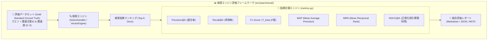

# [DSN-10] 機能設計書: 検索エンジン評価フレームワーク (IR Evaluation Framework) — arxiv-security-papers

本ドキュメントは、**Project Manager (PM)**, **IT Strategist (ST)**, **Systems Architect (SA)**, **IT Specialist (IR: 情報検索・NLP)** の合同審議に基づき、検索エンジンの品質・精度を定量評価するための **「IR 評価フレームワーク（IR Evaluation Engine）」** の設計仕様書です。

---

## 1. 目的と主要評価指標 (Objectives & IR Metrics)

情報検索（Information Retrieval）およびセキュリティ論文探索における検索精度・ランキング品質を、学術標準の IR メトリクスで定量測定・可視化します。

---

## 2. 評価指標の詳細定義 (Metric Definitions)

### 2.1 Precision@K (適合率@K)
上位 $K$ 件の検索結果の中で、実際に正解（Relevant）と判定された文書の割合。
$$\text{Precision@K} = \frac{|\text{Retrieved@K} \cap \text{Relevant}|}{K}$$

### 2.2 Recall@K (再現率@K)
全正解文書集合の中で、上位 $K$ 件の検索結果に含まれた文書の割合。
$$\text{Recall@K} = \frac{|\text{Retrieved@K} \cap \text{Relevant}|}{|\text{Relevant}|}$$

### 2.3 F1-Score (F値)
適合率と再現率の調和平均。
$$F_1 = 2 \cdot \frac{\text{Precision} \cdot \text{Recall}}{\text{Precision} + \text{Recall}}$$

### 2.4 MAP (Mean Average Precision)
複数クエリにわたる平均適合率（Average Precision: AP）の平均。順位の重み付けを考慮した代表的総合指標。
$$\text{AP} = \sum_{k=1}^{N} P(k) \cdot \Delta r(k), \quad \text{MAP} = \frac{1}{|Q|} \sum_{q \in Q} \text{AP}(q)$$

### 2.5 MRR (Mean Reciprocal Rank)
各クエリにおいて、**最初の正解文書が出現した順位**の逆数の平均。
$$\text{MRR} = \frac{1}{|Q|} \sum_{i=1}^{|Q|} \frac{1}{\text{rank}_i}$$

### 2.6 NDCG@K (Normalized Discounted Cumulative Gain)
多段階の関連度（0: 不一致, 1: 関連, 2: 強く関連, 3: 完全一致）を考慮したランキング品質指標。上位に高関連文書があるほど高スコア。
$$\text{DCG@K} = \sum_{i=1}^{K} \frac{2^{rel_i} - 1}{\log_2(i + 1)}, \quad \text{NDCG@K} = \frac{\text{DCG@K}}{\text{IDCG@K}}$$

---

## 3. コンポーネント設計 (`src/search/eval/`)

1. **`metrics.py`**:
   - `compute_precision_at_k(retrieved_ids, relevant_ids, k)`
   - `compute_recall_at_k(retrieved_ids, relevant_ids, k)`
   - `compute_f1_score(precision, recall)`
   - `compute_average_precision(retrieved_ids, relevant_ids)`
   - `compute_reciprocal_rank(retrieved_ids, relevant_ids)`
   - `compute_ndcg_at_k(retrieved_ids, graded_relevance_map, k)`
2. **`dataset.py`**:
   - `EvaluationQuery`: クエリ文字列、カテゴリ、正解IDリスト、多段階関連度マップ。
   - `DEFAULT_SECURITY_GOLD_STANDARD`: セキュリティ領域（Zero-Trust, LLM Jailbreak, Post-Quantum, WAF, Side-Channel等）の標準評価データセット。
3. **`evaluator.py`**:
   - `SearchEvaluator`: 検索エンジン（`SelectHandler` 等）に対してデータセットを一括実行し、総合メトリクスサマリーとクエリ別詳細レポートを出力。
4. **可観測性 MCP 連携**:
   - `observability_mcp_server.py` に `evaluate_search_quality` ツールを追加し、AI エージェントが検索アルゴリズム変更時の精度改善・回帰テストをオンデマンド実行可能にする。
