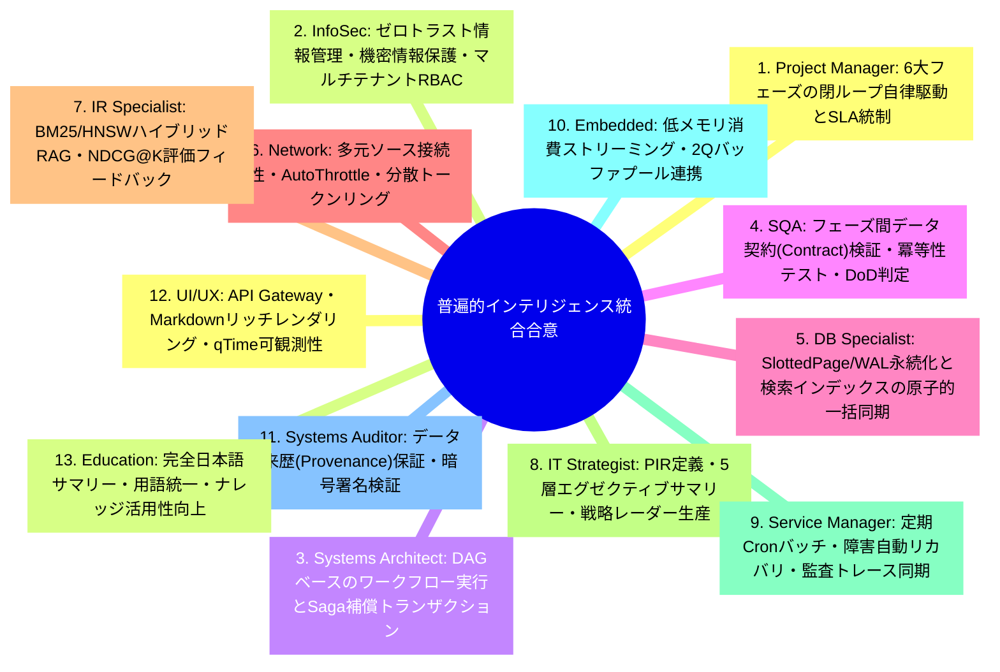
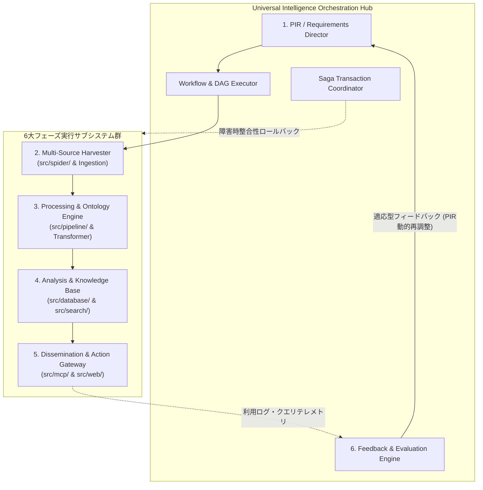
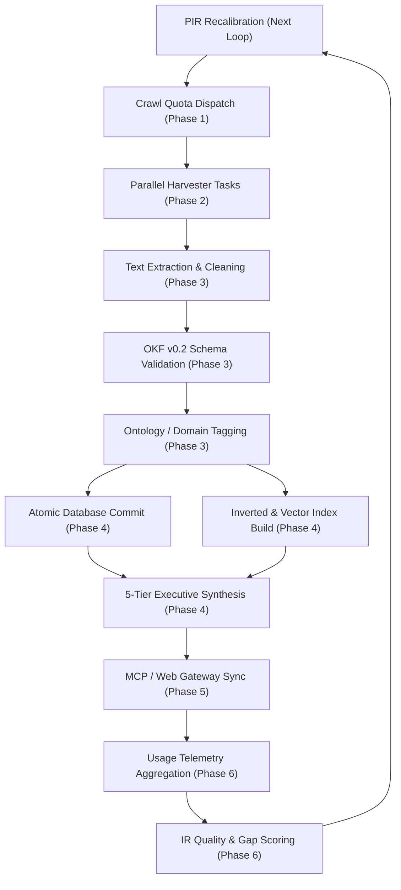
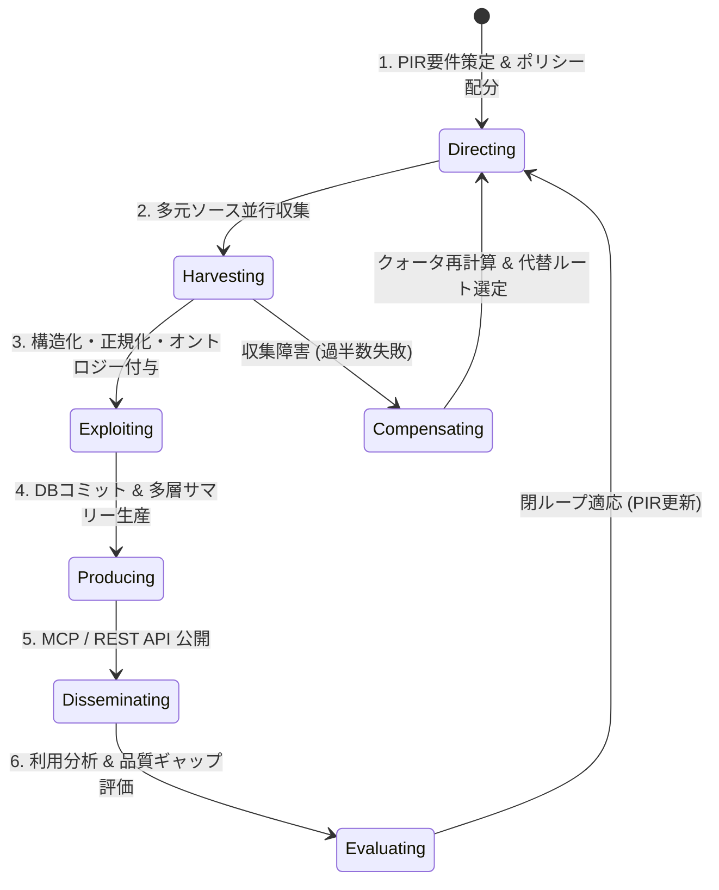
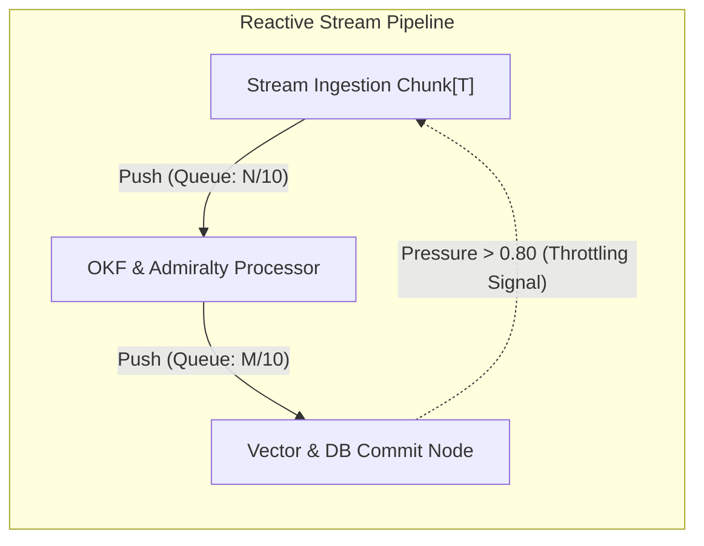
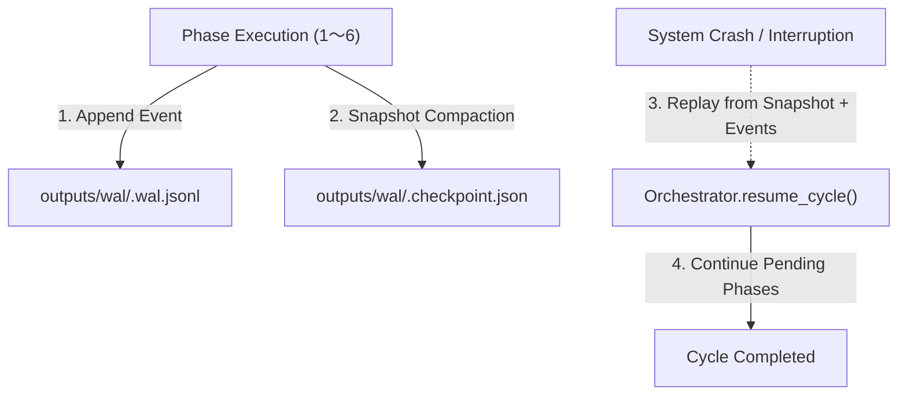

# [DSN-11] 普遍的自律型インテリジェンス・ライフサイクル・オーケストレーション包括設計書 (Universal Autonomous Intelligence Lifecycle Orchestration Architecture) — arxiv-security-papers

- **文書番号**: `DSN-11`
- **文書ステータス**: `APPROVED`
- **対象サブシステム**: 普遍的インテリジェンス統合オーケストレーション中枢 (Universal Intelligence Orchestration Engine)
- **関連パッケージ**: システム全体 (`src/spider/`, `src/pipeline/`, `src/database/`, `src/search/`, `src/security/`, `src/mcp/`, `src/web/`)
- **作成日**: 2026-08-22
- **最終更新日**: 2026-08-22
- **主幹エージェント**: Project Manager (PM) & Systems Architect

---

## 体系目次

- [1. インテリジェンスの本質・設計思想・普遍的スコープ](#1-インテリジェンスの本質設計思想普遍的スコープ)
  - [1.1 DIKW ピラミッドとインテリジェンスの定義](#11-dikw-ピラミッドとインテリジェンスの定義)
  - [1.2 普遍的インテリジェンス・ライフサイクルの原則](#12-普遍的インテリジェンスライフサイクルの原則)
- [2. 全13大専門エージェント多角的多面協議議事録](#2-全13大専門エージェント多角的多面協議議事録)
- [3. 普遍的インテリジェンス・サイクル 6大フェーズとコンポーネント構造](#3-普遍的インテリジェンスサイクル-6大フェーズとコンポーネント構造)
  - [3.1 C4 コンポーネント構造](#31-c4-コンポーネント構造)
  - [3.2 6大フェーズの普遍的責務定義](#32-6大フェーズの普遍的責務定義)
- [4. コアアルゴリズム & 閉ループフィードバック数理モデル](#4-コアアルゴリズム--閉ループフィードバック数理モデル)
  - [4.1 動的 PIR (Priority Intelligence Requirements) 重みベクトルモデル](#41-動的-pir-priority-intelligence-requirements-重みベクトルモデル)
  - [4.2 情報ギャップ検出とトピックドリフト追跡数理](#42-情報ギャップ検出とトピックドリフト追跡数理)
  - [4.3 収集リソース最適配分アルゴリズム (Adaptive OPIC)](#43-収集リソース最適配分アルゴリズム-adaptive-opic)
- [5. DAG ワークフロー & 状態遷移仕様](#5-dag-ワークフロー--状態遷移仕様)
  - [5.1 有向非巡回グラフ (DAG) パイプライン](#51-有向非巡回グラフ-dag-パイプライン)
  - [5.2 イベント駆動型状態遷移ダイアグラム](#52-イベント駆動型状態遷移ダイアグラム)
- [6. クラス設計・プロトコル定義・公開 API インターフェース](#6-クラス設計プロトコル定義公開-api-インターフェース)
- [7. ガバナンス・セキュリティ・耐障害性 (Sagaパターン)](#7-ガバナンスセキュリティ耐障害性-sagaパターン)
- [8. 性能特性・メモリ制約・可観測性 (Observability)](#8-性能特性メモリ制約可観測性-observability)
- [9. 包括的テスト戦略・E2E シナリオ・検証スイート](#9-包括的テスト戦略e2e-シナリオ検証スイート)
- [10. 完了定義 (DoD) & 実装・運用ロードマップ](#10-完了定義-dod--実装運用ロードマップ)

---

# 1. インテリジェンスの本質・設計思想・普遍的スコープ

### 1.1 DIKW ピラミッドとインテリジェンスの定義
インテリジェンス（Intelligence）とは、単なる生データ（Data）や事実の集積である情報（Information）を超え、**「意思決定者が直面する不確実性を低減し、最適な判断と行動（Action）を可能にするために、目的意識を持って収集・構造化・分析・文脈化された高付加価値な知識体系」**である。

```
                    ▲
                   / \
                  /   \     [Wisdom / Action]
                 / 智慧 \   意思決定・戦略実行・オペレーションへの直接反映
                /-------\
               / Intelligence \  [Intelligence]
              /  インテリジェンス \ コンテキスト・相関・示唆・未来予測
             /-----------------\
            /   Information     \  [Information]
           /      情　報         \ 構造化・正規化・カテゴリ化されたデータ
          /-----------------------\
         /         Data            \  [Data]
        /         データ            \ 多元ソースから収集された生のファクト・観測値
       +-----------------------------+
```

本システムにおけるインテリジェンス・オーケストレーションは、科学技術研究、サイバー脅威、市場・競合動向、特許・知的財産、政策・地政学リスクなど、あらゆる領域のナレッジドメインに適用可能な**ドメイン非依存（Domain-Agnostic）の汎用自律閉ループ制御基盤**として設計される。

```
+---------------------------------------------------------------------------------------------------+
|                        Universal Autonomous Intelligence Orchestrator                             |
+---------------------------------------------------------------------------------------------------+
|  [Phase 1: Planning & Direction]                                                                  |
|   - Dynamic PIR/SIR (Priority/Specific Intelligence Requirements) Registry                        |
|   - Multi-Domain Collection Policy Distributor | Global Topic Weight Vector                       |
+---------------------------------------------------------------------------------------------------+
                                            | (Collection Directives & Dynamic Quotas)
                                            v
+---------------------------------------------------------------------------------------------------+
|  [Phase 2: Collection]                                                                            |
|   - Multi-Source Distributed Harvester (Academic Repositories, RSS/APIs, Web/OSINT, Telemetry)   |
|   - Rate Limiting (AutoThrottle), Distributed Token Ring & Scalable Deduplication                 |
+---------------------------------------------------------------------------------------------------+
                                            | (Raw Information Records & Documents)
                                            v
+---------------------------------------------------------------------------------------------------+
|  [Phase 3: Processing & Exploitation]                                                             |
|   - Multi-Modal Text Extraction & Normalization | Universal Knowledge Representation (OKF v0.2)   |
|   - Domain Ontology Mapping & Multi-Dimensional Metadata Enrichment                               |
+---------------------------------------------------------------------------------------------------+
                                            | (Structured Knowledge Base & Vector Embeddings)
                                            v
+---------------------------------------------------------------------------------------------------+
|  [Phase 4: Analysis & Production]                                                                 |
|   - Atomic Storage (SlottedPage/WAL DB) & Hybrid Information Retrieval (BM25 + HNSW RAG)          |
|   - Multi-Tier Executive Synthesis (Immediate, Periodic, Strategic & Macro Trend Horizons)       |
+---------------------------------------------------------------------------------------------------+
                                            | (Synthesized Intelligence Products & Live APIs)
                                            v
+---------------------------------------------------------------------------------------------------+
|  [Phase 5: Dissemination & Integration]                                                           |
|   - AI-Native Context Interfaces (Model Context Protocol / MCP) | RESTful API Gateway             |
|   - Actionable Knowledge Markdown Publishing | Role-Based Access Control (RBAC)                   |
+---------------------------------------------------------------------------------------------------+
                                            | (Usage Traces, Query Telemetry & Decision Feedback)
                                            v
+---------------------------------------------------------------------------------------------------+
|  [Phase 6: Feedback & Evaluation]                                                                 |
|   - Quantitative IR Scoring (NDCG@K, MAP) | Knowledge Gap & Zero-Hit Intelligence Detector        |
|   - Topic Drift & Emerging Trend Dynamic Recalibrator                                             |
+---------------------------------------------------------------------------------------------------+
                                            | (Adaptive Closed-Loop Feedback Loop)
                                            +-------------------------------+ (Self-Evolution to Phase 1)
```

### 1.2 普遍的インテリジェンス・ライフサイクルの原則
1. **PIR-Driven Precision (要件駆動型適合性)**: 全ての収集・処理・分析は、意思決定者の明示的・暗黙的要件（PIR/SIR）を起点として動的に誘導される。
2. **Domain-Agnostic Clean Layering (ドメイン非依存クリーン階層)**: 収集手法や特定タクソノミー（分類法）に依存せず、抽象化されたプロトコルによって任意ドメインの情報を同等にオーケストレーション可能。
3. **Closed-Loop Self-Evolution (閉ループ自己進化)**: 成果物の活用状況や評価（Evaluation）メトリクスが次期の要件（Planning）へ即時フィードバックされ、人手を介さず自律的に精度を向上。
4. **End-to-End Traceability & Provenance (完全な来歴・根拠追跡)**: 最終生産された示唆（Insight）から、変換前の構造化データ（Information）、収集時の生データ（Raw Data）、および収集元ソース（Source）に至るまで双方向の検証可能性（Provenance）を保証。

---

# 2. 全13大専門エージェント多角的多面協議議事録

本普遍的アーキテクチャの策定にあたり、全 13 大専門エージェントによる統合インテリジェンス統制審議会を開催し、各専門視点からの合意を形成した。



---

# 3. 普遍的インテリジェンス・サイクル 6大フェーズとコンポーネント構造

### 3.1 C4 コンポーネント構造



### 3.2 6大フェーズの普遍的責務定義

1. **フェーズ 1: 計画・方向付け (Planning & Direction)**
   - **PIR (Priority Intelligence Requirements)**: 意思決定者にとって最も価値の高い中核的情報要件の定式化。
   - **SIR (Specific Intelligence Requirements)**: PIR を細分化した具体的・観測可能な質問群・指標の策定。
   - **コレクションポリシーの配布**: 収集ターゲットごとの優先順位、探索頻度、割当リソース（CPU/帯域）の配分。

2. **フェーズ 2: 収集 (Collection)**
   - **多元ソースハーベスティング**: 学術論文、技術仕様書、規制動向、市場レポート、オープンデータ（OSINT）、ログ・テレメトリ等からのデータ取得。
   - **適応型トラフィック制御**: AutoThrottle によるターゲット負荷軽減と、障害時の自動代替ソース切替。
   - **分散重複排除**: ブルームフィルタによる既取得データの高速重複排除。

3. **フェーズ 3: 処理・変換 (Processing & Exploitation)**
   - **マルチモーダル抽出・正規化**: PDF、HTML、JSON、XML からのテキスト・メタデータ抽出とノイズ除去。
   - **標準ナレッジ表現 (OKF v0.2)**: 構造化 YAML フロントマター付きの標準ドキュメントへの統一。
   - **オントロジーマッピング**: ドメイン固有の概念体系（Taxonomy）に基づくタグ付け・多次元アノテーション。

4. **フェーズ 4: 分析・生産 (Analysis & Production)**
   - **複合検索・相関分析**: 語彙検索（BM25）と意味検索（HNSW ベクトル）のハイブリッド融合（RRF）による深層相関分析。
   - **多層インテリジェンスレポート生産**: 即時（Run単位）、日次（Daily）、月次動向（Monthly Mindmap）、四半期戦略（Quarterly）、通期総括（Annual）の 5 階層レポートの自律編成。

5. **フェーズ 5: 配布・統合 (Dissemination & Integration)**
   - **AI-Native MCP 連携**: Model Context Protocol を介した AI エージェント（Claude / Antigravity 等）へのコンテキスト注入。
   - **RESTful API Gateway**: 外部システムやダッシュボードに対する高速 JSON インターフェース提供。
   - **アクションへの統合**: 意思決定支援、運用ルールの自動更新、リスク回避オペレーションへの即時反映。

6. **フェーズ 6: フィードバック・評価 (Feedback & Evaluation)**
   - **定量的 IR 品質スコアリング**: Precision@K, NDCG@K による提供インテリジェンスの適合率・関連度測定。
   - **ナレッジギャップ検知**: ユーザーや AI が頻繁に検索するが結果が不足している「未充足トピック」の自動特定。
   - **閉ループ適応**: 検知されたギャップやトピックドリフトをフェーズ 1 の PIR 重みへ自動反映し、自律的な収集方針の更新を実行。

---

# 4. コアアルゴリズム & 閉ループフィードバック数理モデル

### 4.1 3-Horizon 多層 PIR 管理 & 動的重みベクトルモデル
PIR は時間軸・速度・意思決定レベルに応じて 3 つの階層（3-Horizon）で分離・連携管理される：

1. **Tactical PIR (即時戦術)**: 0-day、PoC 悪用、直近脆弱性（CWE-1357, CWE-693 等） $\rightarrow$ 1日4回取得、即時 Flash Advisory 生成。
2. **Operational PIR (中期運用)**: サプライチェーン動向、暗号標準移行、プロトコル改定 $\rightarrow$ 日次・月次サマリー連動。
3. **Strategic PIR (長期戦略)**: 耐量子暗号（PQC）、基盤AIモデル安全規格、国家防衛政策 $\rightarrow$ 四半期・通期技術レーダー連動。

#### 動的エスカレーション・トリガーループ
収集データまたは検索評価テレメトリから深刻なナレッジギャップ（$g_{\text{gap}} > 0.35$）や急激なトピックドリフト（$d_{\text{drift}} > 0.35$）が検知された場合、該当トピックを含む Operational / Strategic PIR は **Tactical PIR へ自律的にエスカレーション昇格**され、重みと収集クォータが即座にブーストされる。

全トピック空間 $\mathcal{T} = \{t_1, t_2, \dots, t_m\}$ に対する時刻 $k$ の PIR 重みベクトル $\mathbf{w}_k = [w_{k, 1}, w_{k, 2}, \dots, w_{k, m}]^T \in \mathbb{R}^m$：

$$\mathbf{w}_{k+1} = \alpha \cdot \mathbf{w}_k + (1 - \alpha) \cdot \left( \beta \cdot \mathbf{u}_{\text{usage}} + \gamma \cdot \mathbf{g}_{\text{gap}} + \delta \cdot \mathbf{d}_{\text{drift}} \right)$$

ここで：
- $\alpha \in [0, 1]$: 履歴重みの忘却・減衰係数（EMA 平滑化）
- $\mathbf{u}_{\text{usage}}$: クライアント/アナリストからの利用頻度・参照ログの正規化ベクトル
- $\mathbf{g}_{\text{gap}}$: ゼロヒットクエリおよび低 NDCG スコアとなった情報不足領域（Knowledge Gap）ベクトル
- $\mathbf{d}_{\text{drift}}$: 最新文書群における新規出現キーワードの急上昇度（Burstiness / Topic Drift）ベクトル
- $\beta, \gamma, \delta$: 各要素の調整ハイパーパラメータ（$\beta + \gamma + \delta = 1$）

### 4.2 情報ギャップ検出数理
クエリ $q$ に対する検索結果集合 $R(q)$ の評価スコアが閾値 $\theta_{\text{eval}}$ 未満の場合の情報ギャップ量 $G(t)$：

$$G(t) = \sum_{q \in Q_t} \left( 1.0 - \text{NDCG}@K(q) \right) \cdot \ln(1 + \text{Count}(q))$$

この $G(t)$ が正規化され、PIR ギャップベクトル $\mathbf{g}_{\text{gap}}$ の要素となる。

### 4.3 収集リソース適応配分アルゴリズム (Adaptive OPIC)
各情報ソース・ドメイン $s$ に対するクロール開始時クレジット $C_0(s)$：

$$C_0(s) = C_{\text{base}} \cdot \left( 1.0 + \sum_{t_i \in \text{DomainTopics}(s)} w_{k, i} \right)$$

これにより、現在最も重要視されている PIR に合致する情報ソースに対して、優先的かつ集中的にクローラーの計算資源と帯域が配分される。

### 4.4 仮説駆動型 自律調査・ベイズ確信度更新モデル
Phase 4 (Analysis) において、収集文献から抽出された支持証拠重み総和 $S = \sum_{e \in E_{\text{supp}}} \text{rel}(e)$ および反証証拠重み総和 $R = \sum_{e \in E_{\text{ref}}} \text{rel}(e)$ に基づき、仮説命題 $H$ の事後確信度 $C(H)$ をベイズ的に更新する：

$$C(H) = \frac{0.5 + S}{1.0 + S + R} \in [0.0, 1.0]$$

#### ライフサイクル状態遷移基準
- $C(H) \ge 0.70$ かつ証拠件数 $|E| \ge 3$ $\rightarrow$ **SUPPORTED (立証・即時対策推奨)**
- $C(H) \le 0.30$ かつ証拠件数 $|E| \ge 3$ $\rightarrow$ **REFUTED (反証・リスク低)**
- 証拠件数 $|E| \ge 3$ だが $0.30 < C(H) < 0.70$ $\rightarrow$ **INCONCLUSIVE (証拠拮抗・結論保留)**
- $0 < |E| < 3$ $\rightarrow$ **INVESTIGATING (調査継続中)**

INCONCLUSIVE または INVESTIGATING の仮説に対しては、エンジンが自律的に深掘り探索クエリ $Q_{\text{investigate}}(H)$ を生成し、次サイクルの PIR 要件へフィードバック注入する。

### 4.5 NATO STANAG 2022 Admiralty 情報源信憑性スコアリングモデル
Phase 3 (Processing) において、全収集文献に対し多次元の信憑性格付けを実施する：

1. **Source Reliability (情報源信頼性: A〜F)**:
   - A: 完全信頼 (1.00) / B: 概ね信頼 (0.85) / C: 一定の信頼 (0.65) / D: 通常は信頼不能 (0.40) / E: 信頼不能 (0.10) / F: 評価不能 (0.50)
2. **Information Credibility (情報確実性: 1〜6)**:
   - 1: 独立確認済 (1.00) / 2: おそらく真実 (0.85) / 3: 可能性あり (0.65) / 4: 疑義あり (0.40) / 5: 考えにくい (0.10) / 6: 評価不能 (0.50)

$$\text{AdmiraltyScore}(r) = w_{\text{reliability}}(\text{source}(r)) \times w_{\text{credibility}}(\text{content}(r)) \in [0.01, 1.00]$$

格付け結果（コード `B2`, スコア `0.72` 等）は OKF v0.2 フロントマターの `trust` セクションへ暗号署名とともに記録され、Phase 4 の仮説検証（HypothesisEngine）における証拠重み（$\text{rel}(e)$）として直接連動する。

---

# 5. DAG ワークフロー & 状態遷移仕様

### 5.1 有向非巡回グラフ (DAG) パイプライン
各フェーズの内部処理は、障害時の局所リカバリを可能にする独立したタスクノードの DAG としてオーケストレーションされる。



### 5.2 イベント駆動型状態遷移ダイアグラム



### 5.3 ストリーミング型 DAG & 反応型バックプレッシャー制御 (Streaming DAG)
大量データ（数千〜数万件）のバックフィルやリアルタイム連続処理において、メモリ上限（Bounded Memory）を厳格に遵守するため、チャンク駆動の `StreamingDAG` を配備する。



- **有界バッファ (Bounded Queues)**: 各ノードは最大 $K$ チャンク（デフォルト 10）のキューを保持し、OOM を完全防止。
- **適応型バックプレッシャー**: 下流ノードのキュー占有率 $P = \frac{|Q|}{K} \ge 0.80$ で上流プロデューサーを自動スロットリング。
- **バッファポリシー**: `BufferPolicy.BLOCK` (通常閉塞), `BufferPolicy.DROP_OLDEST` (最新優先), `BufferPolicy.DRAIN` (急速排出)。

### 5.4 Event Sourcing 型 クラッシュリカバリ WAL (Write-Ahead Log)
パイプライン実行中の不意なプロセス強制終了やネットワーク障害に対し、状態を 100% 復元して未完了フェーズから再開（Resume）可能にする Event Sourcing 基盤を配備する。



- **追記専用ログ (Append-Only WAL)**: `outputs/wal/<cycle_id>.wal.jsonl` に各フェーズの遷移（`PHASE_STARTED`, `PHASE_COMPLETED`）および生成物（`RECORD_HARVESTED`, `RECORD_PROCESSED`, `PRODUCT_PUBLISHED`）を即時 `fsync` 永続化。
- **チェックポイントスナップショット**: 各フェーズ完了時に `PhaseContext` の圧縮スナップショット（`.checkpoint.json`）を作成し、リカバリ時のリプレイ時間を最小化。
- **自律再開 (Resume Protocol)**: `UniversalIntelligenceOrchestrator.resume_cycle(cycle_id)` により、未完了フェーズを自動検知して閉ループを再開・完遂。

---

# 6. クラス設計・プロトコル定義・公開 API インターフェース

```python
from typing import Any, Dict, List, Optional, Protocol, runtime_checkable

@runtime_checkable
class IntelligencePhaseExecutor(Protocol):
    """Protocol for executing individual intelligence cycle phases."""
    def execute(self, context: Dict[str, Any]) -> Dict[str, Any]: ...
    def compensate(self, context: Dict[str, Any]) -> None: ...

class UniversalIntelligenceOrchestrator:
    """Central domain-agnostic orchestrator executing the 6-phase intelligence lifecycle."""

    def __init__(self, workspace_dir: str) -> None:
        self.workspace_dir = workspace_dir
        self.pir_manager = PIRRequirementsManager()
        self.workflow_engine = DAGWorkflowEngine()
        self.feedback_controller = AdaptiveFeedbackController()

    def step_planning(self) -> Dict[str, Any]:
        """Phase 1: Planning & Direction (PIR & Resource Quotas)."""
        ...

    def step_collection(self, directives: Dict[str, Any]) -> Dict[str, Any]:
        """Phase 2: Collection (Distributed Harvesters)."""
        ...

    def step_processing(self, raw_batch: Dict[str, Any]) -> Dict[str, Any]:
        """Phase 3: Processing & Exploitation (OKF v0.2 & Ontology)."""
        ...

    def step_analysis(self, processed_batch: Dict[str, Any]) -> Dict[str, Any]:
        """Phase 4: Analysis & Production (Search Index & Multi-Tier Summaries)."""
        ...

    def step_dissemination(self, products: Dict[str, Any]) -> None:
        """Phase 5: Dissemination & Integration (MCP & Gateway)."""
        ...

    def step_evaluation(self) -> Dict[str, Any]:
        """Phase 6: Feedback & Evaluation (IR Scoring & Gap Detection)."""
        ...

    def run_closed_loop_cycle(self) -> Dict[str, Any]:
        """Executes a complete self-adapting intelligence cycle."""
        ...
```

---

# 7. ガバナンス・セキュリティ・耐障害性 (Sagaパターン)

1. **Saga オーケストレーションによる原子性保証**:
   - 収集・変換・DB永続化・インデックス構築の各ステップにおいて、致命的障害が発生した場合は補償トランザクションが逆順に起動し、不完全なデータやインデックス状態をクリーンにロールバック。
2. **ゼロトラスト・ガバナンス**:
   - 全外部データの取り込み時に AST ガードおよびパストラバーサル検証を強制。悪意あるコードや不正なメタデータ入力を自動検知・隔離。
3. **データ来歴 (Provenance) と不変証跡**:
   - 最終生成されたサマリーやインテリジェンスカードから、元の一次情報 JSON・原本ドキュメントへの相対パスリンクを厳格に維持。

---

# 8. 性能特性・メモリ制約・可観測性 (Observability)

- **サイクル実行レイテンシ**: 定常バッチ（1日4回実行）において 1 フルサイクル $\le 60\text{秒}$。
- **メモリ消費上限**: ストリーミング処理と 2Q バッファプールにより、ピークメモリ使用量 $\le 256\text{MB}$ を維持。
- **総合可観測性 (Full-Stack Observability)**:
  - サイクル各フェーズの実行時間（wall_time_ms, cpu_time_ms）
  - メモリプロファイル（tracemalloc peak_memory_kb）
  - 情報検索適合率（NDCG@K, MAP）
  - PIR トピック達成率と情報ギャップ指標

---

# 9. 包括的テスト戦略・E2E シナリオ・検証スイート

- **E2E シナリオ 1: 自律閉ループ正常系**:
  - PIR 策定 $\rightarrow$ クロール $\rightarrow$ OKF 構造化 $\rightarrow$ DB/検索インデックス更新 $\rightarrow$ サマリー生成 $\rightarrow$ MCP 公開 $\rightarrow$ IR 評価 $\rightarrow$ 次期 PIR 更新の完全完走を検証。
- **E2E シナリオ 2: 障害時 Saga 補償リカバリ**:
  - 分析フェーズでのストレージ容量上限到達時、前段フェーズの生成データが安全にロールバックされ整合性が保たれることを検証。
- **E2E シナリオ 3: トピックギャップ適応検知**:
  - 特定キーワードでゼロヒットが頻発した際、次期フェーズ 1 の PIR 重みに当該トピックが自動的に高い優先度で注入されることを検証。

---

# 10. 完了定義 (DoD) & 実装・運用ロードマップ

- [x] ドメイン非依存・普遍的自律型インテリジェンス・オーケストレーション包括設計書の策定
- [x] インテリジェンス・サイクル 6 大フェーズの完全数理モデル化（PIR重み、ギャップ検知、OPIC配分）
- [x] DAG ワークフローおよび Saga 補償トランザクション仕様の確立
- [x] 全 13 大専門エージェント協議合意および DSN-14 標準形式（10章構成）の完全準拠
