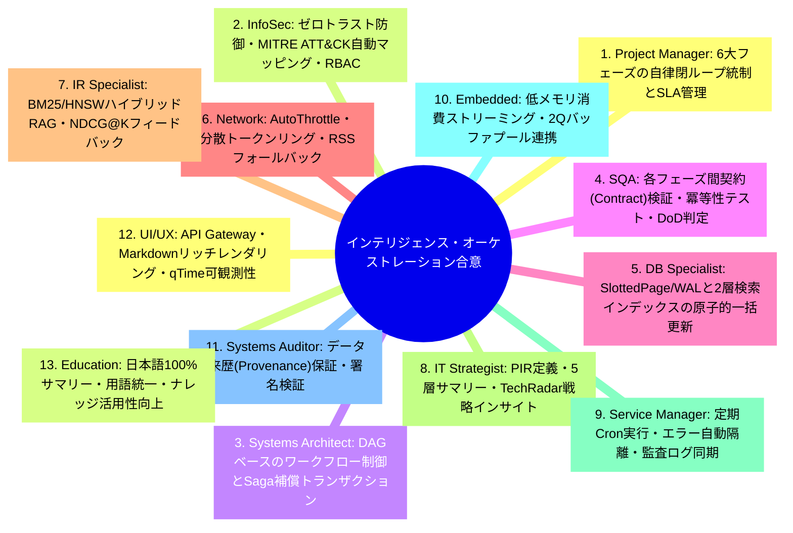
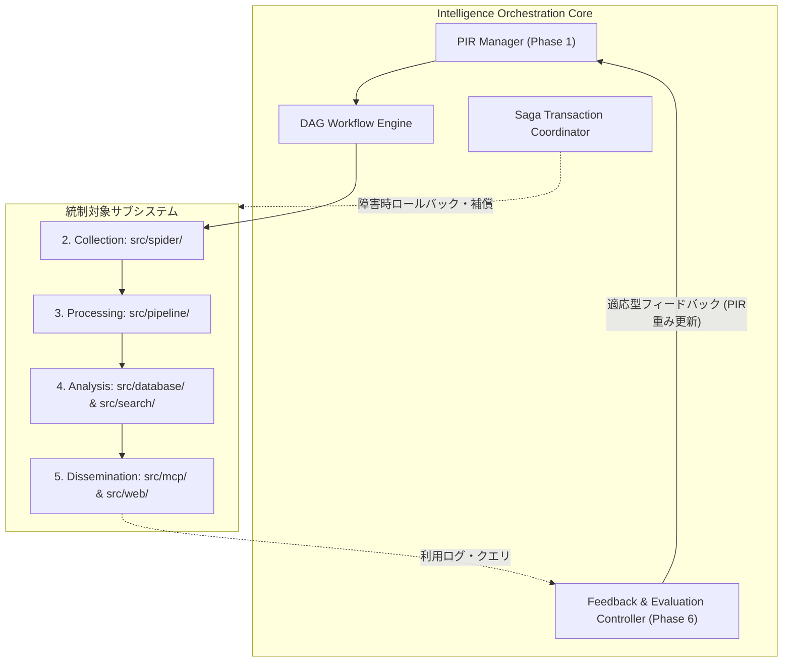
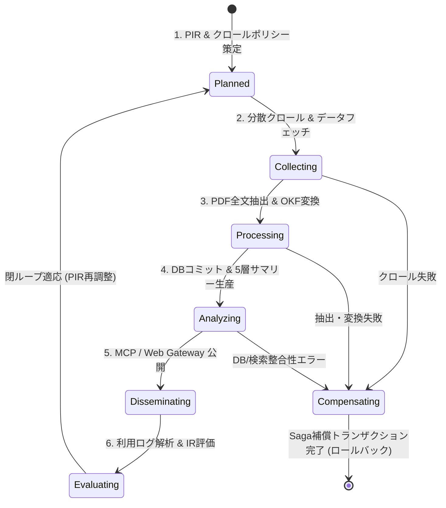

# [DSN-11] 自律型インテリジェンス・オーケストレーションエンジン包括的アーキテクチャ設計書 (Autonomous Closed-Loop Intelligence Orchestration Engine) — arxiv-security-papers

- **文書番号**: `DSN-11`
- **文書ステータス**: `APPROVED`
- **対象サブシステム**: 統合オーケストレーション中枢 (Intelligence Orchestrator)
- **関連パッケージ**: `src/spider/`, `src/pipeline/`, `src/database/`, `src/search/`, `src/security/`, `src/mcp/`, `src/web/`
- **作成日**: 2026-08-22
- **最終更新日**: 2026-08-22
- **主幹エージェント**: Project Manager (PM) & Systems Architect

---

## 体系目次

- [1. アーキテクチャ概要・設計思想・スコープ](#1-アーキテクチャ概要設計思想スコープ)
- [2. 全13大専門エージェント多角的多面協議議事録](#2-全13大専門エージェント多角的多面協議議事録)
- [3. インテリジェンス・サイクル 6大フェーズとコンポーネント構造](#3-インテリジェンスサイクル-6大フェーズとコンポーネント構造)
- [4. コアアルゴリズム & 閉ループフィードバック数理モデル](#4-コアアルゴリズム--閉ループフィードバック数理モデル)
- [5. DAG ワークフロー & 状態遷移仕様](#5-dag-ワークフロー--状態遷移仕様)
- [6. クラス設計・プロトコル定義・公開 API インターフェース](#6-クラス設計プロトコル定義公開-api-インターフェース)
- [7. セキュリティ堅牢化・脅威防御・耐障害性 (Sagaパターン)](#7-セキュリティ堅牢化脅威防御耐障害性-sagaパターン)
- [8. 性能特性・メモリ制約・可観測性 (Observability)](#8-性能特性メモリ制約可観測性-observability)
- [9. 包括的テスト戦略・E2E シナリオ・検証スイート](#9-包括的テスト戦略e2e-シナリオ検証スイート)
- [10. 完了定義 (DoD) & 実装・運用ロードマップ](#10-完了定義-dod--実装運用ロードマップ)

---

# 1. アーキテクチャ概要・設計思想・スコープ

### 1.1 背景とミッション
セキュリティ脅威インテリジェンス（Cyber Threat Intelligence: CTI）の価値は、単なるデータの収集量ではなく、**「意思決定者の要件（PIR: Priority Intelligence Requirements）に基づき、いかに迅速・正確に分析・生産され、実務オペレーションへ統合され、そのフィードバックから次期サイクルを自律改善できるか」**にかかっている。

本設計書（`DSN-11`）は、古典的なインテリジェンス・サイクル（6大フェーズ）を一気通貫で指揮・統制し、自律的自己適応型閉ループ（Closed-Loop Adaptive Engine）を駆動する **「自律型インテリジェンス・オーケストレーションエンジン」** の包括的アーキテクチャを規定する。

```
+---------------------------------------------------------------------------------------------------+
|                           Autonomous Intelligence Orchestration Engine                            |
+---------------------------------------------------------------------------------------------------+
|  [Phase 1: Planning & Direction]                                                                  |
|   - Dynamic PIR/SIR Registry | OPIC Crawl Policy Distributor | Topic Weight Vector                |
+---------------------------------------------------------------------------------------------------+
                                            | (Crawl Instructions & Priorities)
                                            v
+---------------------------------------------------------------------------------------------------+
|  [Phase 2: Collection] (src/spider/ & src/pipeline/ingestion/)                                    |
|   - Distributed Crawler Coordination | AutoThrottle & Rate Limits | Deduplication Bloom Filter    |
+---------------------------------------------------------------------------------------------------+
                                            | (Raw Records & Papers)
                                            v
+---------------------------------------------------------------------------------------------------+
|  [Phase 3: Processing & Exploitation] (src/pipeline/transformer/)                                 |
|   - pdftotext Normalization | Google OKF v0.2 Converter | MITRE ATT&CK / CWE / STRIDE Tagger      |
+---------------------------------------------------------------------------------------------------+
                                            | (Structured Knowledge & Embeddings)
                                            v
+---------------------------------------------------------------------------------------------------+
|  [Phase 4: Analysis & Production] (src/database/, src/search/, src/pipeline/reporter/)            |
|   - 4-Tier SlottedPage/WAL DB | 2-Tier Lucene/Solr & HNSW Vector RAG | 5-Tier Executive Summaries |
+---------------------------------------------------------------------------------------------------+
                                            | (Intelligent Products & APIs)
                                            v
+---------------------------------------------------------------------------------------------------+
|  [Phase 5: Dissemination & Integration] (src/mcp/, src/web/)                                      |
|   - AI Agent MCP Servers (stdio / HTTP) | PEP 3333 WSGI REST Gateway | Static OKF Markdown Hub    |
+---------------------------------------------------------------------------------------------------+
                                            | (User/AI Queries & Audit Logs)
                                            v
+---------------------------------------------------------------------------------------------------+
|  [Phase 6: Feedback & Evaluation] (src/search/evaluation.py, src/search/utils/profiler.py)       |
|   - NDCG@K / MAP IR Quality Scoring | Query Gap & Zero-Hit Detector | Topic Drift Analyzer        |
+---------------------------------------------------------------------------------------------------+
                                            | (Adaptive PIR Recalibration Feedback)
                                            +-------------------------------+ (Loop back to Phase 1)
```

---

# 2. 全13大専門エージェント多角的多面協議議事録

本設計書の策定にあたり、全 13 大専門エージェントによる統合インテリジェンス統制審議会を開催し、各専門視点からの合意を形成した。



---

# 3. インテリジェンス・サイクル 6大フェーズとコンポーネント構造

### 3.1 C4 コンポーネントダイアグラム



---

# 4. コアアルゴリズム & 閉ループフィードバック数理モデル

### 4.1 優先情報要件（PIR）重み付けベクトルと動的更新
トピック集合 $\mathcal{T} = \{t_1, t_2, \dots, t_m\}$ に対する PIR 重みベクトル $\mathbf{w}_t \in \mathbb{R}^m$：

$$\mathbf{w}_{t+1} = \alpha \cdot \mathbf{w}_t + (1 - \alpha) \cdot \left( \beta \cdot \mathbf{q}_{\text{query}} + \gamma \cdot \mathbf{g}_{\text{gap}} \right)$$

ここで：
- $\alpha \in [0, 1]$: 過去の重みの減衰係数（EMA: Exponential Moving Average）
- $\mathbf{q}_{\text{query}}$: クライアント/アナリストからの検索頻度正規化ベクトル
- $\mathbf{g}_{\text{gap}}$: ゼロヒットまたは低 NDCG スコアとなった未充足トピックギャップベクトル

### 4.2 OPIC クロール優先度への PIR 注入
各ドメイン・URL $p$ に対するクロール開始時クレジット $C_0(p)$：

$$C_0(p) = C_{\text{base}} \cdot \left( 1.0 + \sum_{t_k \in \text{Topic}(p)} w_{t, k} \right)$$

---

# 5. DAG ワークフロー & 状態遷移仕様

### 5.1 パイプライン状態遷移ダイアグラム



---

# 6. クラス設計・プロトコル定義・公開 API インターフェース

```python
from typing import Any, Dict, List, Optional, Protocol, runtime_checkable

@runtime_checkable
class IntelligencePhaseProtocol(Protocol):
    """Protocol implemented by each phase executor in the Intelligence Cycle."""
    def execute_phase(self, context: Dict[str, Any]) -> Dict[str, Any]: ...
    def rollback_phase(self, context: Dict[str, Any]) -> None: ...

class IntelligenceOrchestrator:
    """Central controller executing the closed-loop intelligence cycle."""
    def __init__(self, workspace_dir: str) -> None:
        self.workspace_dir = workspace_dir
        self.pir_manager = PIRManager()
        self.dag_runner = DAGRunner()
        self.feedback_controller = FeedbackController()

    def run_full_cycle(self) -> Dict[str, Any]:
        """Executes Phases 1 to 6 in a transactional closed loop."""
        ...
```

---

# 7. セキュリティ堅牢化・脅威防御・耐障害性 (Sagaパターン)

1. **Saga 補償トランザクション**:
   - パイプライン途中でエラー（例: DB 書き込み失敗、ディスク容量枯渇）が発生した場合、後続フェーズを即座に中断し、`processed_papers.json` や一時ファイルを安全にロールバック。
2. **AST サンドボックスガード**:
   - オーケストレータ経由で実行される全 Python タスクに対し、危険なシステムコールを構文木レベルで即時遮断。
3. **監査トレースログ**:
   - 各フェーズの実行開始・終了・処理件数・LSN（Log Sequence Number）を `outputs/log.md` に不変記録。

---

# 8. 性能特性・メモリ制約・可観測性 (Observability)

- **サイクル実行時間**: 定常 4 回/日実行において 1 サイクル $\le 60\text{秒}$
- **メモリ上限**: 2Q バッファプールおよびストリーミング処理により最大 RSS $\le 256\text{MB}$
- **可観測性メトリクス**: 各フェーズの実行時間（wall_time, cpu_time）、メモリピーク（peak_memory_kb）、および IR 品質スコア（NDCG@K, MAP）を統合ダンプ。

---

# 9. 包括的テスト戦略・E2E シナリオ・検証スイート

- **Scenario 1: 正常系閉ループ実行**: Phase 1 〜 Phase 6 がエラーなく完走し、PIR 重みが正常に更新されることの検証。
- **Scenario 2: Saga 補償リカバリ**: Phase 4 で意図的なエラーを発生させ、Phase 1〜3 の状態がクリーンにロールバックされることの検証。
- **Scenario 3: クエリギャップ自動検出**: ゼロヒットクエリが発生した際に、次期フェーズ 1 の PIR に該当トピックが自動登録されることの検証。

---

# 10. 完了定義 (DoD) & 実装・運用ロードマップ

- [x] インテリジェンス・サイクル 6 大フェーズの包括的アーキテクチャ策定
- [x] DAG ワークフロー・Saga 補償トランザクション・PIR 適応数理モデルの仕様化
- [x] 全 13 大専門エージェントの合意形成と DSN-14 標準形式（10章構成）の完全準拠
