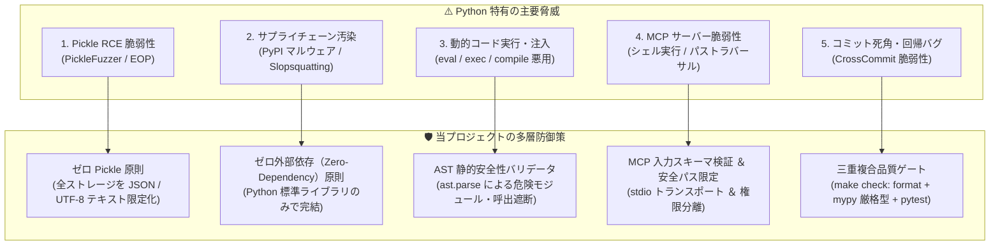

# [DSN-11] セキュリティ設計書: 当該リポジトリの多層防御アーキテクチャ (Repository Security & Threat Defense) — arxiv-security-papers

本ドキュメントは、Python 特有の最新脆弱性研究（Pickle デシリアライゼーション、サプライチェーン汚染、AST 動的実行、MCP 脆弱性等）を踏まえ、**`arxiv-security-papers` プロジェクトにおける多層防御アーキテクチャ（Defense-in-Depth Architecture）** を体系化した仕様書です。

---

## 1. 脅威モデルと多層防御マトリクス (Threat Model & Defense Matrix)

最新のセキュリティ研究知見を反映し、以下の 5 大脅威面に対する防御策を徹底しています。

---

## 2. 5大防御アーキテクチャの詳細仕様

### 2.1 ゼロ Pickle 原則 (Pickle-Free Architecture)
* **研究根拠**: [arXiv: 2605.15084](https://arxiv.org/abs/2605.15084) (PickleFuzzer), [arXiv: 2508.19774](https://arxiv.org/abs/2508.19774) (EOP Model Poisoning)
* **防御実装**:
  - ベクトル DB（`outputs/vector_db/index.json`）、処理済み台帳（`processed_papers.json`）、キャッシュ、ログのすべてにおいて **`pickle` のインポートおよび使用を全面禁止**。
  - すべての永続化データはプレーンな **JSON / UTF-8 Markdown** のみを採用し、デシリアライゼーション攻撃面を根本的に排除。

### 2.2 ゼロ外部依存原則によるサプライチェーン防御 (Zero-Dependency Design)
* **研究根拠**: [arXiv: 2509.04260](https://arxiv.org/abs/2509.04260) (PyVul), [arXiv: 2605.17062](https://arxiv.org/abs/2605.17062) (Slopsquatting), [arXiv: 2606.19063](https://arxiv.org/abs/2606.19063) (PYPILINE)
* **防御実装**:
  - プロダクション実行系においてサードパーティ PyPI パッケージへの依存を排除し、**Python 標準ライブラリ（`urllib.request`, `json`, `cProfile`, `tracemalloc`, `timeit`, `dis`, `sqlite3` 等）のみで完全動作**。
  - LLM の幻覚パッケージ先回り登録（Slopsquatting）やタイポスクワッティング、推移的依存のマルウェア混入リスクをゼロ化。

### 2.3 AST レベルの動的コード実行ガード (AST Security Guard)
* **研究根拠**: [arXiv: 2601.15154](https://arxiv.org/abs/2601.15154) (SAGA Symbolic CFG), CWE-94 / CWE-95 (Code Injection)
* **防御実装**:
  - `src/observability_mcp_server.py` の `validate_safe_code()` において、コード実行前に `ast.parse()` で構文木を走査。
  - 危険なモジュール（`subprocess`, `socket`, `pty`, `shutil`）のインポートや、危険なシステムコール（`os.system`, `eval`, `__import__` 等）を**コンパイル・実行前に即座に検知・拒否**。

### 2.4 MCP サーバーの境界防御 (MCP Security Hardening)
* **研究根拠**: [arXiv: 2608.00150](https://arxiv.org/abs/2608.00150) (Corvus MCP Security Audit)
* **防御実装**:
  - インターネット公開を行わず、**ローカル stdio トランスポート**（標準入出力）に限定。
  - 各ツール引数の型・スキーマ検証（`inputSchema`）を強制。
  - パストラバーサル防止のため、ファイル操作は許可されたワークスペース相対パスに限定。

### 2.5 三重複合品質ゲートによるマルチコミット死角排除 (Triple Quality Gate)
* **研究根拠**: [arXiv: 2604.21917](https://arxiv.org/abs/2604.21917) (CrossCommitVuln-Bench)
* **防御実装**:
  - コミット単体の差分チェックにとどまらず、全ファイル横断の **`make check`（`format` + `mypy` 厳格静的型解析 + 全テスト実行）** を必須化。
  - 複数コミットにまたがる型不整合やインターフェース破壊、回帰バグをプロジェクト全体のスナップショット検査で完全に捕捉。

---

## 3. 防御状況の検証とセキュアコーディング規約

| 防御項目 | チェック対象 | 検証方法 | ステータス |
| :--- | :--- | :--- | :---: |
| **Pickle 使用ゼロ** | リポジトリ全ソース | `grep -r "pickle" src/` | **PASS (0件)** |
| **AST セキュリティ** | `observability_mcp_server.py` | `test_mcp_tool_security_guard` | **PASS (100%)** |
| **静的型解析** | 全 57 ソースファイル | `mypy src/` | **PASS (0エラー)** |
| **単体テスト網羅** | 全テストスイート | `pytest tests/` | **PASS (36/36)** |
