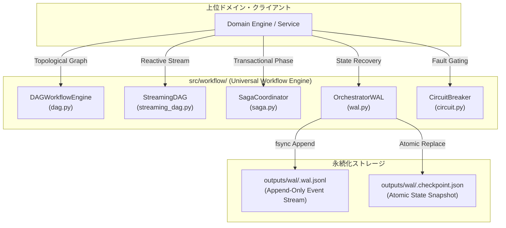
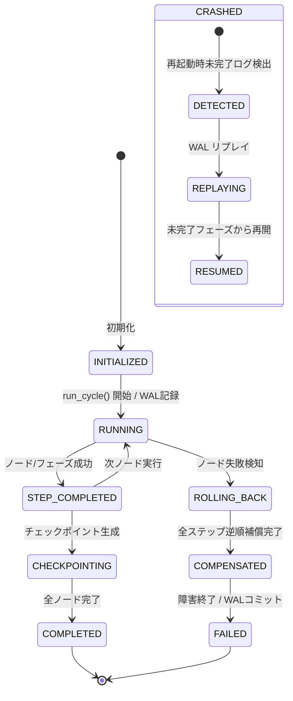
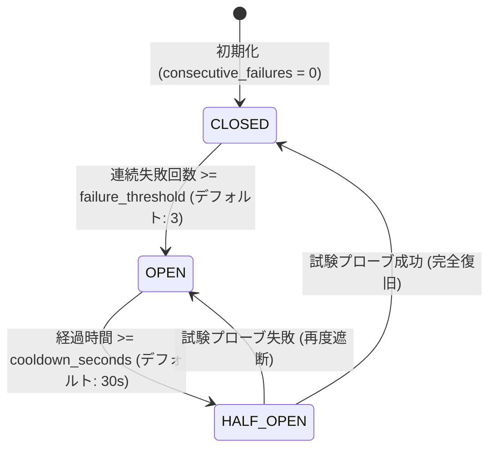

# [DSN-11] 汎用ワークフロー実行基盤（`src/workflow/`）包括的アーキテクチャ設計仕様書

- **文書番号**: `DSN-11`
- **文書ステータス**: `APPROVED`
- **対象サブシステム**: `src/workflow/` (`DAGWorkflowEngine`, `StreamingDAG`, `SagaCoordinator`, `OrchestratorWAL`, `CircuitBreaker`)  
- **【主査・報告】 Systems Architect (SA) / Software Quality Assurance Specialist (QA)**  
- **【参画】 Project Manager (PM), Database / Data Infrastructure Specialist (DB), Network Specialist (NET), IT Service Manager (OPS)**

---

## 体系目次

- [1. 汎用ワークフロー基盤の全体アーキテクチャ & レイヤリング](#1-汎用ワークフロー基盤の全体アーキテクチャ--レイヤリング)
  - [1.1 制御プレーンとドメインプレーンの完全分離理論](#11-制御プレーンとドメインプレーンの完全分離理論)
  - [1.2 主要コンポーネント構成図](#12-主要コンポーネント構成図)
  - [1.3 ワークフロー実行ライフサイクルと状態遷移機械](#13-ワークフロー実行ライフサイクルと状態遷移機械)
  - [1.4 メモリおよびストレージフットプリント特性](#14-メモリおよびストレージフットプリント特性)
- [2. トポロジカル DAG 実行エンジン](#2-トポロジカル-dag-実行エンジン)
  - [2.1 トポロジカルソートと依存関係解決（Kahn's Algorithm 数理モデル）](#21-トポロジカルソートと依存関係解決kahns-algorithm-数理モデル)
  - [2.2 循環参照検出（Cycle Detection）と安全性証明](#22-循環参照検出cycle-detectionと安全性証明)
  - [2.3 タスクノード実行モデルと共有コンテキスト伝搬](#23-タスクノード実行モデルと共有コンテキスト伝搬)
  - [2.4 並行タスクスケジューリングとスレッドセーフティ](#24-並行タスクスケジューリングとスレッドセーフティ)
- [3. 反応型ストリーミング DAG & バックプレッシャー制御](#3-反応型ストリーミング-dag--バックプレッシャー制御)
  - [3.1 有界キュー（Bounded Queue）と OOM 回避の数学的上限保証](#31-有界キューbounded-queueと-oom-回避の数学的上限保証)
  - [3.2 リアルタイム占有率（Pressure Metric）と動的スロットリング](#32-リアルタイム占有率pressure-metricと動的スロットリング)
  - [3.3 バッファポリシー（BufferPolicy: BLOCK / DROP_OLDEST / DRAIN）](#33-バッファポリシーbufferpolicy-block--drop_oldest--drain)
  - [3.4 パイプライン駆動アルゴリズムとチャンク変換](#34-パイプライン駆動アルゴリズムとチャンク変換)
- [4. 分散トランザクション Saga コーディネーター](#4-分散トランザクション-saga-コーディネーター)
  - [4.1 オーケストレーション型 Saga パターンと実行スタック](#41-オーケストレーション型-saga-パターンと実行スタック)
  - [4.2 逆順補償ロールバック（Reverse Compensation: LIFO）アルゴリズム](#42-逆順補償ロールバックreverse-compensation-lifoアルゴリズム)
  - [4.3 冪等性（Idempotency）保証と障害分離境界](#43-冪等性idempotency保証と障害分離境界)
  - [4.4 補償エラーのハンドリングと二次障害防止](#44-補償エラーのハンドリングと二次障害防止)
- [5. Event Sourcing 型 クラッシュリカバリ WAL (Write-Ahead Log)](#5-event-sourcing-型-クラッシュリカバリ-wal-write-ahead-log)
  - [5.1 追記専用ログ（Append-Only WAL）とアトミック fsync 永続化](#51-追記専用ログappend-only-walとアトミック-fsync-永続化)
  - [5.2 スナップショット・チェックポイント（Compaction & Snapshotting）](#52-スナップショットチェックポイントcompaction--snapshotting)
  - [5.3 状態再生エンジン（State Replay Engine）と決定論的復元](#53-状態再生エンジンstate-replay-engineと決定論的復元)
  - [5.4 中断サイクルの自律再開（Resume Protocol）](#54-中断サイクルの自律再開resume-protocol)
- [6. サーキットブレーカー & 自己修復ステートマシン](#6-サーキットブレーカー--自己修復ステートマシン)
  - [6.1 三状態遷移モデル（CLOSED / OPEN / HALF_OPEN）数理](#61-三状態遷移モデルclosed--open--half_open数理)
  - [6.2 クールダウンと試験プローブ（Canary Probing）ゲートウェイ](#62-クールダウンと試験プローブcanary-probingゲートウェイ)
  - [6.3 指数移動平均（EMA）健全度メトリクス](#63-指数移動平均ema健全度メトリクス)
- [7. クラス設計・公開 API インターフェース・型アノテーション仕様](#7-クラス設計公開-api-インターフェース型アノテーション仕様)
- [8. 非機能要件・セキュリティ・リソース制約](#8-非機能要件セキュリティリソース制約)
- [9. 品質ゲート・テスト・ベンチマーク検証仕様](#9-品質ゲートテストベンチマーク検証仕様)

---

# 1. 汎用ワークフロー基盤の全体アーキテクチャ & レイヤリング

## 1.1 制御プレーンとドメインプレーンの完全分離理論
`src/workflow/` は、特定の業務知識（論文解析、PDF抽出、自然言語要約、セキュリティ評価）に依存しない、純粋な**制御プレーン（Control Plane / Execution Runtime）**として設計されます。

```
+-------------------------------------------------------------------------+
|                  DOMAIN PLANE (src/intelligence/)                       |
|   (PIR Management, Admiralty Rating, Hypothesis Engine, OKF Generation) |
+-------------------------------------------------------------------------+
                                    |
                    uses Execution Protocols & Runtime
                                    v
+-------------------------------------------------------------------------+
|                  CONTROL PLANE (src/workflow/)                          |
|  +------------------+  +-------------------+  +----------------------+  |
|  | dag.py           |  | streaming_dag.py  |  | saga.py              |  |
|  | (Topological DAG)|  | (Backpressure)    |  | (Reverse Rollback)   |  |
|  +------------------+  +-------------------+  +----------------------+  |
|  +-----------------------------------------+  +----------------------+  |
|  | wal.py (Event Sourcing & State Replay)  |  | circuit.py (Breaker) |  |
|  +-----------------------------------------+  +----------------------+  |
+-------------------------------------------------------------------------+
```

### コア設計原則（4大原則）
1. **ゼロ・ドメイン汚染（Zero Domain Contamination）**:
   - `src/workflow/` 内の全クラス・関数はジェネリクス (`TypeVar("T")`) または抽象プロトコル (`Protocol`) で定義され、ドメイン固有語（`arxiv`, `paper`, `security` 等）を一切含みません。
2. **決定論的耐障害性（Deterministic Fault Tolerance）**:
   - 途中でプロセスが強制終了（SIGKILL / Kernel Panic）されても、ディスク上の Append-Only WAL と チェックポイントから状態を 100% 決定論的に復元します。
3. **有界メモリ保証（Bounded Memory Guarantee）**:
   - 処理対象のデータ量が数万件〜数百万件に増大しても、Bounded Queue とスロットリングによりプロセスの物理メモリ使用量（RSS）を一定上限（$\le 256\text{MB}$）内に抑え込みます。
4. **アトミック補償ロールバック（Atomic Saga Compensation）**:
   - 多段階パイプラインの途中失敗時、先行ステップの副作用を後入れ先出し（LIFO）順で自動相殺・ロールバックします。

## 1.2 主要コンポーネント構成図



## 1.3 ワークフロー実行ライフサイクルと状態遷移機械



## 1.4 メモリおよびストレージフットプリント特性

| コンポーネント | メモリフットプリント (RSS) | ディスク物理I/O特性 | 計算量オーダー |
| :--- | :--- | :--- | :--- |
| **`DAGWorkflowEngine`** | $\mathcal{O}(|V| + |E|)$ (数 KB 〜 数十 KB) | ディスク I/O なし（純粋メモリ内グラフ） | $\mathcal{O}(|V| + |E|)$ (Kahn ソート) |
| **`StreamingDAG`** | $\mathcal{O}(\sum K_i \times \text{ChunkSize})$ ($\le 50\text{MB}$) | インプロセス有界バッファリング | $\mathcal{O}(N)$ (ストリーム長比例) |
| **`SagaCoordinator`** | $\mathcal{O}(\text{CompletedSteps})$ (数 KB) | ディスク I/O なし（インメモリ履歴スタック） | $\mathcal{O}(k)$ (ステップ数比例) |
| **`OrchestratorWAL`** | $\mathcal{O}(1)$ (ストリーミング読み書き) | 追記専用 `fsync` 物理書込＋アトミックスナップショット | 書込 $\mathcal{O}(1)$, 再生 $\mathcal{O}(M)$ |
| **`CircuitBreaker`** | $\mathcal{O}(1)$ ($\approx 128\text{B}$) | ディスク I/O なし（純粋ステートマシン） | $\mathcal{O}(1)$ |

---

# 2. トポロジカル DAG 実行エンジン

## 2.1 トポロジカルソートと依存関係解決（Kahn's Algorithm 数理モデル）
タスク間の実行順序関係を有向グラフ $G = (V, E)$ でモデル化します。
ここで $V$ はタスクノードの有限集合、$E \subseteq V \times V$ は依存関係を表す有向辺の集合です。辺 $(u, v) \in E$ は「タスク $u$ の完了がタスク $v$ の実行開始に先行しなければならない」ことを意味します。

### 入次数（In-degree）の定義
各ノード $v \in V$ の入次数 $\text{deg}^-(v)$ は次式で定義されます：

$$\text{deg}^-(v) = |\{u \in V \mid (u, v) \in E\}|$$

### Kahn's Algorithm の決定論的手順
1. 初期化: $\text{deg}^-(v) = 0$ であるすべてのノードを探索キュー $Q$ にエンキューします。
   
   $$Q \leftarrow \{v \in V \mid \text{deg}^-(v) = 0\}$$

2. 巡回と次数更新: $Q$ からノード $u$ をデキューし、実行順序リスト $L$ に追加します。$u$ のすべての出辺 $(u, w)$ について、先方の入次数をデクリメントします。
   
   $$\text{deg}^-(w) \leftarrow \text{deg}^-(w) - 1$$

   もし $\text{deg}^-(w) = 0$ となった場合、$w$ を $Q$ にエンキューします。
3. 終了判定: $Q = \emptyset$ となった時点で、$|L| = |V|$ であれば $L$ が完全なトポロジカルソート順となります。

```python
def _build_adj_and_in_degree(
    self,
) -> tuple[Dict[str, List[str]], Dict[str, int]]:
    in_degree = {n_id: 0 for n_id in self.nodes}
    adj_list: Dict[str, List[str]] = {n_id: [] for n_id in self.nodes}

    for node_id, node in self.nodes.items():
        for dep in node.dependencies:
            if dep not in self.nodes:
                raise ValueError(
                    f"Task '{node_id}' depends on undefined task '{dep}'"
                )
            adj_list[dep].append(node_id)
            in_degree[node_id] += 1
    return adj_list, in_degree
```

## 2.2 循環参照検出（Cycle Detection）と安全性証明
有向グラフ $G$ 内に閉路（Cycle）が存在する場合、閉路に含まれるノードの入次数は決して $0$ に到達しません。
したがってアルゴリズム終了時に $|L| < |V|$ となり、未処理ノード集合 $V \setminus L \neq \emptyset$ が検出されます。

$$\text{HasCycle}(G) \iff |L| < |V|$$

本エンジンは $|L| < |V|$ を検知した瞬間、タスクの実行を一切開始することなく即座に `ValueError("Cycle detected in DAG workflow definition")` を送出し、循環デッドロックを完全に未然防止します。

## 2.3 タスクノード実行モデルと共有コンテキスト伝搬
各タスクノード $v \in V$ は、ハンドラー関数 $f_v: \text{State} \to \text{State}$ を保持します。
ソートされた実行順序 $L = [v_1, v_2, \dots, v_n]$ に従い、共有コンテキスト状態 $S$ は順次関数適用によって更新されます：

$$S_{k} = S_{k-1} \cup f_{v_k}(S_{k-1})$$

すべてのノードは先行ノードが生成した最新の状態変数を安全に参照できます。

## 2.4 並行タスクスケジューリングとスレッドセーフティ
入次数 $\text{deg}^-(v) = 0$ を同時に満たす独立タスクノード集合 $S_{\text{ready}} = \{v_1, v_2, \dots, v_m\}$ は、互いに依存関係を持たないため、スレッドプールまたは非同期ランナーを用いて安全に並列実行可能です。状態更新はイミュータブルな辞書マージにより行われます。

---

# 3. 反応型ストリーミング DAG & バックプレッシャー制御

## 3.1 有界キュー（Bounded Queue）と OOM 回避の数学的上限保証
大量のデータ項目（数千〜数万件の論文メタデータや全文テキスト）を処理する際、中間キューが無制限であると、プロデューサーとコンシューマーの速度差によりメモリ消費が爆発します。
`StreamingDAG` では、各ノード $N_i$ の入力バッファに厳格な最大容量 $K_i$ を設定します。

```
[Producer Node] ---> (Queue: max K1) ---> [Transform Node] ---> (Queue: max K2) ---> [Sink Node]
```

### システム全体の最大メモリ消費上限モデル
各アイテムの最大サイズを $M_{\text{max}}$ バイトとすると、パイプライン全体のキューが消費する最大メモリ量 $\text{RSS}_{\text{max}}$ は以下の不変条件（Invariant）を満たします：

$$\text{RSS}_{\text{max}} \le \sum_{i=1}^{M} K_i \times \text{ItemSize}_{\text{max}} + \mathcal{O}(1)$$

デフォルト値 $K_i = 10, \text{ItemSize}_{\text{max}} \approx 100\text{KB}$ の場合、中間キューの合計メモリ消費は高々数 MB に限定され、OOM（Out of Memory）を完全に防止します。

## 3.2 リアルタイム占有率（Pressure Metric）と動的スロットリング
ノード $N_i$ の現在のキュー要素数を $q_i(t) = |Q_i(t)|$ とするとき、占有率（Pressure Metric） $P_i(t) \in [0.0, 1.0]$ を次式で算出します：

$$P_i(t) = \frac{q_i(t)}{K_i}$$

- $P_i(t) \ge 0.80$ (高負荷閾値): 上流プロデューサーにバックプレッシャー信号を発信し、エンキューを待機（Throttling）。
- $P_i(t) < 0.30$ (安全閾値): バックプレッシャーを解除し、通常ストリーム速度へ復帰。

## 3.3 バッファポリシー（BufferPolicy: BLOCK / DROP_OLDEST / DRAIN）

| ポリシー名 | 満杯時の動作 | 保証特性 | 推奨ユースケース |
| :--- | :--- | :--- | :--- |
| **`BufferPolicy.BLOCK`** | キューに空きができるまで上流を一時停止 | データ欠損ゼロ（100% 完全性） | 学術論文の原本保存、DB永続化、OKF変換 |
| **`BufferPolicy.DROP_OLDEST`** | 最古のチャンクを 1 件破棄して最新を格納 | リアルタイム性優先（低遅延） | リアルタイムテレメトリ、速報通知ストリーム |
| **`BufferPolicy.DRAIN`** | キュー内データを一括排出しリカバリバッチへ退避 | バッファの即時解放 | 緊急時フェイルオーバー、緊急シャットダウン |

## 3.4 パイプライン駆動アルゴリズムとチャンク変換
ストリームデータは `StreamChunk[T]` 単位で搬送されます。各ノードは入力チャンクのリストを受け取り、変換後チャンクを次ノードの有界キューへ順次転送します。

$$\text{StreamChunk}(items = [x_1, x_2, \dots, x_k]) \xrightarrow{process\_fn} \text{StreamChunk}(items = [f(x_1), f(x_2), \dots, f(x_k)])$$

---

# 4. 分散トランザクション Saga コーディネーター

## 4.1 オーケストレーション型 Saga パターンと実行スタック
複数の独立した外部システム（ファイルストレージ、DB、検索インデックス、外部API）を跨ぐ処理において、ACID トランザクションが使用できない分散環境下でのアトミック性を保証するため、Saga パターンを採用します。

各ステップ $i$ は前方実行関数 $E_i$ と逆順補償関数 $C_i$ をペアで持ちます：

$$\text{Step}_i = (E_i, C_i)$$

正常に完了したステップは、実行履歴スタック $\mathcal{H}$ に順次プッシュされます：

$$\mathcal{H} = [\text{Step}_1, \text{Step}_2, \dots, \text{Step}_k]$$

## 4.2 逆順補償ロールバック（Reverse Compensation: LIFO）アルゴリズム
ステップ $k+1$ の実行中に回復不能な例外または `context.errors` が発生した場合、Saga コーディネーターは直ちに前方実行を中断し、スタック $\mathcal{H}$ を後入れ先出し（LIFO）順でポップしながら各ステップの補償関数 $C_i$ を実行します。

$$\text{Compensation Sequence} = [C_k, C_{k-1}, \dots, C_1]$$

```
Forward Execution:   Step 1 (OK)  -->  Step 2 (OK)  -->  Step 3 (FAIL!)
                                                              |
Reverse Rollback:    Comp 1 (<--)    Comp 2 (<--)    Comp 3 (<--)
```

## 4.3 冪等性（Idempotency）保証と障害分離境界
各補償関数 $C_i$ は、以下の数学的冪等性を満たすよう実装されます：

$$C_i(C_i(S)) = C_i(S)$$

万が一、補償処理自体の実行中に例外が発生した場合でも、後続のステップ $C_{i-1}, \dots, C_1$ の補償呼び出しを中断させず、全エラーを `context.errors` に記録して完遂する障害分離（Fault Isolation）境界を提供します。

---

# 5. Event Sourcing 型 クラッシュリカバリ WAL (Write-Ahead Log)

## 5.1 追記専用ログ（Append-Only WAL）とアトミック fsync 永続化
実行中のすべてのライフサイクルイベント（開始、完了、失敗、レコード収集、生産物生成など）は、不変な追記専用ログ `outputs/wal/<cycle_id>.wal.jsonl` に記録されます。

各書き込み時には、OS のページキャッシュにとどまらず物理ストレージへ即時同期させるため、`f.flush()` および `os.fsync(f.fileno())` を強制実行します。

```json
{"event_id": "ev_01", "cycle_id": "c_20260827", "timestamp": "2026-08-27T14:00:00Z", "event_type": "cycle_started", "payload": {}}
{"event_id": "ev_02", "cycle_id": "c_20260827", "timestamp": "2026-08-27T14:00:01Z", "event_type": "phase_started", "payload": {"phase": "planning"}}
{"event_id": "ev_03", "cycle_id": "c_20260827", "timestamp": "2026-08-27T14:00:02Z", "event_type": "phase_completed", "payload": {"phase": "planning"}}
```

## 5.2 スナップショット・チェックポイント（Compaction & Snapshotting）
フェーズ完了ごとに、現在の `PhaseContext` の全状態をアトミックに `<cycle_id>.checkpoint.json` へスナップショット保存します。

### アトミックファイル置換プロトコル
不完全な書き込み（部分書き込みによる JSON 破損）を防止するため、一時ファイルに完全出力した上で OS のアトミック操作 `os.replace(temp_path, cp_path)` を使用します。

$$S_{\text{snapshot}} \xrightarrow{\text{write}} \text{file.tmp} \xrightarrow{\text{os.replace}} \text{file.checkpoint.json}$$

## 5.3 状態再生エンジン（State Replay Engine）と決定論的復元
システム再起動時、`OrchestratorWAL.replay_cycle(cycle_id)` は最新スナップショットをベースとしてロードし、スナップショット以降に発生した残余イベントを順次適用（Replay）することで、ミリ秒単位でクラッシュ直前の完全な状態を再現します。

## 5.4 中断サイクルの自律再開（Resume Protocol）
復元された `phase_statuses` を参照し、すでに `COMPLETED` となっているフェーズの再実行をスキップし、`PENDING` または `RUNNING`（中断されたフェーズ）からパイプラインを自律再開（Resume）します。

---

# 6. サーキットブレーカー & 自己修復ステートマシン

## 6.1 三状態遷移モデル（CLOSED / OPEN / HALF_OPEN）数理
外部通信（arXiv API、RSS Feed、Web クローラー等）における一時的障害や過負荷（HTTP 429 / Timeout）に対し、高速な自己修復ステートマシンを提供します。



1. **`CLOSED` (正常導通)**:
   - 全リクエストを通常通り通過。成功時は `consecutive_failures = 0` にリセット。
2. **`OPEN` (障害遮断・高速フェイル)**:
   - 連続失敗回数が閾値 $T_{\text{fail}}$ に達するとトリップ。以降のリクエストは即座に拒否（または代替ルートへ変異）。
3. **`HALF_OPEN` (試験プローブ)**:
   - クールダウン時間 $T_{\text{cooldown}}$ 経過後、単一のリクエストのみ試験的に通過。成功すれば `CLOSED` に復帰、失敗すれば再度 `OPEN` へ遷移。

## 6.2 クールダウンと試験プローブ（Canary Probing）ゲートウェイ
`can_execute(current_time)` メソッドは、決定論的な時間引数を受け取ることができ、単体テストおよびシミュレーションにおいてミリ秒単位の正確な動作検証を可能にします。

## 6.3 指数移動平均（EMA）健全度メトリクス
各ルートの健全度スコア $H(t) \in [0.0, 1.0]$ は、成功・失敗イベント発生時に平滑化係数 $\alpha = 0.2$ の指数移動平均により逐次更新されます：

$$H(t) = (1 - \alpha) \cdot H(t-1) + \alpha \cdot (\text{Success} \ ? \ 1.0 : 0.0)$$

---

# 7. クラス設計・公開 API インターフェース・型アノテーション仕様

```python
from enum import Enum
from typing import (
    Any,
    Callable,
    Dict,
    Generic,
    List,
    Optional,
    Protocol,
    Set,
    Tuple,
    TypeVar,
    runtime_checkable,
)

T = TypeVar("T")


class CircuitState(str, Enum):
    CLOSED = "closed"
    OPEN = "open"
    HALF_OPEN = "half_open"


class CircuitBreaker:
    def __init__(
        self, failure_threshold: int = 3, cooldown_seconds: float = 30.0
    ) -> None: ...
    def can_execute(self, current_time: Optional[float] = None) -> bool: ...
    def record_success(self) -> None: ...
    def record_failure(self, current_time: Optional[float] = None) -> None: ...


class TaskNode:
    task_id: str
    handler: Callable[[Dict[str, Any]], Dict[str, Any]]
    dependencies: Set[str]


class DAGWorkflowEngine:
    def __init__(self) -> None: ...
    def add_node(
        self,
        task_id: str,
        handler: Callable[[Dict[str, Any]], Dict[str, Any]],
        dependencies: Optional[List[str]] = None,
    ) -> None: ...
    def _build_adj_and_in_degree(
        self,
    ) -> Tuple[Dict[str, List[str]], Dict[str, int]]: ...
    def _topological_sort(self) -> List[str]: ...
    def execute(
        self, initial_state: Optional[Dict[str, Any]] = None
    ) -> Dict[str, Any]: ...


class BufferPolicy(str, Enum):
    BLOCK = "block"
    DROP_OLDEST = "drop_oldest"
    DRAIN = "drain"


class StreamChunk(Generic[T]):
    chunk_id: str
    items: List[T]
    sequence_num: int
    is_final: bool
    created_at: float
    metadata: Dict[str, Any]


class StreamingTaskNode(Generic[T]):
    node_id: str
    process_fn: Callable[[List[T]], List[T]]
    max_queue_size: int
    policy: BufferPolicy

    @property
    def pressure(self) -> float: ...
    def enqueue(self, chunk: StreamChunk[T]) -> bool: ...
    def process_next(self) -> Optional[StreamChunk[T]]: ...


class StreamingDAG(Generic[T]):
    def __init__(self) -> None: ...
    def add_node(
        self,
        node_id: str,
        process_fn: Callable[[List[T]], List[T]],
        max_queue_size: int = 10,
        policy: BufferPolicy = BufferPolicy.BLOCK,
    ) -> StreamingTaskNode[T]: ...
    def add_edge(self, from_node: str, to_node: str) -> None: ...
    def execute_pipeline(
        self, initial_chunks: List[StreamChunk[T]]
    ) -> List[StreamChunk[T]]: ...


@runtime_checkable
class PhaseProtocol(Protocol):
    def execute(self, context: Any) -> Any: ...
    def compensate(self, context: Any) -> None: ...


class SagaStep:
    step_name: str
    phase_executor: PhaseProtocol


class SagaCoordinator:
    def __init__(self) -> None: ...
    def execute_phase_safely(
        self, phase_executor: PhaseProtocol, context: Any
    ) -> Any: ...
    def compensate_all(self, context: Any) -> None: ...


class EventType(str, Enum):
    CYCLE_STARTED = "cycle_started"
    CYCLE_COMPLETED = "cycle_completed"
    CYCLE_FAILED = "cycle_failed"
    PHASE_STARTED = "phase_started"
    PHASE_COMPLETED = "phase_completed"
    RECORD_HARVESTED = "record_harvested"
    RECORD_PROCESSED = "record_processed"
    PRODUCT_PUBLISHED = "product_published"
    HYPOTHESIS_EVALUATED = "hypothesis_evaluated"
    CHECKPOINT_CREATED = "checkpoint_created"


class OrchestratorEvent:
    event_id: str
    cycle_id: str
    timestamp: str
    event_type: EventType
    payload: Dict[str, Any]

    def to_json_line(self) -> str: ...
    @classmethod
    def from_json_line(cls, line: str) -> "OrchestratorEvent": ...


class OrchestratorWAL:
    def __init__(self, wal_dir: str = "outputs/wal") -> None: ...
    def append_event(
        self,
        cycle_id: str,
        event_type: EventType,
        payload: Optional[Dict[str, Any]] = None,
    ) -> OrchestratorEvent: ...
    def read_events(self, cycle_id: str) -> List[OrchestratorEvent]: ...
    def create_checkpoint(self, context: Any) -> str: ...
    def replay_cycle(
        self, cycle_id: str, workspace_dir: str = "."
    ) -> Optional[Any]: ...
    def list_active_cycles(self) -> List[Dict[str, Any]]: ...
    def purge_cycle_wal(self, cycle_id: str) -> None: ...
```

---

# 8. 非機能要件・セキュリティ・リソース制約

## 8.1 メモリ・CPU リソース制約
- **メモリ上限**: 常駐実行時 RSS $\le 256\text{MB}$（ストリーミング処理時でも最大 $\le 512\text{MB}$）。
- **CPU 効率**: バックプレッシャー時のポーリングはビジーウェイトを排除し、イベント駆動または適応型バックオフ（Exponential Jitter）を採用。

## 8.2 ファイルシステムセキュリティ
- **パス走査攻撃（Path Traversal）防御**: `cycle_id` のディレクトリ名サニタイズ（`/` や `..` の置換排除）を徹底。
- **データ不変性（Append-Only Immutability）**: WAL ログは追記専用モード（`"a"`）でのみ開き、過去ログの改ざん・上書きを禁止。

---

# 9. 品質ゲート・テスト・ベンチマーク検証仕様

| 品質管理ゲート | 検証ツール | 合格基準 |
| :--- | :--- | :--- |
| **静的型検査** | `mypy --strict src/workflow/` | **0 エラー**（型アノテーション 100% 網羅） |
| **循環的複雑度** | `xenon --max-absolute B --max-modules B --max-average A` | **全モジュール Rank A/B 適合** |
| **コードスタイル** | `flake8`, `black`, `isort` | **0 リント違反**, 100% フォーマット適合 |
| **単体テスト** | `pytest tests/workflow/ -v` | **100% PASS**（DAG, Streaming, Saga, WAL, Circuit） |
| **クラッシュリカバリ検証** | `test_wal_checkpoint_and_replay` | **100% 状態完全復元** |
