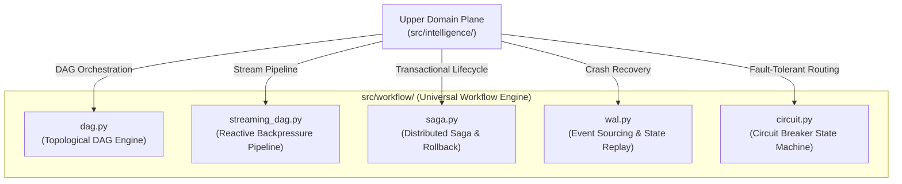
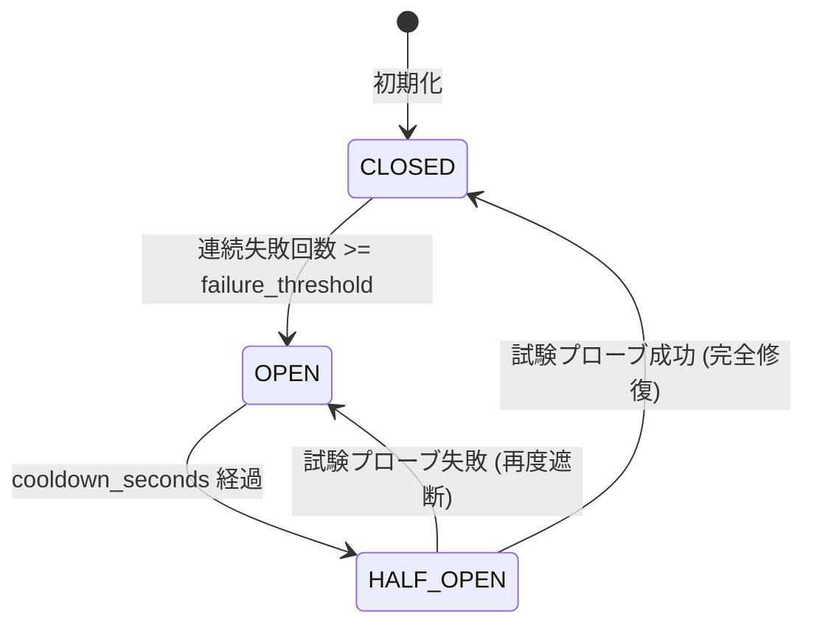

# [DSN-11] 汎用ワークフロー実行基盤（`src/workflow/`）包括的アーキテクチャ設計仕様書

- **文書番号**: `DSN-11`
- **文書ステータス**: `APPROVED`
- **対象サブシステム**: `src/workflow/` (`DAGWorkflowEngine`, `StreamingDAG`, `SagaCoordinator`, `OrchestratorWAL`, `CircuitBreaker`)
- **【主査・報告】 Systems Architect (SA) / Software Quality Assurance Specialist (QA)**
- **【参画】 Project Manager (PM), Database / Data Infrastructure Specialist (DB), Network Specialist (NET), IT Service Manager (OPS)**

---

## 体系目次

- [1. 汎用ワークフロー実行基盤アーキテクチャ](#1-汎用ワークフロー実行基盤アーキテクチャ)
  - [1.1 設計思想とドメイン非依存性（Domain-Agnostic Control Plane）](#11-設計思想とドメイン非依存性domain-agnostic-control-plane)
  - [1.2 主要コンポーネント構成図](#12-主要コンポーネント構成図)
  - [1.3 実行パイプラインのライフサイクル](#13-実行パイプラインのライフサイクル)
- [2. 有向非巡回グラフ（DAG）実行エンジン](#2-有向非巡回グラフdag実行エンジン)
  - [2.1 トポロジカルソートと依存関係解決（Kahn's Algorithm）](#21-トポロジカルソートと依存関係解決kahns-algorithm)
  - [2.2 循環参照検出（Cycle Detection）と安全性保証](#22-循環参照検出cycle-detectionと安全性保証)
  - [2.3 並行タスクスケジューリングとコンテキスト伝搬](#23-並行タスクスケジューリングとコンテキスト伝搬)
- [3. 反応型ストリーミング DAG & バックプレッシャー制御](#3-反応型ストリーミング-dag--バックプレッシャー制御)
  - [3.1 有界キュー（Bounded Queues）とメモリ上限保証](#31-有界キューbounded-queuesとメモリ上限保証)
  - [3.2 バックプレッシャー（Backpressure）適応型スロットリング](#32-バックプレッシャーbackpressure適応型スロットリング)
  - [3.3 バッファ破棄ポリシー（BufferPolicy: BLOCK / DROP_OLDEST / DRAIN）](#33-バッファ破棄ポリシーbufferpolicy-block--drop_oldest--drain)
- [4. 分散トランザクション Saga コーディネーター](#4-分散トランザクション-saga-コーディネーター)
  - [4.1 前方実行（Forward Execution）と状態トラッキング](#41-前方実行forward-executionと状態トラッキング)
  - [4.2 逆順補償ロールバック（Reverse Compensation: LIFO）](#42-逆順補償ロールバックreverse-compensation-lifo)
  - [4.3 冪等性（Idempotency）と障害分離](#43-冪等性idempotencyと障害分離)
- [5. Event Sourcing 型 クラッシュリカバリ WAL (Write-Ahead Log)](#5-event-sourcing-型-クラッシュリカバリ-wal-write-ahead-log)
  - [5.1 追記専用ログ（Append-Only WAL）とアトミック永続化](#51-追記専用ログappend-only-walとアトミック永続化)
  - [5.2 スナップショット・チェックポイント（Snapshot Compaction）](#52-スナップショットチェックポイントsnapshot-compaction)
  - [5.3 状態再生（State Replay Engine）と自律再開プロトコル](#53-状態再生state-replay-engineと自律再開プロトコル)
- [6. サーキットブレーカー & 自己修復ステートマシン](#6-サーキットブレーカー--自己修復ステートマシン)
  - [6.1 三状態遷移モデル（CLOSED / OPEN / HALF_OPEN）](#61-三状態遷移モデルclosed--open--half_open)
  - [6.2 クールダウンと試験プローブ（Canary Probing）](#62-クールダウンと試験プローブcanary-probing)
  - [6.3 ヘルススコア指数移動平均（EMA Health Metric）](#63-ヘルススコア指数移動平均ema-health-metric)
- [7. クラス設計・公開 API インターフェース・プロトコル定義](#7-クラス設計公開-api-インターフェースプロトコル定義)
- [8. 品質ゲート・テスト・ベンチマーク検証仕様](#8-品質ゲートテストベンチマーク検証仕様)

---

# 1. 汎用ワークフロー実行基盤アーキテクチャ

## 1.1 設計思想とドメイン非依存性（Domain-Agnostic Control Plane）
`src/workflow/` は、特定の業務ロジック（セキュリティ論文、PDF抽出、自然言語要約など）に一切依存しない、純粋な**制御プレーン（Control Plane / Execution Runtime）**として設計されます。
本基盤は以下の 4 つの柱をコア設計原則とします：
1. **ゼロ・ドメイン汚染**: ワークフロー基盤のコード内には特定ドメインの語彙を含めず、ジェネリクスおよび抽象プロトコルにより任意のペイロードを搬送可能にする。
2. **決定論的耐障害性**: プロセス強制終了、ネットワーク瞬断、下流ノード過負荷が発生しても、データ消失・ゾンビ状態をゼロにし、自動修復または完全ロールバックを保証する。
3. **有界メモリ保証（Bounded Memory）**: 数万〜数十万件の大規模ストリーム処理時でもメモリ使用量が一定上限内に収まる有界バッファとバックプレッシャー機構を備える。
4. **高信頼な状態復元（Event Sourcing）**: 実行ログを不変の追記イベントとして記録し、任意の時点の状態へリプレイ可能にする。

## 1.2 主要コンポーネント構成図



## 1.3 実行パイプラインのライフサイクル
1. **定義フェーズ**: タスクノード間の依存関係 DAG またはストリーミングノードのパイプラインを定義。
2. **初期化フェーズ**: WAL に `CYCLE_STARTED` イベントを追記し、サーキットブレーカーの初期状態（CLOSED）をロード。
3. **実行フェーズ**: トポロジカル順またはストリームチャンク順にノードを実行。各ノードの開始・完了を WAL にアトミック記録。
4. **異常検知 & 補償フェーズ**: ノード障害時に Saga が逆順補償を実行、またはサーキットブレーカーが OPEN に遷移して代替ルートへ即時バイパス。
5. **完了 & チェックポイントフェーズ**: 全ノード完了時に状態スナップショットを生成し、WAL に `CYCLE_COMPLETED` をコミット。

---

# 2. 有向非巡回グラフ（DAG）実行エンジン

## 2.1 トポロジカルソートと依存関係解決（Kahn's Algorithm）
タスク間の先行・後続関係を表現する DAG（Directed Acyclic Graph）において、Kahn のアルゴリズムを用いてイン degree（入次数）が 0 のノードから順にトポロジカルソート順を決定します。

$$L = \text{TopologicalSort}(G = (V, E))$$

各タスク $u \in V$ の完了出力は共有コンテキスト `context.state` に記録され、後続タスク $v \in \text{children}(u)$ は先行タスクの出力を参照して安全に実行されます。

## 2.2 循環参照検出（Cycle Detection）と安全性保証
有向グラフ内に巡回参照（例: $A \rightarrow B \rightarrow C \rightarrow A$）が存在する場合、Kahn のアルゴリズム終了時に未処理ノード $|V_{processed}| < |V|$ となることを検知し、実行開始前に即座に `ValueError("Cycle detected in workflow graph")` を送出してデッドロックを防止します。

## 2.3 並行タスクスケジューリングとコンテキスト伝搬
依存関係のない並列ノード集合 $S = \{v \in V \mid \text{in-degree}(v) = 0\}$ は、スレッドプールまたは非同期ランナーにより並行実行可能です。各タスクは不変なコンテキストスナップショットを受け取り、スレッドセーフなミューテックスにより状態を集約します。

---

# 3. 反応型ストリーミング DAG & バックプレッシャー制御

## 3.1 有界キュー（Bounded Queues）とメモリ上限保証
大量のデータ項目（論文レコード、生テキスト、バイナリ等）を処理する際、各ノード間に容量 $K$（デフォルト $K = 10$）の有界バッファキュー（Bounded Queue）を配備します。

$$\text{MemoryUsage} \le \sum_{i=1}^{N} K \times \text{MaxChunkSizeBytes}$$

これにより、プロデューサーがコンシューマーよりも極端に速い場合でも Out-Of-Memory (OOM) を完全に回避します。

## 3.2 バックプレッシャー（Backpressure）適応型スロットリング
下流ノードのキュー占有率 $P_i$ をリアルタイム監視し、過負荷時に上流ノードへスロットリング信号（Throttling Signal）を伝搬します。

$$P_i = \frac{|Q_i|}{K_i}$$

- $P_i \ge 0.80$: 上流プロデューサーに動的スリープ / バックオフを要求。
- $P_i < 0.30$: スロットリング解除、通常速度でストリーム再開。

## 3.3 バッファ破棄ポリシー（BufferPolicy）
キュー満杯時の挙動として 3 つのポリシーをサポートします：
1. `BufferPolicy.BLOCK`: キューに空きができるまで上流をブロック（データ完全性最優先）。
2. `BufferPolicy.DROP_OLDEST`: 最も古いチャンクを破棄して最新データを格納（リアルタイム速報優先）。
3. `BufferPolicy.DRAIN`: キュー内データを一括排出し、リカバリバッチへ退避。

---

# 4. 分散トランザクション Saga コーディネーター

## 4.1 前方実行（Forward Execution）と状態トラッキング
複数ステップにまたがる複合処理をアトミックに管理するため、オーケストレーション型 Saga パターンを採用します。
各ステップ $S_i$ は `execute(context)` と `compensate(context)` のペアを実装し、実行履歴スタック $\mathcal{H}$ に順次プッシュされます。

$$\mathcal{H} = [S_1, S_2, \dots, S_k]$$

## 4.2 逆順補償ロールバック（Reverse Compensation: LIFO）
ステップ $S_{k+1}$ で回復不能なエラーが発生した場合、Saga コーディネーターは直ちに前方実行を中断し、実行履歴スタック $\mathcal{H}$ を後入れ先出し（LIFO）順でポップしながら各ステップの `compensate(context)` を呼び出します。

$$\text{Rollback Sequence} = [S_k.\text{compensate}(), S_{k-1}.\text{compensate}(), \dots, S_1.\text{compensate}()]$$

## 4.3 冪等性（Idempotency）と障害分離
各補償関数 `compensate()` は冪等（Idempotent）に設計され、複数回呼び出されても副作用を生じさせません。また、補償中の例外はログ記録され、後続の補償処理の中断を防ぐ障害分離（Fault Isolation）を保証します。

---

# 5. Event Sourcing 型 クラッシュリカバリ WAL (Write-Ahead Log)

## 5.1 追記専用ログ（Append-Only WAL）とアトミック永続化
実行中の全イベント（状態遷移、レコード収集、生産物生成など）は、追記専用ログファイル `outputs/wal/<cycle_id>.wal.jsonl` に JSON Lines 形式で即時 `fsync` 永続化されます。

```json
{"event_id": "ev_01", "cycle_id": "c_1", "timestamp": "2026-08-27T14:00:00Z", "event_type": "cycle_started", "payload": {}}
{"event_id": "ev_02", "cycle_id": "c_1", "timestamp": "2026-08-27T14:00:01Z", "event_type": "phase_started", "payload": {"phase": "planning"}}
{"event_id": "ev_03", "cycle_id": "c_1", "timestamp": "2026-08-27T14:00:02Z", "event_type": "phase_completed", "payload": {"phase": "planning"}}
```

## 5.2 スナップショット・チェックポイント（Snapshot Compaction）
各重要フェーズ完了時、現在の `PhaseContext` の全状態をアトミックに `.checkpoint.json` へスナップショット保存します。これにより、数万行に及ぶイベントログが存在する場合でも、リカバリ時の初期ロード時間をミリ秒単位に短縮（Compaction）します。

## 5.3 状態再生（State Replay Engine）と自律再開プロトコル
システムクラッシュ後の再起動時、`OrchestratorWAL.replay_cycle(cycle_id)` は以下の一連の手順で状態を 100% 復元します：
1. 最新の `.checkpoint.json` が存在すればロードし、ベース状態を復元。
2. チェックポイント作成以降に追記された残余イベントを順次リプレイ適用。
3. 復元された `phase_statuses` を参照し、未完了（PENDING / RUNNING）のフェーズから自動的にパイプラインを再開（Resume）。

---

# 6. サーキットブレーカー & 自己修復ステートマシン

## 6.1 三状態遷移モデル（CLOSED / OPEN / HALF_OPEN）
外部 API や外部クローラーの通信障害に対し、`src/workflow/circuit.py` は以下の 3 状態ステートマシンを駆動します：



1. `CLOSED` (正常稼働): 全リクエストを通常通り実行。
2. `OPEN` (障害遮断): 連続失敗閾値（例: 3回）に達するとトリップ。以降のリクエストは即座に遮断され、代替フォールバックルートへ変異。
3. `HALF_OPEN` (試験プローブ): クールダウン時間（例: 30秒）経過後、1 リクエストのみ試験的に通過。成功すれば `CLOSED` に復帰、失敗すれば再度 `OPEN` に遷移。

## 6.2 クールダウンと試験プローブ（Canary Probing）
`can_execute(current_time)` メソッドは、呼び出し時のタイムスタンプを引数として受け取ることができ、決定論的な時間シミュレーションと単体テストを可能にしています。

## 6.3 ヘルススコア指数移動平均（EMA Health Metric）
各ルートの健全度 $H_t \in [0.0, 1.0]$ は、成功・失敗イベントごとに指数移動平均（EMA: $\alpha = 0.2$）により逐次更新されます：

$$H_t = (1 - \alpha) \cdot H_{t-1} + \alpha \cdot (\text{Success} \ ? \ 1.0 : 0.0)$$

---

# 7. クラス設計・公開 API インターフェース・プロトコル定義

```python
from enum import Enum
from typing import Any, Callable, Dict, Generic, List, Optional, Protocol, TypeVar, runtime_checkable

T = TypeVar("T")

class CircuitState(str, Enum):
    CLOSED = "closed"
    OPEN = "open"
    HALF_OPEN = "half_open"

class CircuitBreaker:
    def __init__(self, failure_threshold: int = 3, cooldown_seconds: float = 30.0) -> None: ...
    def can_execute(self, current_time: Optional[float] = None) -> bool: ...
    def record_success(self) -> None: ...
    def record_failure(self, current_time: Optional[float] = None) -> None: ...

@runtime_checkable
class PhaseProtocol(Protocol):
    def execute(self, context: Any) -> Any: ...
    def compensate(self, context: Any) -> None: ...

class SagaCoordinator:
    def execute_phase_safely(self, phase_executor: PhaseProtocol, context: Any) -> Any: ...

class EventType(str, Enum):
    CYCLE_STARTED = "cycle_started"
    CYCLE_COMPLETED = "cycle_completed"
    CYCLE_FAILED = "cycle_failed"
    PHASE_STARTED = "phase_started"
    PHASE_COMPLETED = "phase_completed"
    CHECKPOINT_CREATED = "checkpoint_created"

class OrchestratorWAL:
    def __init__(self, wal_dir: str) -> None: ...
    def append_event(self, cycle_id: str, event_type: EventType, payload: Optional[Dict[str, Any]] = None) -> Any: ...
    def create_checkpoint(self, context: Any) -> str: ...
    def replay_cycle(self, cycle_id: str, workspace_dir: str) -> Optional[Any]: ...

class DAGWorkflowEngine:
    def add_node(self, task_id: str, handler: Callable[[Dict[str, Any]], Dict[str, Any]], dependencies: Optional[List[str]] = None) -> None: ...
    def execute(self, initial_state: Optional[Dict[str, Any]] = None) -> Dict[str, Any]: ...

class StreamingDAG(Generic[T]):
    def add_node(self, node_id: str, process_fn: Callable[[List[T]], List[T]], max_queue_size: int = 10, policy: Any = None) -> None: ...
    def execute_pipeline(self, initial_chunks: List[Any]) -> List[Any]: ...
```

---

# 8. 品質ゲート・テスト・ベンチマーク検証仕様

| 品質管理ゲート | 検証ツール | 合格基準 |
| :--- | :--- | :--- |
| **静的型検査** | `mypy --strict src/workflow/` | 0 エラー (型定義 100% 網羅) |
| **循環的複雑度** | `xenon --max-absolute B --max-modules B --max-average A` | 全モジュール Rank A/B 適合 |
| **コードスタイル** | `flake8`, `black`, `isort` | 0 リント違反, 100% フォーマット適合 |
| **単体 & 統合テスト** | `pytest tests/workflow/ -v` | 100% PASS (DAG, Streaming, Saga, WAL, Circuit) |
