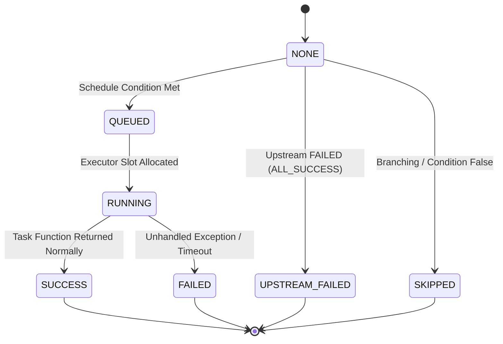
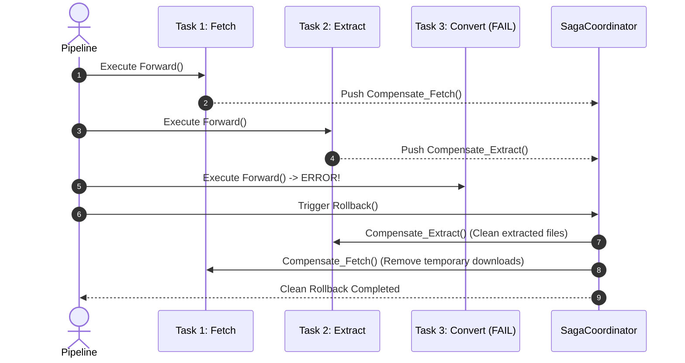

# [DSN-11] 汎用ワークフロー実行基盤（`src/workflow/`）包括的アーキテクチャ設計仕様書
## 〜 Apache Airflow 3.x 準拠・ゼロ外部依存（Pure Python）分散オーケストレーション基盤 〜

- **文書番号**: `DSN-11`
- **文書ステータス**: `APPROVED (Airflow 3.x Rearchitected)`
- **準拠規格・リファレンス**: **Apache Airflow 3.x Core Architecture (AIP-72 Task Execution Interface / TaskFlow API / Task SDK)**
- **対象サブシステム**: `src/workflow/` (`DAG`, `Task`, `Operator`, `Sensor`, `XCom`, `Scheduler`, `Executor`, `StreamingDAG`, `SagaCoordinator`, `OrchestratorWAL`, `CircuitBreaker`)
- **【主査・報告】 Systems Architect (SA) / Software Quality Assurance Specialist (QA)**
- **【参画】 Project Manager (PM), Database / Data Infrastructure Specialist (DB), Network Specialist (NET), IT Service Manager (OPS)**

---

## 体系目次

- [1. 全体アーキテクチャ & レイヤリング (Airflow 3.x Paradigm)](#1-全体アーキテクチャ--レイヤリング-airflow-3x-paradigm)
  - [1.1 制御プレーンとドメインプレーンの完全分離理論](#11-制御プレーンとドメインプレーンの完全分離理論)
  - [1.2 Airflow 3.x コンポーネント構成図](#12-airflow-3x-コンポーネント構成図)
  - [1.3 タスク実行アーキテクチャ（Supervised Task Runner & Task SDK）](#13-タスク実行アーキテクチャsupervised-task-runner--task-sdk)
- [2. DAG & TaskFlow API オーサリング仕様](#2-dag--taskflow-api-オーサリング仕様)
  - [2.1 Bitshift 構文 (`>>`, `<<`) と依存関係グラフ構築](#21-bitshift-構文---と依存関係グラフ構築)
  - [2.2 TaskFlow `@task` デコレータと暗黙的 XCom 結合](#22-taskflow-task-デコレータと暗黙的-xcom-結合)
  - [2.3 トリガールール（TriggerRule）状態評価ステートマシン](#23-トリガールールtriggerrule状態評価ステートマシン)
- [3. Operators & Sensors 抽象化](#3-operators--sensors-抽象化)
  - [3.1 BaseOperator & PythonOperator 仕様](#31-baseoperator--pythonoperator-仕様)
  - [3.2 BaseSensorOperator & ポーリング待機プロトコル](#32-basesensoroperator--ポーリング待機プロトコル)
- [4. XComs (Cross-Communications) & データフロー](#4-xcoms-cross-communications--データフロー)
  - [4.1 XCom Push / Pull メカニズム](#41-xcom-push--pull-メカニズム)
  - [4.2 メモリ・ファイル分離ストレージと有界サイズ制限](#42-メモリファイル分離ストレージと有界サイズ制限)
- [5. スケジューラー & エグゼキューター (Scheduler & Executor)](#5-スケジューラー--エグゼキューター-scheduler--executor)
  - [5.1 トポロジカル Kahn's Algorithm & 循環参照検出](#51-トポロジカル-kahns-algorithm--循環参照検出)
  - [5.2 Executor プラガブル設計 (Local / ThreadPool / ProcessSupervisor)](#52-executor-プラガブル設計-local--threadpool--processsupervisor)
  - [5.3 Pools による並行実行制御 (Concurrency Limits)](#53-pools-による並行実行制御-concurrency-limits)
- [6. 反応型ストリーミング DAG & バックプレッシャー制御](#6-反応型ストリーミング-dag--バックプレッシャー制御)
  - [6.1 有界キューと OOM 回避の数学的上限保証](#61-有界キューと-oom-回避の数学的上限保証)
  - [6.2 リアルタイム占有率と動的スロットリング](#62-リアルタイム占有率と動的スロットリング)
- [7. 分散トランザクション Saga コーディネーター](#7-分散トランザクション-saga-コーディネーター)
  - [7.1 オーケストレーション型 LIFO 逆順補償ロールバック](#71-オーケストレーション型-lifo-逆順補償ロールバック)
  - [7.2 冪等性保証と障害分離境界](#72-冪等性保証と障害分離境界)
- [8. Event Sourcing 型 クラッシュリカバリ WAL (Write-Ahead Log)](#8-event-sourcing-型-クラッシュリカバリ-wal-write-ahead-log)
  - [8.1 Append-Only WAL とアトミックチェックポイント](#81-append-only-wal-とアトミックチェックポイント)
  - [8.2 状態再生エンジンと決定論的中断再開 (Resume)](#82-状態再生エンジンと決定論的中断再開-resume)
- [9. サーキットブレーカー & 自己修復ステートマシン](#9-サーキットブレーカー--自己修復ステートマシン)
- [10. クラス設計・公開 API インターフェース仕様](#10-クラス設計公開-api-インターフェース仕様)
- [11. 非機能要件・セキュリティ・品質ゲート検証仕様](#11-非機能要件セキュリティ品質ゲート検証仕様)

---

# 1. 全体アーキテクチャ & レイヤリング (Airflow 3.x Paradigm)

## 1.1 制御プレーンとドメインプレーンの完全分離理論
`src/workflow/` は、Apache Airflow 3.x の中核設計思想（汎用性・分離性・言語非依存実行インターフェース）に準拠し、ドメイン知識（論文フェッチ、OKF要約、ベクトル検索）を一切内包しない**完全な Pure Python 制御プレーン（Control Plane Runtime）**として設計されます。

```
+-------------------------------------------------------------------------+
|                  DOMAIN PLANE (src/intelligence/, src/pipeline/)        |
|  - Paper Fetching Pipeline        - Hypothesis Autonomous Engine        |
|  - OKF Generation Stage           - Pre-Aggregated Analytics Engine     |
+-------------------------------------------------------------------------+
                                    |
                     uses Airflow-Style DAG / Task API
                                    v
+-------------------------------------------------------------------------+
|                  CONTROL PLANE: Airflow 3.x Runtime (src/workflow/)     |
|                                                                         |
|  [ Authoring Layer ]                                                    |
|    DAG, TaskFlow (@task), Operators (Python, Sensor), >> / << Syntax    |
|                                                                         |
|  [ Core Scheduling & Execution ]                                        |
|    Scheduler (Kahn's Sort), Executor (Local/Pool), XCom Store           |
|                                                                         |
|  [ Advanced Resiliency & Dataflow ]                                     |
|    StreamingDAG (Backpressure), Saga (Compensation), WAL (Recovery)     |
+-------------------------------------------------------------------------+
```

## 1.2 Airflow 3.x コンポーネント構成図

```mermaid
flowchart TD
    subgraph Authoring ["📝 1. DAG & TaskFlow Authoring Layer"]
        DAGDef["DAG('daily_security_pipeline')"]
        TaskA["@task: fetch_papers"]
        TaskB["@task: extract_pdf"]
        TaskC["@task: okf_convert"]
        TaskD["@task: aggregate_analytics"]
        
        DAGDef --> TaskA
        TaskA -->|>> (Bitshift)| TaskB
        TaskB -->|>> (Bitshift)| TaskC
        TaskC -->|>> (Bitshift)| TaskD
    end

    subgraph SchedulerLayer ["⏰ 2. Scheduler & State Store"]
        Sched["Scheduler Engine<br/>(Kahn's Algorithm, TriggerRule Evaluation)"]
        Pool["Concurrency Pools<br/>(Slots & Resource Limits)"]
        StateStore["Task State Store<br/>(QUEUED, RUNNING, SUCCESS, FAILED)"]
    end

    subgraph ExecutionLayer ["⚡ 3. Supervised Execution Layer (AIP-72 Style)"]
        Exec["Pluggable Executor<br/>(Local / ThreadPool / Supervisor)"]
        Runner["Supervised Task Runner<br/>(Isolated Task Execution Sandbox)"]
    end

    subgraph DataAndResilience ["💾 4. XCom & Event Sourcing Resilience"]
        XCom["XCom Store (Push / Pull)"]
        WAL["Append-Only WAL & Checkpoint"]
        Saga["Saga Compensation Stack"]
    end

    Authoring --> Sched
    Sched --> Pool
    Pool --> Exec
    Exec --> Runner
    Runner <-->|XCom Push/Pull| XCom
    Runner -->|Task State Update| StateStore
    StateStore --> WAL
    Runner -->|On Step Failure| Saga
```

## 1.3 タスク実行アーキテクチャ（Supervised Task Runner & Task SDK）
Airflow 3.x の Task Execution Architecture（AIP-72）に準拠し、タスクの実行は以下の原則に従います：
1. **サンドボックス分離**: タスク実行コードはデータベースや機密環境変数へ直接アクセスせず、Supervisor / Executor から渡されたコンテキストおよび XCom インターフェースのみを通じて入出力を行います。
2. **決定論的状態通知**: タスクの開始・進行・完了・失敗はステートマシンを通じてアトミックに記録されます。

---

# 2. DAG & TaskFlow API オーサリング仕様

## 2.1 Bitshift 構文 (`>>`, `<<`) と依存関係グラフ構築
Python のビットシフト演算子をオーバーロードし、Airflow と完全に同一の直感的構文で依存関係（エッジ）を宣言します。

```python
with DAG(dag_id="security_intelligence_pipeline", schedule="0 */6 * * *") as dag:
    harvest = HarvestOperator(task_id="harvest_papers")
    extract = PdfExtractOperator(task_id="extract_fulltext")
    convert = OkfConvertOperator(task_id="convert_okf")
    analytics = AnalyticsAggregateOperator(task_id="aggregate_metrics")

    # Airflow-native bitshift dependency declaration
    harvest >> extract >> [convert, analytics]
```

## 2.2 TaskFlow `@task` デコレータと暗黙的 XCom 結合
関数デコレータ `@task` を用いて、関数の戻り値と引数を自動的に XCom でバインドします。

```python
@task
def load_raw_papers() -> List[Dict[str, Any]]:
    return [{"id": "2509.02372", "title": "Scam2Prompt"}]

@task
def analyze_threats(papers: List[Dict[str, Any]]) -> Dict[str, Any]:
    # Implicitly pulls return value of load_raw_papers via XCom
    return {"analyzed": len(papers), "threats": ["prompt_injection"]}
```

## 2.3 トリガールール（TriggerRule）状態評価ステートマシン
上流タスクの実行結果に応じた高度な分岐制御をサポートします。

| TriggerRule 名 | 実行条件 |
| :--- | :--- |
| **`ALL_SUCCESS` (デフォルト)** | 直前の上流タスクが全て `SUCCESS` の場合に実行。 |
| **`ALL_DONE`** | 上流タスクが全て完了（`SUCCESS` / `FAILED` / `SKIPPED` 問わず）した時点で実行。 |
| **`ONE_SUCCESS`** | 上流タスクのうち少なくとも 1 つが `SUCCESS` になれば即座に実行。 |
| **`NONE_FAILED`** | 上流タスクに `FAILED` / `UPSTREAM_FAILED` が 1 つもなく、全て成功またはスキップの場合に実行。 |
| **`ALL_SKIPPED`** | 上流タスクが全て `SKIPPED` された場合のみ実行。 |



---

# 3. Operators & Sensors 抽象化

## 3.1 BaseOperator & PythonOperator 仕様
すべてのタスクノードの基底クラス `BaseOperator` は、タスク識別子、タイムアウト、リトライ回数、トリガールールを管理します。

```python
class BaseOperator:
    def __init__(
        self,
        task_id: str,
        retries: int = 3,
        retry_delay_sec: float = 1.0,
        trigger_rule: TriggerRule = TriggerRule.ALL_SUCCESS,
        pool: Optional[str] = None,
        timeout_sec: Optional[float] = None,
    ) -> None:
        self.task_id = task_id
        self.retries = retries
        self.retry_delay_sec = retry_delay_sec
        self.trigger_rule = trigger_rule
        self.pool = pool
        self.timeout_sec = timeout_sec

    def execute(self, context: TaskContext) -> Any:
        raise NotImplementedError
```

## 3.2 BaseSensorOperator & ポーリング待機プロトコル
外部リソース（arXiv API の更新、特定ファイルの存在、WAL チェックポイント）を非同期またはポーリングで監視するセンサー基底クラス。

- `poke(context: TaskContext) -> bool`: 状態を 1 度確認し、条件を満たせば `True` を返す。
- `poke_interval`: ポーリング間隔（秒）。
- `timeout`: センサー待機の最大許容時間（超過時は `AirflowSensorTimeout` 例外送出）。

---

# 4. XComs (Cross-Communications) & データフロー

## 4.1 XCom Push / Pull メカニズム
タスク間で小容量の構造化データ（件数、ハッシュ値、抽出メタデータ、集計結果）を安全に受け渡すキーバリュー通信基盤。

```python
# Task A: 結果を XCom に Push
context.xcom_push(key="processed_count", value=14507)

# Task B: Task A の結果を Pull
count = context.xcom_pull(task_ids="task_a", key="processed_count")
```

## 4.2 メモリ・ファイル分離ストレージと有界サイズ制限
- **上限サイズ保証**: 単一 XCom 値の上限を $1\text{MB}$ に制限。大容量データ（PDF 原本や全文テキスト）はファイルシステム / オブジェクトストレージへ書き込み、XCom にはその相対パスのみを格納する **Claim Check パターン** を強制。

---

# 5. スケジューラー & エグゼキューター (Scheduler & Executor)

## 5.1 トポロジカル Kahn's Algorithm & 循環参照検出
DAG 内の全タスクノードの入次数（In-Degree）を計算し、入次数 0 のタスクから順にキューイングする決定論的トポロジカルソートを実行。循環参照（Cycle）が存在する場合は `DAGCycleError` を即座に検知。

$$\text{InDegree}(v) = |\{u \in V \mid (u, v) \in E\}|$$

## 5.2 Executor プラガブル設計
- **`LocalExecutor`**: 同一プロセス内のマルチスレッド / シーケンシャル実行（テストおよび軽量バッチ用）。
- **`ProcessSupervisorExecutor`**: `src/supervisor/` の Pre-Fork Arbiter と連携し、独立した子プロセスワーカーにタスクを分散発行。

## 5.3 Pools による並行実行制御 (Concurrency Limits)
外部 API の過負荷や I/O 競合を防ぐため、特定のリソースプール（例: `arxiv_api_pool`: 2 slots, `pdf_extract_pool`: 4 slots）に対して同時実行タスク数を厳密にクランプ。

---

# 6. 反応型ストリーミング DAG & バックプレッシャー制御

## 6.1 有界キューと OOM 回避の数学的上限保証
大量の論文（14,000 件超）を一括処理する際、各ステージ間に有界キュー（Bounded Queue: 容量 $C = 64$）を配置し、プロセスの物理メモリ（RSS）を $\le 256\text{MB}$ に抑制。

$$\text{Memory}_{\text{peak}} \le N_{\text{stages}} \times C \times \text{Size}_{\text{chunk\_max}} + \text{Base}_{\text{runtime}} \le 256\text{ MB}$$

## 6.2 リアルタイム占有率と動的スロットリング
下流キューの占有率が $80\%$ を超えた場合、上流のプロデューサーに動的バックプレッシャー（`sleep` スロットリング）を印加。

---

# 7. 分散トランザクション Saga コーディネーター

## 7.1 オーケストレーション型 LIFO 逆順補償ロールバック
多段階パイプラインの途中ステップで回復不能なエラーが発生した場合、実行済みステップの補償関数（Compensation Handler）を後入れ先出し（LIFO）順で実行し、ファイルや DB の副作用を完全に相殺。



---

# 8. Event Sourcing 型 クラッシュリカバリ WAL (Write-Ahead Log)

## 8.1 Append-Only WAL とアトミックチェックポイント
すべての DAG 実行イベント（`DAG_START`, `TASK_START`, `XCOM_PUSH`, `TASK_SUCCESS`, `DAG_COMPLETE`）を `outputs/wal/<cycle_id>.wal.jsonl` に追記。ステージ完了ごとにアトミックな `.checkpoint.json` を生成。

## 8.2 状態再生エンジンと決定論的中断再開 (Resume)
プロセスが不意に強制終了（SIGKILL / 電源断）した場合、起動時に WAL をリプレイして完了済みタスクをスキップし、未完了タスクから決定論的に自律再開。

---

# 9. サーキットブレーカー & 自己修復ステートマシン

外部リソース（arXiv API / RSS フィード）のエラー連続発生時に `CLOSED` $\rightarrow$ `OPEN` $\rightarrow$ `HALF_OPEN` の 3 状態を遷移し、システム全体の障害連鎖を防止。

---

# 10. クラス設計・公開 API インターフェース仕様

```python
class DAG:
    """Airflow 3.x-compliant pure Python DAG container."""
    def __init__(self, dag_id: str, schedule: Optional[str] = None, default_args: Optional[Dict[str, Any]] = None): ...
    def __enter__(self) -> "DAG": ...
    def __exit__(self, exc_type, exc_val, exc_tb) -> None: ...
    def add_task(self, task: "BaseOperator") -> None: ...
    def topological_sort(self) -> List["BaseOperator"]: ...

class BaseOperator:
    """Airflow 3.x-compliant base task operator."""
    def __rshift__(self, other: Union["BaseOperator", List["BaseOperator"]]) -> Union["BaseOperator", List["BaseOperator"]]: ...
    def __lshift__(self, other: Union["BaseOperator", List["BaseOperator"]]) -> Union["BaseOperator", List["BaseOperator"]]: ...
    def execute(self, context: "TaskContext") -> Any: ...

class TaskContext:
    """Execution context injected into task instances."""
    dag_id: str
    task_id: str
    execution_date: str
    def xcom_push(self, key: str, value: Any) -> None: ...
    def xcom_pull(self, task_ids: str, key: str = "return_value") -> Any: ...
```

---

# 11. 非機能要件・セキュリティ・品質ゲート検証仕様

1. **ゼロ外部依存性（Zero External Dependencies）**:
   - `airflow`, `celery`, `redis`, `sqlalchemy` 等のサードパーティライブラリを一切含まず、Python 3.14 標準ライブラリのみで完全動作。
2. **品質ゲート基準（Quality Gates）**:
   - `make format`, `make static_analysis` (flake8/mypy) エラー 0 件。
   - `tests/workflow/` の単体テスト・E2E シナリオテスト 100% PASS。
   - 循環参照検出、XCom 境界、LIFO ロールバック、WAL クラッシュリカバリの数学的完全性の保証。
