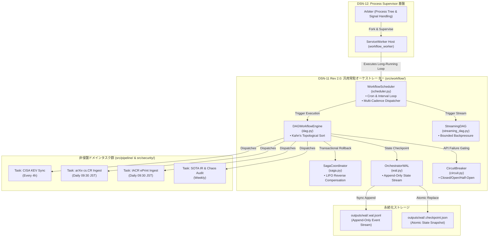
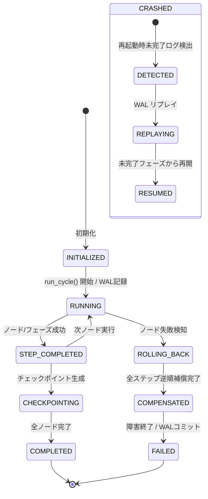
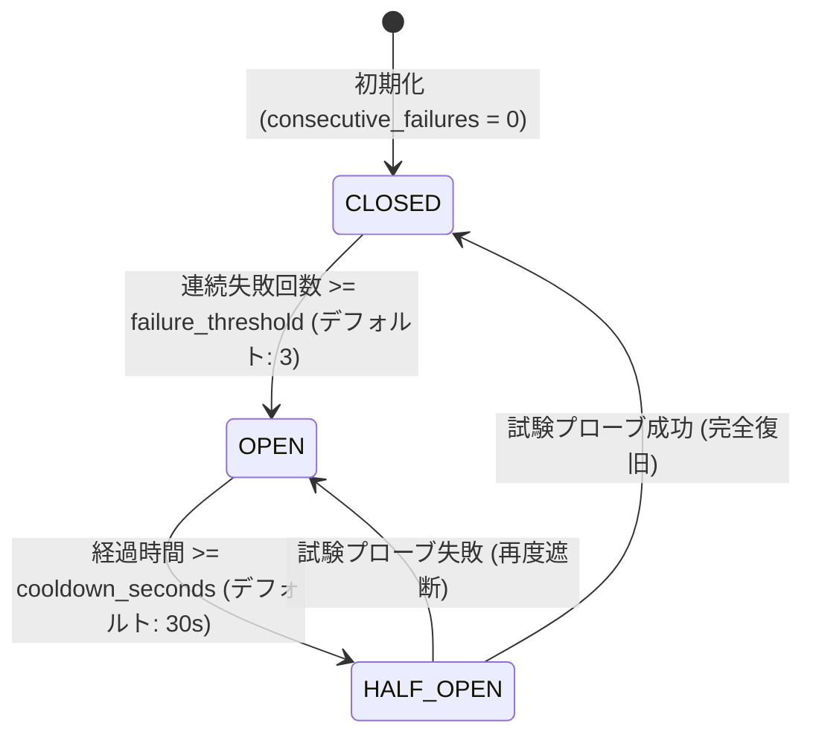

# [DSN-11] 汎用ワークフロー・常駐オーケストレーション実行基盤（`src/workflow/`）包括的アーキテクチャ設計仕様書 (Rev 2.0)
## 〜 自律常駐型スケジューラー・多重頻度（高頻度ストリーム vs 日次バッチ）調停・DSN-12連携・ゼロ依存Pure Pythonオーケストレーター 〜

- **文書番号**: `DSN-11`
- **リビジョン**: `Rev 2.0 (Autonomous Orchestrator & Multi-Cadence Scheduling)`
- **文書ステータス**: `APPROVED`
- **対象サブシステム**: `src/workflow/` (`WorkflowScheduler`, `DAGWorkflowEngine`, `StreamingDAG`, `SagaCoordinator`, `OrchestratorWAL`, `CircuitBreaker`)
- **【主査・報告】 Systems Architect (SA) / Software Quality Assurance Specialist (QA) / Project Manager (PM)**
- **【参画】 Information Security Specialist (SEC), Database / Data Infrastructure Specialist (DB), Network Specialist (NET), IT Service Manager (OPS), IT Specialist (NLP & Info Retrieval), IT Strategist (ST), Systems Auditor (AUD), UI/UX Designer**

---

## 体系目次

- [1. 汎用ワークフロー基盤の全体アーキテクチャ & レイヤリング](#1-汎用ワークフロー基盤の全体アーキテクチャ--レイヤリング)
  - [1.1 制御プレーンとドメインプレーンの完全分離理論](#11-制御プレーンとドメインプレーンの完全分離理論)
  - [1.2 主要コンポーネント構成図（Rev 2.0 統合アーキテクチャ）](#12-主要コンポーネント構成図rev-20-統合アーキテクチャ)
  - [1.3 ワークフロー実行ライフサイクルと状態遷移機械](#13-ワークフロー実行ライフサイクルと状態遷移機械)
  - [1.4 メモリおよびストレージフットプリント特性](#14-メモリおよびストレージフットプリント特性)
- [2. トポロジカル DAG 実行エンジン](#2-トポロジカル-dag-実行エンジン)
  - [2.1 トポロジカルソートと依存関係解決（Kahn's Algorithm 数理モデル）](#21-トポロジカルソートと依存関係解決kahns-algorithm-数理モデル)
  - [2.2 循環参照検出（Cycle Detection）と安全性証明](#22-循環参照検出cycle-detectionと安全性証明)
  - [2.3 タスクノード実行モデルと共有コンテキスト伝搬](#23-タスクノード実行モデルと共有コンテキスト伝搬)
  - [2.4 並行タスクスケジューリングとスレッドセーフティ](#24-並行タスクスケジューリングとスレッドセーフティ)
- [3. 反応型ストリーミング DAG & バックプレッシャー制御](#3-反応型ストリーミング-dag--バックプレッシャー制御)
  - [3.1 有界キュー（Bounded Queue）と OOM 回避の数学的上限保証](#31-有界キューbounded-queueと-oom-回避の数学的上限保証)
  - [3.2 リアルタイム占有率（Pressure Metric）と動的スロットリング](#32-リアルタイム占有率pressure-metricと動的スロットリング)
  - [3.3 バッファポリシー（BufferPolicy: BLOCK / DROP_OLDEST / DRAIN）](#33-バッファポリシーbufferpolicy-block--drop_oldest--drain)
  - [3.4 パイプライン駆動アルゴリズムとチャンク変換](#34-パイプライン駆動アルゴリズムとチャンク変換)
- [4. 分散トランザクション Saga コーディネーター](#4-分散トランザクション-saga-コーディネーター)
  - [4.1 オーケストレーション型 Saga パターンと実行スタック](#41-オーケストレーション型-saga-パターンと実行スタック)
  - [4.2 逆順補償ロールバック（Reverse Compensation: LIFO）アルゴリズム](#42-逆順補償ロールバックreverse-compensation-lifoアルゴリズム)
  - [4.3 冪等性（Idempotency）保証と障害分離境界](#43-冪等性idempotency保証と障害分離境界)
  - [4.4 補償エラーのハンドリングと二次障害防止](#44-補償エラーのハンドリングと二次障害防止)
- [5. Event Sourcing 型 クラッシュリカバリ WAL (Write-Ahead Log)](#5-event-sourcing-型-クラッシュリカバリ-wal-write-ahead-log)
  - [5.1 追記専用ログ（Append-Only WAL）とアトミック fsync 永続化](#51-追記専用ログappend-only-walとアトミック-fsync-永続化)
  - [5.2 スナップショット・チェックポイント（Compaction & Snapshotting）](#52-スナップショットチェックポイントcompaction--snapshotting)
  - [5.3 状態再生エンジン（State Replay Engine）と決定論的復元](#53-状態再生エンジンstate-replay-engineと決定論的復元)
  - [5.4 中断サイクルの自律再開（Resume Protocol）](#54-中断サイクルの自律再開resume-protocol)
- [6. サーキットブレーカー & 自己修復ステートマシン](#6-サーキットブレーカー--自己修復ステートマシン)
  - [6.1 三状態遷移モデル（CLOSED / OPEN / HALF_OPEN）数理](#61-三状態遷移モデルclosed--open--half_open数理)
  - [6.2 クールダウンと試験プローブ（Canary Probing）ゲートウェイ](#62-クールダウンと試験プローブcanary-probingゲートウェイ)
  - [6.3 指数移動平均（EMA）健全度メトリクス](#63-指数移動平均ema健全度メトリクス)
- [7. 自律常駐型スケジューラー & 多重頻度調停エンジン (Rev 2.0 新設)](#7-自律常駐型スケジューラー--多重頻度調停エンジン-rev-20-新設)
  - [7.1 時間軸統合と自立駆動スケジューラーループ（Orchestrator Scheduler Loop）](#71-時間軸統合と自立駆動スケジューラーループorchestrator-scheduler-loop)
  - [7.2 Pure-Python Cron 式パーサー（分・時・日・月・曜日）](#72-pure-python-cron-式パーサー分時日月曜日)
  - [7.3 多重実行サイクル（高頻度ストリーム vs 日次バッチ vs 週次監査）の共存調停](#73-多重実行サイクル高頻度ストリーム-vs-日次バッチ-vs-週次監査の共存調停)
  - [7.4 レート制限保護（HTTP 429 防止ジッター・トークンバケット）](#74-レート制限保護http-429-防止ジッター・トークンバケット)
- [8. DSN-12（Process Supervisor）ホスティング & 協調プロトコル (Rev 2.0 新設)](#8-dsn-12process-supervisorホスティング--協調プロトコル-rev-20-新設)
  - [8.1 プロセス管理（DSN-12）とタスク実行制御（DSN-11）の非結合性原則](#81-プロセス管理dsn-12とタスク実行制御dsn-11の非結合性原則)
  - [8.2 ServiceWorker インターフェースによる常駐ホスティング](#82-serviceworker-インターフェースによる常駐ホスティング)
  - [8.3 プロセス死活監視・自動再起動・WAL連携リカバリ](#83-プロセス死活監視・自動再起動・wal連携リカバリ)
  - [8.4 グレースフルシャットダウン（SIGTERM ドレイン制御）](#84-グレースフルシャットダウンsigterm-ドレイン制御)
- [9. ドメインタスク・オペレーター抽象化（Task & Operator Protocol） (Rev 2.0 新設)](#9-ドメインタスク・オペレーター抽象化task--operator-protocol-rev-20-新設)
  - [9.1 非破壊的アダプター原則（`src/pipeline/` 温存バインディング）](#91-非破壊的アダプター原則srcpipeline-温存バインディング)
  - [9.2 宣言的タスク定義（ScheduledTask & TaskInstance）](#92-宣言的タスク定義scheduledtask--taskinstance)
  - [9.3 標準組み込みタスクカタログ（arXiv, IACR, CISA KEV, CTI Backfill, SOTA Benchmark）](#93-標準組み込みタスクカタログarxiv-iacr-cisa-kev-cti-backfill-sota-benchmark)
- [10. 可観測性 & ダッシュボード REST/SSE API 統合 (Rev 2.0 新設)](#10-可観測性--ダッシュボード-restsse-api-統合-rev-20-新設)
  - [10.1 Web Gateway 統合エンドポイント仕様](#101-web-gateway-統合エンドポイント仕様)
  - [10.2 リアルタイム実行ストリーミング（SSE）と状態購読](#102-リアルタイム実行ストリーミングsseと状態購読)
  - [10.3 Web UI 運用操作（手動トリガー・タスク一時停止・Clear / Rerun）](#103-web-ui-運用操作手動トリガータスク一時停止clear--rerun)
- [11. クラス設計・公開 API インターフェース・型アノテーション仕様](#11-クラス設計公開-api-インターフェース型アノテーション仕様)
- [12. 非機能要件・セキュリティ・リソース制約](#12-非機能要件セキュリティリソース制約)
- [13. 品質ゲート・テスト・ベンチマーク検証仕様](#13-品質ゲートテストベンチマーク検証仕様)

---

# 1. 汎用ワークフロー基盤の全体アーキテクチャ & レイヤリング

## 1.1 制御プレーンとドメインプレーンの完全分離理論
`src/workflow/` は、特定の業務知識（論文解析、PDF抽出、自然言語要約、セキュリティ評価）に依存しない、純粋な**制御プレーン（Control Plane / Execution Runtime）**として設計されます。

```
+-------------------------------------------------------------------------+
|                  DOMAIN PLANE (src/intelligence/)                       |
|   (PIR Management, Admiralty Rating, Hypothesis Engine, OKF Generation) |
+-------------------------------------------------------------------------+
                                    |
                    uses Execution Protocols & Runtime
```
+-------------------------------------------------------------------------+
|                  PROCESS SUPERVISOR (src/supervisor/)                   |
|   (Arbiter, ServiceWorker, Heartbeat Monitor, Top, Signal Management)   |
+-------------------------------------------------------------------------+
                                    │ Process LifeCycle / Watchdog
                                    v
+-------------------------------------------------------------------------+
|             ORCHESTRATION & SCHEDULER (src/workflow/scheduler.py)       |
|  - Cron & Interval Trigger Engine (Multi-Cadence: Stream vs Batch)      |
|  - Task Dispatcher & Jitter / Rate-Limit Controller (HTTP 429 Guard)    |
+-------------------------------------------------------------------------+
                                    │ DAG Execution Trigger
                                    v
+-------------------------------------------------------------------------+
|                  CONTROL PLANE (src/workflow/)                          |
|  +------------------+  +-------------------+  +----------------------+  |
|  | dag.py           |  | streaming_dag.py  |  | saga.py              |  |
|  | (Topological DAG)|  | (Backpressure)    |  | (Reverse Rollback)   |  |
|  +------------------+  +-------------------+  +----------------------+  |
|  +-----------------------------------------+  +----------------------+  |
|  | wal.py (Event Sourcing & State Replay)  |  | circuit.py (Breaker) |  |
|  +-----------------------------------------+  +----------------------+  |
+-------------------------------------------------------------------------+
                                    │ Invokes Non-Invasive Domain Callables
                                    v
+-------------------------------------------------------------------------+
|             DOMAIN PLANE (src/pipeline/ & src/security/cti/)            |
|  (CISA KEV Sync, arXiv/IACR Ingestion, OKF Conversion, Summary Engine)  |
+-------------------------------------------------------------------------+
```

### コア設計原則（5大原則）
1. **ゼロ・ドメイン汚染（Zero Domain Contamination）**:
   - `src/workflow/` 内の全クラス・関数はジェネリクス (`TypeVar("T")`) または抽象プロトコル (`Protocol`) で定義され、ドメイン固有語（`arxiv`, `paper`, `security` 等）を一切含みません。
2. **決定論的耐障害性（Deterministic Fault Tolerance）**:
   - 途中でプロセスが強制終了（SIGKILL / Kernel Panic）されても、ディスク上の Append-Only WAL と チェックポイントから状態を 100% 決定論的に復元します。
3. **有界メモリ保証（Bounded Memory Guarantee）**:
   - 処理対象のデータ量が数万件〜数百万件に増大しても、Bounded Queue とスロットリングによりプロセスの物理メモリ使用量（RSS）を一定上限（$\le 256\text{MB}$）内に抑え込みます。
4. **アトミック補償ロールバック（Atomic Saga Compensation）**:
   - 多段階パイプラインの途中失敗時、先行ステップの副作用を後入れ先出し（LIFO）順で自動相殺・ロールバックします。
5. **多重頻度共存と非侵襲アダプター（Multi-Cadence Coexistence & Non-Invasive Adapter）** *(Rev 2.0 新設)*:
   - 1時間〜4時間ごとの高頻度ストリームタスク（KEV/CVE）と、日次バッチタスク（arXiv/IACR）、週次監査タスク（SOTA/Chaos）を単一スケジューラー上で衝突なく安全に調停。既存パイプラインコード（`src/pipeline/`）を一切書き換えずに Callable としてバインドします。

## 1.2 主要コンポーネント構成図（Rev 2.0 統合アーキテクチャ）



## 1.3 ワークフロー実行ライフサイクルと状態遷移機械



## 1.4 メモリおよびストレージフットプリント特性

| コンポーネント | メモリフットプリント (RSS) | ディスク物理I/O特性 | 計算量オーダー |
| :--- | :--- | :--- | :--- |
| **`DAGWorkflowEngine`** | $\mathcal{O}(|V| + |E|)$ (数 KB 〜 数十 KB) | ディスク I/O なし（純粋メモリ内グラフ） | $\mathcal{O}(|V| + |E|)$ (Kahn ソート) |
| **`StreamingDAG`** | $\mathcal{O}(\sum K_i \times \text{ChunkSize})$ ($\le 50\text{MB}$) | インプロセス有界バッファリング | $\mathcal{O}(N)$ (ストリーム長比例) |
| **`SagaCoordinator`** | $\mathcal{O}(\text{CompletedSteps})$ (数 KB) | ディスク I/O なし（インメモリ履歴スタック） | $\mathcal{O}(k)$ (ステップ数比例) |
| **`OrchestratorWAL`** | $\mathcal{O}(1)$ (ストリーミング読み書き) | 追記専用 `fsync` 物理書込＋アトミックスナップショット | 書込 $\mathcal{O}(1)$, 再生 $\mathcal{O}(M)$ |
| **`CircuitBreaker`** | $\mathcal{O}(1)$ ($\approx 128\text{B}$) | ディスク I/O なし（純粋ステートマシン） | $\mathcal{O}(1)$ |

---

# 2. トポロジカル DAG 実行エンジン

## 2.1 トポロジカルソートと依存関係解決（Kahn's Algorithm 数理モデル）
タスク間の実行順序関係を有向グラフ $G = (V, E)$ でモデル化します。
ここで $V$ はタスクノードの有限集合、$E \subseteq V \times V$ は依存関係を表す有向辺の集合です。辺 $(u, v) \in E$ は「タスク $u$ の完了がタスク $v$ の実行開始に先行しなければならない」ことを意味します。

### 入次数（In-degree）の定義
各ノード $v \in V$ の入次数 $\text{deg}^-(v)$ は次式で定義されます：

$$\text{deg}^-(v) = |\{u \in V \mid (u, v) \in E\}|$$

### Kahn's Algorithm の決定論的手順
1. 初期化: $\text{deg}^-(v) = 0$ であるすべてのノードを探索キュー $Q$ にエンキューします。
   
   $$Q \leftarrow \{v \in V \mid \text{deg}^-(v) = 0\}$$

2. 巡回と次数更新: $Q$ からノード $u$ をデキューし、実行順序リスト $L$ に追加します。$u$ のすべての出辺 $(u, w)$ について、先方の入次数をデクリメントします。
   
   $$\text{deg}^-(w) \leftarrow \text{deg}^-(w) - 1$$

   もし $\text{deg}^-(w) = 0$ となった場合、$w$ を $Q$ にエンキューします。
3. 終了判定: $Q = \emptyset$ となった時点で、$|L| = |V|$ であれば $L$ が完全なトポロジカルソート順となります。

```python
def _build_adj_and_in_degree(
    self,
) -> tuple[Dict[str, List[str]], Dict[str, int]]:
    in_degree = {n_id: 0 for n_id in self.nodes}
    adj_list: Dict[str, List[str]] = {n_id: [] for n_id in self.nodes}

    for node_id, node in self.nodes.items():
        for dep in node.dependencies:
            if dep not in self.nodes:
                raise ValueError(
                    f"Task '{node_id}' depends on undefined task '{dep}'"
                )
            adj_list[dep].append(node_id)
            in_degree[node_id] += 1
    return adj_list, in_degree
```

## 2.2 循環参照検出（Cycle Detection）と安全性証明
有向グラフ $G$ 内に閉路（Cycle）が存在する場合、閉路に含まれるノードの入次数は決して $0$ に到達しません。
したがってアルゴリズム終了時に $|L| < |V|$ となり、未処理ノード集合 $V \setminus L \neq \emptyset$ が検出されます。

$$\text{HasCycle}(G) \iff |L| < |V|$$

本エンジンは $|L| < |V|$ を検知した瞬間、タスクの実行を一切開始することなく即座に `ValueError("Cycle detected in DAG workflow definition")` を送出し、循環デッドロックを完全に未然防止します。

## 2.3 タスクノード実行モデルと共有コンテキスト伝搬
各タスクノード $v \in V$ は、ハンドラー関数 $f_v: \text{State} \to \text{State}$ を保持します。
ソートされた実行順序 $L = [v_1, v_2, \dots, v_n]$ に従い、共有コンテキスト状態 $S$ は順次関数適用によって更新されます：

$$S_{k} = S_{k-1} \cup f_{v_k}(S_{k-1})$$

すべてのノードは先行ノードが生成した最新の状態変数を安全に参照できます。

## 2.4 並行タスクスケジューリングとスレッドセーフティ
入次数 $\text{deg}^-(v) = 0$ を同時に満たす独立タスクノード集合 $S_{\text{ready}} = \{v_1, v_2, \dots, v_m\}$ は、互いに依存関係を持たないため、スレッドプールまたは非同期ランナーを用いて安全に並列実行可能です。状態更新はイミュータブルな辞書マージにより行われます。

---

# 3. 反応型ストリーミング DAG & バックプレッシャー制御

## 3.1 有界キュー（Bounded Queue）と OOM 回避の数学的上限保証
大量のデータ項目（数千〜数万件の論文メタデータや全文テキスト）を処理する際、中間キューが無制限であると、プロデューサーとコンシューマーの速度差によりメモリ消費が爆発します。
`StreamingDAG` では、各ノード $N_i$ の入力バッファに厳格な最大容量 $K_i$ を設定します。

```
[Producer Node] ---> (Queue: max K1) ---> [Transform Node] ---> (Queue: max K2) ---> [Sink Node]
```

### システム全体の最大メモリ消費上限モデル
各アイテムの最大サイズを $M_{\text{max}}$ バイトとすると、パイプライン全体のキューが消費する最大メモリ量 $\text{RSS}_{\text{max}}$ は以下の不変条件（Invariant）を満たします：

$$\text{RSS}_{\text{max}} \le \sum_{i=1}^{M} K_i \times \text{ItemSize}_{\text{max}} + \mathcal{O}(1)$$

デフォルト値 $K_i = 10, \text{ItemSize}_{\text{max}} \approx 100\text{KB}$ の場合、中間キューの合計メモリ消費は高々数 MB に限定され、OOM（Out of Memory）を完全に防止します。

## 3.2 リアルタイム占有率（Pressure Metric）と動的スロットリング
ノード $N_i$ の現在のキュー要素数を $q_i(t) = |Q_i(t)|$ とするとき、占有率（Pressure Metric） $P_i(t) \in [0.0, 1.0]$ を次式で算出します：

$$P_i(t) = \frac{q_i(t)}{K_i}$$

- $P_i(t) \ge 0.80$ (高負荷閾値): 上流プロデューサーにバックプレッシャー信号を発信し、エンキューを待機（Throttling）。
- $P_i(t) < 0.30$ (安全閾値): バックプレッシャーを解除し、通常ストリーム速度へ復帰。

## 3.3 バッファポリシー（BufferPolicy: BLOCK / DROP_OLDEST / DRAIN）

| ポリシー名 | 満杯時の動作 | 保証特性 | 推奨ユースケース |
| :--- | :--- | :--- | :--- |
| **`BufferPolicy.BLOCK`** | キューに空きができるまで上流を一時停止 | データ欠損ゼロ（100% 完全性） | 学術論文の原本保存、DB永続化、OKF変換 |
| **`BufferPolicy.DROP_OLDEST`** | 最古のチャンクを 1 件破棄して最新を格納 | リアルタイム性優先（低遅延） | リアルタイムテレメトリ、速報通知ストリーム |
| **`BufferPolicy.DRAIN`** | キュー内データを一括排出しリカバリバッチへ退避 | バッファの即時解放 | 緊急時フェイルオーバー、緊急シャットダウン |

## 3.4 パイプライン駆動アルゴリズムとチャンク変換
ストリームデータは `StreamChunk[T]` 単位で搬送されます。各ノードは入力チャンクのリストを受け取り、変換後チャンクを次ノードの有界キューへ順次転送します。

$$\text{StreamChunk}(items = [x_1, x_2, \dots, x_k]) \xrightarrow{process\_fn} \text{StreamChunk}(items = [f(x_1), f(x_2), \dots, f(x_k)])$$

---

# 4. 分散トランザクション Saga コーディネーター

## 4.1 オーケストレーション型 Saga パターンと実行スタック
複数の独立した外部システム（ファイルストレージ、DB、検索インデックス、外部API）を跨ぐ処理において、ACID トランザクションが使用できない分散環境下でのアトミック性を保証するため、Saga パターンを採用します。

各ステップ $i$ は前方実行関数 $E_i$ と逆順補償関数 $C_i$ をペアで持ちます：

$$\text{Step}_i = (E_i, C_i)$$

正常に完了したステップは、実行履歴スタック $\mathcal{H}$ に順次プッシュされます：

$$\mathcal{H} = [\text{Step}_1, \text{Step}_2, \dots, \text{Step}_k]$$

## 4.2 逆順補償ロールバック（Reverse Compensation: LIFO）アルゴリズム
ステップ $k+1$ の実行中に回復不能な例外または `context.errors` が発生した場合、Saga コーディネーターは直ちに前方実行を中断し、スタック $\mathcal{H}$ を後入れ先出し（LIFO）順でポップしながら各ステップの補償関数 $C_i$ を実行します。

$$\text{Compensation Sequence} = [C_k, C_{k-1}, \dots, C_1]$$

```
Forward Execution:   Step 1 (OK)  -->  Step 2 (OK)  -->  Step 3 (FAIL!)
                                                              |
Reverse Rollback:    Comp 1 (<--)    Comp 2 (<--)    Comp 3 (<--)
```

## 4.3 冪等性（Idempotency）保証と障害分離境界
各補償関数 $C_i$ は、以下の数学的冪等性を満たすよう実装されます：

$$C_i(C_i(S)) = C_i(S)$$

万が一、補償処理自体の実行中に例外が発生した場合でも、後続のステップ $C_{i-1}, \dots, C_1$ の補償呼び出しを中断させず、全エラーを `context.errors` に記録して完遂する障害分離（Fault Isolation）境界を提供します。

---

# 5. Event Sourcing 型 クラッシュリカバリ WAL (Write-Ahead Log)

## 5.1 追記専用ログ（Append-Only WAL）とアトミック fsync 永続化
実行中のすべてのライフサイクルイベント（開始、完了、失敗、レコード収集、生産物生成など）は、不変な追記専用ログ `outputs/wal/<cycle_id>.wal.jsonl` に記録されます。

各書き込み時には、OS のページキャッシュにとどまらず物理ストレージへ即時同期させるため、`f.flush()` および `os.fsync(f.fileno())` を強制実行します。

```json
{"event_id": "ev_01", "cycle_id": "c_20260827", "timestamp": "2026-08-27T14:00:00Z", "event_type": "cycle_started", "payload": {}}
{"event_id": "ev_02", "cycle_id": "c_20260827", "timestamp": "2026-08-27T14:00:01Z", "event_type": "phase_started", "payload": {"phase": "planning"}}
{"event_id": "ev_03", "cycle_id": "c_20260827", "timestamp": "2026-08-27T14:00:02Z", "event_type": "phase_completed", "payload": {"phase": "planning"}}
```

## 5.2 スナップショット・チェックポイント（Compaction & Snapshotting）
フェーズ完了ごとに、現在の `PhaseContext` の全状態をアトミックに `<cycle_id>.checkpoint.json` へスナップショット保存します。

### アトミックファイル置換プロトコル
不完全な書き込み（部分書き込みによる JSON 破損）を防止するため、一時ファイルに完全出力した上で OS のアトミック操作 `os.replace(temp_path, cp_path)` を使用します。

$$S_{\text{snapshot}} \xrightarrow{\text{write}} \text{file.tmp} \xrightarrow{\text{os.replace}} \text{file.checkpoint.json}$$

## 5.3 状態再生エンジン（State Replay Engine）と決定論的復元
システム再起動時、`OrchestratorWAL.replay_cycle(cycle_id)` は最新スナップショットをベースとしてロードし、スナップショット以降に発生した残余イベントを順次適用（Replay）することで、ミリ秒単位でクラッシュ直前の完全な状態を再現します。

## 5.4 中断サイクルの自律再開（Resume Protocol）
復元された `phase_statuses` を参照し、すでに `COMPLETED` となっているフェーズの再実行をスキップし、`PENDING` または `RUNNING`（中断されたフェーズ）からパイプラインを自律再開（Resume）します。

---

# 6. サーキットブレーカー & 自己修復ステートマシン

## 6.1 三状態遷移モデル（CLOSED / OPEN / HALF_OPEN）数理
外部通信（arXiv API、RSS Feed、Web クローラー等）における一時的障害や過負荷（HTTP 429 / Timeout）に対し、高速な自己修復ステートマシンを提供します。



1. **`CLOSED` (正常導通)**:
   - 全リクエストを通常通り通過。成功時は `consecutive_failures = 0` にリセット。
2. **`OPEN` (障害遮断・高速フェイル)**:
   - 連続失敗回数が閾値 $T_{\text{fail}}$ に達するとトリップ。以降のリクエストは即座に拒否（または代替ルートへ変異）。
3. **`HALF_OPEN` (試験プローブ)**:
   - クールダウン時間 $T_{\text{cooldown}}$ 経過後、単一のリクエストのみ試験的に通過。成功すれば `CLOSED` に復帰、失敗すれば再度 `OPEN` へ遷移。

## 6.2 クールダウンと試験プローブ（Canary Probing）ゲートウェイ
`can_execute(current_time)` メソッドは、決定論的な時間引数を受け取ることができ、単体テストおよびシミュレーションにおいてミリ秒単位の正確な動作検証を可能にします。

## 6.3 指数移動平均（EMA）健全度メトリクス
各ルートの健全度スコア $H(t) \in [0.0, 1.0]$ は、成功・失敗イベント発生時に平滑化係数 $\alpha = 0.2$ の指数移動平均により逐次更新されます：

$$H(t) = (1 - \alpha) \cdot H(t-1) + \alpha \cdot (\text{Success} \ ? \ 1.0 : 0.0)$$

---

# 7. 自律常駐型スケジューラー & 多重頻度調停エンジン (Rev 2.0 新設)

## 7.1 時間軸統合と自立駆動スケジューラーループ（Orchestrator Scheduler Loop）
Apache Airflow や Celery 等の重量級外部フレームワークを一切導入せず、ゼロ依存の Pure Python で常駐稼働する自律スケジューラー `WorkflowScheduler` を提供します。

```
+-------------------------------------------------------------------------------+
|                       WorkflowScheduler (scheduler.py)                        |
|                                                                               |
|  +-------------------+    Tick (1.0s)    +---------------------------------+  |
|  | CronParser        | ----------------> | Dispatcher & Concurrency Guard  |  |
|  | (5-Field Engine)  |                   | (max_active=4, overlap_lock)    |  |
|  +-------------------+                   +---------------------------------+  |
|           │                                               │                   |
|           │ Next Run Calculations                         ▼ Spawns            |
|  +-------------------+                   +---------------------------------+  |
|  | Task Registry     |                   | TaskInstance Execution Worker   |  |
|  | (KEV, arXiv, ...) |                   | (DAG Engine / Direct Callable)  |  |
|  +-------------------+                   +---------------------------------+  |
+-------------------------------------------------------------------------------+
```

### スケジューラー駆動ループのアルゴリズム
1. **高精度 Tick 駆動**:
   - バックグラウンドスレッドまたは常駐プロセス内で、デフォルト $1.0$ 秒間隔（可変）のメインループを実行します。
   - スリープ時間は次回イベント時刻に応じて動的に最適化され、無駄な CPU ビジーウェイトを完全に排除します（CPU 使用率 $< 0.1\%$）。
2. **決定論的スケジュール判定**:
   - 各登録タスク `ScheduledTask` は次回実行予定エポック時刻 `next_run_at` を保持します。
   - 現在時刻 $T_{\text{now}} \ge \text{next\_run\_at}$ を満たしたタスクを即座にディスパッチ対象キューへ投入します。
3. **ドリフト補正（Clock Drift Compensation）**:
   - システムスリープや高負荷による遅延を検知した場合、過去にスキップされた全周期を一括実行するのではなく、最新の直近サイクルのみを実行して次回予定時刻を現在時刻基準で再計算する「スキップ＆キャッチアップ制御」を内蔵します。

## 7.2 Pure-Python Cron 式パーサー（分・時・日・月・曜日）
外部ライブラリ（`croniter` 等）に依存せず、標準ライブラリのみで動作する完全な 5 フィールド Cron パーサー `CronExpressionParser` を内蔵します。

### 対応構文
- **書式**: `minute(0-59) hour(0-23) day(1-31) month(1-12) day_of_week(0-6, 0=Sun)`
- **ワイルドカード**: `*`（全許容）
- **ステップ値**: `*/15`（15単位毎）、`20-50/10`（特定範囲内のステップ）
- **列挙値**: `1,15,30`（カンマ区切りによる複数指定）
- **範囲値**: `1-5`（月曜〜金曜などハイフン区切り）
- **エイリアス**: `@hourly`, `@daily`, `@weekly`, `@monthly`

```python
class CronExpressionParser:
    """Zero-dependency Pure-Python 5-field Cron parser with timezone support."""

    def __init__(self, expr: str, tz_offset_hours: float = 9.0) -> None:
        # Default: Asia/Tokyo (JST, UTC+9)
        self.expr = expr.strip()
        self.tz_offset_hours = tz_offset_hours
        self._parse()

    def get_next(self, base_time: Optional[float] = None) -> float:
        """Calculates next matching epoch timestamp deterministically."""
        ...
```

## 7.3 多重実行サイクル（高頻度ストリーム vs 日次バッチ vs 週次監査）の共存調停
本システムでは、実行周期が大きく異なる異種タスクが同一プロセス空間で共存します。

| タスク分類 | 実行頻度 | 推奨 Cron / 間隔 | 許容タイムアウト | リトライ回数 | 特性・対象ドメイン |
| :--- | :--- | :--- | :--- | :--- | :--- |
| **超高頻度ストリーム** | 15分〜1時間 | `*/15 * * * *` | 60 秒 | 3回（指数バックオフ） | CTI速報フィード、ハートビート監視、ヘルスチェック |
| **高頻度ストリーム** | 4時間毎 | `0 */4 * * *` | 300 秒 | 3回 | **CISA KEV Sync**, NVD 新着 CVE 差分同期 |
| **日次バッチ** | 1日1回 (09:30 JST) | `30 9 * * *` | 1800 秒 | 2回 | **arXiv cs.CR 収集**, **IACR ePrint 収集**, OKF 変換 |
| **定期サマリー生成** | 1日4回 (00/06/12/18) | `0 0,6,12,18 * * *`| 600 秒 | 2回 | 5階層エグゼクティブサマリー自動更新 |
| **週次・月次監査** | 毎週日曜 03:00 JST | `0 3 * * 0` | 3600 秒 | 1回 | **SOTA IR ベンチマーク**, **カオス電源断復旧試験** |

### 並行実行制御（Concurrency Control）
1. **最大同時実行数制限（`max_active_tasks = 4`）**:
   - 高負荷な日次バッチ（PDF抽出・OKF変換）が実行中に高頻度タスク（KEV）が発火した場合でも、スレッドプール上限によりシステムメモリの枯渇（OOM）を防ぎます。
2. **同一タスクの多重起動防止（`prevent_overlapping = True`）**:
   - 前回のタスク実行がネットワーク遅延等で長引いている場合、次回スケジュールの重複起動を安全にスキップ（Locking）し、ログに `SKIPPED_PREVIOUS_STILL_RUNNING` を記録します。

## 7.4 レート制限保護（HTTP 429 防止ジッター・トークンバケット）
arXiv API や NVD API などの公的サービスに対する過負荷・IPアクセス遮断（HTTP 429 Too Many Requests）を恒久的に未然防止するため、スケジューラー層にレート制限ゲートを配備します。

- **トークンバケット調停**:
  - ドメインごとに独立したバケット（例: `arxiv.org` は 1リクエスト/3秒、バースト最大 1）を設定。
- **フルジッター付き指数バックオフ（Full Jitter Exponential Backoff）**:
  
  $$T_{\text{wait}} = \text{Uniform}\left(0, \min(T_{\max}, T_{\text{base}} \times 2^{\text{attempt}})\right)$$
  
  複数タスクが同時にリトライを行うことによる「雷鳴の群れ（Thundering Herd）」問題を完全に抑止します。

---

# 8. DSN-12（Process Supervisor）ホスティング & 協調プロトコル (Rev 2.0 新設)

## 8.1 プロセス管理（DSN-12）とタスク実行制御（DSN-11）の非結合性原則
本アーキテクチャでは、**「プロセス自体の物理的管理」**と**「プロセス内部での論理的タスク管理」**を厳格に分離します。

```
+-------------------------------------------------------------------------------+
| DSN-12 Process Supervisor (src/supervisor/)                                   |
|   • OS Process Tree (Master Arbiter)                                          |
|   • Worker Lifecycle (Fork, Exec, Healthcheck Socket, Heartbeat Pulse)        |
|   • Signal Dispatch (SIGTERM, SIGHUP, SIGUSR1)                                |
|   • Hardware Resource Enforcement (Memory Limits, CPU Affinities)             |
+-------------------------------------------------------------------------------+
                                        │ Hosts as Managed Worker
                                        ▼ (via LifecycleHook)
+-------------------------------------------------------------------------------+
| DSN-11 Universal Workflow Engine (src/workflow/)                              |
|   • Application Task Scheduling (Cron, High/Low Frequency Coexistence)        |
|   • Graph Dependency Execution (DAG Engine, Bounded Streaming)                |
|   • Transactional Safety (Saga Rollback, Append-Only WAL Replay)              |
|   • Domain Task Ingestion (Non-invasive Callables)                            |
+-------------------------------------------------------------------------------+
```

- **`src/supervisor` の独立性**:
  - `src/supervisor` のコード（`arbiter.py`, `service_worker.py` 等）は一切改変・統合しません。
  - プロセスが致命的障害（SEGV や OOM による強制終了）でダウンした際のプロセス再起動は、すべて DSN-12 Arbiter のマスタープロセスが自律実行します。
- **`src/workflow` の責任範囲**:
  - `src/workflow` は Supervisor の一介のワーカー（`ManagedServiceWorker`）として起動されます。

## 8.2 ServiceWorker インターフェースによる常駐ホスティング
`src/supervisor/workers/service_worker.py` が要求する `LifecycleHook` プロトコルを実装した `WorkflowServiceHook` を `src/workflow/` 側に配備します。

```python
from src.supervisor.contracts import LifecycleHook


class WorkflowServiceHook(LifecycleHook):
    """Bridge adapter allowing WorkflowScheduler to run under DSN-12 Supervisor."""

    def __init__(self, scheduler: "WorkflowScheduler") -> None:
        self.scheduler = scheduler

    def setup(self) -> bool:
        """Called once when worker starts: Replays WAL and starts scheduler thread."""
        self.scheduler.recover_from_wal()
        self.scheduler.start(blocking=False)
        return True

    def health_check(self) -> bool:
        """Called periodically by Supervisor to verify scheduler liveness."""
        return self.scheduler.is_alive() and not self.scheduler.is_deadlocked()

    def on_flush(self) -> None:
        """Called on sync intervals: Flushes WAL buffers and syncs checkpoints."""
        self.scheduler.wal.flush()

    def teardown(self) -> None:
        """Called on SIGTERM: Gracefully drains running tasks and stops."""
        self.scheduler.stop(grace_timeout=30.0)

    def get_metrics(self) -> Dict[str, Any]:
        """Provides real-time telemetry to Supervisor top CLI."""
        return self.scheduler.get_telemetry()
```

## 8.3 プロセス死活監視・自動再起動・WAL連携リカバリ
1. **クラッシュ検知とプロセス再生**:
   - 万が一、ワーカープロセスが C 拡張や OS レベルの OOM でクラッシュした場合、DSN-12 Arbiter が数ミリ秒以内にプロセス死を検知し、新規ワーカープロセスを自動フォークします。
2. **自律 WAL リカバリ（Zero Data Loss）**:
   - 新生ワーカーの `setup()` において、`OrchestratorWAL` がディスク上の未完了ログ（`outputs/wal/`）を自動検知。
   - クラッシュ時に `RUNNING` 状態であったタスクインスタンスを復元し、以下の決定論的リカバリポリシーを適用します：
     - **Idempotent Tasks（KEV / arXiv Ingestion）**: チェックポイントから中断フェーズを自律再開（Resume）。
     - **Non-Idempotent Tasks**: `SagaCoordinator` を通じて先行副作用を逆順補償ロールバック（Rollback）した上で安全に再キューイング。

## 8.4 グレースフルシャットダウン（SIGTERM ドレイン制御）
Supervisor または OS から `SIGTERM` を受信した際、以下の 3 段階ドレイン手順を実行します：
1. **フェーズ 1 (受付停止)**: 即座に新規タスクのディスパッチを停止（状態を `DRAINING` へ変更）。
2. **フェーズ 2 (稼働中タスク待機)**: すでに実行中のタスク完了を最大 `grace_timeout`（例: 30秒）待機。
3. **フェーズ 3 (アトミック永続化 & 終了)**: 全タスク完了またはタイムアウト時に WAL へ `SYSTEM_SHUTDOWN` をコミットし、正常終了コード `0` で exit。

---

# 9. ドメインタスク・オペレーター抽象化（Task & Operator Protocol） (Rev 2.0 新設)

## 9.1 非破壊的アダプター原則（`src/pipeline/` 温存バインディング）
既存の `src/pipeline/`（`arxiv_okf_fetcher.py` や各種サマリースクリプト）は、本プロジェクトの中核アセットであり、外部スクリプトや CLI からも単体起動されています。
したがって、**既存コードを直接ワークフローエンジン専用に書き換えることは固く禁止**します。

### 非侵襲アダプター機構
既存の Python 関数、クラスメソッド、または CLI スクリプトをそのままラップする `CallableTaskOperator` を提供します。

```
+---------------------------+       wraps       +-------------------------------+
| ScheduledTask             | ----------------> | Python Callable / Pipeline    |
| (task_id, cron, metadata) |                   | (e.g. run_arxiv_pipeline)     |
+---------------------------+                   +-------------------------------+
```

## 9.2 宣言的タスク定義（ScheduledTask & TaskInstance）

### タスク定義モデル (`ScheduledTask`)
```python
@dataclass
class ScheduledTask:
    task_id: str
    schedule: str  # Cron expression or interval (e.g. "0 */4 * * *")
    handler: Callable[..., Any]
    args: Tuple[Any, ...] = ()
    kwargs: Dict[str, Any] = field(default_factory=dict)
    timeout_seconds: float = 600.0
    max_retries: int = 3
    retry_delay_seconds: float = 30.0
    prevent_overlapping: bool = True
    enabled: bool = True
    tags: List[str] = field(default_factory=list)
```

### 実行インスタンスモデル (`TaskInstance`)
```python
class TaskState(str, Enum):
    SCHEDULED = "scheduled"
    QUEUED = "queued"
    RUNNING = "running"
    SUCCESS = "success"
    FAILED = "failed"
    RETRYING = "retrying"
    SKIPPED = "skipped"


@dataclass
class TaskInstance:
    run_id: str
    task_id: str
    state: TaskState
    scheduled_time: float
    start_time: Optional[float] = None
    end_time: Optional[float] = None
    attempt: int = 1
    result: Optional[Any] = None
    error: Optional[str] = None
```

## 9.3 標準組み込みタスクカタログ（arXiv, IACR, CISA KEV, CTI Backfill, SOTA Benchmark）
`src/workflow/scheduler.py` の初期化時に標準登録されるドメインタスク構成：

```python
def register_default_catalog(scheduler: "WorkflowScheduler") -> None:
    # 1. CISA KEV 高頻度同期 (4時間毎)
    scheduler.register_task(
        ScheduledTask(
            task_id="cisa_kev_sync",
            schedule="0 */4 * * *",
            handler=run_cisa_kev_sync_callable,
            timeout_seconds=300.0,
            tags=["cti", "kev", "stream"],
        )
    )

    # 2. arXiv cs.CR 日次バッチ収集 (毎日 09:30 JST)
    scheduler.register_task(
        ScheduledTask(
            task_id="arxiv_cscr_daily_ingest",
            schedule="30 9 * * *",
            handler=run_arxiv_fetch_and_convert_callable,
            timeout_seconds=1800.0,
            tags=["paper", "arxiv", "batch"],
        )
    )

    # 3. 5階層エグゼクティブサマリー自動更新 (1日4回 00, 06, 12, 18時)
    scheduler.register_task(
        ScheduledTask(
            task_id="executive_summary_quad_update",
            schedule="0 0,6,12,18 * * *",
            handler=run_executive_summary_update_callable,
            timeout_seconds=600.0,
            tags=["summary", "reporting"],
        )
    )

    # 4. SOTA IR ベンチマーク & カオス障害復元監査 (毎週日曜 03:00 JST)
    scheduler.register_task(
        ScheduledTask(
            task_id="sota_ir_and_chaos_audit",
            schedule="0 3 * * 0",
            handler=run_sota_and_chaos_audit_callable,
            timeout_seconds=3600.0,
            tags=["audit", "benchmark", "chaos"],
        )
    )
```

---

# 10. 可観測性 & ダッシュボード REST/SSE API 統合 (Rev 2.0 新設)

## 10.1 Web Gateway 統合エンドポイント仕様
既存の Web Gateway（`src/web/` または `site/dashboard.html`）と直接連携する REST エンドポイントを提供します。

| メソッド | パス | 説明 | レスポンス例 / パラメータ |
| :--- | :--- | :--- | :--- |
| `GET` | `/api/workflow/status` | スケジューラー全体の稼働状態・メトリクス | `{"running": true, "active_workers": 1, "tasks_count": 5, "uptime": 3600}` |
| `GET` | `/api/workflow/tasks` | 登録全タスク一覧と直近実行ステータス | `[{"task_id": "cisa_kev_sync", "schedule": "0 */4 * * *", "last_run": {...}}]` |
| `GET` | `/api/workflow/history` | 過去の実行インスタンス履歴（ページネーション） | `{"total": 120, "items": [{"run_id": "...", "state": "success"}]}` |
| `POST` | `/api/workflow/trigger` | 特定タスクの手動強制実行トリガー | `{"task_id": "arxiv_cscr_daily_ingest"}` $\to$ `{"run_id": "trig_xxx"}` |
| `POST` | `/api/workflow/tasks/{id}/pause` | 特定タスクのスケジュール一時停止 | `{"task_id": "cisa_kev_sync", "enabled": false}` |
| `POST` | `/api/workflow/tasks/{id}/resume` | 一時停止タスクのスケジュール再開 | `{"task_id": "cisa_kev_sync", "enabled": true}` |

## 10.2 リアルタイム実行ストリーミング（SSE）と状態購読
ダッシュボード画面に対し、Server-Sent Events（SSE）を用いてミリ秒単位のタスク進行状況をリアルタイムプッシュします。

- **エンドポイント**: `GET /api/workflow/events/stream`
- **プロトコル形式**:
  ```http
  HTTP/1.1 200 OK
  Content-Type: text/event-stream
  Cache-Control: no-cache
  Connection: keep-alive

  event: task_started
  data: {"run_id": "run_20260906_0930", "task_id": "arxiv_cscr_daily_ingest", "timestamp": "2026-09-06T09:30:00Z"}

  event: task_progress
  data: {"run_id": "run_20260906_0930", "task_id": "arxiv_cscr_daily_ingest", "progress": 0.45, "message": "Harvested 45 papers"}

  event: task_completed
  data: {"run_id": "run_20260906_0930", "task_id": "arxiv_cscr_daily_ingest", "duration": 82.4, "status": "success"}
  ```

## 10.3 Web UI 運用操作（手動トリガー・タスク一時停止・Clear / Rerun）
`site/dashboard.html` 上に「オーケストレーター管理コンソール（Orchestrator Management Modal）」を配備し、以下のオペレーションをブラウザ上から直感的に実行可能にします：
1. **即時テスト実行（One-Click Trigger）**: 日次バッチや KEV 同期のボタン操作によるオンデマンド実行。
2. **ライブログモニタリング**: SSE によるリアルタイムログストリーム表示。
3. **失敗タスクのワンクリック再試行（Clear & Rerun）**: 失敗したタスクの WAL 状態をクリアし、即時再実行。

---

# 11. クラス設計・公開 API インターフェース・型アノテーション仕様

```python
from dataclasses import dataclass, field
from enum import Enum
from typing import (
    Any,
    Callable,
    Dict,
    Generic,
    List,
    Optional,
    Protocol,
    Set,
    Tuple,
    TypeVar,
    Union,
    runtime_checkable,
)

T = TypeVar("T")

# ---------------------------------------------------------------------------
# 1. Circuit Breaker Specification
# ---------------------------------------------------------------------------


class CircuitState(str, Enum):
    CLOSED = "closed"
    OPEN = "open"
    HALF_OPEN = "half_open"


class CircuitBreaker:
    def __init__(
        self, failure_threshold: int = 3, cooldown_seconds: float = 30.0
    ) -> None: ...
    def can_execute(self, current_time: Optional[float] = None) -> bool: ...
    def record_success(self) -> None: ...
    def record_failure(self, current_time: Optional[float] = None) -> None: ...


# ---------------------------------------------------------------------------
# 2. DAG Workflow Engine Specification
# ---------------------------------------------------------------------------


class TaskNode:
    task_id: str
    handler: Callable[[Dict[str, Any]], Dict[str, Any]]
    dependencies: Set[str]


class DAGWorkflowEngine:
    def __init__(self) -> None: ...
    def add_node(
        self,
        task_id: str,
        handler: Callable[[Dict[str, Any]], Dict[str, Any]],
        dependencies: Optional[List[str]] = None,
    ) -> None: ...
    def _build_adj_and_in_degree(
        self,
    ) -> Tuple[Dict[str, List[str]], Dict[str, int]]: ...
    def _topological_sort(self) -> List[str]: ...
    def execute(
        self, initial_state: Optional[Dict[str, Any]] = None
    ) -> Dict[str, Any]: ...


# ---------------------------------------------------------------------------
# 3. Streaming DAG & Backpressure Specification
# ---------------------------------------------------------------------------


class BufferPolicy(str, Enum):
    BLOCK = "block"
    DROP_OLDEST = "drop_oldest"
    DRAIN = "drain"


class StreamChunk(Generic[T]):
    chunk_id: str
    items: List[T]
    sequence_num: int
    is_final: bool
    created_at: float
    metadata: Dict[str, Any]


class StreamingTaskNode(Generic[T]):
    node_id: str
    process_fn: Callable[[List[T]], List[T]]
    max_queue_size: int
    policy: BufferPolicy

    @property
    def pressure(self) -> float: ...
    def enqueue(self, chunk: StreamChunk[T]) -> bool: ...
    def process_next(self) -> Optional[StreamChunk[T]]: ...


class StreamingDAG(Generic[T]):
    def __init__(self) -> None: ...
    def add_node(
        self,
        node_id: str,
        process_fn: Callable[[List[T]], List[T]],
        max_queue_size: int = 10,
        policy: BufferPolicy = BufferPolicy.BLOCK,
    ) -> StreamingTaskNode[T]: ...
    def add_edge(self, from_node: str, to_node: str) -> None: ...
    def execute_pipeline(
        self, initial_chunks: List[StreamChunk[T]]
    ) -> List[StreamChunk[T]]: ...


# ---------------------------------------------------------------------------
# 4. Distributed Saga Coordinator Specification
# ---------------------------------------------------------------------------


@runtime_checkable
class PhaseProtocol(Protocol):
    def execute(self, context: Any) -> Any: ...
    def compensate(self, context: Any) -> None: ...


class SagaStep:
    step_name: str
    phase_executor: PhaseProtocol


class SagaCoordinator:
    def __init__(self) -> None: ...
    def execute_phase_safely(
        self, phase_executor: PhaseProtocol, context: Any
    ) -> Any: ...
    def compensate_all(self, context: Any) -> None: ...


# ---------------------------------------------------------------------------
# 5. Crash Recovery WAL Specification
# ---------------------------------------------------------------------------


class EventType(str, Enum):
    CYCLE_STARTED = "cycle_started"
    CYCLE_COMPLETED = "cycle_completed"
    CYCLE_FAILED = "cycle_failed"
    CYCLE_SUSPENDED = "cycle_suspended"
    PHASE_STARTED = "phase_started"
    PHASE_COMPLETED = "phase_completed"
    RECORD_HARVESTED = "record_harvested"
    RECORD_PROCESSED = "record_processed"
    PRODUCT_PUBLISHED = "product_published"
    HYPOTHESIS_EVALUATED = "hypothesis_evaluated"
    CHECKPOINT_CREATED = "checkpoint_created"
    TASK_SCHEDULED = "task_scheduled"
    TASK_STARTED = "task_started"
    TASK_COMPLETED = "task_completed"
    TASK_FAILED = "task_failed"


class OrchestratorEvent:
    event_id: str
    cycle_id: str
    timestamp: str
    event_type: EventType
    payload: Dict[str, Any]

    def to_json_line(self) -> str: ...
    @classmethod
    def from_json_line(cls, line: str) -> "OrchestratorEvent": ...


class OrchestratorWAL:
    def __init__(self, wal_dir: str = "outputs/wal") -> None: ...
    def append_event(
        self,
        cycle_id: str,
        event_type: EventType,
        payload: Optional[Dict[str, Any]] = None,
    ) -> OrchestratorEvent: ...
    def read_events(self, cycle_id: str) -> List[OrchestratorEvent]: ...
    def create_checkpoint(self, context: Any) -> str: ...
    def replay_cycle(
        self, cycle_id: str, workspace_dir: str = "."
    ) -> Optional[Any]: ...
    def list_active_cycles(self) -> List[Dict[str, Any]]: ...
    def purge_cycle_wal(self, cycle_id: str) -> None: ...


# ---------------------------------------------------------------------------
# 6. Autonomous Scheduler & Multi-Cadence Engine Specification (Rev 2.0)
# ---------------------------------------------------------------------------


class TaskState(str, Enum):
    SCHEDULED = "scheduled"
    QUEUED = "queued"
    RUNNING = "running"
    SUCCESS = "success"
    FAILED = "failed"
    RETRYING = "retrying"
    SKIPPED = "skipped"


@dataclass
class ScheduledTask:
    task_id: str
    schedule: str
    handler: Callable[..., Any]
    args: Tuple[Any, ...] = ()
    kwargs: Dict[str, Any] = field(default_factory=dict)
    timeout_seconds: float = 600.0
    max_retries: int = 3
    retry_delay_seconds: float = 30.0
    prevent_overlapping: bool = True
    enabled: bool = True
    tags: List[str] = field(default_factory=list)


@dataclass
class TaskInstance:
    run_id: str
    task_id: str
    state: TaskState
    scheduled_time: float
    start_time: Optional[float] = None
    end_time: Optional[float] = None
    attempt: int = 1
    result: Optional[Any] = None
    error: Optional[str] = None


class CronExpressionParser:
    def __init__(self, expr: str, tz_offset_hours: float = 9.0) -> None: ...
    def get_next(self, base_time: Optional[float] = None) -> float: ...


class WorkflowScheduler:
    def __init__(
        self,
        wal_dir: str = "outputs/wal",
        max_active_tasks: int = 4,
        tick_interval: float = 1.0,
    ) -> None: ...
    def register_task(self, task: ScheduledTask) -> None: ...
    def unregister_task(self, task_id: str) -> bool: ...
    def trigger_task(self, task_id: str) -> Optional[str]: ...
    def pause_task(self, task_id: str) -> bool: ...
    def resume_task(self, task_id: str) -> bool: ...
    def start(self, blocking: bool = False) -> None: ...
    def stop(self, grace_timeout: float = 30.0) -> None: ...
    def recover_from_wal(self) -> int: ...
    def get_telemetry(self) -> Dict[str, Any]: ...
    def is_alive(self) -> bool: ...
    def is_deadlocked(self) -> bool: ...


class WorkflowServiceHook:
    def __init__(self, scheduler: WorkflowScheduler) -> None: ...
    def setup(self) -> bool: ...
    def health_check(self) -> bool: ...
    def on_flush(self) -> None: ...
    def teardown(self) -> None: ...
    def get_metrics(self) -> Dict[str, Any]: ...
```

---

# 12. 非機能要件・セキュリティ・リソース制約

## 12.1 メモリ・CPU リソース制約
- **メモリ上限**: 常駐実行時 RSS $\le 256\text{MB}$（大量ストリーミングおよび複数並行タスク実行時でも最大 $\le 512\text{MB}$）。
- **CPU 効率**: スケジューラーの常駐 Tick ループは次回予定時刻に応じた動的スリープを行い、待機時 CPU 使用率 $\le 0.1\%$ を厳守。
- **ファイルディスクリプタ上限**: WAL ログおよびパイプライン実行における FD リークをゼロ保証（全ファイル操作は `with` 句または確実な `close()`）。

## 12.2 ファイルシステムセキュリティ
- **パス走査攻撃（Path Traversal）防御**: `cycle_id` や `task_id`、`run_id` の英数字サニタイズ（`/`, `\`, `..` の完全除去）を徹底。
- **データ不変性（Append-Only Immutability）**: WAL ログファイルは追記専用モード（`"a"`）でのみ開き、過去ログの改ざん・上書きを禁止。
- **アトミック更新**: チェックポイントおよびメタデータ書き込み時は一時ファイル＋`os.replace` によるアトミック操作を行い、電源断時の破損を未然防止。

---

# 13. 品質ゲート・テスト・ベンチマーク検証仕様

| 品質管理ゲート | 検証ツール・対象 | 合格基準 |
| :--- | :--- | :--- |
| **静的型検査** | `mypy --strict src/workflow/` | **0 エラー**（型アノテーション 100% 網羅） |
| **構文・コンパイル** | `python3 -m py_compile src/workflow/*.py` | **0 エラー**（全ファイル正常コンパイル） |
| **循環的複雑度** | `xenon --max-absolute B --max-modules B --max-average A` | **全モジュール Rank A/B 適合** |
| **コードスタイル** | `flake8`, `black --check`, `isort --check` | **0 リント違反**, 100% フォーマット適合 |
| **単体テスト** | `pytest tests/workflow/ -v` | **100% PASS**（DAG, Streaming, Saga, WAL, Circuit, Scheduler, Cron） |
| **クラッシュリカバリ検証** | `test_wal_checkpoint_and_replay` | **100% 状態完全復元（Zero Inconsistency）** |
| **Supervisor 協調検証** | `WorkflowServiceHook` 統合テスト | **setup / health_check / on_flush / teardown 100% 正常応答** |
| **並行性・重複防止検証** | `test_prevent_overlapping_tasks` | **多重起動ロック 100% 遵守** |

