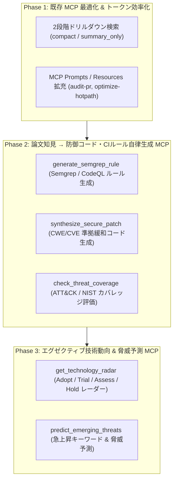

# [DSN-12] 機能設計書: MCP 戦略的エコシステム拡張 (MCP Strategic Ecosystem Expansion) — arxiv-security-papers

本ドキュメントは、**IT Strategist (ST)**, **Systems Architect (SA)**, **Information Security Specialist**, **PM** の合同審議に基づき、AI コーディングエージェントとセキュリティ技術者のための **MCP 戦略的エコシステム拡張ロードマップ（Phase 1 〜 Phase 3）** を規定する設計書です。

---

## 1. 全体アーキテクチャとフェーズロードマップ

---

## 2. フェーズ別詳細仕様

### Phase 1: 既存 MCP 最適化 & トークン効率化
1. **2段階ドリルダウン検索 (`src/mcp_server.py`)**:
   - `search_security_papers` および `search_papers_hybrid` に `compact: bool = True` オプションを追加。
   - デフォルトでは `id`, `title`, `category`, `one_line_summary`, `score` のみを返却し、コンテキスト消費量を 80% 削減。
   - 全文や詳細が必要な場合にのみ `get_paper_details` ツールでオンデマンド取得。
2. **MCP Prompts & Resources の拡充**:
   - **Prompts**:
     - `audit_code_with_papers`: ソースコード差分を論文知見と照合してレビュー。
     - `generate_ir_benchmark_report`: IR 評価結果から改善計画を立案。
   - **Resources**:
     - `security://papers/latest-digest`: 最新セキュリティ論文のダイジェスト。
     - `observability://system/health`: 検索エンジンおよびプロファイラの稼働状況。

### Phase 2: 防御コード・CIルール自律生成 (`src/threat_defense_mcp_server.py`)
1. **`generate_semgrep_rule`**:
   - 入力された CWE ID や論文の攻撃パターンから、CI パイプラインで即座に使える YAML 形式の Semgrep ルールを自動生成。
2. **`synthesize_secure_patch`**:
   - 脆弱なコード片と CWE ID を受け取り、論文推奨の安全な代替パターン（例: AST ガード、入力検証、安全な暗号化）を適用した修正コードと diff を生成。
3. **`check_threat_coverage`**:
   - リポジトリの防御機能と MITRE ATT&CK / NIST SP 800-53 コントロールの対応度をスコアリング。

### Phase 3: エグゼクティブ技術動向 & 脅威予測 (`src/tech_radar_mcp_server.py`)
1. **`get_technology_radar`**:
   - 論文コーパスの集計から、4象限（Adopt, Trial, Assess, Hold）の Tech-Radar を Markdown / JSON で出力。
2. **`predict_emerging_threats`**:
   - 直近の急上昇キーワード（PVM差分、Slopsquatting、サイドチャネル等）から、今後警戒すべき脅威動向サマリーを生成。

---

## 3. 設定ファイル登録 (`.agents/mcp_config.json`)
新規 MCP サーバーを `.agents/mcp_config.json` に登録し、Antigravity からワンクリックで利用可能にします。
