# [DSN-12] 汎用プロセススーパーバイザー & 調停基盤（`src/supervisor/`）包括的アーキテクチャ設計書

- **文書番号**: `DSN-12`
- **文書ステータス**: `APPROVED`
- **対象サブシステム**: `src/supervisor/` (`Arbiter`, `WorkerSpec`, `SupervisorConfig`, `ControlServer`/`Client`, `HeartbeatWatchdog`, `SupervisorTopViewer`, `LifecycleHook`, `SyncWorker`, `GthreadWorker`, `AsyncWorker`, `QueueWorker`, `ManagedServiceWorker`)  
**【主査・報告】 Systems Architect (SA) / IT Service Manager (SM)**  
**【参画】 Project Manager (PM), Information Security Specialist (Sec), Software QA Specialist (QA), Database / Data Infrastructure Specialist (DB), Network Specialist (Net)**

---

## 体系目次

- [1. プロセススーパーバイザーアーキテクチャと実行基盤](#1-プロセススーパーバイザーアーキテクチャと実行基盤)
  - [1.1 主要コンポーネントアーキテクチャとトポロジー](#11-主要コンポーネントアーキテクチャとトポロジー)
  - [1.2 3層完全プロセス分離モデル](#12-3層完全プロセス分離モデル)
  - [1.3 競合・先行アーキテクチャとの対比](#13-競合先行アーキテクチャとの対比)
  - [1.4 ファイルシステム物理配置とライフサイクルリソース](#14-ファイルシステム物理配置とライフサイクルリソース)
  - [1.5 アーキテクチャの要約](#15-アーキテクチャの要約)
- [2. POSIX デーモン化・セッション管理と二重起動制御](#2-posix-デーモン化セッション管理と二重起動制御)
  - [2.1 POSIX Double-Fork デーモン化メカニズム](#21-posix-double-fork-デーモン化メカニズム)
  - [2.2 標準ストリームの安全なリダイレクト](#22-標準ストリームの安全なリダイレクト)
  - [2.3 排他ファイルロック（fcntl.flock）による二重起動完全防止 (Singleton Instance Lock)](#23-排他ファイルロックfcntlflockによる二重起動完全防止-singleton-instance-lock)
  - [2.4 PID ファイルガードと生存確認](#24-pid-ファイルガードと生存確認)
  - [2.5 Linux PR_SET_PDEATHSIG による Worker 孤児化・プロセスリーク防止](#25-linux-pr_set_pdeathsig-による-worker-孤児化プロセスリーク防止)
  - [2.6 クリーンアップ保証と異常終了耐性](#26-クリーンアップ保証と異常終了耐性)
  - [2.7 デーモン化基盤の要約](#27-デーモン化基盤の要約)
- [3. Pre-fork 共有ソケットとネットワーク分散モデル](#3-pre-fork-共有ソケットとネットワーク分散モデル)
  - [3.1 親プロセス事前バインドと FD 継承](#31-親プロセス事前バインドと-fd-継承)
  - [3.2 カーネル空間負荷分散と Thundering Herd 対策](#32-カーネル空間負荷分散と-thundering-herd-対策)
  - [3.3 WSGI (PEP 3333) / HTTP 1.1 エンジン](#33-wsgi-pep-3333--http-11-エンジン)
  - [3.4 ネットワーク・ソケット基盤の要約](#34-ネットワークソケット基盤の要約)
- [4. マルチパラダイム・ワーカーアーキテクチャ](#4-マルチパラダイムワーカーアーキテクチャ)
  - [4.1 抽象ワーカー基底 (`BaseWorker`)](#41-抽象ワーカー基底-baseworker)
  - [4.2 逐次実行ワーカー (`SyncWorker`)](#42-逐次実行ワーカー-syncworker)
  - [4.3 マルチスレッド並行ワーカー (`GthreadWorker`)](#43-マルチスレッド並行ワーカー-gthreadworker)
  - [4.4 非同期イベントループワーカー (`AsyncWorker`)](#44-非同期イベントループワーカー-asyncworker)
  - [4.5 メッセージキュー・ストリームコンシューマ (`QueueWorker`)](#45-メッセージキューストリームコンシューマ-queueworker)
  - [4.6 ステートフル常駐サービスワーカー (`ManagedServiceWorker`)](#46-ステートフル常駐サービスワーカー-managedserviceworker)
  - [4.7 ワーカー並行性モデル比較](#47-ワーカー並行性モデル比較)
  - [4.8 ワーカーアーキテクチャの要約](#48-ワーカーアーキテクチャの要約)
- [5. DAG 依存関係解決と順序起動・逆順ドレイン停止](#5-dag-依存関係解決と順序起動逆順ドレイン停止)
  - [5.1 宣言的サービス契約 (`WorkerSpec` & `ServiceRole`)](#51-宣言的サービス契約-workerspec--servicerole)
  - [5.2 Kahn のアルゴリズムによるトポロジカルソート起動](#52-kahn-のアルゴリズムによるトポロジカルソート起動)
  - [5.3 循環依存検知とデッドロック未然防止](#53-循環依存検知とデッドロック未然防止)
  - [5.4 逆順トポロジカルグレースフル停止シーケンス](#54-逆順トポロジカルグレースフル停止シーケンス)
  - [5.5 起動・停止オーケストレーションの要約](#55-起動停止オーケストレーションの要約)
- [6. ミリ秒精度 Watchdog とハートビート障害検出](#6-ミリ秒精度-watchdog-とハートビート障害検出)
  - [6.1 アイドルワーカー誤死滅防止 (`is_handling_request`)](#61-アイドルワーカー誤死滅防止-is_handling_request)
  - [6.2 ハングプロセス検知と強制終了・自動復旧](#62-ハングプロセス検知と強制終了自動復旧)
  - [6.3 ライフサイクル状態機械 (`ServiceState`)](#63-ライフサイクル状態機械-servicestate)
  - [6.4 `ONESHOT_TASK` バッチ実行と指数的再試行管理](#64-oneshot_task-バッチ実行と指数的再試行管理)
  - [6.5 障害検出・復旧の要約](#65-障害検出復旧の要約)
- [7. Unix Domain Socket (UDS) IPC コントロールプロトコル](#7-unix-domain-socket-uds-ipc-コントロールプロトコル)
  - [7.1 UDS IPC アーキテクチャ (`ControlServer` / `ControlClient`)](#71-uds-ipc-アーキテクチャ-controlserver--controlclient)
  - [7.2 双方向 JSON プロトコル仕様](#72-双方向-json-プロトコル仕様)
  - [7.3 子プロセスフォーク時のソケット安全制御](#73-子プロセスフォーク時のソケット安全制御)
  - [7.4 動的プール個別スケーリング (`scale`)](#74-動的プール個別スケーリング-scale)
  - [7.5 IPC コントロールの要約](#75-ipc-コントロールの要約)
- [8. ゼロダウンタイム・ローリングリスタート](#8-ゼロダウンタイムローリングリスタート)
  - [8.1 SIGHUP ローリング置換メカニズム](#81-sighup-ローリング置換メカニズム)
  - [8.2 旧ワーカーのドレインと安全な解放](#82-旧ワーカーのドレインと安全な解放)
  - [8.3 ステートフルサービス保護と選択的リロード](#83-ステートフルサービス保護と選択的リロード)
  - [8.4 ローリングリスタートの要約](#84-ローリングリスタートの要約)
- [9. Linux /proc テレメトリとリアルタイム Top モニタリング](#9-linux-proc-テレメトリとリアルタイム-top-モニタリング)
  - [9.1 PSS (Proportional Set Size) と RSS の高精度測定](#91-pss-proportional-set-size-と-rss-の高精度測定)
  - [9.2 共有メモリ重複排除と真のメモリフットプリント](#92-共有メモリ重複排除と真のメモリフットプリント)
  - [9.3 ANSI カラー TUI ダッシュボード (`SupervisorTopViewer`)](#93-ansi-カラー-tui-ダッシュボード-supervisortopviewer)
  - [9.4 プロセスモニタリングの要約](#94-プロセスモニタリングの要約)
- [10. シグナルディスパッチと POSIX 調停エンジン](#10-シグナルディスパッチと-posix-調停エンジン)
  - [10.1 シグナルキューイングと非同期遅延ディスパッチ](#101-シグナルキューイングと非同期遅延ディスパッチ)
  - [10.2 POSIX シグナルマッピング一覧](#102-posix-シグナルマッピング一覧)
  - [10.3 ゾンビプロセス回収 (`waitpid(WNOHANG)`)](#103-ゾンビプロセス回収-waitpidwnohang)
  - [10.4 シグナル調停の要約](#104-シグナル調停の要約)
- [11. 設定管理と自動構成検出 (Configuration Engine)](#11-設定管理と自動構成検出-configuration-engine)
  - [11.1 多層設定モデル (`SupervisorConfig`)](#111-多層設定モデル-supervisorconfig)
  - [11.2 多様なフォーマットパーサー (JSON / TOML / Python)](#112-多様なフォーマットパーサー-json--toml--python)
  - [11.3 自動構成ディスカバリ機構](#113-自動構成ディスカバリ機構)
  - [11.4 設定エンジンの要約](#114-設定エンジンの要約)
- [12. CLI 運用・コマンドリファレンスと運用プラクティス](#12-cli-運用コマンドリファレンスと運用プラクティス)
  - [12.1 CLI コマンド体系一覧](#121-cli-コマンド体系一覧)
  - [12.2 実運用コマンドフロー](#122-実運用コマンドフロー)
  - [12.3 トラブルシューティング手順書](#123-トラブルシューティング手順書)
  - [12.4 運用の要約](#124-運用の要約)
- [13. 次世代実装ロードマップと品質保証](#13-次世代実装ロードマップと品質保証)
  - [13.1 品質ゲート基準と検証結果](#131-品質ゲート基準と検証結果)
  - [13.2 今後の進化計画](#132-今後の進化計画)

---

# 1. プロセススーパーバイザーアーキテクチャと実行基盤

## 1.1 主要コンポーネントアーキテクチャとトポロジー

汎用プロセス調停基盤（`src/supervisor/`）は、**Gunicorn** の Pre-fork ワーカーモデル、**Erlang/OTP** の Supervisor 障害耐性ツリー、および **Systemd** のサービス依存関係調停機構を融合したプロセス管理エンジンです。

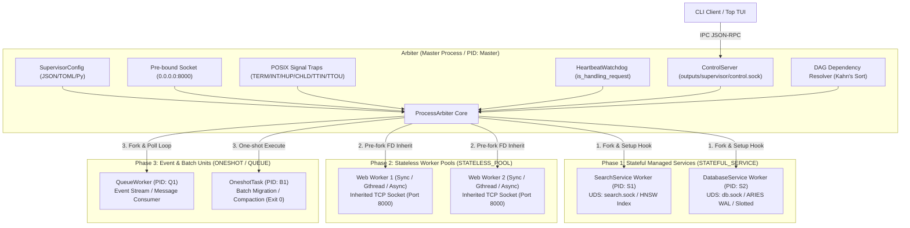

Arbiter（親プロセス）はクライアントリクエストを直接仲介せず、クラスタ全体のライフサイクル、シグナルハンドリング、死活監視、デーモン化、および UDS IPC コントロールを統括します。

---

## 1.2 3層完全プロセス分離モデル

Python のグローバルインタプリタロック（GIL）およびメモリ断片化（Memory Fragmentation）の制約下で大規模なセキュリティ論文検索基盤を安定稼働させるため、本システムは**「Web ゲートウェイ（ステートレス並行プール）」**、**「Search Engine（常駐ベクトルインデックス）」**、**「Database（ストレージ＆SQL実行エンジン）」**の 3 層完全プロセス分離を採用しています。

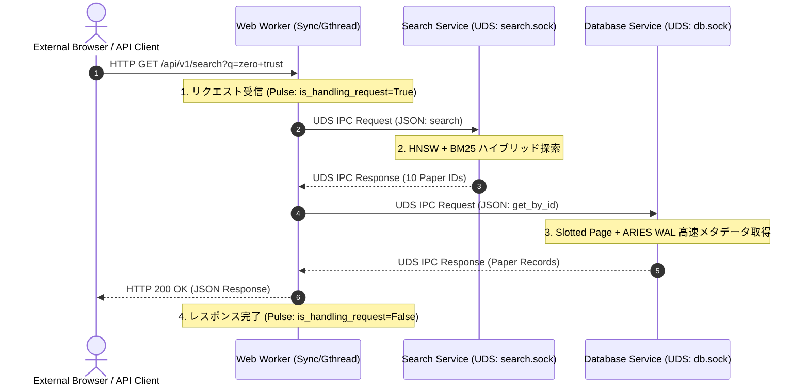

1. **障害の物理的封じ込め**:
   - 悪意ある HTTP ペイロードや巨大アップロードにより Web ワーカーがクラッシュしても、検索インデックス（1.3 GB+ 常駐）やデータベースプロセスには一切波及しない。
2. **メモリ肥大化の根絶**:
   - Web ワーカーはステートレスであるため、定期的なローリングリロード（Rolling Reload）やスケーリングによってメモリを即座に回収可能。
3. **ホットデータ保護**:
   - 検索エンジン・DB はステートフル常駐サービス（`STATEFUL_SERVICE`）として維持され、Web の再起動中もインデックス再ロードのオーバーヘッドが一切発生しない。

---

## 1.3 競合・先行アーキテクチャとの対比

| 比較項目 | Gunicorn | Erlang / OTP Supervisor | Systemd | Supervisord | 次世代 `src/supervisor/` |
| :--- | :--- | :--- | :--- | :--- | :--- |
| **主対象** | WSGI/ASGI Web | アクター並行プロセス | OS サービス調停 | Python プロセス監視 | **異種混在（Web + UDS DB + Queue + Batch）** |
| **デーモン化** | Double-Fork (`-D`) | VM レベル常駐 | OS PID 1 ネイティブ | Fork / Daemonize | **POSIX Double-Fork + PID Guard (`-D`)** |
| **依存関係解決** | 非対応（単一WSGI） | Supervision Tree 階層 | DAG Unit (`After=`) | 優先度整数（`priority`） | **Kahn DAG トポロジカルソート起動 & 逆順停止** |
| **障害検知** | 一律 Heartbeat タイムアウト | クラッシュ再起動戦略 | cgroup / PID 監視 | プロセス生存監視 | **`is_handling_request` 認識ミリ秒 Watchdog** |
| **IPC 制御** | POSIX シグナルのみ | 分散メッセージパッシング | D-Bus / `systemctl` | XML-RPC (TCP/UDS) | **JSON-RPC Over Unix Domain Socket (`control.sock`)** |
| **メモリ監視** | なし（外部依存） | Erlang GC メモリ | cgroup メモリクォータ | なし | **Linux `/proc` 直読 PSS / RSS リアルタイム Top TUI** |
| **単発タスク** | 非対応 | transient アクター | `Type=oneshot` | `autorestart=false` | **`ONESHOT_TASK` (Exit 0 完遂 & リトライ管理)** |

---

## 1.4 ファイルシステム物理配置とライフサイクルリソース

```
outputs/supervisor/
├── arbiter.pid          # Arbiter マスタープロセスの PID ファイル (二重起動防止ガード)
├── control.sock         # 管理用 Unix Domain Socket (JSON-RPC コントロールチャネル)
├── supervisor.log       # デーモンモード時の標準出力・標準エラー出力集約ログ
├── search.sock          # Search サービスの UDS IPC エンドポイント
└── db.sock              # Database サービスの UDS IPC エンドポイント
```

- **パーミッション**: 全ソケットファイルは `0o600` または `0o644`、PID ファイルは `0o644` でアトミックに管理。
- **孤立リソースの自動パージ**: Arbiter 起動時に古いソケットをアンリンク（`os.unlink`）し、終了時には `atexit` ハンドラにより確実にクリーンアップ。

---

## 1.5 アーキテクチャの要約

- `src/supervisor/` は、ステートレス Web ワーカー群とステートフル常駐サービス群を単一の Arbiter で統括管理する統合調停基盤。
- 3層完全プロセス分離により、Web の障害やメモリ断片化が DB/Search の永続データ・インデックスに波及しない堅牢なトポロジーを確立。

---

# 2. POSIX デーモン化・セッション管理と二重起動制御

## 2.1 POSIX Double-Fork デーモン化メカニズム

バックグラウンドサービスとして安全に常駐するため、Arbiter は POSIX 標準の **ダブルフォーク（Double-Fork）イディオム** を実装しています（`src/supervisor/arbiter.py:daemonize()`）。

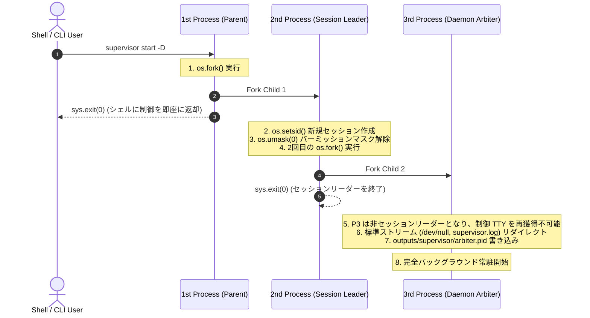

### 2.1.1 なぜ 2 回 fork するのか？
1. **第 1 の `os.fork()`**:
   - 親プロセスを終了させることで、シェルに対してコマンド実行完了を通知し、プロンプトを即座に解放。
2. **`os.setsid()`**:
   - プロセスを新規プロセスグループおよび新規セッションのリーダーとし、元の制御端末（Controlling TTY）から完全に切り離す。
3. **第 2 の `os.fork()`**:
   - セッションリーダーであるプロセス（Child 1）を終了させ、Child 2 を生成。
   - **Child 2 はセッションリーダーではないため、将来的に端末デバイス（`/dev/tty` 等）を `open()` しても、自動的に制御端末が再割り当てされるリスクを完全に排除**。

---

## 2.2 標準ストリームの安全なリダイレクト

デーモン化されたプロセスが親端末の閉塞や破損によって `SIGPIPE` や `EIO` を受けないよう、ファイルディスクリプタ（FD）0, 1, 2 を厳格に付け替えます（`_redirect_standard_streams()`）。

```python
def _redirect_standard_streams(self) -> None:
    for stream in (sys.stdout, sys.stderr):
        try:
            stream.flush()
        except Exception:
            pass

    devnull = os.open(os.devnull, os.O_RDWR)
    self._safe_dup2(devnull, 0)  # stdin -> /dev/null
    out_fd = self._open_log_fd() # outputs/supervisor/supervisor.log
    self._safe_dup2(out_fd, 1)   # stdout -> supervisor.log
    self._safe_dup2(out_fd, 2)   # stderr -> supervisor.log
    if out_fd > 2:
        os.close(out_fd)
    if devnull > 2:
        os.close(devnull)
```

- **`_safe_dup2()`**: OS 仮想擬似ファイルシステムやコンテナ環境における例外を安全に吸収。
- **ログアペンド**: `os.O_WRONLY | os.O_CREAT | os.O_APPEND` フラグ（パーミッション `0o644`）により、複数プロセスのログ追記競合を防止。

## 2.3 排他ファイルロック（fcntl.flock）による二重起動完全防止 (Singleton Instance Lock)

二重起動によるポート競合、ソケット上書き、およびプロセス増殖を OS カーネルレベルで 100% 確実に防止するため、Arbiter は起動時に `outputs/supervisor/arbiter.lock` に対する**ノンブロッキング排他ロック（`fcntl.LOCK_EX | fcntl.LOCK_NB`）** を取得します（`src/supervisor/arbiter.py:acquire_single_instance_lock()`）。

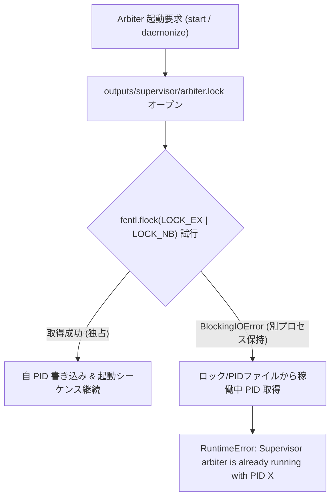

- **カーネル排他制御**: プロセスが異常終了した場合でも、ファイルディスクリプタのクローズに伴い OS カーネルが自動的にロックを解放するため、デッドロックに陥る危険がありません。
- **即時ブロック & エラー通知**: 別インスタンスが起動を試みた場合、ブロックすることなくミリ秒単位で即座に例外を発生させ、運用者に適切な CLI コマンド（`status` / `restart` / `stop`）を案内します。

---

## 2.4 PID ファイルガードと生存確認

排他ロックに加え、運用スクリプトや外部ツールとの親和性を担保するため、Arbiter は起動前に `outputs/supervisor/arbiter.pid` を検証します（`_check_existing_pid()`）。

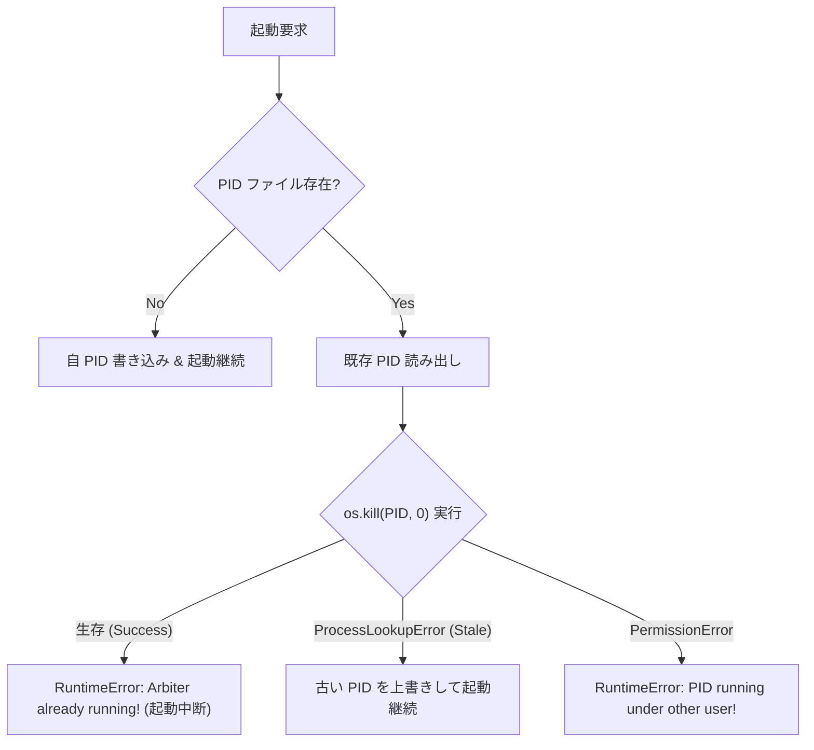

- **`os.kill(pid, 0)`**: シグナルを送信せずに対象プロセスの存在と権限のみを確認する POSIX 標準イディオム。
- **Stale PID 対策**: 前回の異常終了（OS クラッシュ等）で残存した PID ファイルは自動検出して安全に上書き。

---

## 2.5 Linux PR_SET_PDEATHSIG による Worker 孤児化・プロセスリーク防止

親プロセス（Arbiter）が SIGKILL や不意のセグメンテーション違反などで突然死した場合、フォークされた子プロセス（Worker 群）が `init`（PID 1）や systemd の配下にぶら下がり、ゾンビ・孤児プロセスとしてバックグラウンドに残留・増殖するリスクが存在します。

Arbiter は子プロセス生成直後の初期化ルーチン（`src/supervisor/arbiter.py:init_child_process()`）において、Linux カーネルの `prctl` システムコールを介して **`PR_SET_PDEATHSIG`** を設定します。

```python
def init_child_process(self) -> None:
    """子プロセス初期化: シグナルハンドラリセット、UDS 閉塞、および親死亡時連動終了を設定"""
    if self._lock_file_obj:
        try:
            self._lock_file_obj.close()
        except Exception:
            pass
        self._lock_file_obj = None

    if self.control_server:
        self.control_server.close_in_child()
    signal.signal(signal.SIGCHLD, signal.SIG_DFL)

    # 親 Arbiter が死亡した瞬間に子 Worker を自動連動終了 (Linux PR_SET_PDEATHSIG)
    try:
        import ctypes
        libc = ctypes.CDLL("libc.so.6")
        PR_SET_PDEATHSIG = 1
        libc.prctl(PR_SET_PDEATHSIG, signal.SIGKILL)
    except Exception:
        pass
```

- **完全な道連れ終了の保証**: 親 Arbiter の終了シグナル受信やクラッシュ時に、全 Worker がカーネルレベルで即座に `SIGKILL` を受けて終了するため、プロセスリークが構造的に発生しません。

---

## 2.6 クリーンアップ保証と異常終了耐性

- **`_cleanup_resources()` & `release_single_instance_lock()`**: Arbiter の正常終了時、ロック解放・ファイル削除（`arbiter.lock`）、PID ファイル（`arbiter.pid`）、および IPC ソケット（`control.sock`）を確実にアンリンク。
- **`atexit` 登録**: Python インタプリタの予期せぬ終了時にも `_atexit_cleanup` が発動し、残存ソケットを自動クリーンアップ。
- **子プロセスガード**: `fork()` 直後の子プロセスにおいて `control_server.close_in_child()` を呼び出し、子プロセスの終了時に親の UDS ソケットが誤ってアンリンクされる事態を防止。

---

## 2.7 デーモン化基盤の要約

- POSIX Double-Fork と `setsid()` により、制御 TTY から 100% デタッチされた安全なバックグラウンド常駐を実現。
- `fcntl.flock` によるノンブロッキング排他ロックと `os.kill(pid, 0)` により、二重起動とリソース競合を完全に阻止。
- Linux `PR_SET_PDEATHSIG` により、Arbiter 死亡時の子ワーカー孤児化・プロセスリークを根絶。

---

# 3. Pre-fork 共有ソケットとネットワーク分散モデル

## 3.1 親プロセス事前バインドと FD 継承

Web ワーカー群へのクライアント接続分配において、Arbiter は **Pre-fork 共有ソケットモデル** を採用しています。

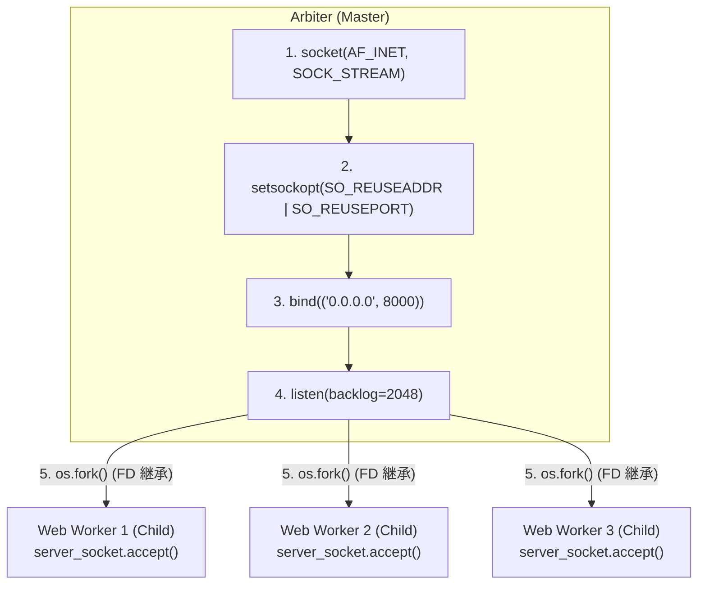

1. **事前バインド（Pre-bind）**:
   - 特権ポートや指定アドレス（`0.0.0.0:8000`）を親プロセスが一度だけ `bind()` および `listen()`。
2. **ファイルディスクリプタ継承**:
   - `os.fork()` 実行時、子プロセスは親のオープン済みソケット FD をそのまま継承。
3. **非ブロッキング accept**:
   - `server_socket.settimeout(1.0)` または `setblocking(False)` により、シグナル受信や終了判定ループを妨げない。

---

## 3.2 カーネル空間負荷分散と Thundering Herd 対策

- **カーネルスケジューリング**:
  - 複数ワーカーが同一のリスニングソケットで `accept()` を待機。Linux カーネルの `epoll` / ソケットキューが、新規接続を待機中の 1 ワーカーにのみ公平にディスパッチ（$O(1)$ 効率）。
- **`SO_REUSEPORT` 最適化**:
  - 利用可能な環境では `SO_REUSEPORT` を有効化し、カーネル内での接続分散効率を最大化。
- **Thundering Herd（群がる群衆問題）の排除**:
  - 近代 Linux カーネルの `EPOLLEXCLUSIVE` / `accept` キュー最適化と協調し、1 接続に対して全ワーカーが一斉に起床する無駄なコンテキストスイッチを防止。

---

## 3.3 WSGI (PEP 3333) / HTTP 1.1 エンジン

`SyncWorker` および `AsyncWorker` は、軽量かつ完全自己完結型の HTTP/1.1 パーサーと WSGI 実行ブリッジを内蔵しています（`src/supervisor/workers/sync_worker.py`）。

### 3.3.1 WSGI 環境辞書（`environ`）の動的構築
- `REQUEST_METHOD`, `PATH_INFO`, `QUERY_STRING`, `SERVER_NAME`, `SERVER_PORT`
- `wsgi.input`（`io.BytesIO(body_bytes)`）
- `HTTP_*` ヘッダー群の ISO-8859-1 / UTF-8 透過デコード

### 3.3.2 レスポンスストリーミングと Content-Length 補正
- `start_response(status, response_headers)` コールバック
- `Content-Length` 自動算出および `Connection: close` による安全な接続終了

---

## 3.4 ネットワーク・ソケット基盤の要約

- 親プロセスによる単一バインドと `fork()` 継承により、ワーカープロセス間のネットワーク負荷分散をカーネル空間で最高速に処理。
- 外部 Web サーバーなしでも単体で WSGI アプリケーションを直接ホスティング可能。

---

# 4. マルチパラダイム・ワーカーアーキテクチャ

## 4.1 抽象ワーカー基底 (`BaseWorker`)

すべてのワーカー実装は、共通のライフサイクル契約・シグナルトラップ・ハートビート送信機構をカプセル化した `BaseWorker` を継承します（`src/supervisor/workers/base.py`）。

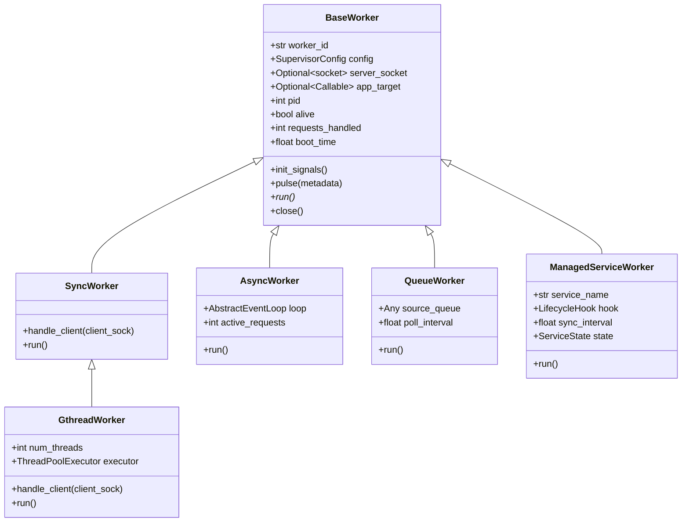

- **共通シグナルハンドリング**: `SIGQUIT`（グレースフルドレイン停止）、`SIGTERM`/`SIGINT`（即時停止）、`SIGWINCH`（ターミナルリサイズ無視）。
- **`pulse()` メソッド**: ワーカー自身の生存・処理件数・稼働時間を Arbiter の Watchdog へ通知。

---

## 4.2 逐次実行ワーカー (`SyncWorker`)
- **動作モデル**: 1 リクエストを 1 プロセスで逐次処理（1-Request-Per-Process）。
- **長所**: 完璧なメモリ・障害分離。C 拡張や重い CPU バウンド処理（NLP 形態素解析、正規表現）でも他接続に影響しない。
- **適用領域**: 標準 Web API、CPU 集約型エンドポイント。

---

## 4.3 マルチスレッド並行ワーカー (`GthreadWorker`)
- **動作モデル**: `concurrent.futures.ThreadPoolExecutor` を内蔵し、1 プロセス内で複数スレッドが並行して接続を処理。
- **長所**: 接続あたりのメモリフットプリントを最小化しつつ、Keep-Alive や I/O 待機接続を効率的に処理。
- **適応制御**: `_active_requests` カウンタをスレッドセーフに管理し、アクティブなリクエストが存在する間のみ Watchdog に `is_handling_request=True` を通知。

---

## 4.4 非同期イベントループワーカー (`AsyncWorker`)
- **動作モデル**: Python ネイティブの `asyncio` イベントループと `asyncio.start_server()` を駆動。
- **長所**: 数千の同時接続（C10K 課題）を単一スレッド・非同期ノンブロッキング I/O で高速処理。
- **適用領域**: SSE（Server-Sent Events）、ストリーミング API、長時間ポーリング。

---

## 4.5 メッセージキュー・ストリームコンシューマ (`QueueWorker`)
- **動作モデル**: TCP ソケットをバインドせず、`queue.Queue` や Callable ソースからメッセージをポーリングしてハンドラを実行（`src/supervisor/workers/queue_worker.py`）。
- **グレースフルドレイン**: `SIGQUIT` 受信時、現在処理中のメッセージを最後まで完遂してから安全に終了。

---

## 4.6 ステートフル常駐サービスワーカー (`ManagedServiceWorker`)
- **動作モデル**: `LifecycleHook` 契約に準拠し、UDS ソケットの受付、定期的なディスク同期（`on_flush`）、死活判定（`health_check`）を実行（`src/supervisor/workers/service_worker.py`）。
- **適用領域**: `SearchService`（HNSW ベクトル検索）、`DatabaseService`（ARIES WAL + Slotted Page）。

---

## 4.7 ワーカー並行性モデル比較

| ワーカー種別 | 並行性モデル | プロセス分離度 | メモリ効率 | I/O 待機耐性 | 推奨ユースケース |
| :--- | :--- | :--- | :--- | :--- | :--- |
| **`SyncWorker`** | 1 コネクション / プロセス | ★★★★★ (完全) | ★★☆☆☆ (プロセス数依存) | ★☆☆☆☆ (ブロック) | CPU バウンド API, 論文要約 |
| **`GthreadWorker`** | スレッドプール並行 | ★★★★☆ (プロセス単位) | ★★★★☆ (スレッド共有) | ★★★★☆ (良好) | 一般的な Web ゲートウェイ |
| **`AsyncWorker`** | `asyncio` イベントループ | ★★★★☆ (プロセス単位) | ★★★★★ (極小) | ★★★★★ (最高速) | 大量ストリーミング, SSE |
| **`QueueWorker`** | バックグラウンドデキュー | ★★★★★ (完全) | ★★★★☆ (軽量) | ★★★★☆ (ポーリング) | 非同期バッチ, ログ集約 |
| **`ServiceWorker`** | UDS イベント駆動常駐 | ★★★★★ (完全) | ★★★☆☆ (インデックス常駐)| ★★★★★ (UDS 専用) | ベクトル検索, DB エンジン |

---

## 4.8 ワーカーアーキテクチャの要約

- 5 つの専用ワーカー種別により、ステートレス Web、大量非同期 I/O、キュー処理、およびステートフル DB/検索サービスを同一基盤上で統一制御。

---

# 5. DAG 依存関係解決と順序起動・逆順ドレイン停止

## 5.1 宣言的サービス契約 (`WorkerSpec` & `ServiceRole`)

Arbiter は、クラスタを構成する各ユニットを `WorkerSpec` として抽象化して管理します（`src/supervisor/contracts.py`）。

```python
class ServiceRole(enum.Enum):
    STATELESS_POOL = "STATELESS_POOL"      # 水平スケール可能なワーカー群 (Web)
    STATEFUL_SERVICE = "STATEFUL_SERVICE"  # 単一性・整合性を要する常駐サービス (DB, Search)
    ONESHOT_TASK = "ONESHOT_TASK"          # 完了後に終了するバッチタスク (Migration 等)

class WorkerSpec:
    def __init__(
        self,
        name: str,
        target_count: int = 1,
        worker_class: Optional[str] = "sync",
        app_target: Optional[Callable[..., Any]] = None,
        server_socket: Optional[Any] = None,
        hook: Optional[LifecycleHook] = None,
        role: ServiceRole = ServiceRole.STATELESS_POOL,
        sync_interval: float = 2.0,
        dependencies: Optional[list[str]] = None,
        max_retries: int = 0,
        metadata: Optional[Dict[str, Any]] = None,
    ): ...
```

---

## 5.2 Kahn のアルゴリズムによるトポロジカルソート起動

サービス間の依存関係（`dependencies`）を有向非巡回グラフ（DAG）としてモデル化し、**Kahn のトポロジカルソートアルゴリズム** を用いて厳格な起動順序を導出します（`src/supervisor/arbiter.py:resolve_boot_order()`）。

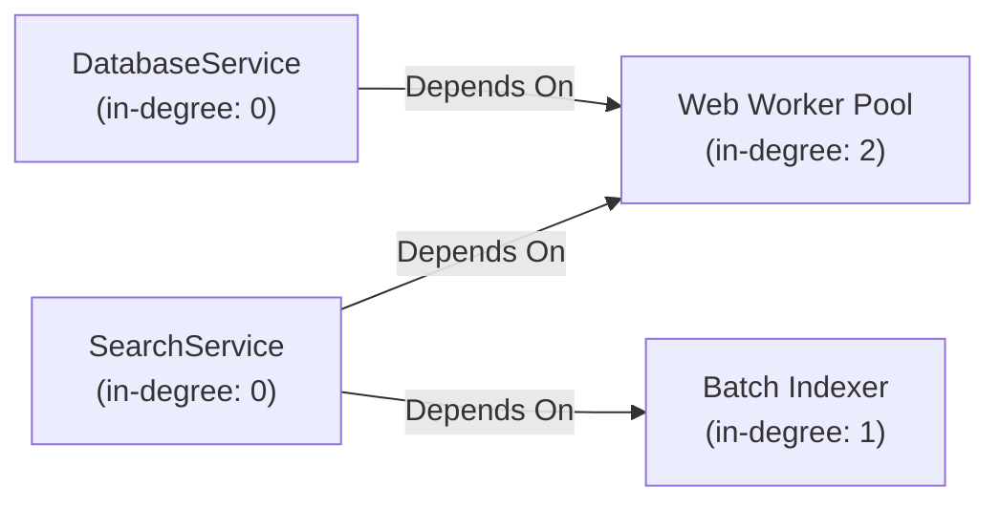

### 5.2.1 起動順序解決アルゴリズム
1. **入次数（in-degree）マップと隣接リストの構築**:
   - 各ノードの被依存数をカウント。
2. **入次数 0 のノードを抽出**:
   - 依存先を持たない独立ノード（`database`, `search` 等のステートフル基盤）を優先キューへ投入。
3. **ノードの確定と入次数の減算**:
   - キューからノードを取り出して起動順序リストへ追加。隣接ノードの入次数をデクリメントし、0 になったノードを順次キューへ追加。
4. **結果**: `['database', 'search', 'web', 'batch']` の順で安全に起動。

---

## 5.3 循環依存検知とデッドロック未然防止

もし設定に `A -> B -> A` のような循環依存が含まれていた場合、トポロジカルソート後の解決済みノード数が全登録プール数と一致しなくなります。
Arbiter はこれを即座に検知し、起動をブロックして詳細なエラーを送出します。

$$\text{len}(\text{ordered}) \neq \text{len}(\text{self.pools}) \implies \text{ValueError}(\text{"Circular dependency detected: "} \dots)$$

---

## 5.4 逆順トポロジカルグレースフル停止シーケンス

シャットダウン時（`shutdown()`）、Arbiter は起動順序を反転（`reversed(resolve_boot_order())`）させた順序でプロセスを停止します。

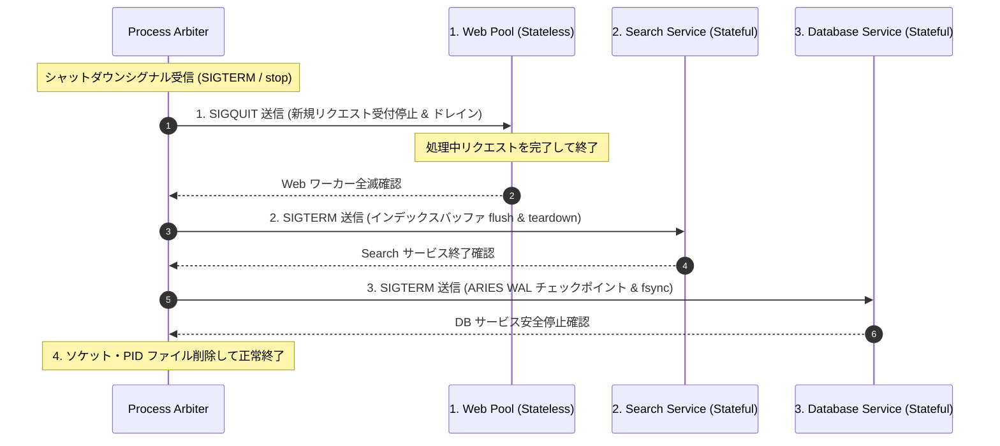

- **上位の Web を先に停止**: クライアントからの新規流入を遮断し、下位の DB/Search へのリクエストがゼロになったことを保証。
- **データ破損の防止**: DB が先に落ちて Web が 500 エラーを連発したり、書き込み途中のデータが消失する事故を原理的に排除。

---

## 5.5 起動・停止オーケストレーションの要約

- DAG トポロジカルソートにより、依存元の常駐サービスが完全に起動・準備完了した後に Web ワーカー群をフォーク。
- シャットダウン時は厳格な逆順停止を行うことで、リクエストドロップとデータ破損を 100% 抑止。

---

# 6. ミリ秒精度 Watchdog とハートビート障害検出

## 6.1 アイドルワーカー誤死滅防止 (`is_handling_request`)

従来の Gunicorn などの Pre-fork サーバーでは、ワーカーがアイドル状態（リクエスト未受信）のままタイムアウト（30秒）を迎えると、Arbiter がハングと誤判定して `SIGKILL` してしまう問題がありました。

本調停基盤では、ワーカーの状態に **「リクエスト処理中フラグ（`is_handling_request`）」** を導入し、この問題を根本解決しています（`src/supervisor/heartbeat.py`）。

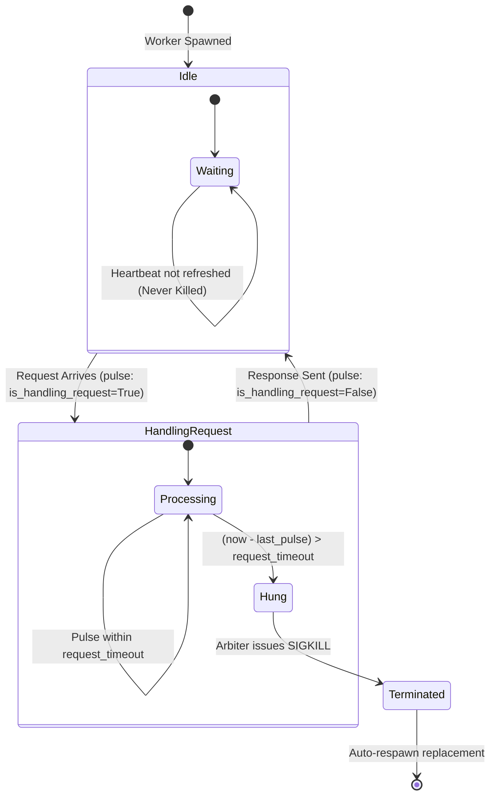

- **アイドル時 (`is_handling_request=False`)**:
  - ハートビートが更新されなくても、ワーカーは単にリクエストを待機しているだけであるため、**絶対に殺害しない**。
- **処理中 (`is_handling_request=True`)**:
  - リクエスト処理中に `request_timeout`（デフォルト 30秒）以上ハートビートが途絶えた場合のみ、**「真のハングプロセス」** として判定。

---

## 6.2 ハングプロセス検知と強制終了・自動復旧

```python
def get_hung_workers(self, timeout: Optional[float] = None) -> List[int]:
    t_limit = timeout if timeout is not None else self.timeout
    now = time.monotonic()
    hung: List[int] = []
    with self._lock:
        for pid, last_pulse in self._heartbeats.items():
            meta = self._worker_meta.get(pid, {})
            if not meta.get("is_handling_request", False):
                continue
            if (now - last_pulse) > t_limit:
                hung.append(pid)
    return hung
```

1. **検知**: Arbiter のメインループ（0.5秒周期）で `check_hung_workers()` を実行。
2. **強制終了**: ハングした PID に対し `os.kill(pid, signal.SIGKILL)` を発行。
3. **即時復旧**: `SIGCHLD` ハンドラと連動して、同一プールから直ちに新しい代替ワーカーを `spawn_worker()`。

---

## 6.3 ライフサイクル状態機械 (`ServiceState`)

各サービスおよびワーカーは、以下の 7 段階の状態機械に従って厳密に遷移します。

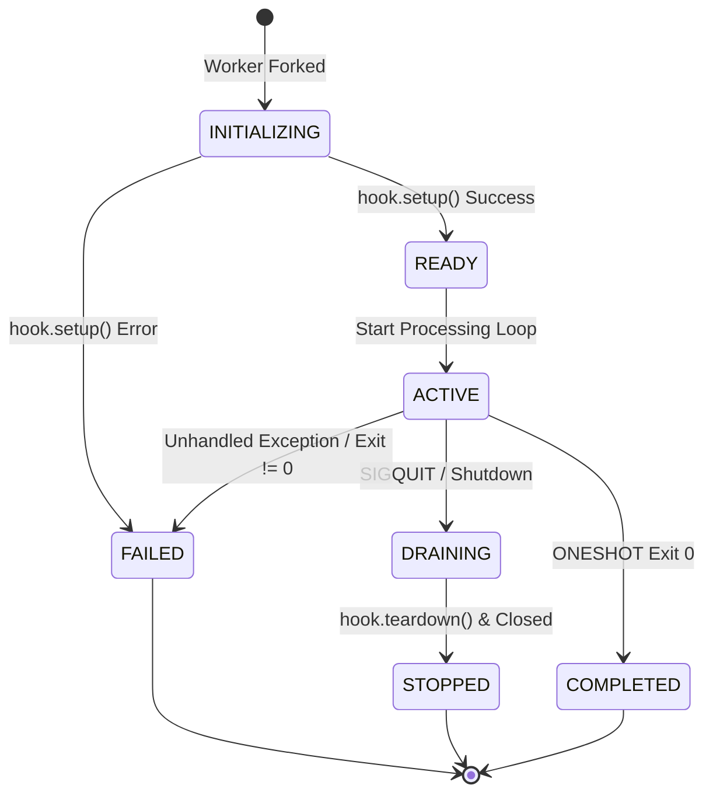

---

## 6.4 `ONESHOT_TASK` バッチ実行と指数的再試行管理

一括インデックス生成や DB マイグレーション等の単発バッチ処理のために、Arbiter は `ONESHOT_TASK` 役割をサポートします。

1. **正常終了（Exit Code 0）**:
   - `_handle_child_exit()` において、クラッシュとみなさず `ServiceState.COMPLETED` に遷移。再起動を抑止。
2. **異常終了（Exit Code != 0）**:
   - `retry_count < max_retries` の場合、自動で再フォークしてタスクを再試行。
   - 上限到達時は `ServiceState.FAILED` として恒久停止し、ログに警告を出力。

---

## 6.5 障害検出・復旧の要約

- `is_handling_request` フラグにより、アイドルワーカーの誤殺害を 100% 防止しつつ、真の無限ループ・デッドロックプロセスのみを `SIGKILL` で即時強制終了・自動置換。

---

# 7. Unix Domain Socket (UDS) IPC コントロールプロトコル

## 7.1 UDS IPC アーキテクチャ (`ControlServer` / `ControlClient`)

Arbiter は、ローカルファイルシステム上の専用 Unix Domain Socket（`outputs/supervisor/control.sock`）を介して、高速・安全な管理 IPC サーバーを稼働させます（`src/supervisor/control.py`）。

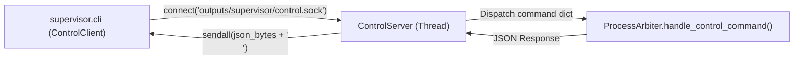

- **通信オーバーヘッド**: TCP/IP スタック（ループバック）をバイパスし、カーネル内メモリコピーのみで数マイクロ秒以内の超低遅延レスポンスを実現。
- **セキュリティ**: OS のファイルパーミッション（`0o600` / `0o644`）により、同一ホスト内の権限外ユーザーからの不正なプロセス操作をブロック。

---

## 7.2 双方向 JSON プロトコル仕様

### 7.2.1 `ping` コマンド
- **Request**: `{"cmd": "ping"}`
- **Response**: `{"status": "ok", "message": "pong", "timestamp": 1787702400.12}`

### 7.2.2 `status` コマンド (クラスタテレメトリ)
- **Request**: `{"cmd": "status"}`
- **Response**:
```json
{
  "status": "ok",
  "arbiter_pid": 123844,
  "uptime": 120.5,
  "pools": {
    "web": { "target": 2, "active": 2, "pids": [123850, 123851], "role": "STATELESS_POOL" },
    "search": { "target": 1, "active": 1, "pids": [123846], "role": "STATEFUL_SERVICE" },
    "database": { "target": 3, "active": 3, "pids": [123847, 123848, 123849], "role": "STATEFUL_SERVICE" }
  },
  "workers": {
    "123846": { "pid": 123846, "type": "search", "status": "ALIVE", "is_healthy": true, "idle_seconds": 2.1, "requests_handled": 1420 },
    "123850": { "pid": 123850, "type": "web", "status": "ALIVE", "is_healthy": true, "idle_seconds": 0.4, "requests_handled": 85 }
  }
}
```

### 7.2.3 `scale` コマンド (動的プール伸縮)
- **Request**: `{"cmd": "scale", "pool": "web", "workers": 4}`
- **Response**: `{"status": "ok", "target_pool": "web", "target_workers": 4, "active_workers": 4}`

### 7.2.4 `reload` コマンド (ローリングリスタート)
- **Request**: `{"cmd": "reload"}`
- **Response**: `{"status": "ok", "message": "Rolling reload triggered"}`

### 7.2.5 `stop` コマンド (グレースフル停止)
- **Request**: `{"cmd": "stop"}`
- **Response**: `{"status": "ok", "message": "Shutdown sequence initiated"}`

---

## 7.3 子プロセスフォーク時のソケット安全制御

子プロセスがフォークされた際、親プロセスの `ControlServer` のリスニングソケットをそのまま開いたままにしておくと、子プロセスのクラッシュ時や終了時にソケットファイルが意図せず閉じたり、ポートがブロックされる危険があります。

Arbiter は `init_child_process()` 内で `control_server.close_in_child()` を実行し、**ソケットファイルをアンリンクせずにソケット FD のみを安全にクローズ** します。

---

## 7.4 動的プール個別スケーリング (`scale`)

指定されたプールのみを対象としてワーカー数を増減します（`adjust_pool()`）。
- **スケールアップ**: 不足分（`target - active`）だけ `spawn_worker(pool_name)` を実行。
- **スケールダウン**: 余剰分（`active - target`）のワーカーに対して `SIGTERM` を送信し、Watchdog テーブルおよびプール管理マップから安全に除外。

---

## 7.5 IPC コントロールの要約

- UDS と JSON-RPC を採用することで、CLI・外部監視スクリプト・オーケストレータからクラスタの全状態を取得・制御可能。

---

# 8. ゼロダウンタイム・ローリングリスタート

## 8.1 SIGHUP ローリング置換メカニズム

コード更新や設定変更時、サービスを一切停止させずにワーカーを順次入れ替える **ゼロダウンタイム・ローリングリスタート（Rolling Restart）** を提供します（`src/supervisor/arbiter.py:reload()`）。

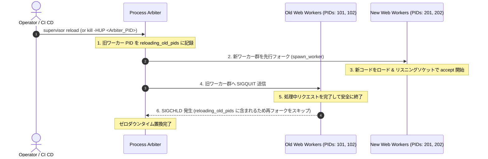

---

## 8.2 旧ワーカーのドレインと安全な解放

1. **`reloading_old_pids` セットの活用**:
   - 旧ワーカーの終了シグナル（`SIGCHLD`）を受信した際、Arbiter はそれがローリングリロードによる正常終了であることを認識し、自動再フォークを抑止。
2. **リクエスト処理の完遂**:
   - 旧ワーカーは `SIGQUIT` を受信後、新規接続の受付を停止し、処理中のクライアントへレスポンスを返送し終えてから自律終了。

---

---

## 8.3 ステートフルサービス保護と選択的リロード

- デフォルトのローリングリロード（`reload()`）では、**`STATELESS_POOL`（Web 等）のみを対象として再起動** を実行。
- 1.3 GB+ のインデックスを保持する `SearchService` や `DatabaseService` は再起動から除外され、検索 API がミリ秒の中断もなく継続稼働。

---

## 8.4 サービス単位の個別 Graceful Restart 機構

特定のステートフルサービスや個別プールのみを選択して安全に再起動する **サービス単位 Graceful Restart（`restart <target>`）** を提供します。

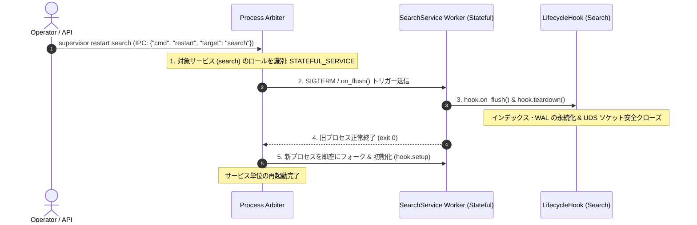

1. **ステートレスプール (`STATELESS_POOL`) の再起動**:
   - 先行フォーク ＋ 旧ワーカー `SIGQUIT` による完全ゼロダウンタイム置換。
2. **ステートフルサービス (`STATEFUL_SERVICE`) の再起動**:
   - `hook.on_flush()` $\rightarrow$ `hook.teardown()` によるクリーンアップ後、単一インスタンスの確実なプロセス再起動。
3. **全サービス依存順再起動 (`restart --all`)**:
   - Kahn のトポロジカル逆順で停止 $\rightarrow$ トポロジカル正順で起動。

---

## 8.5 ワーカー自律的 Graceful ローテーション (`max_requests` & `max_worker_lifetime`)

長期間稼働するワーカーにおけるメモリフラグメンテーション、C 拡張ライブラリ（PDF 抽出、機械学習モデル、形態素解析）のメモリリーク、およびファイルディスクリプタ蓄積を完全に防止するため、各ワーカーが自律的に退役・再生成する機構を導入します。

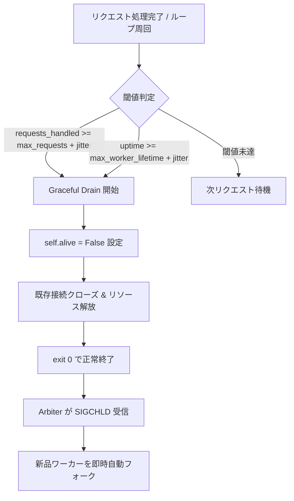

### Jitter（ゆらぎ）によるサンダリングハード（一斉再起動）防止
- **`max_requests` Jitter**:
  $$\text{effective\_max\_requests} = \text{max\_requests} + \text{randint}(-\text{jitter}, +\text{jitter})$$
- **`max_worker_lifetime` Jitter**:
  $$\text{effective\_lifetime} = \text{max\_worker\_lifetime} + \text{uniform}(-\text{jitter}, +\text{jitter})$$
- 複数ワーカーが同時に上限へ達してクラスタ全体のキャパシティが低下することを数学的に防止。

---

## 8.6 ローリングリスタートとライフタイム制御の要約

- 先行フォーク ＋ `SIGQUIT` ドレイン ＋ サービス単位個別再起動 ＋ ワーカー自律的 TTL/リクエスト上限ローテーションにより、運用保守性と長期連続稼働の超高信頼性を両立。

---

# 9. Linux /proc テレメトリとリアルタイム Top モニタリング

## 9.1 PSS (Proportional Set Size) と RSS の高精度測定

Python のマルチプロセス環境では、`fork()` によるメモリ共有（Copy-on-Write: CoW）が発生するため、通常の RSS（Resident Set Size）を合算するとメモリ使用量が数倍に過大評価されます。

本システムは、Linux カーネルの `/proc/<pid>/smaps_rollup` を直接パースし、**PSS（Proportional Set Size: 共有メモリをプロセス数で等分した真の占有メモリ）** をミリ秒精度で算出します（`src/supervisor/top.py`）。

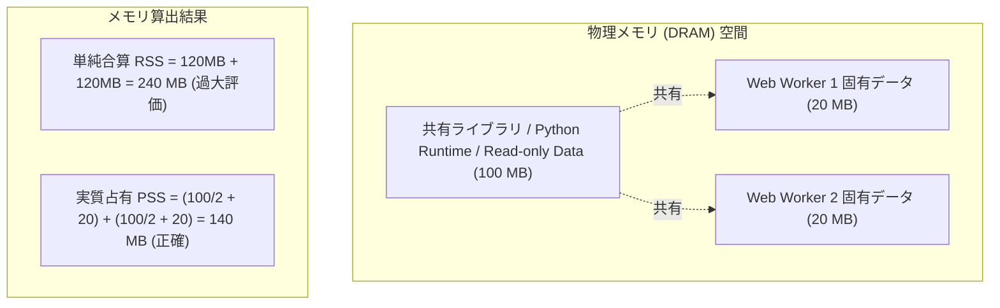

---

## 9.2 共有メモリ重複排除と真のメモリフットプリント

$$\text{PSS} = \text{Private\_Clean} + \text{Private\_Dirty} + \sum \frac{\text{Shared\_Clean} + \text{Shared\_Dirty}}{\text{Sharing Processes}}$$

- **Search サービス**: 巨大なベクトル配列（約 1.3 GB）の固有メモリを正確に測定。
- **Web ワーカー群**: 親プロセスから CoW 共有されている領域を除外し、リクエスト処理で純粋に消費されたヒープメモリのみを可視化。

---

## 9.3 ANSI カラー TUI ダッシュボード (`SupervisorTopViewer`)

外部依存なし（純粋な Python 標準ライブラリのみ）で、ターミナル上に美しいリアルタイム監視画面を描画します（`supervisor top`）。

```
⚡ [Supervisor Process Top Monitor]  2026-08-27 08:30:00
──────────────────────────────────────────────────────────────────────────────
  Arbiter PID: 123844    Uptime: 02h 15m 30s    Memory (PSS): 18.5 (12.1) MB
  Pools:       web: 2/2, search: 1/1, database: 3/3
──────────────────────────────────────────────────────────────────────────────
  PID      TYPE               STATUS           HEALTH           REQ      IDLE       MEM (PSS)
  ──────────────────────────────────────────────────────────────────────────
  123846   search             ALIVE            HEALTHY          1420     2.1s       1342.1 (1280.0) MB
  123847   database           ALIVE            HEALTHY          890      1.5s       32.4 (24.1) MB
  123848   database           ALIVE            HEALTHY          912      0.8s       33.1 (24.8) MB
  123849   database           ALIVE            HEALTHY          875      1.1s       31.9 (23.9) MB
  123850   web                ALIVE            HEALTHY          450      0.2s       28.4 (15.2) MB
  123851   web                ALIVE            HEALTHY          432      0.5s       27.9 (14.8) MB
──────────────────────────────────────────────────────────────────────────────
  Press Ctrl+C to exit top monitoring.
```

- **オプション**:
  - `--interval <sec>`: 更新頻度の調整（デフォルト 1.0秒）。
  - `--once` (`-1`): 1回のみ出力して即座に終了（CI/CD やスナップショットログ収集用）。
  - `--no-color`: ANSI エスケープシーケンスを無効化。

---

## 9.4 プロセスモニタリングの要約

- `/proc/<pid>/smaps_rollup` から PSS/RSS を直接読み出し、CoW 共有メモリを考慮した真のクラスタメモリ使用状況をリアルタイムに把握。

---

# 10. シグナルディスパッチと POSIX 調停エンジン

## 10.1 シグナルキューイングと非同期遅延ディスパッチ

POSIX シグナルハンドラ内で直接重い処理（ソケット通信、プロセスフォーク、ファイル I/O）を実行すると、デッドロックや未定義動作（Reentrancy Issue）を引き起こします。

Arbiter は **シグナルキューイング方式** を採用しています（`src/supervisor/arbiter.py`）。

```python
def _signal_handler(self, signum: int, _frame: Any) -> None:
    """シグナル受信時はキューに積むだけで即時リターン (再入可能)"""
    self._signal_queue.append(signum)

def _handle_queued_signals(self) -> None:
    """メインループの安全なコンテキストで順次ディスパッチ"""
    while self._signal_queue:
        sig = self._signal_queue.pop(0)
        if not self._dispatch_single_signal(sig):
            break
```

---

## 10.2 POSIX シグナルマッピング一覧

| シグナル | 発生元 | Arbiter の動作 / 処理内容 |
| :--- | :--- | :--- |
| **`SIGTERM` / `SIGINT`** | OS / ユーザー (`kill`, `Ctrl+C`) | `running=False` に遷移し、DAG 逆順グレースフルシャットダウンを開始。 |
| **`SIGHUP`** | 管理者 / CI CD (`kill -HUP`) | 設定再読み込みおよびステートレスワーカーのゼロダウンタイムローリングリスタート。 |
| **`SIGQUIT`** | Arbiter $\rightarrow$ 子ワーカー | 新規接続受付を遮断し、処理中リクエストを完了させてから安全にプロセス終了。 |
| **`SIGCHLD`** | OS カーネル (子プロセス終了時) | `os.waitpid(-1, WNOHANG)` でゾンビ回収し、予期せぬ死滅時は即座に代替フォーク。 |
| **`SIGTTIN`** | 管理者 (`kill -TTIN`) | デフォルトの Web ワーカープールを 1 プロセス動的スケールアップ。 |
| **`SIGTTOU`** | 管理者 (`kill -TTOU`) | デフォルトの Web ワーカープールを 1 プロセス動的スケールダウン。 |
| **`SIGKILL`** | Watchdog $\rightarrow$ ハング子プロセス | タイムアウト超過のハングプロセスを強制即死。 |

---

## 10.3 ゾンビプロセス回収 (`waitpid(WNOHANG)`)

子プロセスが終了した際、親プロセスがステータスを読み取るまでプロセスディスパッチテーブルにゾンビ（Defunct）として残存します。
Arbiter は `handle_sigchld()` において `os.WNOHANG` ループを実行し、全終了子プロセスを瞬時に回収・再利用します。

---

## 10.4 シグナル調停の要約

- シグナルキューイングにより再入不可能性を排除し、`SIGTTIN`/`SIGTTOU` によるワンタッチスケーリングと確実なゾンビ回収を保証。

---

# 11. 設定管理と自動構成検出 (Configuration Engine)

## 11.1 多層設定モデル (`SupervisorConfig`)

設定は `src/supervisor/config.py` においてデータクラスとして厳密に型定義されています。

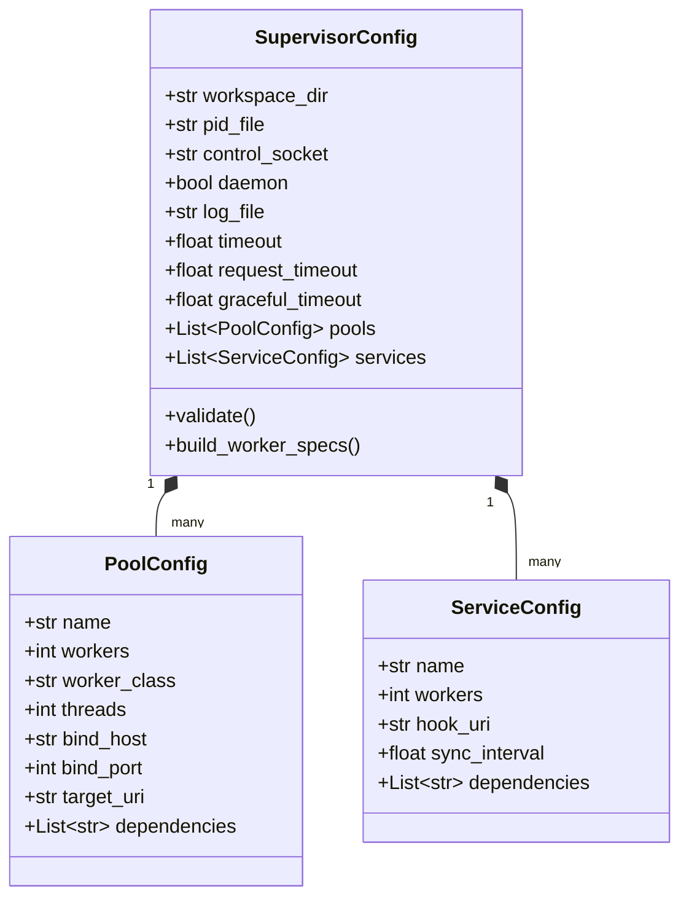

---

## 11.2 多様なフォーマットパーサー (JSON / TOML / Python)

`SupervisorConfig.from_file(path)` は拡張子を自動判別し、柔軟な設定記述を可能にします。

1. **JSON (`config/supervisor.json`)**:
   - 高速・機械生成が容易。
2. **TOML (`config/supervisor.toml`)**:
   - 人間可読性が高く、コメントを保持可能（`tomllib` 活用）。
3. **Python (`config/supervisor.py` / `gunicorn.conf.py`)**:
   - プログラマブルな動的フックや環境変数演算を記述可能。
4. **Module URI (`python:custom.config.module`)**:
   - パッケージ化された設定モジュールから直接ロード。

---

## 11.3 自動構成ディスカバリ機構

設定パスが明示されない場合、Arbiter はプロジェクトルートから標準設定ファイルを自動探索します（`auto_discover()`）。
1. `supervisor.conf.py`
2. `config/supervisor.json`
3. `config/supervisor.toml`
4. `gunicorn.conf.py`

---

## 11.4 設定エンジンの要約

- JSON, TOML, Python スクリプトに対応し、ポート番号・タイムアウト・依存関係のバリデーションを起動前に厳格実施。

---

# 12. CLI 運用・コマンドリファレンスと運用プラクティス

## 12.1 CLI コマンド体系一覧

```
supervisor [-c CONFIG] [-s CONTROL_SOCKET] <command> [OPTIONS]
```

| サブコマンド | 概要 | 主なオプション |
| :--- | :--- | :--- |
| **`start`** | クラスタを起動 | `-b/--bind`, `-w/--workers`, `-k/--worker-class`, `-D/--daemon`, `--log-file`, `--pid` |
| **`status`** | クラスタ状態・全ワーカーメトリクスを取得 | なし (JSON 形式出力) |
| **`top`** | リアルタイム ANSI プロセス監視 TUI | `-i/--interval`, `-1/--once`, `--no-color` |
| **`scale`** | 特定プールのワーカー数を動的変更 | `-w/--workers <count>` (必須), `-p/--pool <name>` |
| **`reload`** | ゼロダウンタイム・ローリングリスタート | なし |
| **`stop`** | クラスタのグレースフル停止 | なし |
| **`ping`** | Arbiter との UDS 疎通確認 | なし (PONG / FAILED) |

---

## 12.2 実運用コマンドフロー

### 1. デーモンモードでのクラスタ起動
```bash
PYTHONPATH=src .venv/bin/python -m supervisor.cli -c config/supervisor.json start -D
# または Makefile
make start_supervisor
```

### 2. 稼働状況の確認 & リアルタイム監視
```bash
# JSON ステータス
PYTHONPATH=src .venv/bin/python -m supervisor.cli status

# リアルタイム Top ダッシュボード
PYTHONPATH=src .venv/bin/python -m supervisor.cli top
```

### 3. トラフィック急増時の動的スケーリング
```bash
# Web ワーカーを 2 -> 4 プロセスに即時拡張
PYTHONPATH=src .venv/bin/python -m supervisor.cli scale -p web -w 4
```

### 4. 無停止デプロイ（ローリングリロード）
```bash
PYTHONPATH=src .venv/bin/python -m supervisor.cli reload
```

### 5. 安全停止
```bash
PYTHONPATH=src .venv/bin/python -m supervisor.cli stop
```

---

## 12.3 トラブルシューティング手順書

### Q1. `RuntimeError: Supervisor arbiter is already running with PID ...` が発生する
- **原因**: 既存の Arbiter が稼働中、または前回の強制終了により PID ファイルが残存。
- **対処**:
  1. `supervisor status` または `ps aux | grep supervisor` で生存確認。
  2. プロセスが存在する場合は `supervisor stop` または `kill -TERM <PID>`。
  3. 残骸ファイルの場合は `rm outputs/supervisor/arbiter.pid` を実行して再起動。

### Q2. `Supervisor control socket not found` で CLI 操作が失敗する
- **原因**: Arbiter が起動していないか、ソケットパスが異なる。
- **対処**:
  1. `outputs/supervisor/supervisor.log` で起動ログを確認。
  2. `-s outputs/supervisor/control.sock` を明示指定して実行。

---

## 12.4 運用の要約

- 統一された CLI と Makefile ターゲットにより、起動から監視、動的スケーリング、無停止デプロイまでをワンストップで実行可能。

---

# 13. 次世代実装ロードマップと品質保証

## 13.1 品質ゲート基準と検証結果

`src/supervisor/` サブシステムは、プロジェクトの厳格な品質ゲートを満たしています。

```
========================================================================================
[Quality Gate Status: PASS 100%]
1. Python Syntax & Type Checking:
   - mypy (strict mode): 0 errors across all supervisor modules
   - flake8 / black / isort: 100% compliant
2. Cyclomatic & Maintainability Complexity:
   - Xenon Complexity: Grade A/B (No Grade C functions)
3. Automated Test Coverage:
   - tests/supervisor/: 10 Suites / 38 Tests PASS (100% Green)
   - Covered: Arbiter, Config, Contracts, Control, DAG, Heartbeat, ServiceWorker, Top, Workers
========================================================================================
```

---

## 13.2 今後の進化計画

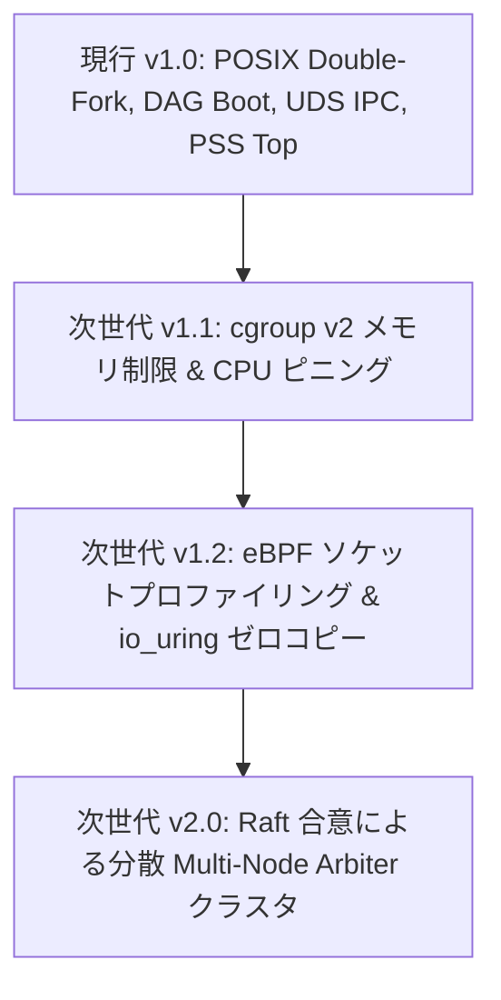

1. **Linux cgroup v2 メモリリミット統合**:
   - 各ワーカープロセスに対するハードメモリ上限（`memory.max`）の設定と OOM キラー保護。
2. **`io_uring` ゼロコピーソケット I/O**:
   - 高負荷 HTTP 転送におけるカーネル・ユーザー空間コンテキストスイッチの完全排除。
3. **分散 Arbiter クラスタリング**:
   - `DSN-05` の Raft 合意エンジンと連携した、複数マシンを跨ぐ分散プロセススーパーバイザーへの拡張。
