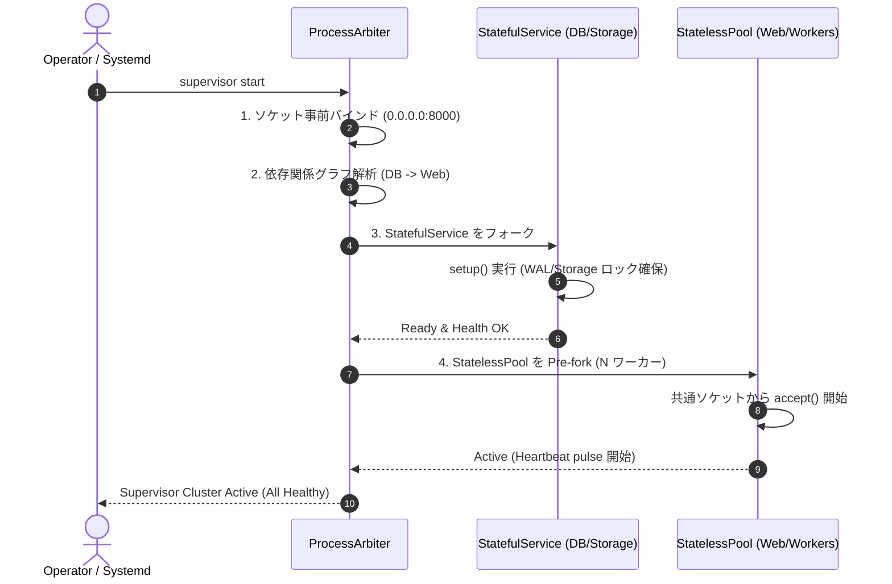
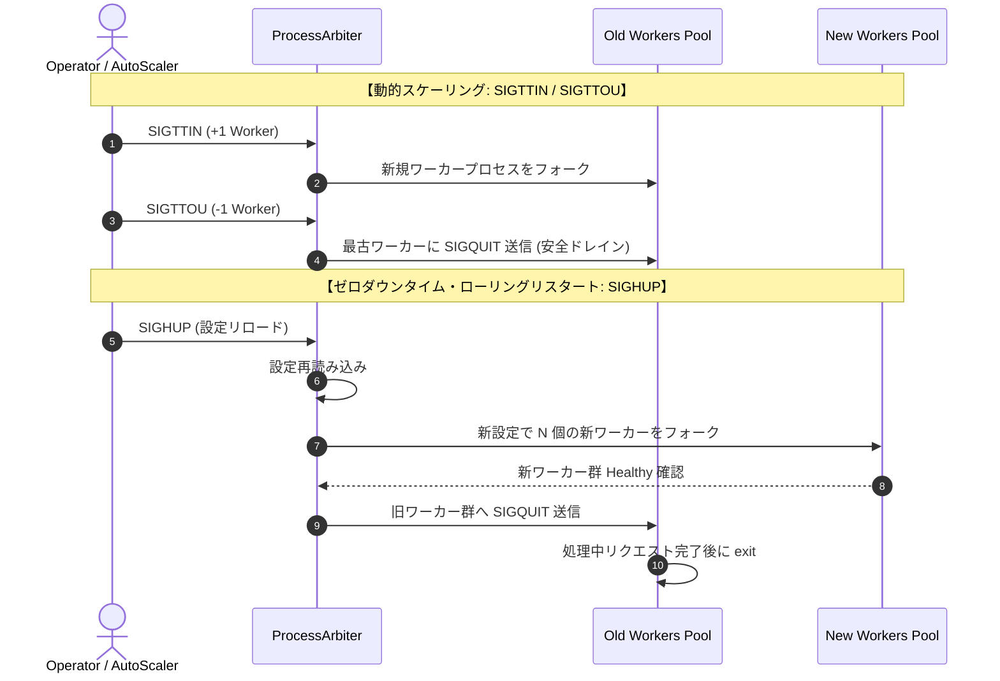
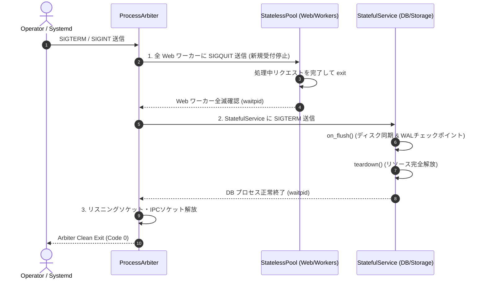

# DSN-12: 汎用プロセススーパーバイザー & 調停基盤 (Universal Process Arbiter & Supervisor Tree)

## 1. エグゼクティブサマリー (Executive Summary)

本ドキュメント（DSN-12）は、**Gunicorn** の Pre-fork ワーカーモデル、Erlang/OTP の Supervisor ツリー、および Systemd の依存関係順序制御を統合し、**Web サーバ、データベース、メッセージキューコンシューマ、バッチスケジューラ、AI/ML 推論パイプラインなど、あらゆる種類のアプリケーションプロセスを統一的に統括管理・動的スケーリング・自己回復させる汎用プロセス調停基盤（`src/supervisor/`）** の具象設計仕様書です。

---

## 2. Gunicorn の機能体系整理 (Gunicorn Architecture Breakdown)

Gunicorn (Green Unicorn) は、Ruby の Unicorn プロジェクトから着想を得た Python WSGI HTTP サーバーです。そのコアアーキテクチャは以下の 7 つの柱で構成されています。

```
                    ┌─────────────────────────────────────────┐
                    │       Gunicorn Master (Arbiter)         │
                    │   - Never handles client sockets        │
                    │   - Traps POSIX signals                 │
                    │   - Monitors worker heartbeats via /tmp │
                    └────────────────────┬────────────────────┘
                                         │
                 ┌───────────────────────┼───────────────────────┐
                 ▼                       ▼                       ▼
         ┌───────────────┐       ┌───────────────┐       ┌───────────────┐
         │ Sync Worker 1 │       │ Gthread Wk 2  │       │ Async Worker 3│
         │ (1 req/proc)  │       │ (ThreadPool)  │       │ (AsyncIO)     │
         └───────────────┘       └───────────────┘       └───────────────┘
```

### Gunicorn の 7 つのコア機能
1. **Pre-fork Server Model**:
   - 親プロセス（Arbiter）がリスニングソケット（TCP / Unix Domain Socket）を事前バインドし、子プロセス（Workers）がそのソケットファイルディスクリプタを共有して直接 `accept()` を競合・分散処理する。
2. **Arbiter の単一責任原則**:
   - Arbiter 自身は HTTP リクエストや個別のクライアントソケットの読み書きを一切行わず、ワーカーの生成・監視・シグナル配送・死活判定に専念する。
3. **プラグイン式並行ワーカータイプ**:
   - `sync` (同期単一リクエスト), `gthread` (スレッドプール並行), `eventlet`/`gevent` (コルーチン/Greenlet), `uvicorn.workers.UvicornWorker` (ASGI/AsyncIO), `tornado` (Tornado IOLoop)。
4. **POSIX シグナル駆動制御**:
   - `TTIN` / `TTOU`（ワーカー数の動的増減）、`CHLD`（クラッシュ検知と自動再起動）、`HUP`（設定再読込とゼロダウンタイム・ローリングリスタート）、`TERM` / `INT`（グレースフル停止）、`QUIT`（即時ドレイン停止）、`USR1`（ログ再オープン）。
5. **Heartbeat & Watchdog 機構**:
   - 各ワーカーがテンポラリファイル（`/tmp` 上の tmpfs）に定期的にタイムスタンプを更新（`os.fchmod`）。Arbiter が `timeout`（デフォルト30秒）を超過した無応答ワーカーを `SIGABRT`/`SIGKILL` で強制回収し、即時代替プロセスをフォーク。
6. **OS カーネル負荷分散**:
   - ソケット共有により、OS カーネルのスケジューラ（`SO_REUSEPORT` / `epoll`）がクライアント接続を待機中ワーカーへ自然分散。
7. **スケーリング経験則**:
   - 推奨ワーカー数フォーミュラ: $\text{workers} = (2 \times \text{CPU Cores}) + 1$。

---

## 3. 主要プロセス管理システムとの徹底比較表 (Comprehensive Comparison)

| 観点 / 機能項目 | Gunicorn (v23+) | Supervisord / Circus | Systemd | **本設計: DSN-12 (Universal Arbiter)** |
| :--- | :--- | :--- | :--- | :--- |
| **管理対象アプリケーション** | Python WSGI / ASGI Web アプリのみ | 任意の汎用コマンド・プロセス | OS 全体のシステムサービス | **Web, DB, Queue, Batch, AI推論 等あらゆる任意アプリ** |
| **並行処理モデル** | Pre-fork (Sync, Gthread, Async) | 個別プロセスの並列起動 | プロセス単位の cgroups 管理 | **Pre-fork Pool + Stateful Singleton のハイブリッド** |
| **ステートフル / ステートレス両対応** | ✕ (ステートレスWebのみ) | △ (設定順序制御はあるがアプリ協調なし) | ◯ (Unit 依存関係定義) | **◯ (StatelessPool と StatefulService の完全抽象化)** |
| **ライフサイクル依存関係順序制御** | ✕ (なし) | △ (priority による簡易順序) | ◯ (Requires, After, Wants) | **◯ (有向グラフによるトポロジカル順序起動 & 逆順ドレイン停止)** |
| **動的ワーカー増減** | ◯ (`SIGTTIN` / `SIGTTOU`) | △ (XML-RPC経由でnumprocs調整) | ✕ (手動設定変更) | **◯ (`SIGTTIN`/`SIGTTOU` + Unix Socket JSON-RPC API)** |
| **ゼロダウンタイム更新** | ◯ (`SIGHUP` ローリングリスタート) | ✕ (停止 $\to$ 起動のダウンタイム) | ✕ (Reload は個別ユニット依存) | **◯ (新ワーカー先行起動 $\to$ 旧ワーカー安全ドレイン入替)** |
| **死活監視 & ハング自動回復** | ◯ (tmpfs ファイルタイムスタンプ) | △ (プロセスの生存確認のみ) | ◯ (WatchdogSec による notify) | **◯ (ミリ秒精度メモリ/ファイル Watchdog + 自動 SIGKILL 再起動)** |
| **コントロールインターフェース** | シグナルのみ | XML-RPC / HTTP Web UI | `systemctl` / D-Bus | **POSIX Signals + Unix Domain Socket JSON-RPC CLI** |
| **組み込み / 配布容易性** | CPython ライブラリ | 外部 Python デーモン | Linux カーネル・ディストリ標準 | **ゼロ外部依存 純粋 Python ライブラリ / スタンドアロン実行両対応** |

---

## 4. 具象的アーキテクチャ設計 (Concrete Architecture)

### 4.1 全体トポロジーと抽象階層

```
                          ┌──────────────────────────────────────────────┐
                          │         POSIX Signals & Admin IPC            │
                          │   [SIGHUP, SIGTERM, SIGTTIN, SIGTTOU]        │
                          └──────────────────────┬───────────────────────┘
                                                 │
                                                 ▼
                         ┌───────────────────────────────────────────────┐
                         │           ProcessArbiter (Master)             │
                         │   - Pre-binds & manages listening sockets     │
                         │   - Manages Dependency DAG & Lifecycle Hooks  │
                         │   - Watchdog: Tracks Heartbeat timestamps     │
                         │   - IPC Server: Unix Socket (/tmp/arbiter.sock│
                         └───────┬───────────────────────────────┬───────┘
                                 │                               │
                (Ordered Phase 1)│                               │(Ordered Phase 2)
                                 ▼                               ▼
     ┌────────────────────────────────────────┐ ┌────────────────────────────────────────┐
     │      Stateful Services (Singletons)    │ │      Stateless Worker Pools (Pre-Fork) │
     │  - Storage / Vector DB Service         │ │  - Web WSGI/ASGI Pool (:8000) (Sync/Thr)│
     │  - Distributed Raft / Gossip Service   │ │  - Background Queue Consumer Pool      │
     │  - Periodic Cron / Batch Service       │ │  - AI / ML Pipeline Ingestion Pool     │
     │  [LifecycleHook: setup->health->flush] │ │  [WorkerDriver: socket/queue consume]  │
     └────────────────────────────────────────┘ └────────────────────────────────────────┘
```

---

## 5. 抽象クラス・インターフェース仕様 (Concrete Interface Specifications)

### 5.1 サービス役割と状態契約 (`src/supervisor/contracts.py`)

```python
class ServiceRole(enum.Enum):
    STATELESS_POOL = "STATELESS_POOL"       # 負荷分散・水平スケール可能なワーカー群 (Web, Queue)
    STATEFUL_SERVICE = "STATEFUL_SERVICE"   # 単一性・整合性を要する常駐サービス (DB, Cache, Raft)
    ONESHOT_TASK = "ONESHOT_TASK"           # 完了後に終了するバッチタスク

class ServiceState(enum.Enum):
    INITIALIZING = "INITIALIZING"           # 初期化中
    READY = "READY"                         # 依存解決完了・待機中
    ACTIVE = "ACTIVE"                       # 稼働中 (リクエスト/タスク処理中)
    DRAINING = "DRAINING"                   # 新規受付停止・残存処理完了待ち
    STOPPED = "STOPPED"                     # 正常終了
    FAILED = "FAILED"                       # 異常終了
```

### 5.2 汎用ライフサイクルフック契約 (`LifecycleHook`)

```python
class LifecycleHook(abc.ABC):
    """
    あらゆる常駐サービス（DB, キャッシュ, メッセージキュー, バッチ）が実装する汎用契約。
    """
    @abc.abstractmethod
    def setup(self) -> bool:
        """起動時先行処理 (ストレージ確保, WALリカバリ, ポート開放等)。成功時 True。"""
        raise NotImplementedError

    @abc.abstractmethod
    def health_check(self) -> bool:
        """ミリ秒精度の健全性判定 (ヘルスチェック)。合格時 True。"""
        raise NotImplementedError

    def on_flush(self) -> None:
        """定期的またはシャットダウン直前に実行するディスク同期・チェックポイント。"""
        pass

    @abc.abstractmethod
    def teardown(self) -> None:
        """安全停止処理 (接続切断, ロック解放, 状態保存)。"""
        raise NotImplementedError
```

### 5.3 汎用ワーカー実行モデル (`WorkerDriver`)

```python
class BaseWorker(abc.ABC):
    """
    すべてのワーカー（同期Web, スレッドWeb, AsyncIO, キューコンシューマ, DB）の共通基底。
    """
    def __init__(self, worker_id: str, config: SupervisorConfig, ...):
        self.worker_id = worker_id
        self.pid = os.getpid()
        self.alive = True
        self.requests_handled = 0

    def init_signals(self) -> None:
        """SIGQUIT (Drain), SIGTERM (Stop), SIGINT (Stop) を安全にトラップ。"""

    def pulse(self, metadata: Optional[Dict[str, Any]] = None) -> None:
        """Watchdog に対しタイムスタンプとメトリクスを通知。"""

    @abc.abstractmethod
    def run(self) -> None:
        """メインループ (ソケット accept, キュー pop, イベントループ等)。"""
        raise NotImplementedError
```

---

## 6. アプリケーション別 具象アダプタ設計 (Concrete Application Adapters)

本スーパーバイザーは、以下の 5 大ユースケースを標準アダプタ経由で透過的にサポートします：

```
                    ┌──────────────────────────────────────────────────┐
                    │               Supervisor Target Adapters         │
                    └───────┬──────────────┬──────────────┬────────────┘
                            │              │              │
         ┌──────────────────┴──┐    ┌──────┴───────┐    ┌─┴─────────────────┐
         ▼                     ▼    ▼              ▼    ▼                   ▼
  [WSGI / ASGI Adapter] [Queue Worker] [Storage Engine] [Cron / Periodic] [AI Pipeline]
  - Web Server          - Celery/Kafka - VectorDB / SQL - Periodic Ingestion- Realtime Model
```

1. **HTTP / Web Server アダプタ**:
   - `SyncWorker`: 同期 1 リクエスト/プロセス。
   - `GthreadWorker`: `concurrent.futures.ThreadPoolExecutor` によるスレッド並行 & Keep-Alive。
   - `AsyncWorker`: `asyncio` ネイティブイベントループ。
2. **Database / Storage アダプタ**:
   - `ManagedServiceWorker`: `setup()` で WAL リカバリ検証、`on_flush()` で 2 秒間隔のファジーチェックポイント、`teardown()` で ARIES クリーンシャットダウン。
3. **Queue Consumer / Event Stream アダプタ**:
   - ソケットを持たず、メッセージブローカー（Kafka, Redis, RabbitMQ, In-memory Queue）から連続デキューするステートレスプール。`SIGQUIT` 受信時に現在処理中のメッセージを完了して安全終了（ACK 欠落防止）。
4. **Periodic Scheduler / Cron アダプタ**:
   - 定期インターバルでタスクをディスパッチするサービス。
5. **AI / ML Batch Ingestion アダプタ**:
   - arXiv / IACR 等の論文フェッチ、全文抽出、埋め込みベクトル生成パイプライン。

---

## 7. ライフサイクルシーケンスと有向グラフ制御 (Directed Lifecycle Sequencing)

### 7.1 起動シーケンス (Ordered Boot)


### 7.2 動的スケーリング & ローリングリスタート


### 7.3 グレースフル停止シーケンス (Ordered Shutdown)


---

## 8. IPC コントロールプロトコル仕様 (JSON-RPC Specification)

Arbiter は Unix Domain Socket (`outputs/supervisor/control.sock`) 上で以下の標準 JSON メッセージプロトコルを提供します：

### 1. `ping` (疎通確認)
- Request: `{"cmd": "ping"}`
- Response: `{"status": "ok", "message": "pong", "timestamp": 1724371200.0}`

### 2. `status` (クラスター状態テレメトリ)
- Request: `{"cmd": "status"}`
- Response:
  ```json
  {
    "status": "ok",
    "arbiter_pid": 48120,
    "uptime_seconds": 3600.5,
    "pools": {
      "web": {
        "target_workers": 4,
        "active_workers": 4,
        "worker_class": "gthread",
        "bind": "0.0.0.0:8000"
      }
    },
    "services": {
      "database": {
        "state": "ACTIVE",
        "is_healthy": true,
        "flushes": 1800
      }
    },
    "workers": {
      "48122": { "pid": 48122, "type": "gthread", "requests_handled": 1420, "is_healthy": true, "idle_seconds": 0.2 },
      "48123": { "pid": 48123, "type": "gthread", "requests_handled": 1390, "is_healthy": true, "idle_seconds": 0.1 }
    }
  }
  ```

### 3. `scale` (動的プール伸縮)
- Request: `{"cmd": "scale", "pool": "web", "workers": 8}`
- Response: `{"status": "ok", "pool": "web", "target_workers": 8}`

### 4. `reload` (ローリングリスタート)
- Request: `{"cmd": "reload"}`
- Response: `{"status": "ok", "message": "Rolling reload triggered"}`

### 5. `stop` (グレースフル停止)
- Request: `{"cmd": "stop"}`
- Response: `{"status": "ok", "message": "Shutdown sequence initiated"}`

---

## 9. リアルタイム・プロセスモニタリングダッシュボード (`top`) 仕様

Arbiter および各 Worker のライフサイクル・メモリ使用状況・ヘルス状態を端末上で視覚的に監視するため、対話型 ANSI ターミナルモニタリングサブコマンド `top` を提供します。

### 9.1 コマンド体系 & Makefile 統合
```bash
# リアルタイム更新モード (デフォルト: 1.0秒間隔リフレッシュ)
PYTHONPATH=src .venv/bin/python -m supervisor.cli top

# ワンショット出力モード (CI/スクリプト用)
PYTHONPATH=src .venv/bin/python -m supervisor.cli top --once

# 更新間隔指定 (例: 0.5秒)
PYTHONPATH=src .venv/bin/python -m supervisor.cli top --interval 0.5

# Makefile ターゲット
make top_supervisor
make top_supervisor ARGS="--once"
```

### 9.2 ダッシュボード描画レイアウト
Linux の `/proc/<pid>/status` (VmRSS) から物理メモリ使用量を動的取得し、IPC `status` テレメトリと統合した ANSI 構造化テーブルを出力します。

```text
⚡ [Supervisor Process Top Monitor]  2026-08-23 14:10:00
──────────────────────────────────────────────────────────────────────────────
  Arbiter PID: 10922     Uptime: 01m 45s        Memory: 42.5 MB
  Binding:     0.0.0.0:8000       Class:  sync       Workers: Web: 9/9, DB: 1
──────────────────────────────────────────────────────────────────────────────
  PID            TYPE               STATUS           HEALTH           REQ      IDLE       RSS MEM
  ──────────────────────────────────────────────────────────────────────────
  10989          database           ALIVE            HEALTHY          0        0.3s       38.2 MB
  10990          sync               ALIVE            HEALTHY          142      0.1s       41.0 MB
  10991          sync               ALIVE            HEALTHY          138      0.2s       40.8 MB
  10992          sync               ALIVE            HEALTHY          140      0.1s       40.9 MB
  10993          sync               ALIVE            HEALTHY          135      0.2s       40.7 MB
──────────────────────────────────────────────────────────────────────────────
  Press Ctrl+C to exit top monitoring.
```

### 9.3 設計上の特徴と安全性
1. **ゼロ外部依存 (Zero Dependencies)**:
   - `psutil` や `curses` などの外部 C 拡張ライブラリを一切使わず、標準ライブラリ（`os`, `sys`, `time`, `json`）および Linux `/proc` ファイルシステムのみで構成。
2. **非破壊・低負荷ポーリング**:
   - Unix Domain Socket 経由でメモリ上の最新スナップショットを取得するため、稼働中ワーカーの HTTP/DB 処理性能に影響を与えません。
3. **安全なシグナル離脱**:
   - `KeyboardInterrupt` (Ctrl+C) を安全にトラップし、端末エコーや画面を破損させることなく即座にシェルへ復帰します。

---

## 10. CLI 運用コマンド・リファレンス (CLI Operations & Command Reference)

本システムは、Makefile および Python CLI (`src/supervisor/cli.py`) を通じて、起動・状態照会・リアルタイム監視・動的スケーリング・ローリング再起動・安全停止の全ライフサイクル操作を完全網羅しています。

### 10.1 起動コマンド (Cluster Startup)

#### 1. 標準起動 (フォアグラウンド)
```bash
# Makefile 経由での起動 (デフォルト設定: CPUコア数に応じたワーカー数 + DBワーカー)
make run_supervisor

# Python CLI 直接起動
PYTHONPATH=src .venv/bin/python -m supervisor.cli start
```

#### 2. カスタムパラメータ指定起動
```bash
# バインドポート・ワーカー数を指定して起動
PYTHONPATH=src .venv/bin/python -m supervisor.cli start -b 0.0.0.0:8000 -w 4

# マルチスレッドワーカー (gthread) で起動 (1プロセスあたり4スレッド)
PYTHONPATH=src .venv/bin/python -m supervisor.cli start -b 0.0.0.0:8000 -w 2 -k gthread -t 4

# 非同期ワーカー (asyncio) で起動
PYTHONPATH=src .venv/bin/python -m supervisor.cli start -b 0.0.0.0:8000 -w 4 -k async

# 設定ファイル (JSON / TOML / Python) を指定して起動
PYTHONPATH=src .venv/bin/python -m supervisor.cli --config config/supervisor.json start
```

#### 3. 単一ウィンドウでのバックグラウンド起動＆初期化待機ワンライナー
起動完了（IPC コントロールソケットの生成）を自動待機し、確実にステータスを取得します。

```bash
# Makefile 連携ワンライナー
make run_supervisor & until [ -S outputs/supervisor/control.sock ]; do sleep 0.5; done && make status_supervisor

# Python CLI 直接ワンライナー
PYTHONPATH=src .venv/bin/python -m supervisor.cli start & until [ -S outputs/supervisor/control.sock ]; do sleep 0.5; done && PYTHONPATH=src .venv/bin/python -m supervisor.cli status
```

---

### 10.2 稼働状態確認 & モニタリング (Status & Monitoring)

```bash
# 1. JSON 形式でのクラスター状態照会 (Uptime, 全ワーカーPID, ヘルス状態)
make status_supervisor
# または
PYTHONPATH=src .venv/bin/python -m supervisor.cli status

# 2. リアルタイム TUI / ANSI ダッシュボード (1秒間隔更新, Ctrl+C で離脱)
make top_supervisor
# または
PYTHONPATH=src .venv/bin/python -m supervisor.cli top

# 3. Top ダッシュボードのワンショット出力 (スクリプト / CI 確認用)
make top_supervisor ARGS="--once"
# または
PYTHONPATH=src .venv/bin/python -m supervisor.cli top --once

# 4. Arbiter IPC 疎通確認 (PONG 判定)
PYTHONPATH=src .venv/bin/python -m supervisor.cli ping
```

---

### 10.3 動的制御・スケーリング・安全停止 (Dynamic Lifecycle Operations)

同一ターミナルや別セッションから、IPC Unix Domain Socket (`outputs/supervisor/control.sock`) 経由でクラスターをノンブロッキング制御できます。

```bash
# 1. ワーカー数の動的スケーリング (例: 4プロセスにリサイズ)
PYTHONPATH=src .venv/bin/python -m supervisor.cli scale -w 4

# 2. ゼロダウンタイム・ローリングリロード (SIGHUP: 新ワーカー先行起動 -> 旧ワーカー安全ドレイン)
PYTHONPATH=src .venv/bin/python -m supervisor.cli reload

# 3. クラスターのグレースフルシャットダウン (Webワーカー安全ドレイン -> DBバッファフラッシュ -> 終了)
PYTHONPATH=src .venv/bin/python -m supervisor.cli stop
```

---

### 10.4 Makefile ターゲット一覧

| ターゲット | 実行内容 | 備考 |
| :--- | :--- | :--- |
| `make run_supervisor` | `supervisor.cli start` | Arbiter および Worker プールを起動 |
| `make status_supervisor` | `supervisor.cli status` | IPC 経由で稼働状態 JSON を取得・表示 |
| `make top_supervisor` | `supervisor.cli top` | リアルタイム ANSI プロセス監視ダッシュボードを表示 |
| `make top_supervisor ARGS="--once"` | `supervisor.cli top --once` | プロセス監視ダッシュボードを1回出力して終了 |
